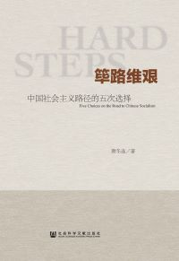
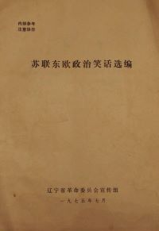
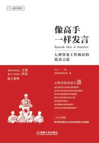
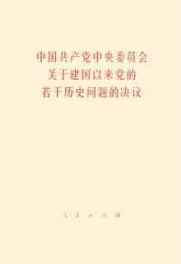
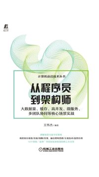
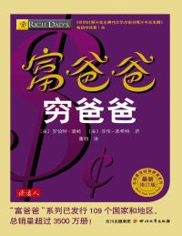
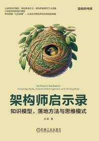

# reading

## report

报告、讲话放在下面的表中，格式：报告名，报告人，会议，时间

| 报告名 | 报告人 | 会议 | 时间 |
|---|---|---|---|
| [关于正确处理人民内部矛盾的问题](report/1957/02/570227-mzd/README.md) | 毛泽东 | 最高国务会议第十一次（扩大）会议 | 1957-2-27 |
| [怎样当好一名师长](report/1936/12/3612-lb/README.md) | 林彪 |  | 1936-12 |
| [林彪谈读书](report/1960/10/6010-lb/README.md) | 林彪 | 全军高级干部会议 | 1960-10 |
| [关于修改党章的报告](report/1973/08/3001-1379/README.md) | 王洪文 | 中国共产党第十次全国代表大会 | 1973-08-24 |
| [为人民服务](report/1944/09/440908-mzd/README.md) | 毛泽东 | | 1944-09-08 |
| [纪念白求恩](report/1939/12/391221-mzd/README.md) | 毛泽东 | | 1939-12-21 |
| [葛底斯堡演说](report/1863/11/631119-lincoln/README.md) | 林肯 | 葛底斯堡国家公墓揭幕式 | 1863-11-19 |
| [周恩来总理在亚非会议全体会议上的补充发言](report/1955/04/550419-zel/README.md) | 周恩来 | 万隆会议 | 1955-04-19 |
| [2024年年终回顾和2025年展望——对冲风险VS软着陆](report/2024/11/241124-fp/README.md) | 付鹏 | 2024汇丰私人财富规划 | 2024-11-24 |
| [孤臣可弃，但绝不折节](report/2015/10/151017-hxj/README.md) | 洪秀柱 | “临时全国代表大会” | 2015-10-17 |

## book

书籍类都放在下面表里，格式：书名+作者+出版社+出版时间+封面；同时生成的文件也以出版时间为路径

| 书名 | 作者 | 出版社 | 出版时间 | 封面 |
|---|---|---|---|---|
| [筚路维艰：中国社会主义路径的五次选择](book/2014/10/978-7-5097-6324-7/README.md) | 萧冬连 | 社会科学文献出版社 | 2014-10 |  |
| [苏 联 东 欧 政 治 笑 话 选 编](book/1975/07/sldozzxhxb/README.md) |  | 辽宁省革命委员会宣传组 | 1975-07 |  |
| [像高手一样发言：七种常见工作场景的说话之道](book/2021/10/978-7-111-66385-0/README.md) | 久久 | 机械工业出版社 | 2021-10 |  |
| [关于建国以来党的若干历史问题的决议](book/1981/07/3001-1794/README.md) |  | 人民出版社 | 1981-07 |  |
| [从程序员到架构师：大数据量、缓存、高并发、微服务、多团队协同等核心场景实战](book/2022/03/978-7-111-69984-2/README.md) | 王伟杰 | 机械工业出版社 | 2022-03 |  |
| [富爸爸穷爸爸](book/2014/01/978-7-5411-3812-6/README.md) | 罗伯特·清崎 / 莎伦·莱希特 | 四川文艺出版社 | 2014-01 |  |
| [架构师启示录：知识模型、落地方法与思维模式](book/2024/03/978-7-111-74908-0/README.md) | 灵犀 | 机械工业出版社 | 2024-03 |  |

## biography

| 传名 | 作者 | 史书 |
|:---:|---|---|
| [刘盆子列传](biography/houhanshu/liupenzizhuan/README.md) | 范晔 | 后汉书 |
| [刘牢之传](biography/jinshu/liulaozhi/README.md) | 房玄龄 | 晋书 |

## poem

| 诗词歌赋 | 作者 | 出处 |
|:---:|---|---|
| [枯树赋](poem/yuxin/kushufu/README.md) | 庾信 | 庾子山集 |
| [别赋](poem/jiangyan/biefu/README.md) | 江淹 | 文选 |
