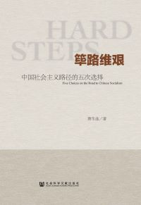
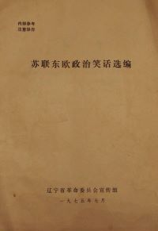

# reading

## report

报告、讲话放在下面的表中，格式：报告名，报告人，会议，时间

| 报告名 | 报告人 | 会议 | 时间 |
|---|---|---|---|
| [关于正确处理人民内部矛盾的问题](report/1957/02/570227-mzd/README.md) | 毛泽东 | 最高国务会议第十一次（扩大）会议 | 1957-2-27 |
| [怎样当好一名师长](report/1936/12/3612-lb/README.md) | 林彪 |  | 1936-12 |
| [林彪谈读书](report/1960/10/6010-lb/README.md) | 林彪 | 全军高级干部会议 | 1960-10 |
| [关于修改党章的报告](report/1973/08/3001-1379/README.md) | 王洪文 | 中国共产党第十次全国代表大会 | 1973-08-24 |
| [为人民服务](report/1944/09/440908-mzd/README.md) | 毛泽东 | | 1944-09-08 |

## book

书籍类都放在下面表里，格式：书名+作者+出版社+出版时间+封面；同时生成的文件也以出版时间为路径

| 书名 | 作者 | 出版社 | 出版时间 | 封面 |
|---|---|---|---|---|
| [筚路维艰：中国社会主义路径的五次选择](book/2014/10/978-7-5097-6324-7/README.md) | 萧冬连 | 社会科学文献出版社 | 2014-10 |  |
| [苏 联 东 欧 政 治 笑 话 选 编](book/1975/07/sldozzxhxb/README.md) |  | 辽宁省革命委员会宣传组 | 1975-07 |  |
| [像高手一样发言：七种常见工作场景的说话之道](book/2021/10/978-7-111-66385-0/README.md) | 久久 | 机械工业出版社 | 2021-10 |  |
