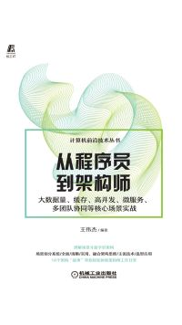

# reading

## report

报告、讲话放在下面的表中，格式：报告名，报告人，会议，时间

| 报告名 | 报告人 | 会议 | 时间 |
|---|---|---|---|
| [关于正确处理人民内部矛盾的问题](report/1957/02/570227-mzd/README.md) | 毛泽东 | 最高国务会议第十一次（扩大）会议 | 1957-2-27 |
| [怎样当好一名师长](report/1936/12/3612-lb/README.md) | 林彪 |  | 1936-12 |
| [林彪谈读书](report/1960/10/6010-lb/README.md) | 林彪 | 全军高级干部会议 | 1960-10 |

## book

书籍类都放在下面表里，格式：书名+作者+出版社+出版时间+封面；同时生成的文件也以出版时间为路径

| 书名 | 作者 | 出版社 | 出版时间 | 封面 |
|---|---|---|---|---|
| [筚路维艰：中国社会主义路径的五次选择](book/2014/10/978-7-5097-6324-7/README.md) | 萧冬连 | 社会科学文献出版社 | 2014-10 |  |
| [从程序员到架构师：大数据量、缓存、高并发、微服务、多团队协同等核心场景实战](book/2022/03/978-7-111-69984-2/README.md) | 王伟杰 | 机械工业出版社 | 2022-03 |  |
