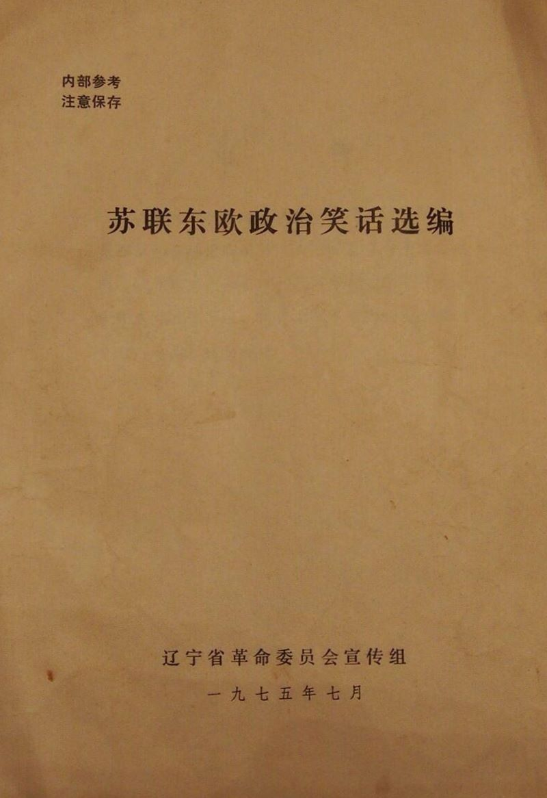

# 苏 联 东 欧 政 治 笑 话 选 编

- 出版社：辽宁省革命委员会宣传组
- 出版时间：1975-07
- 封面：

# 一、关于苏修新资产阶级特权阶层

## “全让党和国家吃光了，人民却在挨饿”

勃列日涅夫有三个孩子：一个男的，两个女的，他们都在学校学习。

有一次，他们回到家里，都很烦闷和不高兴。

勃列日涅夫见了，问道：“怎么回事？为什么都垂头丧气！？ ”

孩子们说： “今天我们觉得难为情，因为在课堂上没能答上老师提的问题。”

勃列日涅夫问： “什么问题？

大的说： “老师问我什么叫党？ ”

二的说： “我的问题是什么叫国家。”

最后，女孩子说： “给我提的问题是什么叫人民。”

勃列日涅夫生气了，说：“咳！你们这群笨蛋，连这么简单的问题都回答不出来？！你们都记着！要是他们再要问，你们就说：党就是我，也就是你们的爸爸！国家就是她，也就是你们的妈妈！而人民，就是你们，也就是我的孩子！你们就应当这样回答！”

为了惩罚孩子们，勃列日涅夫决定不让他们吃午饭，并让他们站在墙角。

勃列日涅夫和他妻子坐在桌子旁边，开始用餐， 吃饱喝足后，抬腿走出餐室。 而孩子们仍旧在那里饿着、站着。

当家庭服务员来打扫桌子时，她看见了孩子们，惊讶地问道：“孩子们，你们怎么不吃午饭呀？！"

孩子们异口同声地说：“全都让党和国家吃光了，而我们————人民却在挨饿。”

## “一天不干多少活，薪水却很高的人叫米尼斯特（部长）”

“不够尺寸的裙子叫什么？”

“叫米尼斯卡特（短裙）”。

“不够尺寸的小汽车模型呢？ ”

“叫米尼卡（小汽车）。两种都是时髦货色，虽然东西小，价钱可是大！”

“那我就明白了。一天不干多少活，可是薪水却很高的人就叫米尼斯特（部长）了。” 

## 他们“代表”我们喝了

外国人说：“你们喝不到白兰地，真遗撼！”

工人说：“不，我们已经通过政府官员喝到了，因为他们是我们的“代表”呀！”

## 劳动“英雄”不劳动

苏联第九次劳动英雄大会在莫斯科召开。绝大部分“劳动”英雄都没有到会，后来大会主席打电话到各集体农庄去问才知道：原来这些劳动英雄正在枕着“社会主义劳动英雄”纪念章睡大觉，就连那天的田间劳动也没有参加。

## “这些东西都是用贪污来的钱买的”

一个西方国家的首脑在苏联高级官员陪同下参观莫斯科市容。他们走到一个商店前面，看到好多人在排队。来访者问：“这是什么商店？”陪同者说：“这是储蓄所。来访者走近一看，门牌确实是“储蓄所”。客人走后，苏联高级官员走进肉店，连声夸奖肉店经理，并说要奖励他一件心爱的东西。肉店经理说：“一般的，你们有的，我都有，比如电冰箱、小汽车等等。我只有一个要求，就是不要处罚我，因为我这些东西都是用贪污来的钱买的。”

## “原来你是我们的人啊！”

一个小偷，刑满释放了。在外面呆了一段时间，觉得还不如在监狱里好，想回去，又没什么办法，就到一个老头那里讨主意。老头说：“这个好办，明天你到街上去对警察说‘勃列日涅夫是笨蛋!’警察就会把你送到你想去的地方”。

第二天，小偷冲着一个警察说：“勃列日涅夫是笨蛋！”说了几次，警察都无动于衷，小偷奇怪地问道：“怎么不把我抓起来呀？”警察说:“我只抓说谎话的人。”于是，小偷又去找老头，老头又出了个主意。老头说：“现在有一个党组织负责人的会。你到会上坦白，说你是小偷，事情就成了”。

小偷找到地方，进了会场，大声报告道：“我是小偷。”会议主席问：“偷了多少？”小偷随口答道：“五百卢布今"主席说：“出去，出去！这里都是大偷，偷了五百卢布没资格来开会。”

小偷生计艰难饿着肚子，急着要回监狱，又去找老头。这回老头让他到更高一级的党负责人会议上去喊“希特勒万岁”。小偷如此这般做了。会场里人却一齐拍手道：“欢迎，欢迎！原来你是我们的人啊！

# 二、关于假共产主义

## 对 比

在列宁领导的时代里，苏联人民好像走在一段隧道里，虽然寒冷、饥饿，有些混乱，但方向和前景很，明确，光明在前头，人们看的很清楚。

有在斯大林时代，苏联人民好象坐上一辆公交车，有做的，有站的，虽然在路途上受到些颠簸，但汽车在不停地前进。

在赫鲁晓夫统治时期，人们好象坐在汽车里，但这辆汽车始终向一个方向——右边倾斜，旅客们坐立不安。

在勃列日涅夫统治下，人们好象坐在出租小汽车里面，车越往前走，就越贵。（出租汽车跑的距离越远，所要付的价就越多，以此来表示物价和生活开支越来越高。）

## 三个幽灵

勃列日涅夫夜里出去散步，在街上遇到一个高大强壮的幽灵，勃列日涅夫问：“你怎么长得这样高大呀？”幽灵道：“我是彼得大帝时代的人。”勃列日涅夫继续向前走，又遇到一个幽灵，长得 比前一个要瘦小得多。勃列日涅夫问道：“你怎么长得这样小啊？” 幽灵说：“我是叶卡捷琳娜女皇时代的人。”

过了一会，迎面又来了一个人，面容枯槁憔悴，形同饿鬼。勃列日涅夫急忙问道：“喂，你这个幽灵，你当是沙皇尼古拉时代的人？”那人喝道：“去你妈的!我是刚下夜班回家的。”

## “共产主义”在“收音机里”

彼得罗夫：“我从收音机里听说我们正在生产大量的肉类、奶 类和黄油。可是，我的冰箱里却总是空空如也。我该怎么办呢？ ”

伊万诺夫：“把你的冰箱插头直接插在你的收音机上。”

## “共产主义”在。鸣笛上”

一艘苏联轮船在海里航行，船上挂的招牌是“通向共产主义”， 船长命令船员们拚命干活，但这艘船只是汽笛飞鸣，却停滞不前。 船员们去找船长问原因，船长回咨说：“因为这艘船百分之九十五 的动力，都用在鸣汽笛上了”。

## “算出来”的“共产主义”

苏联向美国购买了一台高级电子计算机。这台计算机什么都能 演算。有个苏联公民要求给算一算，什么时候苏联能够到达共产主义。经过一番运算之后，电子计算机的数字盘上显示出：“十五公里”。苏联技术人员看到电子计算机显示的不是时间而是距离，都 吃了一惊，以为电子计算机出了毛病。于是请了苏联专家检修，没有查出毛病。有人提议，这台计算机是美国货，还是请美国专家检 修要好一些。结果同样没查出什么名堂，机件完全正常。

大家围着电子计算机苦苦思索：“为什么得出十五公里呢？” 突然，他们中间有人大声喊道：“我明白了，我们的报刊不总是说 ，每一个五年计划是前进一步嘛’，十五公里就是根据这‘一步'、‘一步'算出来的！”

## “共产主义”是这样"实行的”

赫鲁晓夫规定一九七O年为最终实现共产主义的时刻，到那时将进入一切人什么东西都能充分获得的时代，货币将取消。

一天，一位老人来到一家商店，他问老板有多少睥酒口老板回答说：“二百桶”。老人全部都买下了，并说，“现在啤酒都属于我了，我要把啤酒留在你的店里，并送给你的顾客喝。”

当人们听说免费供应啤酒，他们就蜂拥而来，互相拥挤，争夺和殴打，打破盘子和窗户，把家具毁坏了。

整个商店都打烂了，啤酒也被抢光，人们便离去，而只剩下老人和老板在废墟上。

老板说，我有什么事对不起你，你把我弄成这个地步？

老人回答说：“我年纪很老了，我活不到实行共产主义的年代了。但我想在死前看到一次，到底它是如何实行的。”

## “生个社会主义的孩子好呢？还是生个资本主义的孩子？”

苏联今年一月（指一九七O年）的全国人口调查结果显示：在一九五九至一九七o年的十一年中，全国人口仅增加了百分之十五点八。若干地区，如俄罗斯共和国，且有人口减少的趋势。

一个记者为此去访问克里姆林宫的有关部门。他问道：“部长先生，你能告诉我为什么我国人口增加得这样少的原因么？ ”“那是因为人民不愿生孩子的缘故”部长回答。

“为什么呢？”记者问：“难道不满意我国的社会主义制度吗？”

“喔，绝不，绝不，”部长连忙说道：“他们只是感到犹豫而已。”

“犹豫？ ”

“是的，犹豫。”部长解释道：“他们普遍在犹豫，究竟生个社会主义的孩子好呢？还是生个资本主义的孩子？ ”

## 香 肠 为 何 飞 来 ？

某商店突然出现了香肠，人们都很奇怪，纷纷拥上来问： “为什么现在竟然出现了香肠？ ”答曰： “勃列日涅夫要参观商店。”

## “M”字几乎没有用了

有人问一位评论员，为什么克里姆林宫新颁布了一道命令，规定取消“M”这个字母？

答：因为《辞典》里“M”开头的词在我们苏联几乎没有用 了：没有牛奶、肉类、黄油、通心粉……没有马林科夫，没有莫洛托夫，难道单为米高扬而保留字母表里这个字头吗？ 

## 跳蚤为什么要到苏联去？

一只母鸡和一只跳蚤在苏、波边界相遇，跳蚤从波兰来，它问母鸡：“你为什么离开本国”，母鸡答道：“我奉命每年生六百个蛋，我办不到，因而外走。”然后问跳蚤为什么到苏联去，跳蚤答道：“在我们那里每个房间只睡一、两人，听说苏联经常十人一 间，我想那可太好了。”

## 公鸡、奶牛和绵羊怎么回来了？

勃列日涅夫结束访问印度时，英迪拉•甘地赠给他一只公鸡、一头奶牛和一只绵羊。

公鸡在苏联呆了不久就飞回印度。有人问它：“你怎么飞回来啦？”公鸡回答：“那里人人不分白昼黑夜都 在劳累，无须我啼叫唤醒他们。”过了不久，奶牛也回来了。有人问它“你怎么也回来啦？ ”奶牛回答：“那里牛奶奇缺，他们拚命挤我的奶，又不给喂食，我无法活下去了。”又过了不久，绵羊也跟着回来了（注：绵羊在俄国人的概念中是“笨蛋”的意思）。有人问它：“你怎么也回来啦？ ”绵羊回答说：“他们硬要拉我入党。”

## 没有文化，为何还要文化部？

对苏联作友好访问的尼泊尔国王曾对最高苏维埃主席团主席波德戈尔内说：“主席阁下，希望能够向我国提供潜水艇。”“陛下，象贵国那样的山国何以也需要潜水艇？ ”

国王以若无其事的表情回答了由于惊诧而进行反问的波德戈尔内主席。他说：“贵国不是也有文化部吗？”

## 我们这里没有《真理》

在莫斯科的街头，有个零售报纸的报摊。一个读者要来买报。

他问：“有《真理》吗？”

报摊的老太婆回答说：“我们这里没有《真理》。”

读者又问：“有《苏维埃俄罗斯》吗？力

老太婆答：“《苏维埃俄罗斯》已经出卖光了。”

读者再问：“还剩下什么？”
老太婆答：“只剩下《劳动》了。"

## “那本著作尚未发表”

莫斯科的某工厂，工人们为了工资过低，生活困难，实行罢工抗议。厂方束手无策，把事情报告上去，于是克里姆林宫派了一个 高级官员，前来处理。那官员-到，就对工人们咆哮：“罢工是违, 反马列主义的，是反革命的行为。” 

工人们反唇相讥：“那么我们每个月只靠六十卢布工资，而厂 长却拿一千七百卢布.难道是合乎马列主义的吗？

“正是如此，是合乎马列主义的。”

“市场上的西红柿卖到十二个卢布一公斤，也是合乎马列主义 的吗？ ”一个工人忍不住驳斥他。

“是的，也是合乎马列主义的。”

“什么？”工人们鼓噪起来了： “在哪一本书里？在哪一章？哪一节？ ”

那官员发现说溜了嘴，赶快自圆其说：“那本著作尚未发表。”

## “我要到苏联去！”

在一家苏联的小学校中，老师们忙得不可开交，一遍又一遍地教导孩子们当督学前来巡查时应该说些什么话。督学来到后，向学生们问了一些话，他们的答复使他深感满意——孩子们说，苏联人民住的房子，都是世界上最宽舒的住宅，公司里的商品应有尽有。

督学临走时，看到有一个年纪很小的男孩子在哭。督学显出一派仁慈的态度问他哭什么，那孩子呜咽着说：“我要到苏联去！"

# 三、关于苏修推行霸权主义

## 为了 “社会主义大家庭”

威尔逊，约翰逊、勃列日涅夫、诺沃提尼同乘一架飞机。但是，这架飞机在中途发生了故障，所以把重的行李都投下去了。尽管这样，还有危险。这时，首先是威尔逊喊了一声，“为女王陛下”，就跳下去了。紧接着，约翰逊也硬了一声，“为了自由和繁荣，也跳下去了。

这样，最后，勃列日涅夫看了一看，也喊了一声：“为了社会主义大家庭！”就把诺沃提尼推下去了。

## 世界上哪个国家最大?

甲：世界上哪个国家最大？

乙：匈牙利。

甲： （惊讶地）为什么？匈牙利只有一千多万人口，为什么说是最大呢？

乙：你不明白，苏联 “临时”驻军在我们这里已经走了十几年

了，还没有走出匈牙利，可见匈牙利之大呀

## “波苏是兄弟”

一位波兰人说：“波苏是邻居。”而另一位波兰人说：“你错了。波苏是兄弟！”

前者立即领悟地说：“对！时！邻居是可以选择的，兄弟是选择不了的。兄弟来拿东西是自然的。”

## “苏 联 的 共 产 主 义 ”

苏联的共产主义是镰刀、锤子加金星。他们也把这种共产主义给了我们波兰。你看，用镰刀卡住了我们的脖子，用锤子锤我们的头，那眼睛里可不全冒金星吗？ 

# 四、 “苏联和东欧人民反对修正主义的统治”

## “您的画像谁都不买”

有一次赫鲁晓夫顺便来到一家书店。

在书店的画像栏里只有他的画像。

他高兴地想： “只有我一个人的，啊，应当还要挂上列宁的，虽然仅仅为了装装样子。”

他立刻把书店的经理叫来，训斥他说： “为什么你只卖我一个人的画像，而没有一张列宁的呢？你们忘掉了他吗？外国人又要怎祥说呢？ ……”

目瞭口呆的经理忘掉了应注意的一切。连忙解释说：“尼基塔・谢尔盖耶维奇，关于列宁，我们没有忘，而事情是这样的：您的画像谁都不买，列宁的画像人们却争着抢购，简直使你来不及摆出来。”

## 尼基塔胡说八道

一个女公民生了四个小孩，赫鲁晓夫给他们取了名字：和平，人民，祖国和尼基塔（赫鲁晓夫的全名叫尼基塔，谢 ・赫鲁晓夫）。

隔了一年，赫鲁晓夫打电话给这位母亲，询问孩子们的情况。这位母亲说： “和平不见了，人民在哭，祖国在睡觉，尼基塔胡说八道。”

## 和猪在一起

赫鲁晓夫在职期间常访问集体农庄。有一天，在赫鲁晓夫视察养猪场的时候，当地的记者给他拍了一张照片。照片洗好后在编辑部却发生了一场纠纷。引起纠纷的原因是因为照片说明是这样写的：

“和猪在一起的赫鲁晓夫同志。”

总编辑说：“把我们党的领袖写成和猪在一起，这不礼貌。”

于是乎编辑部门都绞尽脑汁考虑怎样写才好。有一个记者提出:“那就写成和麻鲁晓夫在一起的猪，这样行吧？”因为这个建议也不算高明，所以没有被采纳。接着又提出了许多各式各样的建议，可是……

第二天，在报纸的头版头条上刊登了一幅很大的照片，下面的说明是这样写的：“左起第三个是赫鲁晓夫同志”。

## 如果斯大林复活

赫鲁晓夫和肯尼迪交谈，各自吹嘘。肯尼迪说美国医学发达有一种药片吃了可以复活。赫鲁晓夫说苏联体育发达，有人十分钟就可以从苏联跑到美国。肯尼迪要求兑现，赫鲁晓夫慌了手脚，召集文武大臣讨论对策。有人出了一个好主意说：“那好办，你先让肯尼迪把药拿出来，给斯大林吃了，如果斯大林复活，那你不用五分钟就可以从苏联跑到美国。”

## “你不害怕红军回来吗？ ”

勃列日涅夫的母亲是乌克兰的一个聪明的农民。一天她去看望儿子。她儿子得意忘形地领她看自己宽敞的房间、乡下的别墅和所搜集的各种外国汽车，最后又领她去看黑海之滨别堂。这位老人越看越惊愕，不断地摇头。最后她终于对勃列日涅夫说：“孩子，我很高兴你为自己安排得这样好，但是，请你告诉我：你不害怕红军回来吗？”
