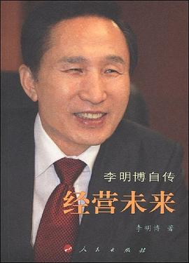
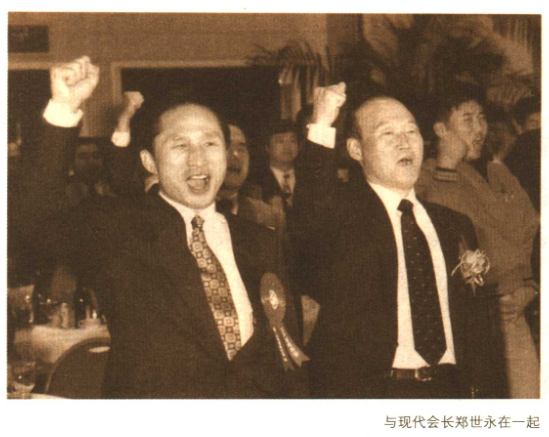
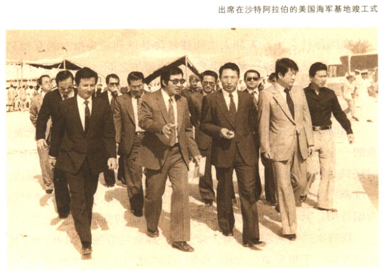
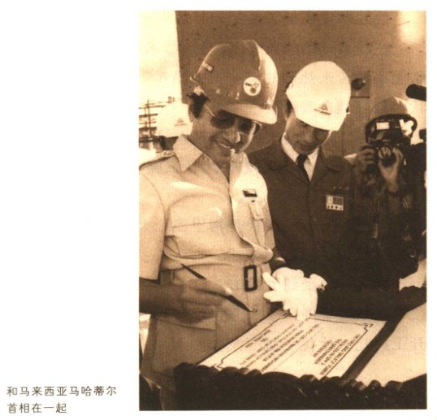
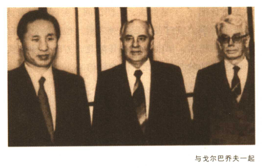
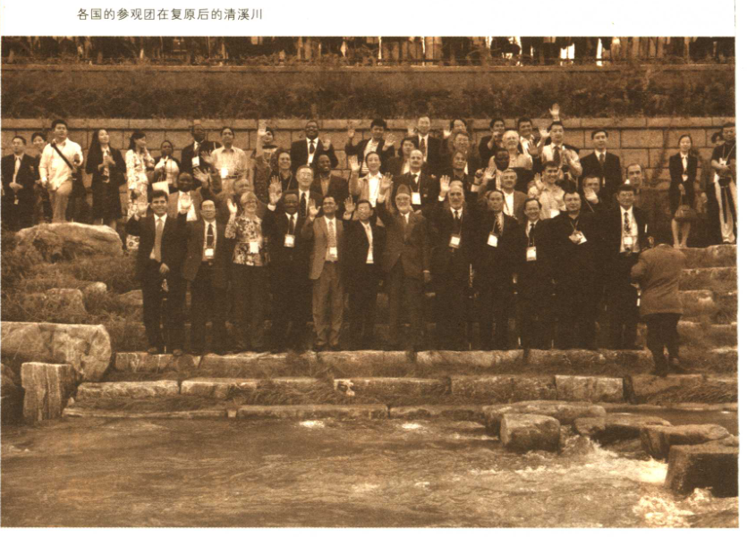

# 经营未来

- 作者：李明博
- 出版社：人民出版社
- 出版时间：2008-02
- ISBN：978-7-01-006871-8
- 豆瓣：https://book.douban.com/subject/3020605
- 封面：

# 前言

自小就有的梦想，一生都在我心中澎湃:我喜欢冒险与挑战所带来的热情与振奋，我一直梦想社会安定、经济安乐以及透过文化而获得快乐的“幸福世界”。

我要成为“自己的主人”、“良心的主人”和“事业的主人”。

从一个清理垃圾卖苦力的工读学生，到敢于迎接挑战的学生会主席，到军事政权的反抗者，到打工者，到职业经理人，到首尔市长，到当选总统，是贫困教会了我善于学习、教会了我冷静地思考人生和社会的意义;迫使我执意进取，直面挑战，勇于变革;更让我懂得了把握未来、经营未来的重要。

人必有所守护，方能有所坚持。我贯彻一生要为国民幸福坚持奋力拼搏;我愿意在任何危机、挑战面前，毅然迎上前去;我坚持再苦、再难也要堂堂正正地做人。这是在经历了艰难的成长、求学、事业开拓之后，珍藏于内心的一个坚定信念。

# 第一章 乘着贫穷的翅膀

> 母亲曾教育我:家贫志不贫，她是我最好的老师。
>
> 不期待回报地帮助他人才是真正的高尚。
>
> 敢于挑战命运的人才有可能改变命运。
>
> 年轻人一定要勇于挑战，无论陷于何种绝境，都要勇敢地挑战!

## 归乡之路

回国那年我只有4岁，对故乡的最初记忆就是浦项市场街的贫穷。 **贫穷像石花壳一样紧紧贴在我们家身上，到我二十多岁时还无法摆脱。**

那时候，我们家最主要的食物就是酒糟-粮食酿酒后剩下的渣子。作为家里最小的儿子，我每天都要去酒厂买酒糟，而且一定要买最便宜的那种，一天两顿都用酒糟充饥。因为酒精的原因，我全身一直是红红的。日后到公司工作，我之所以能在酒席上“胜人一筹”，或许就是小时候吃酒糟练出来的吧。 **我把它看成贫穷留给我的一种财富。**

午饭时间，其他同学都在吃饭，而我只能拼命往肚子里灌水。水不能充饥的感觉，没有经历过的人又如何体会得到?

到小学五六年级的时候，我已经算得上是个做买卖的“老手”了。卖火柴、卖寿司、卖年糕，样样都做过，有一次还被宪兵抓到狠狠打了一顿。课余时间为生计东奔西走，每天还要步行四个小时去上学，这样日复一日，我的身体终于累垮了。

## 母亲的祈祷

我一直到高中毕业都是很内向的孩子。要我一个人跑去帮忙，刚开始真的很难。我也不会打招呼，就一直在厨房周围转悠，帮忙打打水、递递东西什么的。看看忙得差不多了，就一个人悄悄地跑回家去。后来，我也渐渐地能说出“我来帮忙了”、“活干完了，我先回去了”之类的话。

如此经过几次之后，我渐渐明白了母亲的用意。不拿人家的东西，我便可以更加坦荡地去帮助别人。 **如果一个穷人天天企盼着有钱人的帮助，那他永远无法摆脱贫穷。** 母亲用她的言传身教，赐予了我和兄妹们克服贫穷的力量。

## 妈妈，请让我上高中吧!

上高中后，我开始随着季节变化做买卖:春天卖麦芽糖，夏天
卖冰棍儿，冬天卖爆米花儿。

我做买卖的那条街上总有许多女校学生来来往往，我的破旧校服、脏兮兮的脸、低着头傻乎乎的样子都成了她们取笑的对象。我不停地对自己说要泰然处之，但强烈的自尊心，加上内向的性格、青春期的焦虑，我又如何能做到泰然处之?

## 为了上大学

每天天未亮我就开始忙活起来，把装得满满的垃圾搬到推车上，经过三角地、解放村、普光洞的岔路口，再从美军营地的右侧绕过去，把垃圾倒在指定的空地上。每天我要往返六次，上坡时累得气喘吁吁，下坡时则更吃力，也更危险。

本来只打算挣够第一学期的学费，没想到靠着这份卖苦力的工作，我顺利读到了大学三年级。

## 乡巴佬竞选学生会主席

上大学的这两年，我每天都在为生存和学费而奔波，但即便如此，大学生活还是开阔了我的视野。我开始关注民族、民主、国家繁荣这些问题，开始把注意力从个人生活的现实问题转向外部世界。对我生活的这个贫穷、落后的祖国，我能做些什么呢?

当时，我并不太赞成学生运动的开展方式。我发现，除了几名主要的组织者之外，大多数学生只是随波逐流地参加示威游行。虽然我是学生，但我很早就在社会上摸爬滚打，在为生存而苦苦挣扎中体味着人生，因此我比其他同学更能客观地正视学生运动。大学如果照这样发展下去，学校将不成其为学校，学生也将不成其为学生。而且有的时候，学生示威游行还会成为街边失业者、流浪者发泄的导火索。看着闹哄哄的学校，我心里真不是滋味。

我并没有什么胜算，有时候甚至觉得自己必输无疑，但对我来
说，落选和当选同样有意义，即使落选我也可以让很多人知道我的
存在、了解我的想法。今日的李明博已不是过去的李明博，不再是
那个低着头、要用草帽遮脸的李明博，不再是为了摔烂的西瓜而要
离家出走的李明博......我把这次竞选看做我人生的一个重大转折点。

## 避身

回首尔的路比去釜山的路更艰难。辗转曲折，我见到了那个老乡，然后“出现”在市警察局。后来我才知道，那个老乡检举
了我，为此还领了一笔赏金。

到了警察局，我惊讶地发现，我们“6.3”示威游行的拟定地点以及参与者名单他们都了如指掌。后来才知道，学生会干部中有人向中央情报局告了密。10年后听说，那人成了中央情报局的要员。

## 蜕变

我突然明白了自己在狱中应该做些什么:作为学生，我要把这段时间落下的功课补回来。我一边拼命读书，一边开始冷静地思考人生和社会的意义。

西大门的监狱生活从1964年6月末开始，于10月末结束。法院改判我3年有期徒刑，缓期5年执行。如今回头看，这段生活对我而言，不啻为一种幸运。我在监狱中学会了乐观。在那以前，我一直以为自己生活在社会最底层、经历过无可比拟的绝望。但是在狱中，我懂得了所谓悲观与乐观都是相对的。在监狱外的人看来，被囚禁之人都是极端悲惨的;但对死刑犯而言，只要活着就是莫大的幸福。艰苦的狱中生活还让我领悟到了人身上潜在的超强的适应能力。刚开始，每天早上分到的水连湿手都不够;一个月后，用那点水完全可以洗手、洗脸。

从当选学生会主席，到逃亡、坐牢，这一年的经历让我从幼
虫蜕变成了长着翅膀的成虫!

出狱后，我发现自己一下子成了名人。

# 第二章 在「现代」腾飞

> 年轻意味着什么?意味着即使失败，也随时可以再挑战!
>
> 对于年轻人来说，工作就是最好的福利。
>
> 好的习惯创造好的机会，反之，坏的习惯造成困境与危机。
>
> 不要管别人，热情地去工作吧!

## 喝到月亮下山!

大学毕业后，“内乱煽动罪”的前科就像一双无形的手，紧紧抓住我不放。我不但行动不自由，而且也找不到工作。

我一连去了好几家公司应聘，每到第二次笔试或面试，就再也没有下文了。有一天，偶然在一张报纸的角落里看到一则广告——“招聘出国工作人员”。我像触电般地被“出国”两个字吸引住了。在当时，只有极少数公费留学生和政府管理人员才有机会到国外去。在60年代令人窒息的政治气氛中，出国对于像我这样的年轻人来说无疑是一个富有吸引力的选择。

我仔细地阅读那则招聘广告，原来是一家名叫“现代建设”的公司在为其泰国工地招聘现场工作人员。

现代建设的人事部长拿起我的档案，面露难色地说:
“你的笔试成绩很好......不过有学生运动的前科啊......现在上
头还不知道，可我们得马上报告。你能想想什么办法吗?

我能有什么办法呢，连个诉苦的人都没有。

思来想去，我决定来个正面对决。回到家我就写了封信，收信
人是当时的总统朴正熙。我在信上如实写下自己的“前科”，阐述
了学生运动的纯洁性与爱国热情，然后强烈批评当局阻止个人走
向社会的做法。

几天后，青瓦台负责民政事务的李洛善先生联系了我:“对挑战国家体制的人进行惩罚，这不是理所当然的吗?另外也是要给那些企图搞学生运动的人敲个警钟，所以这是没有办法的事情。”过一会儿，他又试探性地
问我:
“你有没有想过在国营企业工作，或者出国留学?我愿意帮你努把力。”

我断然回绝说，没有此类念头。离开前我扔给他一句话:“如果国家阻挡了一个人自力更生的道路，那么国家将永远亏欠于他。“

这句话，其实我说过就忘了。很多年之后，在我担任现代建
设公司社长的时候，我又见到了那位时任国税厅厅长的李先生。他
对我说:“当时你说的那句话对我触动很大，所以后来我又重新召
开高层会议，决定以只干工作为条件，同意你进入现代公司。”

我被安排在总部工程管理部，在那里工作了3个月。进公司后不久，我就发现企业组织存在着严重的官僚化现象。最具代表性的就是过了下班时间，职员们还得看上司的脸色，继续忍耐着坐在椅子上。这在当时是极为普遍的事情，但我实在觉得忍无可忍。于是，我对职员们进行问卷调查，收集了一些对于官僚化组织的意见，职员们几乎是一边倒地要求改善这一状况。最后，我将调查结果向上级做了报告。作为一个“身份敏感"的新职员，我不怕引火上身，我更看重的是企业的利益。

在那次面试之后，我在新职员研修会上第二次见到了郑周永社长。新职员研修会其实就是一个“通过仪式”，公司新人可以借由这个平台，和企业主面对面沟通交流。那次我们玩得很尽兴，郑社长也和我们一起打球、摔跤、喝酒，一直坚持到最后一夜的篝
火晚会。
“来，咱们今天喝到月亮下山!”
郑社长高举酒杯提议，众人围坐一圈其乐融融。几轮喝下来，一些人已经醉得不省人事。最后只剩下四个人:郑社长、我和后来到关岛管理工程的李谋，以及一位土建工程师。

## 初生牛犊不怕虎

泰国工地的指挥部比首尔的公司总部还要庞大。我是现场最基层的出纳人员，上面有经理科长，再上面有管理部长。整个工程于1966年1月7日正式动工，但进展得很不顺利。当时在韩国，连“高速公路”这个词都比较陌生，建设装备、技术人员都是捉襟见肘。美国人看到我们从国内运来的旧设备后直摇头:“你们要是能在5年内完成这个项目，我们把姓都改了。”

“李明博不惜生命保住了公司保险柜。”
“泰国工地保险柜事件”成了我在“现代”扎根的契机。

## 曼谷“受审”

泰国高速公路工程出事后，郑周永社长就经常来泰国工地
巡查。

工程进行了一年半后，有一天，我把心存已久的话说了出来:
“社长，这个工程有利润吗?”

“这种事，你为什么要过问?"

“作为基层职员，我没办法全面估量工程状况，也不可能计算出总体成本，所以我不敢肯定。但是，据我的片面观察和分析，这个工程确实是亏损的，而且我相信这种亏损会与日俱增。社长您知道这个情况吗?”

“这不可能。有些情况你可能不太了解。这个工程当然有利润，我都接到报告了。”

郑社长很快就回国了，但我自信我的判断没有错。我开始收集我能力范围内的一切资料，进行统计分析。从我的分析结果来看，工程绝对是亏损的。我把分析报告递交给经理科长和管理部长。但他们的反应很冷淡，还提醒我只需做好本职工作，不要多管闲事。

后来我才发现，部长把我的报告书以自己的名义递交给了郑社长。郑社长比上次暴动还要迅速地飞到了工地现场，和他一起赶来的还有总部的审计组。现场一下子天翻地覆。郑社长或许以为有人贪污了工程款，于是管理部长、经理科长还有我三个人被叫去曼谷接受审查。

推门进去，郑社长让我坐下，温和地对我说:“我什么样的工程都经历过，但这次竟然出现这么大的赤字，我不能理解，一定是有人贪污了工程款。我绝对相信李先生，你告诉我，到底是谁干的?是部长和科长中的哪一个?还有没有其他人?
我看着郑社长，说:
“我是现场出纳，所有支出都要经过我的签章。在我了解的范围内，我敢说没有任何人拿过公司的钱，而且也不可能在我不知道的情况下拿走公司的钱。我认为，工程赤字不是某一个或某几个人的贪心或错误造成的，而是技术和经验不足导致支出过多，成本预算又过低。这是长期累积的结果。”
郑社长直直地盯着我。
“那么，是你一个人独吞了?
有点担忧，所以就做了一份报告书交给部长。”
“我没有那么大的能力。社长您还记得吗，几个月前我就跟您
说过亏损的问题，当时您很肯定地说工程有利润。但事后我还是
“哦?那份报告是你做的?
“是的，我只不过是把我能搜集到的资料做了一下统计分析。”“这个混蛋，竟然把下级的报告说成是自己的!那么，你的想法是，部长和科长都没有贪污?
“是的。”
你和部长干的。”.....”我无话可说。
“哦?听他们的口气，部长认为是你和科长干的，科长认为是
那天晚上，审计组将做出最后的结论。我们三个人像罪犯等待
宣判一般辗转难眠。
早晨7点来了电话，让我一个人去酒店餐厅。
下楼到餐厅，只见郑社长一个人坐在那里。

他让我坐下，问了一些关于故乡和父母的事情，然后让我点
早餐。
“我想回房间跟部长他们一块儿吃。”
“不用管他们，他们自己会在房里吃的。”我只好坐在郑社长对面吃了早餐。郑社长虽不擅长英语，但点餐时却那么自然的样子让我印象深刻。等到快吃完的时候，郑社长突然对我说:
“李先生，你来负责这个工地吧。”
“啊?您说什么?”
“部长和科长今天就回国，我希望由你来负责他们的工作。”
“那应该再派新的部长和科长来啊。”
“没那个必要，有你一个人就够了。你自己回国挑几个人带过
来吧。”

高速公路工程在巨额赤字的压力下进入了棘手的收尾阶段。这时候，把工程交给一个刚进公司不久的基层职员，由此可见郑周永社长的果断与魄力。

为了便于开展工作，我被提升为代理。这种破格提拔一直持续
到后来我被任命为部长、理事、社长。

## 推土机

现代建设在越南承接的新工程弥补了在泰国的亏损，从而打下了重振旗鼓的基石;在国内，也通过京釜高速公路的建设打了一场漂亮的胜仗。

## 明博，尽情地哭吧!

有一天，总务部给我送来了一辆“现代”制造的科蒂那轿车，
我问:
“这是给谁的呀?
“您不知道吗?您已经被任命为理事了。”
“任命谁为理事?”
道吗?”
“是部长您，哦不，是您，理事。还能有谁啊?您真的不知
“什么时候的事?”
“三天前。”
那一年，是我进人现代建设的第5年，我28岁。这样的提升纪录，除了企业主的儿子、亲戚以外，发生在纯粹的工薪族身上，或许再也找不到第二个了。郑社长如此快速提拔我的原因只有一个:凡事只要交给李明博，就没有办不成的。

1972年，我升任负责管理的常务理事，面对的重要课题就是整顿管理体制、强化企业自身力量、促进新产业的发展。作为常务理事，我的工作首先侧重于加强经营合理化。其一追求经营利润，其二整顿内部组织、提高工作效率。随后就是实施预算管理制度，进行人力资源整合，制定规则等整体改革与运营的合理化
方案。

1975年，我被提升为副社长。此时，距离我刚进公司时，正好10年。

升职带来的喜悦最初也有过一两次，按部就班重复几次后，便也渐渐麻木了。但是，接到副社长任命的那一刻，我心里激动极了。我买上一瓶酒，去了老朋友家。高中毕业后对未来充满绝望、在首尔街头徘徊的时候，正是这位老乡给予了我莫大的安慰。“我在报纸上看到，你当上副社长啦!”
“嗯，今天刚接到聘书。”
“恭喜你。应该敬你酒啊。”我们喝了一夜的酒。温润的烧酒把以前冻结在我心里的冰块一层一层融化了。最后，终于哭了出来。这是我成年以后第一次在别人面前流泪。想起在浦项的童年时光和去世的母亲，眼泪竟像决堤的河水。
“哭吧，明博，尽情地哭吧....
那天晚上，我真的哭了个够。

## 35岁的社长

我自忖，虽然进入公司12年就被提升为社长，但我这12年和其他人的12年是不同的。我从来没有公休日，每天工作18个小时以上，相当于其他人的两倍。如此计算的话，我等于是工作24年才升任社长，因而也就不能说是“过快”了。

那年年末，全国人事管理委员会邀请我在他们的研讨会上做演讲，我欣然答应。研讨会上聚集了各家企业的负责人和部门领导者，大家都对我这位年轻的社长充满好奇和疑惑。

## 家庭与财产

有一天，在浦项念高中时的一位英语老师把他朋友的妹妹介绍给了我。她不是有钱人家的女儿，父母都是清廉的公职人员，这一层就已经让我对她产生了好感。1970年我们见面的时候，她刚从梨花女子大学毕业。据说她在学校时，还曾被选为校花。但在我眼里，她并不是那种特别漂亮、出挑的女孩，而是一个心地善良的姑娘。

由于工作繁忙，我几乎没有和她好好约会过。即使偶尔约了她，也总是“迟到早退”。有几次忙得脱不开身，只好打电话到约定的咖啡厅，让她换到饭店，然后还是不能按时去，只能让她自己吃饭。有时候让她等得太晚，只好让公司的司机替我把她送回家。在举行订婚仪式的那天，我也是因为有紧急事务要处理，仪式一结束便扔下她，直奔公司。

结婚后，我们用朋友们送的结婚礼金，在麻浦租了一间十几坪的月租房。每隔半年，房东就要求提高租金，所以3年内我们搬了8次家。第二次搬家的时候还带着全部的行李;但从第三次搬家开始，就只带走些生活必需品;到第七次，只拿了碗筷就离开了。有时候我甚至忘记已经搬了家，下班后又回到原来的住处。妻子从我还是穷小子的时候起，就和我一同为生活奋斗，是与我患难与共的“糟糠之妻”，但有那么一段时间，她竟然被误认为
是我的“情人”。

事情是这样的:当时我们住在由公司提供的狎鸥亭洞“现代公寓”。我经常一大早就出门，夜里很晚才回到家，邻居们很少看到我，只见过我妻子。因为我当时已经担任现代建设的社长，人们猜测我至少有50多岁，我的夫人当然就该是40多岁的中年妇女。但事实上，我妻子当时才29岁。

我的家庭完全是妻子一个人在操持。三个女儿和一个儿子出生的时候，我一次都没有守在妻子身边。因为工作忙，和家人在一起的时间实在太少了。我一直觉得自己不是一个好爸爸，很少为孩子们做些什么，到国外出差也没有给他们买过什么礼物，顶多带回来飞机上赠送的洗漱用品什么的。孩子们小的时候，都以为那是爸爸特意从国外带回来的好东西，长大后才发现全然不是那么回事。但即便如此，我的孩子们依然会说:“爸爸是最关心我们的人。”这不是孩子们的“假话”，而是我为人之父的“秘诀”所起的作用吧。我的秘诀就是通过妻子了解孩子们的作息安排。比如，孩子们考试、演出或野游的日期、内容都要向妻子问清楚，还要做
些笔记。

财产的多少并不是问题的关键。如果积累的方式不正当，即使很少的一点财产也是不正当的财产;反之，如果方式正当，凭智慧与勤劳致富，财产很多也是合情合理。当然，通过不正当方法致富的一些企业和个人是需要反对和查办的。

我们韩国有句俗话:像狗一样挣钱，像宰相一样花钱。我认
为现在应该是“像宰相一样挣钱，也像宰相一样花钱”。干净合法地挣钱，正大光明地花钱，这才是健康的社会。

# 第三章 暴风骤雨间

> 即使暂时遇到挫折，只要足够努力，就一定能渡过难关。
>
> 遭遇困境时，最重要的是自己的意志。
>
> 压力是在被动工作时产生的。
>
> 不管有多难，心中都要怀有希望。

## 密审

在第五共和国初期，现代集团和新军部的关系十分紧张;但是到中期，双方表现得亲密友好;到末期，关系又再度恶化。这样的无常反复也在郑周永会长心中埋下了既对政治失望、亦对权力憧憬的矛盾的种子。

## 血泪

现如今，很少有人会把多家汽车生产公司共存的局面视为重复投资、国力浪费的现象。经济有其竞争规则，竞争应以公平为基础。竞争公平规则受到保障的程度是衡量先进国家与落后国家的标准之一

但在当时，一部分经济学家和官僚却坚持认为，只有把所有汽车制造厂融为一体同时发电设备厂也融为一体，才有利于国家经济的发展。具体说来，就是要把现代汽车、大宇汽车和亚细亚汽车合并为一家，再把电力设备领域的大宇玉浦造船厂、现代重工业，以及昌原的现代洋行(现斗山重工业)合并为一体。

“两位花国家经费上军校的时候，我每天早上在梨泰院拉着平板车清理垃圾，靠勤工俭学完成了学业。你们父母送你们进高中的时候，我不但要自己赚学费，还要拼命干活养活自己。大学毕业进人公司后，还要在国外工地没日没夜地工作。1974年我们国家外汇储备几近耗尽、国家经济面临崩溃的时候，是靠我们这些海外建设者辛辛苦苦挣的美金才扛了过去。两位从军校毕业后经历过战争吗?而我，每天都要在和战争一样残酷的海外市场上打拼，每天工作18个小时，每天晚上只能睡三四个小时。

“谁说只有军人才是爱国者?我们这些企业人难道就不是爱国者吗?企业可以成为批评的对象，但无视企业作用的想法是绝对不可取的。你们住在山顶的公寓里，而我曾经在比那还要艰苦很多倍的地方生活过。作为一个大企业的社长，我住在一套大房子里有什么错吗?那套房子是公司为我方便接待外宾而盖的，如果这样也有错，难道一定要我降低自己的居住水平吗?难道这就是你们治国的目标吗? **你们应该在最短的时间内，让你们这样的军人、公务员也达到和我一样的富裕水准，这才是可取的目标。** 怎么可以要求一个靠诚实劳动富裕起来的人降低生活水平呢?”

“如果把汽车企业捆成一个，竞争力就会降低，最终只能成为国家的负担。印度就是一个前车之鉴:他们只有一家国营汽车企业，技术开发不行，经营管理也不行，造出来的汽车款式陈旧，性能也不好，价格却贵得离谱。因为产量少，买一辆汽车要等上好几个月。没有合理竞争的弊端，局外人是很难了解的。我们国家现在看似重复投资，但事实上是经济不景气、产业化未能进入正轨所引起的。假以时日，就会体现出各个企业对出口所做的贡献。所以，还是请再考虑一下是否合并的问题。

“我不知道那些人是以什么为根据主张合并的。那种废除合理竞争、培养垄断企业才有助于资本主义社会发展的理论，在任何一本经济学教科书上都找不到。垄断企业一开始运转可能还不错，但时间一长，就会出现无数的问题;而在健康的竞争环境中成长起来的企业，他们的前途将不可估量。如果你们现在非要无理合并，能不能解决眼前问题还是未知数，今后要想进人国际市场更是毫无希望。到时候再后悔可就晚了。”

我的正面对抗使“国保委”的汽车产业合并计划无法顺利进行，进而促成了将问题移交工商部处理的契机，合并问题也随之成为公开的争论。在工商部主持的会议上，郑周永会长更是强烈阐述了产业合并的弊端。最终，汽车产业没有走向合并之路。

假如那时真的草草合并，韩国现在的汽车产业水平或许就和
印度无异了。当时被合并的电力设备产业，结果后患无穷。

## 奏响凯歌

“政府怎么能不和合同当事人打招呼，就单方面取消合同呢?现代建设是经过一次、两次、三次竞标，堂堂正正地拿下了这个项目。政府单方面撕毁合同，是要负法律责任的。我们恳请政府取消这一决定，否则我们将不得不对政府提起诉讼。

明细数据内容涉及很多具体的技术指标。没有核电站建设经验的企业是不可能提供这些数据的。政府接受了我的条件。

竞标结果，灵光核电站三、四期工程项目，依然花落“现代”!这是一项工程两次被同一家公司赢得的珍贵纪录。事实上，也是第一次在政府主持的重大项目中，企业没有向政府提供政治资金。

在吸取了LNG储藏基地项目的失败教训之后，在两次起落、
奋力抗争之后，我们终于奏响了嘹亮的凯歌。

# 第四章 海外攻坚战

> 无论国家还是个人‘没有挑战精神，就不会有长足的发展。
>
> 如果说我和别人有什么不一样的话，那就是别人放弃的时候
>
> 我没有放弃，而是选择再次挑战。
>
> 要想说服别人，需要真心和真话。
>
> 忘记失败教训，就会再次失败。

## 抢滩伊拉克

虽然“现代”通过艰苦努力凿开了通往伊拉克市场的第一道门，但接下来的道路却是荆棘丛生。由于当时韩国和伊拉克还没有建立外交关系，技术人员和技工的出人境及人身安全保障问题成了工程建设的一大障碍。为了保住这好不容易挖到的“第一桶金”，我们必须探索出一条适用于伊拉克这一特殊市场的商业新路。

作为承接公司的代表，我也必须绕道科威特才得以进人伊拉克。我们在巴格达停留了许多天，利用一切线索多方活动，希望能与伊拉克政府取得联系。

一天，一位当地人对我说:“你去试试看，能不能见到巴格达市长瓦拉布。没准他愿意见你呢。”

面见瓦拉布谈何容易。几次面谈申请都石沉大海。我恳切地拜托市政府的翻译员:“请转告市长，让我见他一面吧。请不要把我看做韩国的企业代表，就说是一个从东方来的、喜欢年轻革命者的人，急切渴望能见他一面。”

终于，瓦拉布同意接见我们，但只有10分钟时间。市长办公室整洁而简朴，瓦拉布本人虽不是军人，却穿着标准军服、配着手枪。

“市长先生，听说您为了革命事业鞠躬尽瘁，实在令人敬仰。在我看来，身为大丈夫，即使为国捐躯也是一大幸事，您说呢?”

“是啊。”

瓦拉布接过话来，“我一天就睡三四个小时。每天的工作堆积如山，实在觉得时间不够。”

“我也是从来没睡过五个小时以上。在这一点上我和您还有些相似之处。”

“哦?你一个商人，每天也只睡三四个小时?“

瓦拉布表示出了兴趣。原定的10分钟飞快地过去了。

“我的祖国很穷，到现在还没有完全从困难中解脱出来。为了富国强民、促进经济发展，我觉得睡觉实在是件奢侈的事情。我虽然在企业工作，但是对资本主义国家来说，企业是国家命脉所在。为企业奋战，其实也就是为国家奋战。 **我个人从小就在贫困的环境中长大，在艰难的成长过程中，我意识到摆脱贫穷不仅是我个人的生活目标，也是我们整个国家的使命。** 我们在走出落后的道路上积攒了很多经验，也希望能用这些经验在为贵国发展出-份力的基础上实现互惠互利。目前，我们已经争取到了贵国的一项建筑工程，但是苦于种种限制，工程进展一再延误。和欧洲企业相比，我们更崇尚正直与勤奋。希望我们能像朋友一样友好相处，齐心协力从贫穷中站起来。像你们这样清廉的公职人员，我在中东还是第一次见到。我非常希望能和你们这样的朋友合作。”

最终，原定的10分钟一直延长到2个小时。我们对国家的认识、对事业的热情、对中东和亚洲的历史以及个人经历方面都有很多相似之处，甚至有一种相见恨晚的感觉。我问他，下个月我来巴格达时能否再见到他，他爽快地答应了。

一个月后，我第三次进人伊拉克，和瓦拉布约好了在一家高级餐厅见面。那天，他向我介绍了他的两位朋友。一位是伊拉克住宅建设部部长，另一位是商工部部长，都是伊拉克政界举足轻重的人物。
们的支持是很必要的。”
“这两位都是我兄长一样的朋友。你要想在这个国家工作，他
瓦拉布的善解人意令我心存感激。

两位部长对我颇有好感，很快我们就像老朋友一样聊了起来。住宅建设部部长是我们工程的最高负责人，商工部部长也对现代集团表示出兴趣，他尤其关心发电站方面的施工能力。后来，两位部长先走一步，剩下瓦拉布和我两人，我借机提到设立领事馆
的可能性，瓦拉布脸色微变，我连忙收住了话题。

又过了一个月，我第四次来到巴格达。商工部部长送来了宴会请柬。当晚的客人也包括瓦拉布市长、住宅建设部部长以及他们的另一位朋友--矿业部部长。

瓦拉布笑着帮我引荐:
“这位是矿业部部长。听说你们公司有建造发电站的经验，目
前我们国家百废待兴，需要筹建很多发电站，这是矿业部的管辖
范围。

真是意想不到的收获!

不久，现代建设获得了投资高达7.2亿美元的伊拉克“阿姆莎伊”火力发电站的建设工程。在此前的竞标过程中，我们和日本企业展开了激烈的竞争。说实话，对于如此大规模的火力发电站工程，现代建设当时的能力是稍有欠缺的。伊拉克方面也了解这一点，但指点说:“你们可以从日本那边购买器材，工程设计也可以寻求他们的帮助，这样你们就可以顺利完成工
程建设。”

伊拉克之所以将国家大型项目交给我们建设，最重要的考虑。
自然是国家利益和民族自尊心，但我和他们的友谊也有一份功劳。

住宅建设部也和我们签订了8.2亿美元的住宅园区工程合同。

## 撤离巴格达

在伊拉克的某一天，瓦拉布市长颇为神秘地让我坐上车，说要
给我介绍一个人。汽车径直朝着总统府方向驶去。

“此人是主管我们国家经济政策的关键人物。其身份虽然是副首相，实则是第二位实权人物。”

我有些紧张地问瓦拉布:
“我什么也没准备啊，跟副首相说什么好呢?

“上次你不是跟我提过设领事馆的问题吗?见机行事吧。”

进到副首相办公室，没想到电视台的摄像机已经在那里候着
了。于是，在当天晚上的新闻里，出现了我和副首相握手的场面。

事后，我又和瓦拉布商量这个问题。瓦拉布考虑了很长时间，说了这么一句话:
“你给我们出了个大难题，如果问题解决了，‘现代’以什么方式表示诚意呢?”

事情由此出现了转机。我连忙说:
“我们生产汽车。我们愿意赠送50辆现代公司生产的汽车。”我之所以提议赠送汽车，是因为我想到，如果大韩民国生产的汽车能在巴格达市内奔跑，对两国经济合作也会起到一定的促进作用。

但瓦拉布否定了我的提议。“汽车我们不缺。你们公司生产小货车吗?”“当然。”
“那就送小货车吧。设立总领事馆的问题我来想办法。”

我紧紧握住瓦拉布的手。

“谢谢你，兄弟!我一定尽我所能为伊拉克的建设事业出力!”

回国后，我立刻向青瓦台递交了报告。考虑到我国政府和美国的关系，可能不允许我们赠送小货车，所以我在报告中特意强调了建交的可能性:
“为了方便工程建设，伊拉克方面初步同意设立总领事馆。以
此为契机，或许有可能实现建交目的。”

心急如焚地等了一个星期，终于收到青瓦台的答复:可以赠送小货车!现代汽车公司立刻另设生产线，紧急制造特殊的小货车，并以最快的速度通过科威特直航船运抵伊拉克。赠送仪式盛大而热烈，感觉建交已指日可待。

回到首尔后，中央情报部的一位高层人员找到我，说:“估计很快，我国就会和伊拉克建交。此前，我们情报部一直通过科威特大使馆进行建交努力，也取得了很大进展。这件事应该由两国政府通过公开途径进行，所以希望民间企业不要再介人了。”

几天后，外务部的高层人员也打来电话，说此事一直是外务部在力促，请现代公司不要插手。

我无话可说。其实，我根本没有刻意地去做什么。所有的一切只是在为现代建设开拓海外市场的努力中得到的意外收获而已。

然而，正所谓世事难料。就在第二年初，发生了“伊斯兰革命”，接着1980年9月，“两伊战争”爆发，并开始了消耗性的持久战。韩国企业不得不退出了艰难开拓的伊拉克建筑市场。

由于战争爆发，工程款被拖欠，现代集团遭受了损失。国内开始盛传“因为伊拉克工程，郑周永会长和李明博社长最终走向决裂”。

事实上，郑会长和我从来没有为某件事情而争吵或表现出敌对状态。只不过，两人之间弥漫着凝重而冰冷的空气，久久难以消散。

有一天，我认识的一位政府官员想约见郑会长，请我帮忙搭一
下桥。因此，我和郑会长很久以来第一次，有了共进晚餐的机会。

饭到中途，那位政府官员突然冒出一句话:“郑会长，李社长是我非常尊敬的一个人，请您多多关照他。”

我的这位朋友并不知道我和郑会长之间关系的微妙变化，他这么说或许只是出于对我帮忙安排会面的感谢，或者是对德高望重的郑会长的礼遇之辞。但不管怎么说，在当时听来，确实有些唐突。

郑会长的反应很激烈:“这个人即使倒下了、被掐住了脖子，也不会告饶的。关照的
话何从谈起!

1982年12月，郑会长和我一起去了硝烟弥漫的伊拉克。我们在科威特机场上了一架旧飞机。不仅要一一接受安全检查，还要亲自把个人行李搬到货物间。由于飞机太过陈旧，中途几次起落，好一阵颠簸折腾。

在巴格达，郑会长见到了我的几位老朋友，也冒着生命危险去巡查了现代建设的工地。在炮火射程内奔走，郑会长毫无惧色，展现出将军一般的风度。
一旦看到不满意的地方，他就大声训斥对方:“把辞职书给我递上来!”

我们离开伊拉克的前一晚，各个工地负责人聚集在巴格达，在这危险重重的异国他乡，酣畅淋漓地喝了个通宵。

我对郑会长说:

“把那些辞职信都还给他们吧。”

“好吧，都退给他们吧。”

那天，我们一直喝到凌晨3点。

4点，汽车驶向科威特。从巴格达到巴士拉的路上要经过10个小时的边境线，那一段是战火最猛烈的地区。在轰隆隆的炮火声中，我们像勇士一般，飞驰在一望无际的沙漠中。从伊拉克回来后，我和郑会长之间的关系恢复了正常。毕竟，需要我们携手面对的工作太多了。

## 马来西亚的启示

在国际社会中，人与人之间往往都是以利益为指向的互相利用关系。但是，我和马来西亚首相马哈蒂尔之间，由于长期交往，产生了类似与巴格达市长瓦拉布的那种兄弟情谊。

我和马哈蒂尔的初次见面是在70年代末。

当时，现代公司正在马来西亚建设一座水坝。作为企业代表，我的一个重要任务就是结交工程所在国的高级官员。马哈蒂尔当时还只是马来西亚的副首相。他曾因政见不同，遭到当权者驱逐，一度流亡国外。后因民怨沸腾，首相才准其归国。因此，他当时虽
为副首相，其实只是虚职，手中并没有真正的实权。

我每次进马来西亚政府大厅，必去拜见马哈蒂尔。

现在我们要做的，就是强调现代建设的优势与诚意，努力说服马哈蒂尔的改革内阁。对于法国伯纳德公司，我们依然采取了缩短工期可以增加利润的对策;由于被牵涉进原政权官僚的调查案件，日本丸红公司失去了参与竞标的资格。

最终，现代建设拿下了“槟榔大桥”建设工程。

1982年初，现代建设筹备了一场盛大的开工典礼。为了搭建一个和韩国总统出席的开工典礼同样规格的舞台，我们特意从国内请来了有关专家。舞台中央摆放了为马哈蒂尔首相夫妇准备的大椅子，上面搭了遮阳篷，地上铺了地毯。

开工典礼的前一天，首相府秘书长和一名警卫人员来到现场
巡查。秘书长看过讲台后吃了一惊，走到我身边说:
“首相的座位上有遮阳篷，但下面的5000人怎么办?”

这回轮到我大吃一惊了。在韩国，我们从来都是只考虑总统的
座位，怎么在马来西亚....

秘书长接着说:
“要么把其他5000个座位上也搭上遮阳篷，要么把首相夫妇座位上的遮阳篷去掉，反正不能只让他们两位待在阴凉里。”

**我受到了很大冲击。竟然还有这么为百姓着想的官员!**

秘书长提议撤掉已有的遮阳篷，毕竟，在24小时内怎么可能布置出2000多坪、容纳5000人的遮阳篷呢?典礼筹备小组的讨论结果也是:不可能。

我一边吃午饭，一边苦想冥思。

“100坪左右的没问题吗?“

马来西亚方面的人回答说，100坪没问题。

“那就找20家公司，每家负责100坪!”

第二天早上7点，“遮阳篷工程”顺利完工。

在随后开始的典礼上，马哈蒂尔用马来西亚语作了演讲，观众席上不时传来热烈的笑声。我虽然听不懂，但也不好意思作麻木状，只好迎合着微笑。

这时，一位马来西亚管理人员捅了我一下。
“李社长，你知道他们为什么笑吗?”

我又尴尬地笑了笑。

“首相说，韩国现代是阿里巴巴大盗，大家要抓紧向他们学习，
才能早日把他们赶出去。”

我又一次受到了冲击。

遮阳篷事件、“大屁股”玩笑、“阿里巴巴”论......一场短短的
开工典礼，让我受益匪浅。

## 菲律宾闹剧

在马来西亚的胜利喜悦，到菲律宾化为了一腔愁闷。

投资1.5亿美元的菲律宾传输线工程竞标活动发生在马科斯总统夫妇开始流亡的前一年一-1985年。和其他所有发展中国家的政权末期一样，当时菲律宾的政治腐败达到了极点。

马科斯和伊梅尔达虽为夫妻，却各有一方势力，其目的只是为了更多地收受贿赂。作为外国企业来说，很难判断站在哪边更有胜算。

为了指挥这次竞标活动，我和现代集团负责电力部门的副社长一起跑了五六次菲律宾，结识了一些政府官员。**每当这时，我便亲眼目睹腐败的政权如何置千万国民于水深火热。腐败的政府如何能带领落后的国家走出贫穷呢?**

## 伏特加的滋味

1988年3月，我晋升为现代建设的会长，那一年我46岁。

早在80年代初，现代集团就开始致力于多元化经营。1982年5月，李春林和金永柱分别成为现代重工业和现代发动机的会长。此后，由职业经理人负责集团的一部分，另一部分交给郑会长的兄弟及其第二代负责经营。在我升任会长的前一年，现代汽车的郑世永会长当选为集团会长，郑周永会长作为名誉会长表面上退出了一线，但实际的领导人依然是他。

我在这个职业经理人和郑氏第二代相互交替的时期当上了会长，不得不认真思考自己的处境。我感觉到，该是我离开“现代”的时候了。我不想在“现代”坐享元老级待遇，也不会坐等下一个目标的出现。

从地理位置上看，西伯利亚距离我们国家很近。我们可以与隔着太平洋的美国成为友邦，却因为意识形态问题，与近在咫尺的两个大国对峙近半个世纪，想来实在可惜。

我从做生意的角度向郑会长阐述了开拓北方市场的意义所在:

“苏联是世界上资源最丰富的国家，而我们却是资源最贫乏的
国家。到下个世纪，我们必然需要消耗更多的能源。我们可以通过陆路，把那里的资源运过来。至于朝鲜是否愿意提供方便的问题，我想也不必过于担心。朝鲜也急需资源。为了发展，他们不能不给我们开路。另外，站在会长您个人的立场上考虑，这也是
大有可为的一件事。开拓北方市场必然会对国家产生深远影响，如
果能以此为自己的一生事业画上一个圆满的句号，不是很好吗?

虽然协商进行得并不顺利，但我还是和苏联工商会的首席副会长一边喝着伏特加，一边聊了很久。 **要想和苏联人打交道，最好能喝伏特加，这一点千真万确。如果哪个外国人很会喝伏特加，苏联人就会把他看做老朋友。** 那天晚上，我们借着淳厚的伏特加，感受到了彼此的内心。

我还列举了韩国企业进军东南亚和中东市场的成功例子，强
调我们会对苏联经济开发提供很大帮助。
“我们是以纯粹的民间组织的身份来这里协商的，没有任何政
治背景。请把我的话转告给你们的政府最高层，他们会明白我们
的诚意的。”

“我们愿意签署协议。举行签字仪式吧。”

1989年1月11日，韩国和苏联交往历史上的第一份正式文件
诞生了。

虽然没有就具体项目达成合作协议，但是，近50年的冰封终于被我们凿开了一个小口子，这已足以让我们欣慰。

从那以后，到1991年，我们对苏联进行了多次访问。在这短短两年间，“现代”在苏联的所有项目计划都是靠我们的两条腿跑出来的。从莫斯科到列宁格勒，从纳霍德卡到雅库特，哪里有投资潜力，哪里就有我们的足迹。

我们的成果也十分可观，先后促成了列宁格勒铝提炼厂、沿海州林山合资公司、石油化学制品合资公司、奥尔加港纸浆公司、耶尔金斯科煤矿开发及铁路建设、雅库特天然气开发等项目。

## 在勒拿河上

在和雅库特政府就开发天然气、油田、煤矿等内容达成共识之后，我们马上飞到莫斯科，和苏联政府达成了协议，并在莫斯科河上举行了签字仪式。

可惜的是，后来因为种种原因，这些项目一直停留在初级阶段。但我相信，今后一定会再有人站出来，以长远的眼光和非凡的胆识，担负起这一重任。

## 走进克里姆林宫

1991年，我第七次访问苏联。一到莫斯科就接到消息说，戈尔巴乔夫的经济顾问佩特罗科夫紧急召见我，而且要我一个人前往。

因为时间比较充裕，我和郑会长，还有“现代”莫斯科分公司的负责人一起去拜见了俄罗斯共和国总理。会谈进行得很顺利，我们就“现代”向俄罗斯共和国提供消费品、俄方用原材料偿还达成了共识，并签署了协议书。两国的电视台拍下了这一镜头。问题就出在那份协议书上。

协议书内容中包括的原材料有石油、天然气、黄金等主要的地下资源，而这些是属于苏联政府直接管辖的。对此我们一无所知。

第二天早上，佩特罗科夫紧急召见我。我突然有种不祥的预感。

“你们犯了一个严重的错误。你们违反了我们国家的规定。会见总统一事取消!而且今后，我们也不会再支持你们的活动了。”

真是晴天霹雳!我赶紧解释:
“我们根本不知道有这样的规定。要说错误的话，也应该是明知如此、还和我们签订协议的俄罗斯共和国犯了错。不见总统可以，但今后不支持我们活动的说法我们不能接受。”

“我们已经决定了。你请回吧。“

在得知会见总统的活动被取消时，郑会长非常失望，回宾馆后就把房门锁住了。

当时，苏联联邦总统戈尔巴乔夫和俄罗斯共和国总统叶利钦之间的裂痕已经到了无可挽回的地步。我们无法预知事态的发展，也找不到切实的解决方法，结果身不由己地卷入戈叶斗争，成了牺牲品。

那天下午，我们终于见到了戈尔巴乔夫总统。那次会面给我留下印象最深的，是戈尔巴乔夫的坦率。

“200年前，俄罗斯一位著名学者说过:‘俄罗斯的发展在于远东地区。’而苏联要发展远东地区就需要和临近国家进行合作。我们希望韩国在这方面能够发挥重要作用。”

“韩国和朝鲜在分裂之前是拥有相同文化和语言的同一民族。什么时候如果韩国和苏联建立了外交关系，在经济领域实现合作，也可以分给朝鲜一些胜利果实。对此，苏联具有道义上的责任。”

这些话让我们产生了共鸣。与戈尔巴乔夫总统的会面十分成
功，尤其是郑会长，似乎找到了很大的信心。他说:“我们趁热去见见布什吧。”于是很快，他便访问了美国，接着访问了中国，最后去了平壤。见过戈尔巴乔夫之后，他开始认为自己能够起到很大的政治作用。事实上，在开拓北方方面，他确实走在了韩国各个政治家的前面。为此，他充满信心。

# 第五章 从企业到政界

> 空有梦想、没有行动，那是白日梦:没有梦想、只知工作，那又何尝不是噩梦!
>
> 做有意义的事情就能感觉到幸福。
>
> 给普通人以希望，并帮助他们实现梦想，这就是我理想的生活。
>
> 我想做杰出企业家出身的杰出政治家。

## 轩然大波

1991年夏天，关于郑周永会长参政的消息已经传得满城风雨。他执意要动员自己的人脉，组织一个名为“国民精神运动本部”的非政治团体。

有一天，他对我说，想把我的名字列人发起人名单。我欣然同意了，还推荐金寿焕枢机主教、韩景职牧师等人加入，当时我根本没有多想郑会长的真正用意是什么。

没想到第二天，郑会长突然对我说:

“要报效国家就得直接干，光搞个‘国民精神运动本部’恐怕不行。

最终，“国民精神运动本部”流产了。

我不能理解“直接干”这句话是什么意思，就连“国民精神运动本部”和秘书室的人也都不明白这句话的真正含义。当然，外部也有很多人对此事表示关注。很明显，郑会长的活动与企业无关，而与政治相关。但那究竟是支持某个政界人士，还是政党的初级阶段，抑或是要直接挑战政权，在当时谁也摸不着头脑。

一直到12月，我们才知道郑会长在组织一个政党，也听说政府和国家安全企划部对此密切关注。就在这时，郑会长把我叫去说:

“我已经通告政府了。”

新政党已经成立，事态已经无法挽回。我该何去何从?

郑会长让我当场作决定。

当时，如同郑会长进人政界的传言一样，我将就任第14届国会议员的说法也传开了。郑会长也曾表示过对我的支持。虽然我已猜到他的态度变化一定与他的政治活动有关;但当这些问题和我对个人未来的设想发生冲突时，抉择变得如此困难。

“我没想到会长会以这种方式参政。这样一来，情况会变得很复杂。我本人不想参政，我也没有必要参政。会长创立新党作为反对党，如果我也参加，下面的社长、部长也都出马的话，我们社会的政治风气和现代集团的形象会变成怎样?我们集团内生产国民生活日用消费品的企业很少，母公司现代建设主要依靠海外工程和政府订单，如果贸然介人政治，一旦出了问题，后果将不堪设想。”

“会长，这个公司在法律上是您的公司，但是和其他每一个‘现代’成员一样，在精神上我也把自己看做公司的主人。从我第一天进公司，我就没把‘现代’当做别人的公司，而是当做我自己的公司，寄予一生的希望才走到今天。我就是站在这个立场上跟会长说刚才的话的。”

说这番话的时候，我心底感到一阵空虚。我隐隐感觉到，企业主和职业经理人之间其实隔着一道难以逾越的墙。

郑会长与卢泰愚政权的经济政策主管的关系十分恶劣，因此对卢泰愚总统也有诸多不满。我想，他是不是出于逆反心理才有参政的想法?

卢氏政权末期，当局要求现代集团交付1600亿韩元追缴税金。这不仅给企业经营增加了负担，也使郑会长感到脸上无光。他认为，与其交这不明不白的1600亿税金，还不如用这些钱去搞政治，也许那样会更有效果。我原以为他只是想援助某些政界人士或政党，没想到他突然说要“直接干”，这让我一时难以接受。

“会长，您既然要建立新党，我建议您招募一些从未参加过政治的年轻人，那样的话我会积极协助您的。即使暂时不会有满意的结果，日后也一定会得到国民的支持，这是值得尝试的。再说，如果用企业的钱培养政治新人，日后不仅可以压倒现有的政治势力，还可以自然形成与现有政党的区别。即使新的政党不能马上确立自己的政治哲学、路线和方向，我相信因其新鲜感，也足以获得国民的支持。”

郑会长简单地抛出一句:
“不行!得先看看其他党的候选人，在没有得到提名的人中间
挑几个有希望的推出去，肯定有人能选上。”

当时我们的对话就是这样，我长篇大论一番，郑会长只是扔下
一句反对的话。我能感觉到他的不满-“你要从政，还得跟着
我，哪来那么多废话?”

仿佛一列隆隆开动的火车，我已无力让它掉转方向。

## 西归浦海边的决定

多次劝阻未果，作决定的日子却一天天临近了。

当时“现代”正在1600亿税金的巨大压力下苦苦挣扎，我每天忙着四处奔走。在这个时候，郑会长对我下达了“最后通牒”:12月底必须作出决定。他的意思是无论如何要我跟着他一起离开“现代”。

我必须认真思考这个问题了。

在开拓北方市场的这几年，我越来越感觉到政治的重要性，也曾想过自己可以在这方面有所作为。谁知，我的新想法和郑会长的参政事件撞在了一起，这使我左右为难。

最让我苦恼的是，企业主和职业经理人之间存在着一种根深蒂固的、带有封建意识的观念一-凡事都得盲目跟从企业主。对此我一直不能苟同。我认为，真正的职业经理人应当比企业主更具主人意识，而且首先应当成为“自己的主人”、“良心的主人”，以此才能成为“事业的主人”。如果企业主在企业内提出“三峡河坝工程让我们来做做看”，或者“用民间资本开发韩日海峡隧道”，作为一个职业经理人，我是不会提出异议的。不管指令有多么不切实际，只要企业主不动摇，我就会全力以赴，这是企业经营者应有的姿态，我也一直是这么做的，现代公司这些年的成果就是
最好的证明。

但是，政治和企业是两码事，这不单纯是可能与否的问题，还
需要有共同的价值观。政治需要哲学，需要有历史眼光，需要有对国家发展的总体目标和明确方向。如果没有政治哲学与目标，单纯
出于道义去参政，无论对我、对郑会长，乃至整个社会都没有益处。

1991年年末，我带着烦恼，和家人一起到济州岛度假。

这是我成家以来，第一次和妻儿一起外出旅行。妻子和四个孩
子都很有兴致，而我却怎么也融人不了这温馨的氛围。

明天，新的一年就要开始了;而我却在人生最大的一个十字路口怅然徘徊。

**再过一天我就50岁了，正是“知天命”的年纪。我望着西归浦的大海陷人了沉思。**

第二天，1992年1月1日的清晨，我又独自漫步在海边。

23年的艰难成长，27年的奋力拼搏，50年仿佛一晃而过。在“现代”，我没有任何遗憾。我拼命工作，工作几乎成了我生活的全部。从赤道密林到热带沙漠，再到万里冰封的西伯利亚，我几乎走遍了世界。“现代”从一个无名中小企业成长为大型企业，直至跨国企业，我一直位居其核心;我们国家从人均GDP100美元增长到8000美元，我也贡献了自己的一份力量。当公司与国家以史无前例的速度发展时，我能在其中发挥核心作用，这已经让我感激不尽...

## 在“现代”的最后一天

我回到自己的办公室。专务以上的高层都去研修院开会了，偌大的公司大楼里似乎只剩下我一个人，一时间有种说不出的寂寞。我在办公室里度过了我在“现代”的最后一天。恐怕没有第二个人会像我这样和企业主决裂。多数经营者都会按照企业主的指令行事，但我不愿意这样。对于不与郑会长创立统一国民党合作的决定，我没有丝毫后悔或留恋。

我相信时间会证明我的决定是合理的、正确的。

关注我去留的记者们围了上来。

“听说您为了从政而要离开现代公司，这是真的吗?

“郑会长要创立新政党，您会参加吗?

30年前，和我一起参加学生运动的同学都进入了政界，唯独我选择了企业。那时，我认为应该先发展国家经济，待经济有了新气象再参政也不迟。对于人均GDP只有80美元的穷国来说，为失业者提供就业机会是比政治更重要的迫切任务。谁也不能否认，
在过去的30年间，把我们国家推动到目前水平的是经济，而不是政治。

为了开拓北方，我往来于西伯利亚和中国内地。在西伯利亚的严寒与黑夜里，我切实感觉到北方经济不但与韩国企业有关，也与整个大韩民族的未来紧密相关。

如今，韩国的未来取决于政治。政治发展长期以来被人们所忽视，在全球化迅猛发展的局势中，30年不变的政治显然是无法适应现实需求的。虽然我个人的力量微不足道，但我自信还是能够发挥一些作用。就像往细细的血管里注射药液能治愈全身一样，我决心要做韩国政治的注射器，把我从企业经营中积累的经验注人到政治中去。现在是时候了!

1992年1月3日，我离开了现代集团。

我在现代建设总公司近500名员工面前宣读了离职书。

“各位，今天我就要离开我为之工作了27年的公司。离开的原因有很多，在这里我不想详述。想到‘现代’人才济济，我的离开不会对‘现代’造成多大影响，我觉得很放心。在职的每一个人都是公司的主人。我和大家，还有今后将进入公司的年轻人，都是这个公司的主人。无论是精神上的主人，还是法律上的主人，都是公司的主人，所以在职期间，或者离开公司以后，都不应该做出有损公司利益的事情，我也不会例外。”

事实上，1992年我离开“现代”的时候，和我27年前进人“现代”的时候没什么两样。当年我考试合格进人了公司，27年后我拿着合法的退职金离开了公司。我也是一个普通的劳动者。我为自己没有接受任何补偿而感到自豪。不期待任何补偿是我从小在母亲身上学到的生活态度。再穷、再困难也要堂堂正正地做人，这
是母亲对我的言传身教。

企业主有他自己的用人原则。当我听到“郑会长与李明博情同父子”之类的话，我只能一笑置之。不了解企业运作的人才会有这样的想法。没有人会因为某人是同乡或校友而提拔他。“现代”从一个中小企业发展为大财团，正是科学用人的结果。在这方面，郑周永会长确实是一位“用兵高手”。

## 新的航程

“离开‘现代’后为什么去了执政党?’

以前经常有人这样问我。这个问题恐怕三言两语难以说清。

1992年1月在西归浦作出离开“现代”的决定时，我原本打算花一两年时间去国外学习。从70年代后期开始，每次出国我都强烈感受到，在一些国家，政治的概念不再是单纯的统治，而是在向“国家经营”转变。在这一点上，新加坡和马来西亚尤为突出。实行地方自治的发达国家，如美国、日本也是如此。早在20年前，一些国家就已经将地方分权的经营意识付诸实践了。

统治与经营确实存在着很大差异。在统治的概念下，掌握权力者以国家主人自居，公仆之说不过是一句口号。在统治政治之下，统治者总是高踞国民之上。但是，导入经营概念的政治则有所不同，“经营者”会有意识地为国家或自治地区谋利益，并将利益回馈于国民。

1992年2月初，我开始考虑究竟是离开一两年，还是继续运用我的企业经验投身政治。不管做什么，我的本色不会变。我想，在政府中也可以发挥自己的作用。要奉献于社会，必须创造事业;而要做好事业，应该参与政府，而不是那些党派。

在我们的社会中，最先接触并适应国际化的人是企业家。他们虽然信奉政治就是统治，但也坚信自己能在其中发挥一定作用。在20世纪90年代初，韩国企业已经有能力和世界一流企业并肩竞争，但在政治上却依然像是井底之蛙，只为权力而争斗。这种空洞的使命感，必须用我的经验和能力予以补充，这就是我选择这条路的理由。

1992年3月，我当选为当时的执政党一民自党全国区国会议员，向着新的目的地出发了。

# 第六章 首尔CEO

> 与其在「我能做」、「我不能做」之间犹豫不定、浪费时间，
>
> 不如想想「我现在能做什么」!
>
> 前期有扎实严谨的准备，然后迅速、果断、周全地执行，这才
>
> 是可取的改革方式。
>
> 信任是21世纪最珍贵的资本。
>
> 经营不是管理钱‘而是管理人的行为。

## 新市厅计划·决断力

2002年6月13日，我当选为第32届首尔市市长。竟选之路充满坎坷，在初期诸多不利的逆境中，我们的竞选团队也曾弥漫悲观的气氛，但最终我们取得了胜利。我成为了一个拥有1000万“股东”和4.5万名“职员”的庞大“企业”的CEO。

有人曾问我，作为一个功成名就的“神话人物”，为什么还要冒失败的风险，竞选市长?的确，如果说为钱，我挣的钱已经足够多了;从一个低层工薪族奋斗为一家大企业的会长，我也已经得到了名誉。但是，我还有一个梦想，一个创建世界一流城市的梦想。

“在市政中引人企业经营意识，让首尔成为能和世界一流城市齐头并进的城市。”

就任市长后，我经常被问到一个问题:“市长和企业CEO，哪一个更难做?"

我总是半开玩笑地回答说:
“企业CEO想的是怎样挣钱，而市长想的是怎样花钱，所以市长更容易一些。”

在我刚上任的时候，也对修建新市厅计划持否定意见。但是随着各项工作的展开，我的想法改变了。由于旧市厅无法容纳所有的政府部门，许多部门分散在其他地方。公务员们为了参加工作会议，在路上就要花费许多时间。在具体工作中，因为来回传接而降低效率的现象也比想象的要严重许多。因此，建造新市厅不
仅是为公务员，也是为全体市民的利益着想。

“建造新市厅是早晚一定要做的事情，出发点就是为提高公务员的工作效率，从长远来看，就是为了更好地为市民提供行政服务。这也是历任市长想做、但因为种种原因不得不推迟的工作。我不想听到别人说，李明博市长只顾自己的人气，而不做实际的
事情。”

建造新市厅计划既是对我决断力的考验，也需要我用解决困难的智慧加以促进。 **决断越是困难，就越不应该把注意力集中在周边舆论或政治性要素上，而是应该集中在问题本身，如此，决断可能会变得异常简单。** 在建造新市厅问题上，我真正应该考虑的只是项目本身的必要性和可行性。

## 复原清溪川·促进力

在富于挑战的事业中，促进力是一个领导者应当具备的重要。能力。促进力不等同于领袖气质。事实上，有许多受尊敬的企业家或政治人士，虽然不具备领袖气质，却能很好地领导组织。大多数时候，与领袖气质相比，反而是灵活的思考方式更能促进事业的发展。所谓促进力，就是在事情遇到困难、障碍时，比在事情顺利进行时更加被重视的能力。

“拆除清溪川高架桥和覆盖道路，两边建成双车道，同时恢复清溪川水流不断的自然河流原貌。”

这就是我用了三年时间进行具体探索的清溪川复原构想!

最初，当我接过这个“烫手的山芋”、主张复原清溪川的时候，人们称之为“梦想计划”。对于它的可能性，几乎无人认同，认为不可能的理由竟有数百种之多。尽管如此，我始终没有放弃。我的信念非常单纯，我相信这是“非做不可的事”，当然还有“做了再说”的热情和意志。

## 公共交通改革·信任

“相比在工作中出错的人，我更不喜欢什么都不做的人。对一个竭尽全力工作的人，如果因为有一些过失，就要他承担全部责
任，那以后谁还会愿意站出来做事呢?”

后来，他正如他承诺地那样努力工作，在交通改革中倾注了大量心血;但他的问题在于个性太强，在讨论会议中几次与人发生争吵。我也为此提醒过他。不过，这些都没有影响他工作的热情与积极性。

## 汽车自律日制度·协商

一说到协商，或许大多数人想到的都是气氛紧张的谈判桌和剑拔弩张的拉锯战。但如果从广义上来看，日常生活中几乎所有事情都具有协商的性质。

协商是为了实现自己的需求，有时需要运用权利说服对方，找到妥协的方案。从这个意义上说，中午和同事吃什么、周末和家人做什么都是协商的一种形态。我们的日常生活本身就是在协商中进行的。

工作中也需要不断进行协商。如果协商不当，稳操胜券的事情也有可能失败;如果协商成功，毫无胜算的项目也有可能柳暗花明。

所谓“汽车自律日制度”，就是市民可以自行选择在一周内的哪一天不开车，并把这个日子贴在汽车上，靠自觉实行。在理论上，这个制度非常理想;然而一旦付诸实践，问题就出来了。在领取标签的过程中，市民们就不享有充分的自主权，自律制度变成了他律制度。

## 首尔广场·共享前景

广场开放日那天的情景更是令人感动。

在那之前，许多媒体和专家都表示，广场开放后必然会引起严
重的交通问题，以往道路突然遭封闭会引起民众的怨愤。

开放日当天，许多摄影记者摆开架势、严阵以待，准备记录下他们预想中的极度混乱的场面。说实话，我心里也有些担心，虽然我坚信自己的判断，也预先准备了各种对策，但谁又能保证现场百分之百不出状况呢?

然而，事实证明，我们的决定是正确的。那天，摄影记者们确实很忙，但他们忙着记录的不是汽车鸣笛、人群混乱的场面，而
是闻讯赶来的市民们热闹欢庆的场面。

在树立了信心之后，公务员们会更加积极地投人工作，我所提
出的前景也在不知不觉地渗人到大家心中，成为所有成员共享的
前景。

领导提出的前景需要所有成员共同努力才能达成，如果成员不能共享这一前景，一切只能停留在表面口号式的宣传上。当然，这个前景应该是具有实现可能性的具体目标。

## 首尔林·共享时代精神

“首尔林”的成功可以归结为许多因素，但我认为，其中最大的成功因素在于反映了时代发展的方向。如果忽视了时代要求，既不能取得长期效果，也不能说服组织成员和当地市民。让“顾客”和“搭档”共享时代精神，这是事业取得长足发展的重要条件。

## 重塑城市夜景·逆向思维

我曾经主张，越是在经济不景气时期，越是应该让城市的夜景亮起来。当时只有少数人赞同我的这一主张，大多数人都是摇头
反对。

“油价居高不下，市民直接感受到的物价比统计数据还要高，媒体都在号召大家省油、省电，你却主张在晚上张灯结彩，这是不是有点太无理了?”

“我们的社会是由各种职业、生活背景、生活方式的人组合起来的。比如说，酒吧的主人或者澡堂的主人不可能因为要节约能源，就不开酒吧或澡堂。我的意思是，我们不应该让所有人无条件地一律节约，而是应该摸索一些更具实效性、更多依靠自律的
方法。”

因为经济不景气，所以要节约能源，这是人们长期以来形成的固定思维模式。以前也有过因为油价上涨，全国一律关掉路灯的做法。政府也曾要求夜间从业者自行控制照明，因此经营活动集中在夜间的行业难免遭受创伤。当然不可否认，这种方法有时也能取得一定效果;但许多时候，硬直的思考方式只能使情况更加糟糕。如果能够换以灵活变通的思考方式，在逆向思维中寻找突破口，就往往能取得良好的效果。

站在个人的角度看，节省一滴水，一度电、一升油都对家庭生活有所帮助;但是，站在城市经营者或国家经营者的角度看，这种策略未必是最有效的。政府越是制造紧张气氛，市民就越是抓紧口袋不放。如果市场上没有资金流通，经济停滞自然就会长期化。

如今，韩国已经成为一个旅游大国，每年的游客人数约有600万。如果为了省电，关掉街上的夜间照明，会给外国游客一种多么冷清的感觉?与此同时，也会给考虑来韩投资的外国厂商和企
业家留下不好的印象。

所以我认为，越是在经济不景气的情况下，就越应该在能够提升经济活力的领域加强投资。装饰夜景就是出于这方面考虑。华丽的夜景能让市民重新振作精神，让城市恢复生机，我们应该把充满活力的城市面貌展现在外国游客和投资者面前。

## 创造首尔文化·摆脱固有观念

在现实生活中，“文化”是一个广泛运用的概念，几乎在所有领域都有所谓文化的概念，例如经营文化、政治文化、生活文化、组织文化、酒桌文化等等。“创造首尔文化”也可以以广泛和长期目标的意义来解释。也就是说，“创造首尔文化”不是一朝一夕就能完成的短期工程或事业，它是需要我们投入大量时间与精力，一小步、一小步扎扎实实走下去的宏大目标。

我一直强调CEO市长论和企业意识，这不只是因为我在现
代建设担任过15年的CEO，更因为我意识到，政府需要CEO
型领导人。

2005年成功举办的釜山APEC首脑会议讨论了“如何预防禽流感”的议题，这正是体现了国家把国民健康与幸福作为最高价值来追求的意义。从本质上说，这和为满足顾客需求而努力的CEO姿态是一致的。

当然，不只是国家领导人，地方官员、大学校长、事务所所长都应具有CEO意识。再进一步说，生活在这个时代的所有人都应成为以CEO意识武装的CEO型人才，这是不可抗拒的时代趋势。

那么，CEO型人才究竟是指什么样的人呢?

是在困境中愈挫愈勇、发挥促进力、寻找突破口的人;是
运用灵活变通的开放性思维、克服困难的人;还有，不追求抽
象性目标、而是设立具有实现性目标的人。

“古典音乐会怎么能在露天环境下举行呢?”

“普通人会愿意去听古典音乐会吗?

如果我们被这种固有观念所束缚，首尔广场音乐会的感动就不可能出现，将古典音乐视为遥不可及之物的人就迈不过那道门槛。
