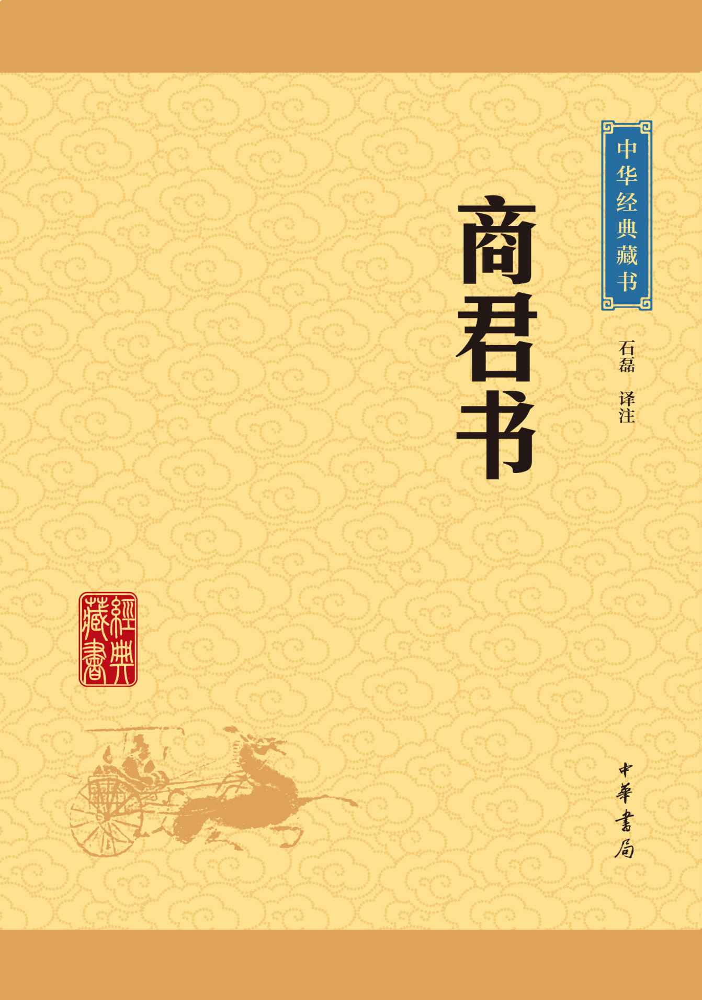

# 商君书

- 作者：商鞅
- 翻译：石磊
- 出版社：中华书局
- 出版时间：2009-10
- ISBN：978-7-101-07007-1
- 豆瓣：https://book.douban.com/subject/4090803
- 封面：

## 更法第一

> 更法，即变法。秦孝公登基之时“周室微，诸侯力政，争相并。秦僻在雍州，不与中国诸侯之会盟，夷翟遇之”（《史记·秦本纪》）。于是，秦孝公发奋图强，酝酿变法强国。本篇记载了秦国以商鞅为代表的革新派与以甘龙、杜挚为代表的守旧派围绕变法与否展开的激烈争论。商鞅极力鼓舞秦孝公不畏流俗，尽快实行变法。他指出建立礼法的目的是“爱民”、“便事”。所以，只要是强国利民的礼法制度就可以施行。针对保守派的质疑，商鞅以“三代不同礼而王，五霸不同法而霸”的历史事实说明变法才能图强，以“前世不同教，何古之法？帝王不相复，何礼之循”，反驳因袭守旧的迂腐之论，大胆断言“反古者未必可非，循礼者未足多是”，促使秦孝公下定变法决心。本篇是存世《商君书》中唯一一篇论辩形式的文章，文中商鞅以古论今，在对前代历史演绎归纳、分析综合的基础上得出令人信服的结论，在滔滔雄辩中一展他的治世之才。

### 原文

孝公平画[1](#f-1)，公孙鞅、甘龙、杜挚三大夫御于君[2](#f-2)。虑世事之变，讨正法之本[3](#f-3)，求使民之道。

### 注释

- <b id="f-1">[[1]](#a-1)</b> 孝公：秦孝公。姓嬴，名渠梁。公元前361至前338年在位。平画：商讨，谋划。 
- <b id="f-2">[[2]](#a-2)</b> 甘龙、杜挚：皆为秦孝公时大臣，其事迹不详。御：侍奉，陪侍。 
- <b id="f-3">[[3]](#a-3)</b> 正：修正。

### 译文

秦孝公同大臣商讨强国大计，公孙鞅、甘龙、杜挚三位大夫陪侍在孝公的左右。他们分析社会形势的变化，研究修正法制的根本原则，寻求统治人民的方法。

### 原文

君曰：“代立不忘社稷[4](#f-4)，君之道也；错法务明主长[5](#f-5)，臣之行也。今吾欲变法以治，更礼以教百姓[6](#f-6)，恐天下之议我也[7](#f-7)。”

### 注释

- <b id="f-1">[[1]](#a-1)</b> 代立：接替君位。社稷：土神和谷神，古时君主都祭祀社稷，后来就用社稷代表国家。 
- <b id="f-2">[[2]](#a-2)</b> 错法：订立法度。错，通“措”。明：彰明。长：权威。 
- <b id="f-3">[[3]](#a-3)</b> 教：教化。 
- <b id="f-4">[[4]](#a-4)</b> 议：批评。

### 译文

秦孝公说：“接替先君的位置做了国君后不忘国家社稷之事，这是国君应当奉行的原则；实施变法务必显示出国君的权威，这是做臣子的行为准则。现在我想要通过变法来治理国家，改变礼制来教化百姓，却又担心天下的人批评我。”

### 原文

公孙鞅曰：“臣闻之：‘疑行无名，疑事无功[8](#f-8)。’君亟定变法之虑[9](#f-9)，殆无顾天下之议之也[10](#f-10)。且夫有高人之行者，固见负于世[11](#f-11)；有独知之虑者，必见骜于民[12](#f-12)。语曰：‘愚者暗于成事[13](#f-13)，知者见于未萌[14](#f-14)。’‘民不可与虑始，而可与乐成。’郭偃之法曰[15](#f-15)：‘论至德者不和于俗，成大功者不谋于众。’法者，所以爱民也；礼者，所以便事也[16](#f-16)。是以圣人苟可以强国，不法其故；苟可以利民，不循其礼。”

孝公曰：“善！”

### 注释

- <b id="f-8">[\[8\]](#a-8)</b> 疑行无名，疑事无功：语出《战国策·赵策二》。
- <b id="f-9">[\[9\]](#a-9)</b> 亟：快，尽快。
- <b id="f-10">[\[10\]](#a-10)</b> 殆：表示希望的语气副词。无：通“毋”。议：议论，此指非议。
- <b id="f-11">[\[11\]](#a-11)</b> 负：背，背离，不赞同。
- <b id="f-12">[\[12\]](#a-12)</b> 骜（áo）：借为“謷”，嘲笑。
- <b id="f-13">[\[13\]](#a-13)</b> 暗：看不见，不明了。
- <b id="f-14">[\[14\]](#a-14)</b> 知：同“智”。
- <b id="f-15">[\[15\]](#a-15)</b> 郭偃：晋文公时大臣，掌卜筮之事。
- <b id="f-16">[\[16\]](#a-16)</b> 便：方便，便利。

### 译文

公孙鞅说：“我听说：‘行动迟疑不定就不会有什么成就，办事犹豫不决就不会有什么功效。’国君应当尽快下定变法的决心，不要顾虑天下人批评您。何况做出比他人高明的行为的人，一向会被世俗所非议；有独特见解的人，也会遭到周围人的嘲笑。俗语说：‘愚笨的人在事成之后还不明白是怎样一回事，聪明的人却能预见到那些还没有显露萌芽的迹象。’‘百姓是不可以同他们讨论开创某件事的，而只能够同他们一起欢庆事业的成功。’郭偃的法书上说：‘追求崇高道德的人不去附和那些世俗的偏见，成就大事业的人不去同众人商量。’法度，是用来爱护百姓的；礼制，是为了方便办事的。所以圣明的人治理国家，如果能够使国家富强，就不必去沿用旧有的法度；如果能够使百姓得到益处，就不必去遵循旧的礼制。”

孝公说：“好！”

### 原文

甘龙曰：“不然。臣闻之：‘圣人不易民而教[17](#f-17)，知者不变法而治。’因民而教者，不劳而功成；据法而治者，吏习而民安[18](#f-18)。今若变法，不循秦国之故，更礼以教民，臣恐天下之议君，愿孰察之[19](#f-19)。”

### 注释

- <b id="f-17">[\[17\]](#a-17)</b> 不易民：易，改变。民，当指民俗。
- <b id="f-18">[\[18\]](#a-18)</b> 习：熟悉。
- <b id="f-19">[\[19\]](#a-19)</b> 孰：同“熟”，仔细认真。

### 译文

甘龙说：“不是这样。我也听说这样一句话：‘圣明的人不去改变百姓的旧习俗来施行教化，聪明的人不改变旧有的法度来治理国家。’顺应百姓旧有的习俗来实施教化的，不用费什么辛苦就能成就功业；按照旧有的法度来治理国家，官吏驾轻就熟，百姓也安适。现在如果改变法度，不遵循秦国旧有的法制，更改礼制教化百姓，我担心天下人要批评国君了，希望君王认真考虑这件事。”

### 原文

公孙鞅曰：“子之所言，世俗之言也。夫常人安于故习，学者溺于所闻[20](#f-20)。此两者，所以居官而守法[21](#f-21)，非所与论于法之外也。三代不同礼而王[22](#f-22)，五霸不同法而霸[23](#f-23)。故知者作法，而愚者制焉[24](#f-24)；贤者更礼，而不肖者拘焉[25](#f-25)。拘礼之人不足与言事，制法之人不足与论变。君无疑矣。”

### 注释

- <b id="f-20">[\[20\]](#a-20)</b> 溺：沉溺，此指拘泥。
- <b id="f-21">[\[21\]](#a-21)</b> 居官：居于官位。
- <b id="f-22">[\[22\]](#a-22)</b> 三代：指夏商周三个朝代。王（wàng）：称王。
- <b id="f-23">[\[23\]](#a-23)</b> 五霸：齐桓公、宋襄公、晋文公、秦穆公、楚庄王。
- <b id="f-24">[\[24\]](#a-24)</b> 制：控制。
- <b id="f-25">[\[25\]](#a-25)</b> 不肖者：没有作为的人。

### 译文

公孙鞅说：“您所说的这些话，正是世俗的言论。平庸的人固守旧的习俗，死读书的人局限于他们听过的道理。这两种人，只能用来安置在官位上遵守成法，却不能同他们讨论变革旧有法度的事情。夏、商、周这三个朝代礼制不相同却都能称王于天下，春秋五霸各自的法制不同却能称霸诸侯。所以聪明的人能创制法度，而愚蠢的人只能受法度的约束；贤能的人变革礼制，而无能的人只能受礼制的束缚。受旧的礼制制约的人不能够同他商讨国家大事，被旧法限制的人不能同他讨论变法。国君不要迟疑不定了。”

### 原文

杜挚曰：“臣闻之：‘利不百，不变法；功不十，不易器。’臣闻：‘法古无过，循礼无邪[26](#f-26)。’君其图之[27](#f-27)！”

### 注释

- <b id="f-26">[\[26\]](#a-26)</b> 邪：偏斜。
- <b id="f-27">[\[27\]](#a-27)</b> 图：思考。

### 译文

杜挚说：“我听说过这样的话：‘如果没有百倍的利益不要改变法度，如果没有十倍的功效不要更换使用工具。’我还听说：‘效法古代法制不会有过错，遵循旧的礼制不会有偏差。’希望国君对这件事仔细考虑。”

### 原文

公孙鞅曰：“前世不同教[28](#f-28)，何古之法？帝王不相复[29](#f-29)，何礼之循？伏羲、神农教而不诛[30](#f-30)，黄帝、尧、舜诛而不怒[31](#f-31)，及至文、武[32](#f-32)，各当时而立法[33](#f-33)，因事而制礼。礼、法以时而定，制、令各顺其宜[34](#f-34)，兵甲器备各便其用。臣故曰：治世不一道，便国不必法古。汤、武之王也[35](#f-35)，不循古而兴[36](#f-36)；殷、夏之灭也[37](#f-37)，不易礼而亡。然则反古者未必可非，循礼者未足多是也[38](#f-38)。君无疑矣。”

### 注释

- <b id="f-28">[\[28\]](#a-28)</b> 教：政教。
- <b id="f-29">[\[29\]](#a-29)</b> 复：重复。
- <b id="f-30">[\[30\]](#a-30)</b> 伏羲：传说中的三皇之一。神农：三皇之一，农业和医药发明者。
- <b id="f-31">[\[31\]](#a-31)</b> 黄帝：传说中的五帝之一。尧：五帝之一。舜：五帝之一。
- <b id="f-32">[\[32\]](#a-32)</b> 文：周文王。武：周武王。
- <b id="f-33">[\[33\]](#a-33)</b> 当：顺应。
- <b id="f-34">[\[34\]](#a-34)</b> 宜：事宜。
- <b id="f-35">[\[35\]](#a-35)</b> 汤：商汤。武：周武王。
- <b id="f-36">[\[36\]](#a-36)</b> 循：遵循。
- <b id="f-37">[\[37\]](#a-37)</b> 殷：商朝。夏：夏朝。
- <b id="f-38">[\[38\]](#a-38)</b> 是：正确。

### 译文

公孙鞅说：“以前的朝代政教各不相同，应该去效法哪个朝代的古法呢？古代帝王的法度不相互因袭，应该遵循哪一种礼制呢？伏羲、神农施行教化不施行惩罚，黄帝、尧、舜虽然施行惩罚但却用刑不重，到了周文王和周武王的时代，他们各自顺应时势而建立法度，根据国家的具体情况制定了严格的法令。礼制和法令都要根据实际情况来制定，法条、命令都要顺应当时的社会事宜，就像兵器、铠甲、器具、装备的制造都要方便使用一样。所以我说：治理国家不一定都用一种方式，对国家有利不一定非要效法古代。商汤、周武王称王于天下，并不是因为他们遵循古代法度才兴旺的；殷朝和夏朝的灭亡，也不是因为他们更改旧的礼制才覆亡的。既然如此，那么违反旧的法度的人不一定要予以谴责，遵循旧的礼制的人不一定值得肯定。国君对变法的事就不要迟疑了。”

### 原文

孝公曰：“善！吾闻‘穷巷多怪[39](#f-39)，曲学多辨[40](#f-40)’。愚者笑之，智者哀焉；狂夫乐之，贤者丧焉。拘世以议，寡人不之疑矣。”于是遂出垦草令[41](#f-41)。

### 注释

- <b id="f-39">[\[39\]](#a-39)</b> 穷巷：地处偏僻的里巷。
- <b id="f-40">[\[40\]](#a-40)</b> 曲学：囿于一隅之学。辨：争辩。
- <b id="f-41">[\[41\]](#a-41)</b> 垦草令：秦孝公颁布的法令。

### 译文

孝公说：“好。我听说‘从偏僻小巷走出来的人爱少见多怪，学识浅陋的人多喜欢诡辩’。愚昧的人所讥笑的事，正是聪明人所感到悲哀的事；狂妄的人高兴的事，正是有才能的人所担忧的。那些拘泥于世俗偏见的议论言词，我不再因它们而疑惑了。”于是，孝公颁布了关于开垦荒地的命令。
