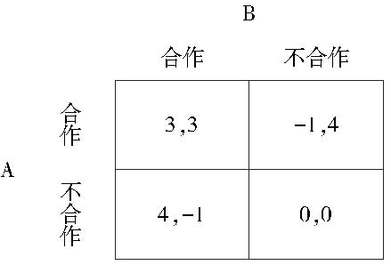

# 博弈与社会

- 作者：张维迎
- 出版社：北京大学出版社
- 出版时间：2013-01
- ISBN：978-7-301-21821-1
- 豆瓣：https://book.douban.com/subject/21329758
- 封面：

# 序言

除了个体利益之外，妨碍人与人合作的另一个重要原因是我们的知识有限。

让普通人接受自然科学的知识相对容易，但接受社会科学的知识很难。我们短视、傲慢、狭隘、自以为是，只知其然不知其所以然，经常不明白自己的真正利益所在。正是由于我们的无知，才导致了人类社会的许多冲突。许多看似利益的冲突，实际上是理念的冲突。事实上，大部分损人利己的无耻行为本质上也是无知的结果。损人者自以为在最大化自己的幸福，但结果常常是“聪明反被聪明误”，既损人又害己。有些人心地善良，一心为他人谋幸福，但由于无知，也给人类带来不小的灾难。计划经济就是一个典型的例子。

一部人类文明史就是一部不断创造囚徒困境，又不断走出囚徒困境的历史。

事实上，博弈论真正关注的是如何促进人类的合作。囚徒困境模型为我们提供了如何克服囚徒困境的思路。只有理解了人们为什么不合作，我们才能找到促进合作的有效途径。

无论是历史事实还是逻辑分析都证明，“利他主义”的假设更容易使人在行为上变坏，而不是相反。专制制度在中国盛行两千多年，至今阴魂不散，一个重要的原因就是我们假定皇帝是“圣人”，治理国家的官员是“贤臣”。如果我们早就假定皇帝是“理性人”，是“自私的”，中国也许早就实行民主和法治了。全世界最早实行民主制度的国家，正是那些最早不把国王当“圣人”、假定官员一有机会就会谋私利的国家。

# 第一章 导论 个体理性与社会最优

## 第一节 社会的基本问题

如果资源在每一种用途上面都具有随着资源使用量的增加而产生的边际回报下降的性质[[1]](#f1-1)，那么，最优的资源配置必须满足最后一单位资源无论用在哪一种用途上都产生相同的收益，即资源在每一种用途上的边际贡献都须相等。这一结论在经济学中被称为是等边际原理[[2]](#f1-2)。

> 本人注：这俩名词解释来自 cgatgpt
>
> **边际回报**和**边际贡献**是经济学和管理学中的两个概念，通常用于分析企业生产和定价决策。它们具体指：
>
> 1. **边际回报**（Marginal Return）：指在其他生产要素不变的情况下，通过增加一个单位的某种生产要素（如劳动、资本等）所带来的额外产出。一般会伴随“边际回报递减”的现象，即随着投入的增加，每增加一个单位的产出会逐渐减少。例如，一个工厂增加一名工人可能会提高产量，但增加到一定数量后，增加的产出就会减少。
>
> 2. **边际贡献**（Marginal Contribution）：指销售收入扣除可变成本后的剩余金额，也就是每卖出一件产品后，为公司“贡献”的利润。在公式上可以表达为：边际贡献=销售收入-可变成本
>
> 边际贡献用于衡量产品对利润的直接贡献，是决策产品生产、销售、定价等策略的关键指标。

美国生物学家爱德华·O.威尔逊（Edward O. Wilson）将“社会”(society)定义为：以相互协作的方式组织起来的一群同类个体[[4]](#f1-4)。更一般地，我们可以把社会定义为个体之间具有互动行为（interaction）和相互依赖（interdependence）的群体。也就是说，一个人做决策的时候，不仅要考虑自己有什么选择，还需要考虑别人有什么选择。由于没有任何人的选择是给定的，每个人决策得到的结果都会受到别人决策的影响。群体的这种互动行为，决定了个体的社会属性。人的社会属性意味着，一个人选择什么并不全是自己可以决定的事情，人的选择受社会价值观、文化等因素的影响。

大家做什么，自己也跟着做什么，不管其对错和原因，人的这种随波逐流现象在博弈论中叫做羊群效应（herd behavior）。

从人与人互动的角度来看，社会最基本的问题有两个：第一个是协调（coordination）问题，第二个是合作（cooperation）问题[[5]](#f1-5)。由于大量的现实问题经常是这两个问题综合在一起的，相互作用，相互影响，以致人们经常认为这是同一个问题。实际上，协调问题和合作问题有着很大的不同，所以在理论上把二者区别开来是非常重要的。

### 1.1 协调问题

考虑相向而行的两个人，每个人都有两种选择：靠右走或靠左走。如
果选择不一致，如一个人选择靠右走，另一个人选择靠左走，不免会相
撞；若选择一致，都靠右或是都靠左，则顺利通行，相安无事。我们可以
使用图1-1来描述这一情形：

\**图1-1 交通博弈*

第一个数字代表行人甲的回报，第二个数字代表行人乙的回报。

这个表格假定了在每一种情况下，双方得到的回报都相等，即要么都是1，要么都是-1。这个假定有和现实不符之处，因为现实中两人相撞时，可能一方比另一方损失惨重，顺利通过时，也会有一方比另一方得到的收益更大的情况。

协调问题的核心是人们如何预测他人的行为。解决预测最为直接的办法就是相互之间的沟通和交流。比如，如果行人甲和乙出行的方式是步行，这样，他们相遇时，能够通过语言或手势来进行沟通，协调各自的行动。

为了做出正确的预测，当事人需要掌握相关的知识。这些知识包括对行为规范的认识，对对方特性的认识，甚至还要掌握对方如何看待己方的认识等高阶知识[[6]](#f1-6)。

掌握有关对方如何看待己方的高阶知识也非常重要。由于知识结构、信仰、偏好等方面的差异，我们很难准确判断别人的企图，从而也很难知道别人是如何看待己方的判断。这时候，就会发生协调失灵。人类社会的许多冲突，不是源自利益的冲突，而是源自误解，也就是错误的预期。

一般来说，对于为做出正确的预测所需要的各方面的知识，我们往往是所知甚少（too little knowledge），甚至是没有可以利用的知识，正所谓“书到用时方恨少”。

有时候我们也会知道得太多（too much knowledge），以致超出我们大脑的加工和处理能力，使我们茫然不知所措。导致我们不能形成正确预测的另外一种情形是，我们有时缺乏正确运用知识的能力（fail to use the knowledge）。

在现实生活中，我们经常发现自己知道某些知识，但是在进行决策的时候，由于各种各样的原因，包括遗忘在内，我们没有正确地利用这些知识，以致事后追悔不已[[7]](#f1-7)。

当预期到其他人都会服从权威、遵守法规时，对于每一个人来说，遵守法规就是最好的选择。但一旦法规失去了权威，就无法起到协调作用，因为那时人们将无法预期其他人将会如何行动。在这个意义上，人们愿意接受权威的一个重要原因是为了更好地协调。乐队的指挥就是一个典型的例子。现实中，当某种紧急情况发生时（如交通严重堵塞），一个自告奋勇站出来发号施令的人也能得到大家的拥护，道理就在这里。

要解决协调问题，就需要人们能够相互正确地预测对方的行为。而要想做出正确的预测，需要沟通，需要恰当地掌握相关的知识，并能正确地加以运用；也需要一些明确的规则。沟通和规则都有协调预期的作用，二者的相对优势和相对重要性依具体问题而定。现实中，在有明确规则且规则发挥作用的情况下，我们可以借着规则来预测他人的行为。在规则不明确或规则难以发挥作用的情况下（包括不同的人心目中有不同的规则），沟通就变得更为重要。

### 1.2 合作问题

人类的进步几乎都是合作的结果，合作的范围越大，社会进步越快。如果没有合作，人类今天仍然只能生活在采集狩猎的时代

在某一活动中，每一个人都可以选择和对方合作，也可以选择不合作[[9]](#f1-9)。如果两个人都选择合作的话，每人都能分享合作所带来的好处，即所谓的合作红利。如果两个人都选择不合作，陷入霍布斯所谓的人与人之间的战争[[10]](#f1-10)，则两个人都会有所损失。如果一个人选择合作，另一个人选择不合作，则选择合作的一方将会吃亏，选择不合作的一方将从中获利颇丰。我们可以用图1-2来说明这个问题。

从两个人的总利益的角度，即所谓集体理性[[11]](#f1-11)来看，都选择合作是最优的。

如果每个人只从自己的利益出发做选择，这一社会最优的结果可能不会出现。因为每个人都会想到，如果对方选择合作，自己选择不合作得到的报酬为4，选择合作得到的报酬为3，此时选择不合作要优于选择合作；如果对方选择不合作，自己选择不合作得到的报酬为0，选择合作得到的报酬为-1，此时选择不合作仍然优于选择合作。所以，无论对方如何选择，自己选择不合作对自己来说都是最有利的结果。

这个例子表明，个体理性有时难以形成集体理性，在个体理性和集体理性之间存在冲突。这就是我们所称的合作问题（或合作困境）。

如果一个社会存在合作红利，我们如何来获得它？或者说，如果集体理性是我们所希望达到的，那么，我们如何通过个人的理性选择来实现？[[12]](#f1-12)在本书后面的讨论中我们将看到，人类社会的许多制度和文化就是为解决“囚徒困境”问题而演化出来的。

合作问题实质上是一个激励问题，如果我们希望经由个体理性选择来实现集体理性，获取合作红利，就需要对个人的行为进行激励和诱导。这种激励和诱导经常采用物质手段进行。比如，对于合作行为给予奖励，或者是对于不合作行为予以惩罚。

显然，进行物质奖励的一个前提是，要存在一个不受财富约束的第三方，从而能够有足够的财富来实施物质奖励。另一个前提是，该第三方要有足够的信息和能力以识别出谁选择了合作，谁选择了不合作，并且能够公允行事，从而能够正确地实施物质奖惩。

实施物质激励对第三方的财富、信息、能力、公正等方面均提出了较高的要求，在许多情况下，这四个方面可能很难实现

实际上，我们可以看到，在很多国家的主流价值观中，都对合作行为做出价值上的肯定。[[13]](#f1-13)即使在一些亚文化中，如黑社会的文化中，也对自我牺牲行为予以推崇。在这种价值观的影响下，人们从合作行为中不仅会获得物质利益上的回报，还会有精神上的奖励；同样，不合作的行为会使得当事人心生愧疚，从而降低了物质回报的诱惑。精神奖励之所以能发挥作用，是因为人类有对荣誉的追求。[[14]](#f1-14)

通过文化的熏陶、价值观的塑造，可以形成人们内在的精神力量，通过内省的机制，不需要借助第三方的监督从而节约大量的交易成本，较为低廉地促进合作的实现。

### 1.3 协调与合作交织

前面讨论了社会的两类基本问题：协调与合作。在现实生活中，协调问题和合作问题交织在一起，相互影响，相互作用，大量的问题实际上是协调问题和合作问题的结合。

设想有一座很窄的桥，一次只能有一辆车通过。现在从相对方向开来两辆车。如果一辆车先行，另一辆谦让，前者得2，后者得1；如果两车同时抢行，谁也无法通过，各损失2；如果两车都谦让，也是各损失2

这是一个典型的协调和合作的二重问题。合作意味着一个先行，另一个谦让，对双方来说比都抢行或都谦让好。但如果双方预期不一致，合作结果就不会出现。许多情况下交通堵塞的出现是协调失败和合作失败共同作用的结果，首先可能是因为某个事件的出现打乱人们的预期，如修路，这时本应该靠右行走的车辆需要靠左行驶，以致人们需要降低车速来相互调整；如果大家相互合作，交替使用左车道，就不会出现拥堵，但是这需要每一个人都等待一些时间。但是，由于谁也不愿意等待，大家都想争先，以致僵在一起，谁也走不了。大家都不选择合作，局面反而更糟。

有时候，即使预期一致，由于个人利益与集体利益的不一致，也会导致合作失败。比如，出现在金融业中的银行挤兑现象往往是大家都预期到某家银行要倒闭，由于大家担心后去提款会让自己利益遭受损失，所以都争先恐后去提款，结果反而使本来不会倒闭的银行出现倒闭，甚至波及业务相关的其他银行，使其他银行也卷入挤兑风潮，导致整体储户的利益受损。从事后看，每个人的预期都是对的。[[15]](#f1-15)

由于一方面协调问题和合作问题的作用机制存在差异，另一方面它们又相互影响、相互作用，所以解决协调和合作这两个社会基本问题需要针对不同的情况来寻求不同的方式和方法。

一般说来，社会规模越大，解决这两个问题的难度也就越大。根据前面的分析，我们知道解决协调问题需要正确的预测，为此需要掌握相关的知识和规则。显然，在小范围的社会内，涉及的互动对象较少，一般而言需要掌握的相关知识也较少，这样就比较容易做出正确的预测，从而相对容易协调。

从合作的角度来看，参与的人数越多，个人行为的成本与收益越不对称，价值观也越多元化，甚至对于什么行为是合作行为都会有不同的理解（如中国人点头表示同意了，日本人点头表示知道了），这必然使得合作变得更加困难。

就人类社会的长期发展而言，二者是内生的，它们是人类选择的结果。现代社会是一个分工社会，分工是内生性的协调与合作的重要驱动力。人类为合作而分工，分工又使协调变得更为重要。孤岛上的鲁滨孙不需要与他人协调，但他也没有机会获得分工带来的好处。分工提高了生产效率，但如果生产者与消费者之间以及不同生产者之间不能有效地协调他们之间的行动，分工就不会产生合作的效率。生产者如何预期消费者的需求，这本身就是一个协调问题。预测失败意味着生产的产品并没有真正的价值，严重的情况下会导致经济危机。同样，在生产过程中价值链上的不同环节之间如果不能有效协调，单个环节上生产效率的提高不仅不能增进人类的福利，反而导致资源的浪费。分工之后，每一个人都只是掌握局部的知识，形成“隔行如隔山”的局面，协调也就更为困难。信息的分散也意味着欺骗行为更不容易被发现，这又使合作的难度加大了。[[16]](#f1-16)

### 1.4 正式制度与非正式制度

协调要求预期的一致性，合作要求个人利益和集体利益的一致性。如果这两种一致性同时满足，就会出现理想的结果。

社会生活中，我们人类建立了各种各样的制度，这些制度可以分为正式的制度和非正式的制度，或者称为明规则和潜规则。

几乎每一个组织都有自己的正式制度和非正式制度。官场陋习也可以理解为非正式制度。[[17]](#f1-17) 文化实际上可以看成一些相关的正式制度和非正式制度的集合。正式的制度一般需要依赖第三方的权威来实施。

在很多情况下，制度（包括非正式制度）还会起到形成和改变人们预期的作用。比如，英国的希思罗机场规模非常巨大，旅客非常容易走失。如何尽快地找到失散的同伴就是一个典型的协调问题：因为你很难预期你的同伴会在哪儿等你。为了解决这样一个协调问题，管理当局在机场设立了一个“碰头点”（meetingpoint）。这样，任何走散的客人都会想到来这个地点等候同伴。设这样一个“碰头点”，实际上是为了解决协调问题确立了一个非正式制度。

经济学家区别了价格制度和非价格制度，这一分类与正式制度和非正式制度的分类相关但并不相同。价格制度是什么？简单地说，就是通过货币价格实现的商品和服务的市场交换。而许多互惠的交换行为，并不以货币形态表现。

市场经济中，价格只是市场运作的形式之一，市场经济中的大部分非价格制度（如声誉机制）都是市场制度不可或缺的组成部分。市场最本质的是自由选择和自由签约权，而不是价格。反过来，在计划经济下，即使价格也只是政府控制经济的手段，而不是真正的市场机制，因为这种价格不是自由形成的。

无论什么制度，正式的也好，非正式的也好，价格的还是非价格的，都是人创造的，也是由人执行的，其中，“企业家”是创造制度和执行制度中最重要的非政府力量。[[19]](#f1-19)

## 第一章附录

<b id="f1-1">[[1]](#a1-1)</b> 这一性质在经济学中称为边际生产力递减规律，或者边际报酬递减规律、边际效用递减规律。

<b id="f1-2">[[2]](#a1-2)</b> 对于等边际原理，几乎在任何一本经济学的初级教科书中都会介绍。这里我们向大家推荐曼昆的《经济学原理》。

<b id="f1-4">[[4]](#a1-4)</b> 参阅爱德华·威尔逊，《社会生物学——新的综合》，北京理工大学出版社2008年版，第2章。

<b id="f1-5">[[5]](#a1-5)</b> 我这样归纳很大程度上受到著名社会理论家Jon Elster (1989a)的启发。他在*The Cement of Society*一书中界定了社会秩序（social order）的两个问题：行为的可预测性（predictability）和合作（cooperation）。相应地，他区别了两种社会无序：预测失败导致的无序和缺乏合作导致的无序。但他讲的预期失败常常与利益冲突有关。我用“协调”代替“预期”是想把没有利益冲突的协调问题与有利益冲突的合作问题区别开来。

<b id="f1-6">[[6]](#a1-6)</b> 高阶知识是博弈论中的一个概念，简单说来，它描述的是人们对于其他人掌握信息情况的一种判断和认识。比如，在空城计中，“诸葛亮生平谨慎，不曾弄险”是司马懿所掌握的有关诸葛亮的信息，而诸葛亮知道司马懿掌握这一信息，诸葛亮的这一知识相对于司马懿的知识就是一种高阶知识。

<b id="f1-7">[[7]](#a1-7)</b> 关于缺乏知识、太多知识和不能有效利用知识对预测的影响，参阅 Elster (1989)，第 2-4 页。

<b id="f1-9">[[9]](#a1-9)</b> 根据活动的内容不同，合作和不合作会有不同的内涵，其中有些情况下所谓的“合作”实际上是“合谋”。比如，在犯罪活动中，A代表某一犯罪嫌疑人，B代表另一个，A 和 B 的合作是指两个人都选择不揭发对方，不合作则是揭发对方；在经济活动中，A、B 代表两个竞争对手，合作是指选择维持高价格，不合作是指选择降低价格。

<b id="f1-10">[[10]](#a1-10)</b> 霍布斯，《利维坦》，商务印书馆 2009 年版。

<b id="f1-11">[[11]](#a1-11)</b> 集体理性是指满足总收益最大化的选择或对所有成员都最好的选择。个人间的利益能否加总以及如何加总是一个有待深入讨论的话题。实际上，由于个人之间的偏好难以比较，我们很难判断一个人的快乐能否抵得过另一个人的苦难。在这种情况下，我们只能采用最弱的集体理性标准，这就是第三节讲的帕累托标准。

<b id="f1-12">[[12]](#a1-12)</b> 借用霍布斯的说法就是，我们如何避免陷入人与人的战争的泥淖中。

<b id="f1-13">[[13]](#a1-13)</b> 第十四章我们将会讨论到这个问题。

<b id="f1-14">[[14]](#a1-14)</b> 这是人类的先知们早就认识到的。根据马斯洛的心理需求层次学说，人在满足基本生存需要和安全需要后，还要追求集体的归属感以及自我实现，这体现在现实生活中人们对于名誉和社会地位的追求。但马斯洛的需求层次理论过于简单。事实上，即使温饱没有解决的人，也有对个人尊严的需求。马斯洛的心理需求层次学说，见Maslow (1943, 1954)。

<b id="f1-15">[[15]](#a1-15)</b> 这是心理学中著名的“弄假成真效应”（self-fulfilling prophecy），即不正确的预期导致了人们的行为朝着该预期去做，结果让原来不正确的预期变成了现实。参阅Jussim (1986)。

<b id="f1-16">[[16]](#a1-16)</b> 正是认识到这一点后，亚当·斯密一方面在《国富论》一书中论述分工可以增进一国财富，另一方面又在《道德情操论》一书中强调道德促进人们之间达成合作的重要性。

<b id="f1-17">[[17]](#a1-17)</b> 正式制度和非正式制度是一个非常流行的分类，在全社会层次大致对应于法律和社会规范，在组织层次对应于明文规定的规章制度和组织文化。严格来讲，这样的划分是有误导的，因为不成文的规则不等于是非正式的。但本书中我们不对这些概念做严格定义，读者可以根据上下文理解我们使用这些术语时的含义。“潜规则”这个词有一定的贬义，我们当做中性词使用。黑社会中的潜规则要求讲义气，如果有谁不讲义气，往往会遭到黑社会老大的处罚。学者吴思在所著《隐蔽的秩序》一书中对中国明代官场的各种“潜规则”有细致的刻画和深入的分析。

<b id="f1-19">[[19]](#a1-19)</b> 我们将区分商界企业家（business entrepreneur）与制度企业家（norm entrepreneur），前者指从事营利性商业活动的企业家，后者指社会行为规范（norms）的创立者和推行者。他们的共同之处是创新。通常指的企业家是商界企业家，除非特别说明，本书中我们也沿用这一惯例。我们将在第十四章讨论制度企业家。

# 第二章 第二章 纳什均衡与囚徒困境博弈