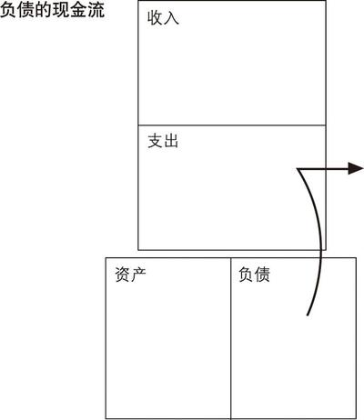
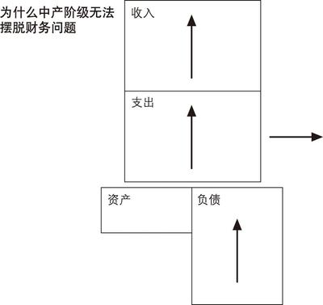

# 富爸爸穷爸爸

- 作者：罗伯特·清崎 / 莎伦·莱希特
- 译者: 萧明
- 出版社：四川文艺出版社
- 出版时间：2014-01
- ISBN：978-7-5411-3812-6
- 豆瓣：https://book.douban.com/subject/25816940
- 封面：

# 序言 这就是你所需要的

罗伯特·清崎开发的这种新的教育产品给我的丈夫迈克尔留下了深刻的印象，于是，他安排我去参加“现金流”首版的一个测试。因为这是一个教育游戏，所以我问19岁的女儿是否愿意一块儿去。她在本地大学刚上大一，她同意了。

大约有15人，被分成3组，参加了这个游戏测试。

迈克尔是对的，这正是我在寻找的教育产品。它的游戏板有点类似“大富翁”的游戏板，但中间画着一只时髦的大老鼠。它并不像“大富翁”那样简单，游戏板上有两条路：一条在内部，一条在外部。游戏的目标是走出内部——罗伯特把它称为“老鼠赛跑”——来到外面的路上，它也叫“快车道”。罗伯特所设计的“快车道”模仿了富人在现实世界中的生活。

罗伯特为我们讲解“老鼠赛跑”的含义：

“如果你看看那些受过教育的、努力工作的人的生活，就会看到一条十分相似的道路。孩子出生了，然后去上学。自豪的父母十分兴奋，因为他们的孩子很优秀，成绩很好，还上了大学。之后孩子从大学毕业了，也许还会继续念研究生，然后像编好的程序一样做下面的事：找个安稳的工作。孩子们找了工作，可能是医生，也可能是律师，或者参军或是进政府部门。他们开始挣钱了，手上有了一大堆信用卡，他们会买很多东西，如果以前他们还没买的话。”

“手里有了钱，孩子们就会去其他年轻人都喜欢去的地方。他们在那里结交朋友、约会，可能还会结婚。现在生活简直棒极了，因为在现代社会里夫妻双方都工作，两份收入真是太幸福了。他们觉得成功了，前途光明，于是决定买房、买车、买电视机、度假并且生孩子。这样甜蜜的负担就来了：他们需要大量的钱。那对幸福的夫妇认定他们的事业是最重要的，并且开始更加努力地工作，希望能够升职和加薪。他们加薪了，但另一个孩子也出生了，于是他们就需要一幢更大的房子。他们工作得更努力、更专注了，也成为了更优秀的雇员。他们回到学校去学习更多的专业技能，以便赚更多的钱。他们可能会再做一份兼职。他们的收入上升了，但要缴纳的房地产税、社会保险税和其他税也上升了。他们赚了很多钱却不知道钱都到哪儿去了。他们买了一些基金，还用信用卡购买日用品。孩子们都已经五六岁了，又要为他们上大学和自己的退休金存钱了。”

“这对快乐的夫妇，在35岁后陷入了‘老鼠赛跑’的陷阱。他们不仅为公司老板工作，还要通过缴税为政府工作，通过偿还住房贷款和信用卡贷款为银行工作。接着，他们劝告他们的孩子努力学习，取得好成绩，然后找个安稳的工作或职业。而对于钱，除了从那些利用他们的天真而获利的人那儿学到点东西之外，他们什么都没学到。他们终生辛苦地工作，他们的下一代又将重复相同的过程，这就叫‘老鼠赛跑’。”

罗伯特最关心的是在美国以及世界各地穷人和富人之间日益加深的鸿沟。作为一个自学成材、白手起家的企业家，罗伯特周游世界进行投资。他在47岁时就能够退休了，他退休是由于他和我一样关心孩子。他知道世界在变，教育却并没有随之改变。在罗伯特看来，孩子们把时间都浪费在一个过时的教育体系中，学一些他们永远用不着的东西，并为一个根本不存在的世界做准备。

罗伯特说教育是成功的基础，正如学校里教的某些技能非常重要一样，理财技能和沟通技巧也十分重要。因为被两个父亲培养长大，他被告知要为两个截然不同的目标奋斗。他受过良好教育的父亲建议他为企业工作，而他富有的父亲则建议他拥有自己的企业。两条道路都需要教育，但学习的科目却完全不同。他受过良好教育的父亲鼓励他成为聪明人，而他富有的父亲则鼓励他雇用聪明人。

今天我们面临着经济全球化和新技术的变革，它同人类从前经历过的变革一样剧烈，甚至有过之而无不及。没人拥有可以预测未来的水晶球，但有一件事是可以肯定的：比我们现实生活中的变化更大的变化就在前面。谁知道未来会怎么样？但无论发生什么，我们至少有两个基本的选择：安全地理财，或是通过接受教育唤醒你和你孩子的理财天赋，从而更聪明地理财。

# 第1章 富爸爸，穷爸爸

我有两个爸爸，一个富，一个穷。一个受过良好的教育，聪明绝顶，拥有博士头衔，曾经没用两年就修完了4年的本科学业，随后又在斯坦福大学、芝加哥大学和西北大学深造，并都拿到了全额奖学金；但另一个却连八年级都没能念完。

两个爸爸的事业都相当成功，而且一辈子都非常勤奋。他们都有着丰厚的收入。然而其中一个人终其一生都在个人财务问题的泥沼中挣扎，另一个人则成了夏威夷最富有的人之一。一个爸爸去世后为家人、慈善机构和教堂留下了数千万美元的遗产，而另一个爸爸只留下一些待付的账单。

对于富爸爸和穷爸爸的观念，我并不简单地接受或拒绝，我发现自己有更多的思考，在它们之间进行了比较，再为自己作出选择。

一个爸爸会说：“贪财乃万恶之源。”而另一个爸爸却说：“贫穷才是万恶之本。”

富人之所以越来越富，穷人之所以越来越穷，中产阶级之所以总是在债务的泥潭中挣扎，其中一个主要原因就是，他们对金钱的认识不是来自学校，而是来自家庭。关于金钱，贫穷的父母能够教给孩子们什么呢？他们只会说：“在学校里要好好学习喔。”结果，他们的孩子可能会以优异的成绩毕业，但同时也秉承了穷人的理财方式和思维习惯。

学校并没有开设有关“金钱”的课程。学校教育只专注于学术知识的传授和专业技能的培养，却忽视了理财技能的培训。

我的一个爸爸总是习惯说“我可付不起”，而另一个爸爸则禁止我们说这样的话，他坚持让我这样说：“我怎样才能付得起？”这两句话，一句是陈述句，一句让你放弃，而另一句则促使你去想办法。另一句是疑问句。我那个在不久之后就富起来的爸爸解释，当你下意识地说出“我付不起”的时候，你的大脑就会停止思考；而如果你自问“我怎样才能付得起”，则会让你的大脑动起来。当然，他的意思并不是让你把每件想要的东西都买到手，这里只是强调要不停地锻炼你的大脑——它是世界上最强大的“计算机”。富爸爸说：“我的大脑越用越活，大脑越活，我挣的钱就越多。”他认为，下意识地说“我可付不起”意味着精神上的懒惰。

一个爸爸说：“当涉及钱的时候要小心，别去冒险。”而另一个爸爸则说：“要学会管理风险。”

一个爸爸认为“房子是最大的投资和资产”，而另一个爸爸则相信“房子是负债，如果你的房子是你最大的投资，你就有麻烦了”。

两个爸爸都会准时付账，但不同的是：一个预先支付账单，而另一个到限期才支付账单。

我的穷爸爸总是说：“我永远也不会成为富人。”于是这句话就成了事实。而我的富爸爸恰恰相反，他总是把自己说成是一个富人。他会这样说：“我是一个富人，富人不会这么做。”甚至当一次严重的经济挫折使他一文不名后，他仍然把自己当做富人。他会这样安慰自己：“贫穷和破产的区别是：破产是暂时的，而贫穷是永久的。”

我的穷爸爸也会说“我对钱不感兴趣”或“钱对我来说并不重要”，而我的富爸爸则说“金钱就是力量”。

尽管两个爸爸都高度重视教育和学习，但两人对于什么才是最应该学习的看法却不同。一个爸爸希望我努力学习，获得学位，找个工资高的好工作。他希望我能成为一名专业人士，例如：律师、会计师，或者去商学院读MBA。另一个爸爸则鼓励我学习成为富人，了解钱的运动规律并让钱为我工作。“我不为钱工作，”这句话他说了一遍又一遍，“我要让钱为我工作。”

钱是一种力量，但更有力量的是财商教育。钱来了又会去，但如果你了解钱是如何运动的，你就获得了驾驭它的力量，就能开始积累财富了。大多数人光想不干，原因是他们在接受学校教育时并没有掌握钱的运动规律，所以他们终生都在为钱工作。

我开始学习金钱这门课程时只有9岁，因此富爸爸教我的东西都非常简单。他把所有想教给我的东西说完、示范完，概括起来也只有6门主要的课程，在过去的30多年中，我们一直在重复和加强这些课程。

# 第2章 第一课 富人不为钱工作

“爸爸，你能告诉我怎样才能变得富有吗？”

“哦，儿子，”他慢慢地开口了，“如果想富有，你就必须学会挣钱。”

“那么怎么挣钱呢？”我问。

“用你的头脑，儿子。”他说着，并微笑了一下，这种微笑意味着“我要告诉你的就这些”，或者“我不知道答案，别为难我了”。

## 课程开始了

“好吧，我说说我的建议：我会教你们，但不像在学校那样。你们为我工作，否则我就不教。因为通过工作我可以更快地教会你们。如果你们只想坐着听讲，就像在学校里一样，那我就是在浪费时间。这就是我的建议，你们可以接受也可以拒绝。”

“嗯……我可以先问个问题吗？”我问。

“不能，你只能告诉我是接受还是拒绝。因为我有太多的事要做，不能浪费时间。如果你不能下定决心，就永远也学不会如何赚钱。机会总是转瞬即逝。知道什么时候要迅速作出决定是一项非常重要的技能。现在你有一个你想要的机会，但你想进入的这所学校会在10秒钟内开学或者关门。”迈克的爸爸说，脸上带着揶揄的微笑。

“接受。”我说。

“接受。”迈克也说。

“好！”迈克的爸爸说道，“马丁夫人会在10分钟内到这儿。等我和她办完事后，你们就和她坐车去我的小超市，然后就可以开始工作了。我每小时付给你们10美分，你们每周六工作3个小时。”

...

迈克的爸爸，就是我称为“富爸爸”的那一位，拥有9个这样的小型超市，它们是像“7-11”那样的便利店的雏形，当时除了这些小型超市以外附近几乎没有可以买到牛奶、面包、黄油和香烟的杂货店，所以生意还不错。

...

第四个星期的星期三，我决定要退出。我答应工作是因为想跟迈克的爸爸学习赚钱，而现在我成了每小时10美分的奴隶。更糟糕的是，自从第一个星期六后我就一直没见到过我们的赚钱老师——迈克的爸爸。

## 星期六的排队等候

我已经准备好要面对迈克的爸爸，就连我的亲爸爸也生气了。我的亲爸爸，我叫他穷爸爸，认为我的富爸爸违反了《童工法》，应该受到调查。

...

“你不讲信用！”我脱口而出，眼泪差点掉下来。让一个9岁的小男孩去面对一个成年人是会觉得有点害怕。

“你说过如果我为你工作，你就会教我。好，我给你干活，我工作努力，我还放弃了棒球比赛，而你却说话不算数，你什么也没教我！就像镇上人说的，你是一个骗子，你贪心。你就想挣钱，却毫不关心你的雇员。你一点儿也不尊重我，让我等了这么久。我只是个小孩，我应该得到优待！”

“你从来没和我谈过话，我已经干了3个星期，而你什么也没教给我。”我撅着嘴说。

“教东西一定要说或讲吗？”富爸爸问。

“是呀。”我回答道。

“那是学校教你们的法子，”他笑着说，“但生活可不是这样教你的。我得说生活才是最好的老师。大多数时候，生活不会和你说什么，它只是推着你转，每一次推，它都像是在说：‘喂，醒一醒，我要让你学点东西。’”

富爸爸仍在说：“假如你学会了生活这门课程，做任何事情你都会游刃有余。如果你学不会，生活照样会推着你转。人们通常会做两件事，一些人在生活推着他转的同时，抓住生活赐予的每个机会；而另一些人则非常生气，去与生活抗争。他们与老板抗争，与工作抗争，甚至与自己的配偶抗争，他们不知道生活同时也给了他们机会。”

“生活推着我们所有的人，有些人放弃了，有些人在抗争。少数人学会了这门课程，取得了进步，他们欢迎生活来推动他们，对他们来说，这种推动意味着他们需要并愿意去学习一些东西。他们学习，然后取得进步。但大多数人放弃了，还有一部分人像你一样在抗争。”

富爸爸站起来，关上了那扇嘎吱直响的旧木窗户。“如果你学会了这门课程，你就会成为一个聪明、富有和快乐的人。如果你没有学会，你就只会终生抱怨工作、低报酬和老板，你终其一生希望有个大机会能够把你所有的钱的问题都解决。”

富爸爸继续说：“如果你是那种没有勇气的人，生活每次推动你，你都会选择放弃。如果你是这种人，你的一生会过得稳稳当当，不做错事、假想着有事情发生时自救，然后慢慢变老，在无聊中死去。你会有许多朋友，他们很喜欢你，因为你真的是一个努力工作的好人。你的一生过得很安稳，处世无误。但事实是，你向生活屈服了，不敢承担风险。你的确想赢，但失败的恐惧超过了成功的兴奋。只有你知道，在你内心深处，你始终认为你不可能赢，所以你选择了稳定。”

...

富爸爸向后靠去并开心地笑了起来，然后他说：“你最好改变一下观点，停止责备我，不要认为是我的问题。如果你认为是我的问题，你就会想改变我；如果你认为问题在你那儿，你就会改变自己，学习一些东西让自己变得更聪明。大多数人认为世界上除了自己外，其他人都应该改变。让我告诉你吧，改变自己比改变他人更容易。”

## 穷人和中产阶级为钱工作

富爸爸继续给我上第一课：“我很高兴你为每小时10美分的报酬生气，如果你不生气而是高兴地接受了，那我只能说我没法教你。你看，真正的学习需要精力、激情和热切的愿望。愤怒是其中一个重要的组成部分，因为激情正是愤怒和热爱的结合体。说到钱，大多数人都希望稳稳妥妥地挣钱，这样他们才感到安全。关于钱，他们没有激情，有的只是恐惧。”

富爸爸也笑了，“你瞧，你爸爸上了大学而且受到很好的教育，所以他有希望得到一份高薪的工作。他的确做到了，但他还是为钱所困，原因就是他在学校里从来没学过关于钱的知识。而且最大的问题是，他相信工作就是为了钱。”

“如果你想为钱而工作，那就待在学校里吧，那可是一个学习这种事的好地方。但是如果你想学习怎样让钱为你工作，那就让我来教你。不过首先你得想学。”

“正是出于恐惧的心理，人们才想找一份安稳的工作。这些恐惧有：害怕付不起账单，害怕被解雇，害怕没有足够的钱，害怕重新开始。为了寻求保障，他们会学习某种专业，或是做生意，拼命为钱而工作。大多数人成了钱的奴隶，然后就把怒气发泄在他们老板身上。”

“你现在才9岁时，就已经有了为钱工作的体验了。你只需把上个月的生活重复50年，就会知道大多数人是如何度过一生的了。”

...

“每次结束3小时的工作，马丁太太给你3个硬币，这时你又有什么感觉？”

“我觉得钱不够。感觉就像什么也没得到似的，真让人失望。”

“这也正是大多数雇员拿到工资单时的感觉，他们还要扣掉税和其他一些支出。至少，你拿到的还是100％的工资。”

“你是说工人们拿到的不是全部的工资？”我吃惊地问。

“当然不是，”富爸爸说，“政府要先拿走属于它的那份。”

“它怎么拿呢？”

“通过税收，”富爸爸说，“你挣钱时得缴税，花钱时也得缴税。你存钱时得缴税，你死时还得缴税。”

“政府怎么能这样？”

“富人就不会这样，”富爸爸微笑着说，“只有穷人和中产阶级是这样。我敢打赌我赚的比你爸爸多，但他缴的税比我多。”

...

“就像我说的，这里头有不少东西要学。学习怎样让钱为你工作是一个持续终生的过程。大多数人上了4年大学后，学习也就到头了。可我知道我会用一辈子去研究钱这东西，因为我研究得越深，就越发现我还有更多的东西要学习。大多数人从不研究这个问题，他们去上班，挣工资，平衡收支，仅此而已，他们不明白自己为什么老缺钱，于是以为多挣点钱就能解决问题，但几乎没有人意识到缺乏财商教育才是问题的关键。”

“税只是学习如何让钱为你工作的一个极小的部分。今天，我只想弄清楚你是否仍有热情去了解钱这东西。大多数人都没有这样的愿望，他们只想进学校，学习一门专业技能，然后轻松工作、挣大钱。到他们某一天醒来，发现已面临严重的财务问题时，他们已经不能停止工作了。这就是只知道为钱工作而不学习如何让钱为自己工作的代价。现在你还有热情学习吗？”富爸爸问。

“听着。一分钱也不给。每星期六你照样干3个小时，但不会再有每小时10美分的报酬了。你说你想学习不为钱工作，所以我什么都不给你。”

“你说过你想学习。如果你现在不学，将来就会像坐在客厅里的那两个女人和那个男人一样，为钱工作并且希望我别解雇他们。或是像你爸爸那样，挣了很多钱却眼看着债台高筑而毫无办法，希望靠拥有更多的钱来解决问题。如果你想这样，我可以按照原来的约定每小时付给你10美分。你也可以像大人那样，抱怨这里工资太低，辞职另找工作。”

“那我该怎么做呢？”我问。

富爸爸拍了拍我的头，“动动脑子，”他说，“如果你好好想一想，就会感谢我给你这个机会，让你成为有钱人。”

## 富人不为钱工作

在接下来的3个星期里，我和迈克每个星期六白干3小时。这工作不再让我心烦，过程也容易些了。只是无法参加棒球赛以及不能再买连环画让我耿耿于怀。

富爸爸在第三个周末的中午来了。我们听见他的卡车进了停车场，然后发动机熄火了。他走进店里与马丁太太拥抱致意。他看了店面的销售情况后，走向冰激凌柜，取出两个冰激凌，付了钱，然后向我和迈克打了个手势。

## 避开一生中最大的陷阱

“好吧，孩子们，你们最好开始开动脑筋。你们正在学习一生中最重要的一课。如果学好了这一课，你们将永享自由和安宁；如果没有学好，你们就会像马丁太太和在草地上打垒球的大多数人一样度过一生。他们为了一点点钱而勤奋工作，深信有工作就有了保障，盼着一年3个星期的假期和工作45年后才能获得的一小笔养老金。”

“大多数人都希望有一份工资收入，因为他们都有恐惧和贪婪之心。一开始，没钱的恐惧会促使他们努力工作，得到报酬后，贪婪或欲望又让他们想拥有所有用钱能买到的好东西。于是就形成了一种模式。”

“起床，上班，付账，再起床，再上班，再付账……他们的生活从此被这两种感觉所控制：恐惧和贪婪。给他们更多的钱，他们就会以更高的开支重复这种循环。这就是我所说的‘老鼠赛跑’。”

“他们并不清楚自己真正的感觉，只是作出反应，而不去思考。他们感到恐惧，于是就去工作，希望钱能消除恐惧，但没有奏效。于是，恐惧追逐着他们，他们只好又去工作，再一次期望钱能平复这种恐惧，但还是没有成功。恐惧使他们落入工作的陷阱，挣钱——工作——挣钱，希望恐惧就此烟消云散。但每天他们起床时，就会发现恐惧又与他们一起醒来了。恐惧使成千上万的人彻夜难眠，忧心忡忡。所以他们又起床去工作了，希望薪水能消除噬咬他们灵魂的恐惧。钱主宰着他们的生活，他们拒绝去分辨真相，钱控制了他们的情感和灵魂。”

“现在让我谈谈另一种感情：欲望。有人把它称为贪婪，但我更喜欢用欲望这个词。希望拥有一些更好、更漂亮、更有趣或更令人激动的东西，这是相当正常的。所以人们也为了实现欲望而工作。他们认为钱能买来快乐，可用钱买来的快乐往往是短暂的，所以不久他们就需要更多的钱来买更多的快乐、更多的开心、更多的舒适和更多的安全感。于是他们继续工作，以为钱能安抚他们备受恐惧和欲望折磨的灵魂，但实际上钱是无法做到这一点的。”

“事实上，许多人致富并非出于欲望而是由于恐惧，他们认为钱能消除贫困带来的恐惧，所以他们积攒了很多的钱，却发现恐惧感更加强烈了。他们又开始害怕失去钱。我有一些朋友，他们已经很有钱了，但还在拼命工作。我还认识一些百万富翁，他们现在甚至比他们穷困时还要恐惧，他们害怕失去所有的钱。他们越富有，这种感觉就越强烈。他们灵魂中软弱贫乏的一面总是在大声尖叫，他们不想失去大房子、车子和钱带给他们的上等生活。他们甚至担心一旦没钱了，朋友们会看不起他们。许多人变得绝望而神经质，尽管他们很富有。”

“正是因为有感情，我们才成为人。感情使我们更加真实，它是我们行动的动力。忠实于你的感情，以你喜欢的方式运用你的头脑和感情，不要让它们控制你。”

富爸爸说，“我只希望你们有机会避开由恐惧和欲望组成的陷阱，按照你们喜欢的方式利用恐惧和欲望，而不要让它们控制你们。这就是我想教你们的。我对教你们挣大钱不感兴趣，那解决不了问题。如果你们不先控制恐惧和欲望，即使你们获得高薪，也只不过是金钱的奴隶而已。”

“造成贫困和财务问题的主要原因是恐惧和无知，而不是经济环境、政府或者富人。人们自身的恐惧和无知使他们困在陷阱里，所以你们应该去上学、接受高等教育，而让我来教你们怎样不落入陷阱。”

“大多数人让恐惧和贪婪来支配自己，这是无知的开始。因为恐惧和贪婪，大多数人一生都在追求工资、加薪和职业保障，从来不问这种感情支配思想的生活之路将通向哪里。就像一幅画表现的：驴子拉车，因为主人在它面前挂了个胡萝卜。主人清楚自己想要去哪里，而驴子却只是在追逐一个幻影。但第二天驴子依旧会去拉车，因为又有胡萝卜放在它的面前。”

“恐惧把你推出门外，欲望又开始召唤你，诱惑你去触礁。这就是陷阱。”

“无知使恐惧和欲望更加强烈，这就是为什么很多有钱人越有钱就越害怕。钱就是驴子面前的胡萝卜，是幻象。如果驴子能了解到全部事实，它可能会重新想想是否还要去追求胡萝卜。”

“你去学校学习一种技术或一门专业，并成为对社会有益的人。每一种社会文明都需要教师、医生、工程师、艺术家、厨师、商人、警察、消防员、士兵。学校培养了这些人才，所以我们的社会才能蒸蒸日上。”富爸爸说，“但不幸的是，对许多人来说，离开学校是学习的终点而不是起点。”

“永远不要忘记，你有两种感情——恐惧和欲望，如果你让它们来控制你的思想，你就会落入一生中最大的陷阱。一直生活在恐惧中，从不追求自己的梦想，这是残酷的。为钱拼命工作，以为钱能买来快乐，这也是残酷的。半夜醒来想着还有许多账单要付是一种可怕的生活方式，以工资的多少来决定过什么样的生活不是真正的生活。认为工作会给你带来安全感其实是在欺骗自己。这些都很残酷，但我希望你们能尽可能地避开这些陷阱。我看过钱如何控制人们的生活，别让这些问题发生在你们身上，别让钱支配你们的生活。”

“商学院是专门训练那些精于计算的人的，可千万不要让他们做生意。他们只会看看数字，解雇员工并把生意搞糟。我知道这一点是因为我也雇用了这样的人。他们所想的只是降低成本、提高价格，这只会带来更多的问题。精于计算是重要的，我希望更多的人能够懂得它，但这并不是全部。”

“要学会让感情跟随你的思想，而不要让思想跟随你的感情。当你们控制了感情，同意免费干活时，我就知道你们还有希望。当我用更多的钱诱惑你们时，你们又一次控制住了感情，你们在学习用头脑思考而不是任由感情控制你们。这是第一步。”

“所谓的荆棘之路就是指我们的恐惧和贪婪。走进我们的恐惧，直面我们的贪婪、弱点和缺陷是唯一的出路。这条路需要你用心去确定你的思想。”

“工作只是面对长期问题的一种暂时的解决办法。大多数人心里只有一个问题，并且亟待解决，那就是月末要付账了，账单就像那个柏油孩子。钱控制了他们的生活，或者确切地说是，对钱的无知和恐惧控制了他们的生活。所以他们就像他们的父母一样，每天起床之后就去工作挣钱，没有时间问问自己：还有什么别的法子吗？他们的思想被他们的感情，而不是他们的头脑控制着。”

## 看见了别人看不见的

在第二个星期六工作结束时，我向马丁太太道别，依依不舍地看着架子上的连环画。每星期六没有了30美分的收入，我就没有钱去买连环画了。而就在马丁太太和我们说再见时，她做了一件我以前从未见她做过的事，我的意思是我以前也见她这样做过，只是我没太在意。

马丁太太把连环画的封面撕成两半，然后把上面一半留下，下面一半扔进了棕色的书橱。我问她这是做什么，她说：“我要把这些没有卖掉的旧书扔掉。等书商送新书来，我会把这半边封面交给他，作为没有卖掉的证明。他一小时后就到。”

我和迈克等了一个小时，书商终于来了。我问他能否把那些他不要的连环画送给我们。他回答：“如果你们在这家店干活，而且保证不把它们卖掉，我就送给你们。”

于是，我们成交了。迈克家的地下室里有个空房间，我们把它清理出来，把几百本连环画搬了进去。很快我们的连环画阅览室就开始营业了。我们雇了迈克的妹妹——她很爱读书——来做图书管理员。她向每个来阅览室看书的孩子收10美分，每天从下午2点30分到4点30分，阅览室都会开放。读者呢，包括邻家的孩子，他们可以在这两个小时内看个够。对于他们来说这是相当便宜的，因为10美分只能买1本连环画，而两小时足够他们看五六本了。

我和迈克仍然每星期六去小店干活，从各个店收集卖不出去的连环画。我们恪守了对书商的诺言，没有卖一本连环画，如果书太破了我们就烧掉。我们想开一家分店，但实在找不到一个像迈克的妹妹那样尽职尽责、值得信任的管理员。

阅览室开张3个月后，发生了一场争斗，附近的小流氓盯上了这桩生意。富爸爸建议我们关门，所以我们的连环画生意就此结束了，同时我们也不去小店工作了。

不管怎样，富爸爸十分兴奋，因为他可以教我们新东西了。他很欣慰，因为我们的第一课学得这么好。我们已经学会怎样让钱为我所用了。由于没有从小店的工作中得到报酬，我们就不得不发挥想象力去寻找挣钱的机会。通过经营我们自己的连环画阅览室，我们就掌控了自己的财务，而不是依赖雇主。最棒的是我们的生意让我们赚了钱，甚至当我们不在那儿时，它也照样赚钱，我们的钱为我们工作了。

# 第3章 第二课 为什么要教授财务知识

1990年，迈克接管了富爸爸的商业王国，事实上，他比富爸爸做得还好。我们每年都会在高尔夫球场上见一两次面。他和他妻子的财产多得难以想象，富爸爸的王国被管理得很好。现在迈克已经开始训练他的儿子接班了，一如富爸爸当年训练我们。

1994年，我退休了，那时我47岁，我妻子37岁。退休并不是因为我们没事可干。对于我和我妻子来说，只要不发生意想不到的大事，我们就完全可以选择工作或是不工作，我们的财富可以不受通货膨胀的影响，自动增长。我想这就是自由。资产已经多到可以自我增值，就像种树，你年复一年地浇灌它，终于有一天它不再需要你的照料了。它的根已经长得足够深，你现在可以开始享受它带给你的阴凉了。

## 最富有的生意人

如果人们能灵活一些，保持开放的头脑不断学习，他们将在时代的变化中一天天地富有起来。如果人们认为钱能解决一切问题，恐怕他们的日子就不会太好过。只有知识才能解决问题并创造财富，那些不是靠财务知识挣来的钱也不会长久。

大多数人没有意识到，在生活中你挣了多少钱并不重要，重要的是你留下了多少钱。我们都听说过穷人买彩票中奖的故事，他们一下子暴富起来，但不久就又变穷了。他们虽然得到了上百万美元但很快又回到他们最初时的样子。

如果你要去建造帝国大厦，你要做的第一件事就是挖个深坑，打牢地基。如果你只是想在郊区盖个小屋，你只须用混凝土打15厘米厚的地基就够了。大多数人在努力致富时，总是试图在15厘米厚的混凝土上建造帝国大厦。

你必须明白资产和负债的区别，并且购买资产。如果你想致富，这一点你必须知道。这就是第一条规则，也是唯一一条规则。

富人获得资产，而穷人和中产阶级获得负债，只不过他们以为那些负债就是资产。

许多人都可以阅读，但并不理解他们读到的东西，所以有“阅读理解”这一说法。人们在阅读理解方面的能力也是不一样的。

下图中上半部分的表格是收益表，它常被用来衡量收入和支出以及金钱流动方向的情况。下图中下半部分的表格是资产负债表，它被用来说明资产与负债的情况。

- 资产是能把钱放进你口袋里的东西
- 负债是把钱从你口袋里取走的东西

富人之所以富有，是因为他们在某些方面比那些有财务问题的人更有知识，所以如果你想获得财富并保住财富，财务知识是十分重要的，它包括对文字和数字两方面的理解。

上图中的箭头方向表明了现金流动的方向，它又被称为“现金流”。数字本身意义不大，正如文字本身意义不大一样，重要的是数字和文字所表达的东西。

下面是一个穷人（也可以表示一个没有经济独立的年轻人）的现金流图：

下面是一个中产阶级的现金流图：

下面是一个富人的现金流图：

所有这些图表都经过了简化，只表现人们最基本的吃、穿、住、用。这些图表显示了穷人、中产阶级和富人一生的现金流。正是现金流说明了问题，即一个人怎样处理他的钱，当他有了钱后会怎么做。

由于学生们在学校时并没有获得财务技能，所以成千上万受过良好教育的人虽然取得了事业上的成功，却发现自己仍在财务问题中挣扎。他们努力工作，却并无进展，他们的教育中缺少的不是如何挣钱，而是如何花钱，即挣了钱后该怎么办？它被称为“理财态度”， **即在你赚了钱之后如何处理这些钱，又怎样防止别人从你手中拿走这些钱？你能拥有这些钱多久？你如何让钱为你工作？大多数人不明白自己为什么会遭遇财务困境，这是因为他们不明白现金流。一个受过高等教育且事业有成的人，同时也可能是财务上的文盲。这种人往往太过努力地工作，因为他们只知道努力工作，却不知道如何让钱为他们工作。**

## 发财梦变成噩梦的故事

下图是对这对年轻夫妇情况的最好描述：随着收入的增加，他们决定去买一套自己的房子。有了房子后，他们就得缴纳一项新的税——房地产税，然后他们买了新车、新家具等，以与新房子相配。最后，他们突然发觉他们的负债项充斥着抵押债务和信用卡债务。

他们落入了“老鼠赛跑”的陷阱。不久孩子出生了，他们必须更加努力地工作。之前的经历又再次发生，钱挣得越多，缴税也越多，这也被称为“所得等级攀升”[[1]](#f3-1)。这时一家贷款公司打电话来，告诉他们他们最大的“资产”——房子已经通过评估，因为他们的信用记录非常好，所以公司可以为他们提供“债务合并”[[2]](#f3-2)贷款。那家公司告诉他们用这笔贷款偿付他们信用卡上的高息消费贷款是一项明智之举，除此之外，他们的住房按揭贷款的利息也会是免税的。他们同意了贷款公司的建议，并用债务合并贷款付清了高息的信用卡贷款。他们感觉松了口气，因为他们的信用卡账单付清了，但实际上他们不过是把消费贷款转到了住房按揭贷款上。他们现在要支付的钱数少了，是因为他们把债务分散在以后的30年去支付了。这真是件聪明事。

当我还是孩子时，我的爸爸告诉我日本人注重3种力量：剑、宝石和镜子。

- 剑象征着武器的力量。美国人在武器上已经花了上千亿美元，是世界上的超级军事大国。
- 宝石象征着金钱的力量。有句格言很有道理：“记住黄金规则：有黄金的人制定规则。”
- 镜子象征着自知的力量。从日本的传奇故事中我们得知，自知是3种力量中最宝贵的。

精神病学认为，害怕在公众面前说话是因为害怕被排斥、害怕冒尖、害怕被批评、害怕被嘲笑、害怕被别人所不容。简言之，是害怕与别人不同。这种心理阻碍了人们去想新办法来解决问题。

正是由于这种恐惧，即害怕被排斥的心理，使人们服从而不是去质疑那些被广泛接受的观点或流行的趋势：“你的房子是资产”、“用一个债务合并贷款来解决债务”、“更努力地工作”、“升职”、“有一天我会成为副总统”、“存钱”、“加薪后我要买更大的房子”、“共同基金是最安全的”、“搔痒娃娃已经脱销了，而我正好有，就等着顾客盈门吧”，等等。

学校是生产好雇员而不是好雇主的地方

下图反映了富爸爸和穷爸爸在对待房子问题上的不同观念，一个认为他的房子是资产，另一个则认为是负债。

我还记得我画了下面这张图向爸爸说明他的现金流，我也向他指出了拥有房子后带来的附属支出。房子越大支出就越大，现金就会通过支出不断地流出。

决定买很昂贵的房子，而不是早早开始证券投资，将对一个人的生活在以下3个方面形成冲击：

1. 失去了用其他资产增值的时机
2. 本可以用来投资的资本将用于支付房子高额的维修和保养费用
3. 失去受教育的机会

我那受过良好教育的爸爸的财务状况，很好地描述了“老鼠赛跑”式的生活。他的支出总是和他的收入持平，根本不可能去投资。结果，他的负债，比如抵押贷款、信用卡贷款总是比他的资产还多。下图简单明了地解释了这种情况。

富爸爸的财务状况反映了致力于投资和减少负债的结果。关于富爸爸的财务状况的分析说明了为什么富人会越来越富。资产项产生的收入足以弥补支出，还可以用剩余的收入对资产项进行再投资。资产项不断增长，相应的收入也会越来越多。

中产阶级发现自己总是在财务问题上挣扎。他们最主要的收入就是工资，而当工资增加的时候，税收也就增加了，更重要的是他们的支出也和收入同步增加，接着是新一轮的“老鼠赛跑”。他们把房子作为最主要的资产，而没有把钱投在那些能带来收入的资产上，如图所示：

这种把房子当资产的想法和那种认为钱越多就能买更大的房子或更多东西的理财哲学就是今天这个债台高筑的社会的基础。过多的支出把家庭拖入债务和财务不稳定的旋涡之中，即使人们工作业绩优秀、收入固定增长，也会出现这种情况，而这种高风险的生活正是由于缺乏财商教育造成的。

正如我在这一章开始时所说的，最重要的规则是弄清资产与负债的区别，一旦你明白了这种区别，你就会竭尽全力只买入能带来收入的资产，这是你走上致富之路的最好办法。坚持下去，你的资产就会不断增加。同时还要注意降低负债和支出，这也会让你有更多的钱投入资产项。很快，你就会有钱来考虑进行一些投资了，这些投资能给你带来100％，甚至是无限的回报。5000美元的投资很快就能上升到100万美元或更多。这种被中产阶级称为“太冒险”的投资实际上并没有多大风险。他们这样认为只是因为他们缺乏一些很简单的财务知识。只要你拥有足够的财务知识，你就不必害怕去“冒险”。

如果你盲从于别人，你的财务状况就会像下图展示的那样。

作为一个自己有房子的雇员，你努力工作的结果如下：

1. 你为别人工作。就像为工资而工作的大多数人一样，你的工作只会使雇主或股东更加富有，你的努力和成功将使雇主更加成功并得以提早退休。
2. 你为政府工作。政府在你还未看到自己的工资时就已拿走了一部分，你努力工作，其结果是使政府的税收增加。实际上大多数人每年从1月到5月都是在为政府白白工作。
3. 你为银行工作。缴了税后，你的最大支出应该是抵押贷款和信用卡账单了。

巴克敏斯特·富勒：“财富就是支撑一个人生存多长时间的能力，或者说，如果我今天停止工作，我还能活多久？”

净资产通常包括那些非现金资产，例如：你买回后堆在车库里的原材料。财富则衡量着你的钱能够挣多少钱，以及你的财务的生存能力。财富是将资产项产生的现金与支出项流出的现金进行比较而定的。

比如说我的资产每月可产生1000美元，可我每月要支出2000美元，那我还有什么财富可言呢？让我们回到富勒的定义。以他的定义来看，我还能活几天呢？按一个月30天来算，我只能活半个月。

如果我每月能从资产项得到2000美元，那我就有财富了。虽然我没有什么钱，可我拥有财富了。现在每个月我从资产项得到的现金收入与支出等量。如果我想增加支出，就必须先增加资产项产生的现金来维持我的财富水平。注意，这时我不再依赖工资，我集中精力建立资产项，并取得了成功，它使我实现了财务自由。如果我辞职了，我也能用每月资产项产生的现金维持支出。

我的下个目标是用资产项中的剩余现金进行再投资。流入资产项的钱越多，资产就增加得越快；资产增加得越快，现金流进来的就越多。只要我把支出控制在资产项能够产生的现金之下，我就会越来越富有，也会有越来越多的非劳动收入。

随着这种再投资过程的不断继续，我最终走上了致富之路。实际上关于财富的定义是仁者见仁，智者见智的。财富永远没有止境。

请记住下面这些话：

> 富人买入资产
>
> 穷人只有支出
>
> 中产阶级购买自以为是资产的负债

## 第三章附录

<b id="f3-1">[[1]](#a3-1)</b> 发生通货膨胀时，价格和所得提高，而美元价值保持不变，纳税人的所得就会被划入较高的税收等级，即使实际所得没有增加，其有效税率也会提高，这种有效税率的提高被称为“所得等级攀升”。  
<b id="f3-2">[[2]](#a3-2)</b> 债务合并贷款是指用一个单一的贷款替换多重贷款，借款人不仅可以按月还款，还款期还可以延长。

# 第4章 第三课 关注自己的事业

第三个秘诀是：“关注自己的事业。”

为了财务安全，人们需要关注自己的事业。你的事业的重心是你的资产项，而不是你的收入项。正如以前说过的，秘诀一是要知道资产与负债的区别，并且去买入资产。

大多数穷人和中产阶级财务保守（这意味着他们无法承担风险）的根本原因在于，他们没有经济基础。他们必须依附于工作，必须安全运作。

在你把一辆新车开出停车场的同时，它已经贬值25％了。汽车不是真正的资产，即使你的银行经理让你把它列入资产项。一根新的价值400美元的钛合金高尔夫球杆被我开过球后，就只值150美元了。

真正的资产可以分为以下几类：

1. 不需我到场就可以正常运作的业务。我拥有它们，但由别人经营和管理。如果我必须在那儿工作，那它就不是我的事业而是我的职业了；
2. 股票；
3. 债券；
4. 共同基金；
5. 能够产生收入的房地产；
6. 票据（借据）；
7. 版税，如音乐、手稿、专利；
8. 其他任何有价值、可产生收入或有增值潜力并且有很好销路的东西。

当我说关注自己的事业时，我的意思是建立自己牢固的资产。一旦把1美元投入了资产项，就不要让它出来。你应该这么想，这1美元进了你的资产项，它就成了你的雇员。关于钱，最妙的就是让它可以一天24小时不间断工作，还能为你的子孙后代服务。

那些能给子孙留下遗产的人和那些能长期富有的人，就是先构筑资产项，然后才用资产所产生的收入购买奢侈品的，而穷人和中产阶级则用他们的血汗钱和本应该留给子孙的遗产来购买奢侈品。

# 第5章 第四课 税收的历史和公司的力量

英国和美国在早期是不需纳税的，只有一些因为战争而临时征收的税，英国国王和美国总统把它称为“纳捐”。英国在1799年到1816年间为了与拿破仑作战而征税，美国则在1861年到1865年间为了应付内战而征税。

1874年，英国规定纳税是国民的义务。1913年，美国通过了《宪法修正案》（第16条），也规定了要征收所得税。美国人曾经反对纳税，过重的茶税促使波士顿港的茶党的成立并最终成为独立战争的导火索。英国和美国都花了几乎50年来培养公众的缴纳所得税的意识。

纳税被大众普遍接受，是因为它告诉穷人和中产阶级税收只是为了惩罚有钱人。因此，大众才投了赞同票，依法纳税才被写入了宪法。税收的初衷是惩罚有钱人，而现实却是它惩罚了对它投赞同票的中产阶级和穷人。

“政府一旦尝到了钱的滋味，它的胃口就变大了。”富爸爸说，“你爸爸和我对这一点的看法是对立的。他是政府官员，而我是资本家，我们都得到了报酬，但我们对成功的衡量标准却相反。他的工作是花钱和雇人，他花的钱和雇的人越多，他的机构就会越大。在政府中，谁的机构更大，谁就更受尊敬。而在我的公司中，我雇的人越少，花的钱越少，我就越能受到投资者的尊敬。这就是我不喜欢政府官员的原因。他们与大多数生意人的目标不同。随着政府规模的不断扩大，就需要征收更多的税以维持运营。”

如前所述，税之所以被接受是因为大众相信罗宾汉式的经济理论，即劫富济贫。问题是政府对钱的胃口越来越大，以致中产阶级也要被征税，且税收的范围不断向穷人扩展。另一方面，富人则看到了机会，他们不按同一套牌理出牌。正如我所说的，他们非常了解公司的魔力，而公司在海上贸易兴盛时变得日益普遍。富人通过创办公司来限制其每次航行的风险。他们把资金注入一间公司，这间公司则雇一批船员去“新世界”寻宝。一旦船沉了，船员会丧生，但富人损失的仅限于他投资这次航行的资金。

下图显示出公司与个人的收益表和资产负债表不一样。

“劫富”的税法被通过后，钱便开始流入政府。起初人们很高兴，但政府却把钱分配给了雇员和富人。收上来的税金通过工资和退休金的形式发放给了政府雇员，又通过政府采购的形式付给了富人。

政府成了一个巨大的钱库，但这里还有财政管理的问题，这不是一个自动循环的系统。换句话说，政府的政策是，如果你是一个政府官员，就不应该握有过多的钱；如果你没有用完预算的资金，下次你所得到的钱就可能减少，你不会因为有节余而被认为是有效率。而商人恰恰相反。

随着政府支出不断扩大，对钱的需求也越来越大，于是税收的范围开始扩大，延伸到当初给它投票的穷人和中产阶级。

真正的资本家则利用他们的财务知识逃脱了。他们借助于公司的保护来避税。

公司并不意味着一定有刻着公司名称的办公楼、厂房和雇员，它可以只是一个没有灵魂的法律实体，但富人的财富在这里受到保护。

所得税法被通过之后，成立公司就变得流行起来了，因为企业所得税率低于个人收入所得税率。此外，正如之前我们所讨论过的，公司的某些支出可以用税前收入支付。

每当人们想惩罚富人时，富人不会坐以待毙，而是进行反击。他们有钱、有能力、有决心去改变处境。他们决不会坐视不管，自动地缴纳高额的税款，他们会想办法把税负降至最低。他们雇用聪明的律师和会计师，说服政客们改变法律，钻法律的漏洞，他们有能力扭转乾坤。

美国的税法允许人们采用合理的方法避税，大多数人都可以运用这些方法，但实际上只有富人才常用它们，因为他们关注自己的事业。

例如，我们说的“1031条款”就是指《国内收入法》第1031款，它允许销售者对“为购买更贵的房地产而卖出现有房地产时”获得的资本利得延迟纳税。

不利用这些合法手段避税的人会失去很多增加资产项的机会。

学习让钱为我工作而不是我为钱工作的第一课，关系到力量。如果你为钱工作，你就把力量给了你的老板；如果让钱为你工作，你就能控制这种力量。

这也是富爸爸高薪雇用聪明的会计师和律师的原因——付给他们的钱要比付给政府的少得多。

富爸爸了解法律，不仅因为他是一个守法的公民，还因为他知道不懂法律的代价有多么昂贵。“如果你知道你是对的，就不会害怕受到攻击”，哪怕你遇到了罗宾汉和他的“绿林好汉”们。

财商（理财智商，Financial I. Q.）是由4个方面的专门知识构成的：

第一是会计，也就是我说的财务知识。如果你想建立一个自己的商业帝国，财务知识是非常重要的。你管理的钱越多，就越要精确，否则这幢大厦就会倒塌。这需要左脑来处理，是细节的部分。财务知识能帮助你读懂财务报表，还能让你辨别一项生意的优势和劣势。

第二是投资，我把它称为钱生钱的科学。投资涉及策略和方案，这要右脑来做，是属于创造的部分。

第三是了解市场，它是供给与需求的科学。这要求了解受感情驱动的市场的“技术面”。1996年圣诞节的搔痒娃娃大获成功就是一个受技术与感情影响的市场的最佳佐证。市场的另一个因素是“基本面”，或者说是一项投资的经济意义。一项投资究竟有无意义最终取决于当前的市场状况。

第四是法律。例如：利用一个具有会计、投资和市场运营的企业会使你的财富实现爆炸性地增长。了解减税优惠政策和公司法的人会比雇员和小业主更快致富。这就像一个人在走，而另一个人却在飞，久而久之这种差距就更大了。

1. 减税优惠。公司可以做许多个人无法做的事，例如：用税前收入支付开支。这是一个如此令人激动的专业领域，但在你没有足够的资产或业务之前不能进入。

雇员挣钱、纳税，并靠剩下的钱为生；企业挣钱、花钱，并只为剩下来的钱缴税。这是富人钻的最大的法律的空子。如果你有能带来现金流入的投资，你就可以轻松、廉价地使用这些漏洞。例如，假如你拥有自己的公司，在夏威夷召开的董事会就是你的假期，买车以及随之而来的车险和修理费也可以算是企业的支出，健身俱乐部的会员费是企业支出，大部分的餐饮费也算是企业的支出，如此等等，但要注意在税前合法支付它们。

2. 在诉讼中获得保护。我们生活在一个爱打官司的社会中。有太多人想占你的便宜。富人用公司和信托来隐藏部分财富以免被债主发现，当一些人起诉富人时，他们经常遇到法律对富人的保护，发现这些富人其实没有财产。他们控制着一切，却一无所有。穷人和中产阶级尽力去拥有一切，但最后却不得不把劳动所得都给了政府和那些乐于起诉有钱人的小市民，这些小市民们是从罗宾汉的故事中学到劫富济贫的。

财商实际上是技巧和才能的结合，以上所列的4项技能构成了基础的理财能力。如果你想致富，上述的组合将大大增加你的理财能力。

# 第6章 第五课 富人的投资

一旦我们离开学校，大部分人就会意识到只有大学文凭或好成绩是远远不够的。在校园之外的现实生活里，有许多东西比好成绩更为重要，人们称之为“魄力”、“勇气”、“毅力”、“胆量”、“气势”、“精明”、“勇敢”、“坚强”、“才华横溢”，等等。无论它们的名称是什么，它们都比学校的成绩更能从根本上决定人们的未来。

作为一名教师，我意识到过分的害怕和自我怀疑是毁掉我们才能的最大因素。

拥有理财能力就意味着拥有更多的选择机会。如果机会并没按你的预想降临，那么你还能做点什么来改善自己的财务状况呢？如果机会降临了，你却没有钱，银行也不帮你，那你又该做些什么来利用这一机会使自己受益呢？如果你的预感是错误的，你所预计的事情并没有发生，你又如何将一笔小钱变成数百万美元？这就是理财能力。

大部分人却只知道一种方法：努力工作、储蓄和借贷。

小时候，富爸爸经常教导我和迈克：金钱不是真实的资产。他经常提醒我们，我们那次用牙膏皮“造钱”，已经相当接近金钱的秘密了。“穷人和中产阶级为金钱而工作，”他说，“富人则创造金钱。你把金钱看得越重，你就会为金钱工作得越辛苦。如果你能知道‘金钱不是真实的资产’这一道理，你就会更快地富起来。”

原来价值10万美元的房子现在只值7.5万美元。但我没有去本地的房地产公司买进这些房地产，而是去破产事务律师办公室，或是去法院洽谈业务。在这些进行房屋买卖的地方，一幢7.5万美元的房子有时可以按2万美元或更低的价格买下。首先，我以现金支票的形式支付给律师2000美元定金，这是我向朋友借的，借期90天、利息200美元。当购买程序一启动，我就在报纸上刊登售房广告，以6万美元、首付为零的条件，出售这幢价值为7.5万美元的房子。我的电话铃很快就响个不停，我对有希望成交的买主一一进行了调查和筛选。然后，当房屋在法律上归我所有后，我就邀请所有有望成交的买主去实地看房。交易非常火暴，房子在几分钟之内就售出了。我要求买主支付2500美元的手续费，他很高兴地支付了。之后就由契约和产权调查公司接手了。我把2000美元和200美元的利息还给了我的朋友，他很高兴、房屋的买主很高兴、律师很高兴，而我，当然更高兴。我用2万美元的成本买了一幢房子，又以6万美元的价格卖出去，净赚的4万美元以买主开出的承兑汇票的形式流入我的资产项。所有的工作时间累计起来只有5个小时

财商是由这4项主要技能组成的：

1. 财务知识。即阅读理解数字的能力
2. 投资策略。即以钱生钱的科学
3. 市场、供给与需求。贝尔提供了市场所需要的东西，比尔·盖茨也是如此。用2万美元买了一套值7.5万美元的房子，以6万美元的价格卖出，也就是抓住了市场所创造的机会。在市场上，总是有买方，就有卖方
4. 法律规章。要熟悉有关会计、公司方面的法律以及各州和国家的法规。我们必须按规则来进行“游戏”

我主要使用两种工具来实现资产的增值：房地产和小型公司的股票。房地产是我的基础投资，通过日复一日的积累，我的资产不断地提供现金流，偶尔也会有价值上的飙升。再有就是等待小型公司的股票快速增值。

如果你清楚自己在做什么，就不是在赌博；如果你把钱投进一笔交易然后只是祈祷，才是在赌博。在任何一项投资中，成功的办法都是运用你的技术知识、智慧以及对于这个游戏的热爱来减少意外、降低风险。当然，风险总是存在的，但你的财商可以提高你应付意外的能力。常常有这样的情况，对一个人来说是高风险的事情，对另一个人来说则可能是低风险的。这就是我不断鼓励人们多关注财商教育而不只是投资股票、房地产或其他市场的原因。你越精明，就越能应付意外情况。

有时我把投资看做网球比赛。我卖力地去打，犯了错误，然后纠正，再犯更多的错误，然后再纠正，这样水平就提高了。如果我输了，我会走向球网，和对手握手，笑着对他说：“下周六见。”

投资者分为两类：

1. 最普遍的一类，即进行一揽子投资的人。这是一个较好的、简单明了的投资方式，就好像一位顾客到
商店去购买一台组装好的电脑。
2. 自己创造投资机会的投资者。好比一个人买来电脑零部件，然后自己组装，这有点像量身定做。虽然我连组装电脑的第一步工序都不知道，但我清楚应该如何将许多投资机会组织起来，也知道谁能够这样做。

如果你想成为第二类投资者，那么你还需要提高3种主要技能，除了之前提到的提高财商的4项基本技能之外，要想成为理财能手，你就必须具备3种技能。

1. 如何寻找其他人都忽视的机会
2. 如何增加资金。一般人只会去找银行贷款，而第二类投资者则知道不找银行也能通过多种方法获得资金。在一开始，我讲了如何不找银行就能买下房子。房子本身并不重要，从中学到的获得资金的技巧却是无价之宝。
3. 怎样把精明的人组织起来。聪明的人往往会雇用比自己更聪明的人或与他们一起工作。

风险总是无处不在，要学会驾驭风险，而别总想回避风险。

# 第7章 第六课 学会不为钱工作

大部分人需要学习和掌握不止一项技能，只有这样他们的收入才能获得显著增长。以前我提到过，财商是会计、投资、市场和法律等各方面知识和能力的综合。

对于受过良好教育的爸爸来说，工作的稳定就是一切；而对于富爸爸来说，不断学习才是一切。

正如一句格言所说：“工作（job）一词就是‘比破产强一点’（just over broke）。”然而不幸的是，这句话确实适用于千百万人，因为学校没有把财商看做是一种智慧，大部分工薪阶层都量入为出，他们挣钱，然后支付账单。

我常常提议，如果想学习销售技能，最好进一家网络营销公司，也被称为多级营销公司。这类公司多半能够提供良好的培训项目，帮助人们克服因失败造成的沮丧和恐惧心理，这种心理往往是导致人们不成功的主要原因。

成功所必需的管理技能包括：

1. 对现金流的管理
2. 对系统（包括你本人、时间及家庭）的管理
3. 对人员的管理

最重要的专门技能是销售和对市场营销的理解。销售技能是个人成功的基本技能，它涉及与其他人的交往，包括与顾客、雇员、老板、配偶和孩子。而沟通能力，如书面表达、口头表达及谈判能力等对一个人的成功来说更是至关重要。

正如我之前提到的那样，我受过良好教育的爸爸工作越努力，就越具有竞争力，但同时他也更深地陷入专业特长的陷阱之中。虽然他的工资增长了，可他的选择机会却少了。直到失去了在政府中的工作，他才发现自己在职业选择上是多么被动。

富爸爸鼓励我和迈克多去涉猎一些东西。他鼓励我们去和比我们更精明的人一起工作，并把他们组成一个团队。现在把这种做法称为专家组合。

你在处理人际关系、商务谈判和被拒绝时的恐惧心理等方面做得越好，生活就会越轻松

# 第8章 克服困难

掌握财务知识的人有时候还是不能积累丰厚的资产项，其主要原因有5个：

1. 恐惧心理
2. 愤世嫉俗
3. 懒惰
4. 不良习惯
5. 自负

## 原因之一：对可能亏钱的恐惧心理

恐惧本身并不是问题之所在，关键在于你如何处理恐惧心理，如何处理亏钱的问题。处理失败的不同方式造成了人们生活的差异，不仅是对金钱，对生活中的任何事情都是如此。富人和穷人之间的主要差别在于他们处理恐惧心理的方式不同。

我的邻居为一家大型电脑公司工作，他在那儿干了25年。再过5年，他就会离开那家公司，按401（k）计划他将得到400万美元。这些钱大部分被投资于高增长的共同基金，他会将其转换成债券和国债。他离开公司时只有55岁，每年却能获得超过30万美元的现金流入，这比他的工资收入还要高。

得克萨斯人并不掩饰失败，而是愈挫愈奋，他们接受失败的现实并将失败转化为动力。失败激励得克萨斯人走向成功，而这个道理并不仅仅适用于得克萨斯人，它适用于所有的成功人士。

90％以上的美国人财务困难的主要原因就在于，他们是为了避免损失而理财，而不是为了赢利而理财。

## 原因之二：愤世嫉俗的心理

大部分人之所以贫穷，是因为在他们想要投资的时候，周围到处是跑来跑去的“小鸡”，叫嚷着“天要塌下来了，天要塌下来了”。

我认为疑虑和愤世嫉俗的心态使大多数人安于贫困。生活等着你去致富，可就是这些疑虑使人们无法摆脱贫穷。正如我曾说的，摆脱“老鼠赛跑”的生活在技术上讲十分容易，不需要接受太多的教育，可那些疑虑使大多数人寸步难行。

“未经证实的怀疑和恐惧会使人们成为愤世嫉俗者。愤世者抱怨现实，而成功者分析现实。”

## 原因之三：懒惰

我经常遇到那些过分忙于工作而不关心自己的财富的人。还有一些人过分地忙于工作而不照顾自己的身体。

“我可付不起”带来的悲哀和无助感会使人们失望、迟钝以至意志消沉。“我怎样才能付得起”则打开了充满可能性的快乐和梦想之门。

世界之所以发展是因为我们都渴望生活得更好，新发明的诞生是因为我们渴望更好的东西，我们努力学习也是因为我们想要了解更好的东西。因此，每当你发现自己在逃避你内心清楚应该去做的事情时，就应该问问自己：“我还能得到什么？”稍稍“贪婪”一点，这是治愈懒惰的灵丹妙药。

当然，就像任何事情都要有“度”一样，过于贪婪就不好了。但要记住迈克尔·道格拉斯在电影《华尔街》中说的话：“欲望是好事。”富爸爸用另一种方式进行解释：“负罪感比欲望要糟，因为负罪感抢走了灵魂。”对我来说，埃莉诺·罗斯福说的最好：“做你内心认为正确的事情因为你不管怎么做总会受到批评。如果你做，会受到指责；而你不做，还是会受到指责。”

## 原因之四：习惯

## 原因之五：傲慢

傲慢是自大和无知的结合体

如果你知道自己在某一问题上有所欠缺，你就应该找一位本领域的专家或是一本相关的书，马上开始教育自己

# 第9章 开始行动

我相信，我们每个人都拥有理财天赋，问题是，这种理财天赋一直处于休眠状态，等待有人将它唤醒。

我建议你采取以下10个步骤来开发上帝赐予你的才能，这种才能只有你才可以控制：

1. 我需要一个超现实的理由——精神的力量
2. 每天作出自己的选择——选择的力量。如果想学习某些新东西，那你就要犯些错误，只有这样才能充分理解你所学习的知识。
3. 慎重地选择朋友——关系的力量。我要承认我确实会特意交一些有钱的朋友，我的目标不是他们的钱财，而是他们得以致富的知识。
4. 掌握一种模式，然后再学习一种新的模式——快速学习的力量
5. 首先支付自己——自律的力量
6. 给你的经纪人以优厚的报酬——好建议的力量。我们生活在信息时代，信息是无价的。一位好的经纪人不仅应该给你提供信息，还应该愿意花时间来教导你。
7. 做一个“印第安给予者”——无私的力量
8. 用资产来购买奢侈品——专注的力量
9. 对英雄的崇拜——神话的力量
10. 先予后取——给予的力量

开创事业所必备的最重要的3种管理技能是：

1. 现金流管理
2. 人事管理
3. 个人时间管理

第一个图反映的是一个首先支付自己的人的行为方式，在支付每月支出之前，他们总是先将钱分配给自己的资产项。

# 第10章 还想要更多吗？这里有一些要做的事情

买下馅饼并把它切成小块。大部分人寻找的只是自己能付得起的东西，所以他们只看到较小的东西。他们只买一小块馅饼，却总是付出更高的价格。只盯着小生意的人是不会有大突破的。你如果想致富，就要首先考虑较大的生意。

当我的公司想购买电脑时，我就打电话给几位朋友，问他们是否也要买电脑。接着我们到不同的零售商那里进行谈判，尽量压低价格，因为我们购买电脑的数量很大。我也以同样的方式买卖股票。小规模投资人善于小规模的动作，因为他们思考的范围太狭窄，他们总是单干，从不协同作战。

行动的人总会击败不行动的人。
