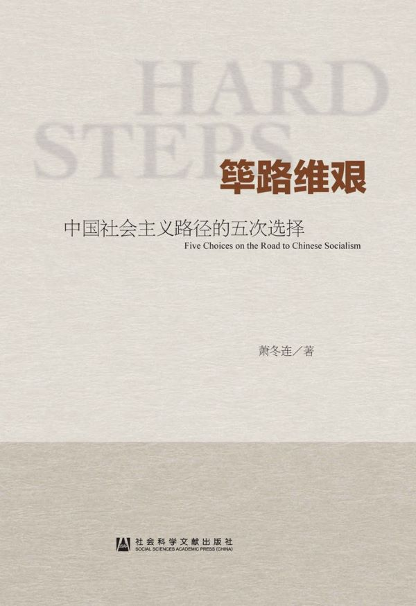

# 筚路维艰：中国社会主义路径的五次选择

- 作者：萧冬连
- 出版社：社会科学文献出版社
- 出版时间：2014-10
- ISBN：978-7-5097-6324-7
- 豆瓣：https://book.douban.com/subject/26171466
- 封面：

## 第一章 实行新民主主义

### 一 “新民主主义”的源流

依据人类历史发展五阶段学说，社会主义不可能越过资本主义的发展阶段，在半殖民地、半封建的废墟上直接建立起来。

毛泽东说：“拿资本主义的某种发展来代替外国帝国主义和本国封建主义，不但是一个进步，而且是一个不可避免的过程”。现在的中国“不是多了一个资本主义，相反地，我们的资本主义是太少了”。[12](#f1-12)毛泽东在七大口头政治报告中，还以俄国民粹派来指称中共党内存在的急于搞社会主义的思潮。他说：“所谓民粹主义，就是要直接由封建经济发展到社会主义经济，中间不经过发展资本主义的阶段。”[13](#f1-13)这些论证的思想资源来自列宁。

毛泽东在《论联合政府》的报告中，对蒋介石虽然“批评九分”，但也还“留有余地”，有些话没有说透。当时，毛泽东估计，联合政府有三种前途，一是国民党要共产党“交出军队去做官”；二是形式上民主，承认解放区，实质仍是蒋介石的独裁；第三种前途是以共产党为中心。前两种前途都是以蒋介石为首，第三种前途才是毛泽东心目中的“联合政府”。毛泽东对出现前两种前途是有所准备的，他甚至没有完全拒绝到国民政府做官的可能，认为这至少可以“做宣传工作”。当然，军队和解放区是绝对不交出的。[15](#f1-15)

### 二 中共七届二中全会的建国构想

中共七届二中全会确定的建国构想，承续了《新民主主义论》和《论联合政府》的基本原则，但在提法上有所变化。在政治上，毛泽东提出“人民民主专政”的概念，以代指“各革命阶级联合专政”，放弃了中共六大“工农联合专政”的提法。所谓“人民”，除了原来所列工人阶级、农民阶级、城市小资产阶级外，加入了民族资产阶级，即所谓“四个朋友”。当然，“四个朋友”在人民民主专政中地位不同，民族资产阶级不占“主要的地位”，主体是工农，领导是工人阶级，故称为“工人阶级领导的以工农联盟为基础的人民民主专政”。毛泽东一开始就排除了采用西方议会制和三权鼎立制度的可能，强调在中国采取民主集中制的人民代表大会制度是“很合适的”。[16](#f1-16)

在经济上，七届二中全会提出三大经济纲领，即“没收封建阶级的土地归农民所有；没收蒋介石、宋子文、孔祥熙、陈立夫为首的垄断资本，归新民主主义国家所有；保护民族工商业”。与中共七大相比，区别在第二条，即没收以蒋、宋、孔、陈为首的官僚垄断资本，这在七大时是没有明确的。在土地改革和没收官僚资本以后，新民主主义社会将存在五种经济成分，即国营经济、合作社经济、私人资本主义经济、个体经济以及国家和私人合作的国家资本主义经济，这五种主要经济成分“构成新民主主义的经济形态”。

对这种经济形态不是放任自流。其指导原则和发展方向是：必须以发展国营经济为主体，普遍建立合作社经济，使合作社经济与国营经济密切结合起来。扶助独立的小生产者并使之逐渐地向合作社方向发展。组织国家资本主义经济，在有利于新民主主义的国计民生的范围内，容许私人资本主义的发展，而对于带有垄断性质的经济，则逐步收归国家经营，或在国家监督之下采用国家资本主义的方式经营。对于一切投机操纵及有害国计民生的经营，则用法律禁止之。这就是说，在可能的条件下，逐步增加国民经济中的社会主义成分，加强国民经济的计划性，以便逐步地稳当地过渡到社会主义。[17](#f1-17)

此时，毛泽东的政策基点是两方面：一是“不要急于追求社会主义化”；一是要“好好掌握”，引导整个经济“向社会主义经济发展”。[20](#f1-20)

这种新民主主义经济形态到底需要存在多久呢？在1948年九月会议上，刘少奇说：“过早地消灭资本主义的办法，则要犯‘左’倾的错误”。毛泽东插话说：“到底何时开始全线进攻？也许全国胜利后还要15年。”在做总结讲话时，他又说，要用一二十年时间“努力发展经济，由发展新民主主义经济过渡到社会主义”。[21](#f1-21)在1949年1月召开的中共中央政治局会议上，毛泽东说，完成全国革命任务，这是铲地基，花了三十年。但是起房子，这个任务要几十年工夫。[22](#f1-22)这是毛泽东较早谈及向社会主义过渡的具体时间问题。在这一时间，高层有一个共识，过渡到社会主义需要两到三个五年计划的时间，这比抗日战争时期的设想已经缩短了许多。[23](#f1-23)究竟具备什么条件才能过渡到社会主义呢？任弼时在七届二中全会有个发言，说俄国1913年工业占比重是43.1%，而我们现在还只有10%。虽然我们有苏联的帮助，转入社会主义时，工业的比重总不能少于30%。所以，全国革命胜利后，我们仍需要有两个到三个五年计划才可转到社会主义。[24](#f1-24)毛泽东的论证角度相同，他在七届二中全会报告中说，中国“现代性的工业占百分之十左右，农业和手工业占百分之九十左右”，这90%左右的经济生活还“停留在古代”，这是“革命胜利以后一个相当长的时期内一切问题的基本出发点”。[25](#f1-25)刘少奇在1949年2月8日写的《新中国经济建设的方针与问题》中说，东欧国家过渡了3年，中国可能是10年到15年。[26](#f1-26)

中共领导人是从两个方面考虑过渡条件的：一是生产力的性质，即工业化发展阶段；一是人民是否准备好接受社会主义前途。

关于基本矛盾和主要矛盾的提法，最早是刘少奇在1948年九月会议上提出来的。刘少奇说：“在新民主主义经济中，基本矛盾就是资本主义（资本家和富农）与社会主义的矛盾。在反帝反封建的革命胜利以后，这就是新社会的主要矛盾。”[28](#f1-28)...在1949年3月中共七届二中全会上，毛泽东再次申明新中国社会的基本矛盾是资产阶级和无产阶级的矛盾，并将这一观点写进了全会决议，成为全会的共同观点。毛泽东明确告示：新民主主义社会具有过渡性质，五种经济成分并存是其经济形态，但由于社会主义性质的国营经济起决定作用，其前途必然是社会主义的。[30](#f1-30)是这时，中央还不想突出与资产阶级的矛盾，以“免于过早地警觉资产阶级”。[31](#f1-31)因为当时还有更主要的敌人和更迫切的任务。

### 三 新民主主义纲领的实行

1948年9月至1949年3月，上海、北平、天津、香港等地的民主人士陆续经秘密交通被接到西柏坡或哈尔滨。1949年6月，民主人士陆续随中共领导机关移至北平。在讨论制定《共同纲领》和协商人事等议程中，中共领导人表现出相当开放的态度，对一些资望很高的民主人士礼遇有加，给一些亲历者留下了很深印象。

会议通过的《中国人民政治协商会议共同纲领》，将新民主主义的政治、经济纲领以法律形式确定下来，规定人民民主专政的共和国是“以工农联盟为基础，以工人阶级为领导”的“统一战线的政权”，规定“人民有思想、言论、出版、集会、结社、通讯、人身、居住、迁徙、宗教信仰及示威游行的自由权”。受邀参会的民主党派之齐全，党外人士任职之多，使第一届政府有了“联合政府”的色彩。

延揽如此多的党外人士进入政府，曾引起中共党内许多人的不满。毛泽东解释说：这样“好处很多”，“第一，可以‘赚’人，各方面的非党人物都有当副主席、部长、司令员的，‘朝里有人’，国民党不打自垮...第二，可以‘赚’来四万万人民，‘赚’来土地改革。第三，可以‘赚’一个社会主义。这叫做和平过渡到社会主义”。[33](#f1-33)吸引很大一部分具有管理经验、专业知识和社会名望的精英进入政府，集聚到共产党周围，对于瓦解旧势力、收拢人心、治理和建设国家都有帮助。更
重要的是，把民主党派精英吸纳到政府，也就使他们与共产党同在一条船上，这条船确定无疑是驶向社会主义的。

然而，这并不意味着允许反对党的存在。早些时候，有些民主人士提出，要整合出一个强大政党与中共“发生平衡作用”，意在建立“反对派”。这种主张遭到毛泽东的明确反对。毛泽东告诫民主党派：“这里是要一致，要合作，而不是建立什么‘反对派’，也不是走什么‘中间路线’。”[34](#f1-34)从领导权看，所谓人民民主专政，与无产阶级专政并没有多大区别。1949年1月，毛泽东就向秘密来华的米高扬交了底，他说：“虽然政府的组织形式和苏联、东欧国家有所不同，但其性质与宗旨仍然是在共产党领导下的，将来的目标是实现社会主义和共产主义。”[35](#f1-35)

新民主主义经济既不是传统的资本主义，也不是传统的社会主义，而是一种“混合型”经济模式。它与资本主义的区别在于：（1）发展国营经济作为领导力量；（2）限制不利于国计民生的资本主义的发展；（3）帮助农民发展互助合作，避免大批农民破产和两极分化。

1948年7月27日，新华社信箱“农业社会主义问答”，批评要求平分一切土地财产、平分工商业的思想是一种“农业社会主义思想”，这种思想“是反动的，落后的，倒退的”。“问答”强调，我们要达到社会主义，“必须经过新民主主义经济一个时期的发展，在新民主主义社会中大量地发展公私近代化工业”。[36](#f1-36)

1949年4～5月，刘少奇的天津之行，就是受毛泽东之托去“稳住工商界”，让私人企业尽快复工。刘到天津后，做了两方面的工作：一方面，打消资本家的顾虑，帮助他们解决困难；另一方面，克服干部和工人中的“左”倾情绪，说服工人不要提出过高要求。刘少奇认为，除了要解决公私矛盾和劳资矛盾以外，还要恢复对外贸易和城乡沟通，也就是要解决市场问题。毛泽东赞同刘少奇的观点，把它概括为“公私兼顾、劳资两利、内外交流、城乡互助”四句话，后称为“四面八方”政策。

刘少奇在天津做了许多讲话，后来引起争议的是关于“剥削有功”的说法。针对资本家怕称自己是“资本家”、怕听“剥削”二字的情况，刘少奇说，剥削是由社会制度决定的，资本主义的剥削方式代替封建主义剥削方式是一个巨大进步。马克思说过，资本主义一百年间将生产力空前提高，比有史以来几千年生产的总和还多。从发展生产力看，资本家阶级剥削是有其历史功绩的。今天中国资本主义还在青年时代，正是建功立业的时候。今天，资本主义的剥削不但没有罪恶，而且有功劳。不是工厂开得太多，工人受剥削太多，而是太少。你们有本事多剥削，对国家人民都有利。[40](#f1-40)

邓小平后来说：“我们刚进城，最怕的是‘左’”，刘的讲话“起了很好的作用”。[41](#f1-41)

然而，刘少奇有关“剥削有功”“剥削越多越有利”的说法，对于以消灭剥削、消灭阶级为最高理想的中国共产党人来说，听起来很刺耳，先是受到东北局书记高岗的非议，有资料说，毛泽东看到刘天津讲话的记录时，不满“形于颜色”。[42](#f1-42)毛泽东本人也许认同刘在天津的工作及他提出的政策，[43](#f1-43)但对刘的一些说法很不以为然。5月，毛泽东与天津市委书记黄克诚私下谈话时明确讲，今后“主要任务还是阶级斗争，要解决资产阶级的问题”。[44](#f1-44)这与刘少奇的说法分歧显见。在利用与限制之间，刘少奇倾向于利用资本主义来发展经济，毛泽东更重视阶级力量的消长和对资产阶级的控制。虽然毛泽东要求，从接管城市的第一天起，“中心任务”就是“生产事业的恢复和发展”，但他始终没有忘记同资产阶级的斗争。[45](#f1-45)他的意思是，发展生产不能放松阶级斗争这根弦。

据说，有党外人士询问毛泽东：中国什么时候搞社会主义？毛泽东回答：过渡到社会主义“大概二三十年吧！”[48](#f1-48)中共领导人不将“社会主义前途”写入《共同纲领》，其目的在稳定人心，避免“强迫于人”；同时，也为避免在执行当前政策时出现混乱。然而，由于没有一个明确的过渡时间表，反而使随时结束新民主主义少了法律上的制约。 

### 四 理想与政策之间的张力

在新民主主义制度存废的问题上，毛泽东的意向起着决定性的作用。然而，我们也看到，在各级领导层，急于搞社会主义的想法有相当的基础。根源就在于，社会主义理想与新民主主义政策之间存在紧张关系。尽管领导人对新民主主义的必要性讲了不少，并见诸重要文献，许多共产党干部仍然难以理解新民主主义何以必须。正如周恩来所说，一些同志“不相信按照共同纲领不折不扣地做下去，社会主义的条件就会逐步具备和成熟”，总是“急于转变到社会主义”。[49](#f1-49)

1950年3月，在第一次全国统战工作会议上，不少人在发言中提出“今天斗争对象，主要是资产阶级”。更有人认为，革命既已胜利，民主党派任务已了，已无存在的必要性。[53](#f1-53)毛泽东、刘少奇、周恩来等人不得不针对党内急躁情绪做说服工作。同年6月，中共七届三中全会决定调整工商业，通过为私商让出一定市场份额、扩大国家收购和加工订货、调整税负等措施，帮助私人工商企业渡过难关。在会上，毛泽东提出“不要四面出击”的方针。他说：“有些人认为可以提早消灭资本主义实行社会主义，这种思想是错误的，是不适合我们国家的情况的。”[54](#f1-54)不过，毛泽东是从策略上提出问题的。当时，大陆战事基本结束，但西藏、台湾尚待解放，外部威胁仍然严峻；3.1亿人口的土改尚未开展，尤其是被战争破坏得千疮百孔的经济恢复起来尚待时日。

当月，毛泽东在全国政协会上说，中国实行私营工业国有化和农业社会化“还在很远的将来”。他安抚党外人士说，只要战争关、土改关都过去了，剩下社会主义一关就将容易过去。[55](#f1-55)1951年5月7日，刘少奇说：“现在有人就讲社会主义，我说：这是讲早了，至少早讲了十多年。”[56](#f1-56)13日，刘又说：现在工业只占10%，要发展到占40%～50%，哪怕你跑得再快，总还要10年、20年。[57](#f1-57)到1951年，在新民主主义存在的时间估计上，毛、刘、周仍是一致的，至少从言论上看是这样。

在另一个领域，即农村合作化问题上首先出现了分歧。建国之初，全国农村分两块：一块是老区，土改已经多年；一块是新
区，土改尚未开展。关于新区土改，1950年6月30日通过的《土地改革法》，规定了经济上保存富农、政治上中立富农的政策。此前，3月12日，毛泽东在《征询对待富农策略问题的意见》中，说明了保存富农经济的5个理由，即保存农村较高的生产力、减少土改阻力、消除中农疑虑、避免社会动荡、稳定民族资产阶级等。显然，这是出于策略考虑。然而，出身农民的干部并不理解，甚至抵触，贫雇农因其土地要求得不到满足而失望。中南局第二书记邓子恢、秘书长杜润生都有报告，认为南方地少人多，光地主土地不够分，不动富农，无法满足农民的土地要求。有些地区为满足贫雇农的要求，拔高成分，将富农甚至富裕中农定为地主。[58](#f1-58)

真正的难题在老区。各级领导机构无不关注土改后出现的新的分化现象。与此相联系，在是否允许土地自由买卖和租佃，是否允许自由借贷和雇工，即所谓“四大自由”问题上面临选择。如果从发展生产力出发，就应当容忍农村中“四大自由”及一定程度的分化，因为这对恢复国民经济、发展农业生产是有利的。1950年颁布的《土地改革法》，“承认一切土地所有者自由经营、买卖及出租其土地的权利”。各大区中央局和军政委员会曾先后颁发布告，允许在农村中实行土地买卖和租佃自由、雇工自由、借贷自由、贸易自由的政策，以适应发展农业生产的要求。[59](#f1-59)其实，在1948年7月那篇《农业社会主义的问答》中，就已经预料到分化的趋势，当时认为这不仅是“不可避免的，而且是被允许的，是不可怕的”，“有其一定的进步性”，甚至批评说，“否认或者反对这种竞争和分化，结果就是阻碍生产力的发展，而成为一种反动的空想”。[60](#f1-60)然而，写在纸面上是一回事，直接面对现实选择时是另一回事。

根据当年的资料，所谓老区农民的分化，大量的是“中农化”而不是“富农化”。多数土改前的贫雇农上升为新中农，雇工经营的新富农已经出现，但是数量不多。这本来正是土改的成果，反映经济的发展，兑现共产党对农民的承诺。然而，很多领导人不是欣喜，反而忧心忡忡。他们担忧什么呢？他们担忧的，不在于产生了多少新富农，而在于它所代表的方向以及给农民思想带来的变化，即形成“自发的资本主义倾向”，担心消灭了一个封建主义，却带来一个资本主义，认为正好验证了列宁“小生产是经常地、每日每时地、自发地和大批地产生着资本主义和资产阶级”的论断。

新中农普遍倾向于单干、个人发家致富，并不要求互助合作，甚至对组织起来感到苦恼。他们说：“这个国家好，就是组织起来不好”，觉得“单干才能发财，有穷有富才能发财”。[61](#f1-61)这使党内一些人担心，如果农民尝到了个人发家致富的甜头，“习惯了新民主主义秩序”，就不想社会主义了。他们尤其担心的是，如果多数党员干部和土改积极分子个人发家致富了，将失去向社会主义过渡的基本力量，甚至失去共产党对广大农民的领导权。老区的报告都反映农村党员干部思想“退坡”的情况，许多人“埋头生产不问政治，只顾个人发财致富，而不顾国家利益”。不少党员直接提出退党、脱党的要求。当时，《新湖南报》发起对农民李四喜“半截子革命”思想的讨论，[62](#f1-62)就表露中共党内的这种担忧。这使一些干部产生了“趁热打铁”的想法，即趁农民分得土地后对共产党的热情还未消失，紧接着就组织合作社；而组织起来，也可以为农村干部和积极分子提供新的上升动力，避免政治上的离心倾向。党内这种倾向，正契合毛泽东本人的想法，他后来反复说到，要不断革命，趁穷过渡，富了就不好办了。

从毛泽东七届二中全会报告到《共同纲领》，关于农村政策都是讲的两句话，一是尊重现实，保护农民的土地所有权，扶助其发展经济；二是不放任自流，引导农民向合作化方向发展。这就使党内形成了两种意见，主张积极组织合作社的与不赞成急于组织合作社的，都能从七届二中全会找到根据。

分歧首先在两个老区出现，一个是东北，一个是山西。1949年12月，在中共东北局召开的省市委书记座谈会上，就如何对待新富农，是否允许党员雇工、放高利贷等问题上，发生了激烈的争论。多数人持坚决否定态度，会议决议：坚持剥削的党员应劝其退党，严重的“必须开除出党”。1950年1月张秀山带着这个决议进京向中央请示汇报，中组部正式复函东北局，不同意东北局的意见，认为“农村资本主义的一定限度的发展是不可避免的”，一部分党员向富农发展“并不是可怕的事情”。[63](#f1-63)刘少奇赞同中组部意见，他在与中组部长安子文谈话时说，有人主张通过变工互助发展成集体农庄，是“不可能的”。现在，不要限制富农发展，雇工、单干，应当放任自流。变成富农的党员怎么办的问题提得早了，将来东北有一万富农党员也不可怕。[64](#f1-64)据资料说，高岗拿到中组部复函和刘少奇谈话，在北京面交毛泽东，毛泽东看后“气得发抖，脸色都变了”。[65](#f1-65)

1951年4月17日，山西省委向华北局和中共中央写报告，反映农民自发向着富农方向发展，导致互助组陷于涣散，提出“把老区的互助组织提高一步”，通过增强新因素，去“战胜农民的自发趋势”，对于私有基础“应当是逐步地动摇它、削弱它，直至否定它”。[66](#f1-66)中共中央华北局不同意山西省委的意见。刘少奇明确支持华北局，他批评山西省委的意见“是一种错误的、危险的、空想的农业社会主义思想”。但是，毛泽东明确支持山西省委的意见。他找刘少奇谈话说，既然西方资本主义在其发展过程中有一个工场手工业阶段，即尚未采用蒸汽动力机械，而依靠工场分工以形成新生产力的阶段，则中国的合作社，依靠统一经营形成新生产力，去动摇私有基础，也是可行的。薄一波后来说：毛泽东讲的道理把我们说服了，刘收回已经下发的讲话。[67](#f1-67)刘慑于毛泽东的态度，收回他的讲话，这不难理解。杜润生说：“刘少奇始终不愿意把自己放在与毛泽东对立的位置上”，“毛对刘已有成见……刘只好检讨”。[68](#f1-68)如果薄一波说的是实情，毛泽东的话“说服了”他和刘少奇，这就不仅仅是服从毛泽东的权威了，有更深的意识形态背景。

刘少奇在1948年九月会议提出一个观点：社会主义与资本主义“谁胜谁负”，“关键是小生产者的向背”，要巩固对小生产者的领导权，合作社是最有力的工具。在这一点上，毛、刘的观点完全一致。据陶鲁笳回忆，1949年春天，薄一波传达了毛泽东在七届二中全会讲的一段话：“如果只有国营经济而没有合作社经济，就不能解决谁战胜谁的问题。我们给农民分配土地，只是无产阶级对农民群众实现了一半领导权，还没有实现全部领导权。只有组织合作社，把农民引导走向集体化，才是实现了全部领导权。如果我们让资本主义领导了农民，那么就连一半领导权也要失掉的。”这个传达，为山西省委主张将互助合作提高一步提供了依据。[70](#f1-70)

刘少奇强调的不是生产合作社，而是消费合作社，国家通过一种商业关系把农民联系起来。后来，刘少奇的想法有所变化。他从发展农村生产力出发，认为不必过分担心农民“个人发家致富”的资本主义倾向。他还认为，农业要走上集体化，必须有一个条件，就是国家工业化的发展，能为农民提供足够的农业机械，“个体经济到集体农庄是一个生产方式的革命，没有机械工具的集体农庄是巩固不了的”。[71](#f1-71)这也就是后来所谓的“先机械化、后集体化”的说法。

苏联全盘集体化之前，在斯大林与布哈林之间发生了一次真正的路线之争；而在中共党内，毛、刘之间有分歧但没有正面争论，历史上没有形成一条所谓刘少奇路线。当然，高层分歧引发出一个高岗事件，这是另一种性质的问题。[74](#f1-74)

### 五 酝酿放弃新民主主义

1951年底、1952年初的三反、五反运动，无疑是影响新民主主义存废的一个重要事件。这场运动在毛泽东脑子里形成了两个认识：一是加深了对共产党干部道德危机的担忧，一是强化了对私人资本主义的负面印象。1951年11月29日，华北局关于天津地委书记张子善和前任地委书记刘青山巨大贪污案的报告，引起毛泽东极大的关注，认为出现了“很多党员被资产阶级所腐蚀的极大危险现象”。[76](#f1-76)在七届二中全会上，毛泽东就告诫全党要警惕“资产阶级糖衣炮弹”的袭击，没想到这种情况会在如此短的时间里就发生了。他决定在全党发动一场反贪污、反浪费、反官僚主义的三反斗争，把它“当作一场无产阶级和资产阶级之间的大战争”，[77](#f1-77)不过，开始主要还是从思想影响角度与资产阶级联系起来的。然而，不断揭发出来的情况，反映许多贪污分子与资本家的贿赂有着密切关系。毛泽东惊呼“资产阶级已经钻到我们内部来了”。[78](#f1-78)同时，发现还存在资本家偷税漏税、盗窃国家财产、偷工减料、盗窃国家经济情报等违法行为。1952年初，紧接着在全国各大城市开展了以资产阶级为斗争对象的五反运动。

联想到今天中国大量存在的权力寻租现象，不难理解当年“混合经济”制度下存在钱权交易的空间，资本家的违法行为也符合资本逐利性的本质。不过，当年革命道德和阶级斗争观念发挥着很强的自律作用，干部的贪污腐化被严重地夸大了，对资产阶级“五毒”的估计也严重了，造成许多私人工业无事可做，工人失业，税收大幅度下降。[79](#f1-79)

1952年2月15日，毛泽东得知河北邢台县已有87%的农户加入互助组、合作社，合作社建社当年即实现了粮食增产，支持了他早先的判断。他说：“多数农民是愿意走社会主义道路的，因为这是一条由穷变富的道路”，“农业不先搞机械化，也能实现合作化，中国不一定仿照苏联的做法”；中国发展农业生产不依靠富农，而依靠农民的互助合作。[82](#f1-82)

1953年5月，李维汉赴上海等地调查，由此形成的报告，帮助毛泽东找到了改造资本主义经济的路径，就是积极发展国家资本主义。

1953年6月15日的中央政治局会议上，毛泽东完整地了表述了过渡时期总路线：“要在十年到十五年或者更多一些时间内，基本上完成国家工业化和对农业、手工业和资本主义工商业的社会主义改造。”毛泽东批评了三个提法，一是巩固新民主主义的社会秩序，一是由新民主主义走向社会主义，一是确保私有财产。[86](#f1-86)随后他又批评了“公私一律平等”的新税制和“四大自由”。其实，这些口号和政策都是依据了新民主主义的政纲。这说明总路线的提出确实是一个重大转变，党内许多人包括刘少奇、周恩来、薄一波这样的重要领导人也没有完全跟上毛泽东的思路。

毛泽东起初的想法是，对私人工业和私人商业采取不同的改造办法，对工业通过国家资本主义，对商业则是逐年把它挤掉，把店员接收过来，使商业资本家转为工业家。[87](#f1-87)但他很快意识到，私人商业的数量很大，有180万店员，加上夫妻店、摊贩有500万户，1000万人，[88](#f1-88)“不可能以‘排除’二字了之”，到9月时，明确私人商业也可以采用国家资本主义的方式，如允许其从国营商业批发商品维持经营等。毛泽东肯定“国家资本主义是改造资本主义工商业和逐步完成社会主义过渡的必经之路”。[89](#f1-89)

如果说，1949年6月毛泽东在《论人民民主专政》中就说过“人民手里有强大的国家机器，不怕民族资产阶级造反”；那么，经过三年的准备，他更有信心了。全国统一，经济恢复，新区土改完成，政权全面建立，知识分子大体归顺，朝鲜战局也趋于稳定，与1949年面对诸多敌人不同，现在已经没有任何力量可以对新政权构成实质性的挑战。经济结构也发生重要变化。国家不仅垄断了金融，统制了对外贸易，掌握了铁路、矿山等经济命脉，而且国营经济在工业中的比重也超过了私人经济，占到了67.3%，国营商业和合作社商业在批发中已占63%，在零售中也占到了43%。这种结构性变化是中共领导人原来没有想到的。私人企业也在国家的掌控之中，半数以上的私人工业纳入了国家资本主义轨道。特别是五反运动后，私营企业的生存空间已经十分狭小。五反运动对资产阶级的打击不只是经济上的，更是心理上、政治上的。资本家在道义上已是“灰溜溜、臭烘烘”，不仅共产党干部对资本家避之唯恐不及，资本家的子女也以出身为累，积极靠近共产党，不少人“宣告不要资本家父亲的遗产”。[90](#f1-90)五反运动造成的气氛，甚至让一些民主人士也坐不住了，表示愿献出自己的私人财产。[91](#f1-91)私营企业的工人不愿继续为资本家服务、受资本家剥削。工人“在私营企业不安心，一到国营企业就安心了”。[92](#f1-92)五反运动后，在所有较有规模的私人企业中建立了中共党支部，企业内部实行“工人监督，资本公开，技术公开，财政公开”，虽然承诺资本家仍有财产所有权、经营管理权和用人权，[93](#f1-93)事实上资本家对企业的经营管理权受到很大限制，他们感到前途渺茫，有的请求国家“计划他”。1953年9月24日，毛泽东在中央书记处会议上说：资本主义的“性质也变了，是新式的资本主义”，“他们已经挂在共产党的车头上了，离不开共产党了”。[94](#f1-94)这些情况，使毛泽东回过头看前三年，认为社会主义已在途中。据此，毛泽东在1953年6月15日中央政治局会议上提出：“从中华人民共和国成立，到社会主义改造基本完成，这是一个过渡时期。”[95](#f1-95)所谓“新民主主义阶段”的概念，在这里就已经消失了。

### 六 第一章附录

<b id="f1-12">[[12]](#a1-12)</b> 《毛泽东选集》第3卷，第1060页。

<b id="f1-13">[[13]](#a1-13)</b> 《毛泽东文集》第3卷，第323页。
  
<b id="f1-15">[[15]](#a1-15)</b> 《毛泽东文集》第3卷，第277页。

<b id="f1-16">[[16]](#a1-16)</b> 毛泽东在1948年9月会议上的讲话，中共中央文献研究室编《毛泽东年谱（1893～
1949）》下卷，中央文献出版社，2013，第344页。

<b id="f1-17">[[17]](#a1-17)</b> 《刘少奇选集》上卷，人民出版社，1981，第428页。

<b id="f1-20">[[20]](#a1-20)</b> 《毛泽东文集》第5卷，第236页。

<b id="f1-21">[[21]](#a1-21)</b> 参见薄一波《若干重大决策与事件的回顾》，第47页。

<b id="f1-22">[[22]](#a1-22)</b> 《毛泽东文集》第5卷，第236页。

<b id="f1-23">[[23]](#a1-23)</b> 1944年8月，博古在同约翰·谢伟斯谈话中说：“我们至少比世界其余大多数国家落后200年。我们要在世界上大多数国家都到达那个状态（指社会主义）以后，才可能有希望到达社会主义。”“我们可以确信，它将多于30年或40年，而且可能要100多年。”如果这份记录准确，这是中共领袖层对新民主主义社会存续时间最长的一种估计。1945年3月13日，毛泽东在同谢伟斯谈话中说：“不管是农民还是全体中国人民，都没有为实现社会主义而作好准备。在未来的很长时间内，他们不会准备好的。必须经历漫长的、民主管理的私人企业时期。侈谈立即进入社会主义是‘反革命的思想’，因为它不现实，而想实行它总会自招失败”。毛没有给出具体时间表，但也认为将是长期的。见〔美〕约瑟夫·W.埃谢里克编《在中国失掉的机会》，罗清等译，国际文化出版公司，1989，第267、264～265、328页。

<b id="f1-24">[[24]](#a1-24)</b> 《任弼时选集》，人民出版社，1987，第465页。

<b id="f1-25">[[25]](#a1-25)</b> 《毛泽东选集》第4卷，第1430页。

<b id="f1-26">[[26]](#a1-26)</b> 《中国赫鲁晓夫刘少奇反革命修正主义言论集（1945年8月～1957年12月）》，人民日报社资料室编印，1967，第188页。

<b id="f1-28">[[28]](#a1-28)</b> 《刘少奇论新中国经济建设》，第29～30页。

<b id="f1-30">[[30]](#a1-30)</b> 薄一波：《若干重大决策与事件的回顾》（上），第26页。

<b id="f1-31">[[31]](#a1-31)</b> 《刘少奇论新中国经济建设》，中央文献出版社，1993，第29页。

<b id="f1-33">[[33]](#a1-33)</b> 转见薄一波《若干重大决策与事件的回顾》，第34页。

<b id="f1-34">[[34]](#a1-34)</b> 见毛泽东在1949年元旦发表的《将革命进行到底》，《毛泽东选集》第4卷，第1375页。

<b id="f1-35">[[35]](#a1-35)</b> 《毛泽东年谱（1893～1949）》下卷，第450页。

<b id="f1-36">[[36]](#a1-36)</b> 《目前形势和我们的任务》标准本，解放社编印，1949年第4版，第138～144页

<b id="f1-40">[[40]](#a1-40)</b> 人民日报社资料室编《中国赫鲁晓夫刘少奇反革命修正主义言论集（1945.8～1957.12）》，第234～238页。

<b id="f1-41">[[41]](#a1-41)</b> 《邓小平文选》第1卷，人民出版社，1994，第205～206页

<b id="f1-42">[[42]](#a1-42)</b> 薄一波：《若干重大决策与事件的回顾》，第198页。

<b id="f1-43">[[43]](#a1-43)</b> 1949年5月31日，毛泽东将刘少奇关于对待民族资产阶级的政策问题给东北局电转发各中央局，亲撰按语要求各地“认真克服对待民族资产阶级的'左'倾机会主义错误”。见《毛泽东年谱（1893～1949）》下卷，第514页。

<b id="f1-44">[[44]](#a1-44)</b> 《黄克诚自述》，人民出版社，1994，第217页。

<b id="f1-45">[[45]](#a1-45)</b> 1948年10月26日，毛泽东致信刘少奇，对张闻天起草的《关于东北经济构成及经济建设基本方针的提纲》修改稿提出意见，明确我们的整个经济政策是限制私人资本的，“有益于国计民生”就是一条极大的限制，达到这一点，必须经常和企图脱出“国计民生”轨道的私人资本做斗争。见《毛泽东年谱（1893～1949）》下卷，第373页。

<b id="f1-48">[[48]](#a1-48)</b> 参见石仲泉《毛泽东的艰辛开拓》，中共党史出版社，1992，第148页。

<b id="f1-49">[[49]](#a1-49)</b> 周恩来：《发挥人民民主统一战线积极作用的几个问题》（1950年4月13日），《周恩来统一战线文选》，人民出版社，1984，第169页。

<b id="f1-53">[[53]](#a1-53)</b> 《建国以来毛泽东文稿》第1册，中央文献出版社，1987，第292～294页。

<b id="f1-54">[[54]](#a1-54)</b> 《毛泽东文集》第6卷，人民出版社，1999，第71页。

<b id="f1-55">[[55]](#a1-55)</b> 《毛泽东文集》第6卷，第80页。

<b id="f1-56">[[56]](#a1-56)</b> 农业部办公厅编《农业集体化重要文件汇编（1949～1957）》（上），中共中央党校出版社，1981，第31页。

<b id="f1-57">[[57]](#a1-57)</b> 转见张静如主编《中国共产党思想史》，青岛出版社，1991，第321页。

<b id="f1-58">[[58]](#a1-58)</b> 薄一波：《若干重大决策与事件的回顾》，第125～127、134页

<b id="f1-59">[[59]](#a1-59)</b> 如中共中央华北局于1950年4月28日发出指示，提出应“经过政府宣布买卖土地自由、雇工自由、借贷自由，保障各阶层土地财产所有权”，中南区、西北区、华东区也颁布了相类似的政策。参见赵增延《重评建国初期农村经济政策中的“四个自由”》，《中共党史研究》1992年第5期。

<b id="f1-60">[[60]](#a1-60)</b> 《人民日报》1948年8月7日。

<b id="f1-61">[[61]](#a1-61)</b> 《农业集体化重要文件汇编（1949～1957）》（上），中共中央党校出版社，1982，第8～9页。

<b id="f1-62">[[62]](#a1-62)</b> “李四喜”是《新湖南报》编辑部虚构的名字。人物原型朱中立是长沙县十五区乡村干部，做过12年雇工。新中国成立后，表现很积极。但在土改分到几亩田，结了婚，生了孩子后，认为革命已经成功，坚持要求辞职。《新湖南报》认为，朱中立足以代表一些乡村干部土改后思想“退坡”的情况。1951年7月18日，该报发起了“李四喜思想”的大讨论，持续达5个多月。《人民日报》报道了这次讨论，在湖南乃至全国农村产生了很大影响。

<b id="f1-63">[[63]](#a1-63)</b> 见《建国以来刘少奇文稿》第1册，中央文献出版社，2005，第398、399页。

<b id="f1-64">[[64]](#a1-64)</b>  《刘少奇论新中国经济建设》，第152～155页。

<b id="f1-65">[[65]](#a1-65)</b> 《张明远回忆》，未刊，转见林蕴晖《国史札记·事件篇》，东方出版中心，2008，第78页。

<b id="f1-66">[[66]](#a1-66)</b> 中共山西省委：《把老区的互助组织提高一步》，《建国以来重要文献选编》第2册，中央文献出版社，1992，第354页。据时任山西省委副书记兼宣传部长的陶鲁笳回忆：当时，全省农村互助组有8万多个，但多数互助组看不到发展方向，陷于涣散，襄垣县一个农村党支部书记说：“我们经历了抗日和打老蒋，土改分了地，任务完成了。现在各顾各，解散。”宣布解散了。更为引人注意的是出现了新富农，有些翻身农民重新沦为贫、雇农，农村出现了两极分化。山西农村的发展走到了一个十字路口：是继续组织起来将互助组提高一步走向社会主义，还是放任自流走向资本主义？陶鲁笳说，今天我们对资本主义和社会主义的本质及其区别有了更深入的认识，但在建国初期我们对社会主义和资本主义就是这样看的。见马社香《山西试办全国首批农业合作社的前前后后——陶鲁笳访谈录》，《党的文献》2008年第5期。

<b id="f1-67">[[67]](#a1-67)</b> 薄一波：《若干重大决策与事件的回顾》，第191页。

<b id="f1-68">[[68]](#a1-68)</b> 《杜润生自述：中国农村体制变革重大决策纪实》，人民出版社，2005，第69页。

<b id="f1-70">[[70]](#a1-70)</b> 马社香：《山西试办全国首批农业合作社的前前后后——陶鲁笳访谈录》，《党的文献》2008年第5期。

<b id="f1-71">[[71]](#a1-71)</b> 《刘少奇论新中国经济建设》，第152～155页。

<b id="f1-74">[[74]](#a1-74)</b> 高岗事件不能算是路线斗争，但又与高层在是否巩固新民主主义秩序上的分歧有关，是这种分歧引出的一场权力斗争。参见林蕴晖《国史札记·事件篇》；王海光《政争与权争——高饶事件起因再解读》，《领导者》总26期，2006年2月号。

<b id="f1-76">[[76]](#a1-76)</b> 《毛泽东选集》第5卷，第54页。

<b id="f1-77">[[77]](#a1-77)</b> 《建国以来毛泽东内部文稿》第2册，中央文献出版社，1988，第646页。

<b id="f1-78">[[78]](#a1-78)</b> 1952年1月，中共山西省委报告说：“从已突破的大贪污案看，多数是由几个贪污分子甚或与奸商共谋的。”2月，东北政府报告说：“几乎所有大贪污犯都与资本家有密切关系，互相勾结；大贪污分子本人不少就是钻进国营企业的资本家”。见《毛泽东年谱（1949～1976）》第1卷，中央文献出版社，2013，第477、489页。

<b id="f1-79">[[79]](#a1-79)</b> 邓小平给中央的电报，见《毛泽东年谱（1949～1976）》第1卷，第516页。

<b id="f1-82">[[82]](#a1-82)</b> 逄先知、金冲及主编《毛泽东传（1949～1976）》，中央文献出版社，2003，第246页；《毛泽东年谱（1949～1976）》第2卷，第31～32页。

<b id="f1-86">[[86]](#a1-86)</b> 逄先知、金冲及主编《毛泽东传（1949～1976）》，第253～254页。

<b id="f1-87">[[87]](#a1-87)</b> 1953年6月15日毛泽东在中央政治局会议上的讲话，见《毛泽东年谱（1949～1976）》第2卷，第117页。

<b id="f1-88">[[88]](#a1-88)</b> 《毛泽东年谱（1949～1976）》第2卷，第146页。

<b id="f1-89">[[89]](#a1-89)</b> 《毛泽东文集》第6卷，第291页。

<b id="f1-90">[[90]](#a1-90)</b> 《建国以来刘少奇文稿》第4册，第527页。

<b id="f1-91">[[91]](#a1-91)</b> 三反运动开始不久，傅作义就提出愿将自己经营的商店和现金全部献给国家，以丢掉包袱，接受工人阶级思想。被毛泽东婉言劝阻。见《毛泽东年谱（1949～1976）》第1卷，第564～565页。

<b id="f1-92">[[92]](#a1-92)</b> 毛泽东：《在中共中央政治局会议上的讲话》（1953年6月15日），《党的文献》2003年第4期。

<b id="f1-93">[[93]](#a1-93)</b> 《毛泽东年谱（1949～1976）》第1卷，第560页。

<b id="f1-94">[[94]](#a1-94)</b> 薄一波：《关于过渡时期总路线提出问题致田家英的信》（1965年12月30日），《党的文献》2003年第4期。

<b id="f1-95">[[95]](#a1-95)</b> 逄先知、金冲及主编《毛泽东传（1949～1976）》，第253～254页

## 第二章 仿效苏联模式

1954年9月，刘少奇在关于宪法草案报告中明确说道：“我们所走的道路就是苏联走过的道路”，而“苏联的道路是按照历史发展规律为人类社会必然要走的道路。要想避开这条路不走，是不可能的”。[1](#f2-1)

### 一 优先发展重工业

1951年2月，毛泽东提出了“三年准备、十年计划经济建设”的设想，[2](#f2-2)随后，成立由周恩来、陈云等人组成的领导小组，组织第一个五年计划的编制。刘少奇、周恩来都把“十年建设”解释为10年“新民主主义经济建设”。周恩来在解释这个设想时说：“毛主席的方针是稳步前进，三年恢复，十年、二十年发展。发展新民主主义经济可能要十年、二十年，不能把时间说得那么准，马克思主义不是刘伯温的‘推背图’。”[3](#f2-3)

优先发展重工业必须解决几个问题：一是压低全民消费，提高储蓄率，加快资金原始积累；二是保证有限的资源集中投向国家确定的重点领域特别是重工业领域；三是实行平均主义的民生保障，确保社会的稳定。这三方面的要求，都不可能在一个竞争性的市场经济环境下获得，只能诉诸国家控制，依托集中计划经济体制。这正是苏联走过的道路。

1949年8月15日，《人民日报》刊登苏联学者F.P.柯舍列夫《国家工业化和农业集体化的苏维埃的方法》的文章，转述斯大林的话说：资本主义工业化的道路是“漫长的需要几十年之久的道路...我们比先进国家落后了五十年到一百年，我们应当在十年之内跑完这段距离，或者是我们做好这点，或者是我们被人打垮”。

1950年9月21日，毛泽东又请苏联哲学家尤金（1953年出任驻华大使）在北京做《苏联从资本主义到社会主义的过渡时期》的讲演，尤金重述斯大林的观点，强调“社会主义工业化的实质，不在于简简单单的发展工业，而是在于发展重工业，首先是发展重工业的核心——机器制造业，因为只有建立起重工业和自己的机器制造业，才能保证社会主义的物质基础，并使国家处于不依赖资本主义世界而独立的地位”。[11](#f2-11)最能打动毛泽东的，是斯大林强调从发展轻工业起步，过程太缓慢，社会主义不能等待五十年到一百年，必须在十年之内跑完这段距离。苏联快速工业化的成功，对毛泽东具有极大吸引力。[12](#f2-12)

这时高层似乎还没有取得共识。1950年5、6月，刘少奇在一篇题为《国家的工业化和人民生活水平的提高》的手稿中仍然坚持，中国的工业化应当“以发展农业和轻工业为重心”。尤金讲演是刘少奇亲自主持的，但似乎没有说服刘改变观点。1951年5月和7月，刘在两次党内报告中，仍然强调中国必须采取从轻工业开始的工业化战略。[13](#f2-13)刘反复阐述的理由有两条：一是为了积累资金。“轻工业可以赚钱，也容易办些，又不用很多资本。”轻工业发展了，才能“积累继续发展工业的资金”。二是为了改善民生。发展轻工业和农业，“可以把劳动人民迫切需要提高的十分低下的生活水平提高一步”。[14](#f2-14)

一般来说，在开国之初，执政者都会采取与民休息的政策。有这种想法的不只刘少奇，还有周恩来。1951年3月，周恩来在两次会议上讲道：“发展工业生产，首先是轻工业生产，从公家到私人都可以发展。”“重工业固然要搞，轻工业在今天还要多些才行。不仅私人要搞轻工业，国家也要搞轻工业。只有这样，才能适应农村的需要，才能更快地积累资金，建设城市。”[15](#f2-15)可以看出，到1951年春夏，刘、周的工业化思路仍然是从发展轻工业开始、公私企业参与、注重市场作用的渐进式工业化，是在新民主主义制度下推进工业化的既定思路。

在高层领导中，公开支持优先发展重工业的是高岗。他连续在《人民日报》发表署名文章，强调“实现国家工业化，有两条相反方向的道路”。我们必须依据毛主席的指示，“走俄国人的路”。“假如有人幻想按照资本主义发展工业的道路来实现国家的工业化，那显然是错误的，根本行不通的”。[16](#f2-16)高岗的高调对刘少奇会有影响但不会太大，真正帮助高层取得共识的，是朝鲜战争的爆发和苏联援助的到来。一方面，朝鲜战争改变了斯大林对中共的态度，更愿意慷慨地帮助中国实现自己的工业化计划。另一方面，朝鲜战争使中共领导人对于加强国防力量产生了紧迫感，西方对中国的封锁禁运使建立独立工业体系的要求更为迫切。

在相当长的时间内，斯大林对毛泽东和中共心存疑虑，认为毛泽东不是真正的共产党人，担心中国走“铁托式”道路。即使毛泽东访问苏联，签订了《中苏友好同盟互助条约》，也没有消除斯大林的怀疑。这种情况在毛泽东毅然决定出兵朝鲜之后才得以改变。周恩来说过，“一到抗美援朝，他的看法改变了”。[20](#f2-20)

中国入朝作战后，中苏之间在军事上密切配合，经济关系也大大加强了。在西方国家对中国实行严厉的封锁禁运的环境下，中国的工业化必须而且只能依靠苏联的帮助。当时，中国驻苏大使张闻天看得十分透彻。1952年1月16日，他给周恩来写信，提出中国今后的工业化方针，必须完全依靠与信赖苏联的援助，从一开始就建立最现代化的工厂。用不着走弯路，用不着摸索又摸索。

1952年8～9月，周恩来、陈云、李富春等组成中国政府代表团前往苏联，商谈“一五”计划中需要苏联援助的141个工业项目问题，中心环节是重工业，包括钢铁、煤、电力、石油、机器制造、飞机、坦克、拖拉机、车辆制造等。[23](#f2-23)

9月24日，周恩来、陈云回到北京，当晚即出席中共中央书记处会议，汇报同苏联商谈的情况，讨论“一五”计划的方针任务。

薄一波回忆，正是在这次会议上，他第一次听到毛泽东提出：“现在就要开始用10年到15年的时间，基本上完成到社会主义的过渡，而不是10年或者以后才开始过渡。”[25](#f2-25)《毛泽东传》作者也说，在这次会上，毛泽东“关于由新民主主义向社会主义转变的步骤、方法，同原来的设想，发生了变化”。[26](#f2-26)

1953年5月15日，有关苏联援助中国的协议在莫斯科签订。一个月后，在中共中央政治局会议上，毛泽东提出了过渡时期的总路线。[27](#f2-27)可以看出，苏联承诺援助中国工业化计划，是促使毛泽东最终选择仿效苏联模式的重要背景。这种仿效是整体的：实行优先发展重工业的赶超型工业化，全面推行农业集体化和工商业国有化，建立单一公有制加计划经济的经济模式。

社会主义就是消灭私有制，这是全党毫无争议的共识。刘少奇在1955年说过：“要建成社会主义社会，就要改变资本主义所有制和个体所有制，建立全民所有制和集体所有制。只要我们抓紧了这一点，在这一点上不动摇，那末，我们就基本上没有违背马列主义，就不会犯重大错误。”[29](#f2-29)这种观念支配了中国几十年的制度安排，使中国陷入了公有制不断升级的陷阱。实践证明，这种制度安排并不利于中国的发展，即使实施重工业优先的赶超战略，也很难证明一定要消灭一切私有产权。

### 二 统购统销的深远影响

在1953年过渡时期总路线提出之前，中国经济的计划性就已经在强化，先后建立了如下制度：（1）统制外贸，实行进出口许可证、外汇管制和保护性关税等制度。（2）成立中央财经委员会，统一全国财经，形成中央集中管理体制的雏形。（3）通过接管国民党“四行二局一库”，建立以中国人民银行为中心的金融体系；1952年底，率先完成私人钱庄全行业公私合营，实行资金统一配置。（4）统一调度重要物资。1952年，政府统一调度的物资已达55种，包括重要工业生产资料和粮食、棉花等重要农产品。（5）国家统筹安排就业。这些制度性架构的建立，加上国营经济比重迅速增长，私人工商业加工订货和代购代销形式的发展，国民经济已初步走上计划轨道。

这种建立在公私企业制度基础上的计划与市场双轨运行的体制，帮助中国完成了国民经济的恢复，但与即将展开的以重工业为重点的工业化计划难以匹配，这个工业化计划要求有更快的资金积累，更集中的资源调度。陈云说：“现在有些资本家有这样的想法：政府搞重工业，他们搞轻工业，政府搞原料工业，他们搞制造工业，包袱都要你背，他们赚钱，我们当然不能这么办。”[35](#f2-35)毛泽东完全赞同陈云的看法，批评党内有人赞同政府搞重工业和原料工业，私人企业搞轻工业和制造业是“反映了资本家的一种意见”。[36](#f2-36)毛泽东的解决办法是提早向社会主义过渡，把全国的资源集中到国家手里，把整个国民经济纳入集中计划。

1953年，粮食收购危机及由此引出的统购统销政策，是中国经济计划化进程中极为重要的一步。从1952年下半年起，全国许多地区出现抢购粮食，以致粮价上升、社会混乱的现象。当年出现了40亿斤赤字，靠挖库存才得以解决。

1953年上半年，面对粮食形势日益紧张，毛泽东让中财委拿出办法。中财委提出八种方案，归纳起来，无非是两条路：一是继续市场收购，一是实行统购统销。邓子恢等人主张维护自由贸易。[47](#f2-47)陈云权衡利害，认为只能选择统购统销，具体办法是在农村实行征购，在城市实行配售，同时管制粮食市场，禁止私商经营粮食。陈的解决办法得到毛泽东赞许，中央一致同意，1953年底即刻实行。

是否实行粮食统购统销，是一个两难抉择。陈云形容为“挑着一担‘炸弹’”，他说：“如果搞不到粮食，整个市场就要波动；如果采取征购的办法，农民又可能反对。两个中间要选一个，都是危险家伙。”[48](#f2-48)实行统购统销，必会引起反弹，甚至强烈反弹，这种情况陈云和毛泽东都预计到。毛泽东说有三个不满：农民不满、市民不满，国际舆论不满。[49](#f2-49)统购统销的关键是，要尽可能多地把农民的“余粮”逼出来，这就必然侵犯农民自由处置余粮的权利和待价而沽的利益，引起农民不满是不难想到的。陈云甚至估计，“逼死人、打扁担，甚至暴动的事情都可能发生”。

任何国家工业化都绕不过一个话题，就是原始积累。在中国这样一个落后的农业国，在没有或很少外部资金和资源输入的封闭型经济中，工业化只有依靠本国的积累，而且相当大的部分靠农业积累。优先发展重工业，注定要让农民“买单”，这首先是苏联做过的事情。斯大林说，为了保持工业化发展的高速度，必须通过“剪刀差”使资金从农业“流入”工业，这是“一种类似贡款的东西”。[52](#f2-52)毛泽东、陈云都谙熟苏联模式的真谛。1950年6月，毛泽东就说：“国家工业化又要靠农民的援助才能成功”。[53](#f2-53)陈云说得更明白：“中国是个农业国，工业化的投资不能不从农业上打主意”。[54](#f2-54)

许多党内干部同情农民，他们本身就出身于农民。薄一波说：“当时党内党外都有一些同志过于同情农民，不赞成统购统销。”...在党外，意见最为激烈的是梁漱溟，1953年9月11日，他在全国政协常委会上发言说，由于建设重点在工业，“生活之差，工人九天，农民九地”。[56](#f2-56)这引起毛泽东极为敏感的回应。第二天，在中央人民政府委员会会议上，毛泽东讲话，提出“大仁政”与“小仁政”问题。他说：“所谓仁政有两种：一种是为人民的当前利益，另一种是为人民的长远利益，例如抗美援朝，建设重工业。前一种是小仁政，后一种是大仁政。”我们的重点应当放在“大仁政”上，放在建设重工业上，要建设，就要资金，就要多收些农业税。毛泽东批评说，有些人“哇哇叫”，还说他们是代表农民利益，“其实就是要抗美援朝战争别打了，重工业建设别干了”。[57](#f2-57)这个道理不是毛泽东第一个讲的。早在1949年12月，陈云提出“要纠正片面的群众观点和仁政观点”。他说：“现在税轻，将来建不成工业国，群众要骂；相反，税重一点，财政有了办法，农业国变成了工业国，人民自然会喜欢。”[58](#f2-58)为了长远利益，不能不牺牲一些眼前利益，事实上是必须让农民做出牺牲。这就是毛泽东心中的“大仁政”。

### 三 高潮是如何出现的

虽然毛泽东提前放弃了新民主主义，但开始时设想，向社会主义过渡的时间将需要3个五年计划，即到1967年基本完成生产资料的社会主义改造。然而，这样一个涉及6亿多人口的社会大改造，竟只用了4年时间，即在1956年就完成了，比原来设想整整提前了11年！其实，真正的“社会主义高潮”不是4年，而是1955年下半年以后的一年半时间，而初级社转高级社更是在两三个月内“一下就轰上去了”。[71](#f2-71)

“社会主义高潮”是如何出现的，杨尚昆和薄一波的看法几乎一致：决定性的推力来自毛泽东本人。《杨尚昆日记》说：“这一巨大的变化，首先是由毛主席（1955年）7月31日提出了《关于农业合作化问题》的报告引起的。

薄一波后来的回忆则说，高潮来源于“三个会议一部书”，“三个会议”就是5月17日毛泽东在杭州召集的15个省、市、自治区党委书记会议，7月31日毛泽东做《关于农业合作化问题》报告的全国省、市、自治区党委书记会议，10月毛泽东主持的中共七届六中全会；“一部书”就是毛泽东亲自主编的《中国农村的社会主义高潮》。[73](#f2-73)

事实上，在1955年5月之前，尽管各地不时有冒进的冲动，但基本上是按照原来的设想渐进式推进的。这与主其事的邓子恢等人的主张有关。1953年1月，中共中央中南局第二书记邓子恢受毛泽东之托，携杜润生进京，组建中央农村工作部，邓任部长，杜任秘书长。毛泽东对邓子恢说：“调你来做农村‘统帅’。”然而，毛泽很快发现，邓子恢与自己并不合拍。与土改时的激进主张不同，邓子恢在农业合作化步骤上相当谨慎。他自己解释说：办合作社与搞土地改革不同。搞土地改革，是要解决农民与地主的关系问题，那是阶级斗争，要用强制的方法来解决。办合作社绝不能用阶级斗争的办法，而只能用说服、示范、引导、帮助的办法。必须照顾农民小私有者的利益和习惯，当前应以发展互助组为中心环节，切忌急躁冒进。[74]1953年，邓子恢上任不久，就着力纠正互助合作运动中的冒进倾向。

毛泽东并非不知道农民小私有者的特性，但他的方针不是照顾农民的特性而是要改造它。

1953年10月和11月，毛泽东两次找中央农村工作部负责人谈话，批评邓子恢“不靠社会主义，想从小农经济做文章”，是“群居终日，言不及义，好行小惠，难矣哉！”一方面，毛泽东认为，单干制度长久下去，就要使农民成为富农、高利贷主和商业资本家剥削的牺牲品，重新失去土地，坚信“农民的基本出路是社会主义，由互助合作到大合作社”。[76](#f2-76)另一方面，毛泽东认为“个体农民，增产有限，必须发展互助合作”。

1954年，党在农村的运动是双管齐下：一方面加强粮食征购，一方面推进合作化。当年，在大灾情况下，超购100亿斤粮食，许多干部强迫农民交粮，引起了农民强烈不满。这使主持农村工作的邓子恢等人感到情况严重，进而引起刘少奇、周恩来、邓小平等高层关注。

从1月到3月初，中共中央连发四道“紧急指示”，要求整顿和巩固生产合作社、保护耕畜、迅速布置征粮指标，以安定农民情绪。然而，中央的紧急指示没有立即阻止各地合作化的过猛势头。到4月，全国合作社达到67万个，此外还有许多“自发社”（即农民自发办的未经批准的合作社）存在，出现了强迫入社、侵犯中农利益等问题，发展最快的浙江省问题最为突出。4月20日，刘少奇主持中央书记处会议，确定“停止发展，全力巩固”的总方针。中央农村工作部会同浙江省委，决定在浙江开展“全力巩固，坚决收缩”的整社工作。

毛泽东也不希望出大乱子。他不只是听中央农村工作部的报告，也从来自农村的身边工作人员那里得知，入社并非都是农民自愿，干部用“跟共产党走，还是跟老蒋走”的大帽子压群众入社。[78](#f2-78)毛泽东还收到黄炎培的来信，说他的家乡农民生活苦，吃不饱。这些信息使毛泽东一度冷静下来，考虑暂时放慢合作化的步伐。3月中旬，毛泽东约邓子恢、陈伯达、廖鲁言、陈正人、杜润生谈话，说：“生产关系要适应生产力发展的要求，否则生产力就会起来暴动。当前农民杀猪、宰羊，就是生产力起来暴动。”他提出，现在有些地方要停下来整顿，有些地方要发展。“一曰停、二曰缩、三曰发。”[79](#f2-79)在这前后，毛泽东甚至说，发展合作社1955年春就停下来，到明年秋收再看，停止一年半。[80](#f2-80)关于浙江整顿合作社的事，毛泽东也是与闻并同意的。

然而，当毛泽东4月6～22日到南方视察后，改变了看法。他感到，在外地看到、听到的情况，和在北京接触的材料有很大不同。生产情绪消极的农民只是少部分，所谓缺粮大多是虚假的，“是地主、富农以及富裕中农的叫嚣”。问题是，有些干部“不愿意搞社会主义”，这种人下面有，省里有，中央机关也有。[81](#f2-81)5月1日，毛泽东对谭震林说：合作化还可以快一点，前一段出去看到沿途庄稼长得很好，农民种田积极性很高，办合作社的积极性也很高。5月5日，毛泽东告诫邓子恢：“不要重犯1953年大批解散合作社的那种错误，否则又要作检讨。”[82](#f2-82)这是毛泽东发出的一个严重信号。

虽然总目标一致，但在合作化的速度和步骤上，在如何解决农村紧张问题上，邓子恢与毛泽东产生了分歧。邓子恢认为，乱子主要出在合作化方面，主张在合作化问题上向农民让步，以发挥农民的生产积极性，增加生产，解决粮食问题。[83](#f2-83)毛泽东则始终相信，只有合作化才能从根本上解决粮食问题，主张以减少征购数量的办法缓和同农民的紧张关系，以便在农业合作化方面加快步伐。

5月17日，毛泽东在颐年堂主持召开有华东、中南、华北15个省市委书记参加的会议。毛泽东提议，江苏、湖南、湖北、广东、广西都要放手发展。于是，各省重报计划。有些省委书记埋怨中央农村工作部压抑了下面的办社积极性，毛泽东批评中央农村工作部“发谣风”。他认定，所谓农村存在紧张，农民不满统购，合作社有强迫现象等说法，一概是“发谣风”。[85](#f2-85)这次会是一个大转折，毛泽东关于合作化的方针，从“放慢步子”转向“加快步子”。会后，中央农村工作部修改计划，提出到1956年秋收前，农业生产合作社发展到100万个。6月14日，刘少奇主持中共中央政治局会议，批准了这个计划。[86](#f2-86)但这与毛泽东的想法仍有距离。7月11日，毛泽东在颐年堂召集邓子恢等人谈话，提出合作社增加到130万个左右。邓子恢说，回去考虑考虑。第二天，邓去找毛，说还是维持100万个的计划好。双方发生争论，持续好几个小时。7月15日，邓子恢又向刘少奇反映，说130万不行，还是100万为好。这引发毛泽东严重不满，他对邓小平说：“邓子恢的思想很顽固，要用大炮轰。”[87](#f2-87)...他得出结论：不是农民没有办合作社的积极性，不是办不好合作社，而是党内有右倾思想。

自此，毛泽东下决心批判农业合作化问题上的“右倾错误”。7月31日，毛泽东主持召开全国省、市、自治区党委书记会议，在会上做《关于农业合作化问题》报告。他不点名批评邓子恢是“小脚女人走路”，“被胜利吓昏了头脑”，站在资产阶级、富农、有自发倾向的富裕中农立场上，替少数人打主意。毛泽东说：“新的社会主义群众运动的大风暴就要到来”，现在的问题是“领导赶不上运动”。

1955年8月26日，毛泽东指示，各省、市、自治区党委关于农业合作化问题的电报“由中央直接拟电答复”。这样，毛泽东撇开邓子恢和中央农村工作部，亲自掌控运动。他在北戴河每天阅读各省、市、自治区党委送来的报告，加写批语，转发各地，这些报告无一例外表示完全拥护毛泽东《关于农业合作化问题》的报告，检讨和批评“右倾思想”。10月4～11日，在北京举行中共七届六中全会，“大炮轰”邓子恢。刘少奇、周恩来、朱德、陈云、彭德怀、彭真、邓小平等80人在会上发言，另有167人做书面发言。刘少奇批评中央农工部“发谣风”，周恩来批评杜润生“分散主义”，邓小平批评农工部对合作化的动摇，是资产阶级思想在党内的反映。[93](#f2-93)形势一边倒，一致拥护毛泽东《关于农业合作化问题》的报告，批评“右倾机会主义”，邓子恢、杜润生在会上做检讨。毛泽东点名批评邓子恢，认为六中全会是高潮来临前的一次社会主义大辩论。在会上，他提出了一个新规划：多数地区到1958年春基本上完成半社会主义的合作化。这比原计划又提前两年。

中共七届六中全会精神贯彻下去，全国掀起对“右倾机会主义”的批判，各级领导人争先恐后，总是超指标完成任务。高潮就这样出现了。各级领导人把推动合作化运动视为表明政治坚定性和展示政绩的机会。

《农业发展纲要四十条》向农民描绘了一幅美好农村的图画，[106](#f2-106)农民对社会主义美好生活的憧憬，减少了他们对未来不确定性的疑虑。[107](#f2-107)农业四十条甚至让知识分子也为之振奋，一千多位科学家和民主人士应邀参加了讨论，这当中肯定融入了热衷于中国乡村建设的知识分子的理想。毛泽东总是在一个任务完成之际，先人一步提出新的愿景，牵引人们追赶他的步伐。

1955年社会主义高潮兴起后，毛泽东把农业改造和工商业改造作为一盘棋局，借农业合作化高潮形成的政治压力，迫使资本家接受改造。1955年10月9日，他在审阅彭真的发言稿时，加了一段话：农业合作化运动“是使城市资产阶级彻底地孤立起来，造成一种使他们非接受社会主义改造不可的形势，因而可以消灭一切城乡资本主义痕迹的社会主义革命的运动”。[112](#f2-112)10月11日，毛泽东在七届六中全会讲话中说，一切措施，就是要孤立资产阶级，最后消灭资本主义，要使“资本主义绝种，小生产也绝种”。[113](#f2-113)

一场涉及几亿人的社会主义改造运动，竟这样戏剧性地结束了。农村高级社基本上是苏联集体农庄的中国版，实行集体所有、统一核算、集中劳动、按工分分配的经营方式；国家对国营企业实行统收统支、统包统配的集中管理；全行业公私合营后的企业管理体制等同于国营企业；个体手工业和个体商业合作化后，形成了第一代城镇集体经济；城镇人口就业统包统配，形成“铁饭碗”制度；“一五”计划时期基本建设投资90%来源于财政，79%来源于中央财政，国家几乎成了唯一的投资主体；[117](#f2-117)国家统配物资从1952年的55种，增加到1957年的532种；[118](#f2-118)中央直属企业由1953年的2800个，增加到1957年的9300个；国务院工作机构和人员从1954年的46个、2.3万多人，分别猛增到1956年的82个、5.2万多人。[119](#f2-119)市场作用从金融、生产资料、劳动力和消费品等领域依次退出，以公有制为基础，以“条条”管理为主、以行政指令配置资源的苏联式计划经济模式，基本上在中国被复制出来，尽管有人认为中国始终未能形成理性的计划经济。

### 四 “举国体制”的形成

把社会主义改造运动仅仅理解为生产资料所有制改造，其实是不全面的，它至少还包含三个重要方面：政治、文化、社会。首先，政治集权。伴随过渡时期总路线的提出，中国政治体制也明显地趋向集权化。这主要表现在三个方面。一是由“联合政府”向“一党政府”转变。

这个过程是通过“制宪”完成的。本来，中共没有打算急于制定宪法，因为1949年通过的《共同纲领》具有临时宪法的性质，不仅民主党派满意，共产党也认为在过渡时期仍管用。以《共同纲领》为基础，以政协为平台，共产党与各民主党派正处在一个愉快合作的“蜜月期”。

1952年10月，刘少奇率中共代表团出访苏联，向斯大林表达了中共的这一意向。然而，斯大林建议，中国应尽快召开全国人民代表大会和制定宪法。刘少奇解释说，我们目前使用《共同纲领》，《共同纲领》在人民及各党派中威信很好。如果两三年内制定宪法，势必重复《共同纲领》，承认资本家的财产及剥削雇佣劳动为合法。再过七八年以后又要把资本家的企业国有化，再制定社会主义宪法，似乎有些不好。然而，斯大林坚持他的看法，他提出三条理由：其一，确立中共执政的合法性。他说，未经人民选举，没有宪法，人家就可以说你们的政权是建立在刺刀上的。召开人民代表大会，制定宪法就可以拿掉他们的借口。其二，防止泄密。他说，你们的政府是联合政府，不能只对一党负责而应向各党派负责，国家机密很难保障。其三，通过选举向“一党政府”转换。

中共接受了斯大林的建议，刘少奇从苏联回国，即刻启动制宪工作，并开始筹备召开全国人大。宪法的起草由毛泽东亲自主持，基本框架模仿苏联宪法。1954年9月，第一届全国人民代表大会召开，完成了体制的转换。取消了中央人民政府委员会；原政务院改为国务院，副总理全由中共党员担任；民主人士仍有12位国务院部委部长、主任，8位全国人大常委会副委员长，原3位国家副主席保留，原3位副总理改任人大副委员长。民主人士都得到安排，各有其位，但实际权力变化很大。原来，民主人士占半数以上的政务委员会和中央人民政府委员会取消了。变化最大的是政协地位。原来全国政协不仅是各党派共同议政的平台，而且是代行人大职能的“最高权力机关”。现在，政协虽然还保留，但已变为一个咨议机构，即“各党派的协商机关”。

毛泽东在第一届全国人大的开幕词，精确地概括了五四宪法及其政制的实质：“领导我们事业的核心力量是中国共产党，指导我们思想的理论基础是马克思列宁主义”。[121](#f2-121)事实上，自宣传总路线以后，在中共党内就有利用普选排斥民主党派的思想倾向，但中共高层出于统战考虑，要“把资产阶级、民主党派、民主人士等一直引导到社会主义”，制止了这种“错误倾向”。[122](#f2-122)

二是由地方分权向中央集权过渡。战争年代，各根据地被分割，中央给各根据地较多自主权。随着解放区的扩大和连片，首先完成了几大区域内党和军队的统一。新中国成立之初，实行大行政区的管理体制，全国划分为东北、华北、华东、中南、西北、西南六大行政区，设有大区一级人民政府。1952年6月20日，毛泽东致信斯大林，提出“我们拟参考联共（布）中央的经验加强我们党的中央机构”。[123](#f2-123)随后调高岗、邓子恢、邓小平、饶漱石、习仲勋到中央，戏称“五马进京”。同时将6个行政区改为中央派出机构，不再是一级地方政府。增设国家计划委员会，与政务院平行，统管全国经济，[124](#f2-124)史称“经济内阁”。后来，林彪、刘伯承、叶剑英、陈毅、贺龙等人也相继调京。据高岗秘书赵家梁观察，调各路“诸侯”进京，毛泽东是一石三鸟：一则加强中央领导力量；二则形成刘少奇（党务）、高岗（经济）、周恩来（外事及统战）三足鼎立，分解周恩来的职权，并制约刘少奇；三则“调虎离山”，削弱大区权力，防患“山头主义”于未然。[125](#f2-125)鉴于20世纪中国长期分裂的教训，防范“山头”坐大，加强中央集中统一，是毛泽东考虑的重要问题。高饶事件加快了撤销大区的步伐，1954年10月，各行政大区及其相关党政机构已不复存在。

三是大权集中于党。鉴于共产党已经建立了自己的政权，鉴于政府中有众多党外人士任职，周恩来、董必武曾主张党政分开。1950年4月，周恩来提出“一切号令应该经政权机构发出”，“党不能向群众发命令”。[126](#f2-126)董必武更是坚持认为：“党领导着国家政权，但这决不是说党直接管理国家事务，决不是说可以把党和国家政权看做一个东西。[127](#f2-127)毛泽东一度赞同董必武的主张，但很快就感觉“分散主义”倾向在发展，对政务院决定方针政策不报告中央不满，[128](#f2-128)尤其不满刘少奇“擅自做主”。[129](#f2-129)1953年5月19日，毛泽东批示：“凡用中央名义发出的文件、电报，均须经我看过方能发出，否则无效。”在6月全国财经工作会议上，毛泽东论述党政关系，明确提出：“一切主要的和重要的问题，都要先由党委讨论决定，再由政府执行。次要的问题，可以由政府部门的党组去办，一切问题都由中央包下来就不行。”[130](#f2-130)由此加强了中央集权，强化了以党为核心的决策体制，重大问题服从于毛泽东个人决断。

第二，文化改造。社会主义制度的重要基石是意识形态一元化。建国伊始，中共就开始了文化改造，主旨是改变自五四以来保守主义、自由主义和激进主义的多元并存，确立马克思主义的统治地位。

文化改造的主要目标是对知识分子的思想改造。从民国时期过来的知识分子，多数是中共党外知识分子。直到1956年初，在10万高级知识分子中，党外知识分子仍占93%，[135](#f2-135)他们大都有接受西方民主自由思想的教育背景。

中国知识分子政治上有“左、中、右”的分野，但共同点是爱国，有“以天下为己任”的深厚传统。他们中的多数并不了解和认同共产主义，对共产党存有疑惧，但他们痛恨帝国主义侵略和国民党的腐败却是实情。季羡林回忆说：“解放初期，政治清明，一团朝气，许多措施深得人心。旧社会留下的许多污泥浊水，荡涤一清...觉得从此换了人间”。[137](#f2-137)

然而，接下来的运动渐渐激烈起来，给知识分子以很大精神压力。批判电影《武训传》，批判陶行知的教育思想，批判梁漱溟的“九天九地”，批判胡适的唯心主义，批判红学家俞平伯，形成了政治围攻，知识界感到的压力与日俱增。1955年2月，对胡风文艺思想的公开批判演变成政治上的肃反运动，高级知识分子受审查的人很多，知识界空气变得空前沉闷。[142](#f2-142)

为什么发动一系列文化批判，一方面，毛泽东认为，知识分子阶层的大多数是依附于资产阶级的，政治上难以信任他们；另一方面，他又清楚地知道，国家建设离不开知识分子的服务。因而，他的政策是改造和使用两手，通过思想改造促使知识分子皈依马克思主义，至少是拥护新政权，为国家建设出力。首先是打掉知识分子的道德优越感，使资产阶级及其思想“在非党知识分子的心目中名声扫地”。[143](#f2-143)

第三，社会整合。新中国成立之初，中共在全国城乡发动了有史以来最为剧烈与彻底的社会改造运动。在土地改革和抗美援朝战争之际，全国范围内掀起了一场大规模的镇压反革命运动，这场以城市为中心的运动，扫荡了国民党潜伏势力和派遣的特务，也根除了在其他社会中很难根除的社会黑恶势力，[144](#f2-144)政府取缔各种会道门，取缔妓院，全面禁烟、禁毒，废除封建把头，切断国内宗教与国外的联系。这一系列措施，固然是为了巩固政权、恢复治安，然而城乡旧有的传统社区组织和民间势力也由此被彻底摧毁。

一是城镇街居制。中共接管大城市后，废除保甲制度，建立城市街道办事处和居民委员会制度，简称“街居制”。

二是单位制度。所谓单位制度，是国家管理公有体制内人员的组织形式。单位可归为三种：其一是党政机关和工会、共青团、妇女联合会等群众团体。其二是国有企业和集体企业单位。其三是事业单位，包括公立大、中、小学，公立医院，公立的研究院所、博物馆、影剧院等。

三是人事档案制度。国家职工大体区分为两种身份：干部与工人，两种身份界限分明。人事管理的一个重要制度是严密的档案制度，干部档案涉及个人简历、自传、鉴定、考核、学历、职称、政治历史审查、参加党团、录用、任免、转业、工资待遇、奖惩、退休、退职等材料，档案制度既便利于干部的管理和使用，也是对干部队伍实行控制的有效工具。

四是户籍制度。1953年，有两个情况推动了户口管理制度在全国的建立。其一，为第一届全国人大代表的普选做准备，开始在全国范围进行人口调查登记工作；其二，大规模工业化建设需要准确的人口数据，实行粮油棉布等生活必需品计划供应，需要核准供应对象，控制供应规模和范围，尤其要严格控制城市人口规模，减少国家计划供应的压力，避免从农村提取的积累又被农村人口大量迁入城市消费掉。1955年8月，国务院发布《农村粮食统购统销暂行办法》和《市镇粮食定量供应暂行办法》，规定凭城镇户口按人定量供应粮食，规定了粮食转移证、粮票的管理办法。11月，国务院颁发《关于城乡划分标准的规定》，确定“农业人口”和“非农业人口”作为人口统计指标。中国的户籍人口由此分割出“农业人口”与“非农业人口”。[148](#f2-148)户籍制度把中国社会从此分割为城市与农村两大部分，市民与农民是两种不同的身份，而且带有世袭性质。这种城乡分割二元体制对中国社会影响深远。

1956年以后，随着高度集中的计划经济和单一公有制的建立，在全国基本消灭了私营经济和私有产权制度。农村人口绝大多数被组织在合作社内，通过统包统配的就业制度和统一分配工作的高等教育制度，城市人口绝大多数被组织在各类单位内。由于城市人口迅速增加和就业渠道趋于狭窄，政府开始严格控制人口自由流动，尤其限制农民进城，个人基本被定格在一个区域和单位内。

由此，形成了一种被称为“全能主义政治”的举国体制。在这种政治社会体制下，国家垄断大部分稀缺资源并试图控制人们的观念，国家权力覆盖整个社会，个人高度依附于国家，民众被动员起来实现国家目标。

### 五 第二章附录

<b id="f2-1">[[1]](#a2-1)</b> 《刘少奇选集》下卷，第154～155页。

<b id="f2-2">[[2]](#a2-2)</b>  《毛泽东文集》第6卷，第143页。

<b id="f2-3">[[3]](#a2-3)</b>  《建国以来重要文献选编》第3册，中央文献出版社，1992，第395页。

<b id="f2-11">[[11]](#a2-11)</b> 《人民日报》1950年12月1、2日。

<b id="f2-12">[[12]](#a2-12)</b> 从1928年第一个五年计划开始到1940年，短短12年间，苏联整个工业增长了5.5倍，年平均增长率达16.9%，其中重工业增长9倍，年平均增长率为21.2%，工业产值在工农业总产值中占70%以上。见金辉等《苏联经济概论》，中国财政经济出版社，1985，第128页。

<b id="f2-13">[[13]](#a2-13)</b> 见1951年5月7日刘少奇在中共第一次全国宣传会议上的报告、7月5日刘少奇在中南海春藕斋为马列学院第一班的报告，《刘少奇论新中国经济建设》，第181～182、204～205页。

<b id="f2-14">[[14]](#a2-14)</b> 《刘少奇论新中国经济建设》，第181～182、173页。

<b id="f2-15">[[15]](#a2-15)</b> 见1951年3月3日周恩来在向出席工业会议、财政会议和其他专业会议的代表做《目前的形势和我们的工作》的报告，3月9日周恩来在第75次政务院会议上讲话，转见中央文献研究室编《周恩来传》（3），中央文献出版社，1998，第1055～1056页。

<b id="f2-20">[[20]](#a2-20)</b> 《周恩来选集》下卷，第302页。

<b id="f2-23">[[23]](#a2-23)</b> 《周恩来年谱（1949～1976）》上卷，中央文献出版社，1997，第254～255页。

<b id="f2-25">[[25]](#a2-25)</b> 薄一波：《若干重大决策与事件的回顾》，第213～214页。

<b id="f2-26">[[26]](#a2-26)</b> 逄先知、金冲及主编《毛泽东传（1949～1976）》，第236～237页。

<b id="f2-27">[[27]](#a2-27)</b> 逄先知、金冲及主编《毛泽东传（1949～1976）》，第253～254页。

<b id="f2-29">[[29]](#a2-29)</b> 《刘少奇选集》下卷，第176～183页。

<b id="f2-35">[[35]](#a2-35)</b> 《陈云文选》第2卷，人民出版社，1995，第136页。

<b id="f2-36">[[36]](#a2-36)</b> 《毛泽东年谱（1949～1976）》第2卷，第140页。

<b id="f2-47">[[47]](#a2-47)</b> 1953年7月22日，在农村工作部部务会议上，邓子恢说：“粮食在农民手里，我们不能强征强购。我们取得粮食的办法，主要是供销合作社同农民签订产销合同，用工业品和商品来交换农民手里的粮食，就是按照等价交换的原则，推销工业品和收购粮食，实行系统的产品和商品交换。”见该书编辑委员会《邓子恢传》，人民出版社，1996，第466页。

<b id="f2-48">[[48]](#a2-48)</b> 《陈云文选（1949～1956）》，第207页。

<b id="f2-49">[[49]](#a2-49)</b> 《毛泽东文集》第6卷，第297页。

<b id="f2-52">[[52]](#a2-52)</b>  《斯大林选集》下卷，人民出版社，1979，第149页。

<b id="f2-53">[[53]](#a2-53)</b> 《毛泽东选集》第5卷，第26页。

<b id="f2-53">[[53]](#a2-53)</b> 《陈云文选》第2卷，第97页。

<b id="f2-56">[[56]](#a2-56)</b>  见汪东林《梁漱溟与毛泽东》，吉林人民出版社，1989，第22页。

<b id="f2-57">[[57]](#a2-57)</b> 《毛泽东选集》第5卷，第105页。

<b id="f2-58">[[58]](#a2-58)</b> 《陈云年谱（1905～1995）》中卷，第12页。

<b id="f2-71">[[71]](#a2-71)</b> 《邓子恢文集》，人民出版社，1996，第440～441页。

<b id="f2-73">[[73]](#a2-73)</b> 薄一波：《若干重大决策与事件的回顾》，第399～400页

<b id="f2-76">[[76]](#a2-76)</b> 《毛泽东年谱（1949～1976）》第2卷，第173、207页。

<b id="f2-78">[[78]](#a2-78)</b> 《建国以来毛泽东文稿》第5册，中央文献出版社，1991，第47页。

<b id="f2-79">[[79]](#a2-79)</b> 逄先知、金冲及主编《毛泽东传（1949～1976）》，第370页。

<b id="f2-80">[[80]](#a2-80)</b> 《邓子恢文集》，第409页

<b id="f2-81">[[81]](#a2-81)</b> 逄先知、金冲及主编《毛泽东传（1949～1976）》，第374页。

<b id="f2-82">[[82]](#a2-82)</b> 《毛泽东年谱（1949～1976）》第2卷，第367、369页。

<b id="f2-83">[[83]](#a2-83)</b> 1955年5月6日邓子恢在第三次全国农村工作会议的总结报告，见《当代中国的农业合作制》（上），第309页。

<b id="f2-85">[[85]](#a2-85)</b> 杜润生：《忆50年代初期我与毛泽东主席的几次会面》，《缅怀毛泽东》下册，中央文献出版社，1993，第383页。

<b id="f2-86">[[86]](#a2-86)</b> 中共国家农委党组：《关于为邓子恢同志平反问题的请示报告》（1980年12月8日），附件。

<b id="f2-87">[[87]](#a2-87)</b> 逄先知、金冲及主编《毛泽东传（1949～1976）》，第381页。

<b id="f2-93">[[93]](#a2-93)</b> 《杜润生自述：中国农村体制变革重大决策纪实》，第60页

<b id="f2-106">[[106]](#a2-106)</b> 这份农村未来12年的发展蓝图内容包括：实现合作化，对鳏寡孤独者保吃、保穿、保烧、保教、保葬（五保），增加农作物产量，兴修水利，推广新式农具，逐步实现机械化，推广良种、改良土壤、开垦荒地、绿化荒山、改善民居、消灭流行病、除四害（老鼠、麻雀、苍蝇、蚊子）、扫除文盲、普及农村广播网和电话网、建成全国地方道路网、保护妇女儿童等。

<b id="f2-107">[[107]](#a2-107)</b> 1956年1月，苏州各县召开区乡干部扩大会议传达农业发展纲要，到会干部欢欣鼓舞。有的形容四十条是“百宝箱”，“这四十条里，从男到女，从老到少，从生到死，从人到畜，大事小事无所不包，是社会主义的图画，是美好生活的照片。”干部的这种心情必然会传导到农民中间。见《内部参考》1956年第13期，第168～169页。

<b id="f2-112">[[112]](#a2-112)</b> 《建国以来毛泽东文稿》第5册，第415页。

<b id="f2-113">[[113]](#a2-113)</b> 《毛泽东选集》第5卷，第198页。

<b id="f2-117">[[117]](#a2-117)</b> 周道炯：《当代中国的固定资产投资管理》，中国社会科学出版社，1989，第19页。

<b id="f2-118">[[118]](#a2-118)</b>  周太和：《当代中国的经济体制改革》，中国社会科学出版社，1984，第51、503页。

<b id="f2-119">[[119]](#a2-119)</b>  张宏儒主编《中华人民共和国大事典》，东方出版社，1989，第349页。

<b id="f2-121">[[121]](#a2-121)</b> 《毛泽东文集》第6卷，第350页。

<b id="f2-122">[[122]](#a2-122)</b> 1953年6～7月刘少奇在全国统战工作会议上的讲话，转引自林样庚《刘少奇与多党合作制度》，《当代中国史研究》1999年第3期。

<b id="f2-123">[[123]](#a2-123)</b> 《建国以来毛泽东文稿》第3册，第474页。

<b id="f2-124">[[124]](#a2-124)</b> 《建国以来重要文献选编》第4册，第62页。

<b id="f2-125">[[125]](#a2-125)</b> 赵家梁：《半截墓碑下的往事——高岗在北京》，香港，大风出版社，2008，第76页。

<b id="f2-126">[[126]](#a2-126)</b> 《周恩来统一战线文选》，第166页。

<b id="f2-127">[[127]](#a2-127)</b> 《董必武年谱》，中央文献出版社，1991，第395页。

<b id="f2-128">[[128]](#a2-128)</b> 1950年8月和9月，毛泽东又两次批示给周恩来，要求政务院及所属各部门决定政策方针都要“做出总结报告，呈报我及中央书记处看过”，经同意后才可下发实行。（《建国以来毛泽东文稿》第1册，第460页）1952年12月，政务院批准实行“新税制”，在全国引起波动，各大区、各省市纷纷来信反映，引起毛泽东严重关注，他尖锐批评“新税制”提出“公私一律平等纳税”的口号，是“右倾机会主义”错误。见薄一波《若干重大决策与事件的回顾》，第235页。

<b id="f2-129">[[129]](#a2-129)</b> 1950年初，毛泽东看到刘少奇关于东北互助合作问题与安子文谈话的记录，十分不满，叹气说：“少奇同志有些重大问题也不向我请示商量，就擅自做主，出了不少乱子。”见《张明远回忆》，未刊，转见林蕴晖《国史札记·事件篇》，第78页。

<b id="f2-130">[[130]](#a2-130)</b> 《毛泽东选集》第5卷，第80、95页。

<b id="f2-135">[[135]](#a2-135)</b> 李维汉：《回忆与研究》，中共中央党史资料出版社，1986，第810页

<b id="f2-137">[[137]](#a2-137)</b> 季羡林：《牛棚杂忆》，中共中央党校出版社，1998，第245～247页。

<b id="f2-142">[[142]](#a2-142)</b> 于风政：《改造：1949～1957年的知识分子》，第429～430页。

<b id="f2-143">[[143]](#a2-143)</b> 转见沈志华《思考与选择：从知识分子会议到反右派运动》，香港中文大学出版社，2008，第24页。

<b id="f2-144">[[144]](#a2-144)</b> 杨奎松：《新中国“镇压反革命”运动研究》，《史学月刊》2006年第1期。

<b id="f2-148">[[148]](#a2-148)</b> 转引自殷志静、郁奇虹《中国户籍制度改革》，中国政法大学出版社，1996，第5页。

## 第三章 追寻赶超之路

1956年2月，苏共召开的二十大，引发毛泽东等领导人“以苏为鉴”、走中国自己道路的思考，并在经济改革与扩大民主两方面进行了有价值的尝试。然而，这种思考和探索后来却演绎出一场以“大跃进”和公社化为标志的乌托邦运动。其核心是双重赶超：用全民动员的办法创造增长奇迹，赶超英美；通过建立“一大二公”的人民公社超越苏联，为社会主义国家提供一种向共产主义过渡的新模式。这个运动以一场全国性大饥荒宣告失败了，它留给人们的启示是深刻的。

### 一 苏共二十大引出的改革思考

1956年2月，苏共召开二十大，揭露斯大林的错误，在社会主义发展史上具有转折意义。它为各国党独立思考，探索本国改革之路，提供了一个历史机遇。

中国领导人开始是基本赞同苏共二十大路线的，它揭开了斯大林的盖子，对毛泽东来说是一次思想解放。5月2日，毛泽东对苏联驻华大使尤金说，现在“我们可以彻底讨论所有的问题了”。[1](#f3-1)

#### 1.改革经济管理体制

毛泽东从1956年2月开始听取34个部委汇报，这次调查形成的想法，集中体现在他在4月做的《论十大关系》的报告中，其中5个问题讲经济关系。

特别是在这年9月中共八大期间，中共党内对经济体制改革的思考有所深化。其背景是：三大改造基本完成，计划经济体制初步建立起来以后，暴露出一系列新问题。

陈云认为，资本主义大范围内不合理，小范围内合理；社会主义大范围内合理，小范围内有不合理之处。要使两个方面都合理，就应当在国家市场指导下允许自由市场存在，没有自由市场，市场就会变死。[10](#f3-10)陈云在中共八大提出“三个主体，三个补充”的总体设想：国营和集体为主，个体为补充；按计划生产为主，市场生产为补充；国家市场为主，自由市场为补充。[11](#f3-11)这是一种改良型计划体制的构想，即在计划经济中引入市场机制；在公有制占绝对优势情况下，允许少量非公有经济存在。陈云的主张得到刘少奇、周恩来等人的认同，在八大决议中也有所体现

从文献看，体制问题成为八大讨论的一个热点，国家计委主任李富春、中央农村工作部部长邓子恢、商业部部长曾山，还有一些地方领导人都涉及经济体制问题。关于农业合作化体制，是代表发言谈得最多的问题。

在八大会上，邓子恢警告说，不要“以为合作化以后万事大吉”。他主张在国家计划指导下保持合作社生产经营的独立性，“国家不要样样去干涉他们”。合作社生产经营应“大的集体，小的分散”，允许社员经营家庭副业和自留地。[12](#f3-12)

#### 2.扩大民主的尝试

赫鲁晓夫揭露斯大林的种种暴行，对中共高层是有触动的。他们意识到，权力过分集中会带来弊端。李慎之当年听胡乔木讲述：“苏联揭露的斯大林的统治，其黑暗不下于历史上任何最专制暴虐的统治。毛主席日思夜想走出一条比苏联好的路子来。”[17](#f3-17)值得注意的是，一段时间毛泽东等人在苏美对比中，表现出对美国政治的某种肯定。据邓小平说，对于斯大林严重破坏社会主义法制，毛泽东说过，“这样的事件在英、美、法这样的西方国家不可能发生”。[18](#f3-18)另据薄一波回忆，毛泽东在《论十大关系》的口头报告中说：“美国这个国家很发展，它只有一百多年就发展起来了，这个问题很值得注意，我们恨美国那个帝国主义，帝国主义实在是不好的，但它搞成这么一个发展的国家总有一些原因。它的政治制度是可以研究的。”[19](#f3-19)周恩来说：“资本主义国家的制度我们不能学，那是剥削阶级专政的制度。但是，西方议会的某些形式和方法还是可以学的。”[20](#f3-20)刘少奇在八届二中全会上也说：“资产阶级革命初期所采用的一些民主比我们现在的一些民主办法甚至更进步一些，我们比那个时候不是更进步了，而是更退步了。”他甚至以美国开国总统华盛顿功成身退为例说：“这样的办法，我们是不是可以参考一下，也可以退为平民呢？”[21](#f3-21)可见，毛、刘、周都考虑过借鉴西方民主的“某些形式”来弥补制度上的缺陷，流露出少有的开放心态。当然，中共领导人从来没有设想过实行西方式的多党制和议会政治，他们是把西方的政治制度和某些民主形式严格加以区别的。

从《论十大关系》到中共八大，毛泽东和中共高层对于扩大社会主义民主的一系列尝试，在某种意义上说，就是对苏共二十大的回应，而且看起来比赫鲁晓夫走得更远。

在国家体制上提出两项措施：一是发挥人大代表的监督作用。另一项措施是试行行政体制改革，适当扩大地方管理权力，实行中央与地方相互监督。

中共八大在党的体制上也做了两项改革：一是将党的代表大会改为常任制，二是设立中央书记处，增设几个副主席和一个总书记，用意在加强集体领导。

“健全法制”也是八大议论的一个话题，董必武的发言最为鲜明和尖锐。他批评说，“革命的群众运动是不完全依靠法律的，这可能带来一种副产物，助长人们轻视一切法制的心理”，现在无论就需要还是可能来说，“法制都应该逐渐完备起来”。[24](#f3-24)健全法制在八大政治报告和决议中都有所体现。

刘少奇还设想了一个以法治国的状况：“必须使全国每一个人都明了并且确信，只要他没有违反法律，他的公民权利就是有保障的，他就不会受到任何机关和任何人的侵犯；如果有人非法地侵犯他，国家就必然出来加以干涉。我们的一切国家机关都必须严格地遵守法律，而我们的公安机关、检察机关和法院，必须贯彻执行法制方面的分工负责和互相制约的制度。”[25](#f3-25)

现在留下的毛泽东在八大筹备和召开期间的诸多文字，对于国家法制未赞一词。对于习惯于人治、习惯于政策治国的中共领袖和干部来说，从革命秩序转到法制秩序，是一个很难越过的坎。当时，有两个说法在党内“颇为流行”：一是认为“国家法制是形式”；二是认为“国家法制太麻烦，施行起来妨碍工作”。[26](#f3-26)

中共八大认定，国内主要矛盾已经由无产阶级同资产阶级的矛盾，转变为落后生产力不能满足社会需要的矛盾，决定将党和国家的中心任务转到发展生产力上来，使中国尽快地由落后农业国变为先进工业国。这就是被广为讨论的“八大路线”。毛泽东在八大期间讲：斯大林在消灭了阶级以后还要继续进行阶级斗争，这就是他的错误的根源。“我们的政权专政的职能，只剩下十分之一了……现在我们的任务是解放生产力，保护生产力……要党内不恐慌，要民主党派不恐慌，要全国人民不恐慌。”[28](#f3-28)看了这几段话，几乎难以相信此后20年毛泽东会反道而行，把阶级斗争推向极致。

毛泽东扩大民主有三层考虑：一是为了“调动一切积极因素”，动员知识分子为实现他的建设宏图出力。1956年初中共中央召开知识分子问题会议，其主旨是要通过调整政策，动员知识分子为国家建设贡献力量，要赶超世界先进水平，离不开知识分子贡献力量。毛泽东说：“现在叫技术革命、文化革命，革愚昧无知的命，单靠大老粗，没有知识分子是不行的。”[30](#f3-30)1957年初，他仍然说：“知识分子是相当值钱的，我们一天也离不开他们。”[31](#f3-31)尽管他在政治上仍然不完全信任知识分子，但必须团结他们，并逐步改造他们。二是有意借助党外的批评冲击官僚机构的沉闷空气。三是希望树立一种比苏联自由、开放的社会主义新形象。然而，“百花齐放，百家争鸣”方针所提倡的自由、民主，并不是基于五四宪法已经规定的公民权利，而是执政党的一个动员工具。在“双百方针”提出之日就设定了两个界限：一是“争鸣”不涉及政治问题，一是只给人民自由，不给反革命分子自由，毛泽东说：“反革命议论不让发表，这是人民民主专政。”[32](#f3-32)毛泽东料定知识分子的“争鸣”不会逾越雷池。

### 二 1957年的“大转弯”

1948年，苏南冲突后，斯大林在东欧各国党内进行大清洗，强制推行苏联模式，这些国家共产党唯莫斯科马首是瞻。由此带来了两个致命后果：一是严重刺伤了东欧国家民众的民族尊严；一是造成经济严重失衡和民生困苦。只是因为斯大林在世，压住了；只有南斯拉夫，因为被斯大林开除出共产党情报局，另找出路，向西方开放，走市场社会主义的道路。斯大林一死，矛盾就开始暴露。

到1956年苏共二十大以后，苏共自己扳倒了斯大林的神像，引发了一次“大地震”，许多共产党人惊惶失措，出现严重分裂，波兰和匈牙利首先动荡起来。苏联领导人一度进退失据，最后用谈判平息了波兰事件，用出兵镇压平息了匈牙利事件。刘少奇、周恩来亲赴苏联和波兰、匈牙利，帮助赫鲁晓夫解决难题，这也为中共介入东欧事务提供了机会。

波匈事件后，尤其是11月11日铁托发表“普拉演说”以后，毛泽东明确转向。对于斯大林的错误，赫鲁晓夫归结为他的猜疑、任性、暴戾等个人品质，毛泽东更愿意把它归结为认识论问题，即缺乏经验、脱离实际、脱离群众。铁托的“普拉演说”提出了与赫鲁晓夫和毛泽东完全不同的看法，他说“个人崇拜是一种制度的产物”，铁托称之为“斯大林主义”，把跟着斯大林走的人称为“斯大林主义分子”。铁托的说法，引起赫鲁晓夫和毛泽东共同的愤怒。毛泽东认为，这将分裂共产主义队伍，必须驳倒它。以12月29日《人民日报》发表《再论无产阶级专政的历史经验》为标志，毛泽东从批评斯大林错误转向维护“斯大林主义”，从探索改革之道转向维护十月革命和苏联经验的“共同道路”，从批判教条主义转向批判修正主义。[33](#f3-33)“修正主义”概念一经出现，就挥之不去，对此后中国20年的政治走向产生了决定性的影响。

薄一波回忆：匈牙利事件对毛泽东和中共高层的“震动太大了，仿佛中国也存在这种现实的危险”。仅在10月21日到11月9日的20天内，“中央常委和中央政治局连续召开十三四次会议，讨论波匈事件及有关问题，往往是通宵达旦，不分昼夜”。[34](#f3-34)此时，国内一些地方连续发生学生罢课、工人罢工、农民闹退社的“闹事”，增加了高层的紧张感。毛泽东从波匈事件看出，已经取得的政权还有丧失的可能。关于波匈事件发生的原因，当时认为有两方面：一是阶级斗争没有搞好。毛泽东说：“那么多反革命没有搞掉，现在呢，自食其果，烧到自己头上来了”。[35](#f3-35)一是由于政策失误，重工业投资过多，人民生活苦，领导官僚化特权化，脱离群众，引起人民不满。中国能否避免重蹈匈牙利覆辙，也就在这两个方面。

毛泽东从来都没有放松过对阶级斗争的警惕。1957年1月，在省、市、自治区书记会议上，毛泽东提醒全党注意，波匈事件“把我们中国的这些蚂蚁引出了洞”；“蚂蚁出洞了，乌龟王八都出来了”，“要让他暴露，后发制人”。[36](#f3-36)据此，有人认为，毛泽东此时已经形成“引蛇出洞”的策略；此后，动员民主党派和知识分子帮助共产党整风，完全是他亲自伏设的一个“诱敌深入、聚而歼之”的大罗网。

1957年2月至3月，毛泽东亲自召集思想文化教育领域各种座谈会，[40](#f3-40)要求省委第一书记要亲自掌握思想动向，做思想教育工作。毛泽东在发动党内整风的时候，始终是留有后手的。他警告说，如果有人“反对社会主义制度，推翻共产党领导，我们就对他们实行无产阶级专政”。[41](#f3-41)

《关于正确处理人民内部矛盾的问题》把处理人民内部矛盾作为国家政治生活的主题，要求执政党的干部用新的民主的方法化解社会矛盾。这相对于斯大林把一切矛盾都看成阶级斗争的观点，以及从肉体上消灭一切政治反对派的做法，是一个历史进步。然而，《正处》仍然是以政策治国，而不是以法治国。法治的原则是公民在法律面前平等，守法受到保护，违法受到制裁。《正处》理论的致命罅漏，恰恰就在于它的前提，即将社会矛盾区分为敌我矛盾和人民内部矛盾；对前者专政，对后者民主。然而，在这两者之间，存在一个巨大的模糊地带。一旦认定矛盾性质转化成了敌我矛盾，毛泽东提出的所有处理人民内部矛盾的民主方法都将失去意义，重新启用对敌斗争的手段和策略就成为不可避免。不幸，历史正是按照这种逻辑演进的。

如果有一场民主运动，它也不是自发的且必定要出现的，而是执政党自己鼓动“大鸣大放”放出来的。毛泽东放了一把火，结果烧出了他划定的边界，于是掉转方向，“后手”变“先手”，从整风转向反右，1957年的政治演进就是如此。其中决定性的环节有三个。

第一，由“小民主”转向“大民主”。毛泽东发动党内整风是要解决两方面的问题，一是党员干部不适应新的情况，不善于处理新形势下的社会矛盾。另一个问题更重要，就是执政以后党内争名争利，贪图享受，搞特权，脱离群众的官僚主义问题。在八届二中全会上，刘少奇和毛泽东都提到，要防止形成新的“贵族阶层”或“统治阶层”。这两方面问题都影响着党同人民群众的关系。

据胡乔木回忆：毛泽东到上海看到民主党派的《文汇报》《新民晚报》搞得很热火，而共产党党报《解放日报》《人民日报》却按兵不动，“他就火了，就说要搞大鸣大放”。[47](#f3-47)

第二，采取“引蛇出洞”策略。5月14日和16日，毛泽东两次为中共中央起草的党内指示，已经明确透露出准备反击的意向，但对党外秘而不宣。除涉及物价、外交、肃反三项，要求党报继续刊登“鸣放”言论，引右派出头，以“暴露其反动面目”。[51](#f3-51)5月下半月，各部委、各地区、各大学、各学会都纷纷邀请党外人士座谈。这种“引蛇出洞”的策略，使更多的人卷入“鸣放”中，而且言论越来越刺激，情绪越来越激动。许多人是在一再动员后才发表意见的。青年学生也开始动起来，学潮从北京高校向全国蔓延，大字报、大辩论成为他们“鸣放”的新武器，“其言论尖锐和大胆的程度，远远超出了民主党派和教授们的意见”。[55](#f3-55)

然而，毛泽东断定中国“有出匈牙利事件的某些危险”，有人要推翻共产党的政权。他得到的情报说：“章伯钧、罗隆基拼命做颠覆活动，说半年或一年，天下就将大乱，毛泽东混不下去了，所以想辞职。共产党内部分裂，不久将被推翻。”[56](#f3-56)这些话是不是章罗说的，有待考证。然而，坊间确有“共产党已开始分裂，毛泽东要下台”的传言。[57](#f3-57)6月14日和7月1日，毛泽东先后为《人民日报》撰写了《文汇报在一个时间内的资产阶级方向》和《文汇报的资产阶级方向应当批判》两篇文章。在后一篇文章中，毛泽东认定右派分子的大本营是民主同盟和农工民主党，主帅是章伯钧和罗隆基同盟，他们的方针“是整垮共产党，造成天下大乱，以便取而代之”。[58](#f3-58)由此，反右派运动陆续在全国展开了。7月1日，毛泽东提出“需要在各种范围点名批判的”，“全国大约有4000人左右”；不到10天，右派骨干名单增加一倍，“大约8000人”。[59](#f3-59)

第三，把运动引向广泛人群。反右派运动所以伤人众多，很重要的一步，是将运动引向各行各业，引向基层。关键的一次会议，是7月毛泽东在青岛召开的省市委书记会议。会议期间，毛泽东写了《一九五七年夏季的形势》，认定与资产阶级右派的矛盾是“敌我矛盾”，是“对抗性的不可调和的你死我活的矛盾”；要求用几个月时间，继续“深入挖掘”，“取得全胜”，“决不可以草率收兵。”[60](#f3-60)会议决定“党、团、民主党派、人民团体、工商联、学校、文艺界、经济事业机关、合作社都要整”。“工人、农民中不要提反右派的口号，但工厂、农村也是有右派的”。[61](#f3-61)

各地纷纷重新部署斗争，发现的右派分子越来越多。在群众运动中，各种“钓鱼”手段进一步发挥。被打成右派的原因各种各样，最多的是因对本单位领导不满。许多人并没有“鸣放”，或因日记被查，或因他人揭发，或因“向党交心”而获罪。地方官员借反右之势，搞争权斗争，也并非例外。由此“挖出”的右派分子迅速增加。到1958年7月运动结束时，全国共划右派分子55万多人，[65](#f3-65)与最初估计的4000人相比，扩大了130多倍。沈志华分析说：“同以往历次运动一样，反右运动所造成的后果未必就是毛泽东原来设想的那样，但是他所使用的群众斗争的方法就必然导致如此的结果。”[67](#f3-67)

反右的直接后果，不只是中国的知识精英受到整体伤害，更深远的后果在于，由此在相当一段时间阻塞了中国走向民主和法治轨道的可能性。知识分子和民主党派集体失声，共产党再也听不到党外批评。即使在1961年至1962年上半年的调整期，知识分子和民主人士仍然不置一词，“夹着尾巴做人”。另一个深远影响是，轻易地放弃了中共八大政治路线，重新强调阶级斗争是主要矛盾。

### 三 赶超模式的大实验

如果要找一个毛泽东心目中的中国模式，那就非“大跃进”和人民公社化莫属。1955年秋冬，迅猛到来的社会主义高潮曾让毛泽东欣喜，但有一点却使他不安：中国仍然“一穷二白”，经济落后，文化落后，被人瞧不起。美国人对中国的敌视和傲慢，更是强烈地刺激了毛泽东。

如果不拘泥于词句，那么早在1955年底就开始酝酿和发动一场“跃进”了。毛泽东亲自主持制定了一份被称为“农业四十条”的农村发展远景规划，提出“又多、又快、又好、又省”的建设方针，在党内开展反对“右倾保守主义”的斗争。在这个背景下，1956年上半年，全国各地各行业出现了浓厚的跃进气氛，只是这次冲动受到了暂时的抑制。

对于毛泽东提出加快发展的方针，刘少奇、周恩来等人开始都表示赞同。然而，当各级领导人头脑普遍发热、导致各方紧张的时候，周恩来、陈云、薄一波、李富春等财经领导人产生了集体焦虑，他们与毛泽东的分歧加大了。周恩来为劝阻毛泽东追加20亿元基本建设投资的要求，甚至与其发生了当面争执。周对毛说：“我作为总理，从良心上不同意这个意见。”6月初，刘少奇主持召开中央会议，赞同周恩来等人的意见，提出“既反保守又反冒进”的方针。[75](#f3-75)指导思想悄然从“反右倾”转向“反冒进”，而年初提出的农业四十条和“多、快、好、省”口号，实际上被搁置。毛泽东的意见被中央集体否决，这在建国后是极少见的。毛泽东心中不悦，但没有表露。他首次表达不满是在这年年底的八届二中全会上。在这次会上，刘、周、陈云鉴于匈牙利的教训，主张进一步收缩计划，回应民生要求。毛泽东当即表示异议，告诫他们不要“泼冷水”。

1957年底，国际、国内两方面的形势，给毛泽东的赶超战略提供了新的动力和支持。苏共二十大提出“和平竞赛”之后，苏联、东欧出现了一股赶超西方的浪潮。1957年，苏联赶在美国之前把卫星送上天；在毛泽东参加的9月莫斯科会议上，赫鲁晓夫提出15年赶超美国，这些都给毛以很强的刺激。毛泽东在莫斯科会议上，即提出中国15年内“赶超英国”的目标，[76](#f3-76)并迅即转告刘少奇向党内打招呼，“超英赶美”遂成为发动“大跃进”的一个重要口号。毛泽东公开的口号是赶超英国，实际瞄准的目标是美国，同时还有苏联，[77](#f3-77)他说：“中国应当成为世界上第一个大国”。[78](#f3-78)自然，最终是要超越美苏的。从1957年底到1958年春，毛泽东严厉批评1956年的反冒进，认为它为右派提供了口实，而且逢会必讲，口气越来越严厉，称反冒进的领导人离右派只有五十米了，这使周恩来、陈云等人倍感压力，被迫做检讨，周甚至提出辞去总理职务。

毛泽东从反右运动找到了一种新形式，就是用“搞发动群众、搞阶级斗争”的方法来发动“大跃进”。他自信地认为，这可能是与苏联建设社会主义不同的“另一种方法”。[79](#f3-79)人们往往重视1957年反右对“大跃进”发动的政治心理影响，其实，1958年开展的一系列运动，其紧张程度和波及范围甚至超过1957年。在党内高层，揪出一批省级“反党集团”。如河南省委书记潘复生、广东省长古大存、浙江省长沙文汉、青海省长孙作宾、辽宁省委书记王铮及省长杜者蘅等被揭发批判，并被开除党籍。在军队开展批判教条主义的斗争，在全国总工会批判右倾机会主义的斗争，在农村开展社会主义教育运动，在知识分子中开展批判资产阶级学术思想的斗争，在民主党派中开展“向党交心”的活动。其他大小运动不胜枚举，无一不是“大辩论开路”，造成了极紧张、亢奋和激进的政治氛围，所有不同声音都被压制了。

除了政治压力，毛泽东一系列讲话的思想影响力同样不可忽视。在1958年春的一系列会议上，毛泽东提出要“不断革命”，要“破消极平衡，立积极平衡”；“好社会主义之大，喜社会主义之功”；“破除迷信、解放思想”；“敢想、敢说、敢做”；“高屋建瓴、势如破竹”；“一张白纸，好写最新最美的文字，好画最新最美的图画”。“不要怕教授”；“历史上总是学问少的人推翻学问多的人”；“卑贱者最聪明，高贵者最愚蠢”；“名家是最落后的、最怕事的、最无创造性的”等言论，有极大的鼓动性。它所表露的，除了对意志力的崇拜，就是鄙视知识权威的倾向。

在中共八大，毛泽东提出，要在3个五年计划内，造就100万到150万高级知识分子。[81](#f3-81)然而，经过反右派运动，毛泽东认为知识分子靠不住，这使他进一步转向群众动员，主要是底层民众的动员。相对于知识分子，毛泽东更愿意相信普遍民众的创造力。斯大林把“技术”和“干部”当作决定因素，而毛泽东则相信“社会主义制度加上群众运动将是万能的武器”。[82](#f3-82)

毛泽东的上述言论，十分符合以工农为主体的党内干部的口味，极大地调动了他们的建功欲望、想象力和冒险冲动。1958年，毛泽东心气很高，一门心思想把经济搞上去，希望“趁热打铁，一气呵成”建成社会主义，[83](#f3-83)而且直接跑到第一线，抓得十分具体。毛泽东的浪漫主义又感染着各级干部，特别是那些省市委书记。毛泽东在各地视察时，为调动起来的民众热火朝天的场面而兴奋。各地官员当着他的面说假话，虚报产量，毫无怯意。[84](#f3-84)我不认为，毛泽东真的相信报纸上亩产多少万斤的连篇累牍的报道，[85](#f3-85)但他不愿“泼冷水”，群众运动靠的是一股气，“气可鼓不可泄”。

毛泽东说，“我们这样大的国家，老是稳、慢，就会出大祸。快一点就会好些。”[86](#f3-86)除了陈云不说话，包括刘少奇、邓小平等几乎所有领导人头脑都发热。[87](#f3-87)各种指标层层加码、节节拔高。赶超英国的时间不断提前，从15年到10年、7年甚至二三年；赶上美国的时间，也只需要再加七八年，甚至更短。刘少奇在中共八大二次会议的报告则是以“一天等于二十年”来形容当前中国经历着的“伟大时期”。

1958年的体制下放，也为“大跃进”发动提供了支撑。向地方适当分权，1956年就提出来了。1957年11月，制定改进工业、商业、财政管理体制三个文件，基本原则是适当扩大地方管理权限。地方适度分权是一个正确的改革方向，但到了1958年，适当分权的命题走向极端。为适应各省、市、自治区都要建立自己独立完整的工业体系的要求，几个月内全面、急速地下放权力，范围涉及计划和企业管辖、财政和税收、基本建设项目审批、投资和信贷管理、劳动管理等各项权力。

现代经济的核心概念是资源的稀缺性及其有效配置，手段无非是两种：市场或者计划。1958年，市场彻底消失了，而中央计划又失去约束力，剩下的只有主观意志的任意发挥和滥用行政命令了。各级政府官员根本没有资源稀缺性的概念，大上基建项目，大量招收职工和调用民力，很快爆发了各自为政、自成体系的各地区、各部门、各单位争夺资源的大战。

讲到1958年的体制改革，一般人只注意到“分权”的一面，却忽视了“集权”的一面。这次体制下放，看起来是分散了权力，实质上更加集中了权力，即把权力进一步集中到党委，党委又集中到第一书记。1958年初，毛泽东在《工作方法六十条》中提出“大权独揽，小权分散。党委决定，各方去办”的领导原则。6月，中共中央成立财经、政法、外事、科学、文教小组。在中央通知中，毛泽东明确写道：“这些小组是党中央的，直隶中央政治局和书记处，向他们直接作报告。”他强调说：“大政方针在政治局，具体部署在书记处。只有一个‘政治设计院’，没有两个‘政治设计院’。大政方针和具体部署，都是一元化，党政不分。”[89](#f3-89)这意味着，把原属国务院的行政权转移到了中央书记处，中央书记处与国务院的关系成了上下关系，毛泽东通过党的系统直接指挥政府机构的日常工作，相应地也使周恩来与邓小平的权位发生了变化。邓小平作为总书记，开始全面处理党政军群的事务，包括受毛泽东之托参与处理棘手的军委扩大会议反教条主义问题。“大跃进”的指挥部不在周恩来的国务院，而在邓小平中央书记处，陈云的中央经济工作五人小组更是被虚置了，成了一个咨询机构。为了协调行动，八届五中全会把李富春、李先念两位副总理增补进书记处。自1958年起，毛泽东一般不参加中央政治局会议，只主持中央政治局常委会议，同时，他经常在不同城市召集由不同人员参加的会议，中央和地方大员随之在各城市飞来飞去。[90](#f3-90)地方党委也都成立了相对应的财经、政法、外事、科学、文教小组，政府职权基本被党委取代，而第一书记同样是一言九鼎，呈现鲜明的人治色彩。“大跃进”中各地在做法和后果上的差异，与第一书记的作为关系极大。

1958年8月4～9日，毛泽东视察河北、河南、山东农村，在各种大社名称中，毛泽东肯定“还是办人民公社好”，并对人民公社做了描述，说“人民公社包括工农兵学商，管理生产，管理生活，管理政权。公社的特点，一曰大，二曰公。公社的内容，有了食堂，有了托儿所，自留地的尾巴割掉了，生产军事化了，分配制度变化了，一个小并大，一个私并公，乡社合一了”。[98](#f3-98)“还是办人民公社好”这句话，被记者们立即公布出去，“一言兴邦”，全国普遍开始了大办人民公社。行动最快的河南省，仅8月一个月时间，全省农村就实现了人民公社化，入社农户达99.98%。

对毛泽东影响最大的，恐怕还是他的战时生活经验和军事共产主义情结。在他看来，战争年代搞供给制，官兵一致，不发薪水，过共产主义生活，锻炼出了共产主义战士。22年战争打赢了，为什么建设共产主义不行呢？他批评建国后实行工资制是倒退，助长了争等级、争待遇等资产阶级思想，提出要“破除资产阶级法权”，逐步取消工资制，恢复供给制。[99](#f3-99)毛泽东的真实想法是要超越苏联，让共产主义理想率先在中国大地上实现。

当时许多领导人与毛泽东一样对共产主义抱着炽热的憧憬。譬如刘少奇，整个夏天都在讲一个主题，就是“共产主义”，对各地出现的公共食堂、供给制、托儿所、幸福院、家务劳动社会化、妇女解放、半工半读等新事物抱有极大热情，认为这都是共产主义生活的雏形。他说：“空想社会主义者的想法现在实现了”，“搞共产主义，大家好”，现在盖房子要搞“共产主义标准的”。9月中下旬，刘少奇走遍江南江北，都讲如何建设共产主义生活，如何培养共产主义的精神。他批评有人说实行粮食供给制会增加懒人，指出：“只有彻底地实现共产主义，才能彻底的消灭懒汉。”[100](#f3-100)  邓小平在北戴河会议上说，向共产主义过渡的最好形式是人民公社，“看来基本道路解决了”。[101](#f3-101)10月，邓小平在四川德阳视察时提出“要按共产主义的生活来设计布置街坊和住宅”，早点搞城市人民公社，建议德阳不要县了，政社合一，叫德阳市，又是德阳人民公社。“现在德阳13个公社大多数是一两万人的，太小了不好发挥力量，还是四五万人以上好。”[102](#f3-102)

人民公社化运动成为有史以来规模最大的乌托邦运动。毛泽东坚信通过“大跃进”和人民公社化运动，中国将比苏联更快地进入共产主义者的理想社会。1958年11月在郑州，毛泽东与刘少奇、邓小平等人讨论向共产主义过渡的问题时提出：“苦战三年，再搞十二年，十五年过渡到共产主义。不要发表，但不搞不好。”中国“现在已开始第二个过渡，吃饭不要钱”，他批评苏联“只见楼梯响，不见人下来”。[105](#f3-105)

公社化并没有造就一个无差别社会，却无限度地扩张了国家控制力。尽管国家控制社会的体制随着三大改造完成而建立，但当时仍然留有一定的社会空间。在农村，乡、社是分设的，合作社仍是一个经济组织，乡政府主要还是从外部对合作社进行管理和控制；合作社之外仍有小量个体农民，政策规定农民有退社权利，尽管退出很难；合作社内农民仍有自留地、家庭副业和林木、农具、房屋等私有财产，家庭仍是农民抵御风险的最后屏障。然而，人民公社实行政社合一，直接诉诸行政权力管理公社内的一切事务；集体之外再无土地，公社之外再无农民；自留地、家庭副业被取消，私有房基地、牲畜、林木等财产也都归公；撤村并户，农民进居民点，吃公共食堂，妇女劳力被从家庭里动员出来，男女劳力编成各种“突击队”，有的直接编成班、排、连、营，实行统一调动，“大兵团作战”，这就是所谓的“生活集体化、组织军事化、行动战斗化”。许多地方搞集体宿舍，男女分居，要消灭家庭。国家力量达到了对社会的超强控制，获得了前所未有的动员能力。

国家权力的无限度扩张，直接的后果是“五风”（即共产风、浮夸风、强迫命令风、瞎指挥风、多吃多占风）盛行，民力被滥用。1957年冬季，农田水利建设工地征调劳力上亿人；1958年，全国大办各类“小、土、群”工业的劳力在6000万人以上，大炼钢铁的劳力最多时达到9000万人；这还不包括修铁路、办工厂等其他事业调用的劳力，被调用的都是强壮劳力。“共产风”的盛行，反映在公社范围内实行平均分配，穷队与富队拉平，社办工业、学校、公共食堂、托儿所、老年幸福院、办公楼等所需财物，无不从农民那里拿来。当时，群众的说法是：“见钱就要，见物就调，见屋就拆，见粮就挑。”[108](#f3-108)农民的口粮掌握在公社，饭碗端在干部手中，强迫命令、瞎指挥、多吃多占就不可避免。另一个严重后果是“浮夸风”，即全国性的集体造假。造假是官僚体制的一个顽症。它根源于干部任命制，以及以指标管理实施政绩考核的制度，[109](#f3-109)在这种制度下，干部只对上负责不对下负责，很难避免干部以造假博取荣誉、升迁或免于责罚的冲动。

毛泽东对造假现象虽不鼓励，但相当宽容，明确提出要保护广大干部的积极性，对说假话的干部要耐心说服，不予处分。[110](#f3-110)在领导层，并不是没有人看出假来，但是谁都不愿明说。也许起初造假者只是把它看成一场数字竞赛的政治游戏，并没有想到它的后果。事实上他们也不是后果的主要承担者，最终农民为此付出了饥饿甚至生命的代价。[111](#f3-111)

### 四 滑向大饥荒

当然，在毛泽东心里，人民公社还有不确定性。他说“这个东西还要看，搞几年再看”。[112](#f3-112) 1958年，如此大规模的民力调用，如此大范围的社会改造，本身就潜伏着巨大风险。其实，毛泽东是有预感的，他形容自己的心情是“十五个吊桶打水，七上八下”。毛泽东私下对田家英等人说：“大跃进和公社化，搞好了可以互相促进，使中国的落后面貌大为改观；搞得不好，也可能变成灾难。”[113](#f3-113)自1958年11月开始，毛泽东不断释放出某种要降温的信号。11月上旬至12月上旬，先后召开了第一次郑州会议、武昌会议和八届六中全会，批评混淆集体所有制同全民所有制的界限和急于取消商品、货币的观点，明确公社仍是集体所有制，公社的财产不能无偿调拨，只能进行商品交换。

一般认为，灾荒是1959年下半年以后出现的，其实1958年底，一些地方就已经出现饥馑、疾病和饿死人的现象。1958年秋天，安徽灵璧县、河北邯郸专区、云南省都有报告，已有饿死人，许多人卧床不起，云南全省浮肿病38.8万多人，死亡3.9万人。[115](#f3-115)1959年初，新华社《内部参考》不断报道一些地区食堂停伙、浮肿病蔓延、大批农民向城市流动等现象。[116]这些省市的报告毛泽东不仅看了，而且都有批示，按照毛的习惯，新华社《内部参考》是必看的，因此不能说毛泽东完全不了解实情。但问题远远没有充分暴露。广东、湖北、安徽省委给中央的报告都认为，农村到处闹粮荒不是真的缺粮，也不是国家征购任务过重，而是思想问题。[118](#f3-118)

1959年2～4月，毛泽东先后主持召开第二次郑州会议、上海会议和八届七中全会，解决公社内部的所有制和分配问题。第一，提出要实行公社、生产大队、生产队三级所有，以生产队（即原有的高级社）为基本核算单位，生产小队（相当于原初级社）部分所有制；第二，承认多劳多得、按劳分配的原则，缩小供给制的比例和范围，改“吃饭不要钱”为“吃饭要钱”；第三，恢复社员的自留地，允许农民搞私养家禽、家畜等家庭副业；第四，把第一次郑州会议“旧账一般不算”改变为“旧账一般要算”，要求各地对刮“共产风”时调用的农民财物实行退赔。毛泽东说：“算账才能实行那个客观存在的价值法则”，“算账也可以锻炼干部”。[126](#f3-126)

上述政策的落实并非没有阻力。“大跃进”期间，省委书记们相当多的时间是与毛泽东在一起的，或参加毛泽东召集的各种会议，或单独谈话。不仅省市委书记，中央一些部委如谭震林主事的农委也很激进，提出1959年水利工程一定要完成1900亿立方米，比上一个冬春还多3倍。毛泽东说：“我看这样搞下去，中国人非死一半不可”。[129](#f3-129)因此，1959年上半年的整社，并没有解决多少问题，所谓算账、退赔只是说说而已。

有人对毛泽东率先纠正错误给予很高评价，认为错误是毛泽东带头犯的，也是他带头纠正的。从一定角度看，确是如此。但也要看到，在当时的政治生态下，除了毛泽东没有谁敢率先提出纠“左”。如果说，1957年反右，使民主党派和知识分子集体失声；那么，1958年批反冒进、批怀疑派观潮派，党内不同意见也难表达了。

在1958年3月成都会议上，毛泽东提出“个人崇拜有两种”，一种是正确的崇拜，另一种是不正确的崇拜。他批评说，打死斯大林，有些人有共鸣，有个人目的，就是为了想让别人崇拜自己。[130](#f3-130)在成都会议上，对毛泽东的颂扬不绝于耳。有人公开声称“对主席就是要迷信”。当时，柯庆施有两句名言：“我们相信主席要相信到迷信的程度，服从主席要服从到盲目的程度。”[131](#f3-131)在八大二次会议上，周恩来做检讨时说：“毛主席是真理的代表”。《毛泽东传》评论说：“党中央的一些最重要的领导人如此集中地颂扬毛泽东个人，这是在新中国成立以来从未有过的。”[132](#f3-132)

党内并不是没有不同意见，但在这种气氛下谁都不敢说，包括陈云这样地位的人都不说话。北戴河会议前后，薛暮桥等人曾私下劝陈云向毛泽东进言，陈云说，现在热度太高，提不同意见没人听。[133](#f3-133)12月，陈云觉得，六中全会提出1959年1800万～2000万吨钢的指标太高，他要胡乔木向毛泽东反映，不要公开发表这个数字，乔木不敢去说。[134](#f3-134)胡后来解释说，这是为了保护陈云。1959年1月18日，在毛泽东召集的一个小会上，陈云说，武昌会议制定的指标过高，难以完成。毛泽东听后说：“那就拉倒，甚至于这个总路线究竟正确不正确，我还得观察。”[135](#f3-135)这时，毛泽东或许真想听听陈的想法，然而陈云不摸毛的底，不敢完全表达意见，更不敢坚持，不久还给毛泽东做了一个检讨。到4月初八届七中全会时，毛泽东对公布1959年高指标有些后悔，他批评胡乔木说，你一个秘书，有什么权力不报告中央副主席的意见？[136](#f3-136)1959年上半年，毛泽东感叹说：“国乱思良将，家贫思贤妻”，让陈云来主管财经工作“比较好”。[137](#f3-137) 

陈云的谨慎不是没有理由的。1959年春夏之间，毛泽东的思想在进退之间，说法前后矛盾，一面说要“压缩空气”，降低指标；一面说要“在1959年实现更大的跃进”。[138](#f3-138)一面称自己“代表五亿农民和一千多万基层干部说话，搞‘右倾机会主义’”；[139](#f3-139)一面说如果对于公社优越性的这一根本问题发生怀疑，“那就是完全错误的，那就是右倾机会主义的”。[140](#f3-140)更为重要的是，毛泽东正敏感地观察党内反对意见的形成，就在4月5日七中全会上，毛泽东做了一个极具情绪化的长篇讲话，说谁也没有想到会刮“共产风”，出这么多乱子；责怪人们向他“封锁”消息，称“权力要集中在常委和书记处，我为正帅，邓小平为副帅”，希望用进一步集权的办法来消除混乱。他历数与彭德怀、周恩来、刘少奇、陈云、洛甫、朱德、刘伯承、林彪等党内重要领导人“吵架”的历史，说“我得罪了你们……你们全都不投我的票那也好，我无非是拉倒”。这一番话令在场的李锐深感诧异，他与田家英、胡乔木等毛泽东的秘书们共同感觉到，一年来乱子闹得太多、太集中，毛感到自己有责任，又不愿痛快承担，以谈历史来证明他是一贯正确的，反对他的人都是不正确的。[141](#f3-141)依笔者看，毛泽东在宣泄一种失望的情绪，埋怨下面没有很好地贯彻他的意图，实现他的抱负。

“大跃进”和公社化的乱子，把党内分成了两派：一部分干部认为“气可鼓不可泄”，坚持要继续“大跃进”；而另一些干部却感到危机将至，不胜惶恐。前一种声音仍然理直气壮，但后一种声音已在私下积聚。张闻天、陈云都与彭德怀交换过看法。[145](#f3-145)朱德、董必武、林枫联名向中央和毛泽东写报告，建议“把粮食分到户，允许社员自己在家里做饭”。朱德还提出，不能完全否定“个人所有制”。[146](#f3-146) 在地、县委书记和一般干部中，质疑声更强烈、更尖锐，认为“1958年犯了左倾冒险主义错误”，“大办钢铁是‘得不偿失’”；“人民公社没有优越性”，是“人为的产物”“早产儿”；中央的决议是“心血来潮”，“‘左’倾思想的复活”，“‘共产风’是从上面刮下来的”，“公共食堂害多利少”；等等。[147](#f3-147)安徽省委书记处书记、副省长张凯帆径直在无为县解散了4000多个公共食堂。

党内高层是在这样一个思想分歧的状态下参加7月召开的庐山会议的。在庐山召开一次省市委书记会议是毛泽东6月下旬在邯郸临时动议的，其意图是继续推动贯彻郑州会议以来的政策，统一党内对形势的看法。毛泽东带头纠“左”，但是有底线，即坚持“大跃进”和人民公社，这是毛泽东最引以为自豪的两个“创举”。

杜润生说：“毛是不能激的”，他认准的事，越是有人说不行，就会“更加激活他极强的反向思维”。[148](#f3-148)彭德怀在庐山给毛泽东的信，批评“大跃进”的做法和后果，激起毛强烈反击，尽管彭主观上并不想刺痛毛。彭考虑过政治后果，但对会议没有解决问题就要匆匆收场非常忧虑，觉得不能不出来说话。彭德怀批“小资产阶级狂热性”确实有刺激性。仔细分析，毛泽东的激烈反应，也不只是因为彭的信，他没有想到彭的信印发会议后，有那么多的人表示赞同。他了解到有不少人对总路线提出批评。就在庐山，他收到几份反映这种动向的材料，一份来自军队的材料说，少数营团干部对经济生活紧张不满，认为是由于路线上有错误。另一份材料反映天津一些同志认为大炼钢铁得不偿失，人民公社走得太快。[149](#f3-149)恰在这时，赫鲁晓夫批评人民公社的讲话送上了庐山，进一步激发了毛泽东的“斗志”。7月29日，他批给与会者：“请同志们研究一下，看苏联曾经垮台的公社和我们的人民公社是不是一个东西；看我们的人民公社究竟会不会垮台。”8月1日，毛泽东又批道：“将来我拟写文章宣传人民公社的优越性。一个百花齐放，一个人民公社，一个大跃进，这三件，赫鲁晓夫是反对的，或者是怀疑的。”“这三件要向全世界作战，包括党内大批反对派和怀疑派。”[150](#f3-150)

当然，庐山会议把彭、黄、张、周打成反党集团，有更加复杂的背景，包括历史恩怨、山头主义和权力斗争等因素。毛泽东对彭德怀是有戒心的，特别是苏联朱可夫事件发生后。1958年5月八大二次会议增补林彪为中共中央副主席，或许就是为了对彭德怀有所制衡。彭本人不会没有觉察，他提出辞去国防部长的职务，未被中央接受。1959年4月5日，毛泽东在上海会议上揭了一通老账，说“彭德怀同志，他是恨死了我的”。我跟彭德怀同志的政策是这样的：“人不犯我，我不犯人；人若犯我，我必犯人。”[151](#f3-151)

邓力群回忆，庐山会议上有人揭发，说彭在火车上讲：中国的问题严重，困难继续下去，也许只有靠苏联红军帮助我们才能解决了。这个话传到毛泽东耳朵里，他不能不反感。[152](#f3-152)会上风传，彭德怀在拉队伍，说书记处成员一半对一半（有一半拉过去了），等等，[153](#f3-153)柯庆施、李井泉等人也对毛泽东说，彭德怀的信是对着毛主席的。[154](#f3-154)毛泽东认定，彭是在向他“下战书”，他把庐山会议的斗争定性为“一场阶级斗争”，[155](#f3-155)向高级干部摊牌：是跟我毛泽东走，还是跟彭德怀走？[156](#f3-156)在这种情势下，无论赞同还是反对彭意见的人，都没有第二种选择，只能站到毛的一边，批判彭。那么多高层领导，“竟没有一个人敢于出来讲半句公道话”。[157](#f3-157)有人还噙着泪去劝彭德怀，从“大局”出发做检讨。两个根本观念决定了与会者的态度：一则“服从阶级斗争的最高利益则，是共产党人对革命忠诚的一种表现”，[158](#f3-158)在阶级斗争面前，没有就事论事的余地。一则维护毛泽东的权威，就是维护党的团结，在多数人看来，“党的团结”高于一切，是非曲直反而成了第二位的东西。更何况，有一批重要领导人劲头还很足，还要继续“大跃进”，不愿听反面意见。他们是自觉地维护毛泽东、维护“大跃进”的。王任重7月20日日记记载：“晚上，主席召集区长们开会，又讲了不要怕批评的精神，但是柯老和井泉已经感到有压力，有些紧张，对彭总的意见感到严重”，柯庆施说，现在很需要毛主席出来讲话，顶住这股风，不然队伍就散了。[159](#f3-159)

庐山会议的后果是众所周知的。庐山会议前，农村就已经出现灾荒，但是如果继续纠“左”，还不至于走到不可收拾的地步。然而，庐山会议及此后在全党开展反“右倾机会主义”的斗争，把危机推向深渊。

庐山会议后，毛泽东再次倡导全党读书，他带着一班人，花了两个多月读苏联《社会主义政治经济学教科书》，刘少奇、周恩来也分别组织读书。我们从后来整理的读书笔记看，毛泽东的主旨是要为总路线、“大跃进”、人民公社寻找理论支持，回答国内外的质疑。

各地从高层机关直达基层，展开了一场“反对右倾机会主义”的斗争；一大批对“大跃进”和公社化有过微词的干部，被戴上“右倾机会主义分子”的帽子。在这种政治气氛下，发动继续“大跃进”。根据毛泽东壮大社有经济的思想，中央发文号召人民公社大办工业、大办万头养猪场、大办水利、大办交通、大办商品生产基地等。各地展开了“五个大办”的竞赛，并向公社所有制过渡，自留地、家庭副业又被取消，已经散伙的公共食堂强行恢复。然而大办社有经济，除了“空手套白狼”，平调生产队的人力和财物，便无从做起，它的后果是“共产风”、强迫命令卷土重来，比1958年有过之而无不及。如果1958年还有某些乌托邦理想的驱动，那么到1960年，各级干部就只能直接诉诸各种强制手段了。

薛暮桥回忆：“1959年农业大减产，情况极为严重。但是公社干部不敢反映农民的呼声。”[171](#f3-171)如果说公社干部是不敢说，那么一些县、地乃至省级负责人则是封锁消息。信阳事件[172](#f3-172)在1959～1960年冬春就发生了，信阳地区及各县领导者极力封锁消息，扣压来往信件，他们分片把守，要道设岗，沿边巡逻，阻止逃荒者外流。[173](#f3-173)当然，他们这样做，也能找到依据。中央曾发出指示，要求各地坚决收容、遣返盲流。[174](#f3-174)直到1960年10月，省委第一书记吴芝圃还不承认河南缺粮。是月下旬，陈云到河南调查，河南方面告诉他，河南粮食产量比去年翻了一番还要多，不但不需要国家调粮食，还可调出粮食。[175](#f3-175)这已经到了信阳事件暴露的前夕。实情的阻隔，从1960年4月30日谭震林给毛泽东的一次汇报可见一斑。毛问谭，是不是形势好一点？谭答，好得多。我们派了几十个考察团到安徽阜阳，死人是个别的，外流人数也不多，粮食吃得相当多。河北大名县不是每天吃八两、十二两，而是吃一斤（注：老称十六两一斤），“人的脸上都红光满面。”[176](#f3-176)谭派出的考察团是真的了解不到实情，还是继续在编造谎话呢？

高层不清楚全国灾情有多严重，加上中苏论战吸引了大部分注意力，延缓了救灾的时间。1960年1月上海会议的中心问题就是反对修正主义，国内计划基本没议。6月第二次上海会议，毛泽东写下《十年总结》有转弯的意思，第一次承认自己在“大跃进”和人民公社运动中有错误。7月北戴河会议上周恩来、李富春等人提出调整。然而会议期间，突然收到赫鲁晓夫照会，全部撤走专家，激起愤怒，大家表示要“共赴国难”，勒紧腰带，提前还清苏联欠债。毛泽东指定周恩来、李富春、李先念成立三人小组抓外贸，争取明年还了这个账。[177](#f3-177)激愤情绪支配了整个高层。这件事的教训是，一个执政的大党任何时候都应保持理性，避免受突发事件的过度干扰。随后的几个月，高层几乎把全部精力放到与苏共领导人打口水仗上了。查《邓小平年谱》，邓小平及其主持的中央书记处会议，几乎没有讨论国内事务的记录。[178](#f3-178)直到10月下旬信阳事件东窗事发，大批死人的情况令大家十分震惊。后来各地的情况陆续报来，中央知道并非孤立事件，下决心采取紧急措施，挽救农村局面。

### 五 思想和体制透视

这场实验所以通行无阻，是因为它依托于一个“全能主义”的集权体制，几乎所有资源都集中在国家手里，民众被广泛动员和组织起来，从而获得了其他社会不可能有的动员力。这种动员力量由于存在一个“超凡魅力型”领袖而强化，“毛泽东就属于那种把人格的魅力与思想的魅力集于一身的超凡魅力的人民领袖”。[180](#f3-180)毛的个人崇拜及不受制约的权力，使他有能力在一个有960万平方公里、6亿多人口的国度里，进行一场有巨大不确定性的社会实验。薄一波回忆说：一位老战友曾不止一次告诫他：“毛主席讲的话，如果你觉得不对，千万不要讲，你回去想想，慢慢就会知道毛主席是正确的。长期以来，在我们的脑筋里，的确形成了一个思想框框：毛主席说对，就对；说错，就错，人人都以毛主席的是非为是非”。[181](#f3-181)不过，“以一人是非为是非”并非自发形成。个人崇拜是伴随着党内斗争的激烈化而不断升级的，庐山会议后尤其如此。如果说庐山会议前许多人还在迷信毛泽东，庐山会议后更多的恐怕不再是迷信而是畏惧了，在高层更是这样。陈云后来说，当时党内的状况是，“逢人只说三分话，不可全抛一片心”。[182](#f3-182)以政治斗争压制各种不同意见，结果是个人意志左右全局，最高权威无法约束，无论进退，都倚仗于一人决断。真正的危险不在因缺乏经验而犯错，而在于因阻塞批评而丧失纠错的能力。

我们还应看到，“大跃进”和公社化运动是一个集体行为。从战争中走出来的各级领导干部，大都急于建功和敢于冒险，他们往往把毛泽东的一些想法加以发挥，添油加醋，生出各种奇思妙想，做出各种标新立异的事情。如毛泽东主张深耕，就把1米以下的土翻上来；毛泽东提倡密植，就植得密不透风；毛泽东要求多积肥，就把农民的土坯房扒掉肥田；毛泽东赞扬“一大二公”，就搞一县一社。诸如此类，不一而足。放卫星、办食堂、军事化、撤村并户、男女分住，消灭家庭等做法，都是干部们“创造”出来的。当闯出乱子后，许多人为保全自己或迫于压力而隐情不报，导致真实情况不能上达，延误纠错的时机。每个人都成了高速旋转战车上的一个部件，每个人的行为似乎都能找到理由，又都无法对其后果负完全责任。“大跃进”的失控是运动式经济的必然结果，消灭了市场又破坏了计划，用行政命令指挥经济，混乱接踵而来。

高征购不仅因为高估产提供了虚假信息，还与城乡分割户籍制度和统购统销政策有密切关系。在粮食危机到来之际，国家的首要目标是挽救城市，[184](#f3-184)饿死人基本上是农村现象。“大跃进”兴起后，各地从农村大量招工，三年招收职工2500万人。城镇人口从1957年底的9949万人，猛增到1960年的1.3亿多人，三年增加3124万人，增加了近1/3。[185](#f3-185)吃商品粮的人口比例，从15%左右提高到近20%，大大加剧了国家粮食供应的压力，不得不提高粮食征购率。1960年，中央首先感受到，粮食危机是因为京、津、沪、辽等大城市和重工业省份粮食告急。[186](#f3-186)为了保城市，中央三番五次动员产粮省份调出粮食。最为典型的是四川省，由于李井泉为中央解难，大量调出粮食，素有“天府之国”之称的四川省，反而成了饿死人最多的省份。[187](#f3-187)为了保证高征购，许多地方疯狂地开展“反瞒产”运动，夺走了农民相当部分的口粮。由于完全封闭了粮食自由市场，人们无法通过交换获取粮食，更使政府无法及时从市场获取信息，导致救灾行动的滞后和顾此失彼。这次大饥荒至少可以得出两条教训：一是应当藏粮于民，决不可竭泽而渔；二是应当有必要的粮食市场，不仅可以调剂余缺，更可以及时传递灾情信号。

1959年，庐山会议以后，许多公共食堂已经难以为继了，仍然作为“社会主义阵地”继续坚持，已经解散的重新恢复。由于收走了自留地，没有了家庭副业，在大饥荒面前，农民家庭毫无自救能力，生存完全依赖于“大食堂”。1961年5月11日，刘少奇在湖南老家调查时给毛泽东写信说：“社员生活远不如一九五七年，这主要由于社员过去都有自留地，还在山上开了些荒，每家都收有几千斤红薯、芋头和田埂上的豆子，养了猪和鸡鸭，而现在这些几乎完全没有了，只有定量的大米和小菜。”[189](#f3-189)如果没有公共食堂，农户各家精打细算，辅之以自留地自救，饿死人的数量完全可能大幅减少。

有学者认为，“大跃进”虽然失败了，但毛泽东的发展思路还是有其合理性的。美国学者杰克·格雷等甚至说：“利用农村劳动力剩余实现农村的综合发展，可能是大多数穷国谋求进步的最好途径。”劳动力动员可以克服中国发展的障碍，诸如土地、资本和技术的缺乏以及国外的控制。[190](#f3-190)

### 六 第三章附录

<b id="f3-1">[[1]](#a3-1)</b> 转引自殷志静、郁奇虹《中国户籍制度改革》，中国政法大学出版社，1996，第5页。

<b id="f3-10">[[10]](#a3-10)</b>  《陈云文集》第3卷，中央文献出版社，2005，第74、99页。

<b id="f3-11">[[11]](#a3-11)</b> 见《陈云年谱》中卷，第334页。

<b id="f3-12">[[12]](#a3-12)</b> 邓子恢：《在社会主义基础上进一步巩固工农联盟》（1956年9月22日），《新华半月刊》1956年第21期。

<b id="f3-17">[[17]](#a3-17)</b> 李慎之：《毛主席是什么时候决定引蛇出洞的》，《炎黄春秋》1999年第1期。

<b id="f3-18">[[18]](#a3-18)</b> 邓小平1980年8月18日在中共中央政治局扩大会议上的讲话，见《邓小平文选》第2卷，人民出版社，1983，第333页。

<b id="f3-19">[[19]](#a3-19)</b> 转见薄一波《若干重大决策与事件的回顾》，第488～489页。

<b id="f3-20">[[20]](#a3-20)</b> 《周恩来选集》下卷，第208页。

<b id="f3-21">[[21]](#a3-21)</b> 中央档案馆编《共和国五十年：珍贵档案》上册，中央档案出版社，1999，第518页。

<b id="f3-24">[[24]](#a3-24)</b> 董必武：《进一步加强国家法制，保障社会主义建设事业》（1956年9月19日），《建国以来重要文献选编》第9册，中央文献出版社，1993，第268、264页。

<b id="f3-25">[[25]](#a3-25)</b> 《刘少奇选集》下卷，第253页。

<b id="f3-26">[[26]](#a3-26)</b> 董必武：《进一步加强国家法制，保障社会主义建设事业》（1956年9月19日），《建国以来重要文献选编》第9册，第267页。

<b id="f3-28">[[28]](#a3-28)</b> 1956年9月22、23日，毛泽东同意大利共产党和英国共产党领导人谈话，见《毛泽东年谱（1949～1976）》第2卷，第631、633页。

<b id="f3-30">[[30]](#a3-30)</b> 《毛泽东年谱（1949～1976）》第2卷，第515页。

<b id="f3-31">[[31]](#a3-31)</b> 《毛泽东年谱（1949～1976）》第3卷，第117页。

<b id="f3-32">[[32]](#a3-32)</b> 毛泽东1956年5月2日在最高国务会议第七次会议的讲话，见逄先知、金冲及主编《毛泽东传（1949～1976）》，第491～492页。

<b id="f3-33">[[33]](#a3-33)</b> 1956年12月，中共在《再论无产阶级专政的历史经验》中首次提出“我们在坚决反对教条主义的同时，必须同时坚决反对修正主义”。此后反修的调子日益升高。1957年2月，毛泽东在《关于正确处理人民内部矛盾的问题》中说：“修正主义，或者右倾机会主义，是一种资产阶级思潮，它比教条主义有更大的危险性。”在同年3月全国宣传工作会议上的讲话中，毛泽东又说：“在现在情况下，修正主义是比教条主义更有害的东西。我们现在思想战线上的一个重要任务，就是要开展对于修正主义的批判。”

<b id="f3-34">[[34]](#a3-34)</b> 薄一波：《若干重大决策与事件的回顾》，第631、575页。

<b id="f3-35">[[35]](#a3-35)</b> 《毛泽东选集》第5卷，第323页。

<b id="f3-36">[[36]](#a3-36)</b> 《毛泽东选集》第5卷，第338、334、335页。

<b id="f3-40">[[40]](#a3-40)</b> 如1957年2月16日，召集中央各报刊、作协、科学院和共青团负责人讨论文艺思想问题，3月6日召集九省市宣传文教部长座谈会，3月8日召集文艺界座谈会，3月10日召集新闻出版座谈会，3月11日召集高等教育座谈会，3月13日召集科学工作者座谈会等。

<b id="f3-41">[[41]](#a3-41)</b> 《毛泽东选集》第5卷，第338页。

<b id="f3-47">[[47]](#a3-47)</b> 《胡乔木论中共党史》，人民出版社，1999，第64页。

<b id="f3-51">[[51]](#a3-51)</b> 《邓小平在中共中央书记处会议的讲话（摘抄本）》（1957年5月16日）；《建国以来毛泽东文稿》第6册，第478页。

<b id="f3-55">[[55]](#a3-55)</b> 沈志华：《思考与选择：从知识分子会议到反右派运动》，第589页。

<b id="f3-56">[[56]](#a3-56)</b> 《毛泽东年谱（1949～1976）》第3卷，第174页。

<b id="f3-57">[[57]](#a3-57)</b> 6月初，陆定一给毛泽东报送的一份简报反映，北京大学一学生写了一篇文章在校内外散布，说“党中央已开始分裂，毛主席‘鸣’的方针遭到党内百分之九十的人的反对和党内保守势力的反击，有人想逼迫毛主席下台”。见《毛泽东年谱（1949～1976）》第3卷，第170页。

<b id="f3-58">[[58]](#a3-58)</b> 《文汇报的资产阶级方向应当批判》（社论），《人民日报》1957年7月1日。

<b id="f3-59">[[59]](#a3-59)</b> 《建国以来毛泽东文稿》第6册，第528、537页。

<b id="f3-60">[[60]](#a3-60)</b> 《毛泽东选集》第5卷，第456、462页。

<b id="f3-61">[[61]](#a3-61)</b> 《青岛会议发言（记录稿）》（1957年7月17～20日）。

<b id="f3-65">[[65]](#a3-65)</b> 见1979年9月10日中共中央批准中央五部门《关于继续执行中央〔1978〕55号文件几个问题的请示》。

<b id="f3-67">[[67]](#a3-67)</b> 沈志华：《思考与选择：从知识分子会议到反右派运动》，第638页。

<b id="f3-75">[[75]](#a3-75)</b> 金冲及主编《周恩来传（1949～1976）》上卷，第269、270页。

<b id="f3-76">[[76]](#a3-76)</b> 《建国以来毛泽东文稿》第6册，第635页。

<b id="f3-77">[[77]](#a3-77)</b> 赫鲁晓夫在回忆录中写道：“毛泽东的目的很明显：他想如果能够在5年内与英国并驾齐驱并且开始赶上美国，那他就能够把列宁的党抛在后面并且超过苏联人民自十月革命以来所取得的全部进展。”见《最后的遗言：赫鲁晓夫回忆录续集》，东方出版社，1988，第149页。

<b id="f3-78">[[78]](#a3-78)</b> 毛泽东1958年3月10日在中共中央政治局扩大会议上的讲话。

<b id="f3-79">[[79]](#a3-79)</b> 毛泽东1958年5月17日在中共八大二次会议上的讲话。

<b id="f3-81">[[81]](#a3-81)</b> 《毛泽东文集》第7卷，第102页。

<b id="f3-82">[[82]](#a3-82)</b> 胡乔木：《中国为什么犯20年“左”倾错误》，《中共党史研究》1992第5期。

<b id="f3-83">[[83]](#a3-83)</b> 《毛泽东年谱（1949～1976）》第3卷，第291页。

<b id="f3-84">[[84]](#a3-84)</b> 如6月14日毛泽东在中南海接见河南封丘县和应举社的负责人时，他们竟当面向毛泽东谎报产量。

<b id="f3-85">[[85]](#a3-85)</b> 1959年4月5日，毛泽东在上海会议上说：“报纸上吹的那些东西，不能全信，我是不信的。什么几万斤一亩，哪有那个事？”见《毛泽东年谱（1949～1976）》第4卷，第21页。

<b id="f3-89">[[89]](#a3-89)</b> 《建国以来毛泽东文稿》第7册，第268～269页。

<b id="f3-90">[[90]](#a3-90)</b> 1958年1月至4月，毛泽东就先后召集了杭州会议、南宁会议、成都会议、武汉会议、
广州会议等5次会议。

<b id="f3-98">[[98]](#a3-98)</b> 1958年8月6日毛泽东同河南省负责人谈话，见《毛泽东年谱（1949～1976）》第3
卷，第403页。

<b id="f3-99">[[99]](#a3-99)</b> 1958年8月21日毛泽东在中共中央政治局扩大会议上的讲话，转见李锐《“大跃进”亲历记》（下），南方出版社，1999，第103～106页。

<b id="f3-100">[[100]](#a3-100)</b> 《刘少奇同志视察江苏城乡》，《人民日报》1958年9月30日。

<b id="f3-101">[[101]](#a3-101)</b> 见逄先知、金冲及主编《毛泽东传（1949～1976）》上册，第835页。

<b id="f3-102">[[102]](#a3-102)</b> 见刘金田、张爱茹《邓小平在1958年》，光明网，www.gmw.cn/content/2004-09/12/content-97880.htm，2004/09/12。

<b id="f3-105">[[105]](#a3-105)</b> 吉林省档案馆，全宗1，目录1-14，卷宗71，第6～11张。

<b id="f3-108">[[108]](#a3-108)</b> 薄一波：《若干重大决策与事件的回顾》，第757页。

<b id="f3-109">[[109]](#a3-109)</b> 参见李若建《指标管理的失败：“大跃进”与困难时期的官员造假行为》《理性与良知——“大跃进”时期的县级官员》，《开放时代》2009年第3期、2010年第9期。

<b id="f3-110">[[110]](#a3-110)</b> 逄先知、金冲及主编《毛泽东传（1949～1976）》，第909页。

<b id="f3-111">[[111]](#a3-111)</b> 1958年9月广西环江县放出水稻亩产13万斤的“大卫星”，成为水稻亩产之最。浮夸的结果是1959年上级分配给环江县的粮食总产量任务是9.6亿斤（1958年的实际产量不足1.05亿斤）。在高征购下，就是这个县饿死1.9万人，1960年人口死亡率为107.64‰。见韦纯束主编《当代中国的广西》（上），当代中国出版社，1992，第105页。

<b id="f3-112">[[112]](#a3-112)</b> 《毛泽东年谱（1949～1976）》第3卷，第455页。

<b id="f3-113">[[113]](#a3-113)</b> 转见吴冷西《忆毛主席——我亲自经历的若干重大历史事件片断》，新华出版社，1996，第102、106页。

<b id="f3-115">[[115]](#a3-115)</b> 《建国以来毛泽东文稿》第7册，第436、530、584～586页。

<b id="f3-118">[[118]](#a3-118)</b> 《建国以来毛泽东文稿》第8册，第80～81页。

<b id="f3-126">[[126]](#a3-126)</b> 《建国以来毛泽东文稿》第8册，第172～173页；李锐：《“大跃进”亲历记》（下），第440页。

<b id="f3-129">[[129]](#a3-129)</b> 《毛泽东年谱（1949～1976）》第3卷，第613、552页。

<b id="f3-130">[[130]](#a3-130)</b> 逄先知、金冲及主编《毛泽东传（1949～1976）》，第793页；李锐：《“大跃进”亲
历记》（上），第188页。

<b id="f3-131">[[131]](#a3-131)</b> 薄一波：《若干重大决策与事件的回顾（修订本）》，人民出版社，1997，第1332页。

<b id="f3-132">[[132]](#a3-132)</b> 逄先知、金冲及主编《毛泽东传（1949～1976）》，第802页。

<b id="f3-133">[[133]](#a3-133)</b> 孙业礼、熊亮华：《共和国经济风云中的陈云》，第150页。

<b id="f3-134">[[134]](#a3-134)</b> 《陈云年谱》中卷，第439页。

<b id="f3-135">[[135]](#a3-135)</b> 《陈云年谱》下卷，第4页。

<b id="f3-136">[[136]](#a3-136)</b> 李锐：《“大跃进”亲历记》（上），第391页。

<b id="f3-137">[[137]](#a3-137)</b> 《毛泽东年谱（1949～1976）》第4卷，第78页。

<b id="f3-138">[[138]](#a3-138)</b> 《建国以来毛泽东文稿》第8册，第75页

<b id="f3-139">[[139]](#a3-139)</b> 转引自逄先知、金冲及主编《毛泽东传（1949～1976）》，第922页。

<b id="f3-140">[[140]](#a3-140)</b> 《建国以来毛泽东文稿》第8册，第65～75页。

<b id="f3-141">[[141]](#a3-141)</b> 李锐：《“大跃进”亲历记》（下），第471、472、473～474页。

<b id="f3-145">[[145]](#a3-145)</b> 程中原：《张闻天传》，当代中国出版社，2000，第720、723页；张培森主编《张闻天年谱》下卷，中共党史出版社，2010，第1144页。

<b id="f3-146">[[146]](#a3-146)</b> 金冲及主编《朱德传》，人民出版社、中央文献出版社，1993，第690页。

<b id="f3-147">[[147]](#a3-147)</b> 参见《内部参考》1959年7月8日、16日；《建国以来毛泽东文稿》第8册，第366、367、387～388页。

<b id="f3-148">[[148]](#a3-148)</b> 《杜润生自述：中国农村体制变革重大决策纪实》，第63页。

<b id="f3-149">[[149]](#a3-149)</b> 《毛泽东年谱（1949～1976）》第4卷，第93、107页。

<b id="f3-150">[[150]](#a3-150)</b> 《建国以来毛泽东文稿》第8册，第390～391页。

<b id="f3-151">[[151]](#a3-151)</b> 李锐：《“大跃进”亲历记》（下），第474页。

<b id="f3-152">[[152]](#a3-152)</b> 邓力群：《我为少奇同志说些话》，第102～103页。

<b id="f3-153">[[153]](#a3-153)</b>  李锐：《庐山会议实录》，春秋出版社、湖南教育出版社，1989，第119页。

<b id="f3-154">[[154]](#a3-154)</b>  吴冷西关于庐山会议的回忆，转引自逄先知、金冲及主编《毛泽东传（1949～
1976）》，第983页。

<b id="f3-155">[[155]](#a3-155)</b>  毛泽东在《机关枪、迫击炮的来历及其他》中写道：“庐山出现的这场斗争，一场阶级斗争，是过去十年社会主义革命过程中资产阶级与无产阶级两大对抗阶级的生死斗争的继续。在中国，在我党，这类斗争，看来还得斗下去，至少还要斗二十年，可能要斗半个世纪，总之，要到阶级完全灭亡，斗争才会止息。”

<b id="f3-156">[[156]](#a3-156)</b>  毛泽东1959年7月23日讲话。

<b id="f3-157">[[157]](#a3-157)</b>  李锐：《庐山会议实录》，第319页。

<b id="f3-158">[[158]](#a3-158)</b>  王也扬：《论毛泽东关于“大跃进”的思想》，《史学集刊》2002年第4期。

<b id="f3-159">[[159]](#a3-159)</b> 《毛泽东年谱（1949～1976）》第4卷，第108页。

<b id="f3-171">[[171]](#a3-171)</b> 《薛暮桥回忆录》，天津人民出版社，1996，第265页。

<b id="f3-172">[[172]](#a3-172)</b> 信阳事件指1959年10月至1960年4月发生在河南省信阳地区大批农民饿死的事件。1958年“大跃进”运动开展后，信阳地区浮夸盛行，粮食产量严重虚报。庐山会议后开展反右倾运动，各级官员因担心被打成右倾，强行按虚报产量制定的粮食征购标准向农民征粮。地方官员采取吊、打、酷刑等极端方式逼迫农民将口粮交出的现象频频发生，酿成饿死百万人的惨剧。参见林蕴晖《震惊全国的“信阳事件”》，《现代阅读》2011年第6期。

<b id="f3-173">[[173]](#a3-173)</b> 《李锐近作——世纪之交留言》，香港，中华国际出版集团有限公司，2003，第206页。

<b id="f3-174">[[174]](#a3-174)</b> 《关于制止农村劳动力流动的指示》（1959年2月4日），《建国以来重要文献选编》第12册，中央文献出版社，1998，第28页。

<b id="f3-175">[[175]](#a3-175)</b> 孙业礼、熊亮华：《共和国经济风云中的陈云》，第192页。

<b id="f3-176">[[176]](#a3-176)</b> 《毛泽东年谱（1949～1976）》第4卷，第382。

<b id="f3-177">[[177]](#a3-177)</b> 《毛泽东年谱（1949～1976）》第4卷，第400、436页。

<b id="f3-178">[[178]](#a3-178)</b> 1961年1月18日，毛泽东在八届九中全会上承认“去年这一年，中央几个主要同志都把精力放在对付国际问题上，专顾那一头去了，就影响地方工作”。见《毛泽东年谱（1949～1976）》第4卷，第525页。

<b id="f3-180">[[180]](#a3-180)</b> 见詹姆斯·伯恩斯《领袖论》，刘李胜等译，中国社会科学出版社，1996。

<b id="f3-181">[[181]](#a3-181)</b> 薄一波：《若干重大决策与事件的回顾》，第881页。

<b id="f3-182">[[182]](#a3-182)</b> 《陈云年谱》下卷，第106页。

<b id="f3-184">[[184]](#a3-184)</b> 据时任信阳行政公署专员、中共信阳地委副书记张树藩临终前写的一个回忆材料，信阳地区饿死那么多人，当地所属大小粮库竟然都是“满满的”。见张树藩《信阳事件：一个沉痛的历史教训》，《百年潮》1999年第12期。

<b id="f3-185">[[185]](#a3-185)</b> 《中国统计年鉴》（1985），中国统计出版社，1985，第186、187页。

<b id="f3-186">[[186]](#a3-186)</b> 中共中央党史研究室编《中共党史大事年表》，人民出版社，1987，第305页。

<b id="f3-187">[[187]](#a3-187)</b> 林雪、廖伯康：《我向中央讲实情——访四川省原政协主席廖伯康》，《龙门阵》2006年第1期；申再望：《青山无言——回忆父亲李井泉》，《党史文苑》2009年第19期。

<b id="f3-189">[[189]](#a3-189)</b> 见《毛泽东年谱（1949～1976）》第4卷，第595页。

<b id="f3-190">[[190]](#a3-190)</b> 杰克·格雷、马克·塞尔登、高默波：《“毛泽东的政治经济学研究”专题》，晓沐、林育川、宋婕译，《现代哲学》2007年第4期。
