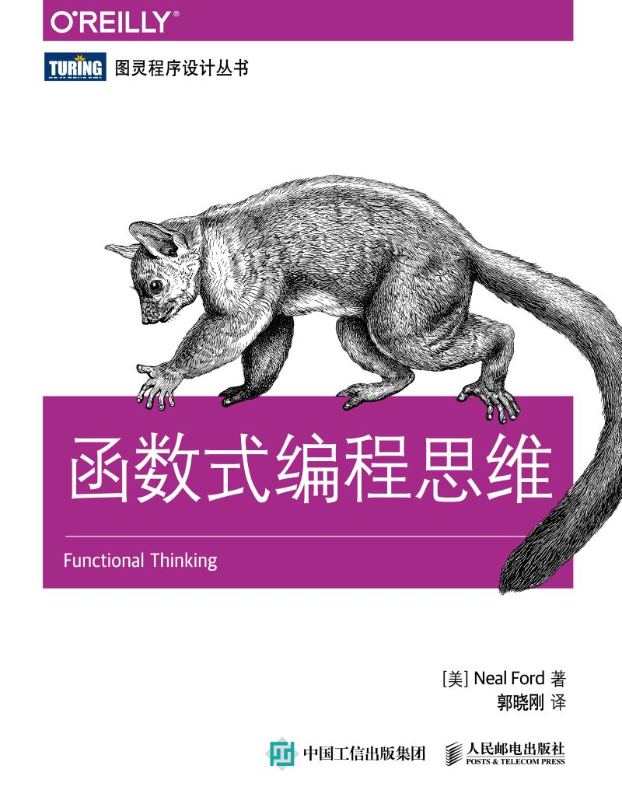

# 函数式编程思维

- 作者：Neal Ford
- 出版社：人民邮电出版社
- 出版时间：2015-08
- ISBN：978-7-115-40041-3
- 豆瓣：https://book.douban.com/subject/26587213
- 封面：



# 第 1 章 为什么

学习一种全新的编程范式，困难并不在于掌握新的语言。毕竟能拿起这本书的读者，学过的编程语言少说也有一箩筐——语法不过是些小细节罢了。真正考验人的，是怎么学会用另一种方式去思考。

## 1.1 范式转变

题目：读入一个文本文件，确定所有单词的使用频率并从高到低排序，打印出所有单词及其频率的排序列表

```java
// 例 1-1 词频统计的 Java 实现
public class Words {
	private Set < String > NON_WORDS = new HashSet < String > () {
		{
			add("the");
			add("and");
			add("of");
			add("to");
			add("a");
			add("i");
			add("it");
			add("in");
			add("or");
			add("is");
			add("d");
			add("s");
			add("as");
			add("so");
			add("but");
			add("be");
		}
	};
	public Map wordFreq(String words) {
		TreeMap < String, Integer > wordMap = new TreeMap < String, Integer > ();
		Matcher m = Pattern.compile("\\w+").matcher(words);
		while(m.find()) {
			String word = m.group().toLowerCase();
			if(!NON_WORDS.contains(word)) {
				if(wordMap.get(word) == null) {
					wordMap.put(word, 1);
				}
				else {
					wordMap.put(word, wordMap.get(word) + 1);
				}
			}
		}
		return wordMap;
	}
}
```

Java 8 新增了 Stream API 和以 lambda 块方式实现的高阶函数

```java
// 例 1-2 词频统计的 Java 8 实现
private List < String > regexToList(String words, String regex) {
	List wordList = new ArrayList < > ();
	Matcher m = Pattern.compile(regex).matcher(words);
	while(m.find()) wordList.add(m.group());
	return wordList;
}
public Map wordFreq(String words) {
	TreeMap < String, Integer > wordMap = new TreeMap < > ();
	regexToList(words, "\\w+").stream().map(w - > w.toLowerCase()).filter(w - > !NON_WORDS.contains(w)).forEach(w - > wordMap.put(w, wordMap.getOrDefault(w, 0) + 1));
	return wordMap;
}
```

Clojure 语言（ http://clojure.org ）的发明人 Rich Hickey 在 Strange Loop 会议上做过一堂题为“Simple Made Easy” 的 演 讲（ http://www.infoq.com/presentations/Simple-Made-Easy ），他翻出了一个已经很少用到的老词——“交织”（complect）：穿插缠绕地合为一体，使错综复杂。命令式编程风格常常迫使我们出于性能考虑，把不同的任务交织起来，以便能够用一次循环来完成多个任务。而函数式编程用 `map()`、`filter()` 这些高阶函数把我们解放出来，让我们站在更高的抽象层次上去考虑问题，把问题看得更清楚。

## 1.2 跟上语言发展的潮流

如果我们关注各种语言的发展情况就会发现，所有的主流语言都在进行函数式方面的扩充。

## 1.3 把控制权让渡给语言/运行时

> 人生苦短，远离 malloc

随着时间的推移，开发者们越来越多地把乏味单调的任务托付给语言和运行时。对于我日常编写的应用程序类型来说，失去对内存的直接控制没什么可惋惜的，放弃这些反而让我能够专注于更重要的问题。Java 接管内存分配减轻了我们的负担，函数式编程语言让我们用高阶抽象从容取代基本的控制结构，也有着同样的意义。

## 1.4 简洁

*Working with Legacy Code* 的作者 Michael Feathers 用寥寥数语（ https://twitter.com/mfeathers/status/29581296216 ）捕捉到了函数式抽象和面向对象抽象的关键区别：

> 面向对象编程通过封装不确定因素来使代码能被人理解；函数式编程通过尽量减少不确定因素来使代码能被人理解。——Michael Feathers

请回想一下你熟悉的封装、作用域、可见性等面向对象编程（OOP）构造，这些机制的存在意义，都是为了精细地控制谁能够感知状态和改变状态。

而当涉及多线程的时候，对状态的控制就更复杂了。这些机制就属于 Michael Feathers 所谓的“不确定因素”（movingparts）。

大多数函数式语言在这个问题上采取了另一种做法，它们认为，与其建立种种机制来控制可变的状态，不如尽可能消灭可变的状态这个不确定因素。其立论的根据是这样的：假如语言不对外暴露那么多有出错可能的特性，那么开发者就不那么容易犯错。

在面向对象的命令式编程语言里面，重用的单元是类和类之间沟通用的消息，这些都可以用类图（class diagram）来表述。这个领域的代表性著作《设计模式：可复用面向对象软件的基础》（*Design Patterns: Elements of Reusable Object-Oriented Software，作者 ErichGamma、Richard Helm、Ralph Johnson、John Vlissides*）就在每一个模式的说明里都附上了至少一幅类图。

OOP 的世界提倡开发者针对具体问题建立专门的数据结构，相关的专门操作以“方法”的形式附加在数据结构上。

函数式语言提倡在有限的几种关键数据结构（如 list、set、map）上运用针对这些数据结构高度优化过的操作，以此构成基本的运转机构。开发者再根据具体用途，插入自己的数据结构和高阶函数去调整机构的运转方式。

函数式程序员喜欢用少数几个核心数据结构，围绕它们去建立一套充分优化的运转机构。面向对象程序员喜欢不断地创建新的数据结构和附属的操作，因为压倒一切的面向对象编程范式就是建立新的类和类间的消息。把所有的数据结构都封装成类，一方面压制了方法层面的重用，另一方面鼓励了大粒度的框架式的重用。函数式编程的程序构造更方便我们在比较细小的层面上重用代码。

