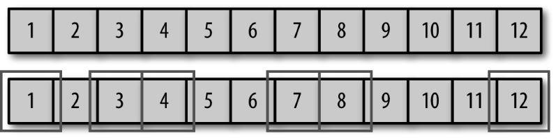
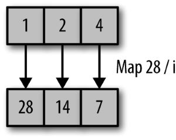
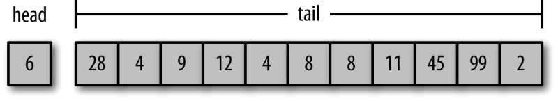

# 函数式编程思维

- 作者：Neal Ford
- 出版社：人民邮电出版社
- 出版时间：2015-08
- ISBN：978-7-115-40041-3
- 豆瓣：https://book.douban.com/subject/26587213
- 封面：


# 第 1 章 为什么

学习一种全新的编程范式，困难并不在于掌握新的语言。毕竟能拿起这本书的读者，学过的编程语言少说也有一箩筐——语法不过是些小细节罢了。真正考验人的，是怎么学会用另一种方式去思考。

## 1.1 范式转变

题目：读入一个文本文件，确定所有单词的使用频率并从高到低排序，打印出所有单词及其频率的排序列表

```java
// 例 1-1 词频统计的 Java 实现
public class Words {
	private Set < String > NON_WORDS = new HashSet < String > () {
		{
			add("the");
			add("and");
			add("of");
			add("to");
			add("a");
			add("i");
			add("it");
			add("in");
			add("or");
			add("is");
			add("d");
			add("s");
			add("as");
			add("so");
			add("but");
			add("be");
		}
	};
	public Map wordFreq(String words) {
		TreeMap < String, Integer > wordMap = new TreeMap < String, Integer > ();
		Matcher m = Pattern.compile("\\w+").matcher(words);
		while(m.find()) {
			String word = m.group().toLowerCase();
			if(!NON_WORDS.contains(word)) {
				if(wordMap.get(word) == null) {
					wordMap.put(word, 1);
				}
				else {
					wordMap.put(word, wordMap.get(word) + 1);
				}
			}
		}
		return wordMap;
	}
}
```

Java 8 新增了 Stream API 和以 lambda 块方式实现的高阶函数

```java
// 例 1-2 词频统计的 Java 8 实现
private List < String > regexToList(String words, String regex) {
	List wordList = new ArrayList < > ();
	Matcher m = Pattern.compile(regex).matcher(words);
	while(m.find()) wordList.add(m.group());
	return wordList;
}
public Map wordFreq(String words) {
	TreeMap < String, Integer > wordMap = new TreeMap < > ();
	regexToList(words, "\\w+").stream().map(w - > w.toLowerCase()).filter(w - > !NON_WORDS.contains(w)).forEach(w - > wordMap.put(w, wordMap.getOrDefault(w, 0) + 1));
	return wordMap;
}
```

Clojure 语言（ http://clojure.org ）的发明人 Rich Hickey 在 Strange Loop 会议上做过一堂题为“Simple Made Easy” 的 演 讲（ http://www.infoq.com/presentations/Simple-Made-Easy ），他翻出了一个已经很少用到的老词——“交织”（complect）：穿插缠绕地合为一体，使错综复杂。命令式编程风格常常迫使我们出于性能考虑，把不同的任务交织起来，以便能够用一次循环来完成多个任务。而函数式编程用 `map()`、`filter()` 这些高阶函数把我们解放出来，让我们站在更高的抽象层次上去考虑问题，把问题看得更清楚。

## 1.2 跟上语言发展的潮流

如果我们关注各种语言的发展情况就会发现，所有的主流语言都在进行函数式方面的扩充。

## 1.3 把控制权让渡给语言/运行时

> 人生苦短，远离 malloc

随着时间的推移，开发者们越来越多地把乏味单调的任务托付给语言和运行时。对于我日常编写的应用程序类型来说，失去对内存的直接控制没什么可惋惜的，放弃这些反而让我能够专注于更重要的问题。Java 接管内存分配减轻了我们的负担，函数式编程语言让我们用高阶抽象从容取代基本的控制结构，也有着同样的意义。

## 1.4 简洁

*Working with Legacy Code* 的作者 Michael Feathers 用寥寥数语（ https://twitter.com/mfeathers/status/29581296216 ）捕捉到了函数式抽象和面向对象抽象的关键区别：

> 面向对象编程通过封装不确定因素来使代码能被人理解；函数式编程通过尽量减少不确定因素来使代码能被人理解。——Michael Feathers

请回想一下你熟悉的封装、作用域、可见性等面向对象编程（OOP）构造，这些机制的存在意义，都是为了精细地控制谁能够感知状态和改变状态。

而当涉及多线程的时候，对状态的控制就更复杂了。这些机制就属于 Michael Feathers 所谓的“不确定因素”（movingparts）。

大多数函数式语言在这个问题上采取了另一种做法，它们认为，与其建立种种机制来控制可变的状态，不如尽可能消灭可变的状态这个不确定因素。其立论的根据是这样的：假如语言不对外暴露那么多有出错可能的特性，那么开发者就不那么容易犯错。

在面向对象的命令式编程语言里面，重用的单元是类和类之间沟通用的消息，这些都可以用类图（class diagram）来表述。这个领域的代表性著作《设计模式：可复用面向对象软件的基础》（*Design Patterns: Elements of Reusable Object-Oriented Software，作者 ErichGamma、Richard Helm、Ralph Johnson、John Vlissides*）就在每一个模式的说明里都附上了至少一幅类图。

OOP 的世界提倡开发者针对具体问题建立专门的数据结构，相关的专门操作以“方法”的形式附加在数据结构上。

函数式语言提倡在有限的几种关键数据结构（如 list、set、map）上运用针对这些数据结构高度优化过的操作，以此构成基本的运转机构。开发者再根据具体用途，插入自己的数据结构和高阶函数去调整机构的运转方式。

函数式程序员喜欢用少数几个核心数据结构，围绕它们去建立一套充分优化的运转机构。面向对象程序员喜欢不断地创建新的数据结构和附属的操作，因为压倒一切的面向对象编程范式就是建立新的类和类间的消息。把所有的数据结构都封装成类，一方面压制了方法层面的重用，另一方面鼓励了大粒度的框架式的重用。函数式编程的程序构造更方便我们在比较细小的层面上重用代码。

# 第 2 章 转变思维

## 2.1 普通的例子

当垃圾收集成为主流，一下子将若干难以调试的错误类别连根拔起，程序员也因为运行时接管了复杂且容易出错的内存管理而获得解脱。函数式编程希望在算法编写上给予程序员同样的帮助，一方面程序员得以在更高的抽象层次上工作，另一方面运行时也有了执行复杂优化的自由空间。开发者从中获得的好处体现在更低的复杂性和更高的性能，这点与垃圾收集相同，不过，函数式编程对个人的影响更直接，因为它改变的是你的解答思路。


### 2.1.1 命令式解法

命令式编程是按照“程序是一系列改变状态的命令”来建模的一种编程风格

题目：将除去单字符条目之外的列表内容，放在一个逗号分隔的字符串里返回，且每个名字的首字母都要大写

```java
// 例 2-1 典型的公司业务处理例子

package com.nealford.functionalthinking.trans;
import java.util.List;
public class TheCompanyProcess {
	public String cleanNames(List < String > listOfNames) {
		StringBuilder result = new StringBuilder();
		for(int i = 0; i < listOfNames.size(); i++) {
			if(listOfNames.get(i).length() > 1) {
				result.append(capitalizeString(listOfNames.get(i))).append(",");
			}
		}
		return result.substring(0, result.length() - 1).toString();
	}
	public String capitalizeString(String s) {
		return s.substring(0, 1).toUpperCase() + s.substring(1, s.length());
	}
}
```

### 2.1.2 函数式解法

函数式编程将程序描述为表达式和变换，以数学方程的形式建立模型，并且尽量避免可变的状态。

```
// 例 2-2 伪代码表示的“公司业务处理过程”
listOfEmps
	-> filter(x.length > 1)
	-> transform(x.capitalize)
	-> convert(x + "," + y)
```

```scala
// 例 2-3 函数式的处理过程（Scala 实现）
val employees = List("neal", "s", "stu", "j", "rich", "bob", "aiden", "j", "ethan","liam", "mason", "noah", "lucas", "jacob", "jayden", "jack")

val result = employees
.filter(_.length() > 1)
.map(_.capitalize)
.reduce(_ + "," + _)
```

```java
// 例 2-4 Java 8 实现的处理过程

public String cleanNames(List < String > names) {
	if(names == null) return "";
	return names.stream().filter(name - > name.length() > 1).map(name - > capitalize(name)).collect(Collectors.joining(","));
}

private String capitalize(String e) {
	return e.substring(0, 1).toUpperCase() + e.substring(1, e.length());
}
```

```Groovy
// 例 2-5 Groovy 实现的处理过程
public static String cleanUpNames(listOfNames) {
	listOfNames
		.findAll { it.length() > 1 }
		.collect { it.capitalize() }
		.join ','
}
```

```Clojure
;; 例 2-6 Clojure 实现的处理过程
(defn process [list-of-emps]
	(reduce str (interpose ","
		(map s/capitalize (filter #(< 1 (count %)) list-of-emps)))))
```

```Clojure
;; 例 2-7 通过 thread-last 宏改善代码的可读性
(defn process2 [list-of-emps]
	(->> list-of-emps
		(filter #(< 1 (count %)))
		(map s/capitalize)
		(interpose ",")
		(reduce str)))
```

学会用更高层次的抽象来思考有什么好处？

1. 会促使我们换一种角度去归类问题，看到问题的共性
2. 让运行时有更大的余地去做智能的优化。有时候，在不改变最终输出的前提下，调整一下作业的先后次序会更有效率（例如减少了需要处理的条目）
3. 让埋头于实现细节的开发者看到原本视野之外的一些解决方案

```Scala
<!-- 例 2-8 Scala 实现的并行化处理过程 -->
val parallelResult = employees
.par
.filter(_.length() > 1)
.map(_.capitalize)
.reduce(_ + "," + _)
```

```Java
// 例 2-9 Java 8 实现的并行化处理过程
public String cleanNamesP(List < String > names) {
    if (names == null) return "";
    return names
        .parallelStream()
        .filter(n - > n.length() > 1)
        .map(e - > capitalize(e))
        .collect(Collectors.joining(","));
}
```

map、reduce、filter等函数式操作也存在类似的互利关系。Clojure下的Reducers扩展库（ http://dwz.cn/reducers-library ）就是一个绝佳的例子。其作者RichHickey以库的形式对Clojure语言进行了扩展，提供了新版本的vector和map实现（以及用来转换原版vector和map的新的fold函数），他的实现在内部运用Java的Fork/Join框架来完成对集合的并行处理。

> 多从结果着眼，少纠结具体的步骤。

## 2.2 案例研究：完美数的分类问题

古希腊数学家 Nicomachus 发明了一种自然数的分类方法，任意一个自然数都唯一地被归类为过剩数（abundant）、完美数（perfect）或不足数（deficient）。一个完美数的真约数（即除了自身以外的所有正约数）之和，恰好等于它本身。例如 6 是一个完美数，因为它的约数是 1、2、3，而 6 = 1 + 2 + 3；28 也是一个完美数，因为 28 = 1 + 2 + 4 + 7 + 14。

表2-1：自然数分类规则

|||
|:---:|---|
| 完美数 | 真约数之和 = 数本身 |
| 过剩数 | 真约数之和 > 数本身 |
| 不足数 | 真约数之和 < 数本身 |

实现中用到一个数学概念，真约数和（aliquot sum），其定义就是除了数本身之外（一个数总是它本身的约数），其余正约数的和。

### 2.2.1 完美数分类的命令式解法

```Java
// 例 2-10 完美数分类的 Java 实现
import java.util.HashMap;
import java.util.HashSet;
import java.util.Map;
import java.util.Set;
public class ImpNumberClassifierSimple {
    private int _number; // ➊
    private Map < Integer, Integer > _cache; // ➋
    public ImpNumberClassifierSimple(int targetNumber) {
        _number = targetNumber;
        _cache = new HashMap < > ();
    }
    public boolean isFactor(int potential) {
        return _number % potential == 0;
    }
    public Set < Integer > getFactors() {
        Set < Integer > factors = new HashSet < > ();
        factors.add(1);
        factors.add(_number);
        for (int i = 2; i < _number; i++)
            if (isFactor(i))
                factors.add(i);
        return factors;
    }
    public int aliquotSum() { // ➌
        if (_cache.get(_number) == null) {
            int sum = 0;
            for (int i: getFactors())
                sum += i;
            _cache.put(_number, sum - _number);
        }
        return _cache.get(_number);
    }
    public boolean isPerfect() {
        return aliquotSum() == _number;
    }
    public boolean isAbundant() {
        return aliquotSum() > _number;
    }
    public boolean isDeficient() {
        return aliquotSum() < _number;
    }
}
```

- ➊ 内部状态，存放待分类的目标数字
- ➋ 内部缓存，防止重复进行不必要的求和运算
- ➌ 计算“真约数和”aliquotSum，即正约数之和减去数字本身

### 2.2.2 稍微向函数式靠拢的完美数分类解法

```Java
// 例 2-11 稍微向函数式靠拢的完美数分类实现
import java.util.Collection;
import java.util.Collections;
import java.util.HashSet;
import java.util.Set;
public class NumberClassifier {
    public static boolean isFactor(final int candidate, final int number) { // ➊
        return number % candidate == 0;
    }
    public static Set < Integer > factors(final int number) { //  ➋
        Set < Integer > factors = new HashSet < > ();
        factors.add(1);
        factors.add(number);
        for (int i = 2; i < number; i++)
            if (isFactor(i, number))
                factors.add(i);
        return factors;
    }
    public static int aliquotSum(final Collection < Integer > factors) { // ➌
        int sum = 0;
        int targetNumber = Collections.max(factors);
        for (int n: factors) {
            sum += n;
        }
        return sum - targetNumber;
    }
    public static boolean isPerfect(final int number) {
            return aliquotSum(factors(number)) == number;
        } // ➍
    public static boolean isAbundant(final int number) {
        return aliquotSum(factors(number)) > number;
    }
    public static boolean isDeficient(final int number) {
        return aliquotSum(factors(number)) < number;
    }
}
```

- ➊ 众多方法都必须加上 `number` 参数，因为没有可以存放它的内部状态
- ➋ 所有方法都带 `public static` 修饰，因为它们都是 **纯函数**，并因此可以在完美数分类之外的领域使用
- ➌ 注意例中对参数类型的选取，尽可能宽泛的参数类型可以增加函数重用的机会
- ➍ 例子目前在重复执行分类操作的时候效率较低，因为没有缓存

在例 2-11 稍微向函数式风格靠拢的 `NumberClassifier` 里面，所有方法都是自足的、带 `public` 和 `static` 作用域的纯函数（即没有副作用的函数）。而由于类里面根本不存在任何内部状态，也就没有理由去“隐藏”任何一个方法。

面向对象系统里粒度最小的重用单元是类，开发者往往忘记了重用可以在更小的单元上发生

这一版的实现没有为求和结果设计缓存机制。缓存意味着持续存在的状态，可是这一版的实现根本没有可以放置状态的地方。例 2-11 对比例 2-10 相同功能的实现，效率上要低一些。这是因为失去了存放求和结果的内部状态，只好每次都重新计算。

### 2.2.3 完美数分类的Java 8实现

`lambda` 块是最令 Java 8 面目一新的改进，它其实就是高阶函数

```Java
// 例 2-12 完美数分类的 Java 8 实现
import java.util.List;
import java.util.stream.Collectors;
import java.util.stream.IntStream;
import java.util.stream.Stream;
import static java.lang.Math.sqrt;
import static java.util.stream.Collectors.toList;
import static java.util.stream.IntStream.range;
public class NumberClassifier {
    public static IntStream factorsOf(int number) {
        return range(1, number + 1)
            .filter(potential - > number % potential == 0);
    }
    public static int aliquotSum(int number) {
        return factorsOf(number).sum() - number;
    }
    public static boolean isPerfect(int number) {
        return aliquotSum(number) == number;
    }
    public static boolean isAbundant(int number) {
        return aliquotSum(number) > number;
    }
    public static boolean isDeficient(int number) {
        return aliquotSum(number) < number;
    }
}
```

例 2-12 的代码明显比原来的命令式解法（例 2-10）以及不完全的函数式版本（例 2-11）短得多，也简单得多。

物理上把机械能分成储蓄起来的 **势能** 和 **释放** 出来的动能。在版本8以前的Java，以及它所代表的许多语言里，集合的行为可以比作动能：各种操作都立即求得结果，不存在中间状态。函数式语言里的 `stream` 则更像势能，它的操作可以引而不发。被 `stream` 储蓄起来的有数据来源（例中的数据来源是 `range()` 方法），还有我们对数据设置的各种条件，如例中的筛选操作。只有当程序员通过 `forEach()`、`sum()` 终结操作来向 `stream` “要”求值结果的时候，才触发从“势能”到“动能”的转换。在“动能”开始释放之前，`stream` 可以作为参数传递并后续附加更多的条件，继续积蓄它的“势能”。这里关于“势能”的比喻，用函数式编程的说法叫作缓求值（`lazy evaluation`），我们将在第4章详细讨论。

### 2.2.4 完美数分类的 Functional Java 实现

开源框架 Functional Java 针对 1.5 以上版本的 Java 运行时，以尽可能低的侵入性为代价引入了尽量多的函数式编程手法。例如Functional Java 可以通过泛型和匿名内部类，在 Java 1.5 时代的 JDK 上模拟出它所缺少的高阶函数特性。

```Java
// 例 2-13 使用 Functional Java 框架实现的完美数分类
import fj.F;
import fj.data.List;
import static fj.data.List.range;
public class NumberClassifier {
    public List < Integer > factorsOf(final int number) {
        return range(1, number + 1)				// ➊
            .filter(new F < Integer, Boolean > () {
                public Boolean f(final Integer i) {
                    return number % i == 0;
                }
            });									// ➋
    }
    public int aliquotSum(List < Integer > factors) {	// ➌
        return factors.foldLeft(fj.function.Integers.add, 0) - factors.last();
    }
    public boolean isPerfect(int number) {
        return aliquotSum(factorsOf(number)) == number;
    }
    public boolean isAbundant(int number) {
        return aliquotSum(factorsOf(number)) > number;
    }
    public boolean isDeficient(int number) {
        return aliquotSum(factorsOf(number)) < number;
    }
}
```

- ➊ Functional Java 的 `range()` 函数圈出来的是一个左闭右开区间
- ➋ 筛选操作代替了迭代
- ➌ 折叠（fold）操作代替了迭代

例 2-13 与例 2-11 的主要区别表现在 `aliquotSum()` 和 `factorsOf()` 这两个方法上。Functional Java 在其 `List` 类中提供的 `foldLeft()` 方法为 `aliquotSum()` 提供了很大的便利

“fold left”（即左折叠操作）的含义是：

1. 用一个操作（或者叫运算）将初始值（例中为 0）与列表中的第一个元素结合；
2. 继续用同样的操作将第 1 步的运算结果与下一个元素结合；
3. 反复进行直到消耗完列表中的元素

例 2-13 另一个值得注意的地方是 `factorsOf()` 方法，它很好地体现了“多着眼结果，少纠结步骤”的格言。寻找一个数的约数，这个问题的实质是什么？或者可以换一种方式来叙述：在从 1 到目标数字的整数列表里，我们怎么确定其中哪些数字是目标数的约数？这样一来，筛选操作就呼之欲出了——我们可以逐一筛选列表中的元素，去除那些不满足筛选条件的数字。

例 2-13 使用了 `foldLeft()` 方法，它依次向左方，即向着第一个元素合并列表。对于满足交换律的加法来说，折叠的方向并不影响结果。万一我们需要使用某些结果与折叠次序相关的操作，还有 `foldRight()` 方法可供选择。

> 高阶函数消除了摩擦

> 不要增加无谓的摩擦

## 2.3 具有普遍意义的基本构造单元

### 2.3.1 筛选

筛选（filter）是列表的一种基本操作：根据用户定义的条件来筛选列表中的条目，并由此产生一个较小的新列表



图 2-1：从较大的列表中筛选出一个数字列表

```Java
// 例 2-14 Java 8 的筛选操作
public static IntStream factorsOf(int number) {
    return range(1, number + 1)
        .filter(potential - > number % potential == 0);
}
```

```Groovy
// 例 2-15 Groovy 的筛选操作（叫作 findAll()）
static def factors(number) {
	(1..number).findAll {number % it == 0}
}
```

> 需要根据筛选条件来产生一个子集合的时候，用 filter

### 2.3.2 映射

映射（map）操作对原集合的每一个元素执行给定的函数，从而变换成一个新的集合



```Groovy
<!-- 例 2-17 Groovy 版的约数查找优化算法 -->
static def factors(number) {
	def factors = (1..round(sqrt(number)+1)).findAll({number % it == 0})
	(factors + factors.collect {number / it}).unique()
}
```

```Clojure
;; 例 2-18 Clojure 写成的 (classify ) 函数将所有行为封装在了几行赋值语句里
(defn classify [num]
	(let [factors (->> (range 1 (inc num)) ; ➊
		(filter #(zero? (rem num %)))) ; ➋
		sum (reduce + factors) ; ➌
		aliquot-sum (- sum num)] ; ➍
	(cond ; ➎
	(= aliquot-sum num) :perfect
	(> aliquot-sum num) :abundant
	(< aliquot-sum num) :deficient)))
```

- ➊ 方法成了赋值语句
- ➋ 把筛选过的区间赋给约数列表
- ➌ 把化约（reduce）过的约数列表赋给 sum
- ➍ 计算真约数和
- ➎ 返回代表分类结果的关键字（枚举）

> 需要就地变换一个集合的时候，用 map

### 2.3.3 折叠/化约

foldLeft 和 reduce 都是 catamorphism 这种范畴论的态射概念具体应用到列表操纵上面的变体，catamorphism 是对列表“折叠”（fold）概念的推广

> 需要把集合分成一小块一小块来处理的时候，用 reduce 或 fold

函数式编程不会用很多抽象，但每个抽象的泛化程度都很高（特化的方面通过高阶函数注入）。函数式编程以参数传递和函数的复合作为主要的表现手段，我们不需要掌握太多作为“不确定因素”存在的其他语言构造之间的交互规则，这一点对于我们的学习是有利的。

## 2.4 函数的同义异名问题

继承函数式传统的语言喜欢按照范式术语来命名基本函数，而出自脚本语言背景的则更喜欢使用描述性的名字（有时候还会起多个名字，实质是指向相同函数的别名）

### 2.4.1 筛选

筛选函数将用户（通常以高阶函数的形式）给定的布尔逻辑作用于集合，返回由原集合中符合条件的元素组成的一个子集

筛选操作与查找（find）函数的关系很密切，查找函数返回的是集合中第一个符合条件的元素

#### 1. Scala

```Scala
// 筛选条件为可被 3 整除的元素
val numbers = List.range(1, 11)
numbers filter (x => x % 3 == 0)
// List(3, 6, 9)

//  更简短版本
numbers filter (_ % 3 == 0)
// List(3, 6, 9)
```

```Scala
// 用 partition() 函数把数字列表分成了两部分
numbers partition (_ % 3 == 0)
// (List(3, 6, 9),List(1, 2, 4, 5, 7, 8, 10))
```

```Scala
// find() 返回第一个匹配项
numbers find (_ % 3 == 0)
// Some(3)
```

`find()` 并不直接把匹配项作为返回值，而是 `Option` 类作了一层包装。`Option` 有两个可能的取值：`Some` 或者 `None`。Scala 也像别的函数式语言一样，用 `Option` 来作为一种迂回手段，以避免在无返回值的情况下返回 `null`

```Scala
numbers find (_ < 0)
// None
```

```Scala
// takeWhile() 函数从集合头部开始，一直取到第一个不满足断言的元素
List(1, 2, 3, -4, 5, 6, 7, 8, 9, 10) takeWhile (_ > 0)
// List(1, 2, 3)
```

```Scala
// dropWhile() 函数则从集合头部开始，一直丢弃满足断言的元素，直到遇到第一个非匹配项
val words = List("the", "quick", "brown", "fox", "jumped",
				"over", "the", "lazy", "dog")
words dropWhile (_ startsWith "t")
// List(quick, brown, fox, jumped, over, the, lazy, dog)
```

#### 2. Groovy

```Groovy
(1..10).findAll {it % 3 == 0}
// [3, 6, 9]
```

```Groovy
(1..10).split {it % 3}
// [ [1, 2, 4, 5, 7, 8, 10], [3, 6, 9] ]
```

```Groovy
(1..10).find {it < 0}
// null
```

Groovy 也有 `takeWhile()` 和 `dropWhile()` 方法，其语义和 Scala 的版本差不多

#### 3. Clojure

Clojure 用于操纵集合的招式数量多得惊人，而且因为 Clojure 语言的动态类型特征，这些函数一般还都是泛型的函数

```Clojure
(def numbers (range 1 11))
(filter (fn [x] (= 0 (rem x 3))) numbers)
; (3 6 9)
```

```Clojure
(filter #(zero? (rem % 3)) numbers)
; (3 6 9)
```

```Clojure
(def words ["the" "quick" "brown" "fox" "jumped" "over" "the" "lazy" "dog"])
(filter #(= 3 (count %)) words)
; (the fox the dog)
```

### 2.4.2 映射

传给映射函数的是一个高阶函数和一个集合，它在对集合中的每一个元素施用传入的函数之后，产生另一个集合作为返回值

#### 1. Scala

```Scala
List(1, 2, 3, 4, 5) map (_ + 1)
// List(2, 3, 4, 5, 6)

words map (_.length)
// List(3, 5, 5, 3, 6, 4, 3, 4, 3)
```

嵌套的列表在函数式编程语言中运用得极为频繁，因此各语言普遍地具备用来消除嵌套的库函数，一般将此操作称为“展平”（flattening）

```Scala
List(List(1, 2, 3), List(4, 5, 6), List(7, 8, 9)) flatMap (_.toList)
// List(1, 2, 3, 4, 5, 6, 7, 8, 9)

words flatMap (_.toList)
// List(t, h, e, q, u, i, c, k, b, r, o, w, n, f, o, x, ...
```

#### 2. Groovy

映射操作在 Groovy 语言里对应的是若干 `collect()` 函数

```Groovy
(1..5).collect {it += 1}
// [2, 3, 4, 5, 6]

def words = ["the", "quick", "brown", "fox", "jumped",
"over", "the", "lazy", "dog"]
words.collect {it.length()}
// [3, 5, 5, 3, 6, 4, 3, 4, 3]
```

Groovy 也有一个类似于 `flatMap()`，用来消除嵌套结构的方法，叫作 `flatten()`

```Groovy
[ [1, 2, 3], [4, 5, 6], [7, 8, 9] ].flatten()
// [1, 2, 3, 4, 5, 6, 7, 8, 9]

(words.collect {it.toList()}).flatten()
// [t, h, e, q, u, i, c, k, b, r, o, w, n, f, o, x, j, ...
```

#### 3. Clojure

```Clojure
(map inc numbers)
; (2 3 4 5 6 7 8 9 10 11)

(map #(count %) words)
; (3 5 5 3 6 4 3 4 3)

(flatten [[1 2 3] [4 5 6] [7 8 9]])
; (1 2 3 4 5 6 7 8 9)
```

### 2.4.3 折叠/化约

#### 1. Scala

Scala 的各种折叠操作最为丰富，其中部分原因是它需要更多地面对某些类型相关的场景，而这些场景在动态类型的 Groovy 和 Clojure 语言中根本不存在

传给 `reduce()` 的函数或运算符一般接受两个参数，且仅返回单一值，就好像原集合被“消耗”掉了一样

```Scala
List.range(1, 10) reduceLeft((a, b) => a + b)
// 45

List.range(1, 10).reduceLeft(0)(_ + _)
// 45

List.range(1, 10) reduceRight(_ - _)
// 8 - 9 = -1
// 7 - (-1) = 8
// 6 - 8 = -2
// 5 - (-2) = 7
// 4 - 7 = -3
// 3 - (-3) = 6
// 2 - 6 = -4
// 1 - (-4) = 5
// result: 5

words.reduceLeft((a, b) => if (a.length > b.length) a else b)
// jumped
```

Scala 语言支持运算符重载，`foldLeft` 和 `foldRight` 作为十分常用的折叠操作，也分别有各
自对应的运算符 `/:` 和 `:\`

```Scala
(0 /: List.range(1, 10)) (_ + _)
// 45

(List.range(1, 10) :\ 0) (_ - _)
// 5
```

#### 2. Groovy

Groovy 提供了两个版本的 `inject()` 来完成化约操作，分别对应于 Scala 众多同类方法中的 `reduce()` 和 `foldLeft()`

```Groovy
(1..10).inject {a, b -> a + b}
// 55

// 带初始值的版本
(1..10).inject(0, {a, b -> a + b})
// 55
```

#### 3. Clojure

Clojure 在它的 Reducers 库（ http://clojure.org/reducers ）里提供了更多与化约操作相关的高级功能

# 第 3 章 权责让渡

函数式思维的好处之一，是能够将低层次细节（如垃圾收集）的控制权移交给运行时，从而消弭了一大批注定会发生的程序错误。开发者们可以一边熟视无睹地享受着最基本的抽象，比如内存，一边却会对更高层次的抽象感觉突兀。然而不管层次高低，抽象的目的总是一样的：让开发者从繁琐的运作细节里解脱出来，去解答问题中非重复性的那些方面。

本章将展示在函数式语言中，向语言和运行时让渡控制权的五种途径，让开发者抛开负累，投入到更有意义的问题中去

## 3.1 迭代让位于高阶函数

在很多情况下，我们使用一个抽象，比如 Stream 的时候，必须清楚可能产生的连带后果。很多开发者都没认识到，即使有了 Java 8 的 Stream API，他们仍然需要理解 Fork/Join 库的细节才能写出高性能的代码。当你掌握了背后的原理，才能把力量用在最正确的地方。

> 理解掌握的抽象层次永远要比日常使用的抽象层次更深一层

## 3.2 闭包

闭包（closure）是所有函数式语言都具备的一项平常特性，它是一种特殊的函数，在暗地里绑定了函数内部引用的所有变量。换句话说，这种函数（或方法）把它引用的所有东西都放在一个上下文里“包”了起来。

```Groovy
// 例 3-1 Groovy 语言中闭包绑定的简单示例
class Employee {
    def name, salary
}
def paidMore(amount) {
    return {Employee e -> e.salary > amount}
}
isHighPaid = paidMore(100000)
```

例 3-1 首先定义了一个简单的 Employee 类，类中带有两个字段。接着定义带有 amount 参数的 paidMore 函数，其返回值是一个以 Employee 实例为参数的代码块，或者叫闭包。

我们给代码块传入参数值 100000，并赋予 isHighPaid 的名称，于是数值 100000 就随着这一步赋值操作，永久地和代码块绑定在一起了。

以后有员工数据被代入这个代码块求解的时候，它就可以拿绑定的数值作为标准去评判员工的工资高低。

```Groovy
// 例 3-2 执行闭包
def Smithers = new Employee(name:"Fred", salary:120000)
def Homer = new Employee(name:"Homer", salary:80000)
println isHighPaid(Smithers)
println isHighPaid(Homer)
// true, false
```

闭包在生成的时候，会把引用的变量全部圈到代码块的作用域里，封闭、包围起来（故名闭包）。闭包的每个实例都保有自己的一份变量取值，包括私有变量也是如此。

```Groovy
// 例 3-4 闭包的原理（Groovy 示例）
def Closure makeCounter() {
    def local_variable = 0
    return { return local_variable += 1 } // ➊
}
c1 = makeCounter() // ➋
c1() // ➌
c1()
c1()
c2 = makeCounter() // ➍
println "C1 = ${c1()}, C2 = ${c2()}"
// output: C1 = 4, C2 = 1 // ➎
```

- ➊ 函数的返回值是一个代码块，而不是一个值
- ➋ c1 现在指向代码块的一个实例
- ➌ 调用 c1 将递增其内部变量，如果这个时候输出，其结果会是 1
- ➍ c2 现在指向 makeCounter() 的一个全新实例，与其他实例没有关联
- ➎ 每个实例的内部状态都是独立的，各自拥有一份 local_variable

> 让语言去管理状态

闭包还是 **推迟执行** 原则的绝佳样板。我们把代码绑定到闭包之后，可以推迟到适当的时机再执行闭包

命令式语言围绕状态来建立编程模型，参数传递是其典型特征。闭包作为一种对行为的建模手段，让我们把代码和上下文同时封装在单一结构，也就是闭包本身里面，像传统数据结构一样可以传递到其他位置，然后在恰当的时间和地点完成执行

> 抓住上下文，而非状态

## 3.3 柯里化和函数的部分施用

柯里化（currying）和函数的部分施用（partial application）都是从数学里借用过来的编程语言技法（基于 20 世纪 Haskell Curry 等数学家的研究成果）。这两种技法以不同的面目出现在各种类型的语言里，在函数式语言当中尤为普遍。柯里化和部分施用都有能力操纵函数或方法的参数数目，一般是通过向一部分参数代入一个或多个默认值的办法来实现的（这部分参数被称为“固定参数”）

### 3.3.1 定义与辨析

柯里化指的是从一个多参数函数变成一连串单参数函数的变换。它描述的是变换的过程，不涉及变换之后对函数的调用。

部分施用指通过提前代入一部分参数值，使一个多参数函数得以省略部分参数，从而转化为一个参数数目较少的函数。

柯里化和部分施用都是在我们提供部分参数值之后，产出可以凭余下参数实施调用的一个函数。不同的地方在于，函数柯里化的结果是返回链条中的下一个函数，而部分施用是把参数的取值绑定到用户在操作中提供的具体值上，因而产生一个“元数”（参数的数目）较少的函数

举个例子，函数 `process(x, y, z)` 完全柯里化之后将变成 `process(x)(y)(z)` 的形式，其中 `process(x)` 和 `process(x)(y)` 都是单参数的函数。如果只对第一个参数柯里化，那么 `process(x)` 的返回值将是一个单参数的函数，而这个唯一的参数又接受另一个参数的输入

而部分施用的结果直接是一个减少了元数的函数。如果在 `process(x, y, z)` 上部分施用一个参数，那么我们将得到还剩下两个参数的函数：`process(y, z)`

- Groovy 实现了部分施用也实现了柯里化，但是它把两者都叫作柯里化
- Scala 既有部分施用函数（partially applied function），又有名称相近的偏函数类 `PartialFunction`，可它们是截然不同的两个概念。

### 3.3.2 Groovy 的情况

Groovy 通过 `curry()` 函数实现柯里化，这个函数来自 `Closure` 类

```Groovy
// 例 3-6 Groovy 语言中的柯里化
def product = { x, y -> x * y }
def quadrate = product.curry(4) ➊
def octate = product.curry(8) ➋
println "4x4: ${quadrate.call(4)}" ➌
println "8x5: ${octate(5)}" ➍
```

- ➊ 调用 `curry()` 来固定一个参数，返回结果是一个单参数的函数
- ➋ `octate()` 函数总是对传入的参数乘以 8
- ➌ `quadrate()` 是一个单参数的函数，可以通过 Closure 类的 `call()` 方法来调用它
- ➍ Groovy 提供了一层语法糖衣，可以让调用语句的写法更自然一些

`curry()` 虽然叫这个名字，它在背后对代码块所做的事情其实属于函数的部分施用

```Groovy
// 例 3-7 Groovy 语言中部分施用与柯里化的对比
def volume = {h, w, l -> h * w * l}
def area = volume.curry(1)
def lengthPA = volume.curry(1, 1) ➊
def lengthC = volume.curry(1).curry(1) ➋
println "参数取值为2x3x4的长方体，体积为${volume(2, 3, 4)}"
println "参数取值为3x4的长方形，面积为${area(3, 4)}"
println "参数取值为6的线段，长度为${lengthPA(6)}"
println "参数取值为6的线段，经柯里化函数求得的长度为${lengthC(6)}"
```

- ➊ 部分施用
- ➋ 柯里化

复合（composition），是函数式语言拼组这些构造单元的一般方式，这方面的详细讨论放在 [第 6 章](#第-6-章-模式与重用)

```Groovy
// 例 3-8 Groovy 语言中函数的复合
def composite = { f, g, x -> return f(g(x)) }
def thirtyTwoer = composite.curry(quadrate, octate)
println "composition of curried functions yields ${thirtyTwoer(2)}"
```

### 3.3.3 Clojure 的情况

Clojure 有一个 `(partial f a1 a2 ...)` 函数，我们传给它函数 f 和若干数量不足的参数，它将返回经过部分施用的函数 f，可凭余下的参数进行调用

```Clojure
; 例 3-9 Clojure 语言中的部分施用技法
(def subtract-from-hundred (partial - 100))
(subtract-from-hundred 10) ; same as (- 100 10)
; 90
(subtract-from-hundred 10 20) ; same as (- 100 10 20)
; 70
```

由于 Clojure 是动态类型的语言，并且支持可变长度的参数列表，它没有将柯里化实现成一种语言特性，相关的场景交由部分施用去处理

Clojure 在 Reducers 库里有一个命名空间内私有的 `(defcurried ...)` 函数，虽然其本意是方便库内的函数定义，但凭借 Lisp 家族血脉里与生俱来的灵活性，扩大一下 `(defcurried ...)` 的使用范围简直小菜一碟

### 3.3.4 Scala 的情况

Scala 支持柯里化和部分施用，另外还有一个用来定义偏函数的 trait

#### 1. 柯里化

Scala 允许函数定义多组参数列表，每组写在一对圆括号里。当我们用少于定义数目的参数来调用函数的时候，将返回一个以余下的参数列表为参数的函数

```Scala
// 例 3-10 Scala 语言中的参数柯里化
def filter(xs: List[Int], p: Int => Boolean): List[Int] =
    if (xs.isEmpty) xs
    else if (p(xs.head)) xs.head :: filter(xs.tail, p)
    else filter(xs.tail, p)

def modN(n: Int)(x: Int) = ((x % n) == 0)

val nums = List(1, 2, 3, 4, 5, 6, 7, 8)
println(filter(nums, modN(2)))
println(filter(nums, modN(3)))
```

#### 2. 部分施用函数

```Scala
// 例 3-11 Scala 语言中函数的部分施用
def price(product : String) : Double =
    product match {
        case "apples" => 140
        case "oranges" => 223
}

def withTax(cost: Double, state: String) : Double =
    state match {
        case "NY" => cost * 2
        case "FL" => cost * 3
}

val locallyTaxed = withTax(_: Double, "NY")
val costOfApples = locallyTaxed(price("apples"))

assert(Math.round(costOfApples) == 280)
```

#### 3. 偏函数

Scala 设计出 PartialFunction trait 是为了密切配合语言中的模式匹配特性，其详情可参阅第 6 章。尽管名称相似，PartialFunction trait 并不生成部分施用函数。它的真正用途是描述只对定义域中一部分取值或类型有意义的函数。

```Scala
// 例 3-12 不和 match 一起出现的 case
val cities = Map("Atlanta" -> "GA", "New York" -> "New York",
    "Chicago" -> "IL", "San Francsico " -> "CA", "Dallas" -> "TX")

cities map { case (k, v) => println(k + " -> " + v) }
```

```Scala
// 例 3-13 map 和 collect 的区别
List(1, 3, 5, "seven") map { case i: Int => i + 1 } // 无法顺利完成
// scala.MatchError: seven (of class java.lang.String)
List(1, 3, 5, "seven") collect { case i: Int => i + 1 }
// 验证结果
assert(List(2, 4, 6) == (List(1, 3, 5, "seven") collect { case i: Int => i + 1 }))
```

Case 语句定义了偏函数（`partial function`），请注意不要和名称相近的部分施用函数相混淆。偏函数的参数被限定了取值范围。例如数学函数 1/x 在 x = 0 的时候是无意义的。

```Scala
// 例 3-14 在 Scala 语言中定义偏函数
val answerUnits = new PartialFunction[Int, Int] {
    def apply(d: Int) = 42 / d
    def isDefinedAt(d: Int) = d != 0
}

assert(answerUnits.isDefinedAt(42))
assert(! answerUnits.isDefinedAt(0))
assert(answerUnits(42) == 1)
// answerUnits(0)
// java.lang.ArithmeticException: / by zero
```

```Scala
// 例 3-15 answerUnits 的另一种写法
def pAnswerUnits: PartialFunction[Int, Int] =
    { case d: Int if d != 0 => 42 / d }
assert(pAnswerUnits(42) == 1)
//pAnswerUnits(0)
//scala.MatchError: 0 (of class java.lang.Integer)
```

### 3.3.5 一般用途

#### 1. 函数工厂

我们在传统面向对象编程中会用到工厂方法的场合，正适合柯里化（以及部分施用）表现它的才干

```Groovy
// 例 3-17 Groovy 实现的加法函数和递增函数
def adder = { x, y -> x + y}
def incrementer = adder.curry(1)
println "increment 7: ${incrementer(7)}" // 8
```

#### 2. Template Method模式

GoF 模式集里面有一项 Template Method（模板方法）模式。其用意是在固定的算法框架内部安排一些抽象方法，为后续的具体实现保留一部分灵活性。部分施用和柯里化也可以起到相同的作用。部分施用技法注入当前已经确定的行为，留下未确定的参数给具体实现去发挥，其思路与模板方法这种面向对象的设计模式如出一辙。

#### 3. 隐含参数

当我们需要频繁调用一个函数，而每次的参数值都差不多的时候，可以运用柯里化来设置隐含参数


```Clojure
// 例 3-18 运用部分施用技法设置隐含参数值
(defn db-connect [data-source query params]
    ...)
(def dbc (partial db-connect "db/some-data-source"))
(dbc "select * from %1" "cust")
```

例 3-18 的 dbc 函数在操作数据的时候不需要再提供数据源，数据源已经自动设置好了。面向对象编程中“封装”概念的本质，也就是魔术般出现在每个函数里的隐含上下文 this，我们可以在函数式编程中加以模拟，用柯里化的方式把 this 传递给所有的函数，让 this在使用者的面前隐藏起来。

## 3.4 递归

### 换个角度看列表

Groovy 大大加强了 Java 集合库的能力，其中就包括新增了许多函数式结构

在 C 或类 C 语言（包括 Java）出身的开发者的头脑里面，列表概念通常会被塑造成一个带索引的集合。对于诸多函数式语言来说，它们眼中的列表形象有些不一样，所幸 Groovy 也持同样的观点。它们看到的不是带索引的格子，而是看成由列表的第一个元素（叫作头部）和列表的其余元素（叫作尾部）这两部分组合而成，如图 3-2 所示。



图 3-2：分成头和尾两部分的列表形象

```Groovy
// 例 3-20 以递归方式进行的列表遍历
def recurseList(listOfNums) {
    if (listOfNums.size == 0) return;
    println "${listOfNums.head()}"
    recurseList(listOfNums.tail())
}
println "\n递归式的列表遍历"
recurseList(numbers)
```

> 尾调用优化
>
> 递归没有成为一种平常的操作，其中一个主要原因是栈的增长。递归操作一般的实现方式，都是把中间结果放在栈里，于是没有为递归专门优化的语言就会遇到栈溢出的问题。而像 Scala、Clojure 这些语言则各自采用了不同的方式来规避这方面的局限。开发者也可以在这个问题上出一点力，使用尾调用优化（tail-call optimization）的写法来帮助运行时克服栈的增长问题。当递归调用是函数执行的最后一个调用的时候，运行时往往可以在栈里就地更新，而不需要增加新的栈空间。

## 3.5 Stream 和作业顺序重排

# 第 4 章 用巧不用蛮

很多函数式编程构造的目的只有一个：从频繁出现的场景中消灭掉烦人的实现细节

## 4.1 记忆（memoization）

“memoization”这个词是英国的人工智能研究者 Donald Michie 生造出来的，指的是在函数级别上对需要多次使用的值进行缓存的机制

只有纯（pure）函数才可以适用缓存技术。纯函数是没有副作用的函数：它不引用其他值可变的类字段，除返回值之外不设置其他的变量，其结果完全由输入参数决定。只有在函数对同样一组参数总是返回相同结果的前提下，我们才可以放心地使用缓存起来的结果

### 4.1.1 缓存

#### 1. 方法级别的缓存

#### 2. 缓存求和结果

#### 3. 缓存一切结果

### 4.1.2 引入“记忆”

函数式编程费了很大的力气来遏制不确定因素，并为此在运行时里内建了多种重用机制。“记忆”是其中的一种特性，它作为编程语言的固有设施，自动地缓存重复出现的函数返回值。

Groovy 语言记忆一个函数的办法是，先将要记忆的函数定义成闭包，然后对该闭包执行 `memoize()` 方法来获得一个新函数，以后我们调用这个新函数的时候，其结果就会被缓存起来。

“记忆一个函数”这件事情，运用了所谓的“元函数”技法：我们操纵的对象是函数本身，而非函数的结果

```Groovy
// 例 4-4 记忆求和结果
package com.nealford.ft.memoization
class ClassifierMemoizedSum {
    def static isFactor(number, potential) {
        number % potential == 0;
    }

    def static factorsOf(number) {
        (1..number).findAll { i -> isFactor(number, i) }
    }

    def static sumFactors = { number ->
        factorsOf(number).inject(0, {i, j -> i + j})
    }

    def static sumOfFactors = sumFactors.memoize()
    def static isPerfect(number) {
        sumOfFactors(number) == 2 * number
    }
    def static isAbundant(number) {
        sumOfFactors(number) > 2 * number
    }
    def static isDeficient(number) {
        sumOfFactors(number) < 2 * number
    }
}
```

表4-6：Groovy语言提供的几个记忆方法

| 方法 | 说明 |
|:---:|---|
| memoize() | 将闭包转化为带缓存的实例 |
| memoizeAtMost() | 将闭包转化为带缓存的实例，且规定了缓存的数量上限 |
| memoizeAtLeast() | 将闭包转化为带缓存的实例，缓存大小可自动调整，且规定了缓存的数量下限 |
| memoizeBetween() | 将闭包转化为带缓存的实例，缓存大小可自动调整，且规定了缓存的数量上限和下限 |

> 语言设计者实现出来的机制总是比开发者自己做的效率更高，因为他们可以不受语言本身的限制

手工建立缓存的工作不算复杂，但它给代码增加了状态的影响和额外的复杂性。而借助函数式语言的特性，例如记忆，我们可以在函数的级别上完成缓存工作，只需要微不足道的改动，就能取得比命令式做法更好的效果。在函数式编程消除了不确定因素之后，我们得以专注解决真正的问题。

```Groovy
// 例 4-6 内联声明函数的记忆能力，Groovy 实现
package com.nealford.javanext.memoizehashing
class NameHash {
    def static hash = {name ->
        name.collect{rot13(it)}.join()
    }.memoize()

    public static char rot13(s) {
        char c = s
        switch (c) {
            case 'A'..'M':
            case 'a'..'m': return c + 13
            case 'N'..'Z':
            case 'n'..'z': return c - 13
            default: return c
        }
    }
}
```

> 请保证所有被记忆的函数：
>
> - 没有副作用
> - 不依赖任何外部信息

## 4.2 缓求值（laziness）

缓求值（lazy evaluation）是函数式编程语言常见的一种特性，指尽可能地推迟求解表达式

缓求值的集合不会预先算好所有的元素，而是在用到的时候才落实下来，这样做有几个好处:

1. 昂贵的运算只有到了绝对必要的时候才执行
2. 我们可以建立无限大的集合，只要一直接到请求，就一直送出元素
3. 按缓求值的方式来使用映射、筛选等函数式概念，可以产生更高效的代码

### 4.2.1 Java语言下的缓求值迭代子

### 4.2.2 使用 Totally Lazy 框架的完美数分类实现

### 4.2.3 Groovy语言的缓求值列表

缓求值列表是函数式语言普遍具备的特性，这种列表只在需要的时刻才产生其中的内容。缓求值列表的作用之一是暂缓初始化昂贵的资源，除非到了绝对必要的时候。缓求值列表还可以用来构建无限序列，也就是没有上边界的列表。

### 4.2.4 构造缓求值列表

编程语言可以分成急切求解所有表达式的严格求值，以及推迟求解直到最后关头的缓求值两个类别

### 4.2.5 缓求值的好处

1. 创建无限长度的序列
2. 减少占用的存储空间
3. 有利于运行时产生更高效率的代码

### 4.2.6 缓求值的字段初始化

Scala 和 Groovy 语言都为推迟昂贵的初始化工作提供了便利。

Scala 只要在 val 声明前面加上“lazy”字样，就可以令字段从严格求值变成按需要求值：

```Scala
lazy val x = timeConsumingAndOrSizableComputation()

// 相当于下面代码
var _x = None
def x = if (_x.isDefined) _x.get else {
    _x = Some(timeConsumingAndOrSizableComputation())
    _x.get
}
```

Groovy 也提供了效果差不多的便利语法，不过它是通过一种高级语言特性*抽象语法树变*换来实现的

```Groovy
// 例 4-23 Groovy 的缓初始化字段
class Person {
    @Lazy pets = ['Cat', 'Dog', 'Bird']
}
def p = new Person()
assert !(p.dump().contains('Cat'))
assert p.pets.size() == 3
assert p.dump().contains('Cat')
```

更进一步，我们可以让 Groovy 通过软引用（soft reference）来持有缓初始化的字段，软引用是 Java 平台上可以按需要回收的一种指针引用：

```Groovy
class Person {
    @Lazy(soft = true) List pets = ['Cat', 'Dog', 'Bird']
}
```

最后我们得到内存使用效率最高的一个版本，一边尽量推迟初始化，一边积极地按需回收内存。

# 第 5 章 演化的语言

函数式编程语言和面向对象语言对待代码重用的方式不一样。面向对象语言喜欢大量地建立有很多操作的各种数据结构，函数式语言也有很多的操作，但对应的数据结构却很少。

面向对象语言鼓励我们建立专门针对某个类的方法，我们从类的关系中发现重复出现的模式并加以重用。函数式语言的重用表现在函数的通用性上，它们鼓励在数据结构上使用各种共通的变换，并通过高阶函数来调整操作以满足具体事项的要求。

## 5.1 少量的数据结构搭配大量的操作

> 100 个函数操作一种数据结构的组合，要好过 10 个函数操作 10 种数据结构的组合。 ——Alan Perlis

在面向对象的命令式编程语言里面，重用的单元是类和用作类间通信的消息，通常可以表述成一幅类图（class diagram）。

比起在定制的类结构上做文章，把封装的单元缩小到函数级别，有利于在更基础的层面上更细粒度地实施重用。

```Clojure
;; 例 5-1 用 Clojure 语言解析 XML
(use 'clojure.xml)
(def WEATHER-URI "http://weather.yahooapis.com/forecastrss?w=%d&u=f")
(defn get-location [city-code]
    (for [x (xml-seq (parse (format WEATHER-URI city-code)))
        :when (= :yweather:location (:tag x))]
    (str (:city (:attrs x)) "," (:region (:attrs x)))))

(defn get-temp [city-code]
    (for [x (xml-seq (parse (format WEATHER-URI city-code)))
        :when (= :yweather:condition (:tag x))]
        (:temp (:attrs x))))

(println "weather for " (get-location 12770744) "is " (get-temp 12770744))
```

例 5-1 访问了 Yahoo! 的天气服务来取得给定城市的天气预报。Clojure 作为一种 Lisp 变种，它的代码按照由内而外的顺序阅读起来会容易一些。

对服务端口的实际调用发生在 `(parse (format WEATHER-URI city-code))`，这里利用了 String 类的 `format()` 函数来向字符串中嵌入 `city-code` 字段。然后 `list comprehension` 函数 for 将经 xml-seq 转换后的 XML 解析结果，放入可查询的 map 结构 x。接下来由 `:when` 谓词进行匹配，我们要找的是 `:yweather:condition` 标签（已经被转换成 Clojure 关键字）。

从天气服务返回的内容，解析过后会是下面的样子：

```Clojure
({:tag :yweather:condition, :attrs {:text Fair, :code 34, :temp 62, :date Tue,
04 Dec 2012 9:51 am EST}, :content nil})
```

例 5-1 中调用 (:tag x)，意思相当于“从保存在 x 的 map 中取出 :tag 键所对应的值”。同理，通过 :yweather:condition 也可以取出它所对应的值，也就是另一个 map 结构 attrs。随后我们又用相同的语法，从 attrs 中取出了 :temp 键所对应的值。

## 5.2 让语言去迎合问题

很多开发者都有一种误解，认为自己的工作就是把复杂的业务问题翻译成某种编程语言

另外一些开发者使用的语言可塑性更强，他们不会拿问题去硬套语言，而是想法揉捏手中的语言来迎合问题。不少语言显示出了这方面的潜力，例如 Ruby 对领域专用语言（DSL）的支持就比主流语言要强得多


```Scala
<!-- 例 5-2 Scala 语言为操作 XML 准备的语法糖衣 -->
import scala.xml._
import java.net._
import scala.io.Source
val theUrl = "http://weather.yahooapis.com/forecastrss?w=12770744&u=f"
val xmlString = Source.fromURL(new URL(theUrl)).mkString
val xml = XML.loadString(xmlString)
val city = xml \\ "location" \\ "@city"
val state = xml \\ "location" \\ "@region"
val temperature = xml \\ "condition" \\ "@temp"
println(city + ", " + state + " " + temperature)
```

## 5.3 对分发机制的再思考

第 3 章介绍过的 Scala 的模式匹配特性，就是一种分发机制，我们用“分发机制”这个词来泛称各种语言中用作“动态地选择行为”的特性。

### 5.3.1 Groovy 对分发机制的改进

Java 代码要表述“条件执行”，除了很少的一些情况适用 switch 语句，大多离不开 if 语句。由于长串的 if 语句难以阅读，Java 开发者通常需要依赖 GoF 模式集里面的 Factory 模式（或者 Abstract Factory 模式）来缓解问题。

如果语言直接提供更灵活的方式来表述复杂的判断，我们就不必负担随模式而来的额外的结构，于是代码就大大简化了。


```Groovy
// 例 5-3 Groovy 语言大幅改进过的 switch 语句
package com.nealford.ft.polydispatch

class LetterGrade {
    def gradeFromScore(score) {
        switch (score) {
            case 90..100 : return "A"
            case 80..<90 : return "B"
            case 70..<80 : return "C"
            case 60..<70 : return "D"
            case 0..<60 : return "F"
            case ~"[ABCDFabcdf]" : return score.toUpperCase()
            default: throw new IllegalArgumentException("Invalid score: ${score}")
    }
}
```

Groovy 的 switch 语句允许使用宽泛的动态类型，没有 Java 的类型限制。

Groovy 的 switch 也和 Java 一样，遵循相同的“fall-through”语义，如果没有用 return 或 break 来终结一则 case，就会继续“跌落”到下一则。但 Groovy 的case 条件不像 Java 那么死板，我们可以指定区间（90..100）、开区间（80..<90）、正则表达式（~"[ABCDFabcdf]"），最后写上兜底的 default 条件。

### 5.3.2 “身段柔软”的Clojure语言

Java 以及很多类似的语言都包含“关键字”的概念，把它们当作语法上的支点。在这类语言中，开发者不可以自创新的关键字（不过有的语言允许通过元编程来实现语言扩展），关键字蕴含了开发者无法从其他地方获得的语义。

```Clojure
;; 例 5-5 成绩分等的 Clojure 实现
(ns lettergrades)

(defn in [score low high]
(and (number? score) (<= low score high)))

(defn letter-grade [score]
(cond
(in score 90 100) "A"
(in score 80 90) "B"
(in score 70 80) "C"
(in score 60 70) "D"
(in score 0 60) "F"
(re-find #"[ABCDFabcdf]" score) (.toUpperCase score)))
```

### 5.3.3 Clojure的多重方法和基于任意特征的多态

Clojure 拥有面向对象语言的一切特性，不需要依靠其他特性来间接模拟。例如多态，不但是 Clojure 直接支持的一种特性，而且不必局限于按类来判断分发。Clojure 承载多态语义的多重方法（multimethod）特性允许开发者使用任意特征（及其组合）来触发分发。

```Clojure
;; 例 5-7 用 Clojure 定义一个表示色彩的数据结构
(defstruct color :red :green :blue)

(defn red [v]
(struct color v 0 0))

(defn green [v]
(struct color 0 v 0))

(defn blue [v]
(struct color 0 0 v))
```

例 5-7 首先定义了包含三个分量值的结构来表示颜色。另外还定义了三个方法，各返回饱和度可调的一种单色。

Clojure 的*多重方法*是一种特别的方法定义形式，它的参数是一个返回判断条件的分发函数。后续定义的一系列同名方法分别对应到不同的分发条件。

```Clojure
;; 例 5-8 定义一个多重方法
(defn basic-colors-in [color]
(for [[k v] color :when (not= v 0)] k))

(defmulti color-string basic-colors-in)

(defmethod color-string [:red] [color]
(str "Red: " (:red color)))

(defmethod color-string [:green] [color]
(str "Green: " (:green color)))

(defmethod color-string [:blue] [color]
(str "Blue: " (:blue color)))

(defmethod color-string :default [color]
(str "Red:" (:red color) ", Green: " (:green color) ", Blue: " (:blue color)))
```

例 5-8 首先定义了 basic-colors-in 分发函数，它用一个 vector 结构返回所有非零的颜色分量。在方法的各实现版本中，我们针对分发函数的返回值是一种单色的情况做了特别处理；例中返回了一个标示颜色的字符串。我们给最后一个版本加上了可选的 :default 关键字，让它负责所有未作特殊处理的情况。这个方法收到的颜色值参数不再是单色的，因此返回时要列举所有的颜色分量。

切断多态和继承之间的耦合关系，催生了一种强大的、灵活周全的分发机制。这样的分发机制能够处理相当复杂的情况，例如不同图像文件格式的分发问题，每种格式类型都是由各不相同的一组特征来定义的。多重方法赋予了 Clojure 构造强大分发机制的能力，其适应性不输于 Java 的多态，而且限制更少。

## 5.4 运算符重载

运算符重载是函数式语言常见的特性，它允许我们重新定义运算符（诸如 +、-、*），使之适用于新的类型，并承载新的行为。

### 5.4.1 Groovy

Groovy 希望既改造 Java 的语法，同时又自然地保留 Java 的语义。

```Groovy
// 例 5-10 Groovy 版的复数模型 ComplexNumber
package complexnums

class ComplexNumber {
    def real, imaginary
    public ComplexNumber(real, imaginary) {
        this.real = real
        this.imaginary = imaginary
    }
    
    def plus(rhs) {
        new ComplexNumber(this.real + rhs.real, this.imaginary + rhs.imaginary)
    }

    // 公式：(x + yi)(u + vi) = (xu – yv) + (xv + yu)i.
    def multiply(rhs) {
        new ComplexNumber(
        real * rhs.real - imaginary * rhs.imaginary,
        real * rhs.imaginary + imaginary * rhs.real)
    }

    def String toString() {
        real.toString() + ((imaginary < 0 ? "" : "+") + imaginary + "i").toString()
    }
}
```

例 5-10 在类中定义了分别代表实部和虚部的属性，并为运算符重载实现了 `plus()` 和 `multiply()` 方法。

### 5.4.2 Scala

Scala 也支持运算符重载，它的做法是完全不区分运算符和方法：运算符不过是一些名字比较特别的方法罢了。

```Scala
<!-- 例 5-12 Scala 版的复数模型 -->
final class Complex(val real: Int, val imaginary: Int) extends Ordered[Complex] {

def +(operand: Complex) =
new Complex(real + operand.real, imaginary + operand.imaginary)

def +(operand: Int) =
new Complex(real + operand, imaginary)

def -(operand: Complex) =
new Complex(real - operand.real, imaginary - operand.imaginary)

def -(operand: Int) =
new Complex(real - operand, imaginary)

def *(operand: Complex) =
new Complex(real * operand.real - imaginary * operand.imaginary,
real * operand.imaginary + imaginary * operand.real)

override def toString() =
real + (if (imaginary < 0) "" else "+") + imaginary + "i"

override def equals(that: Any) = that match {
case other : Complex => (real == other.real) && (imaginary == other.imaginary)
case other : Int => (real == other) && (imaginary == 0)
case _ => false
}

override def hashCode(): Int =
41 * ((41 + real) + imaginary)

def compare(that: Complex) : Int = {
    def myMagnitude = Math.sqrt(real ^ 2 + imaginary ^ 2)
    def thatMagnitude = Math.sqrt(that.real ^ 2 + that.imaginary ^ 2)
    (myMagnitude - thatMagnitude).round.toInt
}
```

> 要想契合问题域的表达习惯，可以利用运算符重载来改变语言的外貌，不必创造全新的语言。

## 5.5 函数式的数据结构

Java 语言习惯使用异常来处理错误，语言本身提供了异常的创建和传播机制。

“异常”违背了大多数函数式语言所遵循的一些前提条件。首先，函数式语言偏好没有副作用的纯函数。抛出异常的行为本身就是一种副作用，会导致程序路径偏离正轨（进入异常的流程）。函数式语言以操作值为其根本，因此喜欢在返回值里表明错误并作出响应，这样就不需要打断程序的一般流程了。

*引用的透明性*（referential transparency）是函数式语言重视的另一项性质：发出调用的例程不必关心它的访问对象真的是一个值，还是一个返回值的函数。可是如果函数有可能抛出异常的话，用它来代替值就不再是安全的了。

### 5.5.1 函数式的错误处理

```java
// 例 5-14 利用 Map 来返回多个值
public static Map<String, Object> divide(int x, int y) {
Map<String, Object> result = new HashMap<String, Object>();
    if (y == 0)
        result.put("exception", new Exception("被零除"));
    else
        result.put("answer", (double) x / y);
    return result;
}
```

用 Map 来返回多个值的设计存在一些明显的缺点。首先，Map 中放置的内容没有类型安全的保障，编译器无法捕捉到类型方面的错误。假如改用枚举类型来充当键，可以稍微弥补这个缺点，但效果有限。第二，方法的调用者无法直接得知执行是否成功，需要逐一比对所有可能键，给调用者带来负担。第三，没有办法强制结果只含有一对键值，届时将出现歧义。

### 5.5.2 Either类

函数式语言也经常会遇到返回两种截然不同的值的需求，它们用来建模这种行为的常用数据结构是 Either 类。

Either 的设计规定了它要么持有“左值”，要么持有“右值”，但绝不会同时持有两者。这种数据结构也被称为不相交联合体（disjoint union）。C 语言和一些衍生语言中有一种联合体（union）数据类型，能够在同一个位置上容纳不同类型的单个实例。不相交联合体为两种类型的实例都准备了位置，但只会持有其中一种类型的单个实例。

```Scala
<!-- 例 5-16 Scala 自带的 Either 类 -->
type Error = String
type Success = String
def call(url:String):Either[Error,Success]={
    val response = WS.url(url).get.value.get
    if (valid(response))
        Right(response.body)
    else Left("Invalid response")
}
```

```Scala
<!-- 例 5-17 Scala 的 Either 类和模式匹配 -->
getContent(new URL("http://nealford.com")) match {
case Left(msg) => println(msg)
case Right(source) => source.getLines.foreach(println)
}
```

有了 Either 这件利器，我们的代码就可以在确保类型安全的前提下，视情况返回异常或者有效结果（但不会同时返回两者）。按照函数式编程的传统习惯，异常（如果有的话）置于 Either 类的左值上，正常结果则放在右值。

### 5.5.3 Option类

Either 代表了一种使用方便、用途广泛的概念，除了用来实现双重返回值，还被用来构建一些通用的数据结构（如本章后面将讨论的基于 Either 的树结构）。

在表示函数返回值这个用途上，有些语言和框架除了 Either 类之外，还存在另一个选项——Option。Option 类表述了异常处理中较为简化的一种场景，它的取值要么是 none，表示不存在有效值，要么是 some，表示成功返回。

```Java
// 例 5-30 Option 的用法
public static Option<Double> divide(double x, double y) {
if (y == 0)
return Option.none();
return Option.some(x / y);
}
```

Option 类可以近似地看作 Either 类的一个子集；Option 一般只用来表示成功和失败两种情况，而Either 可以容纳任意的内容。

### 5.5.4 Either树和模式匹配

我们还可以进一步拓展 Either 的用途，用它来构造一棵树形结构，并模仿 Scala 的模式匹配来为该结构实现遍历方法。

Either 利用 Java 的泛型支持，形成一种双重类型的数据结构，可以在其左值或右值上不同时地容纳两种类型的取值。

