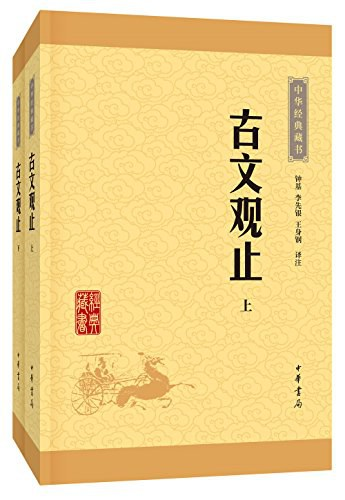

# 中华经典藏书 - 古文观止

- 作者：吴调侯 / 吴楚材
- 出版社：中华书局
- 出版时间：2016-01
- ISBN：978-7-101-11362-4
- 豆瓣：https://book.douban.com/subject/26966280
- 封面：

## 郑伯克段于鄢

### 原文

初，郑武公娶于申[1](#f-1)，曰武姜[2](#f-2)，生庄公及共叔段[3](#f-3)。庄公寤生[4](#f-4)，惊姜氏，故名曰寤生，遂恶之。爱共叔段，欲立之，亟请于武公[5](#f-5)，公弗许。

### 注释

<b id="f-1">[[1]](#a-1)</b> **申**：国名，姜姓，国都在今河南南阳。

<b id="f-2">[[2]](#a-2)</b> **武姜**：郑武公的正妻，以其夫谥号“武”与娘家姓“姜”合称为“武姜”。

<b id="f-3">[[3]](#a-3)</b> **共叔段**：“共”为地名，在今河南辉县；“叔”为排行。段后来逃亡至共地，故称“共叔段”。

<b id="f-4">[[4]](#a-4)</b> **寤生**（wù shēng）：即“逆生”，分娩时胎儿脚先出生，分娩困难。

<b id="f-5">[[5]](#a-5)</b> **亟**（qì）：屡次。

### 译文

起初，郑武公娶了申国的女子为妻，她后来被称为“武姜”，为郑武公生下庄公和共叔段。庄公出生时脚先出来，生产十分艰难，姜氏因此受惊，便给他取名为“寤生”，从此便讨厌他。她偏爱共叔段，想立段为世子，多次请求郑武公，但武公始终不肯答应。

### 原文

及庄公即位，为之请制[6](#f-6)。公曰：“制，岩邑也[7](#f-7)，虢叔死焉[8](#f-8)。他邑唯命。”请京[9](#f-9)，使居之，谓之京城大叔[10](#f-10)。祭仲曰[11](#f-11)：“都城过百雉[12](#f-12)，国之害也。先王之制：大都不过参国之一[13](#f-13)，中五之一，小九之一。今京不度[14](#f-14)，非制也，君将不堪。”公曰：“姜氏欲之，焉辟害[15](#f-15)？”对曰：“姜氏何厌之有！不如早为之所，无使滋蔓，蔓，难图也。蔓草犹不可除，况君之宠弟乎！”公曰：“多行不义必自毙[16](#f-16)。子姑待之。”

### 注释

<b id="f-6">[[6]](#a-6)</b> 请制：请求以制为领地。制，为郑国的一个地方，在今河南荥阳西北，又叫“虎牢关”。 

<b id="f-7">[[7]](#a-7)</b> 岩邑：险要之处。 

<b id="f-8">[[8]](#a-8)</b> 虢（ɡuó）叔：东虢的国君。虢，分东、西、北三国，均为姬姓国。东虢国都在今河南荥阳。 

<b id="f-9">[[9]](#a-9)</b> 京：郑国地名。在今河南荥阳东南。 

<b id="f-10">[[10]](#a-10)</b> 大叔：太叔。大，同“太”。 

<b id="f-11">[[11]](#a-11)</b> 祭（zhài）仲：即祭足，郑国大夫。 

<b id="f-12">[[12]](#a-12)</b> 雉：古代城墙的丈量单位，长三丈高一丈为一雉。 

<b id="f-13">[[13]](#a-13)</b> 参国之一：国都城墙的三分之一。参，通“三”。 

<b id="f-14">[[14]](#a-14)</b> 不度：不合法度。 

<b id="f-15">[[15]](#a-15)</b> 辟（bì）害：躲避祸害。辟，退避，躲避。

<b id="f-16">[[16]](#a-16)</b> 毙：仆倒，倒下去。

### 译文

等庄公继承君位，武姜替段请求以制邑为领地。庄公说：“制是险要之地，虢叔曾死在那里。别的地方听您吩咐。”便请求京邑，庄公叫段住在京邑，段被称为“京城太叔”。祭仲说：“都市城墙边长超过三百丈，就是国家祸害。先王的制度：大都市城墙，长不超过国都的三分之一；中等城市城墙，长不超过国都的五分之一；小城市城墙，长不超过国都的九分之一。现在京邑城太大，不合制度，您会受不了的。”庄公说：“姜氏要这样，哪里能躲避祸害？”祭仲回答说：“姜氏哪里会满足！不如早作打算，不要使他再发展；再发展，就难对付了。蔓延的草还难以清除，何况是您被宠爱的胞弟呢！”庄公说：“他做不合理的事多了，一定会自取灭亡。你姑且等着吧！”

### 原文

既而大叔命西鄙、北鄙贰于己[17](#f-17)。公子吕曰[18](#f-18)：“国不堪贰，君将若之何？欲与大叔，臣请事之，若弗与，则请除之，无生民心[19](#f-19)。”公曰：“无庸，将自及。”大叔又收贰以为己邑[20](#f-20)，至于廪延[21](#f-21)。子封曰[22](#f-22)：“可矣。厚将得众。”公曰：“不义不昵[23](#f-23)，厚将崩[24](#f-24)。”

### 注释

<b id="f-17">[[17]](#a-17)</b> 既而：不久。鄙：边境城邑。贰于己：指一方面听命于庄公，一方面听命于自己。 

<b id="f-18">[[18]](#a-18)</b> 公子吕：字子封，郑国大夫。 

<b id="f-19">[[19]](#a-19)</b> 生民心：使臣民产生别的想法，即生二心。 

<b id="f-20">[[20]](#a-20)</b> 贰：指前文既听命于庄公又听命于自己的西部和北部边邑。 

<b id="f-21">[[21]](#a-21)</b> 廪（lǐn）延：郑国的一个地方，在今河南延津北。 

<b id="f-22">[[22]](#a-22)</b> 子封：郑大夫，即前文的公子吕。 

<b id="f-23">[[23]](#a-23)</b> 昵：亲近。这里是“拥护”、“拥戴”的意思。 

<b id="f-24">[[24]](#a-24)</b> 崩：原指山陵崩塌，这里指垮台、倒台。

### 译文

不久太叔命令西部和北部边邑一方面听从庄公，一方面听从自己。公子吕说：“国家不能忍受这样两方面听命，您打算怎么办？想把君位让给太叔，我请求索性去侍奉他；假若不让位，便请除掉他，不要使臣民有别的想法。”庄公说：“用不着。他会自己走向灭亡。”太叔又把两面听命的西部与北部边邑全归属自己，还延伸到廪延。公子吕说：“行了。他势力雄厚，会得到更多拥戴者。”庄公说：“没有正义，得不到拥护，势力雄厚，反而会垮台。”

### 原文

大叔完聚[25](#f-25)，缮甲兵[26](#f-26)，具卒乘[27](#f-27)，将袭郑，夫人将启之[28](#f-28)。公闻其期，曰：“可矣！”命子封帅车二百乘以伐京[29](#f-29)。京叛大叔段。段入于鄢[30](#f-30)。公伐诸鄢。五月辛丑，大叔出奔共[31](#f-31)。

### 注释

<b id="f-25">[[25]](#a-25)</b> 完：修葺。这里指巩固城郭。聚：聚积。这里指聚积粮草。 

<b id="f-26">[[26]](#a-26)</b> 缮甲兵：修治兵器。 

<b id="f-27">[[27]](#a-27)</b> 具卒乘（shèng）：补充兵员。具，准备。卒，兵士。乘，战车。这里代指乘车的士卒。 

<b id="f-28">[[28]](#a-28)</b> 启之：开启城门。 

<b id="f-29">[[29]](#a-29)</b> 乘：战车。按春秋时代的编制，一乘战车有甲士三人，步卒七十二人，二百乘共有甲士六百人，步兵一万四千四百人。 

<b id="f-30">[[30]](#a-30)</b> 鄢（yān）：地名。在今河南鄢陵西北。 

<b id="f-31">[[31]](#a-31)</b> 出奔共：逃亡到共。出奔，逃亡。

### 译文

太叔牢筑城郭，聚积粮草，修补武器，补充士卒，打算偷袭庄公，姜氏准备开城门接应他。庄公得知太叔举兵日期，说：“行了！”命令公子吕率领二百乘兵车讨伐京邑。京邑人反叛太叔。太叔逃到鄢邑。庄公又讨伐鄢邑。五月二十三日，太叔逃到共邑。

### 原文

书曰[32](#f-32)：“郑伯克段于鄢。”段不弟[33](#f-33)，故不言“弟”。如二君，故曰“克”。称“郑伯”，讥失教也，谓之郑志。不言“出奔”，难之也[34](#f-34)。

### 注释

<b id="f-32">[[32]](#a-32)</b> 书：指《春秋》的记载。 

<b id="f-33">[[33]](#a-33)</b> 弟：通“悌”，敬顺兄长。“郑伯克段于鄢”是《春秋》的原话，以下逐字解释这句话。 

<b id="f-34">[[34]](#a-34)</b> 难之：以之为难，这是形容词的意动用法。“之”指“大叔出奔共”这件事。

### 译文

《春秋》写道：“郑伯克段于鄢。”段不敬兄长，所以不用“弟”字。交战双方好像两个国君，所以用“克”字。称庄公为“郑伯”，是讥讽他对胞弟有失教导，也表明这是庄公的本意。不写“太叔出奔”，是难于下笔的缘故。

### 原文

遂置姜氏于城颍而誓之曰[35](#f-35)：“不及黄泉，无相见也[36](#f-36)！”既而悔之。颍考叔为颍谷封人[37](#f-37)，闻之，有献于公。公赐之食，食舍肉，公问之，对曰：“小人有母，皆尝小人之食矣，未尝君之羹[38](#f-38)，请以遗之[39](#f-39)。”公曰：“尔有母遗，繄我独无[40](#f-40)！”颍考叔曰：“敢问何谓也？”公语之故，且告之悔。对曰：“君何患焉！若阙地及泉[41](#f-41)，隧而相见，其谁曰不然？”公从之。公入而赋：“大隧之中，其乐也融融[42](#f-42)。”姜出而赋：“大隧之外，其乐也泄泄[43](#f-43)。”遂为母子如初。

### 注释

<b id="f-35">[[35]](#a-35)</b> 城颍（yǐnɡ）：地名。在今河南临颍西北。 

<b id="f-36">[[36]](#a-36)</b> “不及”二句：意思是说，不死不见面。黄泉，地下的泉水，多指死后埋葬的地方。 

<b id="f-37">[[37]](#a-37)</b> 颍考叔：郑大夫。颍谷：地名。在今河南登封西，是郑的边疆城邑。封人：镇守边疆的地方官。 

<b id="f-38">[[38]](#a-38)</b> 羹：古代指带汁的肉食。 

<b id="f-39">[[39]](#a-39)</b> 遗（wèi）：赠给。 

<b id="f-40">[[40]](#a-40)</b> 繄（yī）：句首语气词。 

<b id="f-41">[[41]](#a-41)</b> 阙（jué）地及泉：掘地掘到泉水。阙，通“掘”，挖。 

<b id="f-42">[[42]](#a-42)</b> 融融：形容快乐、和睦的样子。 

<b id="f-43">[[43]](#a-43)</b> 泄泄（yì）：形容快乐自得的样子。

### 译文

庄公把姜氏安置在城颍，对她发誓说：“不到黄泉，不再相见！”不久又后悔了。颍考叔是镇守边境颍谷的官员，听到这事，便向庄公献礼。庄公宴请他。吃饭时，颍考叔把肉留下放在一边，庄公问他，他说：“我有老母亲，我的食物她都尝遍了，却没尝过您的肉羹，我想请她尝尝。”庄公说：“你有母亲可以敬奉，唉！我却没有。”颍考叔说：“请问这是什么意思？”庄公把事情始末告诉了他，并且说明了自己的悔意。颍考叔回答说：“您有什么可忧愁的！假若挖地一直见到泉水，就在所挖的隧道里相见，谁能说不对？”庄公按他的办法做了。庄公进入隧道，唱：“身在隧道中，乐如乳水融。”姜氏从隧道出，唱：“身在隧道外，精神真爽快。”于是母子关系恢复，和原来一样。

## 周郑交质隐公三年

### 原文

郑武公、庄公为平王卿士[47](#f-47)，王贰于虢[48](#f-48)，郑伯怨王。王曰：“无之。”故周、郑交质[49](#f-49)，王子狐为质于郑[50](#f-50)，郑公子忽为质于周[51](#f-51)。王崩，周人将畀虢公政[52](#f-52)。四月，郑祭足帅师取温之麦[53](#f-53)。秋，又取成周之禾[54](#f-54)。周、郑交恶[55](#f-55)。

### 注释

- <b id="f-47">[[47]](#a-47)</b> 平王卿士：周平王的执政大臣。
- <b id="f-48">[[48]](#a-48)</b> 王贰于虢（ɡuó）：这里指周平王不想让郑庄公独大，于是分权给虢公，以保持周王室的权力平衡。贰，两属。虢，指西虢公，姬姓。西虢都城在今河南三门峡。
- <b id="f-49">[[49]](#a-49)</b> 交质：互相交换人质。
- <b id="f-50">[[50]](#a-50)</b> 王子狐：周平王的儿子。
- <b id="f-51">[[51]](#a-51)</b> 公子忽：郑庄公的儿子。
- <b id="f-52">[[52]](#a-52)</b> 畀（bì）：给予。
- <b id="f-53">[[53]](#a-53)</b> 祭（zhài）足：郑大夫，字仲，故又称“祭仲”。温：周王室的属地，在今河南温县。
- <b id="f-54">[[54]](#a-54)</b> 成周：周之东都，故城在今河南洛阳东郊。
- <b id="f-55">[[55]](#a-55)</b> 交恶（wù）：互相怨恨。这里指周、郑关系恶化。

### 译文

郑武公、郑庄公父子先后任周平王执政大臣，平王又兼用虢公，庄公埋怨平王。平王说：“没有这事。”因此周王朝和郑国交换人质：周平王的儿子王子狐去郑国为人质，郑庄公的儿子公子忽往周王朝为人质。平王去世，周王朝打算把国政全部交给虢公。四月，郑国的祭足领兵割取了周畿内小国温地的麦子；秋天，又割取了成周的谷子。周王朝和郑国关系恶化。

### 原文

君子曰：“信不由中[56](#f-56)，质无益也。明恕而行[57](#f-57)，要之以礼[58](#f-58)，虽无有质，谁能间之？苟有明信，涧、溪、沼、沚之毛[59](#f-59)，蘋、蘩、蕰、藻之菜[60](#f-60)，筐、筥、锜、釜之器[61](#f-61)，潢污、行潦之水[62](#f-62)，可荐于鬼神，可羞于王公[63](#f-63)，而况君子结二国之信，行之以礼，又焉用质？《风》有《采蘩》、《采蘋》[64](#f-64)，《雅》有《行苇》、《泂酌》[65](#f-65)，昭忠信也[66](#f-66)。”

### 注释

- <b id="f-56">[[56]](#a-56)</b> 中：内心。
- <b id="f-57">[[57]](#a-57)</b> 明恕：明察宽大。恕，推己及人，宽宥，谅解。
- <b id="f-58">[[58]](#a-58)</b> 要（yāo）：约束。
- <b id="f-59">[[59]](#a-59)</b> 沼：池塘。沚：水中的小块陆地。毛：本指草，这里泛指植物。
- <b id="f-60">[[60]](#a-60)</b> 蘋（pín）：四叶菜，一种生于浅水中的草本植物。蘩：指白蒿。蕰（wēn）：是一种水草。藻：是一种聚生的藻类。
- <b id="f-61">[[61]](#a-61)</b> 筐：方形竹制容器。筥（jǔ）：圆形竹制容器。锜（qí）：有足的烹饪器。釜（fǔ）：无足的烹饪器。
- <b id="f-62">[[62]](#a-62)</b> 潢（huánɡ）污：聚积不流之水。行潦（xínɡlǎo）：沟中的水。
- <b id="f-63">[[63]](#a-63)</b> 羞：进献食物。
- <b id="f-64">[[64]](#a-64)</b> 《风》：指《诗经·国风》。《采蘩》、《采蘋》：是《召南》中的两篇，描写了妇女采集供祭祀用的野菜的场景。
- <b id="f-65">[[65]](#a-65)</b> 《雅》：指《诗经·大雅》。《行苇》、《泂（jiǒnɡ）酌》：是《生民之什》中的两篇，前一篇是祝酒词，颂扬敬老尊贵，和睦相亲；后一篇表明要真诚地对待民众。
- <b id="f-66">[[66]](#a-66)</b> 昭：表明。

### 译文

君子说：“诚信不发自内心，交换人质也没有益处。设身处地互相谅解而后行事，又据礼制加以约束，即使没有人质，谁又能离间？假若互信互谅，那山沟池塘的野草，四叶菜、白蒿、水草以及聚集水面的藻类等野菜，和方筐、圆筐、有足、无足的烹饪器等器具，甚至路上沟里大大小小的积水，都可以敬献鬼神，贡奉王公；何况君子建立两国的信赖，按照礼仪行事，又何必用人质？《诗经·国风》有《采蘩》、《采蘋》，《大雅》有《行苇》《泂酌》，这四篇都是表明忠实和信赖的道理的。”
