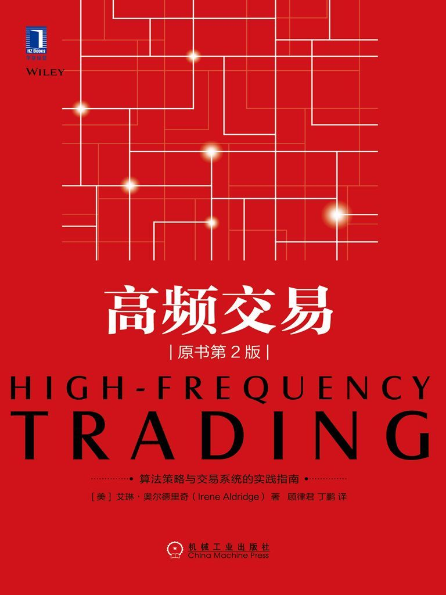
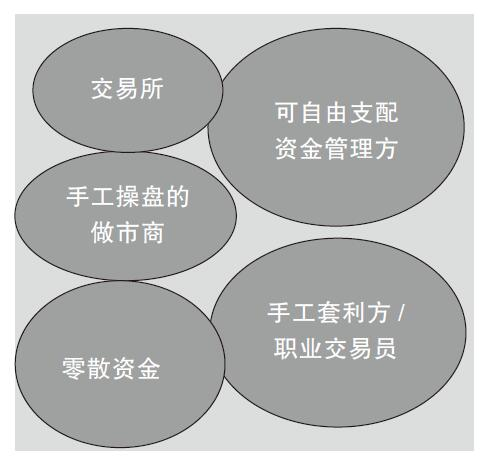
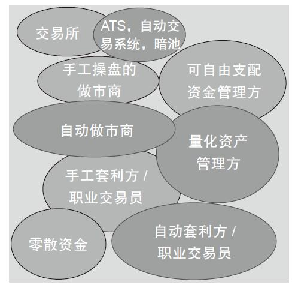

# 高频交易

- 作者：艾琳·奥尔德里奇（Irene Aldridge）
- 译者: 顾律君 / 丁鹏
- 出版社：机械工业出版社
- 出版时间：2018-01
- ISBN：978-7-111-58630-2
- 豆瓣：https://book.douban.com/subject/27667621
- 封面：

# 译者序

如果说量化投资是投资领域的王冠，那么高频交易就是这顶王冠上的明珠。

高频交易最大的特点就是收益非常高，而风险却非常小，当然作为代价，资金容量不会太大，所以这种策略一般都不会对外募资扩大规模。

交易成本也是高频交易非常敏感的一个参数，除了佣金之外，买卖价差、滑点、延迟成本、机会成本、冲击成本，都是吞噬高频交易利润的因素，对于这些交易成本的精确估算对高频交易策略的最终盈利有着非常重要的作用。

高频交易的绩效评估与传统的策略差不多，主要有投资收益、波动性、回撤、胜率、Alpha和Beta等。但是，对于高频交易这种资金容量不大的策略来说，市场深度和资金容量是一个关键因素。

为了提高资金利用率，有必要经常杠杆化，以及对竞争对手进行分析等。

统计套利就是利用具有相关性的不同资产之间的价差关系，在价差突破正常区间的时候进行双向开仓，回归后双向平仓的过程，包括跨期、跨品种、跨市场等多种统计套利模式；方向性策略是另外一类主流的高频交易策略，比如可以有传统的趋势追踪，也可以有事件驱动类。新闻量化是这方面的重要应用，当重要的新闻出现时，市场往往有剧烈的波动，这就给了高频交易很好的机会；自动化做市策略是高频交易中的重头戏，其主要原理是利用不同交易委托单的时间差来赚钱。

实际交易中，还有一个重要的方面，就是冲击成本的最小化，这涉及一些买卖订单算法、执行成本最小化、获取最优价格、交易痕迹最少化等。

国外的市场情况和国内还有些差别，特别是国内都是自上而下设计的市场结构，使得高频交易的市场空间远远不如国外充足，所以国内的高频交易更多的是短线方向性交易，这也是国内很难诞生巨头型高频交易投资公司的原因。

# 第1章 现代市场不同于过去市场

高频交易（High-frequency trading，HFT）

硬件价格的下滑导致了电脑技术辅助型交易的性价比提高，对软件的投资使得交易平台更易于使用也更强大。此外，通过计算机代码，实现了更低的信息传输和数据输入错误率、更高的订单执行可靠性，以及业务的连续性，这也提供了一个金融机构越来越依赖其技术系统的商业案例佐证。

制度规则的日益复杂同样要求更高的订单申报能力，如果没有稳定的平台，费用会相当昂贵。更低的成本也进一步压缩了利润空间，这给传统的全方位服务模式带来了压力。

图1-1和图1-2显示了金融服务在20世纪70年代以及现在的概况。

图1-1 20世纪70年代的金融市场，在金融电子化之前

在20世纪70年代之前，市场的参与者为组织和个人，他们被认为是“传统”参与者。

对投资管理方或“买方”而言，市场参与方包括：

- 委托资产管理者，包括养老基金、共同基金和对冲基金。
- 零散资金，包括个人“家庭”投资者，以及其他小资金。
- 手工操盘的投机者，他们为自己的个人账户或者他们的银行账户进行自营盘操作。

在市场中为交易提供便利、中间商或“卖方”包括：

- 手工操盘的做市商（其代表为股票经纪人），他们承担短线库存风险，为买方提供报价，通常促成买方交易后获得费用。
- 每个资产类别的非营利交易所，都希望遏制交易所会员的盲目投机，降低投资者的交易成本。

高度的手工操盘导致了金融行业劳动力的密集，因而20世纪70年代金融行业的特点为高交易成本，低证券周转率，手工处理单据使得订单出错率高。

由于交易商主要依靠他们的经验和直觉，而不是在市场上科学地进行“下注”，因而交易风险相对高。

20世纪70年代的市场利润也很高，经纪人可以以佣金的形式，得到“投资战利品”的很大一部分收益，以及后来被人们称为“有钱有势的人”（fatcat）奖金，它们的数量可以有数千万美元。

图1-2 当今的金融市场

当今的市场，新进入者在市场竞争中成功了，他们用精湛的和先进的技术构建出精确的投资模型，并在这个过程中改变了市场：

- 量化投资经理，比如共同基金和对冲基金，精准地使用经济学、金融学以及最先进的数学工具，日益精确地预测证券价格，提高其投资盈利的能力
- 自动做市商，比如股票经纪商和对冲基金，利用最新的技术、市场微观结构的研究成果以及高频交易，提供低成本的交易，进而将市场份额从传统经纪商那里抢夺过来。
- 自动化套利者，比如利用统计套利的对冲基金和自营盘交易商，利用量化算法交易，包括高频交易，来获取短线交易的利润。
- 多种可供选择的交易场所，比如新的交易场所和暗池交易，如雨后春笋般冒出来，解决了市场需求，即高质量下价格适中的金融服务。

这些创新使得市场的关键特征发生了变化，这些变化大部分都向好：

- 市场参与者极大地享受到民主权利，由于低成本技术的普及，任何人都可以在市场中交易、报价，以前这些权利专属于经纪商组成的“关系俱乐部”。
- 交易成本暴跌，这使得投资者能够把资金留在自己的口袋里。
- 自动交易，自主下单，并且出错率低。

在20世纪70年代的市场中，通常有如下交易过程：

1. 经纪商会一次性告知买方客户的交易思路，这些思路通过打无数次电话来传达，并建立在经纪商实时观察市场的独特能力的基础之上，而且往往以“软美元”[[1]](#f1-1)的方式支付。也就是说，如果客户决定用这种思路进行交易，他们通常会通过建立该思路的经纪人来交易，客户会为这种交易思路支付更高的佣金。

<b id="f1-1">[[1]](#a1-1)</b> 软美元（softdollar）出于对监管当局所制定规则的遵守和防止价格恶性竞争，经纪商通常都会保持交易佣金水平，但是为了吸引客户进行交易，往往私下里为客户提供一定的优惠，如提供研究报告及其他优惠等。这种优惠一般采取非现金形式，因此被称为“软美元”。