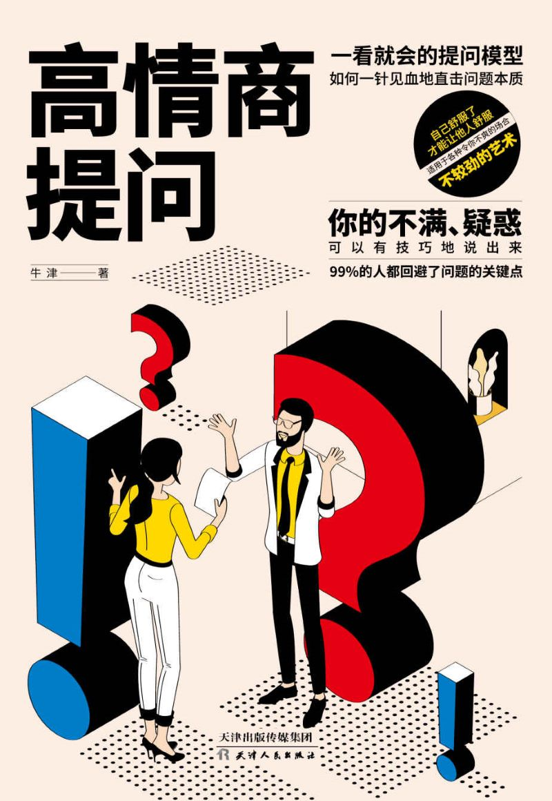

# 高情商提问

- 作者：牛津
- 出版社：天津人民出版社
- 出版时间：2020-11
- ISBN：978-7-201-16555-4
- 豆瓣：https://book.douban.com/subject/35261298
- 封面：

# 第一章 营养鸡汤：敢提要求就可以得到更多

## 为什么不提要求？是否拒绝是他人的事

提出要求，你会得到三种可能的结果：第一，对方很爽快地答应了你的要求；第二，你的要求被对方明确地拒绝；第三，对方很犹豫，不知道是同意还是拒绝你的要求。

## 敢提要求，你会得到你想要的

不可否认，我们的内心深处都潜藏着一个渴望被挖掘的愿望，但是每个人对待幸运之球的态度不一样，有的人从来不主动争取，只等着幸运之球砸中自己；而有的人则能主动张开怀抱去争得更多的可能，这样的人往往会得到更多的好运球——不是因为运气好，而是因为他们足够主动。

你不主动争取，本该属于你的东西不会自己跑来；而主动争取，除了能得到属于你的东西之外，还可能有意想不到的惊喜。总之，如果你能以敢于提要求的心态和行为准则生活的话，那么就更有机会得到自己想要的东西。

## 给自己一个大胆提要求的理由

神经科学和心理学研究证明，当我们求助或是提要求时，往往会涉及一系列社会威胁，如不确定性、被拒绝的可能、让出主动权、丢面子等，这些都会刺激我们大脑中感受生理疼痛的区域。所以从这个角度讲，我们并不愿意向他人提出要求。

然而，无论是在日常生活还是在职场中，不求助他人或者不向他人提要求是根本不可能的，比如在职场中，同事之间相互提供的帮助，75%~90%来自直接请求和大胆提要求。

## 那些被拒绝“100次”的人都成功了

我们往往因为害怕被拒绝而不敢提要求，其实这种害怕很多时候并不是真实存在的，而是我们自己想象出来的。我们经常被自己制造出来的尴尬或是恐惧吓跑，而事实上，如果我们敢于提要求，虽然也会遭到拒绝，但是更大的可能性是会被接受，并且当我们采用更灵活的方式去争取时，争取到的概率会大大提高。

# 第二章 心理训练：排除不敢提要求的心理障碍

## 被拒绝并不代表你不好

不敢提要求最直接的原因是害怕被拒绝，但是你知道吗？被拒绝并不代表你不好。当我们表达需求时，总会有人接受，也会有人反对；当我们提出某个要求时，别人也没有理由完全围着我们转，给予我们肯定，因为我们并不是这个世界的中心。我们需要明白的是，被别人拒绝和我们本身好不好并没有多大关系。

## 丢掉提要求时的不好意思心理

1. 心理激励法。在提要求时先这么想：你又不是别人，怎么知道别人的想法呢？你害怕的某些想法其实并不是别人对你的真实看法，而是你对自己的看法，只不过通过想象由别人表达出来
2. 好处诱导法。用提要求得到的好处诱导自己，激发提要求的动力。
3. 损失警醒法。估算一下不提要求带来的损失，以此来激励自己。
4. A、B替换法。把A当作B去看待，以此减少提要求时的心理排斥。

## 懂得“麻烦别人”才能担更多的事

总是默默一个人扛起很多事，却不敢向他人提要求，虽然工作很忙、很疲惫，却不敢向领导要求支持，总觉得这样就能担起责任，把事情做得更好，可结果往往弄得一团糟……没错，这就是真实的你——那个不好意思麻烦别人，给自己带来无穷烦恼的你。

## 不敢直接提要求？其实是怕受到伤害

相信不少人有类似的习惯，为了顾及别人的感受，或是避免让人尴尬，遵循所谓的“己所不欲勿施于人”的原则，选择一些拐弯抹角的套路，让别人去领会自己的意图。说实话，这样真的很累，而且有时候拐弯抹角地提要求并没有什么效果，还不如直接坦率来得真诚。

# 第三章 打足底气：做好5项准备工作有备无患

“工欲善其事，必先利其器。”在提出要求之前，我们有必要进行适当的准备，给自己打足底气，让自己变得自信、勇敢起来。

## 做好心理准备：消除紧张、焦虑情绪

## 提要求前认清自己能付出多少

在提要求时，我们往往考虑更多的是自己的要求能不能被接受，却很少去考虑对方能得到什么好处，殊不知这也是被拒绝的主要原因，因为很少有人会在那些得不到利益的要求上费功夫。

## 知己知彼：了解对方是什么样的人

在提要求前先做一点功课，了解一下对方是什么样的人，是内向还是外向，是喜欢直截了当还是喜欢委婉含蓄，这样不仅可以帮助我们做到尊重各种性格的人，还能提高提要求的成功率。

一般来说，根据所求对象的人格特质进行划分，有以下四类：

1. 决策型
2. 权衡型
3. 吸引型
4. 友好型

## 明确自己的目标和期望

在提要求之前一定要先问自己：我想沟通什么事？我想达成什么目标？我怎样才能达到目标？在整个沟通的过程中，还要明确自己的目标和期望，然后坚持下去。

# 第四章 投其所好：用对方喜欢的方式提要求

同样一个要求，张三提被接受，李四提就被拒绝，不是要求有问题，而是提要求的方式不对。如果在提要求时保持尊重的态度，然后用对方喜欢的方式去交流，给出提要求的理由，那么除非你的要求荒诞不经，否则对方都会认真考虑的。

## 尊重人的态度是提要求的前提

罗伯特·西奥迪尼在他的心理学著作《影响力》中有这样一句话：“人们经常会礼尚往来，如果对方以礼相待，你也会以礼待之。”

## 提要求时要给对方留下好的第一印象

人与人初次见面，留给对方的第一印象很重要。在社会心理学中，有一则效应被称为“首因效应”，它说的是在与他人交往时，人们总是比较重视最初接触到的信息，并很容易以此为凭据，对他人做出评价和判断，这就是我们常说的“第一印象效应”。留给对方的第一印象好，往往能为以后的进一步交往与合作打下良好的基础；而如果第一印象很糟糕，往往会对之后的交往、合作产生不好的影响

## 尽量用请求而不是命令

每个人都有自己的独立意识，没有人喜欢被命令，一个人听到命令时只有两种选择：服从或是反抗。在提要求时，命令式的语言在对方看来无疑是一种强迫，没有人愿意被强迫，所以对方多半不会满足我们的要求，反抗也是必然的。

## 提要求时要遵循具体原则

在提要求时我们首先要清楚地告诉对方希望他们做什么。否则，很容易让对方感到困惑，而且模棱两可的说话方式很容易引起对方的反感。

## 晓之以理：给出理由让他人更信服 

很多人在提要求时提的都是不完善的要求，即不解释为什么提要求，而事实上说明要求背后的原因是很重要的，因为如此一来，对方若要拒绝你，就需要反驳你。而有时候，只要你的理由足够充分，别人根本懒得反驳，便会直接答应你的要求。

# 第五章 沉着应变：避免提要求后陷入僵局

有时候很奇怪，在我们看来是简单的要求，而在别人看来可能是过分的。那么问题就出现了：由于思维方式的差异性和所处环境的不同，在提出要求后，很可能会陷入僵局，比如把气氛弄得很尴尬。这就要求我们灵活调整自己提出请求的策略。

## 发现对方不友好？不妨表现得友善一点

冷冰冰的话语或者过于理性刻板的交流会使人产生错觉，就好像到了公务机构一样，让人感到拘束或是不自在。而如果热情一点，友善一些，就会给人温暖和放松的感觉。在提要求时，为了避免产生沟通障碍，一定要营造一个友善的氛围，尤其是在发现对方表现得不怎么友好的时候。

## 间接提要求，不引起别人的反感

1. 试试商量的语气
2. 借用缓冲词语
3. 使用激将法
4. 自责式要求
5. 体谅式要求

## ASK三步法：控制局面的交流方式

提要求毕竟是一件要别人怎么样的事儿，我要求你怎么样，实则是一种驱使。有时候为了达成目标，我们会用委婉的言辞让这种意图看起来不那么明显，而大多时候，这种驱使行为会影响对方的舒适敏感区，甚至会引起对方做出一些本能的情绪反应，而我们自身也会变得非常情绪化。如果遇到这种情况，我们该怎么控制呢？

第一步：A（Aware），即了解当前的状况。在提要求后，不要傻傻地站着什么也不做，而是应该分析一下当前的情况，问自己一些问题，比如对方的表情和动作代表什么意思，自己的反应又是什么样子的。

第二步：S（Seek clarity），即搞清楚对方在说什么。请认真听对方的话，弄清楚对方的回答究竟是什么意思，如果是模棱两可的回答或是没有听清楚，可以再问一遍。

第三步：K（Know your next best request），即想好接下来怎么做。如果你感觉到了自己紧张，为避免接下来的对话陷入僵局，你可以试着通过数呼气吸气的次数来帮助自己放慢呼吸频率；如果感觉自己被拒绝得很委屈，眼眶里有泪水打转，那么就要试着转移一下注意力，比如看看天花板或是周围的墙壁、桌子。

## 适当沉默：给对方思考的时间

不知道你有没有听过这样一句话：“当一个请求被抛出后，谁先开口谁就输了。”怎么理解呢？那些急于开口的人总是急于得到对方的回复，因为他们往往有更大的需求，所以才会着急，沉不住气，甚至把要求抛出去后还不断提醒对方，喋喋不休，其实这样不仅会暴露自己的劣势地位，还会引起别人的反感。而如果在沟通中适当沉默，不仅可以给对方留出思考的时间，还能取得意想不到的效果。

美国心理学家古德曼曾经提出“没有沉默就没有沟通”的说法，这一论点看似违反常理，但从心理学的角度来讲它解释了沉默在沟通中的重要意义。

