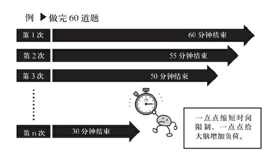
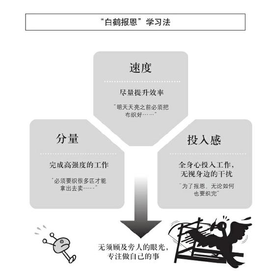
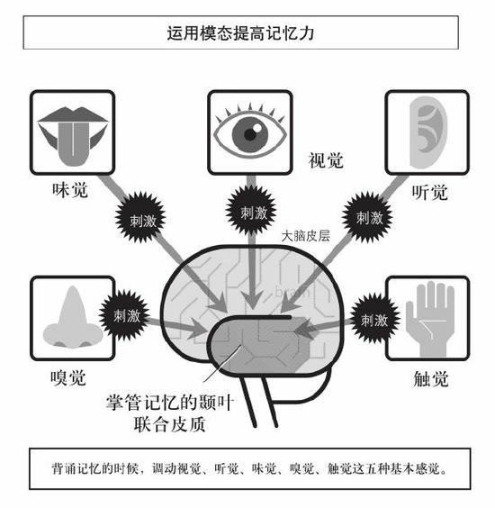
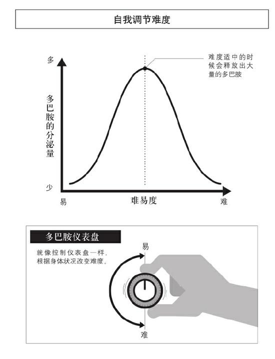
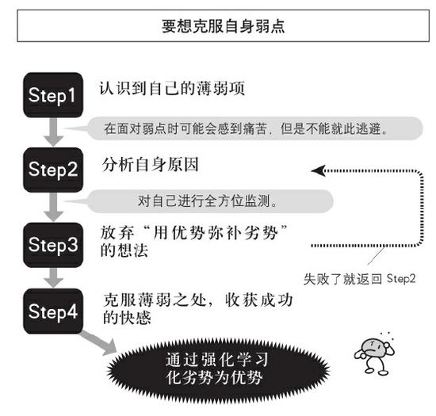

# 逻辑思考的100个关键

- 作者：茂木健一郎
- 出版社：中国友谊出版公司
- 出版时间：2021-01
- ISBN：978-7-5057-5057-9
- 豆瓣：https://book.douban.com/subject/35276155
- 封面：

# 第一章 效率与灵感

## Point/01 只“输入”不“输出”，大脑很容易中途“放弃”

“感觉区”是指通过视觉、听觉等五种感觉来对接收到的信息进行处理和识别的区域；“运动区”是指控制肢体运动的区域。

简单来说，大脑主要通过感觉区“输入”信息，并通过运动区“输出”信息。在此，“输入”指的是“理解”，“输出”指的是“实践”。

## Point/02 思维训练的关键，在于反复“输出”

仅仅是观看，是无法锻炼运动区的学习回路的。事实上活动身体才能活动大脑。

感觉区和运动区的学习回路的关系，就像车的两个轮子，必须时刻保持平衡。

## Point/03 增加时间压力，思维和行动会变得敏捷

敦促自己强行输出，对保持感觉区和运动区的平衡也很有帮助。

在给工作施加时间压力的时候，不要同时做好几件事，把所有的精力都集中在1~2个小时之内需要完成的同一件事上是很重要的。我把这种方法叫作“1小时大脑准备法”。

这个方法与大脑的“工作记忆”（working memory）功能有关。“工作记忆”由前额叶为中心的一部分神经网络控制，对信息进行加工和处理后作为长时记忆暂时贮存。人们可以对工作记忆进行任务操作和管理。工作记忆一个重要的特点，是它能够为处理复杂信息进行准备工作。

由于工作记忆只能针对一件事进行准备，一旦被打断，记忆和信息就会快速瓦解，需要重新召集起来，等到“全体集合”为止。因此，时间压力最好控制在1~2个小时。如果超出了这个范围，注意力就容易分散甚至被迫中断。

## Point/04 让大脑保持高速运转的秘诀，在于丢掉琐碎信息

当场约好时间，当场记下来。

## Point/05 任务清单不必文字化，给大脑灵活发挥的空间

文字化的任务清单真正执行起来也十分困难。因为无论写得有多详细，事实上还需要考虑任务冲突、信息搜集、想法提出、商务洽谈、资料研读、数据创建等复杂的因素，所以实际的工作量相当庞大，真正要处理起来并非那么容易。尤其是当今社会变化之快，经常需要及时调整任务清单，所以即便写出来也没有任何意义。

## Point/06 大脑记不住东西？可能是没有记住的必要

人类的大脑有一个特点，笔记记得越好，忘得越快。所谓的“谷歌效应”（Google effect），其实就是指人们总想着“如果有不懂的、想不到的地方，用谷歌搜索一下就知道了”。

想不起来的事忘了也没关系。

## Point/07 如何调动大脑的“最佳状态”

要想提高自身能力，就要先“了解自己的模式”，我们也同样可以将其应用到自己的日常生活之中。比如，找到能够让自己充分发挥实力的“状态最佳的时间段”也是一种办法。

## Point/08 灵感产生的两个必要条件——记忆与欲望

发挥创造性的瞬间，其实是记忆机制在起作用。

对于发挥创造力来说，第二重要的是“欲望”。

在大脑中，额叶负责掌控欲望和价值判断。当需要创意的时候，额叶会先向颞叶发送一个请求：“我想做这件事，有没有什么经验可以借鉴？”颞叶为了匹配最符合的记忆，会不停地变换组合和连接方式，反复试错。接着从各类记忆中挑选出最满意的，“这个怎么样？”“这个呢？”不断地发送给额叶。

## Point/09 如何源源不断地产生灵感？

创意是由颞叶制造的“经验”和额叶发送的“欲望”共同协作而产生的。因此，颞叶的经验积累得越丰富的人，越能够创造出新事物，额叶的欲望越强烈的人，也越能够迸发出创意灵感。

一瞬间的灵光乍现，单凭经验和欲望是无法实现的。如艾萨克·牛顿看到苹果从树上落下来时，忽然之间有了灵感，发现了万有引力；阿基米德跨进浴缸洗澡时，看到浴缸里的水向外溢的一刹那，想到了浮力定律。

为了获得灵感，日常的准备很重要。这里所说的“准备”大致分为两
个部分，即持续“提升思考能力”和“向世界发问”。

人类的大脑中有一个专为捕捉不知何时会出现的灵感而准备的回路。即位于颞叶的前扣带回（ACC）及其附近位于额叶的外侧前额叶皮质（LPFC）所组成的回路。

前扣带回承担着一旦发现有趣事物或是新事物时便发送信号的功能。

外侧前额叶皮质被称为“大脑的司令部”，它能够将前扣带回发来的信息传递给脑内的各个神经细胞，使它们活跃起来，或者冷静下来，让大脑集中于某个特定的信息上。

那么，怎样做才能不让好不容易产生的灵感溜走呢？要有“钓鱼翁的心境”。内心处于“什么时候钓到鱼都没关系”的心态，身体上也要给予相应的配合。倘若其间发生了什么别的有趣的事，转而去关注也未尝不可。即便那件事和眼下的工作无关，也要迅速做出反应。这对于锻炼天线回路来说是很重要的。

## Point/10 大脑创造力的本质是什么？

## Point/11 为什么所想与所做会存在差异？

感觉区回路输入的信息通过运动区回路输出到大脑外部之后，会再次经由感觉区回路重新输入大脑。只有当这个循环成立时，感觉区和运动区才能真正实现共享信息。

## Point/12 单纯的记笔记不利于思考

人一旦陷入了“为了记笔记而记笔记”的误区，就会把记笔记本身当成一种任务，自然也就无法得到最终想要的结果

# 第二章 情绪与压力

## Point/13 即便情绪紧绷，及时调整就没事

经常焦虑、精神衰弱、患有抑郁的人，不仅仅是情绪低落那么简单，内分泌系统和激素分泌也会随之出现紊乱。

一个人的精神状态就像是一根弹簧。即使前一秒还处于被压缩的状态，只要下一秒能够反弹回来，大脑和身体就不会出现不适感。

## Point/14 采取主动式休闲，幸福指数会明显提高

最新的研究表明，主动出击（active）比被动接受（passive）更容易给人们带来幸福感。

什么是“主动式休闲”（active leisure）呢？比如钓鱼、郊游、爬山、打高尔夫……这些都是主动式休闲

读书这项活动，很容易被误认为是一种被动式休闲

电视和电影都属于视觉信息和听觉信息占压倒性多数的媒体。不需要我们主动思考，信息就会通过眼睛和耳朵自动流入大脑。因此，即使工作结束之后疲惫不堪地回到家，只要打开电视，不需要过脑也能正常看下去。

读书则不然。经过一天的工作，带着一身疲惫回家，看到书上密密麻麻的字，试问真的能看进去吗？光是用眼睛盯着书上的字，内容并不会自动进入我们的大脑。读书，作为一种大脑活动绝不是被动的，而是以眼睛看到的文字信息为基础，需要充分发挥想象力并加以补充的一种极其复杂的工作。

## Point/15 调节情绪的好方法——给生活加个标点

调节情绪的方法其实很简单，不用把事情搞得那么复杂。起身去趟洗手间、洗个澡、听首歌，或者在附近随便走走，做什么都行，轻轻松松就可以给大脑画一个休止符。

调节情绪就相当于是给自己加了一个标点。当然，首先我们要先学会跟自己对话。因为如果不能客观地看待自己当前所处的状态，或许也就意识不到自己需要换一个心情。

我们之所以能够调节情绪其实是大脑额叶在起作用。额叶的主要工作是改变行动模式，决定接下来的行动，并使之付诸实践。要想将这个机制融入日常生活中去，就需要进行相应的训练。

## Point/16 如何应对恐惧情绪？

恐惧反应是由位于人脑深部的杏仁核（amygdala）控制的。该区域掌管着与情绪相关的一切脑部活动，能够预先感知威胁并迅速躲避，也可以说是具有一种预知的能力。

恐惧反应最极端的例子就是“冻结行为”（freezing），身体会因为恐惧而无法动弹。研究人员经常会用小白鼠做实验，观察其冻结反应。

勇于尝试比什么都不做要好。即使失败了，那也是有意义的人生经历。失败未尝不是一次绝佳的锻炼与学习的机会。通过不断试错（try and error），我们能够学会如何去应对当下所遇到的各种问题。也就是说，如果因为对未来感到不安而畏缩不前，也就永远无法一劳永逸地解决问题。

恐惧，并不是让人束手无策的情绪。正因为有了恐惧，我们才会想要努力战胜恐惧。恐惧有时也是一种力量，我们可以借助恐惧的力量打开成功人生的通道。

## Point/17 自我暗示也能帮助调节情绪

从行为主义的观点来看，人并不是有了想法才会行动，而是行动了才会有想法。举个简单的例子，人不是因为悲伤才会流泪，而是因为流泪才会悲伤。意识到自己正在流泪，才惊觉自己有多悲伤。这就是行为主义的思维方式。

## Point/18 放空自己，大脑会进入自我整理模式

强烈推荐大家通过走路的方式来整理大脑

我们远没有想象中的那么擅长发呆。尤其是在这个讲究效率的时代，只要有时间，总想给自己找点事情做，根本闲不下来。不管是在上班还是上学的途中，人们在车上都会抽出时间读读报纸、看看手机、打打游戏，或者干脆打个盹。

在大脑的最深处有一个叫作默认模式网络（default modenetwork）的静息态脑回路，是大脑处于放空状态下才会启动的一个大脑维护机制。当大脑处于任务状态下，比如在思考、工作、与人交谈时，默认模式网络就会自动罢工。

走路的一个好处是，会让人产生一种“感觉剥夺”（sensorydeprivation）的体验

## Point/19 情绪积极的人，运气都不会太差

就算不去刻意观察，我们也可以从一个人的面部表情、说话腔调、嘴角变化中获取各种信息。这是因为位于大脑视觉区域的梭状回（fusiform gyrus），能够清晰地捕捉人类表情的细微变化。就连若有似无的微妙情感，都能够完美地传达给对方的大脑。

> 传递正能量，就会拥有更多正能量

## Point/20 召唤“意外之喜”的三种能力

能否将偶然与幸运相结合则取决于大脑的使用方法。其要点有三——“行动”“觉察”“接受”

第一是“行动”。如果只是一个人在那里酝酿想法，想要做出点成绩，干着急是不行的。要先让自己行动起来，因为真正的好运气从来就不是等来的。第二，当行动所带来的机遇来临时，“自我觉察”的能力很关键。为了能够让自己意识到这一点，必须密切注意周围的变化和自己内心的感受。如果平时不做好准备，只是坐等改变人生的“好运”从天而降，恐怕也就和“serendipity”无缘了。第三，当遇到意外状况时，不要因为和自己想象的不一样就产生抗拒心理，要学会坦然“接受”。

## Point/21 向榜样看齐，人会不知不觉变优秀

人的大脑中有一种叫作“镜像神经元”（mirror neuron）的神经细胞。这是一种位于大脑额叶和顶叶的神经细胞，在统合知觉和运动时发挥着重要的作用。当看到别人做某一动作时，镜像神经元立刻会被激活，使我们产生一种好像自己也做了同样动作的感觉。所以我们才会不由自主地复制对方的行为举止。

经常和一个举止优雅的人在一起，自己也会变得很优雅，就连举手投足间的小习惯也有可能会传染。长年相伴的夫妻、父母和孩子之所以会越来越像，也是镜像神经元在起作用。

在了解了镜像神经元的共情机制之后，我们就应该明白，如果只看到周围人的缺点，那么最终这种缺点也会传递给自己。一旦注意到别人的缺点，镜像神经元就会迅速做出反应，然后转移到自己身上。因此，大家一定要善于发现周围人的优点。

## Point/22 保持乐观能增加行动力

想象幸福快乐的事情时，大脑的杏仁核和前喙扣带皮质（rostral anterior cingulate cortex，rACC） 区域的血流量更多。血流量多也就意味这个区域的大脑活动更加活跃。

杏仁核和前喙扣带皮质在调节情绪方面都具有重要作用，是“喜欢”“厌恶”“恐惧”等情绪和价值判断的中枢。如果杏仁核判断的是“喜欢”，它就会释放出快乐激素多巴胺（dopamine）

## Point/24 战胜消极情绪的好办法：给消极情绪取个名字

人类的恐惧大多是来自于对未来的不确定感。要想付诸行动，其实只要把一切不确定的因素变成确定的就可以了。逃避恐惧心理的做法是不对的，建议大家勇敢地直视内心的恐惧，这样你才能战胜它。

抗压能力弱的人，遇到事只会想到消极的结果。这个时候就可以试着思考应该如何去应对。如果事先做好了最坏的打算，当事情介于两者之间，既不好也不坏的程度时，应该就会觉得其实也没什么大不了。

无法用语言表达出来的信息与未被意识化的情绪，都会使大脑变得极其不稳定。如果我们给这样的信息和情绪取个名字、贴上标签，大脑就能将这些信息和情绪作为一个整体来处理。由此，大脑才会再次恢复稳定。

## Point/25 切换大脑模式，能提升抗压能力

即使面对同样的压力，有的人能够轻松享受压力并将其转化为动力，有的人却感到不安想要逃避，致使整个人情绪低落、内心压抑。

有这样一个说法，“人类的大脑只使用了10%，剩下的90%还有待开发”。但是，就神经细胞的数量来说，我们实际上已经使用了绝大部分的神经细胞。如果从大脑模式的角度来看，那么包括我在内，我们大多数人可能只开发利用了连10%都不到。

“集中模式”“休息模式”“认真模式”

还有“独自工作时的模式”和“与人见面愉快交谈的模式”，它们是人们所熟悉的

普遍认为模式的切换是在大脑额叶的眶额皮质（orbital frontalcortex）中进行的。可是，我们不能像切换电源开关那样自如地切换大脑模式。因为，额叶会在无意识的状态下切换模式。因此，要想控制模式就必须操控无意识。

其实只需要活动我们的身体。大脑是无法操控无意识的，无意识只能通过活动身体来控制。有的人可能经常会遇到这样的情况，回家了还要继续处理工作上的事情，没时间陪妻子和孩子，总能听到她们跟自己抱怨。如果遇到这种情况，一定要积极地切换自己的模式。

大脑能够敏锐地感知身体的变化。因此，要想无意识地控制模式，通过活动身体向大脑传递信号是最简单的办法。

## Point/26 比较心理会抑制幸福感

有一个词叫作“schadenfreude”（幸灾乐祸）。这个词来自德语，意思是将别人的不幸和痛苦当作自己的快乐。日语里也有这样一句话“他人的不幸甜如蜜”。虽然这并不是什么值得表扬的想法，但实际上我们都知道，大脑存在这样一个机制，如果对方遭遇不幸，自己会感到很高兴。这是大脑中的纹状体这个部位在起作用。

大脑总是试图通过衡量自己与他人的相对关系来确立自己的地位，这就是所谓的“无间地狱”。只要一直和别人进行比较，就永远无法获得满足感。

# 第三章 专注与精力

## Point/27 任务难度越高，完成任务的快感越强烈

人类有这样一个生理特征，即当人们采取某种行动后，大脑会释放出一种被称为多巴胺的物质，该物质代表大脑给予的奖赏，激励人们重复同样的行动。

我们的大脑总是在寻求痛苦的刺激，随着刺激的程度不断提高，需要克服的障碍也就越来越多。障碍的难度系数越高，意味着克服障碍时大脑感受到的快感就越强烈。

## Point/28 主动设时限，能提高专注力

在学习的时候施加时间压力是一种挑战自身极限、督促自己尽快完成高负荷行为的方式。通过一次又一次地重复，个人能力也会不断得到提高。因此，享受时间压力本身就显得非常重要。

## Point/29 如何系统提升专注力

我认为专注力来自以下三个因素:

- 速度——将速度加快到极限
- 分量——要完成高强度的任务
- 投入感——无视身边的杂音，全身心投入工作

## Point/30 专注的人，更容易进入“心流”状态

无论是工作还是学习，如果达不到这种忘我的境界，就很难有所提高。无法高度集中达到忘我的状态，是因为自己与目标之间形成了一道屏障。

忘却时光的流逝，听不见周围的杂音，只是单纯享受工作带来的乐趣，我们称这个状态为“心流”（Flow）状态。

当人们处于心流状态时，身心都融入其中，使得心情十分愉悦和舒畅，所以想要无限重复这样的感觉。要想在学习和工作中集中注意力，其中一个前提条件就是全身心投入，使自己与目标真正实现零距离。

## Point/31 利用“瞬间集中法”，快速消除心理障碍

阻碍我们与学习合二为一的最大障碍是什么呢？就是心理障碍。

开始学习之后瞬间集中精力，这就是对于生活在忙碌的现代社会的我们来说最有效的学习方法——“瞬间集中法”。

## Point/32 如何让记忆变得深刻？

记忆储存在颞叶的颞叶联合皮质之中。颞叶联合皮质，是将视觉、听觉、味觉、嗅觉、触觉这五种感觉、行动的动机以及心理状态等——各种“模态”（modality）统一起来的地方。

颞叶联合皮质有这样一个特征——多种模态同时进行工作，才能巩固记忆。

多读、多写、多听、多做，这是大脑储存记忆唯一的办法。

在海马体保存的记忆中，如果有被反复输入大脑的信息，海马体就会认为这个信息很重要，然后立即将它输送到颞叶，作为长期记忆被保存下来。

## Point/33 调整状态的关键，在于培养元认知

原速滑选手清水宏保：“人的精神会先于肉体达到极限，所以最重要的是突破这个极限。”

与自己对话，不仅是运动员，对于我们每个人来说都是非常重要的。只有在给大脑施加适当负荷的时候，大脑才会释放出能够让我们快乐学习的神经递质多巴胺。

## Point/34 自我监测，有助于攻克自身短板

会学习的人可以准确地进行自我监测，能够自主思考“这道题哪里不会”“问题出在哪里”。但是，无法做出判断的人就会感到很苦恼。因为如果看不透问题的本质，也就不知道自己到底哪里不会，思考了半天可能也想不出一个答案。

通过在大脑中进行自我监测，明白是什么地方绊住了自己，我们才能攻克自身的短板。否则的话，如果我们一直不知道问题出在哪里，也就无法攻克自身的弱项。

## Point/35 克服自身弱点的想法，能推动你化劣势为优势

当人们试图弥补自身缺陷时，都会极力避开自己不如别人之处，更倾向于利用自己的优势或发展其他能力来弥补不足。其实就是这样一个思路：A能力不行所以放弃，选择提高B或者C能力，然后想尽一切办法努力达成目的。

但是，真正一流的人，从一开始就与众不同。

人们在努力克服自身弱点时，内心会充满动力。当自己成功之后，随之而来的成就感和喜悦感会促使大脑分泌更多的多巴胺，进一步推动大脑的强化学习。

## Point/36 不断集中精力，专注力就能得到充分锻炼

掌管专注力的回路和工作记忆一样，都存在于大脑的额叶之中。这个回路有着和其他的神经回路一样的特性——越用越能够得到锻炼。因此，不断地集中精力做事的话，专注力就能得到充分的锻炼。

## Point/37 简单的动作能成为提高专注力的契机

有时候我们集中精力工作了一段时间，却总会遇到“无论如何也继续不下去了”“大脑一片空白，什么也想不出来”的情况。这个时候，我们可以活动活动手和嘴以外的部位，比如活动双腿，转换一下大脑模式。站起来给自己倒杯咖啡，或者去趟洗手间。一边做一些简单的动作，一边进行思考。

专注是一种无意识的行为，人无法控制自己的无意识行为。但是无意识和运动区回路有着非常紧密的联系，因此活动身体可以间接地控制无意识，创造提高专注力的契机。

## Point/38 碎片时间可以用来收集信息

空闲时间可以做无限多的事情

## Point/39 偶尔断网，头脑会变得异常清醒

如果我们总是捧着手机，漫无目的地刷着网上的动态，无法将注意力集中在某件特定的事情上，就很容易陷入内心彷徨迷茫的状态。

当一个人无法集中注意力，内心就会感到空虚，心情也就不会舒畅。

## Point/40 长时间沉浸在无聊状态中，大脑会逐渐停止成长

人类的大脑具有喜欢新事物的特性，这种现象我们称之为“neophilia”（嗜新症）。地球上之所以只有人类进化成了如今的繁荣盛况，可以说正是因为人类拥有喜新厌旧的本性。

如果每天没有新鲜刺激的事情发生，日复一日过着极其平淡的生活，自己却全然不觉，这其实是一种危险的信号。人之所以感觉不到无聊，或许是因为大脑的成长速度正在减慢。

一个人长时间沉浸在无聊的状态中，大脑就会慢慢习惯无聊，逐渐停止成长。为了避免出现这种情况，就要事先觉察自己的无聊感，积极寻找一些新事物来满足我们喜新厌旧的大脑。

我有同时读好几本书的习惯，这也是为了避免让自己无聊的一个“战术”，如果一本书读厌了就立刻放下换另一本。

