# 像高手一样发言：七种常见工作场景的说话之道

- 作者：久久
- 出版社：机械工业出版社
- 出版时间：2021-10
- ISBN：978-7-111-66385-0
- 豆瓣：https://book.douban.com/subject/35283314
- 封面：

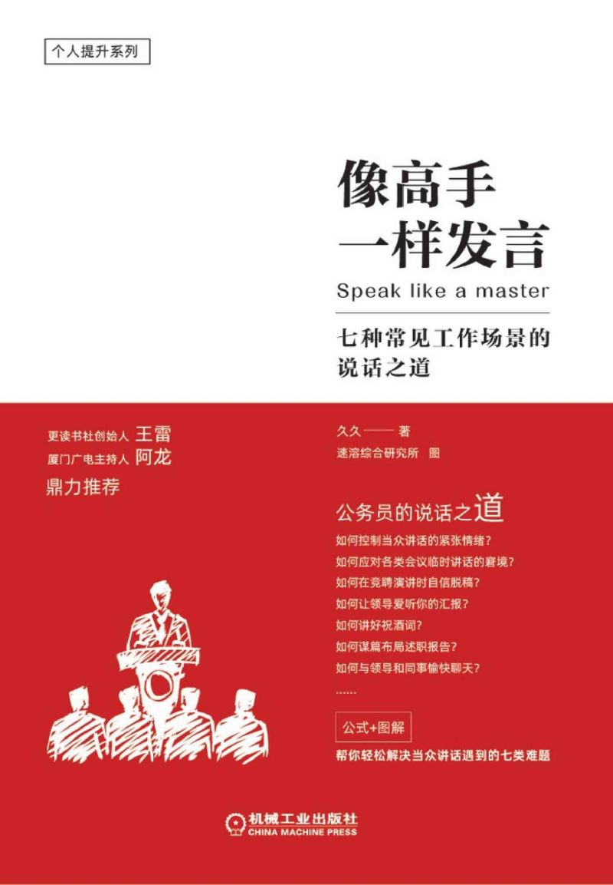

# 序言 提升公务员说话能力的关键

“说话”很重要，但是又缺少锻炼机会，这两者之间的矛盾怎么解决？靠谱的做法就是：做好准备，抓住每次难得而又宝贵的当众讲话机会，争取讲一次就能进步一点，讲一次就能增强一次信心，日积月累，慢慢由量变转化为质变，逐步解决当众讲话不敢说、不会说、说不好的问题。

本书结合公务员常见的工作场景，比如汇报工作、会议发言、述职报告、竞聘演讲、餐桌应酬等，通过拆解、论证、分析诸多真实的职场案例，挖掘其中讲话的特点和规律，并在此基础上，为你提供“好好说话”的公式和方法。

# 第一章 释放心理

## 认识当众讲话的紧张基因

想要控制好当众讲话的紧张情绪，首要的前提是客观、理性、正确地认识紧张，只有知道了紧张从何而来和紧张的特点，才能去很好地适应它，释放它。

### 紧张，是正常的、普遍的

关于紧张，心理学上这样定义：它是人类应对危机时的一种本能反应。人的身体，会对外来刺激保持警觉，一旦感觉到不利于自己的情况发生，就会出现肌肉紧绷、心跳加快、手心出汗等状况。这些反应，不需要大脑思考，是人的本能。

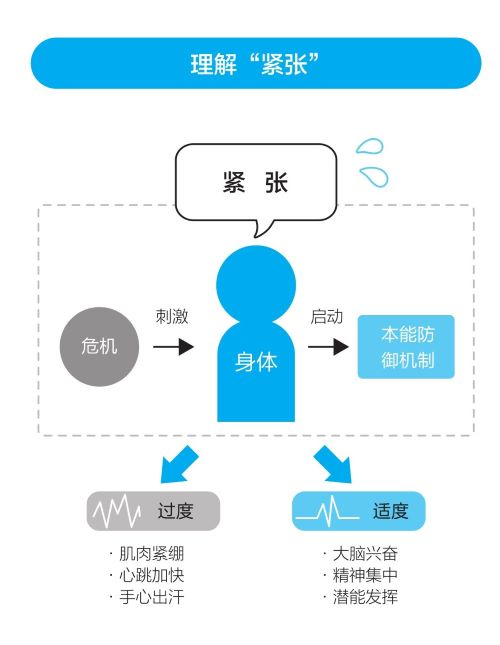

### 紧张，要控制而非克服

所谓存在即合理。紧张既然是本能反应，说明它的存在有一定的合理性。适度紧张，可以让讲话者大脑兴奋、精神集中，为更好地发挥潜能做好准备。对于当众讲话而言，适度的紧张，表示重视听众，重视讲话。只要是在乎听众，想要讲好，想要给听众留下好印象，自然就会紧张。

要通过具体的方法把紧张感降到一定程度，把“过度紧张”调整为“适度紧张”，让紧张成为助力，而非阻力。

### 紧张源自“有需求，没把握”

“有需求”？

许多人在讲话之前，不免会胡思乱想、浮想翩翩，“现场有领导，今天要好好表现，争取给领导留下好印象”“这次讲话太重要了，千万不能犯错”“一定不能让大家小瞧我”，等等，这些都是“有需求”。换句话说，就是期望值很高。由此给自己带来了压力，而压力越大，就越紧张。

“没把握”？

如何才能给领导和同事留下好印象；如何才能把话讲到点子上，讲到听众心里去。或者拿不准自己讲得到底“对不对”“好不好”，心中无数，心里没底。

一方面需求强烈，另一方面没有把握。这两者之间的落差，导致了紧张的产生。而且落差越大就越紧张。

### 控制紧张的根本之道

降低需求，提高把握。缩小“需求”和“把握”两者之间的落差。

降低需求，本质就是降低期望值，允许自己犯错，勇于接受自己不完美，保持一颗平常心。

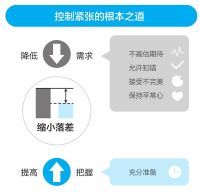

> 瓦伦达效应：瓦伦达是一个美国人，职业是表演高空走钢丝。在一次表演时，不幸掉下来摔死了。他的妻子事后说：“我知道这一次会出事，因为他上场前总是不停地说，‘这次太重要了，千万不能失败’；而以前表演时，他总想着走钢丝这件事本身，而不管成功或者失败的结果。”后来，人们把这种为了达到一定目的而患得患失的心态，叫作“瓦伦达效应”。

提高把握，实质就是尽可能多地做准备。

正确准备当众讲话的三字口诀是：写、背、说。

- 写——写稿子。在准备讲话稿时，先逐字逐句地把讲话稿写下来。这样做的目的是厘清思路。
- 背——背稿子。不是逐字逐句地背稿子，而是要把讲话稿的关键内容和讲话提纲背下来。
- 说——说稿子。通过大量的练习，把书面语转化为口头语，努力使表达更具现场感，更加生动、自然。

## 有效控制紧张的四大方法

### 第一种：开场法

提前准备好，练习好开场的前几句话

绝大部分人当众讲话时情绪紧张的变化，可以画成一幅图：

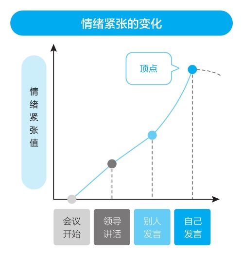

### 第二种：深呼吸法

深呼吸能够缓解紧张。但什么是正确的深呼吸，好多人却不了解。深呼吸也是有技巧和方法的。有时候，许多人就是因为不会深呼吸，从而导致自己无法平静、淡定下来。

正确深呼吸，在操作过程中有两个步骤、两个关键：

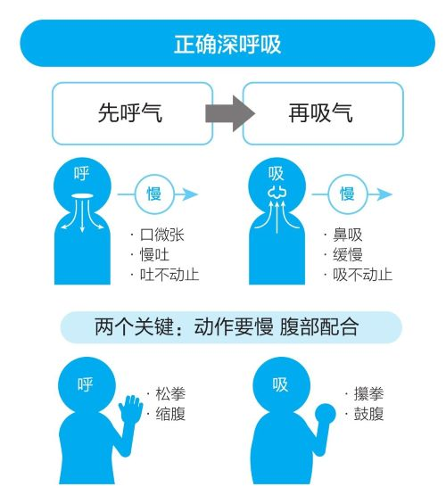

两个步骤：第一步，呼气。具体这样来做：先微微张开嘴巴，慢慢地往外吐气，持续的时间越长越好，直到吐不动为止；第二步，吸气。用鼻子吸气，动作要缓慢并直到吸不动为止。

两个关键：一个关键是，在做呼吸时，切记动作一定要慢，并尽可能地慢；同时，两手要做好配合，吸气时慢慢用力攥紧拳头，吐气时攥紧的拳头逐步放松。另一个关键是，在做深呼吸时，腹部是配合着同时活动的：吸气时，肚子往外鼓，就好像气球一样；呼气时，肚子往里缩。

如果你的肚子不动，或者方向是相反的，说明你的呼吸方式是错误的，没有呼吸到位。

### 第三种：转移法

通过某些途径让自己从紧张情绪中抽离出来，让自己放松

我有两条经验：一是在手机里存一些搞笑段子或图片，紧张时就打开看一下，让自己转移紧张情绪，得到放松；二是遇到紧张时闭上眼睛，回想自己的成功经历。

### 第四种：物理控制法

物理控制法，就是将自己全身的力气用尽、发泄完，没有多余的精力去紧张。

归根结底一句话，就是尝试紧张的次数还不够。再说白一点，就是当众讲话的次数还不够。如果有一天，你体验紧张的次数足够多了，你就自然会习惯与紧张和平相处了。

# 第二章 会议发言

## 如何在会议场合自信发言

### 会议发言“万能公式”

公议发言“万能公式”：铺+观+问+论+总。

- 铺：铺垫的话。开会发言刚开口的时候，要学会铺垫，客气一下表示礼貌。比如：“大家好，我是××单位的××，刚才听完大家的发言，很受启发。特别是听了××提到的××观点，感受很深。下面我谈谈自己的看法。”说铺垫的话，一是表示礼貌，二是可以帮助自己控制紧张情绪。
- 观：观点。讲完铺垫的话之后，就应该直接表明观点，让听众清楚地接收到。比如：“我认为抓好文明城市创建工作有三个关键需要把握……”有些人为什么会发言超时，关键是不能把观点清晰地表达出来，这也是判断一个人讲话能力的关键。
- 问：我为什么这么说？（我为什么这么认为呢？）讲完观点后，一般来说接着就要论证观点了。有些人之所以会跑题，关键是缺了这个“问”字。在论证观点前，加一句“我为什么这么说？”相当于主动设问。这么做有三个作用：一是与听众互动，吸引大家注意；二是帮助我们锁定观点，不容易跑题；三是起到过渡作用，承上启下，引出后面的“论”字。
- 论：论证，提供论据来证明观点。讲完观点，问完为什么有这个观点，接下来肯定就要开始论证了。
- 总：总结。就是把前面说的观点再次重复，与开头呼应，加深听众的印象。

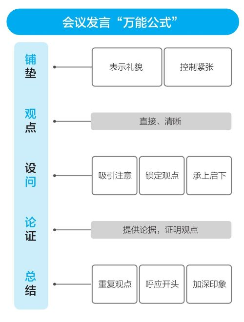

模拟场景：单位召开座谈会，大家围绕“如何提高公文写作能力”进行讨论交流

大家好，非常高兴能有机会参加今天的座谈会，刚才大家的发言给了我很大启发。下面我谈谈自己的观点。（铺）我的观点是：要想提高公文写作能力，就得当好“三多”先生。（观）我为什么这么说呢？（问）第一多是“多学习”。就是多学习一些公文的基本知识，了解每个文种的特点、用途，掌握每种行文的结构，以及一些特定场合的特定用语等。对一些常用的公文，如领导致辞、主持词、倡议书、新闻稿等都要有所了解。第二多是“多思考”。观点是文章的命脉。只有注意理论与实践的结合，提炼出鲜明的观点，文章才有深度，才有生命力。而观点来自于思考。所以写文章之前，必须静观默察、深思熟虑。第三多是“多练习”。公文写作是一项技能，“文贵于精，精在于练”，不仅要多读、多想，更要多练。任何好文章都离不开大量练习。只有多写常练，坚持不懈，才会熟能生巧，运笔自如，真正学到本领。（论）所以说，要想提高公文写作能力，我们就必须成为“三多”先生。（总）谢谢大家。

### 运用好“万能公式”的关键

1、观——观点

我们的观点需要包装，就如同报纸上文章的标题一样，需要加粗放大，这样大家才会有印象。

- 第一种方法：长变短，越短越好，越精炼越好。
- 第二种方法：用名人名言、经典诗句、网络金句等作为观点。

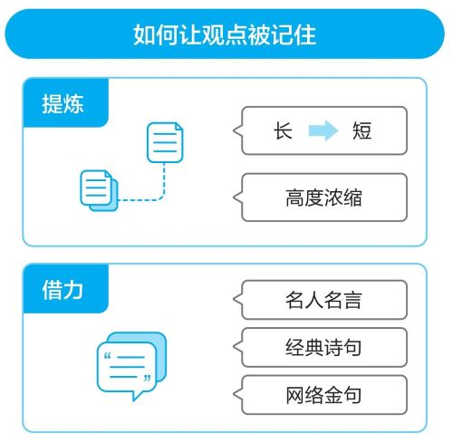

2、论——黄金三点论

“黄金三点论”就是围绕主题，把要表达的内容，按照一定的逻辑顺序分成三个部分，在表达时加上“第一、第二、第三”等序数词。

为什么叫“黄金三点论”？心理学家经过大量实验得出结论：听众在一段时间内，对若干项内容的记忆，前三点印象最深。在中国传统文化中，“三”具有特殊的含义：《道德经》开篇就说“一生二，二生三，三生万物”；《史记·律书》中记载“数始于一，终于十，成于三”；另外在一些成语中，如三心二意、约法三章、三教九流等，也经常出现“三”，这里的“三”，其实就是“多”的意思。

## 会议发言突发情况应急策略

### 没有准备，突然被叫起来发言

没有准备，突然被叫起来发言，一般人都会很紧张，这时怎么开口呢？教你一个方法：“好+谢+谦”。

- 好：问好。
- 谢：感谢。分两个层次：一是谁让我们发言就感谢谁；二是现场谁的职位最高就感谢谁。说感谢的话主要是为了让自己放松，同时赢得思考时间。
- 谦：谦虚。被叫起来发言，是给我们一个表现的机会，所以要低调谦虚。

举例：尊敬的张部长，各位同事，大家好！（好）谢谢张部长百忙之中抽出时间到现场指导工作，这对于我们做好创建工作是巨大的鼓舞和鞭策；也谢谢李处长把发言机会交给我。（谢）说实话，让我第一个发言，还是挺紧张的。一来没有多少准备；二来对创建问题我的认识可能还不到位，所以说得不一定对，权当是抛砖引玉。（谦）

### 别人快说完了，马上轮到自己时特别紧张

方法也是三个字：“好+肯+谦”。

- 好：问好。
- 肯：肯定。指对前面发言的人说的话表示肯定和赞同。
- 谦：谦虚。被叫起来发言，是给我们一个表现的机会，所以要低调谦虚。

举例：尊敬的张部长，各位同事，大家好！（好）刚才听李处长的发言，我感受很深。特别是他提到围绕创建工作，要采取五大措施，给我很大启发。（肯）下面，我结合自己的思考，谈谈对这个问题的看法，说得不对的地方，请大家指正。（谦）

> 经常用到的肯定他人的四种话术：
>
> 一是肯定他人的观点新颖独特，有很好的借鉴意义；
>
> 二是肯定他人思路清晰、观点明确；
>
> 三是肯定他人讲话内容丰富、底蕴深厚、信息量大；
>
> 四是肯定他人语言生动，大家爱听想听。

如果前面人讲的观点和我们的不一致，甚至相反，那怎么来肯定呢？也是可以肯定的，有两个方法：

一是学会说一个词——角度

举例：刚才，李处长站在完成工作目标的角度谈了对创建问题的看法，思路很清晰，给了我很大启发。现在，我站在另外一个角度也谈谈对这个问题的看法，请大家指正。

二是肯定对方讲话中的某个点，而不是整个讲话内容。

举例：刚才，李处长在讲话中提到，在处理创建问题时要注意一个前提，就是要调动基层的工作积极性。对于这点，我完全赞同。下面，我从另外一点，来谈谈自己的想法。

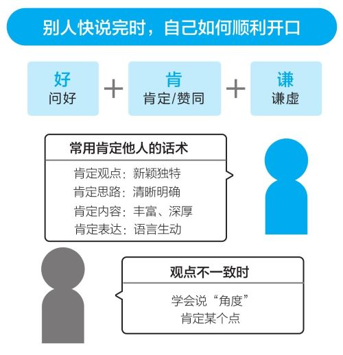

### 发言靠后，发现自己想讲的被别人讲完了

第一个方法：说实话+谈最深

举例：各位好，仔细听完大家的发言，我发现大家把我想要说的话都说完了，我没话说了。但难得有这么个发言机会，那我就谈谈自己感受最深的地方，请大家不要嫌我啰唆。

这就叫作“说实话”。这样坦率地说出来，显得真诚，容易让人理解。集中精力就谈感受最深的一点，既能节省时间，又能把问题谈好。所以如果从这些角度来分析，我们想讲的被其他人说完了，这个问题根本不算是问题。

第二个方法：找台阶+说观点

举例：各位好，听完大家的发言，让我想起来一句话，叫作英雄所见略同。我和大家想到一块儿去了。我也认为这个问题应该……

当然了，在会议发言时，还是尽量避免最后再说，不能老是把压力留给自己。

前面讲了会议发言时，经常会遇到的3种突发问题以及应对方法，这些方法看似不同，但本质都是一样的——都算是“铺垫”。所谓“铺垫”，用专业术语解释，就是在双方说话一来一往之间加上隔层。隔层的目的是为了创造舒适的说话环境和氛围。简单说，铺垫就是场面上的客套话。这种话，看起来很虚、很空，但却实用、有效。就像朋友之间的闲聊，尽管都是废话，但是必不可少。

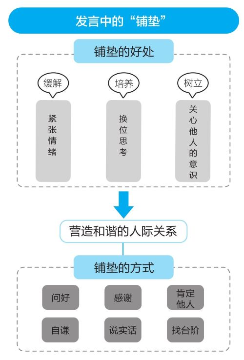

## 如何轻松做好会议主持

### 会议开场时，要遵循的“五字口诀”

主持人在会议开场时，可以遵循“开+重+人+议+请”的五字口诀。

- 开：开场白

会议场合，主持人刚开始肯定要说一些开场的话，比如和大家打招呼、问好之类，这是起码的礼仪，表示尊重大家。要注意的是，在一些正式场合，对现场的重要人物或者特殊人物，要做VIP的处理，就是要特意点出来。

举例：尊敬的张书记、李主任，来自全国各地的各位同行们，大家下午好

在开场白中，除了和大家打招呼外，还应该包括欢迎并点明会议主题的意思。

举例：各位领导、各位同事，大家上午好。欢迎大家参加由市委宣传部、市文明办联合举办的文明城市创建资料专题培训班。

- 重：会议的重要意义

举例：今年是我们市创建文明城市的冲刺年。收集整理上报创建资料，对于争创文明城市具有决定性意义。在座都是各单位、各部门的资料收集员，文明城市这块金字招牌能否拿到，和在座各位的努力息息相关：我们干得好，文明城市创建成功的概率就大；如果我们不努力、不细心，那全市工作就会受到影响。举办这个专题培训班，目的就是要帮助大家提高认识、明确任务，掌握要求、提升能力。

- 人：参加会议的人员

在讲这个字时，不同的场合有不同的要求，要具体情况具体分析。比如，文明城市创建培训班，我们邀请了相关的资料收集整理的专家，介绍时就要重点加以介绍。

举例：今天我们邀请到省文明办创建处的处长杨卫国同志，莅临现场为大家授课。杨处长是精神文明建设战线的领导和专家，在文明城市创建方面，有着深厚的理论功底和丰富的实践经验。杨处长是中央文明办的创建专家组成员，曾经参与过全国创文实地考察项目和问卷调查的设计，在资料收集整理方面，曾经全程一线指导我们省内兄弟城市的创建，有着相当丰富的实际操作经验。

- 议：会议的流程和议题

比如，今天的会议有三项议程：一是！；二是！；三是！。

- 请：也就是依次请相关人员发言讲话，把每个议程依次展开

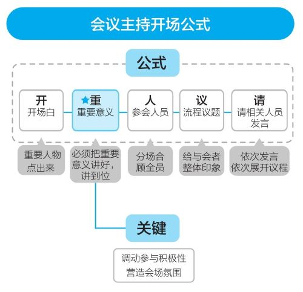

### 会议结束时，要遵循的“四字口诀”

- 总：总结

举例：刚才市城市管理局王局长介绍了我市在城市管理方面的经验和做法，市环境保护局介绍了在防止重度污染天气方面的做法，市交通局介绍了缓堵保畅工作的经验，市委常委、副市长李××同志就做好城市精细化管理做了一系列的指示和要求……

- 启：启发

举例：听了刚才李市长关于城市精细化管理要做到“五个抓”，我深受启发，尤其是他结合我市目前的创建全国文明城市工作，谈到的……非常有针对性、指导性，为我们做好下一步工作，指明了方向，明确了要求

- 望：希望

举例：会后，希望各部门、各单位按照刚才李市长“五个抓”的要求，切实抓好落实。关于这块，我再谈两个具体的要求。一是参与人员会后要第一时间给各部门、各单位一把手汇报会议精神；二是一周之后，各部门、各单位要将落实会议精神的情况书面报给市文明办

- 结：结束

举例：感谢大家参与今天的会议，也感谢李市长到会指导……今天的会议到此结束，散会

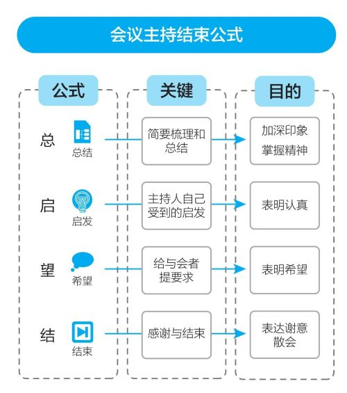

# 第三章 竞聘演说

竞聘不同于其他当众讲话场景，是气氛紧张、压力巨大、目标指向很明确的一种特殊场合。

## 如何在竞聘演讲时自信脱稿

### 有关竞聘演讲的一些事

竞聘演讲不同于一般的公众讲话，目的性非常强——要说服评委、领导和同事，把票投给我们。因为目的性强，需求就特别旺盛。所以，竞聘演讲对于绝大多数人来说，紧张感会异常强烈，直接反映就是脱不了稿，或者忘词卡壳，无法展示自己的自信与风采。

### 竞聘演讲自信脱稿的“魔法公式”

这个“魔法公式”包括“开场、主体、结尾”三部分

- 第一部分：开场

开场，即演讲的开场白。这部分用时一般在1分钟左右，应该包括三方面内容：问好，自我介绍，铺垫。

举例：各位评委、各位领导、各位同事，大家上午好。我是来自计划财务处的李青。我要竞聘的岗位是，计划财务处的副处长。非常感谢局领导给大家提供一个展示自我的平台。刚才听完其他同志的演讲，我是既紧张又高兴。紧张的是，大家都讲得这么好，自己感觉压力很大；高兴的是，为我们单位能有这么多优秀的同事，为自己身在这个优秀的团队中感到高兴和自豪。

- 第二部分：主体

主体，即演讲的主体内容。这部分用时应该在5分钟左右。主体部分是竞聘演讲的关键内容，所占的比重最大，直接关系到演讲效果的好坏。这部分应该包括三方面内容：为什么，凭什么，干什么。

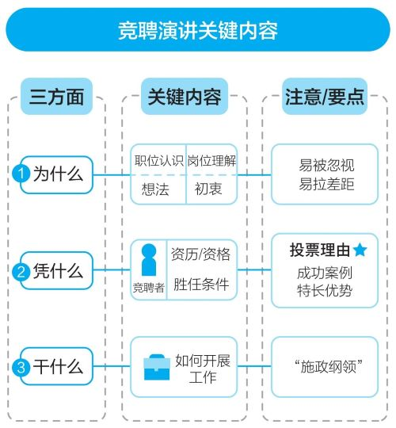

- 第三部分：结尾

这部分用时应该在2分钟左右。结尾部分是掀起演讲高潮的部分。应该包括两方面内容：拉票，表态

“拉票”，就是请求评委、领导或同事认可自己，把票投给自己。“表态”，意思是竞聘失败后准备怎么办。

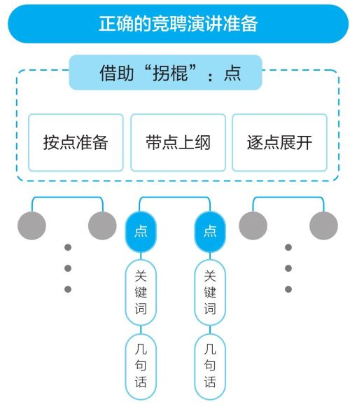

## 如何讲好竞聘演讲的主体部分

领导不会愿意听熟悉的下属，夸夸其谈自身优势，而且是听很多人都这样说；他们想听到具体、生动、有思想水平的内容。

### 有效说服评委的“三一二法则”

1、“三”

在谈“为什么”的时候，关键是要站在领导的角度来看问题，要站在更高的格局、更宏观的视野来谈对岗位的认识。可以从三方面来展开。

- 一是有高度

比如竞聘学校图书馆馆长。如果说馆长的职责，仅仅是完成图书馆的日常管理工作，那是远远不够的，还应当上升高度——图书馆是学校提高教职员工和学生综合素质的阵地，是学校精神文明建设的主战场。对岗位的认识有了高度，才能抓住评委和领导的眼球。

- 二是要全面

比如竞聘一所学院的院长，既要认识到院长是学院发展和建设的带头人，是教学与管理的负责人等，也要认识到院长不仅是管理者、领头雁，更重要的也是服务者，要为师生提供更多的服务，比如创造更优良的工作环境、营造更和谐的氛围等。考虑得更加全面，尤其是如果能谈出别人谈不到的内容，那会很好地把竞聘者凸显出来。

- 三是有创新

即对大家所理解的原先的岗位职责，提出新的思想观点，或从不同角度提出自己的认识与见解，能够令听众耳目一新。

2、“一”

“凭什么”三个字，很好理解，就是竞聘者的资历、资格以及胜任岗位的条件。比如，过去都做过什么成功案例，有哪方面的特长、优势，等等。

在这方面，一般人都会讲得很全很好。这里要提醒你的是，要把握好一个关键点，那就是“匹配”。什么叫“匹配”，意思是我们在说自己的优势条件时，必须要和竞聘的岗位职责要求相匹配，对应一致。

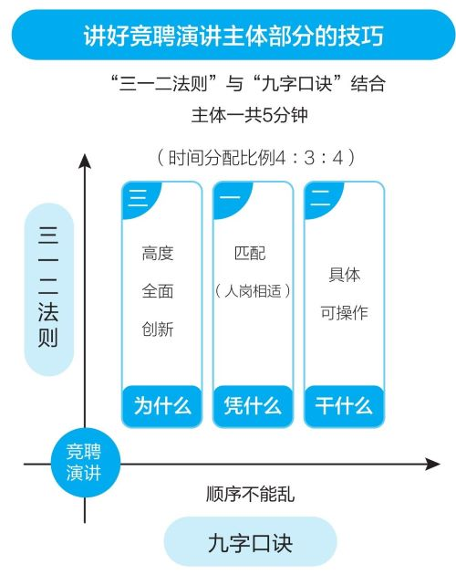

3、“二”

这个“二”和主体中的“干什么”三个字紧密相关。就是竞聘成功后会如何做，谈具体的工作思路。在说这方面内容时，要注意两个细节。

在竞聘时，一般人都会谈具体如何做，这是体现自身实际能力的关键，是展示执行力，说服评委和领导的主要内容。因为大家都会说到，所以要注意把握好细节，只有细节说到位了，才能获得认同

- 一是要具体。比如，说“竞聘处长成功后，我会带领处里同志努力工作、开拓进取，给单位交出一份满意答卷”，这算是表态，显得空洞。不如换成这样：“如果我竞聘成功，我会带领处里的同志做好以下三方面工作：一是抓好工作计划，制定新一年的工作规划和任务分工；二是抓好工作落实，通过增加人力、物力、财力的投入，签订任务责任书，确保工作落实；三是抓好工作督查，对照工作标准，利用明察暗访等多种方式，强化工作督查。”这样就把空洞的表态说得更加具体，让人听了才有感觉。
- 二是要有可操作性。在单位内部的竞聘，我们提出来的工作计划一定要能操作落地，不能让评委和领导觉得我们是在夸夸其谈。讲的方案、内容根本无法操作，那叫“扯淡”。所以，可操作性一定要强，这样评委和领导才能真正地信服和接受。

在讲“为什么，凭什么，干什么”时，这三个部分的先后顺序不能乱。在竞聘演讲中，一般都是先讲“为什么”，再讲“凭什么”，最后讲“干什么”。同时，也要注意这三部分的时间分配，一般是4∶3∶4的比例关系，“凭什么”可以适当精简一些，重点讲“为什么”和“干什么”。

### 做好现场演讲的“三大细节”

1、目光交流

在竞聘现场，评委是比较看重竞聘者的交流意识的。所以，做好目光交流极其重要。一个人的自信，首先就体现在目光里，如果竞聘演讲时都不敢看评委，那评委是不可能给你打高分的，需要注意：

第一，如果你是读稿子，每当遇到一段话读完了，一定要注意抬头与评委进行目光交流

第二，如果我们演讲时还要放PPT，那一定要注意将70%的时间用在与评委的目光交流上

第三，如果你是脱稿演讲，目光要做到“瞻前顾后，以点带面”。所谓“瞻前顾后”，意思是说会场前排的人是评委、领导，是相对重要的人，我们要和他们进行目光交流；后排坐的是同事、朋友或者其他人，虽然没有前排人重要，但是我们也要与之进行目光交流，不能顾此失彼，要照顾到全场。所谓“以点带面”，是指在照顾全场时，如果人多，我们做不到和每个人都进行目光交流，这时候可以通过看某个点的方式来替换某一片人。

第四，在竞聘演讲中，可能会有评委提问的环节，这时候我们不仅要注意与提问的评委进行目光交流，还要兼顾到其他评委。

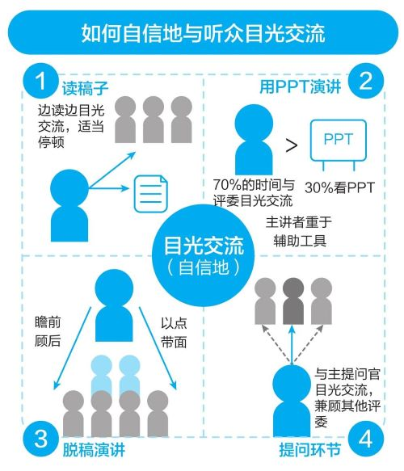

2、心态调整

第一，上场之前，深吸几口气，会明显感觉紧张感减轻

第二，上场的步伐，迈得轻盈有弹性，这样也能增强自信心

第三，站在讲台上演讲时，身体的重心要尽量落在前脚掌上，这样身体看上去会更加挺拔有力

第四，如果是坐在椅子上演讲，那双脚一定要踏地，这时你会感到心里有底气

第五，站稳或落座后，用目光与评委略作短暂交流后再开口，这样会显得沉稳，胸有成竹

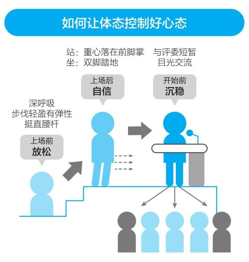

3、应答策略

面对提问，如果一时答不上来怎么办呢？下面介绍几种应答策略。

一是抛球法。即用谦虚的语气语调，礼貌地请教评委：“抱歉，刚才您问的问题我没有听清楚，麻烦您再说一遍，好吗？”以此赢得更多的思考时间。

二是带球法。有时评委的问题很简短，你不可能听不清楚；还有的评委为便于竞聘者听清楚自己的问题，会主动将题目说两遍，这时的“抛球法”就会失灵，建议你使用“带球法”。“带球法”就是自己复述一遍刚才的问题，同样可以赢得思考时间。

三是拍球法。就是从问题中的基本概念解释起，找到了问题的原点，只要不是过于难的问题，多数情况下基本概念会引出解答问题的灵感。

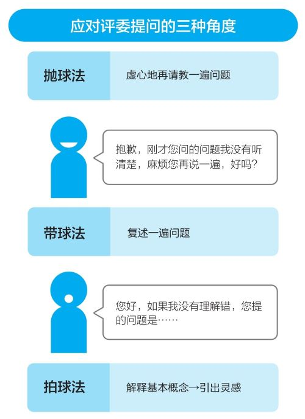

# 第四章 汇报工作

## 如何做好汇报的准备工作

怎么才能汇报到位呢？送给你六个字：想清楚，说明白。具体说，就是在汇报之前，一定要想清楚汇报内容，只有想清楚了，汇报时才能说明白。许多人之所以汇报不到位，最根本的原因就是没有想清楚，尤其是对一些核心问题、关键环节，看似明白，其实糊涂，导致汇报时，领导一旦问到关键处就张嘴结舌、漏洞百出、狼狈不堪。

### 注意调整心态

过于担心，过于看重汇报，这都属于不良心态，都会影响汇报的正常发挥。“战略上藐视敌人，战术上重视敌人”，非常适用于给领导汇报工作。在战略上要藐视，就是说要有一颗平常心，让自己淡定从容；在战术上重视，指的是要做好充分准备，不打无准备之仗。当我们把心态调整好了，才能在汇报时发挥正常水平。

### 选择汇报时机

汇报时机，就是什么时候去给领导汇报。这里提醒你在给领导汇报前要考虑四个因素：一是领导现在忙不忙；二是心情怎么样；三是对一些特别重要的工作，必须当面给领导说清楚的内容，提前和对方预约汇报的时间和地点；四是日常工作尽可能定时汇报。

除了上述四个因素外，再送给你三个数字：1%，50%和100%。

- 1%指的是工作刚开始时。许多人领到任务后埋头就写，忙活半天，非常辛苦，但写完交给领导后，对方说材料框架有问题，需要推倒重来。
- 50%指的是工作进行到一半时。当完成50%工作量的时候，你应该主动去给领导汇报，让对方心里有底。否则，对方会有不安感，会不踏实，尤其控制欲较强的领导更是如此。
- 100%指的是当工作结束时。这一条不需要做过多解释，当领导布置的任务完成了，肯定得给对方汇报。

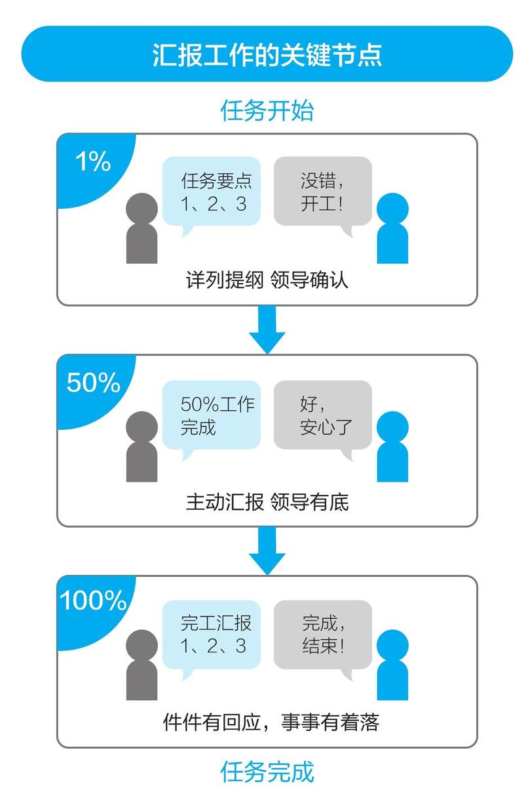

### 熟悉领导类型

千人千面，要怎么来做呢？关键是平时要多留心留意，注意了解和熟悉不同领导的个性特点和气质风格，这样才能在汇报时做到因人而异、有的放矢，让对方满意，从而获得理解和支持。

### 掌握汇报时长

汇报时长，就是指汇报多长时间。我的经验是在讲清楚的前提下，删繁就简，越短越好

### 明确汇报内容

一个成功的汇报，需要包括三方面要素：观点、事实、建议

观点，是要汇报的核心思想；事实，是证明观点的论据；建议，是基于观点、事实，建议对方要采取的行动。

汇报的本质就是要通过对一系列事情的说明、分析，让对方了解事情的来龙去脉，并且从事情的背后找出问题本质，得出规律性的结论，形成科学的决策意见，供领导选择。

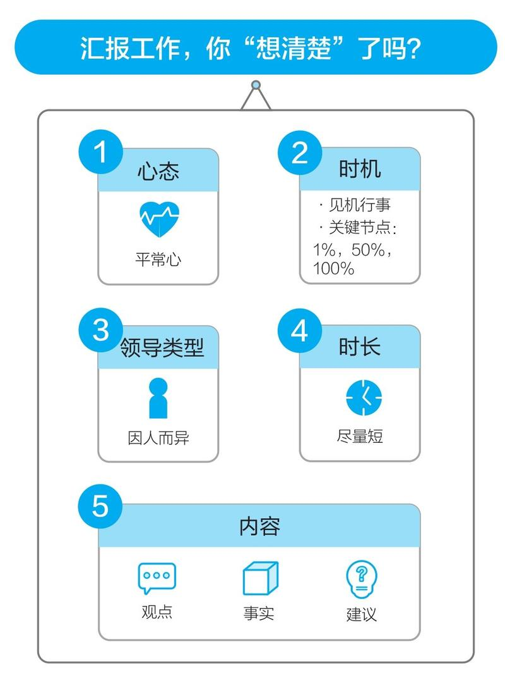

## 给领导汇报工作的“结构阵型”

### 汇报工作，开头怎么说

一是以领导的要求开头

二是满足领导的时间预期

### 汇报工作，结尾怎么说

一是要有请示及表态

二是替领导做好总结

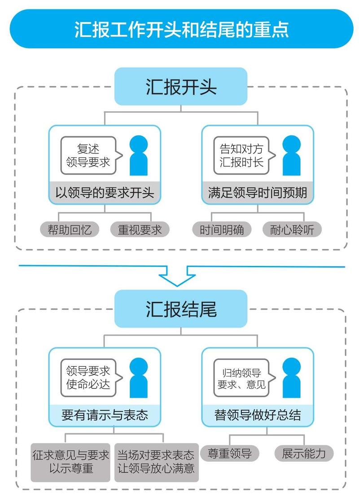

### 汇报工作，主体怎么说

前面讲过汇报内容的主体有六个字：观点、事实、建议。下面，就来详细地解释。

- 观点

讲好“观点”有两个要求：一是要简明扼要，二是要在汇报时先说

举例：王处长，关于××专题会，我建议推迟到3月底再开。理由有三个：一是市领导没时间，我和秘书们对接了，他们说领导们最近都忙，而且主要领导要提前到北京开两会；二是准备工作还没到位，特别是材料这块，还需要再完善；三是省上可能会出台新文件，我和省上沟通了，他们说关于××工作可能会有最新要求。您看怎么定？

- 事实

事实，就是证明观点的论据。如果在汇报的过程中，只有观点结论，而没有支撑结论的论据，那领导听完可能会半信半疑，打不定主意。

在说事实的时候，有什么要求呢？要求是具体翔实，有案例支撑，有详细数据，有细节展示。

举例：我的一位朋友在某机关做官方微信公众号内容编辑，在给领导汇报上年度工作时，他说：“2019年，我先后写了100篇文章，平均阅读量6万。其中，40篇阅读量达到10万+，1篇文章有2000多人次转发……”

运用数据要做到两点：一是要有解释，就是我们运用的数据，它的标准、内容是什么，要说清楚，否则外行人根本听不明白；二是要有比较，横向的、纵向的、单位内部的、单位外部的，只有通过这样的比较才能更好地展示数据背后的意义。

- 建议

建议要做到两点：一是要有针对性，指提出的建议是针对前面事实、观点的，是结合实际问题而提出的；二是要有可操作性，指建议是可行的，是能实际操作的，否则建议就根本没有什么意义了。

建议，是体现能力和水平的关键。汇报时把观点、事实都说清楚了，这相当于为下一步提出建议做好了铺垫，而“建议”相当于最后的临门一脚。所以，只有把建议说明白，并被领导采纳，这时候汇报才算完整而成功。

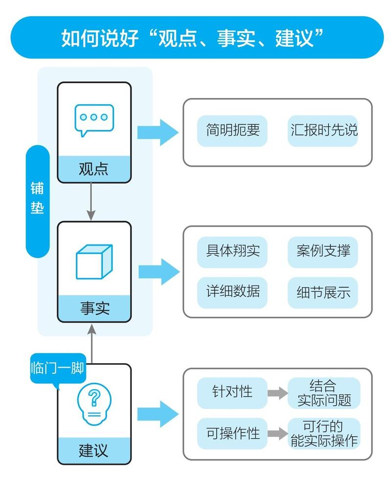

## 如何让领导爱听你的汇报

让领导爱听你的汇报，前提是要去分析领导想听什么，在此基础上努力使你的汇报更有针对性，尽可能地做到有的放矢、精准汇报，把话说到领导心里去。

下面，结合机关5种常见的汇报类型，逐一进行拆解分析，指明常见问题，提供应对之策，帮助你在给领导汇报时更有针对性、更加精准。

### 日常性汇报

在具体汇报时，我会遵循三个原则：一是既报喜也报忧，工作成绩要谈，问题也不避讳；二是既讲客观也讲主观，就是在讲问题时，除了讲客观原因外，自己主观的问题也要讲；三是少讲别人多讲自己，尽可能说得细一些，让领导和同事了解我在想什么、做什么，以争取支持和理解。

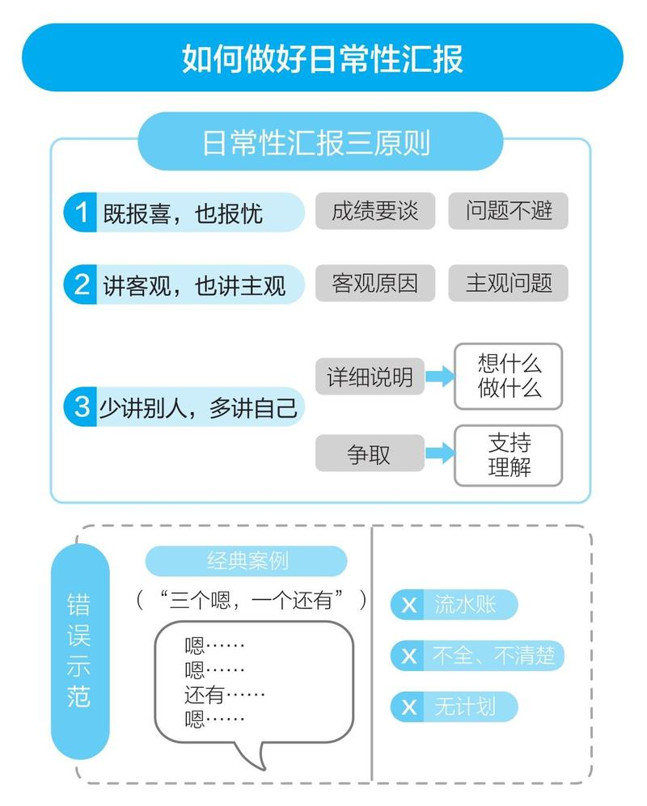

### 传达性汇报

传达性汇报，就是将有关信息传递给领导。比如，你代表领导去参加了某个会议，回来后要主动找领导汇报会议的相关情况，让领导掌握会议精神，落实会议要求。

在给领导汇报之前，要注意厘清关键性要求。所谓“关键性要求”，就是指上级提出的“要上交××材料，要召开××会议，要完成××任务”之类可以量化的关键要求，要把这些信息及时汇报给领导。

### 阶段性汇报

阶段性汇报，是领导安排的工作已经完成了一部分，领导想知道动态进展，需要听取我们的汇报

要多说“现在时”和“将来时”，少说“过去时”。要把汇报重心放在下一步的工作计划和打算上，这是领导最想听的内容。尤其是关于下一步工作，因为我们是具体的办事人，所以应该比领导有更多感性和理性的认识，这时在汇报中可以给领导提示下一步的工作路径及每个路径的优缺点

### 总结性汇报

总结性汇报，是领导安排的工作已经完成了，从总结经验的角度，给领导汇报

要准备两个版本，一个是详细的文字汇报版本，另一个是口头汇报的提纲版本。两个版本相互补充，各有侧重。文字版可以详细一些，把完成的情况、工作过程、碰到的问题及解决办法、成功经验都讲清楚；而口头汇报则侧重于条块、结构及关键问题的汇报。如果领导感兴趣会看具体的文字材料，如果不感兴趣，也不会出现被打断后不会脱稿汇报的情况。

### 突发性汇报

突发性汇报，是在工作中遇到某些突发事件时，事先没有预料到的汇报

从汇报时间的角度来说，如果工作进展与事先计划的出现重大偏差，应该第一时间向领导汇报。此外，因为事发突然，所以汇报人容易慌张，人一旦慌张，就容易出现混乱。所以在汇报前，要想清楚，尤其是想清楚补救措施。汇报过程中要少记流水账，直击关键问题，把症结说清楚。

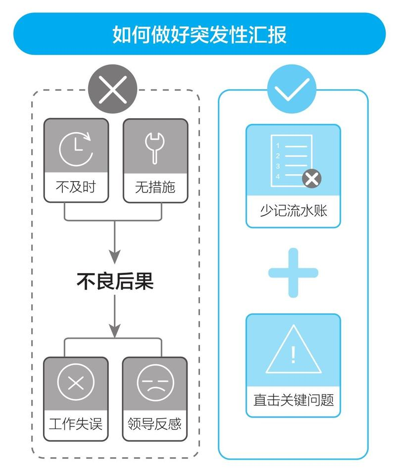

# 第五章 餐桌礼仪

## 讲好祝酒辞的方法

> 祝酒辞是在酒席宴会的开始，主人表示热烈欢迎、亲切问候、诚挚感谢的应酬之辞，是招待宾客的一种礼仪形式。祝酒辞其内容以叙述友谊为主，一般篇幅短小、文辞庄重、热情、得体、大方，是很流行的一种演讲文体。

在机关的正常公务接待中，祝酒辞就是在酒席招待开始前，由领导代表本区域、本部门所讲的一段开场白。这段开场白看似简单，但想要讲好讲到位，那是很需要方法和技巧的。

### 提前知道，有所准备

记住“场+益+举+祝+干”五字口诀就可以

- “场”：点明场合，表达欢迎的意思；
- “益”：就是举办本次宴请的意义、目的和好处。
- “举”：提议举杯；
- “祝”：送出祝福。
- “干”：干杯。

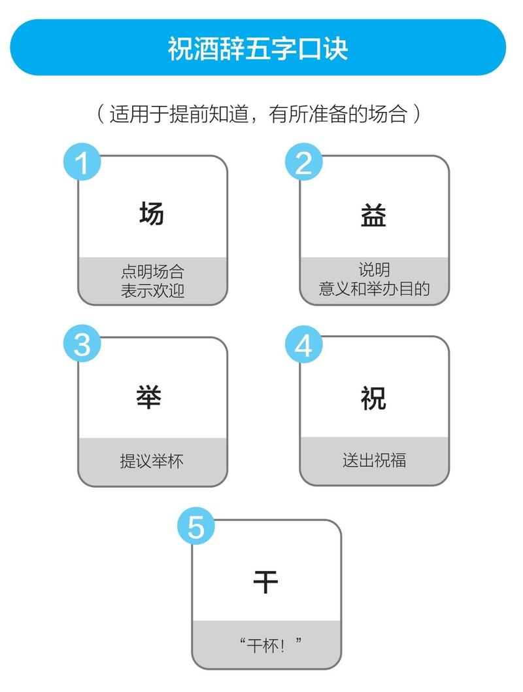

模拟场景：今年是你大学毕业20周年，你作为牵头组织者准备搞一次聚会，在聚会开始前，需要讲上一段话。

各位老师、同学，大家好！欢迎大家在百忙之中抽出时间，来参加我们毕业20周年纪念活动。（这是第一个字“场”）举办这次活动，主要有三个目的：第一，是为了纪念我们逝去的青春。20年前，我们都是青春年少，为了理想，我们奋发图强、激昂向上、携手同行，用美好青春书写一抹最绚丽的人生色彩。第二，是为了重拾过去的友谊。20年前，我们有缘从五湖四海相聚到北京，在那难忘的4年岁月中，我们共同学习，一起成长，彼此结下了深厚的友谊。这段友谊是我们人生当中最为宝贵的财富。第三，是为了展望美好未来。20年前，我们是青春年少，20年后，我们是中流砥柱。尽管肩负家庭与事业的重担，但我们对未来始终充满向往，我们坚信未来会更好！（这是第二个字“益”）各位同学，让我们举起手中的杯子。（这是第三个字“举”）首先，祝福我们的母校越来越好，我们的老师健康长寿！其次，祝福所有的同学们身体健健康康，事业越做越大，生活幸福美满！最后，祝我们的友谊地久天长。（这是第四个字“祝”）干杯！（这是第五个字“干”）

### 临时应酬，没有准备

记住“高+谢+祝”三字口诀就可以

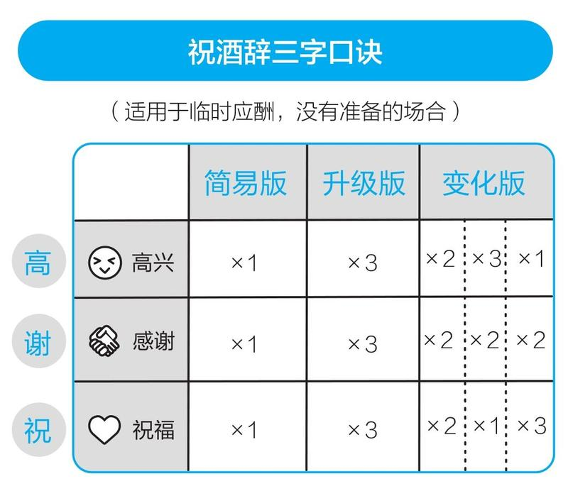

- “高”：高兴，表达自己的心情；
- “谢”：感谢，表达自己对大家的谢意；
- “祝”：送出祝福。

举例：你去参加朋友们的聚会，被叫起来讲几句。

各位朋友大家好！非常高兴参加今天的活动，特别是看到这么多很长时间没有见面的老朋友，心情非常激动。（这是第一个字“高”）感谢大家过去对我的照顾和帮助，没有你们，就没有我的今天。在这里，我向大家表示我最真挚的谢意。（这是第二个字“谢”）借此机会，我祝福在场所有的好朋友们身体健康、万事如意、生活美满、家庭幸福！来，干杯！（这是第三个字“祝”）

在一些场合，如果觉得这样说过于简单的话，还可以运用它的升级版，叫作“高高高+谢谢谢+祝祝祝”。

举例：各位朋友们好！见到大家很激动。我先讲我的三个高兴。第一个高兴，听说朋友张三最近被提拔了，到了新岗位，替他高兴；第二个高兴，是李四把自己的女朋友也带来和大家见面，女朋友这么漂亮温柔，我替李四兄弟高兴；第三个高兴，是今天我们同学能来这么多，这么给我面子，我感到特别高兴。（这是“高高高”）接着我再讲讲我的三个感谢。第一个感谢，感谢李飞兄弟今晚找了这么好的聚会地方，环境好，离大家又近；第二个感谢，上次我母亲生病住院，感谢在座的好多朋友们去看望；第三个感谢，感谢兄弟们平时在工作中给我的帮助和支持。（这是“谢谢谢”）最后，我再啰唆送三个祝福。第一个祝福，祝大家在工作中，都能芝麻开花节节高，一年更比一年好，都早日被提拔；第二个祝福，祝大家在生活中能够诸事顺利、生活美满、家庭幸福；第三个祝福，祝我们兄弟姐妹之间的感情天长地久，越来越好！（这是“祝祝祝”）

当然，如果觉得这个公式复杂，还可以说“二二二——两个高+两个谢+两个祝”，或者说“三二一——三个高+两个谢+一个祝”，再或者说“一二三——一个高+两个谢+三个祝”，即根据现场的需求，随时对“三三三——三个高+三个谢+三个祝”进行变换调整，更好地加以应对。

## 如何通过给领导、同事敬酒表达诚意

### 给领导敬酒的表达方法

给领导敬酒时，有三种表达方法：

1、感谢式

主要是“谢+心+祝”三个字。“谢”表示感谢，“心”表示心情，“祝”表示祝福。

举例：张主任，真的要感谢您，要不是您的关心照顾，上次我做××项目时肯定不会那么顺利，一直想找个机会向您当面说声“谢谢”，今天正好有这个机会，祝您今后能够工作顺利、身体健康、家庭幸福。您随意，我喝完。

2、赞美式

主要是“赞+心+祝”三个字。“赞”表示赞美，“心”表示心情，“祝”表示祝福。

举例：王科长，我来敬您杯酒，一直想向您当面请教如何当好会计。上次要不是您发现财务报表里的一处错误，我们科真要出大事，单位可能也要损失不少。大家都夸您心细、认真，而且愿意帮助人，大家都想跟着您干。祝您今后事业能够更上一层楼。您随意，我喝完。

3、表态式

主要是“表+心+祝”三个字。“表”是表态，“心”表示心情，“祝”表示祝福。

举例：刘书记，我来敬您杯酒，在您手下工作，我学到了不少东西；同时也很惭愧，经常会犯错误，还请您多多担待。在这里，我向您表个态：从今以后，我一定认真工作、勤奋努力，不辜负您的培养和期望。借今天的酒祝您今后事事顺心、万事如意，也希望我们单位在您的领导下，各项工作都有新的突破！您随意，我喝完。

另外，建议敬酒时一定要减轻思想顾虑，不能因为不会说话而不去敬酒，那样会非常被动，而且自己也会很难受。酒桌上最害怕的是什么——冷场，最需要的是什么——气氛，和领导一起喝酒，最好能主动敬酒。

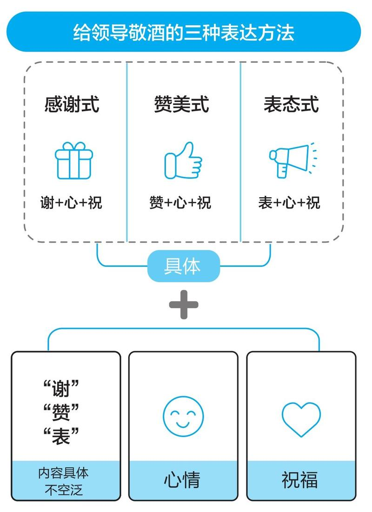

### 给平级的同事（朋友）敬酒的说辞

在酒桌上，给平级的同事（朋友）敬酒的总体原则是：找原因，送祝愿。即在敬酒时找一个敬酒的由头，找一套说辞。

1、谈缘分

举例：赵老师，俗话说有缘千里来相会。今天能和您坐在一起喝酒，真是缘分！来，为这个缘分，我敬您一杯！

2、谈感谢

举例：赵老师，所谓“听君一席话，胜读十年书”，您刚才教给我的方法真是让我醍醐灌顶，给我不少启发。谢谢您的指教。来，我敬您一杯。

3、会赞美

举例：赵老师，您今天穿的衣服真好看，和您的身材特别般配，能告诉我在什么地方买的吗？来，为您的衣服，我敬您一下！

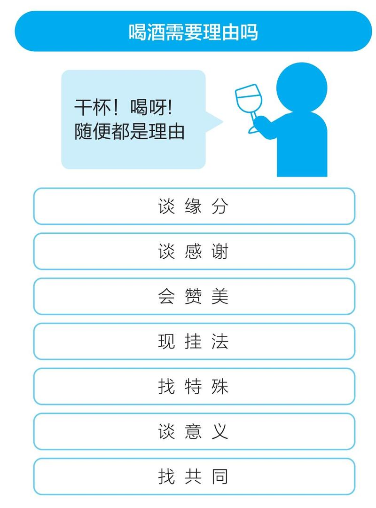

4、现挂法（抓取现场看到的、听到的、想到的元素）

举例：赵老师，我刚才听您说您老家是山东，太巧了，我的祖籍也是山东。尽管我在武汉出生，但我爸爸从小就在山东长大，年轻时当兵才转业到武汉。我俩应该算是老乡了。来，为我们都是山东人，我敬您一下！

5、找特殊（即找到敬酒对象身上与众不同的特点）

举例：赵老师，今天您是“万绿丛中一点红”，现场就您一位女士，而且学问又高，身材又好，您绝对是我们现场所有人心目中的女神。来来来，我一定要再敬女神一下！

6、谈意义

举例：赵老师，我再敬您一杯！这杯酒对我来说，意义非同一般。今天您来参加活动，真是出乎我的意料。一直想找个机会向您当面请教，但一直没时间，您的工作也特别忙。今天总算实现了这个愿望。为我的愿望实现，敬您一杯。

7、找共同（找到彼此双方的共同之处）

举例：可以从很多方面找共同，如：同学、同事、同乡、同籍贯、同属相、同姓氏、同名、同年龄、同生日、同星座、同年代、战友、校友、同行业、同工作、同职位、同观点、同兴趣爱好、同样戴眼镜、都是双眼皮……

你还可以一鼓作气将上述几种方法合在一起运用

举例：赵老师，今天第一次见您，也是缘分。在我心目中，一直把您当我的偶像。但是今天见到真人，我发现自己错了，我应该把您当女神。您不仅学识好、身材好，更重要的是脾气好、人品好。所以，为了我心目中的女神，今天我一定要敬您三杯。

## 做好餐桌接待的“六个细节”

### 点菜

点菜真是门学问：几凉几热，口味搭配、颜色和谐，荤菜、素菜，硬菜、软菜，特色的、家常的，辣的、不辣的，等等。

善于借助他人的力量。你可以提前到达餐厅，告诉服务员用餐人数、预算、口味等，请她们帮忙点菜，因为服务员一般都比较有经验；如果不行，再请教大堂经理。我在实践中经常这么做，屡试不爽。

有一个关键环节需要注意，那就是在点菜时要留意点上1～2样特色菜，并且问清楚服务员这些特色菜的来头和讲究。上菜后，你可以现场给大家介绍，让大家吃出品位、吃出文化。这是让我们在点菜环节脱颖而出很重要的一招。

### 入座

如果搞不清楚座位顺序，怎么办？我的经验是：你可以暂时不表态，让大家自然入座，自己可以去招呼服务员上茶水。如果此时出现问题，现场肯定会有人纠正。最后，你再给自己找一个稳妥、合适的座位。

### 敬酒

要有主动意识，要减轻思想顾虑，要积极行动起来。具体做法：一是敬酒时配合说辞，如给领导敬酒，多说感激、赞美、表态之类的话；给同事、朋友敬酒，多说轻松的话题，把气氛活跃起来。二是尽量把现场的人都照顾到，特别要关注那些不怎么活跃的人，多敬酒、多找聊天话题，引导他们参与。

### 结账

酒席进行到下半段快结束时，你可以装作上洗手间，去把账结了。如果餐用完后还有其他安排，此时要抓紧联系，比如通知司机去开车，通知“第二站”的人做好准备，等等。还有，如果需要代驾，那就得提前联系好司机，确保用餐结束前，司机就能到达。所以，结账看似简单，但要做好这一条，背后有很多工作需要去做。

### 散场

用餐结束后，先把领导、同事（朋友）送出去，然后自己在用餐房间内转一圈，看看有没有什么东西落下了，最后出去。这一条非常重要，一个人的细致程度、服务意识就体现在一些细节上。到了饭店门外，把领导、同事都安排好送上车。

### 到家

回到家后，第一时间给领导、同事（朋友）发个微信或者短信，告知一声：到家了，感谢大家参与；同时问问领导、同事（朋友）都到家没有。

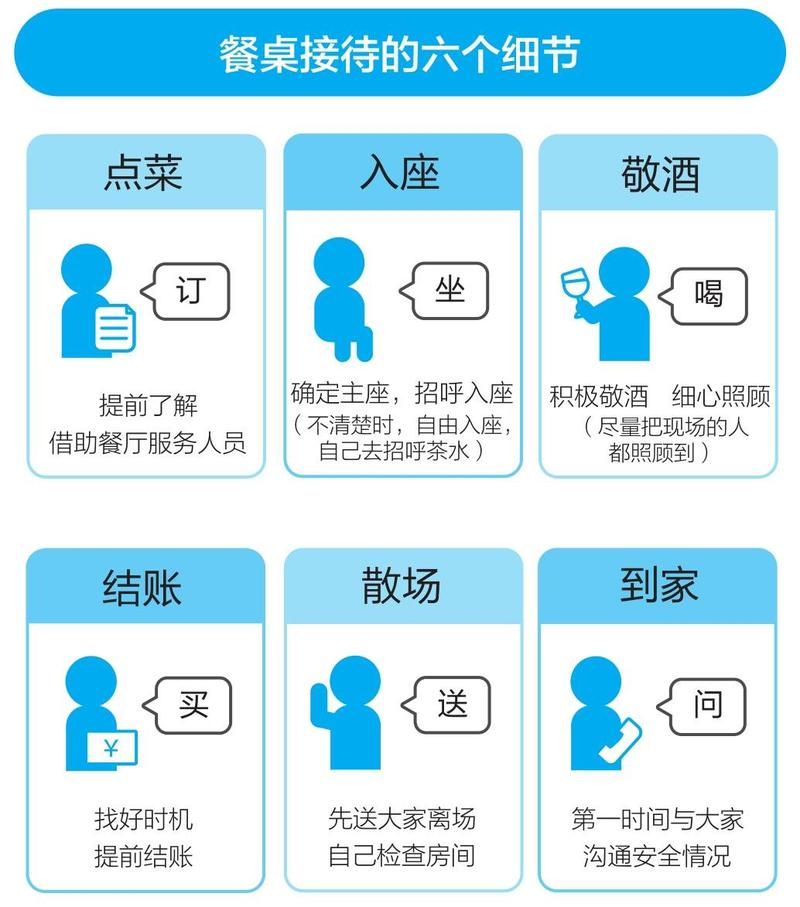

处处留心皆学问，人情练达即文章。要想做好接待工作，细节是成败的关键，只有把每个细节都全力以赴地做到位，那我们的接待水平、能力自然也就体现出来了。