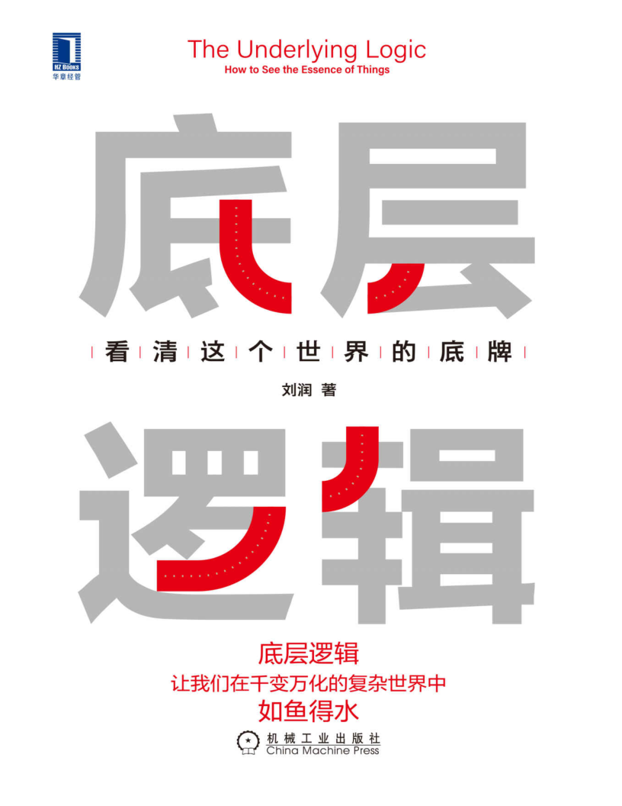
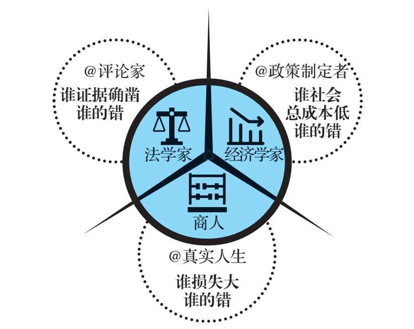
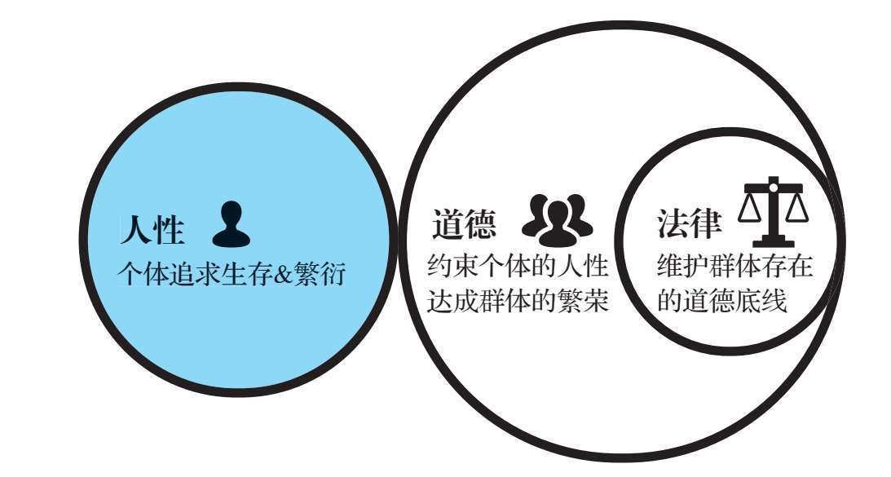
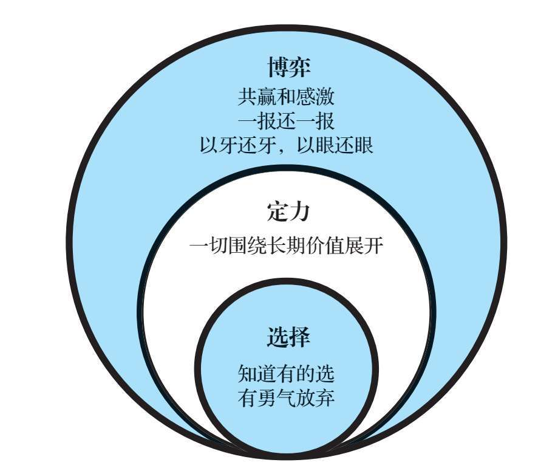
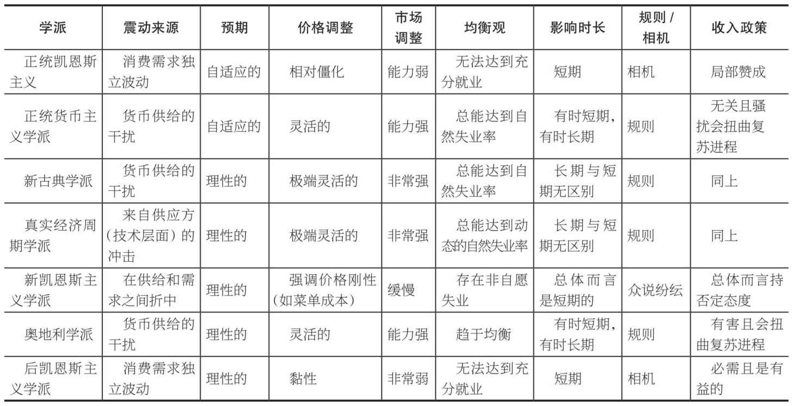
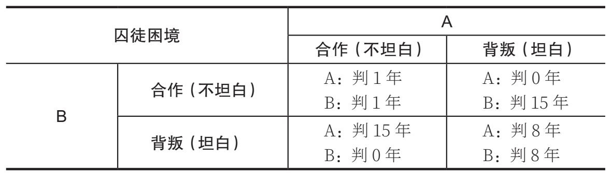

# 底层逻辑：看清这个世界的底牌

- 作者：刘润
- 出版社：机械工业出版社
- 出版时间：2021-10
- ISBN：978-7-111-69102-0
- 豆瓣：https://book.douban.com/subject/35620025
- 封面：

# 序言

事物间的共同点，就是底层逻辑。

只有不同之中的相同之处、变化背后不变的东西，才是底层逻辑。

只有底层逻辑，才是有生命力的。

只有底层逻辑，在我们面临环境变化时，才能被应用到新的变化中，从而产生适应新环境的方法论。

所以我们说：

底层逻辑+环境变量=方法论

如果只教给你各行各业的“干货”（方法论），那只是“授人以鱼”，一旦环境出现任何变化，“干货”就不再适用。

但如果教给你的是底层逻辑，那就是“授人以渔”，你可以通过不变的底层逻辑，推演出顺应时势的方法论。

所以，只有掌握了底层逻辑，只有探寻到万变中的不变，才能动态地、持续地看清事物的本质。

在这本书中，我把在《5分钟商学院》中讲述的底层逻辑的内容进行了总结，与你分享是非对错、思考问题、个体进化、理解他人、社会协作五个方面的底层逻辑，带你看清世界的底牌。

“底层逻辑”来源于不同中的相同，变化背后的不变。

“底层逻辑”并不局限于商业世界。希望你在看到千变万化的世界后，依然能心态平静、不焦虑，能够通过“底层逻辑+环境变量”不断创造新的方法论，看清世界的底牌，始终如鱼得水。

# 第1章 是非对错的底层逻辑

## 一个人心中，应该有三种“对错观”

“课题分离”理论由奥地利心理学家阿尔弗雷德·阿德勒提出，原意指要解决人际关系的烦恼，就要区分什么是你的课题，什么是我的课题。

比如，有人在地铁里踩了我一脚，谁的错？我的错。

明明是他踩了我，为什么是我的错呢？难道我不应该要求他道歉吗？我可以要求他道歉，但是，道歉有什么用？而且，我要求他道歉，不需要花时间吗？他耍无赖和我吵来，不是更需要花时间吗？我的时间难道没地方花了吗？对方还可能反咬一口：“你怎么把脚乱放啊？！”

那怎么办？我要说“我的错，我的错”，然后心平气和地走到旁边。这是因为，我的时间比他的值钱，浪费同样的时间，我的损失大——“谁的损失大，就是谁的错”。

一个人心中，应该有三种“对错观”：①法学家的对错观，②经济学家的对错观，③商人的对错观（见图1-1）。

\**图1-1 一个人心中应该有三种“对错观”*

举个例子：坏人A诱骗好人B进入C的没有锁门的工地，B失足摔死了。请问，这是谁的错？

如果证据确凿，在法学家眼中，这就是A的错。但是，这种“大快人心”的对错观，不一定能避免类似案件再度发生——法学家做不到的事情，经济学家也许能做到。

经济学家可能有不同看法：是C的错。也许有人会说：“啊？为什么啊？C也太冤了吧？”。经济学家是这样考虑的：整个社会为避免B被A诱骗进入C的工地要付出的成本，比C把工地的门锁上的成本高得多，虽然惩罚C会让其觉得冤，但是以后所有工地的拥有者就都会把门锁上了，于是这样的事情会大量减少。

经济学家是从“社会总成本”的角度来判断一件事的对错在谁。虽然有时这样的判断看上去不合理，但会比从“纯粹的道义”的角度更有“效果”。

商人可能这样想：不管是A的错还是C的错，B都死了；不管让谁承担责任，B都无法起死回生——从个体利益最大化的角度看，B只能怪自己。

也许B在生命的最后一刻，会想：“这是我的错，我不该蠢到被A诱骗至此。”

如果你是评论家，可以选择法学家的立场；如果你是政策制定者，可以选择经济学家的立场；如果将要失足摔死的就是你自己，我建议你选择商人的立场——“我的错，都是我的错”，因为“我的损失最大”。

**判断损失发生后应该怪谁，就看谁因此损失大。一件事情出现不好的结果时，责怪、埋怨、后悔都是无用的，它们改变不了结果。如果自己有所损失，只能怪自己，也只有自己才能改变事情最终的结果——靠自己，自强者万强。**

## 人性、道德和法律

\**图1-2 人性、道德和法律*

### 人性

人性只涉及两点：生存和繁衍。这两点无善无恶。

### 道德

感恩是道德。感恩的本质是“预付费制的交换”：“你先帮我，我必将帮你”。这将润滑群体的协作关系。

宽容是道德。宽容的本质是“允许犯错的协作体系”：以协作为目的带来的意外伤害，可以被原谅。这将鼓励群体拥有协作的勇气。

道德，就是用来约束个体的人性的，在此基础上，可以实现群体的繁荣。个体之所以愿意接受道德的约束，是因为群体的繁荣最终会让个体受益。

道德不是人性的内在要求，甚至在大部分情况下，道德是反人性的。恰恰因为道德常常是反人性的，才需要大量的引导和约束。

引导，采用的是宣传、舆论等有长效但见效慢的方法，比如通过文化、价值观等引导。

约束，采用的是惩罚、驱逐等“剧烈”但立竿见影的方法，比如通过社会结构、利益结构、法律等约束

### 法律

每个时代的人都会给道德中的社会规范“画一条最低的线”——底线，这条底线就是法律。法律是道德的子集，是一旦触犯必然受到惩罚的道德。

人性，来自“自私”的基因。道德，是为了群体的繁荣，最后促进个体的生存、繁衍，大家共同达成的“社会契约”。道德，常常是反人性的。法律，是道德的子集，是维护群体存在的道德底线。

## 人生的三层智慧：博弈、定力、选择

如何拥有一个自己说了算的人生？学习，拥有智慧。在这个时代，想要活得很好，需要知识，但更需要智识。

如何获得人生的成功和幸福？依靠智慧。世界过于复杂，有太多不确定性，需要智慧为我们指点迷津。

是否拥有智慧，以及拥有什么层次的智慧，决定着人与人之间的差距。

在人生中，博弈是第三层智慧，定力是第二层智慧，选择是第一层智慧（见图1-3）。

### 博弈的智慧

有人，就有竞争。有竞争，就有博弈。

试探、谈判、斡旋，如何既求取所想，又全身而退，是不折不扣的技术活儿——毕竟，即便我们知晓所有的“戏码”，也无法估量人心的“疯狂”。

**怎么博弈？一要靠心态，二要靠策略。**

什么心态？共赢和感激。

每个人都是独立的个体，与世界进行价值交换。价值交换只有一个原则——共赢，即合作双方都可以获得价值。

“我一定要赢，你一定要输，为此我愿意费尽心机，不择手段”，这是“鸡”的心态。

“我一定要赢。你如果输了，那对不住，别怪我。我消灭你，与你何干”，这是“雀”的心态。

“我一定要赢，你也一定要赢。如果一方的胜利要建立在另一方的失败之上，那就不做了”，这是“鹰”的心态。

“鸡”“雀”“鹰”的心态对应的是不同的境界。

我认为，要么共赢，要么不干。

每到一个新阶段，我们都要感激上一个阶段帮助过我们的人，尤其是那些在最艰难的时候还愿意信任我们的人——滴水之恩当涌泉相报。

创业刚开始时最喜欢你、支持你的用户，你给予最用心、极致的服务了吗？

最初无条件信任你的合作伙伴，你给予最优惠的价格了吗？

陪着你吃方便面、睡公司的员工，你给予最丰厚的激励了吗？

*请记住，雪中送炭，永远比锦上添花难得多。*

共赢和感激，用这样的心态“以不变应万变”地参与博弈，可能眼前会吃小亏，但长远看会赢得大利。

**那策略呢？我认为要“一报还一报”“以牙还牙，以眼还眼”。**

之所以这样说，是因为在博弈论计算机模拟实验中，重复对方上一次的动作，最终得分最高——重复对方的动作，是最好的“生存策略”。

总是当老好人，容易被欺负。“一报还一报”，是对自己的保护。你的善良，应该有点儿“锋芒”。

天黑路滑，社会复杂。江湖险恶，人心叵测。我们需要博弈，更需要博弈的智慧。 **也许最明智的处世之术就是既对世俗投以白眼，又与世浮沉。**

### 定力的智慧

“乱花渐欲迷人眼”，太多东西在抢夺我们的注意力，让我们失去目标，偏离方向。

定力，可以换成一个我们更熟悉的词——长期主义。

亚马逊创始人杰夫·贝佐斯在1997年致股东的信中就写了这么一句话，“It’s all about the long term”，即一切都将围绕长期价值展开。

这句话的意思是说，贝佐斯更加注重长远的利益，而不是短期的股票收益，他会持续推动亚马逊著名的“飞轮”运转：

商品价格降低，意味着会有更多的顾客；更多的顾客，意味着会有更多的卖家；更多的卖家，意味着会有更大的销售规模和更多的销售渠道；更大的销售规模和更多的销售渠道，意味着供应链会得到优化，从而使商品价格进一步降低；商品价格进一步降低，又意味着会有更多的顾客……就这样，一圈，一圈，又一圈。

贝佐斯推动了20余年，让“飞轮”的转速越来越快，从而不断获得成功。20余年，这是一个怎样的数字，其背后的艰辛，难以想象。

**定力，是人生的智慧——最终的胜利，常常是时间的胜利，是长期主义的胜利。**

### 选择的智慧

人生是由一连串问答题串起来的，但人生更是由一连串选择题串起来的。

人生的轨迹，往往就是由那么几次关键的选择决定的。遗憾的是，大多数人不知道自己有的选，也没有勇气选择。

听说“小孩子才做选择，成年人都想要”，我都选行不行？想得挺美，当然不行——成年人，更要选择。

学会选择，常常就是学会放弃：选择一个，放弃其他。

选择有时比努力重要，但放弃有时比选择更重要。我们应勇敢选择，然后享受好处，承担坏处。

**人生的悲剧，往往来自看着前方，又想着后方，最后无路可走。**

在人生中，博弈是第三层智慧，定力是第二层智慧，选择是第一层智慧。如何博弈，如何保持定力，如何做出选择，都决定着人生的走向——选择做某件事情，凭借长期主义形成自己的定力，和这个世界重复博弈。

希望在这个复杂多变的世界里，我们都能全身而退，实现多方共赢；能拒绝诱惑，保持定力；能勇于选择而不后悔，随心所欲而不逾矩；能拥有智慧，实现自己的人生目标。

## 公理体系VS逻辑推演

在有公理体系的世界里，只有能证明的和不能证明的。大师与大师的差异，是智商的差异，不是口才的差异。

但是，大部分学科领域，是没有公理体系的，比如经济学。

这并不是说，这些领域的研究者智商不如数学家，而是说在这些领域，仅仅靠智商是没用的。因为没有公理体系，只靠逻辑演绎，想要得出不容置疑的结论是不可能的。所以，这些领域的研究者更值得敬佩。

他们遇到的挑战，远不如数学那么单纯。他们不断提出新的观点和模型，但是只要举出支持的例子，就总有人举出反对的例子。紧接着，就开始吵架了，都说对方是特例。

中国人用四个字来形容这种“研究方法”：文人相轻。

《了不起的盖茨比》的作者菲兹杰拉德说，我来做个和事佬吧。他把“文无第一”这四个字，翻译成了一句英文：“The test of a first-rateintelligence is the ability to hold two opposed ideas in the mind at thesame time, and still retain the ability to function.”

再翻译回中文，就是：“同时持有全然相反的两种观念，还能正常行事，是第一流智慧的标志。”用通俗的话说就是：“别吵了。你们都对，你们都对。”

这种“你们都对”，就给学习经济学带来了很大的麻烦——你们都对，那我学谁的“更对”呢？

### 学李白，也要学杜甫

如果有人告诉你，他最近在学经济学，你一定要问他：“你在学习什么经济学？”如果有人对你说，经济学上有什么样的观点，你一定要问他：“谁的经济学这么认为？”

这时，他只要稍微一愣，就说明，他其实还不懂经济学。

这个世界上，并不是只有一套经济学。学习经济学，一定要兼听。学李白，也要学杜甫。

表1-1 不同学派对宏观经济学问题的看法

### 给每个模型找个反例

查理·芒格在《穷查理宝典》里说过这样一句话：“如果我不能比这个世界上最聪明的人更能反驳这个观点，我就不配拥有这个观点。”

很多人不理解这句话：为什么我要反驳自己的观点？如果我成功地反驳了自己的观点，就证明这个观点不对，那我为什么还要拥有这个观点呢？

那是因为，在经济学世界，没有一个观点具有普适的解释力。所有的观点，理论上都可以被驳倒，至少能举出反例。

经济学不是基于公理体系的学科。没有一个模型，能解释所有的经济现象。如果有，一定是因为提出这个模型的时候，一些新的经济现象还没有发生，或者提出者没有注意到。

比如，亚当·斯密认为：通过市场这只“看不见的手”的调节，个体追求私利的行为，反而会促进集体利益最大化。举个例子，早餐店卖豆浆油条，是因为怕你饿着吗？不是，他们是怕自己饿着。因为卖油条给你，可以赚钱，让他们填饱肚子，所以他们才会卖油条。但是，这个看上去自私的行为，客观上却帮助你省了做早饭的时间，让你把精力花在更重要的事情上，可以赚到更多的“油条”，整个社会的财富因此增加了。这就是著名的“为己利他”的假设。

但是，这真的是对的吗？著名数学家艾伯特·塔克举了一个反例，就是著名的“囚徒困境”。

两名囚徒A和B被隔离审讯。如果两人背叛彼此，都坦白罪行，会都被判刑8年；如果一人坦白，一人不坦白，坦白的人直接释放，不坦白的人则被重判15年。如果两人合作，都不坦白呢？会因为证据不足，都只判1年（见表1-2）。

囚徒应该怎么做？显然，“都不坦白”是最优策略，两人都判得最轻。

但是，“都不坦白”经不起考验：如果一名囚徒单方选择背叛，将立即获释，诱惑太大。而且就算一方守口如瓶，万一另一方背叛了呢？守口如瓶的一方反而会被判15年，风险太高。“都不坦白”，太考验人性。

“都坦白”，才是理性的选择。但这样一来，个体追求私利的行为，并没有促进集体利益最大化。

其实，亚当·斯密的“为己利他”假设，还有很多反例，比如公地悲剧、1美元拍卖，等等。

你能说亚当·斯密错了吗？亚当·斯密的假设，在很多情况下依然是正确的。但是，你必须知道，它至少是有反例的。为己，并不都能利他。

这时，我要送给你罗曼·罗兰的一句话了：“这个世界上，只有一种真正的英雄主义，那就是认清了生活的真相后还依然热爱它。”

验证自己是否真的理解一个经济学观点，不仅要看你是否认同能证明它的例子，更要看你是否理解能推翻它的例子。

### 每个理论都有前提

网上有一句话很流行：价格决定成本，而不是成本决定价格。

举个例子，一支钢笔在我心里值100元，卖钢笔的人说它的成本是180元，200元卖给你，不贵。我只好说：“谢谢你的匠心，但在我心里这支钢笔就值100元，再贵我就不要了。”于是，卖钢笔的人只好回去降低成本到90元，再100元卖给我。这就是：价格决定成本，而不是成本决定价格。

但这句话有一个前提，就是“当所有其他要素不变时”。很多人，都把这个前提扔掉了。

这里的“其他要素”是什么？可能是科技，也可能是政策，等等。

当科技进步了，或者工艺进步了，一切就发生了改变。比如，如果福特发明了钢笔生产线，能够像制造汽车一样制造钢笔，使钢笔的生产成本大大降低，从90元降到了50元，销售钢笔的利润就从10元涨到了50元，钢笔行业一下子变成暴利行业。这时，大量企业家就会疯狂地进入这一行，分享这个暴利。新进入的企业家如何才能获得竞争优势？只有降低价格。于是，钢笔价格就会从100元降到90元、80元、70元，甚至60元。就这样，钢笔的利润又回到了均衡状态下的10元，但是价格却从100元降到了60元。成本的降低，决定了价格的降低。

薛兆丰老师在讲课时曾说过，科斯定律最流行的版本是：在交易费用为零或足够低的情况下，不管最初资源的主人是谁，资源都会流到价值最高的用途上去。简单来说，就是“谁用得好就归谁”。从这个角度来说，钱也是一种资源，谁能把钱用好，钱就会归谁。很多人听到这句话马上就兴奋了。他们自动在脑海中划去了科斯定律中“交易成本足够低或为零时”这个前提。

薛老师的课程接着介绍了，科斯晚年的时候，曾经专门写文章解释这个不断被提到的问题：在真实的世界中，交易成本不可能为零，而且可能是很高的。因此，薛老师总会提醒大家，后面的推论未必会发生。可惜的是，大家只记住了推论，而忘掉了前提。

**记住每个理论的前提，是学习经济学的基本素养。**

一是学李白，也要学杜甫；二是给每个模型找个反例；三是记住每个理论都有前提。只有这样，你学的才不是“黑板上的经济学”，才是既能抽象于真实世界，也能还原于真实世界的“有用的经济学”。

经济学家的工作，比数学家的复杂太多。只有这样学习经济学，你才不辜负他们卓越的努力。

在学习经济学之前，我希望你能先记住三句名人名言。

第一句是菲兹杰拉德说的：“同时持有全然相反的两种观念，还能正常行事，是第一流智慧的标志。”这样，你才会懂得，学李白，也要学杜甫。

第二句是罗曼·罗兰说的：“这个世界上，只有一种真正的英雄主义，那就是认清了生活的真相后还依然热爱它。”这样，你才有勇气给每个模型找个反例，然后继续用这个模型。

第三句是查理·芒格说的：“如果我不能比这个世界上最聪明的人更能反驳这个观点，我就不配拥有这个观点。”这样，你才能时刻提醒自己，每个理论都有前提。

