# 从程序员到架构师：大数据量、缓存、高并发、微服务、多团队协同等核心场景实战

- 作者：王伟杰
- 出版社：机械工业出版社
- 出版时间：2022-03
- ISBN：978-7-5097-6324-7
- 豆瓣：https://book.douban.com/subject/35834352
- 在线：https://book.qq.com/book-read/44175269/14
- 封面：

# 第1部分 数据持久化层场景实战

## 第1章 冷热分离

### 1.1 业务场景：几千万数据量的工单表如何快速优化

这次项目优化的是一个邮件客服系统。它是一个SaaS（通过网络提供软件服务）系统，但是大客户只有两三家，最主要的客户是一家大型媒体集团。

这个系统的主要功能是这样的：它会对接客户的邮件服务器，自动收取发到几个特定客服邮箱的邮件，每收到一封客服邮件，就自动生成一个工单。之后系统就会根据一些规则将工单分派给不同的客服专员处理。

这个系统是支持多租户的，每个租户使用自己的数据库（MySQL）。

这家媒体集团客户两年多产生了近2000万的工单，工单的操作记录近1亿。

平时客服在工单页面操作时，打开或者刷新工单列表需要10秒钟左右。

该客户当时做了一个业务上的变更，增加了几个客服邮箱，然后把原来不进入邮件客服系统的一些客户邮件的接收人改为这几个新增加的客服邮箱，并接入这个系统。

发生这个业务变更以后，工单数量急剧增长，工单列表打开的速度越来越慢，后来客服的负责人发了封邮件，言辞急切，要求尽快改善性能。

项目组收到邮件后，详细分析了一下当时的数据状况，情况如下：

1. 工单表已经达到3000万条数据。
2. 工单表的处理记录表达到1.5亿条数据。
3. 工单表每日以10万的数据量在增长。

当时系统性能已经严重影响了客服的处理效率，需要放在第一优先级解决，客户给的期限是1周。

### 1.2 数据库分区，从学习到放弃

数据库分区有以下优点：

1. 比起单个文件系统或硬盘，分区可以存储更多的数据。
2. 在清理数据时，可以直接删除废弃数据所在的分区。同样，有新数据时，可以增加更多的分区来存储新数据。
3. 可以大幅度地优化特定的查询，让这些查询语句只去扫描特定分区的数据。比如，原来有2000万的数据，设计10个分区，每个分区存200万的数据，那么可以优化查询语句，让它只去查询其中两个分区，即只需要扫描400万的数据。

第3个优点正好可以解决此处的项目需求。但是，要怎么设计分区字段？也就是说，要根据什么来分区？

MySQL的分区还有个限制，即分区字段必须是唯一索引（主键也是唯一索引）的一部分。工单表是用ticketID当主键，也就是说接下来无论使用什么当分区字段，都必须把它加到主键当中，形成复合主键。MySQL官方文档原文如下：

> All columns used in the partitioning expression for a partitioned table must be part of every unique key that the table may have.
>
> In other words,every unique key on the table must use every column in the table's partitioning expression（This also includes the table's primary key, since it is by definition a unique key.This particular case is discussed later in this section）.

接着深入分析一下业务流程：

1. 系统从邮件服务器同步到邮件以后，创建一个工单，createdTime就是工单创建的时间。
2. 客服先去查询无处理人的工单，然后把工单分派给自己。
3. 客服处理工单，每处理一次，系统自动增加一条处理记录。
4. 客服处理完工单以后，将工单状态改为“关闭”。

通过跟客服的交流，项目组发现，一般工单被关闭以后，客服查询的概率就很低了。对于那些关闭超过一个月的工单，基本上一年都打开不了几次。

调研到这里，基本的思路是增加一个状态：归档。首先将关闭超过一个月以上的工单自动转为“归档”状态，然后将数据库分为两个区，所有“归档”状态的工单存放在一个区，所有非“归档”状态的工单存放在另外一个区，最后在所有的查询语句中加一个条件，就是状态不等于“归档”。

简单估算一下：客服频繁操作的工单基本上都是1个月内的工单，按照后期一天10万来算，也就是300万的数据，这样数据库的非归档区基本就没什么压力了。

那么，是否就将status设为分区字段，然后直接使用MySQL的分区功能？不是的。

因为相关的开发人员并没有用过数据库分区的功能，而当时面临的情况是只有1周的时间来解决问题，并且工单表是系统最核心的数据表，不能出问题。

这种情况下，没人敢在生产的核心功能上使用一项没用过的技术，但是项目组评估了一下，要实现一个类似的方案，其实工作量并不大，而且代码可控。因此，项目组放弃了数据库分区，并决定基于同样的分区理念，使用自己熟悉的技术来实现这个功能。

这个思路也很简单：新建一个数据库，然后将1个月前已经完结的工单数据都移动到这个新的数据库。这个数据库就叫冷库，因为里面基本是冷数据（当然，叫作归档数据库也可以），之后极少被访问。当前的数据库保留正常处理的较新的工单数据，这是热库。

这样处理后，因为客服查询的基本是近期常用的数据，大概只有300万条，性能就基本没问题了。即使因为查询频繁，或者几个客服同时查询，也不会再像之前那样出现数据库占满CPU、整个系统几乎宕机的情况了。

上面这个方法，其实就是软件系统常用的“冷热分离”。

### 1.3 冷热分离简介

#### 1.3.1 什么是冷热分离

冷热分离就是在处理数据时将数据库分成冷库和热库，冷库存放那些走到终态、不常使用的数据，热库存放还需要修改、经常使用的数据。

#### 1.3.2 什么情况下使用冷热分离

假设业务需求出现了以下情况，就可以考虑使用冷热分离的解决方案。

1. 数据走到终态后只有读没有写的需求，比如订单完结状态。
2. 用户能接受新旧数据分开查询，比如有些电商网站默认只让查询3个月内的订单，如果要查询3个月前的订单，还需要访问其他的页面。

### 1.4 冷热分离一期实现思路：冷热数据都用MySQL

当决定用冷热分离之后，项目组就开始考虑使用一个性价比最高的冷热分离方案。因为资源有限、工期又短，冷热分离一期有一个主导原则，即热数据跟冷数据使用一样的存储（MySQL）和数据结构，这样工作量最少，等到以后有时间再做冷热分离二期

问题：

1. 如何判断一个数据是冷数据还是热数据？
2. 如何触发冷热数据分离？
3. 如何实现冷热数据分离？
4. 如何使用冷热数据？
5. 历史数据如何迁移？

#### 1.4.1 如何判断一个数据到底是冷数据还是热数据

一般而言，在判断一个数据到底是冷数据还是热数据时，主要采用主表里一个字段或多个字段的组合作为区分标识。

这个字段可以是时间维度，比如“下单时间”，可以把3个月前的订单数据当作冷数据，3个月内的订单数据当作热数据。

当然，这个字段也可以是状态维度，比如根据“订单状态”字段来区分，将已完结的订单当作冷数据，未完结的订单当作热数据。

还可以采用组合字段的方式来区分，比如把下单时间小于3个月且状态为“已完结”的订单标识为冷数据，其他的当作热数据。

关于判断冷热数据的逻辑，这里还有两个要点必须说明。

1. 如果一个数据被标识为冷数据，业务代码不会再对它进行写操作。
2. 不会同时存在读取冷、热数据的需求。

#### 1.4.2 如何触发冷热数据分离

一般来说，冷热数据分离的触发逻辑分为3种。

1）直接修改业务代码，使得每次修改数据时触发冷热分离（比如每次更新订单的状态时，就去触发这个逻辑）

2）如果不想修改原来的业务代码，可以通过监听数据库变更日志binlog的方式来触发

3）通过定时扫描数据库的方式来触发

下面给出它们各自的优缺点：

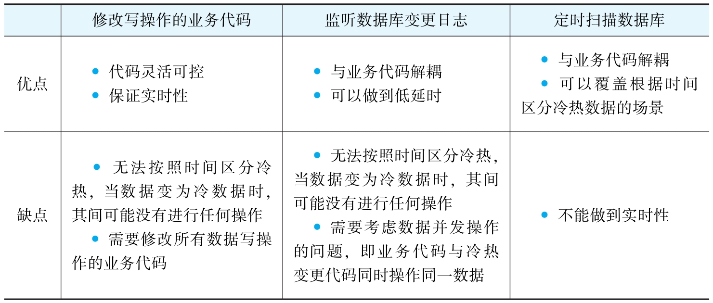

根据以上对比，可以得出每种触发逻辑的建议场景。

1.修改写操作的业务代码

建议在业务代码比较简单，并且不按照时间区分冷热数据时使用。

场景示例：假设是根据订单的状态来区分冷热数据，订单的状态不会随着时间自动变化，必须有人去修改才会变化，并且很容易找出所有修改订单状态的业务代码，这种情况下可以用这种触发逻辑。

2.监听数据库变更日志

建议在业务代码比较复杂，不能随意变更，并且不按时间区分冷热数据时使用。

示例场景跟上一场景类似：假设是根据订单的状态来区分冷热数据，订单的状态不会随着时间自动变化，必须有人去修改才会变化。其不一样的地方在于，业务代码很复杂，特别是有些用了很多年的系统中，修改订单状态的代码分布在多个位置，甚至多个服务中，不可能都找到，并且因为难以评估影响面，所以修改起来风险很大。这种情况下就适合使用监听数据库变更日志的方式。

3.定时扫描数据库

建议在按照时间区分冷热数据时使用。

示例场景就是这个项目中的业务场景。这里的业务需求是已经关闭超过1个月的工单视为冷数据，这种场景下，工单变更的那一瞬间，即使工单已经关闭了，也不能将其视为冷数据，而必须再等待1个月。这样的情况非常适合使用定时扫描。

所以这一次，项目组就选用了定时扫描数据库的触发方式。但是对于不同项目自身的场景，到底选择哪种触发方式，还是需要根据具体业务需求来决定。

#### 1.4.3 如何分离冷热数据

分离冷热数据的基本逻辑：

1. 判断数据是冷是热
2. 将要分离的数据插入冷数据库中
3. 从热数据库中删除分离的数据

实际做方案时，以下3点都要考虑在内：

这里提到的一致性要求是指如何保证任何一步出错后数据最终还是一致的。任何一个程序都要考虑在运行过程中突然出错中断时，应该怎么办。业务逻辑如下。

1.一致性：同时修改多个数据库，如何保证数据的一致性？

1. 找出符合冷数据的工单
2. 将这些工单添加到冷数据库
3. 将这些工单从热数据库中删除

这里的解决方案为，保证每一步都可以重试且操作都有幂等性，具体逻辑分为4步。

1. 在热数据库中给需要迁移的数据加标识：ColdFlag=WaittingForMove
2. 找出所有待迁移的数据（ColdFlag=WaittingForMove）
3. 在冷数据库中保存一份数据，但在保存逻辑中需要加个判断来保证幂等性
4. 从热数据库中删除对应的数据

2.数据量：假设数据量大，一次处理不完，该怎么办？是否需要使用批量处理？

假设每次可以迁移1000条数据。

1. 在热数据库中给需要的数据添加标识：ColdFlag=WaittingForMove。这个过程使用Update语句就可以完成，每次更新大概10万条记录
2. 找出前1000条待迁移的数据（ColdFlag=WaittingForMove）
3. 在冷数据库中保存一份数据
4. 从热数据库中删除对应的数据
5. 循环执行2）~4）

3.并发性：假设数据量大到要分到多个地方并行处理，该怎么办？

#### 1.4.4 如何使用冷热数据

#### 1.4.5 历史数据如何迁移

### 1.5 冷热分离二期实现思路：冷数据存放到HBase

#### 1.5.1 冷热分离一期解决方案的不足

冷热分离一期的解决方案确实能解决写操作慢和热数据慢的问题，但仍然存在诸多不足。

1. 用户查询冷数据的速度依旧很慢，虽然查询冷数据的用户比例很低
2. 冷数据库偶尔会告警

#### 1.5.2 归档工单的使用场景

对于归档的工单，与客服沟通后发现，基本只有以下几个查询动作。

1. 根据客户的邮箱查询归档工单
2. 根据工单ID查出该工单所有的处理记录

这些操作转化成技术需求就是：需要找到一个数据库，它可以满足下面的要求。

1. 可以存放上亿甚至数亿的数据。因为按照一年3000多万的工单来看，3年以后工单表的数据就上亿了，工单处理记录表的数据也会多出几亿
2. 支持简单的组合关键字查询，查询慢一些可以接受
3. 存放的数据不再需要变更。基于这个特性，就可以将历史工单的详情数据封装在一个文档中，类似于Key-Value，Key就是工单ID，Value就是工单详情数据

最后，项目组决定使用HBase来保存归档工单

## 第2章 查询分离

上一场景使用的冷热分离解决方案性价比高，可以快速交付，但它却不是一个最优的方案，仍然存在诸多不足。比如，业务功能上要求不能再修改冷数据，查询冷数据速度慢，无法承受复杂的查询和统计。

### 2.1 业务场景：千万工单表如何实现快速查询

本场景中的客服系统承接的是集团的所有业务，每条业务线的客服又分为多个渠道，有电话、在线聊天、微信、微博等。

它的业务流程是这样的：当客户接线进来以后，不管是通过什么渠道，客服都会登记一个客服工单，而后再根据业务线、工单的类型来登记不同的信息；工单创建后，会按需创建其他的单据，比如退款单、投诉单、充值单等，针对每个该工单的处理动作或工单关联单据的处理动作，也会自动添加工单处理记录和更新处理时间。

系统已经运作了5年左右，已有数据量大，而且随着集团业务的扩大，业务线增加，客服增多，工单数量的增长也越来越快，在系统中查询工单，以及打开工单详情的时候，就会出现响应速度很慢的情况。

项目组调研了查询慢和工单详情打开慢的问题，具体情况如下。

1. 查询慢。当时工单数据库里面有1000万左右的客服工单时，每次查询时需要关联其他近10个表，一次查询平均花费13秒左右
2. 打开工单慢。工单打开以后需要调用多个接口，分别将用户信息、订单信息以及其他客服创建的单据信息列出来（如退款、赔偿、充值、投诉等）。打开工单详情页需要近5秒

还有个思路：读写分离：MySQL有个主从架构，可以将所有对工单表的写操作转入MySQL的主库，所有对工单表的查询操作连接到MySQL的从库。读写分离的好处就是，读的请求和写的请求针对不同的数据库，彼此不会抢占数据库资源。而且，主库用InnoDB的存储引擎，从库用MyISM，MyISM不支持事务，但是性能更好。但是，使用这个方案得到的工单查询速度提升有限，所以最终没有采用。

### 2.2 查询分离简介

#### 2.2.1 何为查询分离

每次写数据时保存一份数据到其他的存储系统里，用户查询数据时直接从中获取数据

#### 2.2.2 何种场景下使用查询分离

1. 数据量大：比如单个表的行数有上千万，当然，如果几百万就出现查询慢的问题，也可以考虑使用
2. 查询数据的响应效率很低：因为表数据量大，或者关联查询太过复杂，导致查询很慢的情况
3. 所有写数据请求的响应效率尚可：虽然查询慢，但是写操作的响应速度还可以接受的情况
4. 所有数据任何时候都可能被修改和查询：这一点是针对冷热分离的，因为如果有些数据走入终态就不再用到，就可以归档到冷数据库了，不一定要用查询分离这个方案

### 2.3 查询分离实现思路

#### 2.3.1 如何触发查询分离

查询分离的触发逻辑分为3种

1. 修改业务代码，在写入常规数据后同步更新查询数据
2. 修改业务代码，在写入常规数据后，异步更新查询数据
3. 监控数据库日志，如有数据变更，则更新查询数据

3种触发逻辑的优缺点

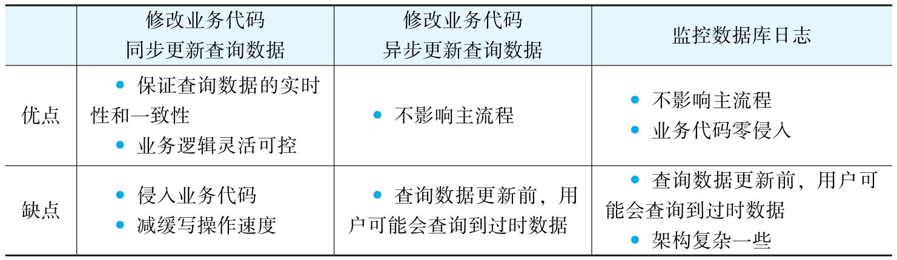

3种触发逻辑的适用场景

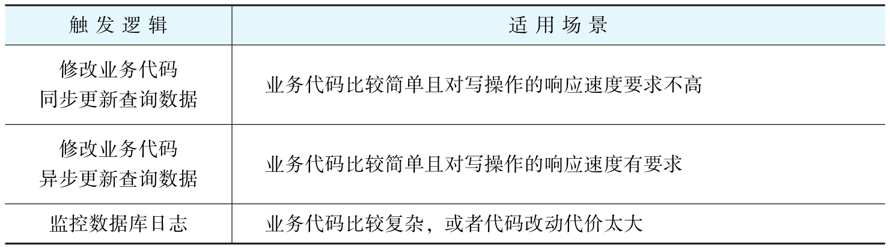

基于考虑，项目组最后选择了第2种方案：修改所有与工单写操作有关的业务代码，在更新完工单数据后，异步触发更新查询数据的逻辑，而后不等查询数据更新完成，就直接返回结果给客服。

#### 2.3.2 如何实现查询分离

问题5：消息的时序性问题。

比如某个订单A更新了一次数据变成A1，线程甲将A1的数据迁移到查询数据中。不一会儿，后台订单A又更新了一次数据变成A2，线程乙也启动工作，将A2的数据迁移到查询数据中。

此时解决方案为主数据每次更新时，都更新上次更新的时间last_update_time，然后每个线程更新查询数据后，检查当前工单A的last_update_time是否与线程刚开始获得的时间相同，以及NeedUpdateQueryData是否等于false，如果都满足，就将NeedUpdateQueryData改为true，然后再做一次迁移。

#### 2.3.3 查询数据如何存储

Elasticsearch

#### 2.3.4 查询数据如何使用

因Elasticsearch自带API，所以使用查询数据时，在查询业务代码中直接调用Elasticsearch的API即可。

不过要考虑一个场景：数据查询更新完前，查询数据不一致怎么办？举一个例子：假设更新工单的操作可以在100毫秒内完成，但是将新的工单同步到Elasticsearch需要2秒，那么在这2秒内，如果用户去查询，就可能查询到旧的工单数据。

这里分享两种解决思路。

1. 在查询数据更新到最新前，不允许用户查询。笔者团队没用过这种方案，但在其他实际项目中见到过
2. 给用户提示：“您目前查询到的数据可能是2秒前的数据，如果发现数据不准确，可以尝试刷新一下。”这种提示用户一般都能接受

#### 2.3.5 历史数据迁移

在这个方案里，只需要把所有的历史数据加上标识NeedUpdateQueryData=true，程序就会自动处理了。

#### 2.3.6 MQ+Elasticsearch的整体方案

1. 使用异步方式触发查询数据的同步。当工单修改后，会异步启动一个线程来同步工单数据到查询数据库
2. 通过MQ来实现异步的效果。MQ还做了两件事：①服务的解耦，将工单主业务系统和查询系统的服务解耦；②削峰，当修改工单的并发请求太多时，通过MQ控制同步查询数据库的线程数，防止查询数据库的同步请求太大
3. 将工单的查询数据存储在Elasticsearch中。因为Elasticsearch是一个分布式索引系统，天然就是用来做大数据的复杂查询的
4. 因为查询数据同步到Elasticsearch会有一定的延时，所以用户可能会查询到旧的工单数据，所以要给用户一些提示
5. 关于历史数据的迁移，因为是用字段NeedUpdateQueryData来标识工单是否需要同步，所以只要把所有历史数据的标识改成true，系统就会自动批量将历史数据同步到Elasticsearch

### 2.4 Elasticsearch注意事项

客观地说，Elasticsearch确实是个好工具，毕竟它在分布式开源搜索和分析引擎中处于领先地位。不过它也存在不少陷阱，以至于身边几个朋友经常抱怨Elasticsearch有多么不好用。

这里总结一些关于Elasticsearch的使用要点。

1. 如何使用Elasticsearch设计表结构？
2. Elasticsearch的存储结构。
3. Elasticsearch如何修改表结构？
4. Elasticsearch的准实时性。
5. Elasticsearch可能丢数据。
6. Elasticsearch分页。

#### 2.4.1 如何使用Elasticsearch设计表结构

Elasticsearch是基于索引的设计，它无法像MySQL那样使用join查询，所以查询数据时需要把每条主数据及关联子表的数据全部整合在一条记录中。

#### 2.4.2 Elasticsearch的存储结构

Elasticsearch是一个分布式的查询系统，它的每一个节点都是一个基于Lucene的查询引擎。下面通过与MySQL的概念对比来更快地理解Lucene。

1.Lucene和MySQL的概念对比

Lucene是一个索引系统，此处把Lucene与MySQL的一些概念做简单对照，见表2-4。

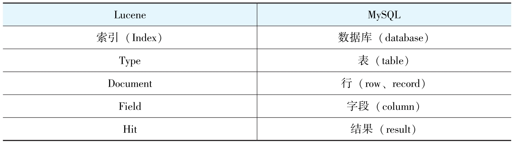

2.无结构文档的倒排索引

Lucene使用的是倒排索引的结构

假如有一些无结构的文档，见表2-5。

简单倒排索引后显示的结果见表2-6。

3.有结构文档的倒排索引

比如每个Doc都有多个Field，Field有不同的值（包含不同的Term），见表2-7。

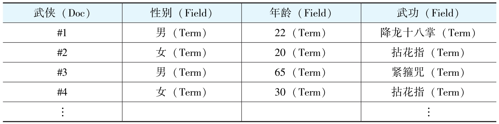

倒排表见表2-8~表2-10。

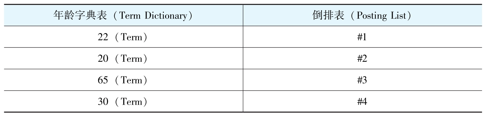

有结构的文档经过倒排索引后，字段中的每个值都是一个关键字，存放在Term Dictionary（词汇表）中，且每个关键字都有对应地址指向所在文档。

4.Elasticsearch的Document如何定义结构和字段格式？

#### 2.4.3 Elasticsearch如何修改表结构

如果想增加新的字段，Elasticsearch可以支持直接添加。因为修改字段的类型会导致索引失效，所以Elasticsearch不支持修改原来字段的类型。

如果想修改字段的映射，首先需要新建一个索引，然后使用Elasticsearch的reindex功能将旧索引复制到新索引中。

#### 2.4.4 陷阱一：Elasticsearch是准实时的吗

当更新数据至Elasticsearch且返回成功提示时，会发现通过Elasticsearch查询返回的数据仍然不是最新的，背后的原因究竟是什么？

因数据索引的整个过程涉及Elasticsearch的Shard（分片），以及Lucene Index、Segment、Document三者之间的关系等知识点，所以有必要先对这些内容进行说明。

因数据索引的整个过程涉及Elasticsearch的Shard（分片），以及Lucene Index、Segment、Document三者之间的关系等知识点，所以有必要先对这些内容进行说明。

Elasticsearch的一个Shard（Elasticsearch分片的具体介绍可参考官方文档）就是一个Lucene Index（索引），每一个Lucene Index由多个Segment（段）构成，即Lucene Index的子集就是Segment，如图2-9所示。

Lucene Index、Segment、Document（Doc）三者之间的关系如图2-10所示。

通过图2-10可以知道，一个Lucene Index可以存放多个Segment，而每个Segment又可以存放多个Document。

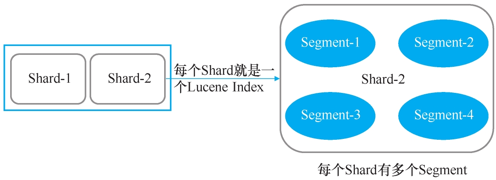

1. 当新的Document被创建时，数据首先会存放到新的Segment中，同时旧的Document会被删除，并在原来的Segment上标记一个删除标识。当Document被更新时，旧版Document会被标识为删除，并将新版Document存放在新的Segment中
2. Shard收到写请求时，请求会被写入Translog中，然后Document被存放在Memory Buffer（内存缓冲区）中，最终Translog保存所有修改记录，如图2-11所示
3. 每隔1秒（默认设置），Refresh（刷新）操作被执行一次，且Memory Buffer中的数据会被写入一个Segment，并存放在File System Cache（文件系统缓存）中，这时新的数据就可以被搜索到了，如图2-12所示

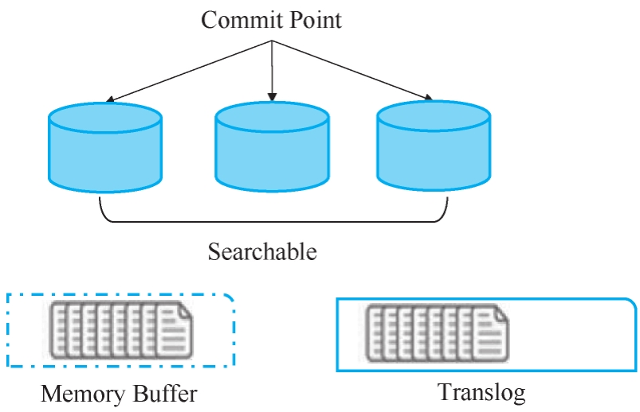

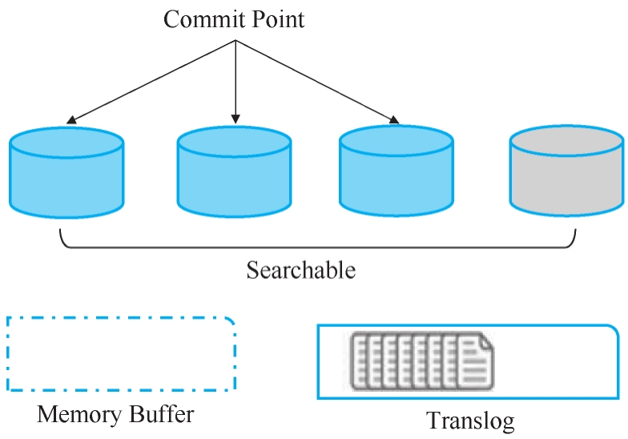

通过以上数据索引过程的说明，可以发现Elasticsearch并不是实时的，而是有1秒延时。延时问题的解决方案在前面介绍过，提示用户查询的数据会有一定延时即可。

#### 2.4.5 陷阱二：Elasticsearch宕机恢复后，数据丢失

上一小节中提及每隔1秒（根据配置）Memory Buffer中的数据会被写入Segment中，此时这部分数据可被用户搜索到，但没有持久化，一旦系统宕机，数据就会丢失，如图2-12最右边的桶所示。

如何防止数据丢失呢？使用Lucene中的Commit操作就能轻松解决这个问题。

Commit操作方法：先将多个Segment合并保存到磁盘中，再将灰色的桶变成图2-12中蓝色的桶。

使用Commit操作存在一点不足：耗费I/O，从而引发Elasticsearch在Commit之前宕机的问题。一旦系统在Translog执行fsync函数之前宕机，数据也会直接丢失，如何保证Elasticsearch数据的完整性便成了亟待解决的问题。

遇到这种情况，通过Translog解决即可，因为Translog中的数据不会直接保存在磁盘中，只有使用fsync函数后才会保存。具体实现方式有两种。

1. 将index.translog.durability设置成request，其缺点就是耗费资源，性能差一些，如果发现启用这个配置后系统运行得不错，采用这种方式即可
2. 将index.translog.durability设置为fsync，每次Elasticsearch宕机启动后，先将主数据和Elasticsearch数据进行对比，再将Elasticsearch缺失的数据找出来

#### 2.4.6 陷阱三：分页越深，查询效率越低

Elasticsearch分页这个陷阱的出现，与Elasticsearch读操作请求的处理流程密切关联，如图2-13所示。

Elasticsearch的读操作流程主要分为两个阶段：Query Phase、Fetch Phase。

1. Query Phase：协调的节点先把请求分发到所有分片，然后每个分片在本地查询后建一个结果集队列，并将命令中的Document ID以及搜索分数存放在队列中，再返回给协调节点，最后协调节点会建一个全局队列，归并收到的所有结果集并进行全局排序。

> 在Elasticsearch查询过程中，如果search方法带有from和size参数，Elasticsearch集群需要给协调节点返回分片数*（from+size）条数据，然后在单机上进行排序，最后给客户端返回size大小的数据。比如客户端请求10条数据，有3个分片，那么每个分片会返回10条数据，协调节点最后会归并30条数据，但最终只返回10条数据给客户端。

2. Fetch Phase：协调节点先根据结果集里的Document ID向所有分片获取完整的Document，然后所有分片返回完整的Document给协调节点，最后协调节点将结果返回给客户端。

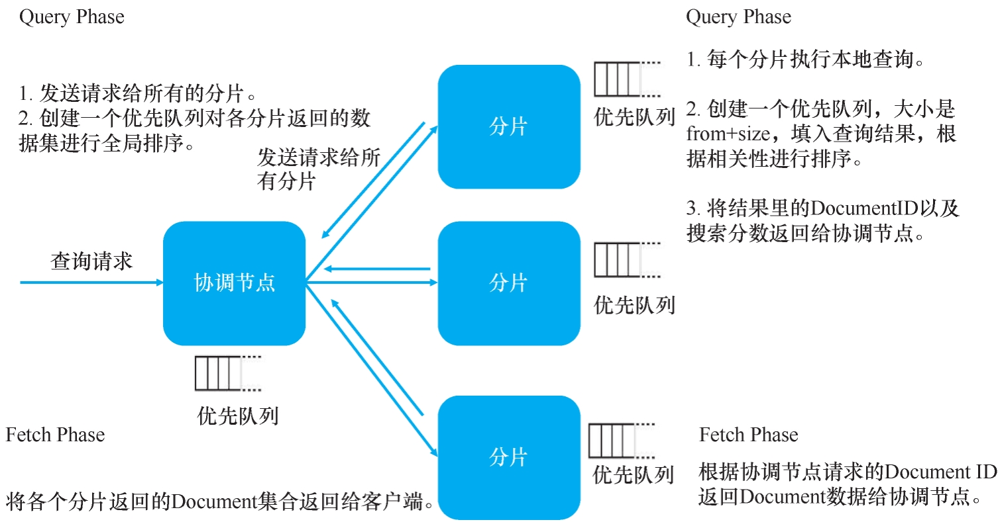

比如有5个分片，需要查询排序序号从10000到10010（from=10000，size=10）的结果，每个分片到底返回多少数据给协调节点计算呢？不是10条，是10010条。也就是说，协调节点需要在内存中计算10010*5=50050条记录，所以在系统使用中，用户分页越深查询速度会越慢，也就是说分页并不是越多越好。

那如何更好地解决Elasticsearch分页问题呢？为了控制性能，可以使用Elas-ticsearch中的max_result_window进行配置，这个数据默认为10000，当from+size>max result window时，Elasticsearch将返回错误。

这个配置就是要控制用户翻页不能太深，而这在现实场景中用户也能接受，本项目的方案就采用了这种设计方式。如果用户确实有深度翻页的需求，使用Elasticsearch中search_after的功能也能解决，只是无法实现跳页了。

### 2.5 小结

1. 使用Elasticsearch存储查询数据时，就要接受上面列出的一些局限性：有一定延时，深度分页不能自由跳页，会有丢数据的可能性
2. 主数据量越来越大后，写操作还是慢，到时还是会出问题。比如这里的工单数据，虽然已经去掉了所有外键，但是当数据量上亿的时候，插入还是会有问题
3. 主数据和查询数据不一致时，如果业务逻辑需要查询数据保持一致性呢？这里的查询数据同步到最新数据会有一定的延时，大约为2秒。某些业务场景下用户可能无法接受这个延时，特别是跟钱有关的场景

架构“没有银弹”，不能期望一个解决方案既能覆盖所有的问题，还能实现最小的成本损耗

## 第3章 分表分库

第2章讲到，查询分离的方案存在三大不足，其中一个就是：当主数据量越来越大时，写操作会越来越缓慢。

### 3.1 业务场景：亿级订单数据如何实现快速读写

### 3.2 拆分存储的技术选型

拆分存储常用的技术解决方案目前主要分为4种：MySQL的分区技术、NoSQL、NewSQL、基于MySQL的分表分库。

#### 3.2.1 MySQL的分区技术

MySQL的分区技术主要体现在图3-1中的文件存储层File System，它可以将一张表的不同行存放在不同的存储文件中，这对使用者来说比较透明。

1. MySQL的实例只有一个，它仅仅分摊了存储，无法分摊请求负载
2. 正是因为MySQL的分区对用户透明，所以用户在实际操作时往往不太注意，如果SQL跨了分区，那么操作就会严重影响系统性能
3. MySQL还有一些其他限制，比如不支持query cache、位操作表达式等。感兴趣的读者可以查看官方文档中的相关内容https://dev.mysql.com/doc/refman/5.7/en/partitioning-limitations.html

#### 3.2.2 NoSQL

比较典型的NoSQL数据库就是MongoDB。MongoDB的分片功能从并发性和数据量这两个角度已经能满足一般大数据量的需求，但是还需要注意下面3点。

1. 约束考量：MongoDB不是关系型数据库而是文档型数据库，它的每一行记录都是一个结构灵活可变的JSON，比如存储非常重要的订单数据时，就不能使用MongoDB，因为订单数据必须使用强约束的关系型数据库进行存储。举个例子，订单里面有金额相关的字段，这是系统里面的核心数据，所以必须保证每个订单数据都有这些金额相关的字段，并且不管是怎样的业务逻辑修改，这些字段都要保存好，这时可以通过数据库的能力加一层校验，这样即使业务代码出了问题，导致这些字段存储不正确，也可以在数据库这一层面阻隔问题。
2. 业务功能考量：订单这种跟交易相关的数据肯定要支持事务和并发控制，而这些并不是MongoDB的强项。而且除了这些功能以外，多年来，事务、锁、SQL、表达式等各种各样的操作都在MySQL身上一一实践过，MySQL可以说是久经考验，因此在功能上MySQL能满足项目所有的业务需求，MongoDB却不一定能，且大部分的NoSQL也存在类似复杂功能支持的问题
3. 稳定性考量：人们对MySQL的运维已经很熟悉了，它的稳定性没有问题，然而MongoDB的稳定性无法保证，毕竟很多人不熟悉

#### 3.2.3 NewSQL

NewSQL技术还比较新，笔者曾经想在一些不重要的数据中使用NewSQL（比如TiDB），但从稳定性和功能扩展性两方面考量后，最终没有使用。

#### 3.2.4 基于MySQL的分表分库

最后说一下基于MySQL的分表分库：分表是将一份大的表数据进行拆分后存放至多个结构一样的拆分表中；分库就是将一个大的数据库拆分成类似于多个结构的小数据库。

分表分库对于第三方依赖较少，业务逻辑灵活可控，它本身并不需要非常复杂的底层处理，也不需要重新做数据库，只是根据不同逻辑使用不同SQL语句和数据源而已，因此，之后出问题的时候也能够较快地找出根源。

如果使用分表分库，有3个通用技术需求需要实现。

1. SQL组合：因为关联的表名是动态的，所以需要根据逻辑组装动态的SQL
2. 数据库路由：因为数据库名也是动态的，所以需要通过不同的逻辑使用不同的数据库
3. 执行结果合并：有些需求需要通过多个分库执行后再合并归集起来

而目前能解决以上问题的中间件分为两类：Proxy模式、Client模式

1. Proxy模式：图3-2所示为ShardingSphere官方文档中的Proxy模式图，重点看中间的Sharding-Proxy层。

这种设计模式将SQL组合、数据库路由、执行结果合并等功能全部放在了一个代理服务中，而与分表分库相关的处理逻辑全部放在了其他服务中，其优点是对业务代码无侵入，业务只需要关注自身业务逻辑即可。

2. Client模式：ShardingSphere官方文档中的Client模式如图3-3所示。这种设计模式将分表分库相关逻辑放在客户端，一般客户端的应用会引用一个jar，然后在jar中处理SQL组合、数据库路由、执行结果合并等相关功能。

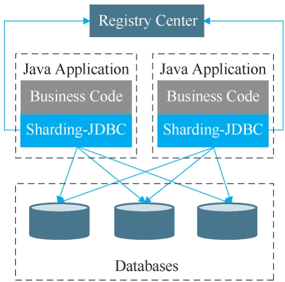

表3-2 常见分表分库中间件

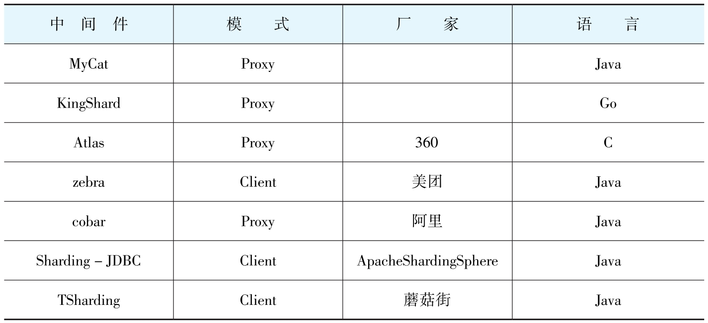

Client模式与Proxy模式的优缺点

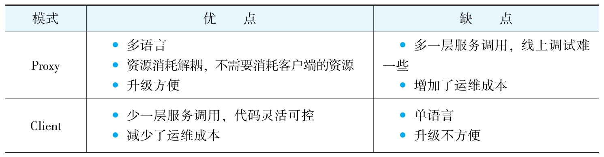

### 3.3 分表分库实现思路

技术选型这一难题解决后，具体如何落实分表分库方案呢？需要考虑5个要点。

1. 使用什么字段作为分片主键？
2. 分片的策略是什么？
3. 业务代码如何修改？
4. 历史数据如何迁移？
5. 未来的扩容方案是什么

#### 3.3.1 使用什么字段作为分片主键

#### 3.3.2 分片的策略是什么

目前通用的分片策略分为根据范围分片、根据Hash值分片、根据Hash值及范围混合分片这3种

#### 3.3.3 业务代码如何修改

1. 如果使用微服务，对于特定表的分表分库，其影响面只为该表所在的服务，而如果是一个单体架构的应用做分表分库，那会很麻烦。因为单体架构里面会有很多的跨表关联查询，也就是说，很多地方会直接与订单表一起进行Join查询，这种情况下，要想将订单数据拆分到多个库、多个表中，修改的代码就会非常多
2. 在互联网架构中，基本不使用外键约束
3. 分库分表以后，与订单有关的一些读操作都要考虑对应的数据是在哪个库哪个表。可以的话，尽量避免跨库或跨表查询

#### 3.3.4 历史数据如何迁移

历史数据的迁移非常耗时，迁移几天几夜都很正常。而在互联网行业中，别说几天几夜，就算停机几分钟，业务都可能无法接受，这就要求给出一个无缝迁移的解决方案

讲解查询分离时提过一个方案，就是监控数据库变更日志，将数据库变更的事件变成消息，存到消息系统，然后有个消费者订阅消息，再将变动的数据同步到查询数据库

#### 3.3.5 未来的扩容方案是什么

### 3.4 小结

该方案还有一些不足之处。

1. 复杂查询慢：很多查询需要跨订单数据库进行，然后再组合结果集，这样的查询比较慢。业界的普遍做法是前面提到的查询分离。第2章讲了单独使用Elasticsearch做查询分离的方案，这里分表分库的二期项目也进行了查询分离，只是查询数据存到了Elasticsearch和HBase中。Elasticsearch存放订单ID、用来查询关键字的字段以及查询页面列表里用到的字段，HBase存放订单的全量数据。Elasticsearch先根据用户的查询组合返回查询结果到查询页面。用户点击特定的订单，就能根据订单ID去HBase获取订单的全量数据。
2. 增量数据迁移的高可用性和一致性：如果是自己编写迁移的代码，那就参考前面冷热分离和查询分离的迁移逻辑；也可以使用开源工具，这个方案在后面数据同步的场景中会单独展开。
3. 短时订单量大爆发：分表分库可以解决数据量大的问题，但是如果瞬时流量非常大，数据库撑不住怎么办？这一问题会在后面的缓存和秒杀架构等场景中专门展开

# 第2部分 缓存层场景实战

## 第4章 读缓存

### 4.1 业务场景：如何将十几秒的查询请求优化成毫秒级

### 4.2 缓存中间件技术选型（Memcached,MongoDB,Redis）

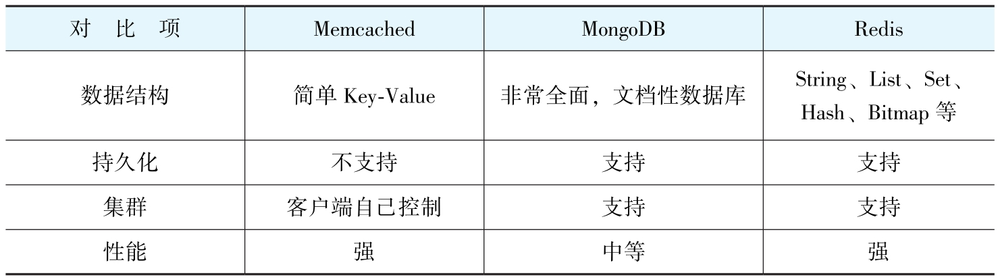

Redis比Memcached更流行：

1. 数据结构
2. 持久化
3. 集群

Memcached的集群设计非常简单，客户端根据Hash值直接判断存取的Memcached节点。而Redis的集群因在高可用、主从、冗余、Failover等方面都有所考虑，所以集群设计相对复杂些，属于较常规的分布式高可用架构

### 4.3 缓存何时存储数据

数据库的崩溃可以分为3种情况。

1. 单一数据过期或者不存在，这种情况称为缓存击穿
2. 数据大面积过期或者Redis宕机，这种情况称为缓存雪崩
3. 一个恶意请求获取的Key不在数据库中，这种情况称为缓存穿透

最后说一下缓存预热。

上面这些逻辑都是在确保查询数据的请求已经过来后如何适当地处理，最理想的就是在用户请求过来之前把数据都缓存到Redis中，其具体做法就是在深夜无人访问或访问量小的时候，将预热的数据保存到缓存中，这样流量大的时候，用户查询就无须再从数据库读取数据了，将大大减小数据读取压力。

### 4.4 如何更新缓存

#### 4.4.1 组合1：先更新缓存，再更新数据库

#### 4.4.2 组合2：先删除缓存，再更新数据库

#### 4.4.3 组合3：先更新数据库，再更新缓存

#### 4.4.4 组合4：先更新数据库，再删除缓存

#### 4.4.5 组合5：先删除缓存，更新数据库，再删除缓存

### 4.5 缓存的高可用设计

设计高可用方案时，需要考虑5个要点。

1. 负载均衡：是否可以通过加节点的方式来水平分担读请求压力
2. 分片：是否可以通过划分到不同节点的方式来水平分担写压力
3. 数据冗余：一个节点的数据如果失效，其他节点的数据是否可以直接承担失效节点的职责
4. Failover：任何节点失效后，集群的职责是否可以重新分配以保障集群正常工作
5. 一致性保证：在数据冗余、Failover、分片机制的数据转移过程中，如果某个地方出了问题，能否保证所有的节点数据或节点与数据库之间数据的一致性（依靠Redis本身是不行的）

### 4.6 缓存的监控

## 第5章 写缓存

### 5.1 业务场景：如何以最小代价解决短期高频写请求

某公司策划了一场超低价预约大型线上活动，在某天9:00~9:15期间，用户可以前往详情页半价预约抢购一款热门商品。根据市场部门的策划方案，这次活动的运营目标是几十万左右的预约量。

假设目标是15分钟完成100万的预约数据插入，并且不是在15分钟内平均插入的。按照以往的经验，有可能在1分钟内就完成90%的预约，也有可能在5分钟内完成80%的预约，这些难以预计。但是峰值流量预估值只能取高，不能取低。所以设计的目标是：用户1分钟内就完成90%的预约量，即90万预约。那么推算出目标的TPS（吞吐量）就是9万/60=1.5万。

项目最终采用的方案是不让预约的请求直接插入数据库，而是先存放到性能很高的缓冲地带，以此保证洪峰期间先冲击缓冲地带，之后再从缓冲地带异步、匀速地迁移数据到数据库中。

### 5.2 写缓存

写缓存的思路是后台服务接收到用户请求时，如果请求校验没问题，数据并不会直接落库，而是先存储在缓存层中，缓存层中写请求达到一定数量时再进行批量落库

### 5.3 实现思路

具体实施过程中要考虑6个问题

1. 写请求与批量落库这两个操作同步还是异步？
2. 如何触发批量落库？
3. 缓冲数据存储在哪里？
4. 缓存层并发操作需要注意什么？
5. 批量落库失败了怎么办？
6. Redis的高可用配置

#### 5.3.1 写请求与批量落库这两个操作同步还是异步

对于同步，写请求提交数据后，当前写操作的线程会等到批量落库完成后才开始启动。这种设计的优点是用户预约成功后，可在“我的预约”页面立即看到预约数据；缺点是用户提交预约后，还需要等待一段时间才能返回结果，且这个时间不定，有可能需要等待一个完整的时间窗

对于异步，写请求提交数据后，会直接提示用户提交成功。这种设计的优点是用户能快速知道提交结果；缺点是用户提交完成后，如果查看“我的预约”页面，可能会出现没有数据的情况

关于异步的用户体验设计，共有两种设计方案可供业务方选择。1）在“我的预约”页面给用户一个提示：您的预约订单可能会有一定延迟。2）用户预约成功后，直接进入预约完成详情页，此页面会定时发送请求去查询后台批量落库的状态，如果落库成功，则弹出成功提示，并跳转至下一个页面

#### 5.3.2 如何触发批量落库

关于批量落库触发逻辑，目前共分为两种。1）写请求满足特定次数后就落库一次，比如10个请求落库一次。2）每隔一个时间窗口落库一次，比如每隔一秒落库一次

当时项目采用的方案是同时使用这两种方式。具体实现逻辑如下。1）每收集一次写请求，就插入预约数据到缓存中，再判断缓存中预约的总数是否达到一定数量，达到后直接触发批量落库。2）开一个定时器，每隔一秒触发一次批量落库

#### 5.3.3 缓存数据存储在哪里

缓存数据不仅可以存放在本地内存中，也可以存放在分布式缓存中（比如Redis），其中最简单的方式是存放在本地内存中

#### 5.3.4 缓存层并发操作需要注意什么

#### 5.3.5 批量落库失败了怎么办

在考虑落库失败这个问题之前，先来看看批量落库的实现逻辑。1）当前线程从缓存中获取所有数据。因为每10条执行一次落库操作，不需要担心缓存中的数据量过多，所以也不用考虑将获得的数据分批操作了。2）当前线程批量保存数据到数据库。3）当前线程从缓存中删除对应数据（注意：不能直接清空缓存的数据，因为新的预约数据可能插入到缓存中了）。
