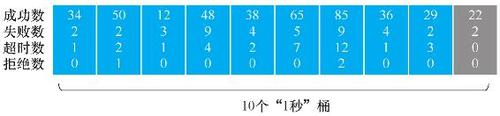

# 从程序员到架构师：大数据量、缓存、高并发、微服务、多团队协同等核心场景实战

- 作者：王伟杰
- 出版社：机械工业出版社
- 出版时间：2022-03
- ISBN：978-7-5097-6324-7
- 豆瓣：https://book.douban.com/subject/35834352
- 在线：https://book.qq.com/book-read/44175269/14
- 封面：

# 第1部分 数据持久化层场景实战

## 第1章 冷热分离

### 1.1 业务场景：几千万数据量的工单表如何快速优化

这次项目优化的是一个邮件客服系统。它是一个SaaS（通过网络提供软件服务）系统，但是大客户只有两三家，最主要的客户是一家大型媒体集团。

这个系统的主要功能是这样的：它会对接客户的邮件服务器，自动收取发到几个特定客服邮箱的邮件，每收到一封客服邮件，就自动生成一个工单。之后系统就会根据一些规则将工单分派给不同的客服专员处理。

这个系统是支持多租户的，每个租户使用自己的数据库（MySQL）。

这家媒体集团客户两年多产生了近2000万的工单，工单的操作记录近1亿。

平时客服在工单页面操作时，打开或者刷新工单列表需要10秒钟左右。

该客户当时做了一个业务上的变更，增加了几个客服邮箱，然后把原来不进入邮件客服系统的一些客户邮件的接收人改为这几个新增加的客服邮箱，并接入这个系统。

发生这个业务变更以后，工单数量急剧增长，工单列表打开的速度越来越慢，后来客服的负责人发了封邮件，言辞急切，要求尽快改善性能。

项目组收到邮件后，详细分析了一下当时的数据状况，情况如下：

1. 工单表已经达到3000万条数据。
2. 工单表的处理记录表达到1.5亿条数据。
3. 工单表每日以10万的数据量在增长。

当时系统性能已经严重影响了客服的处理效率，需要放在第一优先级解决，客户给的期限是1周。

### 1.2 数据库分区，从学习到放弃

数据库分区有以下优点：

1. 比起单个文件系统或硬盘，分区可以存储更多的数据。
2. 在清理数据时，可以直接删除废弃数据所在的分区。同样，有新数据时，可以增加更多的分区来存储新数据。
3. 可以大幅度地优化特定的查询，让这些查询语句只去扫描特定分区的数据。比如，原来有2000万的数据，设计10个分区，每个分区存200万的数据，那么可以优化查询语句，让它只去查询其中两个分区，即只需要扫描400万的数据。

第3个优点正好可以解决此处的项目需求。但是，要怎么设计分区字段？也就是说，要根据什么来分区？

MySQL的分区还有个限制，即分区字段必须是唯一索引（主键也是唯一索引）的一部分。工单表是用ticketID当主键，也就是说接下来无论使用什么当分区字段，都必须把它加到主键当中，形成复合主键。MySQL官方文档原文如下：

> All columns used in the partitioning expression for a partitioned table must be part of every unique key that the table may have.
>
> In other words,every unique key on the table must use every column in the table's partitioning expression（This also includes the table's primary key, since it is by definition a unique key.This particular case is discussed later in this section）.

接着深入分析一下业务流程：

1. 系统从邮件服务器同步到邮件以后，创建一个工单，createdTime就是工单创建的时间。
2. 客服先去查询无处理人的工单，然后把工单分派给自己。
3. 客服处理工单，每处理一次，系统自动增加一条处理记录。
4. 客服处理完工单以后，将工单状态改为“关闭”。

通过跟客服的交流，项目组发现，一般工单被关闭以后，客服查询的概率就很低了。对于那些关闭超过一个月的工单，基本上一年都打开不了几次。

调研到这里，基本的思路是增加一个状态：归档。首先将关闭超过一个月以上的工单自动转为“归档”状态，然后将数据库分为两个区，所有“归档”状态的工单存放在一个区，所有非“归档”状态的工单存放在另外一个区，最后在所有的查询语句中加一个条件，就是状态不等于“归档”。

简单估算一下：客服频繁操作的工单基本上都是1个月内的工单，按照后期一天10万来算，也就是300万的数据，这样数据库的非归档区基本就没什么压力了。

那么，是否就将status设为分区字段，然后直接使用MySQL的分区功能？不是的。

因为相关的开发人员并没有用过数据库分区的功能，而当时面临的情况是只有1周的时间来解决问题，并且工单表是系统最核心的数据表，不能出问题。

这种情况下，没人敢在生产的核心功能上使用一项没用过的技术，但是项目组评估了一下，要实现一个类似的方案，其实工作量并不大，而且代码可控。因此，项目组放弃了数据库分区，并决定基于同样的分区理念，使用自己熟悉的技术来实现这个功能。

这个思路也很简单：新建一个数据库，然后将1个月前已经完结的工单数据都移动到这个新的数据库。这个数据库就叫冷库，因为里面基本是冷数据（当然，叫作归档数据库也可以），之后极少被访问。当前的数据库保留正常处理的较新的工单数据，这是热库。

这样处理后，因为客服查询的基本是近期常用的数据，大概只有300万条，性能就基本没问题了。即使因为查询频繁，或者几个客服同时查询，也不会再像之前那样出现数据库占满CPU、整个系统几乎宕机的情况了。

上面这个方法，其实就是软件系统常用的“冷热分离”。

### 1.3 冷热分离简介

#### 1.3.1 什么是冷热分离

冷热分离就是在处理数据时将数据库分成冷库和热库，冷库存放那些走到终态、不常使用的数据，热库存放还需要修改、经常使用的数据。

#### 1.3.2 什么情况下使用冷热分离

假设业务需求出现了以下情况，就可以考虑使用冷热分离的解决方案。

1. 数据走到终态后只有读没有写的需求，比如订单完结状态。
2. 用户能接受新旧数据分开查询，比如有些电商网站默认只让查询3个月内的订单，如果要查询3个月前的订单，还需要访问其他的页面。

### 1.4 冷热分离一期实现思路：冷热数据都用MySQL

当决定用冷热分离之后，项目组就开始考虑使用一个性价比最高的冷热分离方案。因为资源有限、工期又短，冷热分离一期有一个主导原则，即热数据跟冷数据使用一样的存储（MySQL）和数据结构，这样工作量最少，等到以后有时间再做冷热分离二期

问题：

1. 如何判断一个数据是冷数据还是热数据？
2. 如何触发冷热数据分离？
3. 如何实现冷热数据分离？
4. 如何使用冷热数据？
5. 历史数据如何迁移？

#### 1.4.1 如何判断一个数据到底是冷数据还是热数据

一般而言，在判断一个数据到底是冷数据还是热数据时，主要采用主表里一个字段或多个字段的组合作为区分标识。

这个字段可以是时间维度，比如“下单时间”，可以把3个月前的订单数据当作冷数据，3个月内的订单数据当作热数据。

当然，这个字段也可以是状态维度，比如根据“订单状态”字段来区分，将已完结的订单当作冷数据，未完结的订单当作热数据。

还可以采用组合字段的方式来区分，比如把下单时间小于3个月且状态为“已完结”的订单标识为冷数据，其他的当作热数据。

关于判断冷热数据的逻辑，这里还有两个要点必须说明。

1. 如果一个数据被标识为冷数据，业务代码不会再对它进行写操作。
2. 不会同时存在读取冷、热数据的需求。

#### 1.4.2 如何触发冷热数据分离

一般来说，冷热数据分离的触发逻辑分为3种。

1）直接修改业务代码，使得每次修改数据时触发冷热分离（比如每次更新订单的状态时，就去触发这个逻辑）

2）如果不想修改原来的业务代码，可以通过监听数据库变更日志binlog的方式来触发

3）通过定时扫描数据库的方式来触发

下面给出它们各自的优缺点：

根据以上对比，可以得出每种触发逻辑的建议场景。

1.修改写操作的业务代码

建议在业务代码比较简单，并且不按照时间区分冷热数据时使用。

场景示例：假设是根据订单的状态来区分冷热数据，订单的状态不会随着时间自动变化，必须有人去修改才会变化，并且很容易找出所有修改订单状态的业务代码，这种情况下可以用这种触发逻辑。

2.监听数据库变更日志

建议在业务代码比较复杂，不能随意变更，并且不按时间区分冷热数据时使用。

示例场景跟上一场景类似：假设是根据订单的状态来区分冷热数据，订单的状态不会随着时间自动变化，必须有人去修改才会变化。其不一样的地方在于，业务代码很复杂，特别是有些用了很多年的系统中，修改订单状态的代码分布在多个位置，甚至多个服务中，不可能都找到，并且因为难以评估影响面，所以修改起来风险很大。这种情况下就适合使用监听数据库变更日志的方式。

3.定时扫描数据库

建议在按照时间区分冷热数据时使用。

示例场景就是这个项目中的业务场景。这里的业务需求是已经关闭超过1个月的工单视为冷数据，这种场景下，工单变更的那一瞬间，即使工单已经关闭了，也不能将其视为冷数据，而必须再等待1个月。这样的情况非常适合使用定时扫描。

所以这一次，项目组就选用了定时扫描数据库的触发方式。但是对于不同项目自身的场景，到底选择哪种触发方式，还是需要根据具体业务需求来决定。

#### 1.4.3 如何分离冷热数据

分离冷热数据的基本逻辑：

1. 判断数据是冷是热
2. 将要分离的数据插入冷数据库中
3. 从热数据库中删除分离的数据

实际做方案时，以下3点都要考虑在内：

这里提到的一致性要求是指如何保证任何一步出错后数据最终还是一致的。任何一个程序都要考虑在运行过程中突然出错中断时，应该怎么办。业务逻辑如下。

1.一致性：同时修改多个数据库，如何保证数据的一致性？

1. 找出符合冷数据的工单
2. 将这些工单添加到冷数据库
3. 将这些工单从热数据库中删除

这里的解决方案为，保证每一步都可以重试且操作都有幂等性，具体逻辑分为4步。

1. 在热数据库中给需要迁移的数据加标识：ColdFlag=WaittingForMove
2. 找出所有待迁移的数据（ColdFlag=WaittingForMove）
3. 在冷数据库中保存一份数据，但在保存逻辑中需要加个判断来保证幂等性
4. 从热数据库中删除对应的数据

2.数据量：假设数据量大，一次处理不完，该怎么办？是否需要使用批量处理？

假设每次可以迁移1000条数据。

1. 在热数据库中给需要的数据添加标识：ColdFlag=WaittingForMove。这个过程使用Update语句就可以完成，每次更新大概10万条记录
2. 找出前1000条待迁移的数据（ColdFlag=WaittingForMove）
3. 在冷数据库中保存一份数据
4. 从热数据库中删除对应的数据
5. 循环执行2）~4）

3.并发性：假设数据量大到要分到多个地方并行处理，该怎么办？

#### 1.4.4 如何使用冷热数据

#### 1.4.5 历史数据如何迁移

### 1.5 冷热分离二期实现思路：冷数据存放到HBase

#### 1.5.1 冷热分离一期解决方案的不足

冷热分离一期的解决方案确实能解决写操作慢和热数据慢的问题，但仍然存在诸多不足。

1. 用户查询冷数据的速度依旧很慢，虽然查询冷数据的用户比例很低
2. 冷数据库偶尔会告警

#### 1.5.2 归档工单的使用场景

对于归档的工单，与客服沟通后发现，基本只有以下几个查询动作。

1. 根据客户的邮箱查询归档工单
2. 根据工单ID查出该工单所有的处理记录

这些操作转化成技术需求就是：需要找到一个数据库，它可以满足下面的要求。

1. 可以存放上亿甚至数亿的数据。因为按照一年3000多万的工单来看，3年以后工单表的数据就上亿了，工单处理记录表的数据也会多出几亿
2. 支持简单的组合关键字查询，查询慢一些可以接受
3. 存放的数据不再需要变更。基于这个特性，就可以将历史工单的详情数据封装在一个文档中，类似于Key-Value，Key就是工单ID，Value就是工单详情数据

最后，项目组决定使用HBase来保存归档工单

## 第2章 查询分离

上一场景使用的冷热分离解决方案性价比高，可以快速交付，但它却不是一个最优的方案，仍然存在诸多不足。比如，业务功能上要求不能再修改冷数据，查询冷数据速度慢，无法承受复杂的查询和统计。

### 2.1 业务场景：千万工单表如何实现快速查询

本场景中的客服系统承接的是集团的所有业务，每条业务线的客服又分为多个渠道，有电话、在线聊天、微信、微博等。

它的业务流程是这样的：当客户接线进来以后，不管是通过什么渠道，客服都会登记一个客服工单，而后再根据业务线、工单的类型来登记不同的信息；工单创建后，会按需创建其他的单据，比如退款单、投诉单、充值单等，针对每个该工单的处理动作或工单关联单据的处理动作，也会自动添加工单处理记录和更新处理时间。

系统已经运作了5年左右，已有数据量大，而且随着集团业务的扩大，业务线增加，客服增多，工单数量的增长也越来越快，在系统中查询工单，以及打开工单详情的时候，就会出现响应速度很慢的情况。

项目组调研了查询慢和工单详情打开慢的问题，具体情况如下。

1. 查询慢。当时工单数据库里面有1000万左右的客服工单时，每次查询时需要关联其他近10个表，一次查询平均花费13秒左右
2. 打开工单慢。工单打开以后需要调用多个接口，分别将用户信息、订单信息以及其他客服创建的单据信息列出来（如退款、赔偿、充值、投诉等）。打开工单详情页需要近5秒

还有个思路：读写分离：MySQL有个主从架构，可以将所有对工单表的写操作转入MySQL的主库，所有对工单表的查询操作连接到MySQL的从库。读写分离的好处就是，读的请求和写的请求针对不同的数据库，彼此不会抢占数据库资源。而且，主库用InnoDB的存储引擎，从库用MyISM，MyISM不支持事务，但是性能更好。但是，使用这个方案得到的工单查询速度提升有限，所以最终没有采用。

### 2.2 查询分离简介

#### 2.2.1 何为查询分离

每次写数据时保存一份数据到其他的存储系统里，用户查询数据时直接从中获取数据

#### 2.2.2 何种场景下使用查询分离

1. 数据量大：比如单个表的行数有上千万，当然，如果几百万就出现查询慢的问题，也可以考虑使用
2. 查询数据的响应效率很低：因为表数据量大，或者关联查询太过复杂，导致查询很慢的情况
3. 所有写数据请求的响应效率尚可：虽然查询慢，但是写操作的响应速度还可以接受的情况
4. 所有数据任何时候都可能被修改和查询：这一点是针对冷热分离的，因为如果有些数据走入终态就不再用到，就可以归档到冷数据库了，不一定要用查询分离这个方案

### 2.3 查询分离实现思路

#### 2.3.1 如何触发查询分离

查询分离的触发逻辑分为3种

1. 修改业务代码，在写入常规数据后同步更新查询数据
2. 修改业务代码，在写入常规数据后，异步更新查询数据
3. 监控数据库日志，如有数据变更，则更新查询数据

3种触发逻辑的优缺点

3种触发逻辑的适用场景

基于考虑，项目组最后选择了第2种方案：修改所有与工单写操作有关的业务代码，在更新完工单数据后，异步触发更新查询数据的逻辑，而后不等查询数据更新完成，就直接返回结果给客服。

#### 2.3.2 如何实现查询分离

问题5：消息的时序性问题。

比如某个订单A更新了一次数据变成A1，线程甲将A1的数据迁移到查询数据中。不一会儿，后台订单A又更新了一次数据变成A2，线程乙也启动工作，将A2的数据迁移到查询数据中。

此时解决方案为主数据每次更新时，都更新上次更新的时间last_update_time，然后每个线程更新查询数据后，检查当前工单A的last_update_time是否与线程刚开始获得的时间相同，以及NeedUpdateQueryData是否等于false，如果都满足，就将NeedUpdateQueryData改为true，然后再做一次迁移。

#### 2.3.3 查询数据如何存储

Elasticsearch

#### 2.3.4 查询数据如何使用

因Elasticsearch自带API，所以使用查询数据时，在查询业务代码中直接调用Elasticsearch的API即可。

不过要考虑一个场景：数据查询更新完前，查询数据不一致怎么办？举一个例子：假设更新工单的操作可以在100毫秒内完成，但是将新的工单同步到Elasticsearch需要2秒，那么在这2秒内，如果用户去查询，就可能查询到旧的工单数据。

这里分享两种解决思路。

1. 在查询数据更新到最新前，不允许用户查询。笔者团队没用过这种方案，但在其他实际项目中见到过
2. 给用户提示：“您目前查询到的数据可能是2秒前的数据，如果发现数据不准确，可以尝试刷新一下。”这种提示用户一般都能接受

#### 2.3.5 历史数据迁移

在这个方案里，只需要把所有的历史数据加上标识NeedUpdateQueryData=true，程序就会自动处理了。

#### 2.3.6 MQ+Elasticsearch的整体方案

1. 使用异步方式触发查询数据的同步。当工单修改后，会异步启动一个线程来同步工单数据到查询数据库
2. 通过MQ来实现异步的效果。MQ还做了两件事：①服务的解耦，将工单主业务系统和查询系统的服务解耦；②削峰，当修改工单的并发请求太多时，通过MQ控制同步查询数据库的线程数，防止查询数据库的同步请求太大
3. 将工单的查询数据存储在Elasticsearch中。因为Elasticsearch是一个分布式索引系统，天然就是用来做大数据的复杂查询的
4. 因为查询数据同步到Elasticsearch会有一定的延时，所以用户可能会查询到旧的工单数据，所以要给用户一些提示
5. 关于历史数据的迁移，因为是用字段NeedUpdateQueryData来标识工单是否需要同步，所以只要把所有历史数据的标识改成true，系统就会自动批量将历史数据同步到Elasticsearch

### 2.4 Elasticsearch注意事项

客观地说，Elasticsearch确实是个好工具，毕竟它在分布式开源搜索和分析引擎中处于领先地位。不过它也存在不少陷阱，以至于身边几个朋友经常抱怨Elasticsearch有多么不好用。

这里总结一些关于Elasticsearch的使用要点。

1. 如何使用Elasticsearch设计表结构？
2. Elasticsearch的存储结构。
3. Elasticsearch如何修改表结构？
4. Elasticsearch的准实时性。
5. Elasticsearch可能丢数据。
6. Elasticsearch分页。

#### 2.4.1 如何使用Elasticsearch设计表结构

Elasticsearch是基于索引的设计，它无法像MySQL那样使用join查询，所以查询数据时需要把每条主数据及关联子表的数据全部整合在一条记录中。

#### 2.4.2 Elasticsearch的存储结构

Elasticsearch是一个分布式的查询系统，它的每一个节点都是一个基于Lucene的查询引擎。下面通过与MySQL的概念对比来更快地理解Lucene。

1.Lucene和MySQL的概念对比

Lucene是一个索引系统，此处把Lucene与MySQL的一些概念做简单对照，见表2-4。

2.无结构文档的倒排索引

Lucene使用的是倒排索引的结构

假如有一些无结构的文档，见表2-5。

简单倒排索引后显示的结果见表2-6。

3.有结构文档的倒排索引

比如每个Doc都有多个Field，Field有不同的值（包含不同的Term），见表2-7。

倒排表见表2-8~表2-10。

有结构的文档经过倒排索引后，字段中的每个值都是一个关键字，存放在Term Dictionary（词汇表）中，且每个关键字都有对应地址指向所在文档。

4.Elasticsearch的Document如何定义结构和字段格式？

#### 2.4.3 Elasticsearch如何修改表结构

如果想增加新的字段，Elasticsearch可以支持直接添加。因为修改字段的类型会导致索引失效，所以Elasticsearch不支持修改原来字段的类型。

如果想修改字段的映射，首先需要新建一个索引，然后使用Elasticsearch的reindex功能将旧索引复制到新索引中。

#### 2.4.4 陷阱一：Elasticsearch是准实时的吗

当更新数据至Elasticsearch且返回成功提示时，会发现通过Elasticsearch查询返回的数据仍然不是最新的，背后的原因究竟是什么？

因数据索引的整个过程涉及Elasticsearch的Shard（分片），以及Lucene Index、Segment、Document三者之间的关系等知识点，所以有必要先对这些内容进行说明。

因数据索引的整个过程涉及Elasticsearch的Shard（分片），以及Lucene Index、Segment、Document三者之间的关系等知识点，所以有必要先对这些内容进行说明。

Elasticsearch的一个Shard（Elasticsearch分片的具体介绍可参考官方文档）就是一个Lucene Index（索引），每一个Lucene Index由多个Segment（段）构成，即Lucene Index的子集就是Segment，如图2-9所示。

Lucene Index、Segment、Document（Doc）三者之间的关系如图2-10所示。

通过图2-10可以知道，一个Lucene Index可以存放多个Segment，而每个Segment又可以存放多个Document。

1. 当新的Document被创建时，数据首先会存放到新的Segment中，同时旧的Document会被删除，并在原来的Segment上标记一个删除标识。当Document被更新时，旧版Document会被标识为删除，并将新版Document存放在新的Segment中
2. Shard收到写请求时，请求会被写入Translog中，然后Document被存放在Memory Buffer（内存缓冲区）中，最终Translog保存所有修改记录，如图2-11所示
3. 每隔1秒（默认设置），Refresh（刷新）操作被执行一次，且Memory Buffer中的数据会被写入一个Segment，并存放在File System Cache（文件系统缓存）中，这时新的数据就可以被搜索到了，如图2-12所示

通过以上数据索引过程的说明，可以发现Elasticsearch并不是实时的，而是有1秒延时。延时问题的解决方案在前面介绍过，提示用户查询的数据会有一定延时即可。

#### 2.4.5 陷阱二：Elasticsearch宕机恢复后，数据丢失

上一小节中提及每隔1秒（根据配置）Memory Buffer中的数据会被写入Segment中，此时这部分数据可被用户搜索到，但没有持久化，一旦系统宕机，数据就会丢失，如图2-12最右边的桶所示。

如何防止数据丢失呢？使用Lucene中的Commit操作就能轻松解决这个问题。

Commit操作方法：先将多个Segment合并保存到磁盘中，再将灰色的桶变成图2-12中蓝色的桶。

使用Commit操作存在一点不足：耗费I/O，从而引发Elasticsearch在Commit之前宕机的问题。一旦系统在Translog执行fsync函数之前宕机，数据也会直接丢失，如何保证Elasticsearch数据的完整性便成了亟待解决的问题。

遇到这种情况，通过Translog解决即可，因为Translog中的数据不会直接保存在磁盘中，只有使用fsync函数后才会保存。具体实现方式有两种。

1. 将index.translog.durability设置成request，其缺点就是耗费资源，性能差一些，如果发现启用这个配置后系统运行得不错，采用这种方式即可
2. 将index.translog.durability设置为fsync，每次Elasticsearch宕机启动后，先将主数据和Elasticsearch数据进行对比，再将Elasticsearch缺失的数据找出来

#### 2.4.6 陷阱三：分页越深，查询效率越低

Elasticsearch分页这个陷阱的出现，与Elasticsearch读操作请求的处理流程密切关联，如图2-13所示。

Elasticsearch的读操作流程主要分为两个阶段：Query Phase、Fetch Phase。

1. Query Phase：协调的节点先把请求分发到所有分片，然后每个分片在本地查询后建一个结果集队列，并将命令中的Document ID以及搜索分数存放在队列中，再返回给协调节点，最后协调节点会建一个全局队列，归并收到的所有结果集并进行全局排序。

> 在Elasticsearch查询过程中，如果search方法带有from和size参数，Elasticsearch集群需要给协调节点返回分片数*（from+size）条数据，然后在单机上进行排序，最后给客户端返回size大小的数据。比如客户端请求10条数据，有3个分片，那么每个分片会返回10条数据，协调节点最后会归并30条数据，但最终只返回10条数据给客户端。

2. Fetch Phase：协调节点先根据结果集里的Document ID向所有分片获取完整的Document，然后所有分片返回完整的Document给协调节点，最后协调节点将结果返回给客户端。

比如有5个分片，需要查询排序序号从10000到10010（from=10000，size=10）的结果，每个分片到底返回多少数据给协调节点计算呢？不是10条，是10010条。也就是说，协调节点需要在内存中计算10010 * 5=50050条记录，所以在系统使用中，用户分页越深查询速度会越慢，也就是说分页并不是越多越好。

那如何更好地解决Elasticsearch分页问题呢？为了控制性能，可以使用Elas-ticsearch中的max_result_window进行配置，这个数据默认为10000，当from+size>max result window时，Elasticsearch将返回错误。

这个配置就是要控制用户翻页不能太深，而这在现实场景中用户也能接受，本项目的方案就采用了这种设计方式。如果用户确实有深度翻页的需求，使用Elasticsearch中search_after的功能也能解决，只是无法实现跳页了。

### 2.5 小结

1. 使用Elasticsearch存储查询数据时，就要接受上面列出的一些局限性：有一定延时，深度分页不能自由跳页，会有丢数据的可能性
2. 主数据量越来越大后，写操作还是慢，到时还是会出问题。比如这里的工单数据，虽然已经去掉了所有外键，但是当数据量上亿的时候，插入还是会有问题
3. 主数据和查询数据不一致时，如果业务逻辑需要查询数据保持一致性呢？这里的查询数据同步到最新数据会有一定的延时，大约为2秒。某些业务场景下用户可能无法接受这个延时，特别是跟钱有关的场景

架构“没有银弹”，不能期望一个解决方案既能覆盖所有的问题，还能实现最小的成本损耗

## 第3章 分表分库

第2章讲到，查询分离的方案存在三大不足，其中一个就是：当主数据量越来越大时，写操作会越来越缓慢。

### 3.1 业务场景：亿级订单数据如何实现快速读写

### 3.2 拆分存储的技术选型

拆分存储常用的技术解决方案目前主要分为4种：MySQL的分区技术、NoSQL、NewSQL、基于MySQL的分表分库。

#### 3.2.1 MySQL的分区技术

MySQL的分区技术主要体现在图3-1中的文件存储层File System，它可以将一张表的不同行存放在不同的存储文件中，这对使用者来说比较透明。

1. MySQL的实例只有一个，它仅仅分摊了存储，无法分摊请求负载
2. 正是因为MySQL的分区对用户透明，所以用户在实际操作时往往不太注意，如果SQL跨了分区，那么操作就会严重影响系统性能
3. MySQL还有一些其他限制，比如不支持query cache、位操作表达式等。感兴趣的读者可以查看官方文档中的相关内容https://dev.mysql.com/doc/refman/5.7/en/partitioning-limitations.html

#### 3.2.2 NoSQL

比较典型的NoSQL数据库就是MongoDB。MongoDB的分片功能从并发性和数据量这两个角度已经能满足一般大数据量的需求，但是还需要注意下面3点。

1. 约束考量：MongoDB不是关系型数据库而是文档型数据库，它的每一行记录都是一个结构灵活可变的JSON，比如存储非常重要的订单数据时，就不能使用MongoDB，因为订单数据必须使用强约束的关系型数据库进行存储。举个例子，订单里面有金额相关的字段，这是系统里面的核心数据，所以必须保证每个订单数据都有这些金额相关的字段，并且不管是怎样的业务逻辑修改，这些字段都要保存好，这时可以通过数据库的能力加一层校验，这样即使业务代码出了问题，导致这些字段存储不正确，也可以在数据库这一层面阻隔问题。
2. 业务功能考量：订单这种跟交易相关的数据肯定要支持事务和并发控制，而这些并不是MongoDB的强项。而且除了这些功能以外，多年来，事务、锁、SQL、表达式等各种各样的操作都在MySQL身上一一实践过，MySQL可以说是久经考验，因此在功能上MySQL能满足项目所有的业务需求，MongoDB却不一定能，且大部分的NoSQL也存在类似复杂功能支持的问题
3. 稳定性考量：人们对MySQL的运维已经很熟悉了，它的稳定性没有问题，然而MongoDB的稳定性无法保证，毕竟很多人不熟悉

#### 3.2.3 NewSQL

NewSQL技术还比较新，笔者曾经想在一些不重要的数据中使用NewSQL（比如TiDB），但从稳定性和功能扩展性两方面考量后，最终没有使用。

#### 3.2.4 基于MySQL的分表分库

最后说一下基于MySQL的分表分库：分表是将一份大的表数据进行拆分后存放至多个结构一样的拆分表中；分库就是将一个大的数据库拆分成类似于多个结构的小数据库。

分表分库对于第三方依赖较少，业务逻辑灵活可控，它本身并不需要非常复杂的底层处理，也不需要重新做数据库，只是根据不同逻辑使用不同SQL语句和数据源而已，因此，之后出问题的时候也能够较快地找出根源。

如果使用分表分库，有3个通用技术需求需要实现。

1. SQL组合：因为关联的表名是动态的，所以需要根据逻辑组装动态的SQL
2. 数据库路由：因为数据库名也是动态的，所以需要通过不同的逻辑使用不同的数据库
3. 执行结果合并：有些需求需要通过多个分库执行后再合并归集起来

而目前能解决以上问题的中间件分为两类：Proxy模式、Client模式

1. Proxy模式：图3-2所示为ShardingSphere官方文档中的Proxy模式图，重点看中间的Sharding-Proxy层。

这种设计模式将SQL组合、数据库路由、执行结果合并等功能全部放在了一个代理服务中，而与分表分库相关的处理逻辑全部放在了其他服务中，其优点是对业务代码无侵入，业务只需要关注自身业务逻辑即可。

2. Client模式：ShardingSphere官方文档中的Client模式如图3-3所示。这种设计模式将分表分库相关逻辑放在客户端，一般客户端的应用会引用一个jar，然后在jar中处理SQL组合、数据库路由、执行结果合并等相关功能。

表3-2 常见分表分库中间件

Client模式与Proxy模式的优缺点

### 3.3 分表分库实现思路

技术选型这一难题解决后，具体如何落实分表分库方案呢？需要考虑5个要点。

1. 使用什么字段作为分片主键？
2. 分片的策略是什么？
3. 业务代码如何修改？
4. 历史数据如何迁移？
5. 未来的扩容方案是什么

#### 3.3.1 使用什么字段作为分片主键

#### 3.3.2 分片的策略是什么

目前通用的分片策略分为根据范围分片、根据Hash值分片、根据Hash值及范围混合分片这3种

#### 3.3.3 业务代码如何修改

1. 如果使用微服务，对于特定表的分表分库，其影响面只为该表所在的服务，而如果是一个单体架构的应用做分表分库，那会很麻烦。因为单体架构里面会有很多的跨表关联查询，也就是说，很多地方会直接与订单表一起进行Join查询，这种情况下，要想将订单数据拆分到多个库、多个表中，修改的代码就会非常多
2. 在互联网架构中，基本不使用外键约束
3. 分库分表以后，与订单有关的一些读操作都要考虑对应的数据是在哪个库哪个表。可以的话，尽量避免跨库或跨表查询

#### 3.3.4 历史数据如何迁移

历史数据的迁移非常耗时，迁移几天几夜都很正常。而在互联网行业中，别说几天几夜，就算停机几分钟，业务都可能无法接受，这就要求给出一个无缝迁移的解决方案

讲解查询分离时提过一个方案，就是监控数据库变更日志，将数据库变更的事件变成消息，存到消息系统，然后有个消费者订阅消息，再将变动的数据同步到查询数据库

#### 3.3.5 未来的扩容方案是什么

### 3.4 小结

该方案还有一些不足之处。

1. 复杂查询慢：很多查询需要跨订单数据库进行，然后再组合结果集，这样的查询比较慢。业界的普遍做法是前面提到的查询分离。第2章讲了单独使用Elasticsearch做查询分离的方案，这里分表分库的二期项目也进行了查询分离，只是查询数据存到了Elasticsearch和HBase中。Elasticsearch存放订单ID、用来查询关键字的字段以及查询页面列表里用到的字段，HBase存放订单的全量数据。Elasticsearch先根据用户的查询组合返回查询结果到查询页面。用户点击特定的订单，就能根据订单ID去HBase获取订单的全量数据。
2. 增量数据迁移的高可用性和一致性：如果是自己编写迁移的代码，那就参考前面冷热分离和查询分离的迁移逻辑；也可以使用开源工具，这个方案在后面数据同步的场景中会单独展开。
3. 短时订单量大爆发：分表分库可以解决数据量大的问题，但是如果瞬时流量非常大，数据库撑不住怎么办？这一问题会在后面的缓存和秒杀架构等场景中专门展开

# 第2部分 缓存层场景实战

## 第4章 读缓存

### 4.1 业务场景：如何将十几秒的查询请求优化成毫秒级

### 4.2 缓存中间件技术选型（Memcached,MongoDB,Redis）

Redis比Memcached更流行：

1. 数据结构
2. 持久化
3. 集群

Memcached的集群设计非常简单，客户端根据Hash值直接判断存取的Memcached节点。而Redis的集群因在高可用、主从、冗余、Failover等方面都有所考虑，所以集群设计相对复杂些，属于较常规的分布式高可用架构

### 4.3 缓存何时存储数据

数据库的崩溃可以分为3种情况。

1. 单一数据过期或者不存在，这种情况称为缓存击穿
2. 数据大面积过期或者Redis宕机，这种情况称为缓存雪崩
3. 一个恶意请求获取的Key不在数据库中，这种情况称为缓存穿透

最后说一下缓存预热。

上面这些逻辑都是在确保查询数据的请求已经过来后如何适当地处理，最理想的就是在用户请求过来之前把数据都缓存到Redis中，其具体做法就是在深夜无人访问或访问量小的时候，将预热的数据保存到缓存中，这样流量大的时候，用户查询就无须再从数据库读取数据了，将大大减小数据读取压力。

### 4.4 如何更新缓存

#### 4.4.1 组合1：先更新缓存，再更新数据库

#### 4.4.2 组合2：先删除缓存，再更新数据库

#### 4.4.3 组合3：先更新数据库，再更新缓存

#### 4.4.4 组合4：先更新数据库，再删除缓存

#### 4.4.5 组合5：先删除缓存，更新数据库，再删除缓存

### 4.5 缓存的高可用设计

设计高可用方案时，需要考虑5个要点。

1. 负载均衡：是否可以通过加节点的方式来水平分担读请求压力
2. 分片：是否可以通过划分到不同节点的方式来水平分担写压力
3. 数据冗余：一个节点的数据如果失效，其他节点的数据是否可以直接承担失效节点的职责
4. Failover：任何节点失效后，集群的职责是否可以重新分配以保障集群正常工作
5. 一致性保证：在数据冗余、Failover、分片机制的数据转移过程中，如果某个地方出了问题，能否保证所有的节点数据或节点与数据库之间数据的一致性（依靠Redis本身是不行的）

### 4.6 缓存的监控

## 第5章 写缓存

### 5.1 业务场景：如何以最小代价解决短期高频写请求

某公司策划了一场超低价预约大型线上活动，在某天9:00~9:15期间，用户可以前往详情页半价预约抢购一款热门商品。根据市场部门的策划方案，这次活动的运营目标是几十万左右的预约量。

假设目标是15分钟完成100万的预约数据插入，并且不是在15分钟内平均插入的。按照以往的经验，有可能在1分钟内就完成90%的预约，也有可能在5分钟内完成80%的预约，这些难以预计。但是峰值流量预估值只能取高，不能取低。所以设计的目标是：用户1分钟内就完成90%的预约量，即90万预约。那么推算出目标的TPS（吞吐量）就是9万/60=1.5万。

项目最终采用的方案是不让预约的请求直接插入数据库，而是先存放到性能很高的缓冲地带，以此保证洪峰期间先冲击缓冲地带，之后再从缓冲地带异步、匀速地迁移数据到数据库中。

### 5.2 写缓存

写缓存的思路是后台服务接收到用户请求时，如果请求校验没问题，数据并不会直接落库，而是先存储在缓存层中，缓存层中写请求达到一定数量时再进行批量落库

### 5.3 实现思路

具体实施过程中要考虑6个问题

1. 写请求与批量落库这两个操作同步还是异步？
2. 如何触发批量落库？
3. 缓冲数据存储在哪里？
4. 缓存层并发操作需要注意什么？
5. 批量落库失败了怎么办？
6. Redis的高可用配置

#### 5.3.1 写请求与批量落库这两个操作同步还是异步

对于同步，写请求提交数据后，当前写操作的线程会等到批量落库完成后才开始启动。这种设计的优点是用户预约成功后，可在“我的预约”页面立即看到预约数据；缺点是用户提交预约后，还需要等待一段时间才能返回结果，且这个时间不定，有可能需要等待一个完整的时间窗

对于异步，写请求提交数据后，会直接提示用户提交成功。这种设计的优点是用户能快速知道提交结果；缺点是用户提交完成后，如果查看“我的预约”页面，可能会出现没有数据的情况

关于异步的用户体验设计，共有两种设计方案可供业务方选择。1）在“我的预约”页面给用户一个提示：您的预约订单可能会有一定延迟。2）用户预约成功后，直接进入预约完成详情页，此页面会定时发送请求去查询后台批量落库的状态，如果落库成功，则弹出成功提示，并跳转至下一个页面

#### 5.3.2 如何触发批量落库

关于批量落库触发逻辑，目前共分为两种。1）写请求满足特定次数后就落库一次，比如10个请求落库一次。2）每隔一个时间窗口落库一次，比如每隔一秒落库一次

当时项目采用的方案是同时使用这两种方式。具体实现逻辑如下。1）每收集一次写请求，就插入预约数据到缓存中，再判断缓存中预约的总数是否达到一定数量，达到后直接触发批量落库。2）开一个定时器，每隔一秒触发一次批量落库

#### 5.3.3 缓存数据存储在哪里

缓存数据不仅可以存放在本地内存中，也可以存放在分布式缓存中（比如Redis），其中最简单的方式是存放在本地内存中

#### 5.3.4 缓存层并发操作需要注意什么

#### 5.3.5 批量落库失败了怎么办

在考虑落库失败这个问题之前，先来看看批量落库的实现逻辑。1）当前线程从缓存中获取所有数据。因为每10条执行一次落库操作，不需要担心缓存中的数据量过多，所以也不用考虑将获得的数据分批操作了。2）当前线程批量保存数据到数据库。3）当前线程从缓存中删除对应数据（注意：不能直接清空缓存的数据，因为新的预约数据可能插入到缓存中了）。

## 第6章 数据收集

### 6.1 业务背景：日亿万级请求日志收集如何不影响主业务

因业务快速发展，某天某公司的日活用户高达500万，基于当时的业务模式，业务侧要求根据用户的行为做埋点，旨在记录用户在特定页面的所有行为，以便开展数据分析，以及与第三方进行费用结算

### 6.2 技术选型思路

根据以上业务场景，项目组提炼出了6点业务需求

1. 原始数据海量：对于这一点，初步考虑使用HBase进行持久化
2. 对于埋点记录的请求响应要快：埋点记录服务会把原始埋点记录存放在一个缓存层，以此保证响应快速
3. 可通过后台查询原始数据：如果直接使用HBase作为查询引擎，查询速度太慢，所以还需要使用Elasticsearch来保存查询页面上作为查询条件的字段和活动ID
4. 各种统计报表的需求：数据可视化工具也有很多选择，比如Kibana、Grafana等，考虑到使用过程的灵活性，最终选择自己设计功能
5. 能根据埋点日志生成费用结算数据：将费用结算数据保存在MySQL中
6. 需要一个框架将缓存中的数据进行处理，并保存到Elasticsearch、HBase和MySQL中：因为业务有准实时查询的需求，所以需要使用实时处理工具。目前流行的实时处理工具主要为Storm、SparkStreaming、ApacheFlink这3种，稍后也会展开说明

#### 6.2.1 使用什么技术保存埋点数据的第一现场

目前关于快速保存埋点数据的技术主要分为Redis、Kafka、本地日志这3种，针对这里的业务场景，项目组最终选择了本地日志。

Redis的AOF机制会持久化保存Redis所有的操作记录，用于服务器宕机后的数据还原。那Redis什么时候将AOF落盘呢？在Redis中存在一个AOF配置项appendfsync，如果appendfsync配置为everysec，则AOF每秒落盘一次，不过这种配置方式有可能会丢失一秒的数据；如果appendfsync配置成always，每次操作请求的记录都是落盘后再返回成功信息给客户端，不过使用这种配置方式系统运行会很慢。因为对埋点记录的请求要求响应快，所们该项目没有选择Redis。

Kafka的冗余设计是每个分区都有多个副本，其中一个副本是Leader，其他副本都是Follower，Leader主要负责处理所有的读写请求，并同步数据给其他Follower。那么Kafka什么时候将数据从Leader同步给Follower?Kafka的Producer配置中也有acks配置项，其值有3种。1）acks=0：不等Leader将数据落到日志，Kafka直接返回完成信号给客户端。这种方式虽然响应快，但数据持久化没有保障，数据如果没有落到本地日志，系统就会出现宕机，导致数据丢失。2）acks=1：等Leader将数据落到本地日志，但是不等Follower同步数据，Kafka就直接返回完成信号给客户端。3）acks=all：等Leader将数据落到日志，且等min.insync.replicas个Follower都同步数据后，Kafka再返回完成信号给客户端。这种配置方式下虽然数据有保证，但响应慢。

#### 6.2.2 使用什么技术收集日志数据到持久化层

最单的方式是通过Logstash直接把日志文件中的数据迁移到Elasticsearch，但会有一个问题：业务侧要求存放Elasticsearch中的记录（包含城市、性别、年龄等原始数据，这些字段需要调用业务系统的数据进行抽取），而这些原始数据日志文件中并没有，所以中间需要调用业务系统来获取一些数据跟日志文件的数据合起来加工。基于这个原因，项目组并没有选择直接从Logstash到Elasticsearch。

在此处的业务场景中，项目组最终决定引入一个计算框架，此时整个解决方案的架构如下图所示

引入实时计算框架是为了在原始的埋点数据中填充业务数据，并统计埋点数据生成费用结算数据，最后分别保存到持久层中

#### 6.2.3 为什么使用Kafka

Kafka是LinkedIn推出的开源消息中间件，它天生是为收集日志而设计的，而且具备超高的吞吐量和数据量扩展性，被称作无限堆积。

Kafka的存储结构中每个Topic分区相当于一个巨型文件，而每个巨型文件又是由多个Segment小文件组成的。其中，Producer负责对该巨型文件进行“顺序写”，Consumer负责对该文件进行“顺序读”。

这里可以把Kafka的存储架构简单理解为，Kafka写数据时通过追加数据到文件末尾来实现顺序写，读取数据时直接从文件中读，这样做的好处是读操作不会阻塞写操作，这也是其吞吐量大的原因。

理论上只要磁盘空间足够，Kafka就可以实现消息无限堆积，因此它特别适合处理日志收集这种场景

#### 6.2.4 使用什么技术把Kafka的数据迁移到持久化层

为了把Kafka的数据迁移到持久层，需要使用一个分布式实时计算框架，原因有两点：

1. 数据量特别大，为此需要使用一个处理框架来将上亿的埋点数据每天进行快速分析和处理（且必须使用多个节点并发处理才来得及），再存放到Elasticsearch、HBase和MySQL中，即大数据计算，因此它有分布式计算的诉求
2. 业务要求实时查询统计报表数据，因此需要一个实时计算框架来处理埋点数据

目前流行的分布式实时计算框架有3种：Storm、Spark Stream、Apache Flink

**笔者更喜欢用Apache Flink，不仅因为它性能强（阿里采用这项技术后，活动期间一秒内能够处理17亿条数据），还因为它的容错机制能保证每条数据仅仅处理一次，而且它有时间窗口处理功能。**

在不同流处理框架中采取不同的容错机制，能够保证不一样的一致性。

1. At-Most-Once：至多一次，表示一条消息不管后续处理成功与否只会被消费处理一次，存在数据丢失的可能
2. Exactly-Once：精确一次，表示一条消息从其消费到后续的处理成功只会发生一次
3. At-Least-Once：至少一次，表示一条消息从消费到后续的处理成功可能会发生多次，存在重复消费的可能

Apache Flink 的容错机制就可以保证所有消息只处理一次（Exactly-Once）的一致性，还能保证系统的安全性，所以很多人最终都会使用

> 在实际业务场景中，如果需要按照时间窗口统计数据，往往是根据消息的事件时间来计算。Apache Flink的特性恰恰是使用了基于消息的事件时间，而不是基于计算框架的处理时间，这也是它的另一个撒手锏

### 6.3 整体方案

这个架构的流程如下

1. 后台服务端会记录所有的请求数据，存放到本地的日志文件。
2. 使用数据收集框架Logstash，从日志文件抽取原始的日志数据，不加工直接存放到Kafka当中。
3. 通过Apache Flink从Kafka中拉取原始的日志数据，并且经过业务加工，分别存放到Elasticsearch、HBase和MySQL中。
4. Elasticsearch用来处理用户针对请求日志的查询请求，它将查询关键字段的值和请求ID存放到索引中，跟进查询关键字获得结果ID的列表，再通过结果ID去HBase中获取详细的请求数据
5. MySQL存放一些组合加工后的数据，用来做结算，结算的数据查询和处理请求量不大

## 第7章 秒杀架构

读缓存场景中，项目组先把数据存放在缓存中，每次请求通过缓存读取数据，大大减小了数据库的读请求压力；写缓存场景中，碰到流量洪峰时，先将数据写入缓存中，再逐步迁移数据到数据库，大大减小了数据库的写请求压力；数据收集场景中，利用消息队列可以把缓存中的数据迁移到数据库中。

### 7.1 业务场景：设计秒杀架构必知必会的那些事

公司策划了一场秒杀活动，该活动提供了100件特价商品（商品价格非常低），供用户于当年10月10日22点10分0秒开始秒杀。当时平台已经积累了几千万的用户量，预计数十万的用户对这些特价商品感兴趣。根据经验，特价商品一般会在1~2秒内被一抢而光，剩余时间涌进来的流量用户只能看到秒杀结束界面，因此预测秒杀开启那一瞬间会出现一个流量峰值。

对于秒杀架构设计而言，其难点在于僧多粥少，因此设计秒杀架构时，一般需要遵循商品不能超卖、下单成功的订单数据不能丢失、服务器和数据库不能崩溃、尽量别让机器人抢走商品这4个原则

### 7.2 整体思路

其实秒杀架构的设计方案就是一个不断过滤请求的过程，秒杀系统分层思路：

秒杀系统业务流程：

#### 7.2.1 浏览页面如何将请求拦截在上游

静态资源尽量使用CDN（内容分发网络），如果涉及PC网站，还必须首先进行前后端分离

那如果是动态的请求该怎么办？有以下3种实现方式

1. 评论、商品详情、购买数量等相关的请求，一般都是通过JS（JavaScript）在后台动态调用。用。在这个场景中，可以把动态的数据与页面进行整合，比如把每个秒杀商品的详情页面变成静态页面，然后再放入CDN
2. 判断服务器时间并设置开启秒杀的标识。一般页面中都有JS，它通过访问服务器获取服务器时间，然后根据时间开启秒杀下单的按钮，即判断秒杀开始时，会将下单按钮设置为可用。针对获取服务器时间的这个请求，把它放在静态资源或负载均衡那层即可，这样用户请求就不会进入系统下游。
3. 判断秒杀结束。具体做法是将秒杀结束的标识放在Cookie中，如果Cookie中没有结束标识，请求就会进入后台服务器，后台服务器判断本地内存没有结束标识，就会进入缓存，如果缓存中也没有结束标识，那就说明秒杀没有结束。

总体来说，对于浏览页面的用户行为，需要把用户请求尽量拦截在CDN、静态资源或负载均衡侧，如果确实做不到，也要拦截在缓存中

#### 7.2.2 下单页面如何将请求拦截在上游

用户进入下单页面时，主要有两个操作动作：进入下单页面、提交订单

1. 进入下单页面

为了防止别人通过爬虫抓取下单页面信息，从而给服务器增加压力，需要在下单页面做以下两层防护，从而防止恶意请求重复提交

1）页面URL后台动态获取：按照正常的活动设计流程，用户只有在秒杀活动开启后才可进入下单页面，但难免有人在活动开启前直接获取其URL并不断刷新，这样恶意请求就到了后台服务器。虽然后台服务器也可以拦截恶意请求，但是这会给它徒增不少压力。此时主要使用一个特别的URL进行处理（不把它放在静态页面中，而是通过后台动态获取）。前面介绍了JS可以用来判断秒杀开始时间，秒杀时间一到，它便可以通过另一个请求获取这个URL

2）用户点击下单页面的购买按钮后，将此按钮设为Disable（不可用），防止用户不断点击它

2. 提交订单

（1）网关层面过滤请求

1）限定每个用户的访问频率，比如每5秒下单一次。2）限定每个IP的访问频率。这种方式是为了避免有人通过机器人自动下单，导致错杀真实用户。3）把一个时间段内的请求拦截掉一定比例，或者只允许特定数量的请求进入后台服务器。这里可以使用限流的漏桶或令牌桶算法，第12章将详细展开。

（2）后台服务器过滤请求

请求进入后台服务器后，目标已经不是如何过滤请求了，而是如何保证特价商品不超卖，以及如何保证特价商品订单数据的准确性。

1）商品库存放入缓存Redis中：如果每个请求都前往数据库查询商品库存，数据库将无法承受，因此需要把商品库存放在缓存中，这样每次用户下单前，就先使用decr操作扣减库存，判断返回值。

2）订单写入缓存中：在第5章介绍写缓存时提过一个方案，即订单数据先不放入数据库，而是放到缓存中，然后每隔一段时间（比如100毫秒）批量插入一批订单。用户下单后，首先进入一个等待页面，然后这个页面向后台定时轮询订单数据。轮询过程中，后台先在Redis中查询订单数据，查不到就说明数据已经落库，再去数据库查询订单数据，查到后直接返回给用户，用户收到消息通知后可以直接进入付款页面支付；在数据库查询订单数据时，查不到说明秒杀失败（理论上不会查不到，如果一直查不到就需要抛出异常并跟踪处理）。

3）订单批量落库：需要定期将订单批量落库，且在订单落库时扣减数据库中的库存。

4）Redis停止工作（挂掉）怎么办：虽然讲了这么多关于后台服务器的逻辑，在秒杀架构里面，最重要的反而是网关层的限流，它挡住了大部分的流量，进入后台服务器的流量并不多。不过仍然要考虑针对Redis停止工作的情况，分别处理前面的3种状况。

#### 7.2.3 付款页面如何将请求拦截在上游

在付款页面不需要再过滤用户请求了。在这个环节，除了保障数据的一致性外，还有一个要点：如果业务逻辑中出现了一个订单未及时付款而被取消的情况，记得把数据库及Redis的库存加回去。

#### 7.2.4 整体服务器架构

为了保障秒杀系统的高可用性，在整体服务器架构中，每个层级都是高可用的。因此，静态资源服务器、网关、后台服务器均需要配置负载均衡，而缓存Redis和数据库均需要配置集群模式。

整体服务器架构中还有一个重要组成部分——MQ，因为这次的秒杀架构方案中不涉及它的设计逻辑，所以并未在上面的分层中提及它。不过，服务间触发通知时，就需要使用它了，因此也需要保证它是高可用的（这里要把主从、分片、Failover机制都考虑进去）。

# 第3部分 基于常见组件的微服务场景实战

## 第8章 注册发现

### 8.1 业务场景：如何对几十个后台服务进行高效管理

图 8-1 Nginx代理示意图

### 8.2 传统架构会出现的问题

#### 8.2.1 配置烦琐，上线容易出错

系统上线部署时，因为每次增服务、加机器、减机器时，Nginx都需要手工配置，而且每个环境都不一样，所以很容易出错。

#### 8.2.2 加机器要重启

系统的流量增大后，通过监控发现有些服务需要增加机器，这个过程最能考验系统的抗压性，因为需要手工配置，稍不留神系统就会出错，比如多输入一个字符或没输对IP。而系统一旦出错，就需要重启Nginx。

#### 8.2.3 负载均衡单点

#### 8.2.4 管理困难

考虑到后台服务清单都是通过手工进行维护的，所以需要定期对其进行整理，这着实是个“苦力活”。为了解决这个问题，团队考虑过不少解决方案，分为3种。

1. 每个服务自动将服务和IP注册到协调服务（比如ZooKeeper），然后这个协调服务将所有后台服务的清单及每种服务的服务器节点列表推送到所有的后台服务，后台服务会自己控制调用哪个服务的哪个节点，这就是Spring Cloud和Dubbo的做法。
2. 将所有的服务都部署到容器上，然后利用Kubernetes的Service与Pod的特性进行服务注册发现，如图8-2所示。

①先在部署User服务的Pod上打上“User-App”标签，部署Order服务的Pod上打上“Order-App”标签。②在Kubernetes上启动多个User的Pod和多个Order的Pod，然后启动两个Service（类似于Nginx的负载均衡），一个Service叫UserService，专门处理标签为“User-App”的Pod；另一个Service叫OrderService，专门处理标签为“Order-App”的Pod。③从Client发出的请求首先会到达OrderService，再自动负载均衡到某个Order服务的Pod。当Order的服务要调用User的服务时，它就会调用UserService，UserService会负载均衡到User其中的一个Pod

3. 每个服务会自动将服务和IP注册到协调服务（比如ZooKeeper），然后设计一个工具自动获取ZooKeeper中后台服务的机器列表，最终根据列表来自动更新Nginx的配置，更新完成后再重启。

图8-3 基于协调服务的服务注册发现

### 8.3 新架构要点

#### 8.3.1 中心存储服务使用什么技术

通过上面的介绍可以发现，这个问题使用Redis就能解决，但还需要考虑以下两个需求。

1）服务变更的需求需要实时推送给所有后台服务。比如新增了一个服务器节点，服务器节点启动时会自动连接中央存储，当后台服务列表更新时，其他后台服务需要实时收到更新请求。2）随时监听所有后台服务的状态，如果某个服务宕机了，及时通知其他服务。

分布式协调服务这个中间件技术刚好能全部满足，所以最终使用分布式协调服务来存储服务器列表

#### 8.3.2 使用哪个分布式协调服务

表 8-1 常见分布式协调服务对比

#### 8.3.3 基于ZooKeeper需要实现哪些功能

1. 服务启动的时候，将信息注册到ZooKeeper
2. 将所有的后台服务信息从ZooKeeper拉取下来
3. 监听ZooKeeper事件，如果后台服务信息出现变更，就更新本地列表
4. 调用其他服务时，如果需要实现一个负载均衡策略，一般用轮询（Ribbon）就可以了

### 8.4 ZooKeeper宕机了怎么办

因为后台服务都是多台部署的（比如某个节点宕机时，需要保证同服务的其他节点还可以正常工作），所以重点是保证ZooKeeper集群的高可用性（ZooKeeper本身就有集群的能力）。

ZooKeeper本身为了一致性牺牲了高可用性，它同时兼作Leader、Follower和Observer这3种角色，如果Leader或半数的Follower宕机了，ZooKeeper就会进入漫长的恢复模式。而在这段时间里，ZooKeeper不接受客户端的任何请求。

## 第9章 全链路日志

### 9.1 业务场景：这个请求到底经历了什么

1. 记录什么时候调用了缓存、MQ、ES等中间件，在哪个类的哪个方法中耗时多久。
2. 记录什么时候调用了数据库，执行了什么SQL语句，耗时多久。
3. 记录什么时候调用了另一个服务，服务名是什么，方法名是什么，耗时多久。

一般来说，一个请求会跨多个服务节点，针对这种情况又梳理了两条重要需求。

1. 把同一个请求在全部服务中的以上所有记录进行串联，最终实现一个树状的记录。
2. 设计一个基于这些基础数据的查询统计功能。

通过以上需求梳理并规范日志后，就可以在一个页面上看到每个请求的树状结构日志了，结果可参考图9-1。

### 9.2 技术选型

表9-1 全链路日志中间件对比

#### 9.2.1 日志数据结构支持OpenTracing

平时日志行都是独立记录的，只能通过线程ID把它们关联起来。因此需要一个数据结构把每个请求在全部服务中的相关日志关联起来。

#### 9.2.2 支持Elasticsearch作为存储系统

#### 9.2.3 保证日志的收集对性能无影响

当服务在记录日志时，需要确保日志的记录与收集对服务器的性能不会产生影响。比如之前调研过Pinpoint，当服务在记录日志时，Pinpoint的并发数达到一定数量时整体吞吐量少了一半，对服务器的性能影响很大，这是不能接受的。

#### 9.2.4 查询统计功能的丰富程度

#### 9.2.5 使用案例

技术选型时，往往还需要了解哪些知名公司使用了这个技术，因为大公司的业务场景相对复杂些，经历的陷阱较多，一个技术如果被很多公司用过，那使用起来也就会稳定很多

#### 9.2.6 最终选择

### 9.3 注意事项

#### 9.3.1 SkyWalking的数据收集机制

日志收集的过程必须是异步的，和业务流程解耦。

SkyWalking的数据收集机制是这样的：服务中有一个本地缓存，把收集的所有日志数据先存放在这个缓存中，然后后台线程通过异步的方式将缓存中的日志发送给SkyWalking服务端。这种机制使得在日志埋点的地方无须等待服务端接收数据，也就不影响系统性能。

#### 9.3.2 如果SkyWalking服务端宕机了，会出现什么情况

如果服务端宕机了，理论上日志缓存中的数据会出现没人消费的情况，这样会不会导致数据越积越多，最终超出内存呢？在SkyWalking中会设置缓存的大小，如果这部分数据超出了缓存大小，Trace不会保存，也就不会超出内存了。

#### 9.3.3 流量较大时，如何控制日志的数据量

流量大时，不可能收集每个请求的日志，否则数据量会过大。那SkyWalking如何控制采样比例呢？SkyWalking会在每个服务器上配置采样比例，比如设置为100，代表1%的请求数据会被收。

#### 9.3.4 日志的保存时间

日志不需要永久保存，通常是保存3个月的数据

#### 9.3.5 集群配置：如何确保高可用

在此架构中，需要关注SkyWalking的收集服务（Receiver）和聚合服务（Aggregator），它们支持集群模式。同时，在集群服务里，多个服务节点又需要一些协调服务来协调服务间的关系，它们支持Kubernetes、ZooKeeper、Consul、etcd、Nacos（开源的协调服务基本都支持）。

## 第10章 熔断

### 10.1 业务场景：如何预防一个服务故障影响整个系统

在一个新零售架构系统中，有一个通用用户服务（很多页面都会使用），它包含两个接口。1）第一个是用户状态接口，包含用户车辆所在位置。它在用户信息展示页面都会用到，比如客服系统中的用户信息页面。2）第二个接口用于返回给用户一个可操作的权限列表，它包含一个通用权限，也包含用户定制权限，而且每次用户打开App时都会使用它

#### 10.1.1 第一个问题：请求慢

用户状态的接口、服务间的调用关系如图10-1所示

#### 10.1.2 第二个问题：流量洪峰缓存超时

用户权限的接口、服务间的调用关系与上面类似，如图10-2所示

有一次，因为历史代码的原因，在流量高峰时Redis中的通用权限列表超时了，那一瞬间所有的线程都需要去数据库中读取数据，导致数据库的CPU使用率升到了100%。

数据库崩溃后，紧接着Basic Data Service也停了，因为所有的线程都堵塞了，获取不到数据库连接，导致Basic DataService无法接收新的请求。

而User API因调用Basic Data Service的线程而出现了堵塞，以至于User API服务的所有线程都出现堵塞，即User API也停止工作，使得App上的所有操作都不能使用，后果比较严重

### 10.2 覆盖场景

为了解决以上两个问题，需要引入一种技术，这种技术还要满足以下两个条件

1. 线程隔离

2. 熔断

1）发现近期某个接口的请求经常出现异常时，先不访问接口的服务。2）发现某个接口的请求总是超时时，先判断接口的服务是否不堪重负，如果是，就先别访问它

### 10.3 Sentinel和Hystrix

### 10.4 Hystrix的设计思路

下面从4个方面介绍一下Hystrix的设计思路

1. 线程隔离机制。
2. 熔断机制。
3. 滚动（滑动）时间窗口。
4. Hystrix调用接口的请求处理流程

#### 10.4.1 线程隔离机制

在Hystrix机制中，当前服务与其他接口存在强依赖关系，且每个依赖都有一个隔离的线程池。如图10-3所示，当前服务调用接口A时，并发线程的最大个数是10，调用接口M时，并发线程的最大个数是5。

一般来说，当前服务依赖的一个接口响应慢时，正在运行的线程就会一直处于未释放状态，最终把所有的连接线程都卷入慢接口中。为此，在隔离线程的过程中，Hystrix的做法是每个依赖接口（也可以配置成几个接口共用）维护一个线程池，然后通过线程池的大小、排队数等隔离每个服务对依赖接口的调用，这样就不会出现前面的问题。

Hystrix机制中，除了使用线程池来隔离线程，还可以使用信号量（计数器）

#### 10.4.2 熔断机制

1. 在哪种条件下会触发熔断

熔断判断规则是某段时间内调用失败数超过特定的数量或比例时，就会触发熔断。

在Hystrix机制中，会配置一个不断滚动的统计时间窗口metrics.rollingStats.timeInMilliseconds，在每个统计时间窗口中，若调用接口的总数量达到circuitBreakerRequestVolumeThreshold，且接口调用超时或异常的调用次数与总调用次数之比超过circuitBreakerErrorThresholdPercentage，就会触发熔断。

2. 熔断了会怎么样

如果熔断被触发，在circuitBreakerSleepWindowInMilliseconds的时间内，便不再对外调用接口，而是直接调用本地的一个降级方法

3. 熔断后怎么恢复

到达circuitBreakerSleepWindowInMilliseconds的时间后，Hystrix首先会放开对接口的限制（断路器状态为HALF-OPEN），然后尝试使用一个请求去调用接口，如果调用成功，则恢复正常（断路器状态为CLOSED），如果调用失败或出现超时等待，就需要重新等待circuitBreakerSleepWindowInMilliseconds的时间，之后再重试。

#### 10.4.3 滚动（滑动）时间窗口

图10-4所示即为一个10秒时间窗口，它被分成了10个桶（Bucket）

#### 10.4.4 Hystrix调用接口的请求处理流程

图10-5 Hystrix成功请求处理流程

图10-6 Hystrix失败请求处理流程

### 10.5 注意事项

#### 10.5.1 数据一致性

#### 10.5.2 超时降级

比如服务A调用服务B时，因为调用过程中B没有在设置的时间内返回结果，被判断超时了，所以服务A又调用了降级的方法，其实服务B在接收到服务A的请求后，已经在执行工作并且没有中断；等服务B处理成功后，还是会返回处理成功的结果给服务A，可是服务A已经使用了降级的方法，而服务B又已经把工作做完了，此时就会导致服务B中的数据出现异常

#### 10.5.3 用户体验

请求触发熔断后，一般会出现以下3种情况：

1. 用户发出读数据的请求时遇到有些接口降级了，导致部分数据获取不到，就需要在界面上给用户一定的提示，或让用户发现不了这部分数据的缺失
2. 用户发出写数据的请求时，熔断触发降级后，有些写操作就会改为异步，后续处理对用户没有任何影响，但要根据实际情况判断是否需要给用户提供一定的提示
3. 用户发出写数据的请求时，熔断触发降级后，操作可能会因回滚而消除，此时必须提示用户重新操作

因此，服务调用触发了熔断降级时需要把这些情况都考虑到，以此来保证用户体验，而不是仅仅保证服务器不宕机

#### 10.5.4 熔断监控

## 第11章 限流

### 11.1 业务场景：如何保障服务器承受亿级流量

熔断一般发生在服务调用方，比如服务A需要调用服务B，调用几次后发现服务B出现了问题且无法再调用，此时服务A必须立即触发熔断，在一段时间内不再调用服务B。

限流一般发生在服务被调用方，且主要在网关层做限流操作。比如一个电商网站的后台服务一秒内只能处理10万个请求，这时突然涌入了100万个请求，该怎么办？此时，可以把90%的请求全部抛弃且不做处理，然后重点处理其余10%的请求，以此保证至少10万人能正常操作（这个比例看起来有点夸张，但是在实际秒杀场景中，即使把99%的流量抛弃掉也不要紧）。

### 11.2 限流算法

#### 11.2.1 固定时间窗口计数算法

#### 11.2.2 滑动时间窗口计数算法

虽然滑动时间窗口计数算法并不能保证每秒的统计请求数都是精准的，但是可以大大减少单位时间内请求数超出阈值且检测不出来的概率。

当然，可以将这个区间分得更细，比如设置10毫秒为一个区间。区间分得越细，计算数据就越精准，但是资源损耗也越多。

#### 11.2.3 漏桶算法

漏桶算法的实现分为3个步骤：

1. 任意请求进来后直接进入漏桶排队
2. 以特定的速度处理漏桶队列里面的请求
3. 超出漏桶负载范围的新请求直接抛弃掉，无法进入排队队列

#### 11.2.4 令牌桶算法

1. 按照特定的速度产生令牌（Token）并存放在令牌桶中，如果令牌桶满了，新的令牌将不再产生
2. 新进来的请求如果需要处理，则需要消耗桶中的一个令牌
3. 如果桶中有令牌，直接消耗一个
4. 如果桶中没有令牌，进入一个队列中等待新的令牌
5. 如果等待令牌的队列满了，新请求就会直接被抛弃

### 11.3 方案实现

#### 11.3.1 使用令牌桶还是漏桶模式

使用漏桶算法存在一个缺陷：比如服务器空闲时，理论上服务器可以直接处理一次洪峰，但是漏桶的机制是请求的处理速度恒定，因此，前期服务器资源只能根据恒定的漏水速度逐步处理请求，无法用于其他限流场景。

如果使用令牌桶算法就不存在这个问题了，因为可以把令牌桶一下子装满。因此，针对这个项目，最终使用的是令牌桶。

#### 11.3.2 在Nginx中实现限流还是在网关层中实现限流

1. Nginx中有一个限流插件，它可以对单个用户的请求数做限制，不过它基于漏桶算法，而前面提过，这里希望使用令牌桶算法。
2. 当时希望可以动态调整限流的相关配置，就是有一个界面，可以直接管理Nginx的配置。一般这种做法是通过Nginx+Lua实现的，但是因为团队对Lua不熟悉，所以配置人员无法直接操作Nginx中的数据。而团队对Java是很熟悉的。

#### 11.3.3 使用分布式限流还是统一限流

网关层也是有负载均衡的，多个网关服务器节点可以共享一个令牌桶（统一限流），也可以每个节点有自己的令牌桶（分布式限流）。

如果使用分布式限流的方式，就需要提前计算服务器的数量，然后把100的TPS平分到各个服务器上进行一层换算。

如果使用统一限流的方式，可以把令牌桶的数据存放在Redis中，即每次请求都需要访问Redis，因秒杀开始时下单的请求数往往很大，Redis未必能承受住如此大的QPS。

所以统一限流有一个风险，就是一旦Redis崩溃，限流就会失效，那后台的服务器就会被拖垮。

如果是分布式限流，假设有些节点失效了，那么其他节点还是可以正常工作的，这样导致的问题有两个：

1. 部分网关层的负载增加。不管是统一限流还是分布式限流其实都有这个风险，因为在统一限流中网关服务器也可能崩溃
2. 后台处理100个请求的时间拉长。比如有10个网关，每个网关每秒通过10个请求，这样1秒内就有100个请求到后台服务器。假设其中5台失效，那么每秒只能通过50个请求，2秒才能放行100个请求

#### 11.3.4 使用哪个开源技术

项目组最终使用开源库Google-Guava中RateLimiter的相关类来实现限流，它是基于令牌桶算法的实现库

使用Google-Guava时，先定义一个Zuul的过滤器（filter），再使用Guava的RateLimiter对提交订单的API请求进行过滤。

在使用RateLimiter的过程中，需要配置以下3项：

1. permitsPerSecond：每秒允许的请求数
2. warmupPeriod：令牌桶多久满
3. tryAcquire的超时时间：当令牌桶为空时，可以等待新的令牌多久

### 11.4 限流方案的注意事项

#### 11.4.1 限流返回给客户端的错误代码

为了给用户带来好的体验，用户界面上尽量不要出现错误，因此限流后被抛弃的请求应该返回一个特制的HTTPCODE，供客户端进行特殊处理。

而客户端拿到这个错误代码时，就可以展示专门的信息给用户，比如：很遗憾，商品已经秒光，您可以关注下次的秒杀活动。这是第一次秒杀活动的信息。

针对第二次秒杀活动，项目组又增加了如下提示：您可以在10分钟后过来，有些秒杀成功但是没有在10分钟内付款的用户，他们锁定的商品会被释放出来

#### 11.4.2 实时监控

最好对限流日志随时做好记录并实时统计，这样有助于实时监控限流情况，一旦出现意外，可以及时处理

#### 11.4.3 实时配置

因为限流功能还需要应用到秒杀以外的场景，所以最好在配置中心就可以实现对令牌桶的动态管理+实时设置，这样也方便管理其他的限流场景。

#### 11.4.4 秒杀以外的场景限流配置

在这次秒杀活动中，可以简单换算出需要控制数值为100的TPS，而在平时的限流场景中，TPS或QPS（其他场景可能不使用TPS）需要根据实际的压力测试结果来计算，从而进行限流的正确配置。

### 11.5 小结

面试官很喜欢问熔断与限流原理相关的问题，尤其是滑动时间窗口计数。这里列举几个在高并发场景下常见的相关问题：

1. 在秒杀架构中怎么保证不超卖？
2. 熔断是基于什么条件触发的？这个条件的数据又是怎么收集的？
3. 限流和熔断有什么不同？你了解几种限流算法？用过哪种限流算法？为什么用这个算法？
4. 项目中熔断（限流）的参数在上线后调整过吗？是根据什么调整的？调整后如何观察效果？

# 第4部分 微服务进阶场景实战

## 第12章 微服务的痛：用实际经历告诉你它有多少陷阱

### 12.1 单体式架构VS微服务架构

图12-1 单体式架构示意图

图12-2 微服务架构示意图

### 12.2 微服务的好处

1. 易于扩展：某个模块的服务器处理能力不足时，在该模块所处应用的服务器中增加节点即可
2. 发布简单：在单体式架构中，因为所有代码存放在一个应用中，所以每次发布代码时，需要将整个应用一起发布，使得所有团队人员都要配合集成测试、统一协调排期
3. 技术异构：因为各个服务之间相互独立、互不影响，所以只需要保证外部契约（一般指接口）不变即可，而内部可以使用各自不同的语言或框架
4. 便于重构：在单体式架构中，因为系统重构的影响面较大，所以在做任何改动时都要小心翼翼，以至于开发人员不敢尝试大的重构或优化，最终出现代码质量加速下降的情况。但是在微服务架构中，因为把模块间的影响进行了隔离，所以大大增加了重构的灵活性

### 12.3 微服务的痛点

#### 12.3.1 痛点：微服务职责划分

#### 12.3.2 痛点：微服务粒度拆分

#### 12.3.3 痛点：没人知道系统整体架构的全貌

#### 12.3.4 痛点：重复代码多

#### 12.3.5 痛点：耗费更多服务器资源

#### 12.3.6 痛点：分布式事务

#### 12.3.7 痛点：服务之间的依赖

图 12-7 服务关系现实结构

#### 12.3.8 痛点：联调的痛苦

#### 12.3.9 痛点：部署上的难题

## 第13章 数据一致性

### 13.1 业务场景：下游服务失败后上游服务如何独善其身

### 13.2 最终一致性方案

1. 每个步骤完成后，生产一条消息给MQ，告知下一步处理接下来的数据。
2. 消费者收到这条消息，将数据处理完成后，与步骤1）一样触发下一步。
3. 消费者收到这条消息后，如果数据处理失败，这条消息应该保留，直到消费者下次重试

### 13.3 实时一致性方案

实时一致性其实就是常说的分布式事务。

MySQL其实有一个两阶段提交的分布式事务方案MySQL XA，但是该方案存在严重的性能问题。比如，一个数据库的事务与多个数据库间的XA事务性能可能相差10倍。另外，XA的事务处理过程会长期占用锁资源，所以项目组一开始就没有考虑这个方案。

### 13.4 TCC模式

在TCC模式中，会把原来的一个接口分为 Try 接口、Confirm 接口、Cancel 接口

1. Try接口：用来检查数据、预留业务资源
2. Confirm接口：用来确认实际业务操作、更新业务资源
3. Cancel接口：是指释放Try接口中预留的资源

### 13.5 Seata中AT模式的自动回滚

自动回滚对于使用Seata的人来说操作比较简单，只需要在触发整个事务的业务发起方的方法中加入 `@GlobalTransactional` 标注，并且使用普通的 `@Transactional` 包装好分布式事务中相关服务的相关方法即可

对于Seata的内在机制，AT模式的自动回滚往往需要执行以下步骤（分为3个阶段）

- 阶段1
    1. 解析每个服务方法执行的SQL，记录SQL的类型（Update、Insert或Delete），修改表并更新SQL条件等信息。
    2. 根据前面的条件信息生成查询语句，并记录修改前的数据镜像
    3. 执行业务的SQL
    4. 记录修改后的数据镜像
    5. 插入回滚日志：把前后镜像数据及业务SQL相关的信息组成一条回滚日志记录，插入UNDOLOG表中
    6. 提交前，向TC注册分支，并申请相关修改数据行的全局锁
    7. 本地事务提交：业务数据的更新与前面步骤生成的UNDOLOG一并提交
    8. 将本地事务提交的结果上报给事务控制器
- 阶段2，收到事务控制器的分支回滚请求后，开启一个本地事务，执行如下操作
    1. 查找相应的UNDOLOG记录。
    2. 数据校验：将UNDOLOG中的后镜像数据与当前数据进行对比，如果存在不同，说明数据被当前全局事务之外的动作做了修改，此时需要根据配置策略进行处理
    3. 根据UNDOLOG中的前镜像数据和业务SQL的相关信息生成回滚语句并执行
    4. 提交本地事务，并把本地事务的执行结果（即分支事务回滚的结果）上报事务控制器
- 阶段3
    1. 收到事务控制器的分支提交请求后，将请求放入一个异步任务队列中，并马上返回提交成功的结果给事务控制器
    2. 异步任务阶段的分支提交请求将异步、批量地删除相应的UNDOLOG记录

## 第14章 数据同步

### 14.1 业务场景：如何解决微服务之间的数据依赖问题

图14-1 查询流程

### 14.2 数据冗余方案

### 14.3 解耦业务逻辑的数据同步方案

### 14.4 基于Bifrost的数据同步方案

#### 14.4.1 技术选型

项目组决定找一个开源中间件，它需要满足以下5点要求：

1. 支持实时同步
2. 支持增量同步
3. 不用写业务逻辑
4. 支持MySQL之间的同步
5. 活跃度高

以选用以下几个开源中间件：Canal、Debezium、DataX、Databus、Flinkx、Biffrost

表14-1 数据同步中间件对比

图14-4 基于Bifrost的数据同步方案架构

#### 14.4.2 Bifrost架构

14-5 Bifrost架构图

ifrost其实也是模拟成MySQL的从库，监听源数据库的Binlog，然后再同步到目标数据

#### 14.4.3 注意事项

1. 数据同步的延时
2. 同步过来的数据是只读的。因为这里的数据同步是单向的，所以目标数据库中同步过来的数据是不能修改的。
3. 监控一定要到位
4. 核心逻辑不建议依赖同步数据。因为同步过来的数据是有延时的，并且Bifrost本身没有设计高可用，所以并不推荐在核心逻辑上使用同步的数据。

## 第15章 BFF

### 15.1 业务场景：如何处理好微服务之间千丝万缕的关系

图15-1 后台服务架构

图15-2 门店服务接口

图15-3 工单服务接口

目前要解决两个问题：

1. 对于很多页面要用的接口，都要考虑放在哪个后台服务，这导致决策效率低下，也导致一些职责划分不统一
2. 服务之间的依赖非常混乱

为了解决这两个问题，项目组决定抽象出一个API层

### 15.2 API层

一般来说，客户端的接口会有以下需求：

1. 聚合：一个接口需要聚合多个后台服务返回的数据，然后再返回给客户端
2. 分布式调用：一个接口可能需要依次调用多个后台服务，去修改多个后台服务的数据
3. 装饰：一个接口需要重新装饰一下后台返回的数据，删除一些字段，或者对某些字段再加一个封装，组成客户端需要的数据

图15-5 API层架构

### 15.3 客户端适配问题

一般来说，有一系列的接口给各种客户端调用，比如App、H5、PC网页、小程序等。正常来说，调用关系如图15-6所示

### 15.4 BFF（BackendforFront）

BFF不是一个架构，而是一个设计模式

它的主要理念是专门为前端设计优雅的后台服务（也就是API）。换句话说，就是每一种客户端有自己的API服务。这样调用关系就变成图15-7所示。

图15-7 使用BFF的调用关系

不同的客户端请求经过同一个网关后会分别重定向到专门为这种客户端设计的API服务（WX API即用于微信小程序的API）

因为每个API服务只针对一种客户端，所以它们可以为特定的客户端进行优化，使得逻辑更轻便，而且响应速度会比一个通用的API服务更快（因为不需要判断不同客户端的逻辑）。

 图15-8 组件化后使用BFF的调用关系

#### 15.4.1 技术架构上怎么实现

1. 网关：网关使用SpringCloudZuul。Zuul拉取注册到ZooKeeper的API服务，然后通过Feign调用API服务
2. API服务：API服务是一个SpringWeb服务。它没有自己的数据库，主要的逻辑就是聚合、分布式调用以及装饰数据。它通过Feign调用后台服务
3. 后台服务：后台服务也是SpringWeb服务，它有自己的数据库和缓存

#### 15.4.2 API之间的代码重复怎么解决

1. 有的部门是将这些重复的代码放在一个JAR里面，让几个API服务共用\
2. 有的部门是将这些重复的代码抽取在一个独立的称为CommonAPI的API服务中，其他API服务调用这个CommonAPI
3. 有的部门因为重复逻辑占少数，所以他们的做法就是保留这些重复代码。根据他们的评估，维护这些重复代码的成本会小于维护上述JAR或者CommonAPI服务的成本

#### 15.4.3 后台服务与API服务的开发团队如何分工

- 好处在于，API团队对所有的服务有个整体的认识，由一个中心团队控制接口的划分，就不会出现后台服务划分不清楚、服务重复的情况
- 坏处在于，API团队整体业务逻辑偏简单一些，无法让人员长久在岗，所以也会定期进行岗位轮换

# 第5部分 开发运维场景实战

## 第16章 接口Mock

### 16.1 业务场景：第三方服务还没完成，功能设计如何继续

1. 与公司外部之间的调用
2. 公司内部之间的接口调用

### 16.2 解决思路

图16-1 Mock和真实服务切换

### 16.3 Mock服务端设计

#### 16.3.1 Mock接口支持返回动态字段数据

#### 16.3.2 Mock接口支持一些简单的逻辑

#### 16.3.3 Mock接口支持回调

#### 16.3.4 Mock接口支持规则校验

#### 16.3.5 Mock服务支持接口文档导入

#### 16.3.6 Mock服务端实现框架

收费的接口文档管理工具有Apizza、Eolinker，免费的有YAPI和RAP2，出于各种原因，项目组最终决定在YAPI和RAP2中进行选择

### 16.4 Mock服务客户端调用设计

#### 16.4.1 Mock服务如何支持基于二进制流的接口调用

如果服务间的通信基于二进制流而不是JSON，就无法在YAPI上通过简单的界面定义来输入、输出参数，且YAPI也不支持二进制流的调用，此时解决方案如图16-5所示。

该方案中添加了一个拦截器，它会拦截所有服务间调用的请求，并增加一个判断。如果访问的地址是Mock服务，就使用HTTP协议，并且通过JSON进行序列化和反序列化，这样问题就解决了。

#### 16.4.2 Mock服务客户端如何简单切换Mock与真实服务

#### 16.4.3 如何预防线上环境使用Mock服务

在服务启动时，先判断当前的环境名称，如果是prod（线上环境），就先判断mock.apis中是否有值，有的话提示异常；然后扫描所有的properties配置，如果配置中包含Mock服务地址，则说明有些地方配置了Mock服务的调用，也提示异常。

### 16.5 小结

Mock服务上线使用后，如果第三方服务或者其他团队的接口还没有准备好，可以直接根据接口文档配置Mock接口，并且所有测试人员都可以基于这些Mock接口展开测试。测试成功后，就可以释放团队成员，安排他们开展其他项目

等第三方服务或其他团队的接口完成后，再抽调部分成员回到该项目进行简单联调和回归测试，从而实现了系统快速上线。最终整个团队对这个Mock服务的评价也不错

## 第17章 一人一套测试环境

### 17.1 业务场景：测试环境何时能释放出来使用

### 17.2 解决思路

1. 利用容器的特性，在几秒内快速启动服务实例
2. 将测试环境需要搭建的服务通过容器实例部署起来
3. 将这些容器通过Kubernetes管理（编排）起来

最终决定在容器测试环境中只部署独立的API服务或后端服务，其他组件直接重用测试环境的中间件，如图17-2所示。

因为容器测试环境复用了测试环境的一些组件，所以需要解决以下5个问题

#### 17.2.1 API服务间的隔离

图17-3 利用channelID导向不同容器环境

#### 17.2.2 后台服务间的隔离

如何确保容器环境部署的服务只调用容器服务，而测试环境虚拟机的服务只调用虚拟机服务？

打包RPC服务时，将一个环境变量env的值设置为容器测试环境的标识，也就是JIRA IssueID，比如XXX123；然后每个RPC服务注册ZooKeeper时，将在Service的metadata中加一个tag参数，并设置tag的值为XXX123。之后，RPC服务只会调用同样tag的服务

比如测试环境中有3个UserService，其中，一个是测试环境的虚拟机，两个是容器测试环境部署的UserService。前者的tag为空，后两个容器UserService注册ZooKeeper后，它们的tag值分别为XXX123和XXX245。OrderService调用UserService时，如果OrderService也是XXX123这个容器环境的服务，则它只会调用带XXX123这个tag值的UserService；如果它是正常虚拟机的服务，则只会调用不带tag值的UserService。

#### 17.2.3 MQ和Redis隔离

项目组讨论了很久，最终认为没必要专门定制，只需保证走测试流程时使用不同的测试数据就可以了（不同的项目一般都会使用不同的测试数据，包括不同的用户、不同的订单等），这样基本不会再出现不同容器测试环境流转相同MQ消息、缓存数据的情况了。

当然，Redis中的一些通用数据还是会被共同使用，比如城市的基础数据。不过这些数据即使在不同容器测试环境之间互相串联也没关系。

#### 17.2.4 配置中心数据的隔离

对于配置中心是这样设计的：如果容器测试环境的值与虚拟机测试环境的值不一样，不会修改配置中心的值，而是在容器环境的启动脚本中动态加上针对各自容器测试环境的环境变量，然后在业务代码中启动环境变量优先级高于配置中心的参数，这样就确保了容器测试环境的特殊配置，从而不影响配置中心的值。

#### 17.2.5 数据库间的数据隔离

数据库互相影响的情况一般有两种：

1. 测试数据互相影响
2. 数据库结构兼容问题

### 17.3 使用流程

图17-4 每个需求独立的测试进程

## 第18章 结束语：如何成为不可或缺的人

如何成为一个优秀的架构师？这个问题其实分为两种情况：

1. 面霸型架构师
2. 领导眼中不可或缺的人

前面的一种，如果你做到以下两件事，很大概率可以做到：

1. 认真学习16次架构经历，完全理解背后要解决的场景问题
2. 把里面用到的技术及其在这些经历中用法背后的原理搞清楚

下面主要讨论如何成为领导眼中不可或缺的人。为什么把这两个问题分开谈？因为面霸型架构师不一定就是领导眼中不可或缺的人。

### 18.1 无关职责，帮领导解决技术难题

领导不在乎你的职责是什么，老板最喜欢的是可以帮他解决技术难题的人

### 18.2 理解领导的非技术问题

开发人员认为，说开发速度慢，应该是指开始开发到最终上线的时间久。

可是领导认为，一个需求从提出到最终上线的时间久，就是开发速度慢。

### 18.3 弄清领导对你的期望值

公司原来的系统用了4年，架构相对比较老旧。然后有一个新的项目，需求比较多。一位架构师就提议，能不能趁着这次的需求把架构更新一下。之后，他就跟另一位负责这个项目的技术总监仔细讨论了架构更新的代价和好处，最终达成了一致的意见。

然后，他们一起将这个提案给了CTO，向CTO陈述了新架构的好处及代价。代价就是多花3周的时间，好处就是以后系统会更稳定，问题更少，迭代速度也会更快。CTO是产品经理出身，爽快地同意了，然后团队就开始了如火如荼的项目开发。

当然，任何一个项目都有各种各样的变数。比如业务方临时的需求变更：他们之前没考虑清楚，还有一部分流程的遗漏，这部分遗漏必须解决，否则系统无法使用。再比如更新为新架构时，有些系统要迁移过来，有些系统决定不迁移，直接对接。但是开发过程中发现，原来决定不迁移的某个系统，因为数据库耦合的原因也必须迁移。当然，也有部分人员因为不熟悉新架构，就需要多花一点时间去学习。最终，项目果然延期了。

某一次会议期间，CTO就说：“咱们的架构师不行啊，这次系统上线以后如果不稳定，就把他开了。”开发这边惊讶地问道：“为什么？还有其他的原因吗？”CTO说：“你看这次项目，本来要一个半月做完，因为加了新架构的迁移工作，变成两个多月了，现在都快拖到三个月了。这明显是架构师的问题，早知道这样的话，还不如不换新架构。”然后开发这边就帮忙解释道：“这其实不全是架构师的问题，项目中不是还有一些需求变更吗？”CTO说：“我知道，但是那些需求我看了，改动不大，不至于拖期一两个月。”开发这边都沉默了，心想：“当初迁移新架构，领导也是同意的。”

然后在CTO离开后，开发团队的两个总监私底下商量，一定要保住这个架构师，不能让他一个人担责任。后来一次聚餐的时候，CTO跟开发团队解释道，他的压力也很大，本来跟老板说好可以按时完成，结果拖了这么久。关于架构迁移，老板原来是同意的，可是第二个月他已经忘记这件事了。老板对软件研发没什么概念。

团队事后回顾了一下，这件事情之所以是架构师担责，其实最重要的一个原因在于：老板对架构师的期望值是什么？是开发效率、系统稳定性保障，还是复杂问题的突破？而这整件事情会由架构师承担的原因就是，大家对架构师的期望值是不一样的。

所以我认为，作为架构师最重要的一点就是要明白公司对你的期望值。
