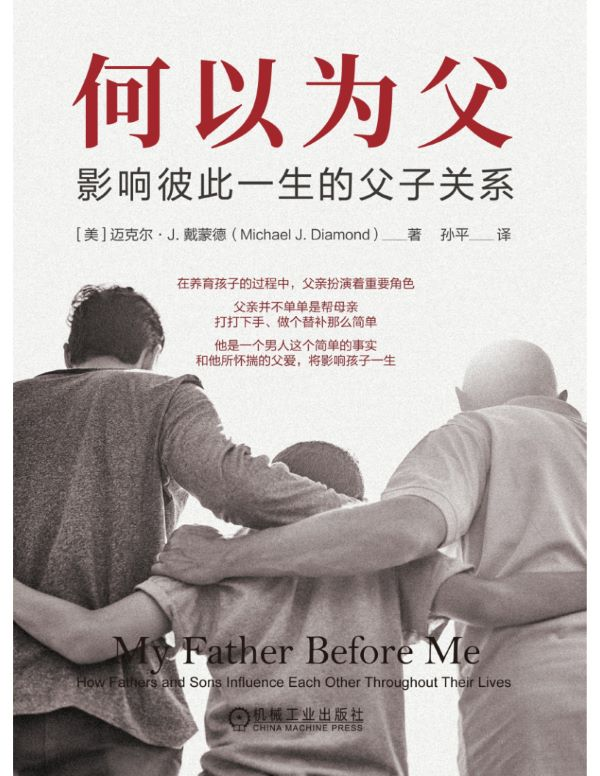

# 何以为父：影响彼此一生的父子关系

- 作者：迈克尔·J.戴蒙德（Michael J. Diamond）
- 译者：孙平
- 出版社：机械工业出版社
- 出版时间：2024-1
- ISBN：978-7-111-73577-9
- 豆瓣：https://book.douban.com/subject/36725588
- 封面：

# 译者序

一个高度参与孩子成长的父亲，不光可以影响和充盈孩子的一生；这个父亲本人，也会在获得父性的过程中，逐渐成长成熟为一个大写的男人。

在十五年的心理咨询师生涯中，我也见证过太多的父亲缺席和不称职。在中国执业的那九年时间里，我逐渐熟稔了“丧偶式育儿”这个词儿；在美国执业的这六年里，我看到了太多美国孩子，尤其是少数族裔的孩子，缺少并渴望着一个父亲。如果说中美两国之间有一个最相似的家庭结构性问题，那可能就是父亲在孩子的成长过程中肉身抑或情感缺席问题。

最后，我想用自己曾在公众号里写过的一段话，来为这篇译者序结尾。我知道哪怕不可能全然如愿，也愿天下人都有一个足够好的父亲，或者有一个哪怕不是父亲却也能懂你、爱你、守护你的人：“所以父亲们，‘活下来，活下去’（bealiveandstayalive），在孩子的童年，不死亡，不退场，熬过生活的艰辛，熬过妻子从对你向对孩子的情感转移，熬过孩子对你的亲近和依恋，熬过他们对你的理想化，熬过他们的愤怒，熬过他们的失望，熬过他们把你一会儿视为神和一会儿视为虫的戏剧性起伏，最终在他们心中成为一个普通的却深爱着他们的老男人。“你还站在那里，你还坚韧地存在着，becauseyouareaFATHER。”

孙平

2022年10月13日于加州洛杉矶

# 第1章 积极准备将为人父

> 汝儿五岁为汝主，
>
> 十岁为汝仆，
>
> 十五为汝影，
>
> 其后或为汝友，或为汝敌，
>
> 悉决于汝所养。
>
> Hasdai Ibn Crescas, The Wisdom of Judaism (c. 1230), ed. D. Salwak (Novato, CA:New World Library, 1997), p.102. —— 哈斯代·伊本·克雷斯卡斯（Hasdai Ibn Crescas）

## 做妻子的“情绪教练”和“代理人”

通过和妻子一起学做一些新的事情，比如像吉斯一样承担更多家务，一个男人在妻子怀孕期间其实可以成为一个更加优秀的丈夫。

男人在妻子孕期还会发展出另一个不太为人知的角色，那就是他会逐渐成为妻子的“情绪教练”（emotionalmanager）。也就是说，他会学着承担、抱持、涵容以及调节妻子以焦虑为代表的情绪，从而使她得以全神贯注地聚焦于自己腹中正在成长的胎儿。

通过承担这些角色，男人会与怀孕的妻子建立起一种特殊的同盟关系。在这种夫妻同盟中，随着两人不断向共同目标靠近，他们的亲密指数会因彼此之间强烈的共情性联结（empathicbonds）而节节攀升。在孩子出生的那个阶段，男人就不必再像之前那样高强度地扮演代理人和情绪教练的角色了，因为妻子在怀孕期间超强的身体负荷大部分都会得到缓解。但是，经过这些角色的试炼，他已经成长为一个更加主动、更懂得支持妻子的丈夫。这种基于情感理解之上的亲密同盟，会夯实丈夫和妻子之间的关系，也会为宝宝的降生搭建一个基础平台——要知道和谐的父母关系，才是真正让宝宝“赢在起跑线上”的必要因素。我把这个基础平台称为“养育同盟”（parentingalliance）：这是一个由共同的目标，在求同存异基础上建立起来的联盟。它的存在，会贯穿孩子发展之始终。

## 准爸爸要有创造力

很多准爸爸倾向于只是把自己界定为“大事件”的见证者，说白了，也就是只有旁观老婆怀孕的命。

有些男人，特别是那些本来就和自己父母的依恋关系出过问题的男人，他们的问题在妻子孕期会再次浮出水面，这会使得他们很难为自己的情绪找到宣泄口。于是，他们会想办法离开这段婚姻，无论是人离开，还是心离开。这里最熟悉的例子可能要数“工作狂老公”了——有时候一个男人变得对工作上瘾，实际上是为了从怀孕的妻子那里逃离。

