# 架构师启示录：知识模型、落地方法与思维模式

- 作者：灵犀
- 出版社：机械工业出版社
- 出版时间：2024-03
- ISBN：978-7-111-74908-0
- 豆瓣：https://book.douban.com/subject/36865874
- 封面：

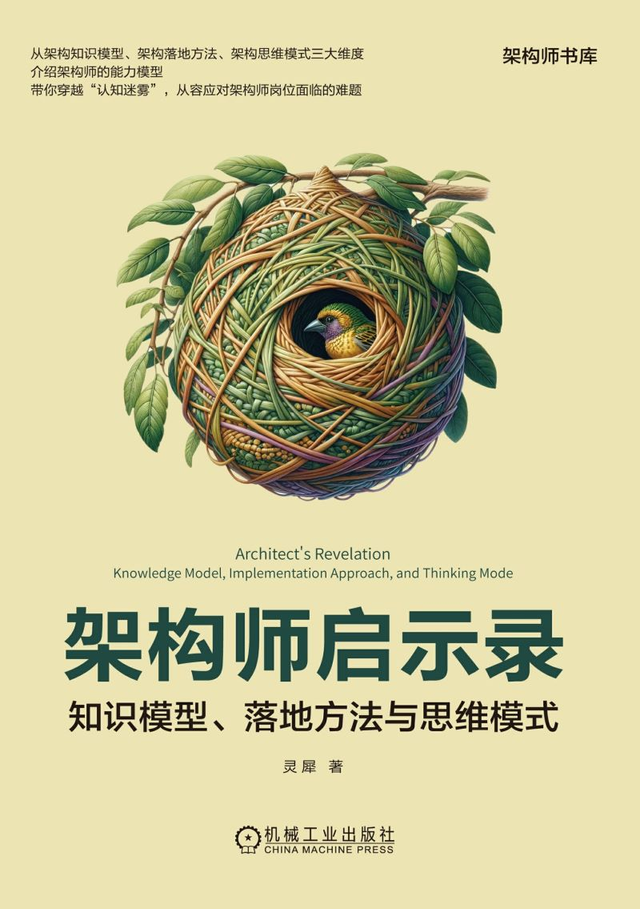

# 前言

程序员在成长为架构师的过程中通常会经历3个阶段：

1. 知识体系搭建，即初期如何学习并掌握大量的架构知识
2. 认知突破。许多架构师深有体会，即使已经掌握了丰富的架构技能，在面对复杂系统挑战时也不能游刃有余地处理。
3. 架构本质探寻。当一位架构师已经具备了驾驭复杂系统的能力后，就会开始思考架构知识体系的本质是什么，并能持续更新架构知识体系，提升认知和解决问题的能力。

本书特色：

1. 关注本质的理解
2. 关注案例的类比
3. 关注模型的抽象
4. 关注思维的融入

# PART 1 架构认知框架

架构认知框架=架构知识模型+架构落地方法+架构思维模式

## CHAPTER 1 架构认知框架概述

### 1.1 简单的架构知识模型

第一个阶段是知识体系构建，需要学习众多且分散的架构知识点，涉及面向对象、DDD、TOGAF、敏捷、DevOps、中间件、微服务，以及高并发、高可用、可扩展等

所有架构知识都是为了软件系统开发服务的

软件是一个系统，按照系统的定义，所有系统都是由元素、关系以及功能/目标3个要素组成的。

元素代表“是什么”，功能或目标代表“干什么”，而关系则代表“怎么干”

架构设计是由软件系统的“干什么”来推理出“是什么”和“怎么干”的过程，是一个由果到因的过程。

“干什么”通过需求来获取，而“是什么”和“怎么干”则属于架构编排工作，至此可以初步得到一个架构知识模型：

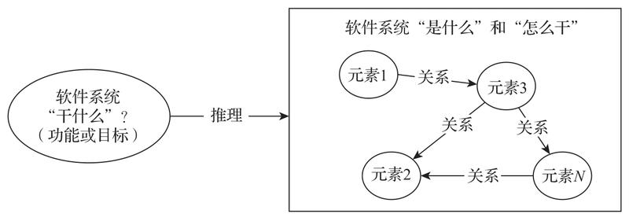

对社会组织来说，它的运转核心是“实体+规则”，其中实体可以是人、公司等，规则负责将实体有序地组织起来。

架构编排由“架构元素+架构规则”的二元组构成。架构元素可能是应用、服务器节点、限界上下文、类等，而架构规则负责将多个元素有序地编排在一起。

信息交换主要指的是在架构设计过程中，不同阶段信息的输入以及模型结果的转化、输出和传递等。所以，经过上述推导，我们最终得到了以下架构知识模型：架构知识模型=信息交换+架构编排+架构演进

软件系统研发的目的是什么？它一定是为了满足客户的需求而存在的

从客户侧考虑，对软件系统的期望通常包括以下几个主要方面：功能符合预期、低成本/交付速度快以及需求可修改。其中，功能符合预期主要是指信息交换方面。低成本/交付速度快对应的主要是架构编排，所以架构编排的本质是为了实现降本增效。而需求可修改对应的则主要是架构演进。

将架构知识模型化主要带来两个好处：一是将架构知识分类后便于厘清知识边界；二是相同分类下的架构知识往往蕴含着相似或相同的规则，方便关联记忆。

### 1.2 架构落地方法

#### 1. RUP

RUP（Rational Unified Process）是面向对象的软件开发方法，主要包括4个阶段和9个核心工作流，如图1-2所示。

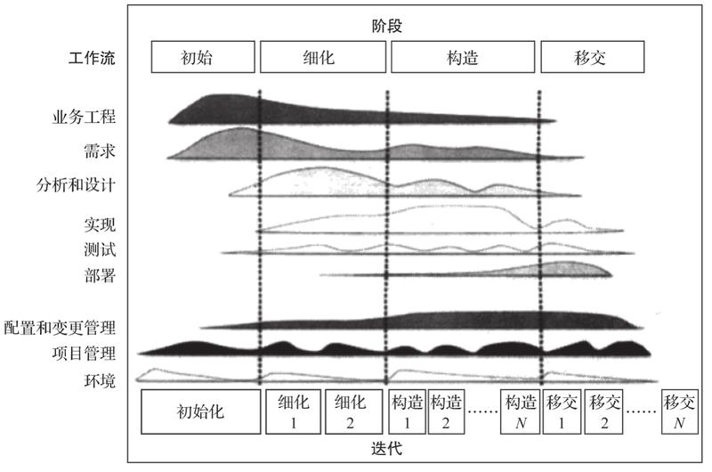

#### 2. DDD

DDD是随微服务兴起的一个面向领域的软件开发方法，包括战略设计和战术设计两个阶段，如图1-3所示。

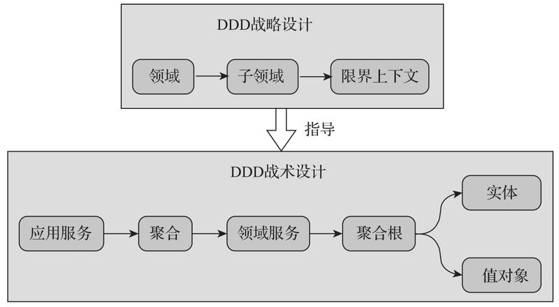

DDD的优点在于它是以领域驱动的，可以解决复杂系统的开发难题。缺点：

1. 重设计，轻过程。DDD战略设计和战术设计过程只是通过概念串联在一起，并没有像RUP那样提供一个完整的过程指导。
2. 二是重概念，轻规则。虽然DDD中提出了许多有用的概念，如领域、子领域、限界上下文、聚合根等，但在实践中缺乏明确的步骤或规则来推导出它们。
3. 三是重现在，轻过往。相比DDD，面向对象不论是在需求分析方面还是编程方面，都已经是一个非常成熟的范式，并且积累了大量的最佳实践。

#### 3. TOGAF

TOGAF是业界非常知名的一个企业架构框架，属于架构中的架构，它提供了一种专门用于设计企业架构的标准流程——架构开发方法ADM作为其核心，如图1-4所示。

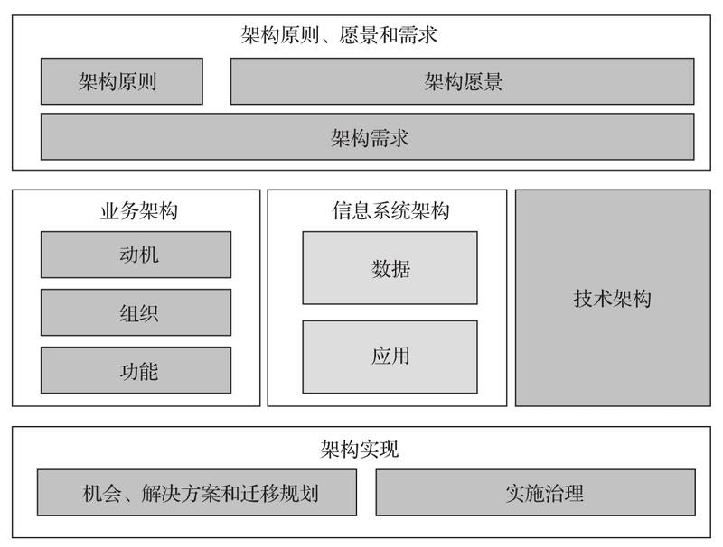

优点在于具有一个完整全面的架构设计原则和过程，并且非常理论化，其缺点也主要在于过于理论化，直接应用会难以落地。

图1-5展示了将要介绍的架构落地方法，包括需求分析、架构设计、系统实现和系统维护四个阶段。

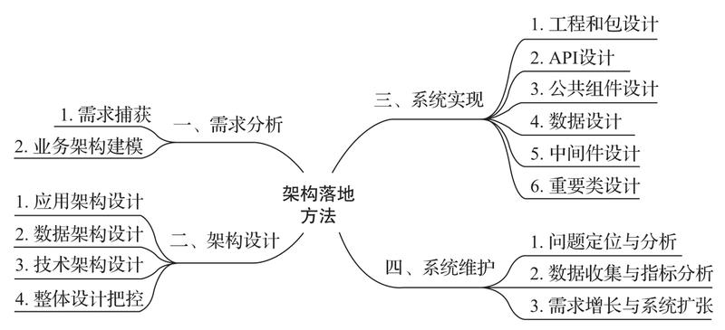

### 1.3 架构思维模式

本书将架构思维模式大致分为三层:

1. 专业层，指的是架构师能够利用架构专业或领域提供的规则（通常表现为具体的技术），去解决架构设计问题。例如，DDD、面向对象、应用架构、数据架构，以及中间件技术都属于专业领域范畴。
2. 模型层，即架构师能够通过抽象出来的模型或模式解决同一类架构设计问题，例如上面提到的架构知识模型，以及后面将要介绍的价值模型、企业模型、TOGAF双飞轮模型等
3. 本质层，即借助底层思维模式来洞察架构问题的本质，并运用跨学科知识综合解决问题

架构的真正难点通常不在于技术层面，而在于理解业务的本质，并将业务问题与最适合的技术进行匹配上

尽管每个层次都提供了一些解决问题的规则，但是规则的数量显然随着层级的降低而减少，专业层级的规则最多，而本质层级的规则最少。规则越少，呈现的力量反而越大。

### 1.4 初识架构认知框架

架构认知框架:

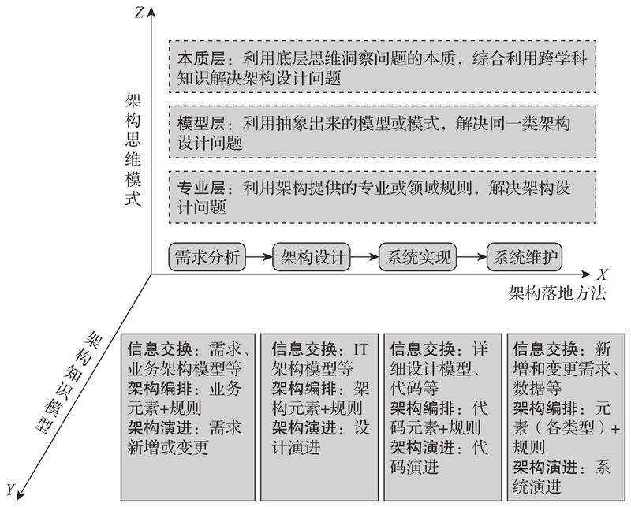

- X轴代表架构落地方法，包括需求分析、架构设计、系统实现和系统维护4个阶段
- Y轴代表架构知识模型，它不仅仅用于架构知识分类，对架构落地方法的标准化同样作用很大
- Z轴代表架构思维模式，不同的层级代表着其规则蕴含着多大的力量，可以用来解决多大范围内的架构设计问题

### 1.5 编程和架构的关系：从微观到宏观

架构和编程的基本结构:

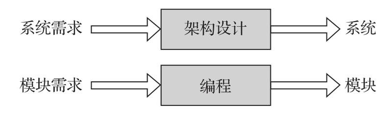

编程知识框架=信息交换+代码编排+代码演进

架构更关注的是宏观层面，而编程更关注的则是微观层面

这两个领域的一些规则看似不相关，但是它们的底层规则实际上是相同的，这就表明可以通过底层规则将编程和架构联系到一起。例如，代码开发规则中的MVC和架构规则中的应用分层，本质上都是还原论思想的应用；代码开发规则中的异步响应请求和架构规则中的CAP原理，本质上都是升维模式的应用。

优秀的架构师一定是优秀的程序员，而优秀的程序员也很容易成长为优秀的架构师。二者更像是宏观和微观的关系，宏观中包含着微观，而微观中也处处映射出宏观的样貌

# PART 2 架构知识模型

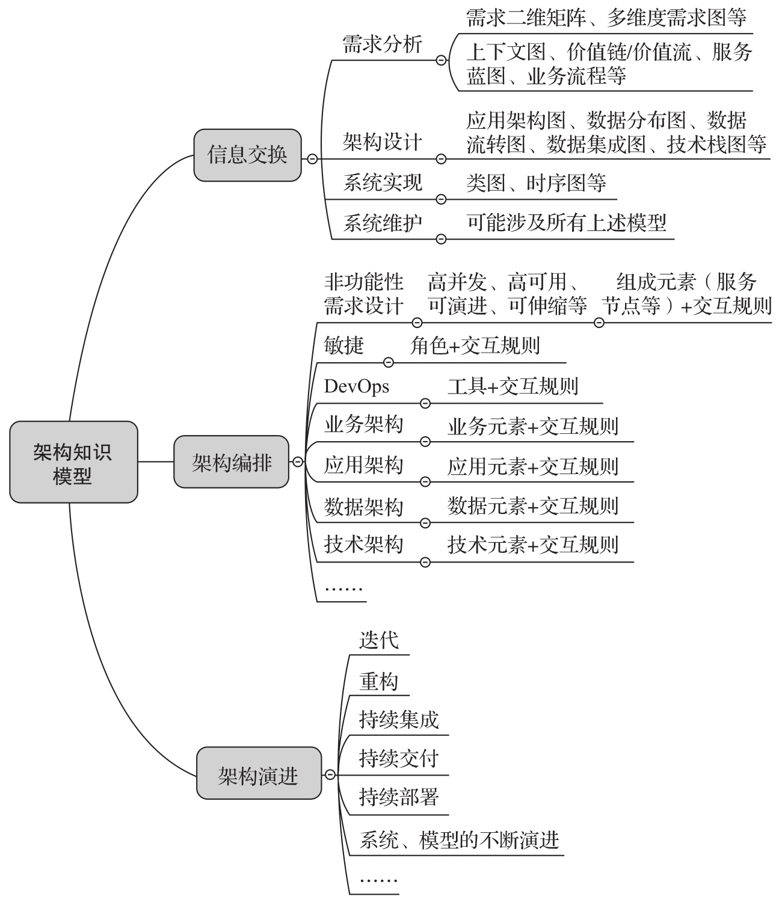

## CHAPTER 2 信息交换

从根本上来说，信息交换指的是在架构设计的不同阶段，我们对系统的理解是什么，这种理解在经过多方沟通之后通常以模型的方式呈现出来，因此信息交换的核心是模型。

### 2.1 系统描述的3种维度

在推导架构知识模型时，提到了架构设计是由软件系统“干什么”来推导出软件系统“是什么”和“怎么干”的过程。

这个定义中隐含了描述系统的3个维度：功能维度、结构维度和行为维度。

#### 1. 功能维度

功能维度是系统描述的第一个维度，它描述了系统“干什么”。

一个系统存在的价值在于可以满足利益攸关人一定的需求或提供某种价值。

功能维度可以进一步分为两类：外部功能和内部功能。

- 外部功能主要决定了系统所能带来的价值。在评估外部功能时，可以将系统视为一个黑盒子，只关注于它在与外界交互时可以提供哪些功能或价值。
- 内部功能通常是为了实现系统的外部功能，即系统内部需要哪些功能来支撑外部功能。

对于一个系统来讲，其外部功能和内部功能同等重要。外部功能定义了系统的边界，是系统与外界交互的窗口。我们对系统的认识、体验等都是通过外部功能来实现的。然而，内部功能同样不可或缺，内部功能是否配备合理，直接决定了外部功能的实现效果。

#### 2. 结构维度

结构维度描述了系统“是什么”。结构维度比较直观，它首先从静态角度描述了系统中包含的各个实体。

系统的结构和功能之间有着密切的关系。一方面，系统的结构是基础，它在一段时间内通常是静态的，体现了系统本身的样貌或形态。另一方面，系统的功能是目标，它在实现过程中一定需要依赖系统的结构，不论这种结构是物理的还是虚拟的。

#### 3. 行为维度

行为维度是系统描述的第三个维度，它描述了系统“怎么干”。

### 2.2 系统模型的分类

模型的作用在于能够帮助我们更好地理解系统。但在大多数情况下，模型只表达了系统在某一个视角下的形态，而屏蔽掉了其他视角，这么做的目的是让我们更好地聚焦于当下要解决的问题的范围。

#### 存在角度分类

从是否真实存在的角度来看，模型可以分为概念模型和物理模型两大类。

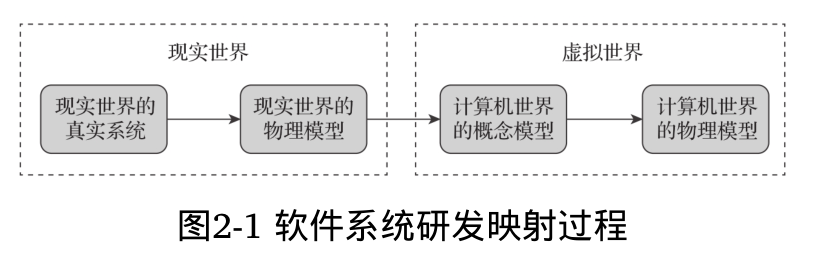

#### 系统描述角度分类

每种模型又可以细分为功能、结构和行为3种模型

UML中的用例图属于功能模型，类图、组件图和部署图都属于结构模型，而时序图和活动图等则属于行为模型。

### 2.3 架构落地方法中的系统模型

架构落地方法涉及4个阶段：需求分析、架构设计、系统实现和系统维护

每个阶段都有输入和输出，上一阶段的输出又作为下一个阶段的输入，这些输入和输出均可视为模型。

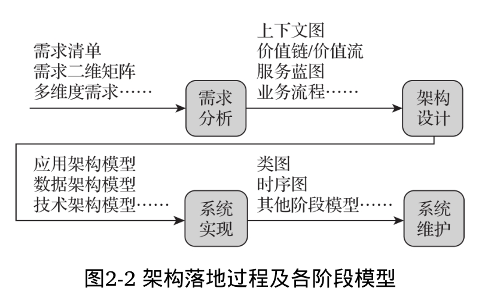

### 2.4 从模型演进看系统认知方式的转变

无论是面向过程、面向对象还是面向领域的软件开发方法，都包括分析、设计和编程三个环节。

面向过程的行为模型主要服务于计算机系统，而面向对象的功能模型则更侧重于用户的需求和期望；其次，它们面对需求变化时的灵活性相差较大。面向过程的行为模型中的数据流或过程流均是动态的，如果需求发生变化，则对应的数据流和过程流也必须进行相应调整。而面向对象的功能模型和结构模型均为偏静态的，只是其中对象的行为是动态的。因此，当需求发生变化时，我们只需要通过多态实现不同的行为方法即可满足新需求，不会影响已有组件或模块的功能。

