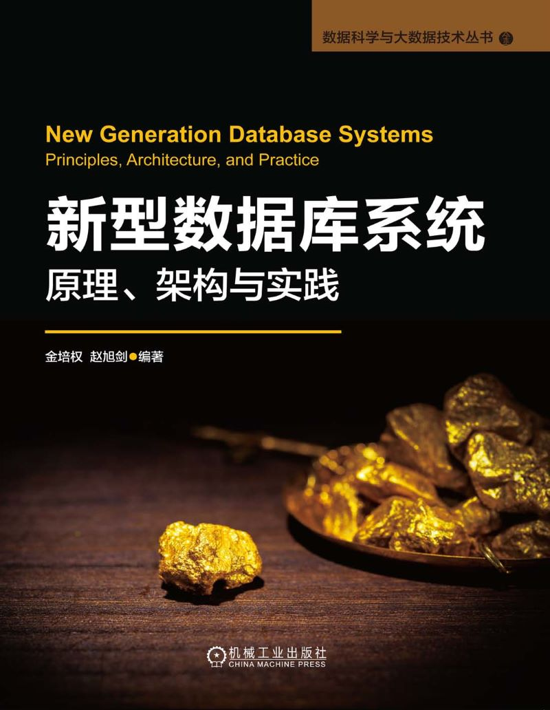
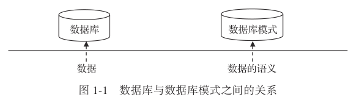
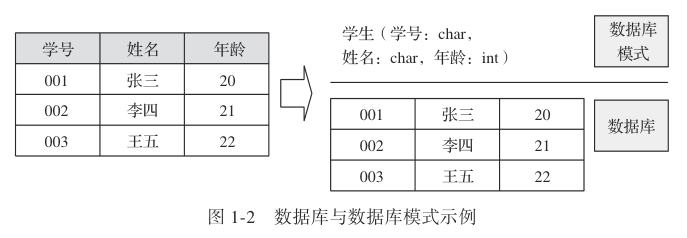
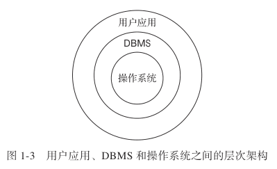
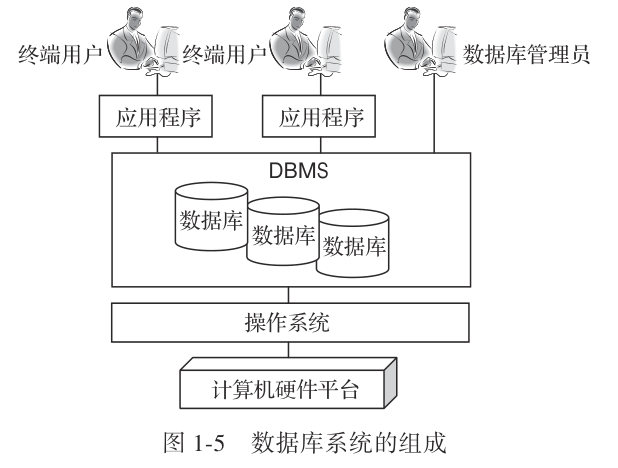
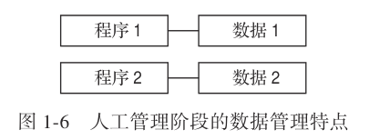
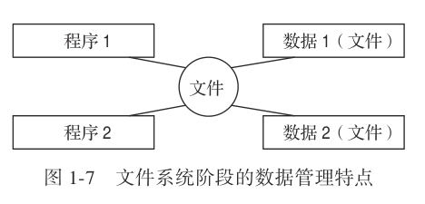
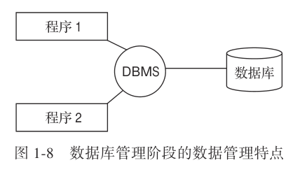
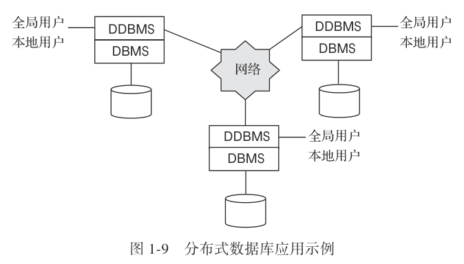
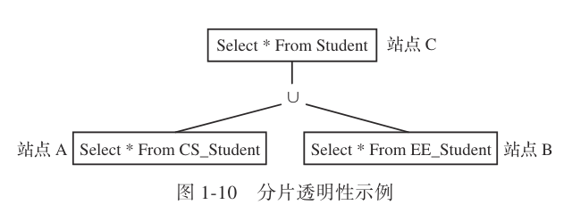

# 新型数据库系统：原理、架构与实践

- 作者：金培权 / 赵旭剑
- 出版社：机械工业出版社
- 出版时间：2024-05
- ISBN：978-7-111-74903-5
- 豆瓣：https://book.douban.com/subject/36869108
- 封面：

# 第 1 章 绪论

## 1.1 数据库系统的相关概念

### 1.1.1 数据

数据是数据库中存储和管理的基本对象。

定义 1.1（数据）：数据是人们用来反映客观世界而记录下来的可以鉴别的符号。

数据库系统除了存储和管理数据之外，还同时管理另一些内容。

由于现实世界中存在不同类型的符号，因此数据也可分为两种基本类型：数值数据和非数值数据。

- 数值数据记录了由 0 到 9 这几个阿拉伯数字所构成的数值
- 非数值数据则包括像字符、文字、图像、图形、声音等特殊格式的数据

现实生活中还存在复合数据，复合数据是由若干简单数据组合而成的。

### 1.1.2 数据库

定义 1.2（数据库）：数据库（database，DB）是长期存储在计算机内、有组织的、可共享的大量数据的集合。

数据库的几个特点：

1. 数据库是数据的集合，因此数据库只是一个符号的集合，本身是没有语义的。
2. 数据库中的数据不是杂乱无章存放的，而是有组织的。
3. 数据库中存储的数据量通常是海量的。
4. 数据库通常是持久存储的，即存储在磁盘等持久存储介质上。
5. 数据库一般是被多用户共享的。
6. 数据库一般服务于某个特定的应用，因此数据间联系密切，具有较小的冗余度和较高的独立性。

### 1.1.3 数据库模式

由于数据库本质上是数据的集合，因此它也是符号的集合，本身是没有语义的。数据库的语义可以用另一个概念—数据库模式（database schema）来表达。

定义 1.3（数据库模式）：数据库模式是数据库语义的表达，它是对数据库中全体数据的逻辑结构和特征的描述。

### 1.1.4 数据库管理系统

定义 1.4（数据库管理系统）：数据库管理系统（database management system，DBMS）是一个计算机软件，它用于创建和管理数据库。

数据库管理系统从软件的分类上属于计算机系统软件。系统软件一般是管理计算机资源的软件。常见的系统软件有操作系统、数据库管理系统等。同样是系统软件，操作系统管理计算机中的全部资源，包括处理器、存储器、外设等，而数据库管理系统则只管理计算机中的数据资源。操作系统本身也有数据管理的能力，即文件管理功能，但正是因为操作系统的文件管理功能在管理大规模共享数据时容易出现存取性能差、数据不一致等问题，所以才有了数据库管理系统。

### 1.1.5 数据库系统

定义 1.5（数据库系统）：数据库系统（database system，DBS）是指在计算机系统中引入了数据库后的系统，即采用了数据库技术的计算机系统。

数据库系统与其他计算机系统的区别在于，它是以数据库为基础的。现实中所见的许多系统，例如银行信息系统、电子政务系统等都可以称为数据库系统，因为它们背后都有DBMS和数据库的支持。

数据库系统中的用户分为两种类型：终端用户与数据库管理员（database administrator，DBA）。终端用户直接与应用程序交互，而数据库管理员则直接跟 DBMS 打交道。

## 1.2 数据库技术的发展回顾

在数据库技术出现之前，人们普遍采用文件系统管理数据。但是，随着数据规模的不断增长以及数据共享需求的提出，文件系统方法越来越难以适应数据管理的要求。

数据库技术自 20 世纪 60 年代开始发展以来，经历了网状数据库、层次数据库、关系数据库、对象 / 对象关系数据库等发展阶段，而且即使到了今天，XML 数据库、NoSQL 数据库等技术还在不断地发展。

### 1.2.1 数据管理技术的发展历程

数据管理技术的发展历程大致可分为三个阶段，即人工管理阶段、文件系统阶段和数据库管理阶段。

#### 1. 人工管理阶段

20 世纪 50 年代中期以前为人工管理阶段。

人工管理阶段的数据管理具有以下的特点：

1. 数据不保存在计算机中。此时还没有出现磁盘这样的二级存储概念，数据都是纯二进制数，并且以打孔纸带的形式表示。
2. 应用程序自己管理数据。根据应用程序的要求要准备打孔纸带形式的数据，这些数据只能被该应用程序使用。
3. 数据无共享。
4. 数据与应用程序之间不具有独立性。如果应用程序发生修改，原先的数据一般不能继续使用，需要再重新准备打孔纸带。
5. 只有程序的概念，没有文件的概念。

#### 2. 文件系统阶段

在 20 世纪 50 年代中期到 60 年代中期，出现了文件系统形式的数据管理技术。

主要特点是以文件形式保存和管理，特点：

1. 数据以文件形式存在，由文件系统管理
2. 数据可以长期保存在磁盘上
3. 数据共享性差，冗余大。冗余是由于必须建立不同的文件以满足不同的应用。
4. 数据与应用程序之间具有一定的独立性，但非常有限

#### 3. 数据库管理阶段

20 世纪 60 年代末开始，数据管理进入了数据库管理阶段

主要特点：

1. 数据结构化
2. 高共享，低冗余
3. 数据独立性高
4. 数据由 DBMS 统一控制，应用程序中所有的数据都由 DBMS 负责存取

### 1.2.2 数据库技术的发展历程

1. 1961 年，通用电器（GE）的 Charles W. Bachman 设计了历史上第一个 DBMS—网状数据库系统 IDS（integrated data store）。
2. 1968 年，IBM 设计了层次数据库系统 IMS（information management system）
3. 1969 年，CODASYL（数据系统语言协会）的 DBTG（database task group，数据库任务组）发表了网状数据模型报告，奠定了网状数据库技术。层次数据库技术和网状数据库技术一般被合称为第一代数据库技术。
4. 1970 年，IBM 的 Edgar F. Codd 在 Communications of ACM 上发表了论文“ A Relational Model of Data for Large Shared Data Banks”，提出了关系数据模型的概念，奠定了关系数据库理论基础。
5. 1973 年—1976 年，Edgar F. Codd 牵头设计了 System R。System R 是数据库历史上第一个关系数据库原型系统，其字母 R 是 Relation 的首字母。之所以称之为原型系统而不是产品，是因为 System R 开发完成后并没有及时进行商业化，从而导致 Oracle 后来居上。
6. 1974 年，IBM 的 Ray Boyce 和 Don Chamberlin 设计了 SQL 语言。SQL 语言最早是作为 System R 的数据库语言而设计的。经过 Boyce 和 Chamberlin 的不断修改和完善，最终形成了现在流行的 SQL 语言。
7. 1976 年，IBM 的 Jim Gray 提出了一致性、锁粒度等设计，奠定了事务处理基础。
8. 1977 年，Larry Ellison 创建了 Oracle 公司，1979 年发布 Oracle 2.0，1986 年 Oracle上市。Oracle 公司的创建和发展是一个传奇。
9. 1983 年，IBM 发布 DB2。Oracle 在商业领域的成功，让 IBM 意识到了数据库技术的发展前景。凭借其雄厚的技术实力，IBM 马上推出了商业化 DBMS DB2。
10. 1985 年，面向对象数据库技术被提出。面向对象数据库技术是随着面向对象程序设计技术（object oriented programming，OOP）出现的，它实质上是持久化的 OOP。
11. 1987 年，Sybase 1.0 发布
12. 1990 年，Michael Stonebraker 发表“第三代数据库系统宣言”，提出了对象关系数据模型。
13. 1987 年—1994 年，Sybase 和 Microsoft 合作，发布了 Sybase SQL Server 4.2。
14. 1996 年，Microsoft 发布了 Microsoft SQL Server 6.5。Microsoft SQL Server 是很特殊的一个产品，其版本号直接从 6.5 开始。
15. 1996 年，开源的 MySQL 正式发布。
16. 1998 年，出现了半结构化数据模型（XML 1.0）。由于网络数据管理需求的不断增长，XML 数据管理技术在近年受到了重视，至今仍是数据库领域的一个研究热点。
17. 2005 年，Michael Stonebraker 等人开发完成 C-Store。C-Store 是列存储的 DBMS（column-based DBMS），它完全抛弃了传统基于行记录的数据库存储方式，开创了一个全新的研究方向。
18. 2007 年，NoSQL（非关系数据库）在 Web 领域大行其道。NoSQL 数据库技术被提出并且得到了多个互联网企业的支持，包括 Amazon（Dynamo）、Google（BigTable）、Facebook（Cassandra）等。目前，NoSQL 在互联网领域得到了广泛的应用，但在传统领域如银行、证券、政府部门等还依然难以替代关系数据库技术。

## 1.3 新型数据库应用的发展

### 1.3.1 分布式数据库应用

分布式数据库（distributed databases，DDB）通常指物理上分散而逻辑上集中的数据库系统。分布式数据库系统通常使用较小的计算机系统，每台计算机可单独放在一个地方，每台计算机中都有 DBMS 的一份完整副本，并具有自己局部的数据库，位于不同地点的许多计算机通过网络互相连接，共同组成一个完整的、全局的大型数据库。

在分布式数据库应用中，每个站点（site）自身具有完全的本地数据库系统，所有站点协同工作，组成了一个逻辑上统一的数据库。

本地应用和本地用户只能访问其所注册的那个站点上的数据，而全局应用和全局用户则可访问多个站点上的数据。

分布式数据库系统的特点：

1. 物理分布性，在分布式数据库系统中，数据是物理分布在不同的站点上的。
2. 逻辑整体性，各个站点上的数据在逻辑上属于同一个系统，对用户而言是一个整体，就像一个集中式数据库一样。
3. 站点自治性，每个站点都拥有自己独立的本地数据库系统，有自己独立的操作系统、CPU 等，也有专门的数据库管理人员，具有高度的自治能力
4. 数据透明性，分布式数据库系统提供了数据透明性，即用户不需要知道数据的物理位置，以及如何访问某个特定站点的数据。

数据透明性包括位置透明性、复制透明性和分片透明性：

1. 位置透明性是指用户和应用程序不必知道它所用的数据在什么站点
2. 复制透明性是指在分布式系统中，为了提高系统的性能和可用性，将部分数据同时重复地存放在不同的站点，这样，在本地数据库中也可能包含外地数据库中的数据。
3. 分片透明性是指用户不需要知道数据库中的数据是如何分片的

### 1.3.2 Web 2.0 应用

随着 Web 2.0 的兴起，非关系数据库现在成为一个极其热门的新领域，非关系数据库产品迅速发展。

Web 2.0 应用对数据库的需求：

1. 对数据库高并发读 / 写的需求，Web 2.0 网站要根据用户个性化信息来实时生成动态页面和提供动态信息，所以基本上无法使用动态页面静态化技术，因此数据库并发负载非常高，往往要达到每秒上万次读 / 写请求。
2. 对海量数据的高效率存储和访问的需求，对于大型的社交网络网站，用户每天产生海量的动态。
3. 对数据库的高可扩展性和高可用性的需求，在基于 Web 的架构当中，数据库是最难进行横向扩展的。

## 1.4 关系数据库技术的局限性

关系数据库所存储的数据特点：

1. 结构统一。关系中的数据具有相同的结构（模式），具有很强的格式化特点。
2. 面向记录。在关系数据库中，对于用户而言，数据库是一个记录的集合，所有数据都是以记录的形式存在的。
3. 数据小。关系数据库中的记录一般都比较短。
4. 原子属性。关系数据库中的每个属性值都是无结构的，是不可分的原子值，满足1NF 定义。

对于微博、微信等 Web 2.0 应用而言，关系数据库的很多主要特性往往无用武之地，主要表现在：

1. 数据库事务一致性需求，很多 Web 实时系统并不要求严格的数据库事务，对读一致性的要求很低，有些场合对写一致性要求也不高。
2. 无法满足海量数据的管理需求，关系数据库解决海量数据存取的主要手段是索引、缓存等技术，但在 Web 应用尤其是Web 2.0 应用中，数据量往往以 PB 计算。
3. 对复杂的 SQL 查询，特别是多表关联查询的需求，任何大数据量的 Web 系统都非常忌讳多个大表的关联查询，以及复杂的数据分析类型的 SQL 报表查询，特别是 SNS 类型的网站，从需求及产品设计角度，就避免了这种情况的产生。
4. “One size fits all”模式很难适用于截然不同的业务场景，关系数据库技术的核心思想是“统一”，即使用一个数据模型和一个数据库统一存储和管理所有的数据并且支持所有的应用。

## 1.5 新型数据库技术

新型数据库技术通常遵循“Onesize fits a bunch”的理念，即满足某一类特殊应用的需求，例如 Web 2.0 应用、物联网应用等。因此，新型数据库技术在数据模型、存储架构、存取方法等方面千差万别。

在关键技术方面，传统关系数据库技术在索引结构、缓存策略、恢复机制、并发控制技术等方面均已经有非常成熟的技术积累。新型数据库技术目前的关键技术主要以分布式架构下的技术为主，但这些技术主要继承于传统分布式系统领域的研究成果，缺少数据库层面专有的关键技术。
