# 亿级流量系统架构设计与实战

- 作者：李琛轩
- 出版社：电子工业出版社
- 出版时间：2024-05
- ISBN：978-7-121-47698-3
- 豆瓣：https://book.douban.com/subject/36864478
- 封面：

> 其实这本书在去年就去省图借过实体书就看过了，如今拿电子版重新快速浏览一遍

# 前言

从业多年，笔者对软件开发工程师这一工作最大的感受就是：作为一名技术人，不应
该把自己视为“X公司的打工人”，如机器人一样循规蹈矩地完成自己应该做的工作，而
是应该时刻思考自己在未来要达成什么目标——无论你是有成为某领域顶级专家或者
CTO的理想，还是有去更好的公司工作的想法，在达成目标的过程中最值得做的事情都是
保证自己在时刻进步，而进步的核心是持续学习，学习也是我们在工作上更上一层楼的必
要条件。作为开发工程师，如果你是大厂中负责一个很小系统的所谓的“螺丝钉”，那么
你可以不局限于自己的工作职责，积极获取公司内公开的资源，学习如何“造火箭”；如
果你是小厂的工程师或者是未步入社会的学生，那么你可以在发达的互联网或品类繁多的
图书中获取自己目前接触不到的经验与知识o总之，让你的视野上升到更高层面，去学习、
去吸纳能让你进步的知识与技巧。

# 第一章 大型互联网公司的基础架构

## 1.1 引言：单机房的内部架构

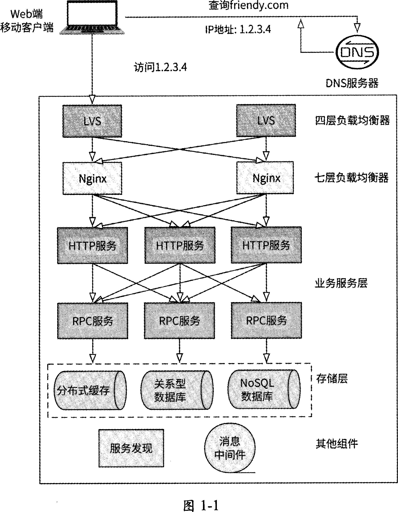

## 1.2 客户端连接机房的技术1： DNS

### 1.2.1 DNS的意义

DNS （ Domain Name System,域名系统）是互联网中的核心服务，它维护域名与对应
IP地址的映射关系，并提供将域名翻译为IP地址的域名解析功能。DNS在互联网中有非
常广泛的应用，它为用户和互联网公司带来了很多便利。

### 1.2.2 域名结构

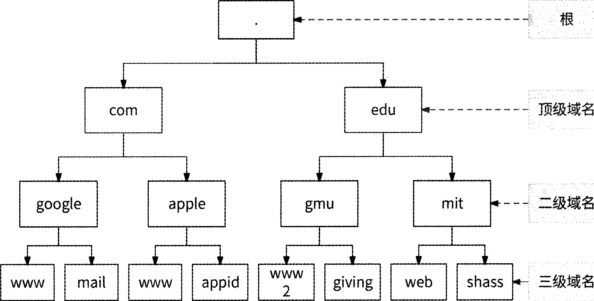

### 1.2.4 域名解析过程

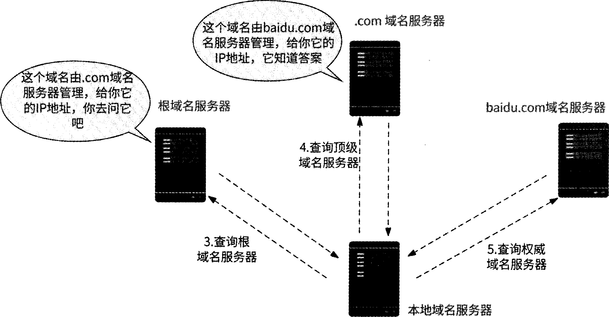

一旦本地域名服务器获得域名解析记录，它就会在本地进行记录
缓存，以便下次客户端再向它查询同一个域名时可以直接获得结果，而不用再进行递归查
询了。被缓存的域名解析记录格式大致如图1-4所示。

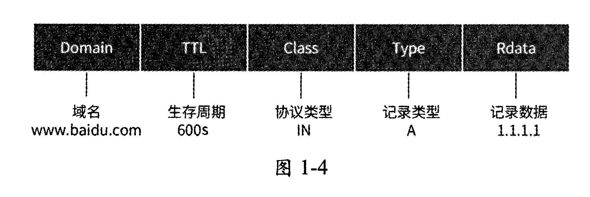

当查询域名 www.baidu.com 时，域名解析记录会包含如下数据：

- 生存周期（TTL）：表示这条记录在本地域名服务器中被缓存的时长。
- 协议类型（Class） ： 一般标识为IN,表示因特网。
- 记录类型（Type ）： A表示IPv4地址，AAAA表示IPv6地址。
- 记录数据（Rdata ）：与域名关联的地址信息。

## 1.3 客户端连接机房的技术2： HTTP DNS

DNS解析是用户访问互联网的第一步，如果这一步产生了较大的网络延迟、故障甚至
是数据错误，则会严重影响用户体验。如上文所述，DNS有很多优势，但是它也存在一些
问题（见1.3.1节）。业界很多互联网公司都尝试去解决这些问题，比如腾讯、字节跳动、
百度等公司已经给出了较为成熟的解决方案：HTTP DNSo

### 1.3.1 DNS存在的问题

域名解析需要进行递归查询，这势必会带来更高的访问延迟。

由于本地域名服务器是分地区、分运营商的，不同运营商实现的DNS解析策略不同。

由于权威域名服务器获取的是本地域名服务器的IP地址，而非客户端的
IP地址，所以在定位客户端地理位置时不一定准确，最终域名解析得到的IP地址对于客
户端而言可能不是距离最近、最优的访问节点。

某些运营商为了节约资源，会
直接将域名解析请求转发到其他运营商的本地域名服务器（即“域名转发”），这样做的后
果就是用户得到了与其网络运营商不相符的IP地址，用户访问网络请求变慢。

DNS劫持是一种互联网攻击方式，通过干预域名
服务器把域名解析到错误的IP地址上，以达到用户无法访问目标网站或访问恶意网站的
目的。很多知名的互联网公司备受DNS劫持的困扰，运营商可能基于本地域名服务器做
DNS劫持，黑客可能篡改计算机Hosts文件做DNS劫持。

### 1.3.2 HTTP DNS 的原理

HTTP DNS是基于HTTP,具有DNS解析能力的网络服务。

1. 客户端指定HTTP DNS服务器的IP地址（如5.5.5.5 ）,使用HTTP调用域名解析接口/d,并传入待解析的域名和客户端的IP地址。HTTP DNS服务器负责向权威DNS服务器发起域名解析请求，并将最优IP地址返回。
2. 客户端获取到域名IP地址后，直接向此IP地址发送业务协议请求。如果客户端需要访问业务请求 http://go.friendy.com/feed ,则在HTTP header中指定Host字段为此IP地址即可。

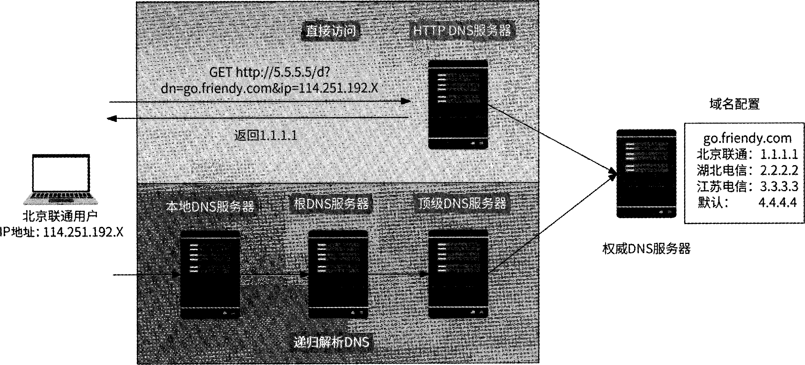

HTTP DNS服务器不通过域名提供服务（否则又需要域名解析），只通过一个固定的IP地址提供服务。

HTTP DNS服务提供商会采用如BGP （边界网关协议）等手段让这个IP地
址在全国各地都做到就近访问。以腾讯云HTTP DNS产品为例，它接入了 BGP Anycast
网络架构，与全国最主要的17个运营商建立了 BGP互联，确保各个运营商的用户都能快速访问到HTTP DNS服务器；同时，腾讯云在多个数据中心部署了多个HTTP DNS服务
节点，任意节点发生故障均可无缝切换到备用节点，保证了 HTTP DNS服务的高可用。

## 1.4 接入层的技术演进

在互联网发展的早期阶段，很多小型互联网服务的后台架构其实非常简单，几乎只有
业务服务器“裸奔”在所谓的“机房”里，如图1-6所示。

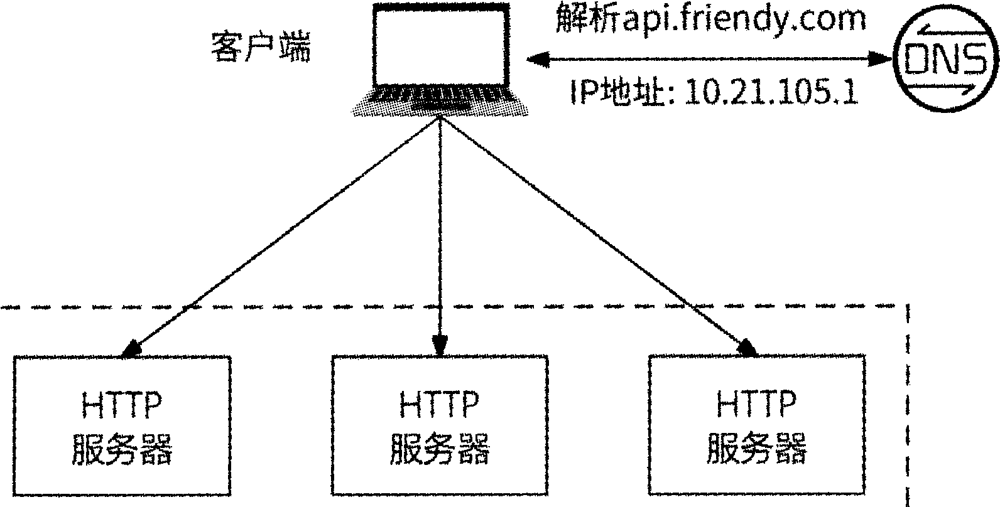

### 1.4.1 Nginx

Nginx是一种自由的、开源的、高性能的HTTP服务器和反向代理服务器，同时也是
IMAP, POP3、SMTP的代理服务器。Nginx既可以作为HTTP服务器进行网站的发布处
理，也可以作为反向代理实现负载均衡功能。

在网络接入层，代理分为正向代理和反向代理。

正向代理与反向代理的核心区别就是：正向代理代理的是客户端，反向代
理代理的是服务器，就像图1-7展示的那样。

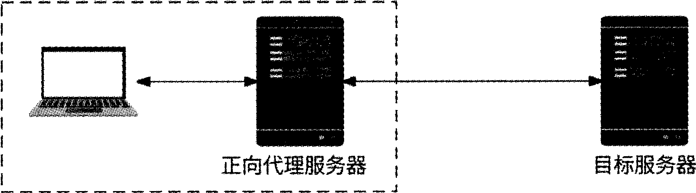

Nginx能很好地充当反向代理，是因为它有强大的基于域名和HTTP URL的路由转发
功能，我们只需要对配置文件nginx.conf做一些简单配置就能轻易搭建出一台反向代理服务器。

假设Friendy应用内置了内容推荐、点赞和评论功能，这三个功能在服务端对应于三
个HTTP业务服务：feed服务、like服务、comment服务。每个HTTP业务服务都有两个
服务器实例，如表1-1所示。

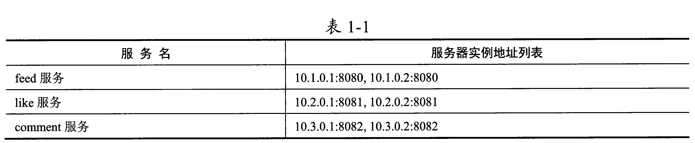

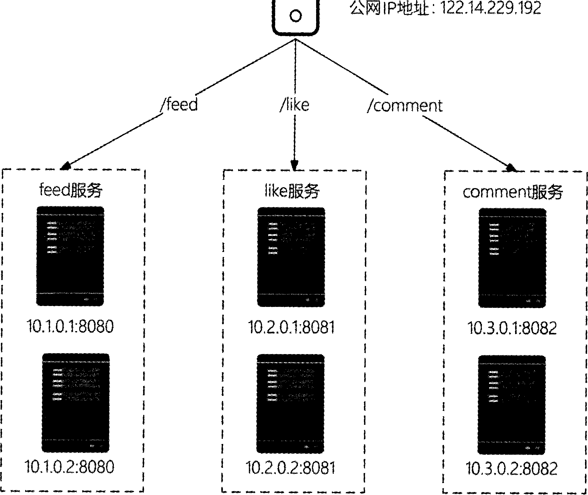

- Nginx服务器作为feed服务、like服务、comment服务的反向代理服务器，是后台服务器机房的总入口，通过公网IP地址直接与客户端进行通信。
- Nginx根据收到的HTTP请求的URL相对路径，决定将请求转发到哪个服务以及哪个服务器实例，最后完成客户端与后台服务器中业务服务的交互。

Nginx服务器需要将每个业务服务的网络地址设置在nginx.conf配置
文件中，才能实现与业务服务的通信。但是业务服务会频繁地迭代与扩容，这意味着Nginx
upstream服务池中的服务器实例地址列表会频繁地变更。频繁地更新nginx.conf配置文件
并不现实，所以我们需要找到一种Nginx实时感知业务服务地址列表变更的方案(具体参
见1.5节介绍的服务注册与服务发现，现在仅需知道可以从服务注册中心获取每个服务的
最新可用地址列表即可)

好在Nginx拥有足够多功能强大的模块可以帮助解决这个问题。下面先介绍两个
Nginx模块。
- ngx lua:这个模块将Lua语言嵌入Nginx,从而允许开发人员编与Lua脚本并部署到Nginx中执行。
- ngx_http_dyups_module:这个模块使得Nginx不用重新启动就能热更新upstream配置并生效。

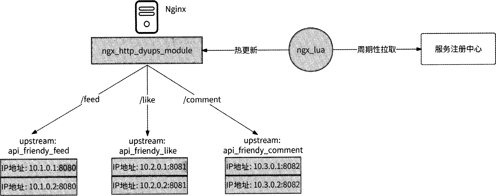

### 1.4.2 LVS

Nginx是一种高性能的服务器，其性能远高于业务服务器。但是Nginx毕竟是一个应
用层软件，单台Nginx服务器能承载的用户请求也是有上限的，当日活用户发展到一定规
模后，就需要Nginx集群才能顶住压力。既然是集群，那么势必需要引入一个中间层作为
协调者，其负责决定将用户请求转发到哪台Nginx服务器。这个协调者需要有比Nginx更
高的性能，它就是本节的主角：LVSo LVS （ Linux Virtual Server, Linux虚拟服务器）是
一个虚拟的服务器集群系统，从Linux 2.6版本开始它已经成为Linux内核的一部分，即
LVS运行于操作系统层面。

LVS和Nginx在转发请求时的区别：

Nginx是基于OSI参考模型的第七层（应用层）协议开发的，采用了异步转发形
式。Nginx在保持客户端连接的同时新建一个与业务服务器的连接，等待业务服务
器返回响应数据，然后再将响应数据返回给客户端。Nginx选择异步转发的好处是
可以进行失败转移（failover）,艮"如果与某台业务服务器的连接发生故障，那么
就可以换另一个连接，提高了服务的稳定性。Nginx主要强调的是“代理”。

LVS是基于OSI参考模型的第四层（网络层）协议开发的，采用了同步转发形式。
当LVS监听到有客户端请求到来时，会直接通过修改数据包的地址信息将流量转
发到下游服务器，让下游服务器与客户端直接连接。LVS主要强调的是“转发”。

由于LVS基于OSI参考模型的网络层，免去了请求到应用层的层层解析工作，而且
LVS工作于操作系统层面，所以LVS相比于Nginx有更高的性能。LVS用于网络接入层
时也被称为四层负载均衡器。既然LVS四层负载均衡器做的主要工作是转发，那么就需要
讨论一下转发模式。目前，LVS主要有4种转发模式：NAT模式、FULLNAT模式、TUN
模式、DR模式。

### 1.4.3 LVS+Nginx接入层的架构

机房接入层使用LVS与Nginx的配合可以发挥这两种负载均衡器的优势：LVS的性
能更高，便于Nginx构建集群，LVS作为Nginx集群的四层负载均衡器，可以有效提高
Nginx的可扩展性；而Nginx的功能更为强大，用它作为业务HTTP服务器的七层负载均
衡器，能将不同的HTTP URL调度到不同的业务服务并提高业务服务的高可用性和可扩展
性。LVS+Nginx的机房接入层架构如图1-14所示。

机房配置的LVS的公网IP地址（即VIP ）作为域名，客户端请求经过DNS解析后
进入LVS,然后LVS使用如FULLNAT模式将客户端请求转发到任意一台Nginx服务器,Nginx
服务器再根据HTTP URL将客户端请求转发到某个upstream服务池的任意一个服务器实例上。

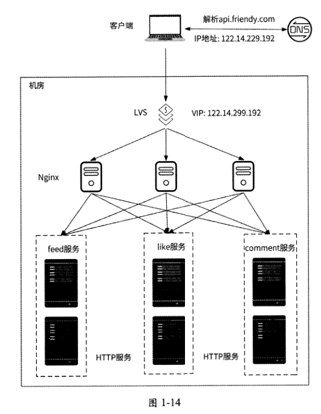

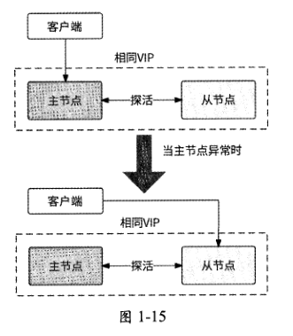

为单点LVS引入Keepalived+VIP方案后实现的高可用架构如图1-16所示。

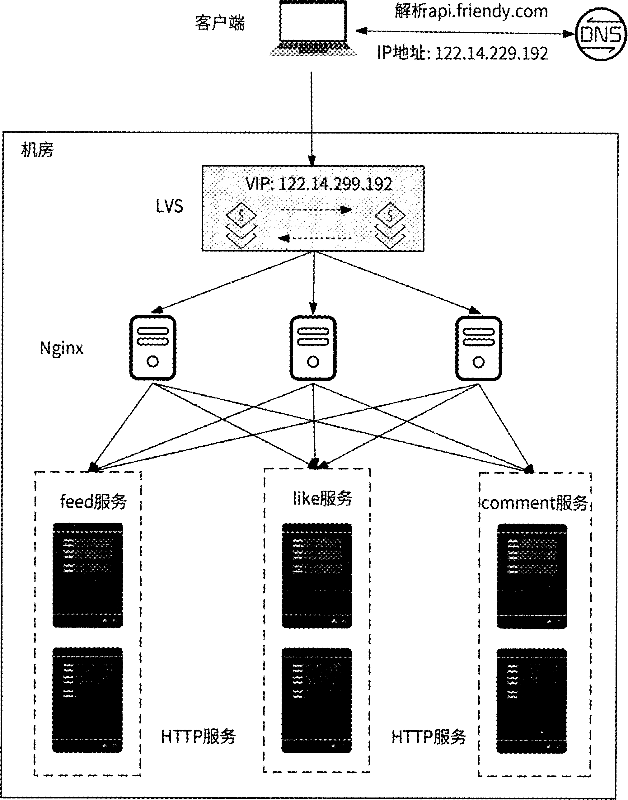

LVS虽然性能极高，但也是有上限的。
假设我们的互联网产品已经拥有亿级用户，那么单台LVS就会遇到性能瓶颈。想要痛快地
解决某个系统的高并发性能问题，就要为这个系统增加水平扩展能力。如图1-17所示，
我们可以使用多台LVS对外提供服务。如果有N台LVS对外提供服务，那么就要配置N
个VIP,这些VIP都绑定了同一个域名，客户端依赖DNS轮询来决定访问哪台LVS。

对于绝大多数互联网应用来说，做到这一步已经可以解决机房接入层的高可用、高性
能、可扩展的问题了。最终机房接入层架构已经趋于完备，此时：

- 通过DNS轮询方式扩展LVS的性能；
- 通过 Keepalived 保证 LVS；
- 通过LVS扩展Nginx的性能；
- 将Nginx作为业务HTTP服务器的七层负载均衡器，提高了业务服务的高可用性与可扩展性。

## 1.5 服务发现

业务HTTP服务在处理请求的过程中免不了与其他下游服务通信一可能会调用其他
业务服务，可能需要访问数据库，可能会向消息中间件投递消息等，所以业务HTTP服务
必须知道下游服务部署的可用地址。这就是本节要介绍的服务发现问题。

### 1.5.1 注册与发现

服务发现的技术原理并不复杂，一般通过提供一个服务注册中心来实现。这个服务注
册中心主要负责两件事情：管理每个服务的地址列表(注册)和将某服务的地址告知调用
者(发现)。让我们通过一个例子来阐明服务注册中心的工作流程。调用者A需要调用服
务B来完成某请求，服务发现过程如图1-18所示。

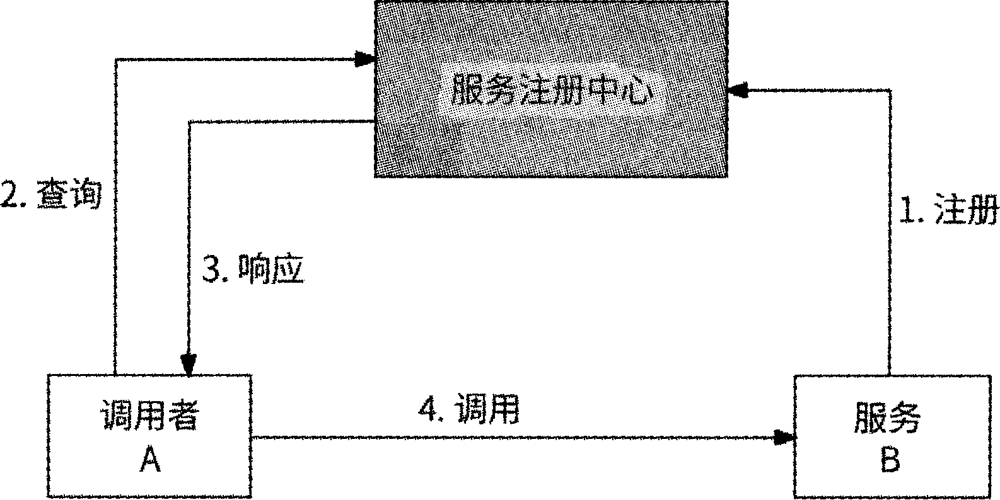

调用者A除了可以主动查询服务地址，还可以采取订阅推送的方式与服务注册中心通
信：调用者A在进程启动时就与服务注册中心通信，订阅关于服务B的地址数据；如果
服务注册中心有服务B的地址数据，或者服务B的地址发生了变更，那么它会主动将最
新地址列表推送给调用者A,如图1-19所示。

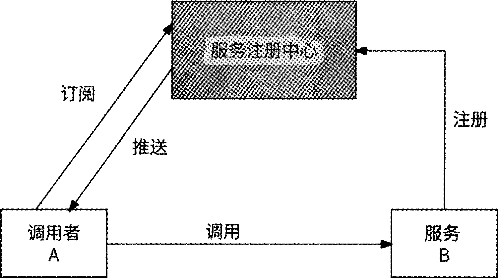

### 1.5.2 可用地址管理

由于服务的创建、销毁、升级、扩容/缩容都会造成服务地址列表的变更，所以服务
的每个实例在启动时都需要向服务注册中心注册自己的地址，并在退出时注销地址。只有
这样，才能使得服务注册中心一直在维护最新的服务地址列表。

不过，这还不够，我们还没有考虑异常情况。比如某服务实例突然挂掉，它还没来得
及向服务注册中心注销地址，这就使得服务注册中心向调用者下发了不可用的服务地址，
调用者调用请求被拒绝。所以，服务注册中心应该有对已注册的服务地址的探活能力。地
址探活一般有两种思路：

第一种思路是主动探活。服务注册中心周期性地向每个已注册的服务地址发起探测请
求，如果某地址探测成功，则认为这个地址是可用的；否则，认为这个地址已经失效，服
务注册中心主动摘除这个地址。

第二种思路是心跳探活。服务注册中心为每个已注册的服务地址记录一个最近心跳时
间，服务实例启动后，每隔一段时间（如30s） 就向服务注册中心发送一个心跳包，服务
注册中心收到心跳包后更新对应服务地址的最近心跳时间。服务注册中心会启动定时器来
检查每个服务地址的最近心跳时间相比于当前时间已经过了多久，如果其超过了某个阈值
（如150s）,那么就可以认为这个服务实例已经不可用了，服务注册中心将其地址摘除，如
图1-20所示。

这两个例子都是因为服务注册中心过度摘除地址而带来了风险，所以这里建议为服务
注册中心摘除地址增加简单的保护策略：在某服务的地址列表中，如果已摘除的地址数超
过某个阈值（如30%）,那么服务注册中心就停止摘除地址，并向服务负责人报警以寻求
人工处理，防止出现不可控的故障。

### 1.5.3 地址变更推送

当服务的地址列表发生变更时，为了让调用者尽快感知到这件事情，服务注册中心需
要主动推送最新地址列表给调用者。推送数据可能遇到的一个问题是“推送风暴”一如
果某服务有100个调用者，每个调用者又有1000个实例，那么每当这个服务的地址列表
发生变更时，就要给100000个节点推送数据；

那么，如何解决这个问题呢？

首先，建议推送的数据是“新增了哪些地址” “哪些地址已废弃”的增量数据形式，
而不是全量地址列表，这能在一定程度上节约推送数据的网络带宽。

其次，服务注册中心本身也是一个服务，如果公司的服务注册中心有条件部署大量的
实例，那么推送风暴问题也就被轻易解决了，毕竟分摊到每个服务注册中心实例的推送的
节点不会很多。

最后，可以采用推拉结合的方式：服务注册中心最多给N个调用者节点推送地址变更
信息，其他节点周期性地（如1min） 从服务注册中心拉取最新地址列表。

由于服务发现组件的存在，调用者只需要关心要调用谁，而不需要关心被调用者的地
址一 调用者可以随时升级、扩容，不用担心调用者找不到。作为微服务架构下最核心
的组件之一，服务发现真正为微服务带来了弹性。

## 1.6 RPC服务

你可能在1.1节的引言中注意到业务服务层包括HTTP服务和RPC服务，两者的定位
不一样。一般来说，一个业务场景的核心逻辑都是在RPC服务中实现的，强调的是服务
于后台系统内部，所谓的“微服务”主要指的就是RPC服务；而HTTP服务强调的是与
用户请求的交互，它做的主要工作一般比较简单，比如校验用户请求、打包响应数据，而
用户请求真正的处理逻辑会被HTTP服务通过RPC请求交给RPC服务来执行，HTTP服
务更像是业务服务层的“网关”。RPC服务对后台内部暴露RPC协议，而HTTP服务对后
台外部暴露HTTP。

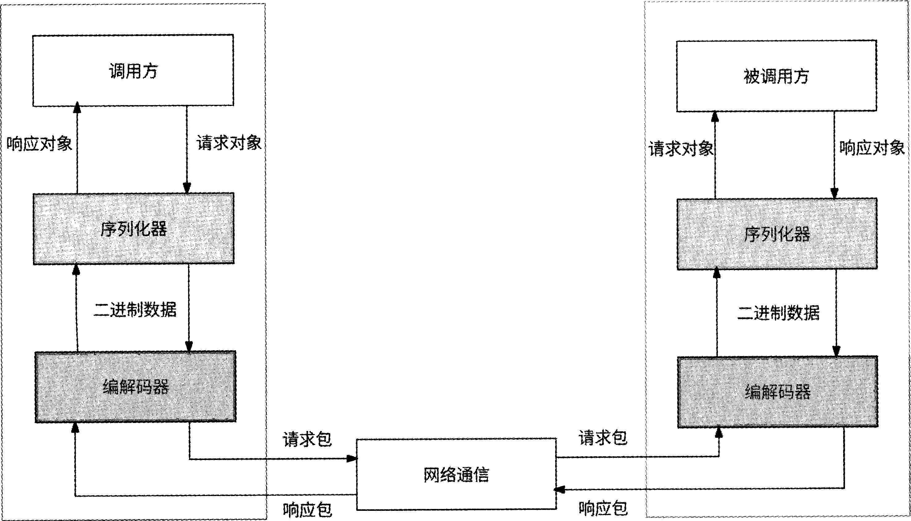

由于RPC通信流程相对固定，gRPC、Thrift等RPC框架都可以利用所约定的协议定
义文件生成脚手架代码，使用者只需要将具体的方法处理代码完成后就能实现RPC通信了。

从上述介绍我们可以看出，RPC只是一种用于屏蔽远程过程调用的设计，它与HTTP
不是对立的，因为两者不是一个层面的概念。RPC底层的网络通信可以使用TCP实现（如
Thrift）,也可以使用HTTP实现（如gRPC ）,其本身并无限制。我们将业务服务层拆分为
HTTP服务和RPC服务，更想强调的是前者服务于后台外部，而后者服务于后台内部，即
后台服务之间的通信使用RPC形式。所谓的RPC协议只是表示RPC网络调用形式，而
RPC服务的意思是该服务是基于gRPC、Thrift或其他RPC框架生成的，后台内部可以通
过RPC形式与其通信。

## 1.7 存储层技术：MySQL

### 1.7.3 高可用架构1：主从模式

最基本的MySQL高可用架构是主从模式：一台MySQL服务器作为Master（主节点）,
若干MySQL服务器作为Slave （从节点）o在正常情况下，只有Master处理写数据请求，
同时Master与Slave通过主从复制技术保持数据一致。当Master发生故障宕机时，某个
Slave会被提升为Master继续对外提供服务，这样可以实现MySQL的高可用。

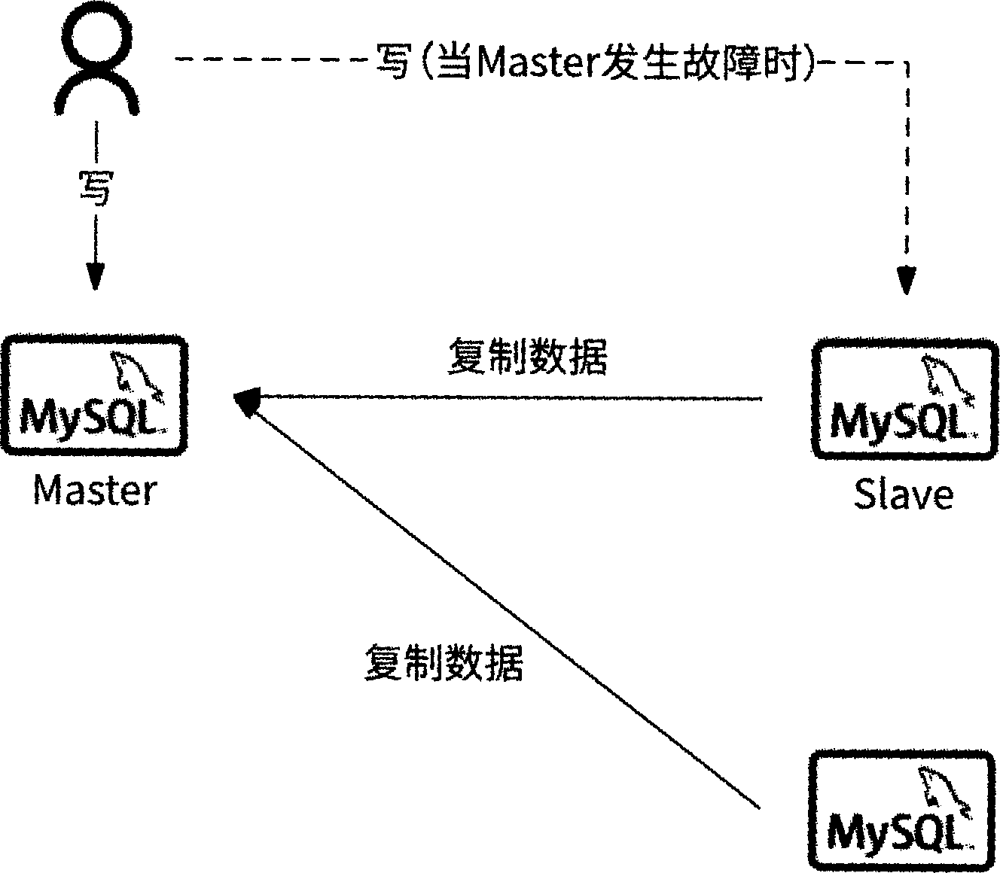

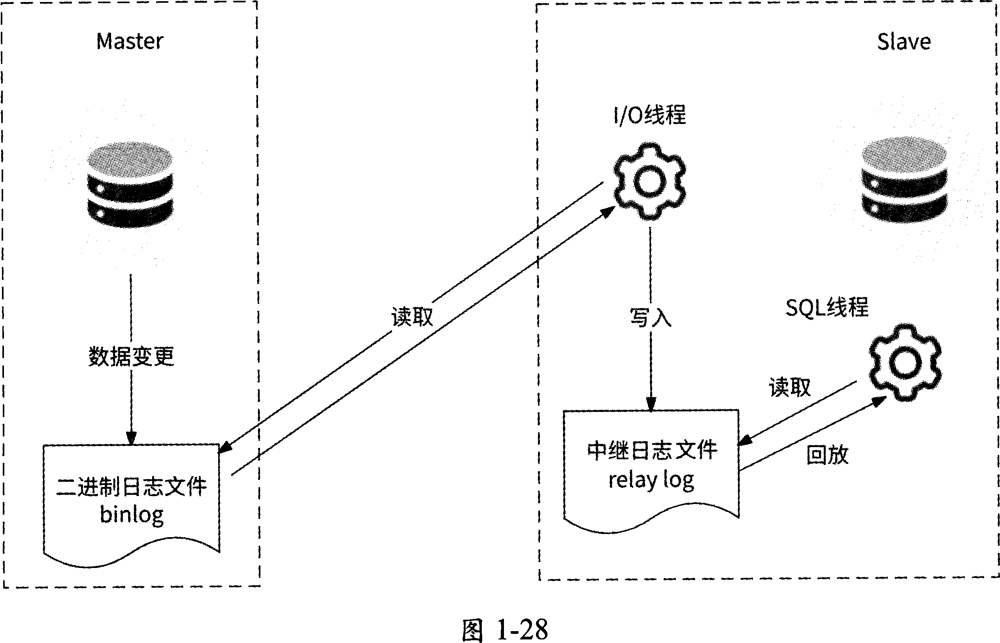

Master提交事务不需要经过Slave的确认，也不管Slave是否已接收binlog,
Slave写relay log失败、重新执行SQL语句失败等异常情况并不会被Master感知,所以
MySQL主从复制是异步的，Master提交完事务就直接返回了，如图1-29所示。

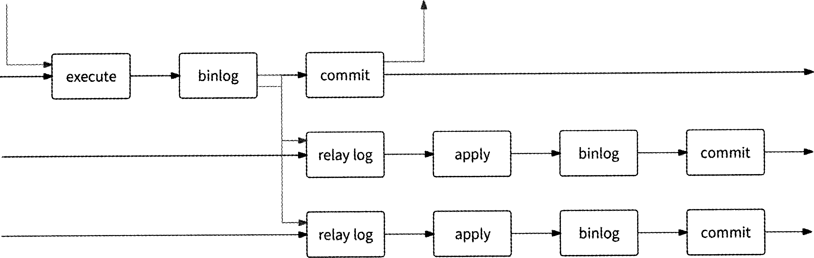

异步方式的主从复制有一个潜在隐患：如果Master在提交事务成功后，但尚未发送
binlog给Slave时就出现异常宕机了，那么对MySQL执行主从切换就会造成事务数据的
丢失，因为被提升为新Master的Slave并未复制这个事务。为了解决数据丢失的问题，
MySQL 5.5版本提供了半同步复制模式：Master在提交事务前，会等待Slave接收binlog,
当至少有一个Slave确认接收了 binlog后，Master才提交事务。

Master执
行半同步复制的过程如图1-30所示。

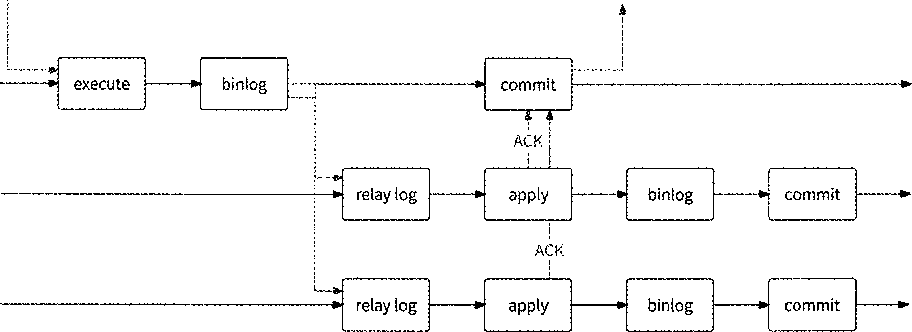

需要注意的是，在半同步复制模式下，Slave向Master发送ACK响应的时机并不是
重新执行SQL语句后，而是事务数据被写入relay log后。这样一方面可以缩短Master等
待响应的时间；另一方面，事务数据已经被持久化，不会发生丢失数据的情况。

半同步复制可以提高主从数据的一致性，但是Master提交事务要等待Slave的确认，
所以写性能会受到一定的影响。半同步复制适合对数据一致性要求较高的业务场景。

Master会因为向过多的Slave复制数据而压力倍增，这个问题被称为“复制风暴”。所
以实际的主从模式架构可能是一些Slave向Slave复制数据，以减轻Master的复制压力。

### 1.7.4 高可用架构2： MHA

MHA ( Master High Availability )在这方面做得很好。MHA在MySQL高可用
领域是一套相当成熟的解决方案，它通常可以在10 ~ 30s内完成MySQL主从集群的自动
故障检测和自动主从切换，并且在主从切换过程中，它可以最大程度地保证主从数据的一
致性，以帮助MySQL主从模式达到真正意义的高可用。

如图1-32所示，MHA由两部分组成：MHA Manager (管理节点)和MHANode (数
据节点)

-  MHAManager： MHA的“决策层”，负责自动检测Master的故障，检查主从复制状态，执行自动主从切换等。MHA Manager可以管理多个MySQL主从集群，通常被部署在单独的服务器上。
-  MHANode：被部署在每台MySQL服务器上，主要负责修复主从数据的差异。

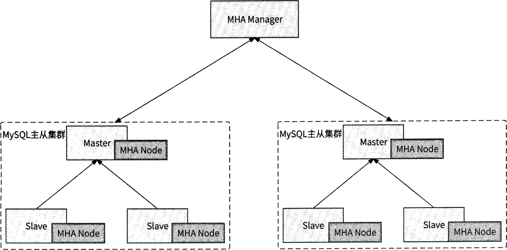

1. MHA Manager周期性地探测Master心跳，如果连续4次探测不到心跳，则认为Master 宕机。
2. MHA Manager 判断各个 Slave 的 binlog,哪个 Slave 的 binlog 数据更接近 Master数据，就将哪个Slave作为备选Master
3. MHA Node试图通过SSH访问Master所在的服务：
	- 如果网络可达，那么MHA Node可以获取到Master的binlog数据。MHA Node对比Slave与Master的binlog数据，如果发现Slave数据与Master的binlog数据有差异，则会将差异数据主动复制到Slave,以保持主从数据一致。
	- 如果网络不可达，那么MHA Node对比各个Slave的relay log差异，并做差异数据补齐。
4. MHA Manager构建新主从关系，将备选Master提升为Master,其他Slave向新的Master复制数据

### 1.7.5 高可用架构3： MMM

MMM ( Multi-Master Replication Manager for MySQL )是一个 MySQL 双主故障切换
和双主管理的脚本组件，从字面上理解，它有两个Master,并实现了这两个Master的高可用

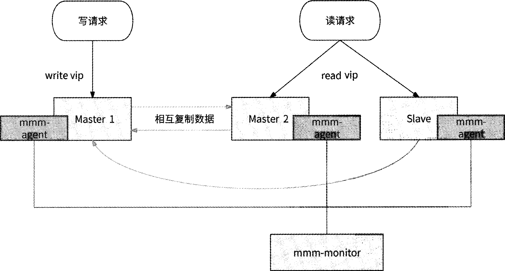

MMM通过移动虚拟IP地址(write vip)的方式切换Mastero当Master 1宕机时，
Master 2可以立即“上任”，MySQL业务使用方不会感知到主从切换的发生。不过，MMM
这套解决方案比较古老，不支持MySQL GTID,且社区活跃度不够，目前MMM组件处于
无人维护的状态。

### 1.7.6 高可用架构4： MGR

MGR ( MySQL Group Replication, MySQL 组复制)是 MySQL 5.7.17 版本推出的高可用解决方案，它具备如下特性。

至少由3个MySQL节点组成一个复制组，一个事务必须经过复制组内超过一半的节
点决议通过后才能提交。如图1-35所示，由3个节点组成一个复制组,Consensus层为Paxos
一致性协议层，在事务提交过程中组内节点进行决议(certify),至少有2个节点决议通过，
这个事务才能够提交。

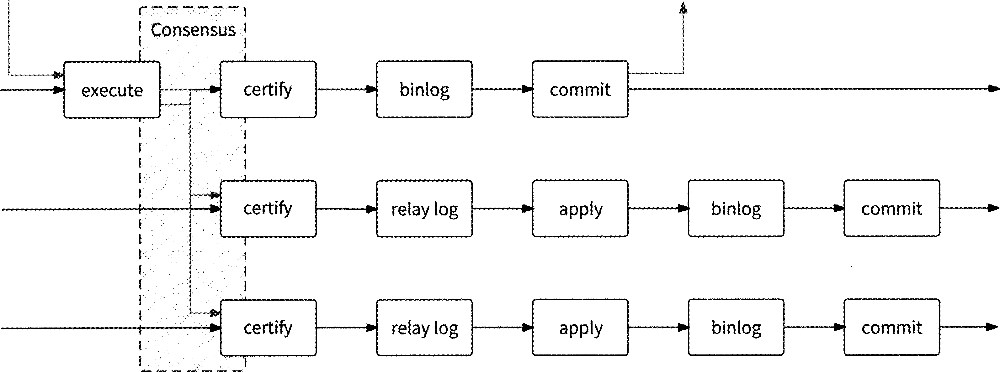

如果在不同的MySQL节点上执行不同的写操作发生了事务冲突，那么先提交的事务
先执行，后提交的事务被回滚。在多主模式下，由于每个MySQL节点都可以执行写请求，
在写请求高并发的场景下发生事务冲突的概率较大，会造成大量的事务回滚，所以官方更
推荐单主模式。

在单主模式下，MGR会自动为复制组选择一个Master负责写请求。如果复制组内超
过一半的节点与Master通信失败，则认为Master宕机，MGR自动根据各节点的权重和ID标识重新选主，并很容易在各Slave之间达成共识。

由于MGR基于Paxos协议，所以主从节点数据有很强的一致性，可以做到数据不丢
失。此外，在一个拥有2N+1个节点的复制组中，MGR可以容忍N个节点发生故障，所
以这套方案的容错性也很高。

数据强一致性的代价是每个写请求都涉及与复制组内大多数节点的通信，所以
MGR的写性能不及异步复制和半同步复制，MGR更适合要求数据强一致性，且写请求量
不大的场景。
