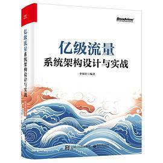

# 亿级流量系统架构设计与实战

- 作者：李琛轩
- 出版社：电子工业出版社
- 出版时间：2024-05
- ISBN：978-7-121-47698-3
- 豆瓣：https://book.douban.com/subject/36864478
- 封面：

> 其实这本书在去年就去省图借过实体书就看过了，如今拿电子版重新快速浏览一遍

# 前言

从业多年，笔者对软件开发工程师这一工作最大的感受就是：作为一名技术人，不应
该把自己视为“X公司的打工人”，如机器人一样循规蹈矩地完成自己应该做的工作，而
是应该时刻思考自己在未来要达成什么目标——无论你是有成为某领域顶级专家或者
CTO的理想，还是有去更好的公司工作的想法，在达成目标的过程中最值得做的事情都是
保证自己在时刻进步，而进步的核心是持续学习，学习也是我们在工作上更上一层楼的必
要条件。作为开发工程师，如果你是大厂中负责一个很小系统的所谓的“螺丝钉”，那么
你可以不局限于自己的工作职责，积极获取公司内公开的资源，学习如何“造火箭”；如
果你是小厂的工程师或者是未步入社会的学生，那么你可以在发达的互联网或品类繁多的
图书中获取自己目前接触不到的经验与知识o总之，让你的视野上升到更高层面，去学习、
去吸纳能让你进步的知识与技巧。

# [第 1 章 大型互联网公司的基础架构](ch1.md)

# [第 2 章 通用的高并发架构设计](ch2.md)

