# 第 1 章 大型互联网公司的基础架构

## 1.1 引言：单机房的内部架构

## 1.2 客户端连接机房的技术1： DNS

### 1.2.1 DNS的意义

DNS （ Domain Name System,域名系统）是互联网中的核心服务，它维护域名与对应
IP地址的映射关系，并提供将域名翻译为IP地址的域名解析功能。DNS在互联网中有非
常广泛的应用，它为用户和互联网公司带来了很多便利。

### 1.2.2 域名结构

### 1.2.4 域名解析过程

一旦本地域名服务器获得域名解析记录，它就会在本地进行记录
缓存，以便下次客户端再向它查询同一个域名时可以直接获得结果，而不用再进行递归查
询了。被缓存的域名解析记录格式大致如图1-4所示。

当查询域名 www.baidu.com 时，域名解析记录会包含如下数据：

- 生存周期（TTL）：表示这条记录在本地域名服务器中被缓存的时长。
- 协议类型（Class） ： 一般标识为IN,表示因特网。
- 记录类型（Type ）： A表示IPv4地址，AAAA表示IPv6地址。
- 记录数据（Rdata ）：与域名关联的地址信息。

## 1.3 客户端连接机房的技术2： HTTP DNS

DNS解析是用户访问互联网的第一步，如果这一步产生了较大的网络延迟、故障甚至
是数据错误，则会严重影响用户体验。如上文所述，DNS有很多优势，但是它也存在一些
问题（见1.3.1节）。业界很多互联网公司都尝试去解决这些问题，比如腾讯、字节跳动、
百度等公司已经给出了较为成熟的解决方案：HTTP DNSo

### 1.3.1 DNS存在的问题

域名解析需要进行递归查询，这势必会带来更高的访问延迟。

由于本地域名服务器是分地区、分运营商的，不同运营商实现的DNS解析策略不同。

由于权威域名服务器获取的是本地域名服务器的IP地址，而非客户端的
IP地址，所以在定位客户端地理位置时不一定准确，最终域名解析得到的IP地址对于客
户端而言可能不是距离最近、最优的访问节点。

某些运营商为了节约资源，会
直接将域名解析请求转发到其他运营商的本地域名服务器（即“域名转发”），这样做的后
果就是用户得到了与其网络运营商不相符的IP地址，用户访问网络请求变慢。

DNS劫持是一种互联网攻击方式，通过干预域名
服务器把域名解析到错误的IP地址上，以达到用户无法访问目标网站或访问恶意网站的
目的。很多知名的互联网公司备受DNS劫持的困扰，运营商可能基于本地域名服务器做
DNS劫持，黑客可能篡改计算机Hosts文件做DNS劫持。

### 1.3.2 HTTP DNS 的原理

HTTP DNS是基于HTTP,具有DNS解析能力的网络服务。

1. 客户端指定HTTP DNS服务器的IP地址（如5.5.5.5 ）,使用HTTP调用域名解析接口/d,并传入待解析的域名和客户端的IP地址。HTTP DNS服务器负责向权威DNS服务器发起域名解析请求，并将最优IP地址返回。
2. 客户端获取到域名IP地址后，直接向此IP地址发送业务协议请求。如果客户端需要访问业务请求 http://go.friendy.com/feed ,则在HTTP header中指定Host字段为此IP地址即可。

HTTP DNS服务器不通过域名提供服务（否则又需要域名解析），只通过一个固定的IP地址提供服务。

HTTP DNS服务提供商会采用如BGP （边界网关协议）等手段让这个IP地
址在全国各地都做到就近访问。以腾讯云HTTP DNS产品为例，它接入了 BGP Anycast
网络架构，与全国最主要的17个运营商建立了 BGP互联，确保各个运营商的用户都能快速访问到HTTP DNS服务器；同时，腾讯云在多个数据中心部署了多个HTTP DNS服务
节点，任意节点发生故障均可无缝切换到备用节点，保证了 HTTP DNS服务的高可用。

## 1.4 接入层的技术演进

在互联网发展的早期阶段，很多小型互联网服务的后台架构其实非常简单，几乎只有
业务服务器“裸奔”在所谓的“机房”里，如图1-6所示。

### 1.4.1 Nginx

Nginx是一种自由的、开源的、高性能的HTTP服务器和反向代理服务器，同时也是
IMAP, POP3、SMTP的代理服务器。Nginx既可以作为HTTP服务器进行网站的发布处
理，也可以作为反向代理实现负载均衡功能。

在网络接入层，代理分为正向代理和反向代理。

正向代理与反向代理的核心区别就是：正向代理代理的是客户端，反向代
理代理的是服务器，就像图1-7展示的那样。

Nginx能很好地充当反向代理，是因为它有强大的基于域名和HTTP URL的路由转发
功能，我们只需要对配置文件nginx.conf做一些简单配置就能轻易搭建出一台反向代理服务器。

假设Friendy应用内置了内容推荐、点赞和评论功能，这三个功能在服务端对应于三
个HTTP业务服务：feed服务、like服务、comment服务。每个HTTP业务服务都有两个
服务器实例，如表1-1所示。

- Nginx服务器作为feed服务、like服务、comment服务的反向代理服务器，是后台服务器机房的总入口，通过公网IP地址直接与客户端进行通信。
- Nginx根据收到的HTTP请求的URL相对路径，决定将请求转发到哪个服务以及哪个服务器实例，最后完成客户端与后台服务器中业务服务的交互。

Nginx服务器需要将每个业务服务的网络地址设置在nginx.conf配置
文件中，才能实现与业务服务的通信。但是业务服务会频繁地迭代与扩容，这意味着Nginx
upstream服务池中的服务器实例地址列表会频繁地变更。频繁地更新nginx.conf配置文件
并不现实，所以我们需要找到一种Nginx实时感知业务服务地址列表变更的方案(具体参
见1.5节介绍的服务注册与服务发现，现在仅需知道可以从服务注册中心获取每个服务的
最新可用地址列表即可)

好在Nginx拥有足够多功能强大的模块可以帮助解决这个问题。下面先介绍两个
Nginx模块。
- ngx lua:这个模块将Lua语言嵌入Nginx,从而允许开发人员编与Lua脚本并部署到Nginx中执行。
- ngx_http_dyups_module:这个模块使得Nginx不用重新启动就能热更新upstream配置并生效。

### 1.4.2 LVS

Nginx是一种高性能的服务器，其性能远高于业务服务器。但是Nginx毕竟是一个应
用层软件，单台Nginx服务器能承载的用户请求也是有上限的，当日活用户发展到一定规
模后，就需要Nginx集群才能顶住压力。既然是集群，那么势必需要引入一个中间层作为
协调者，其负责决定将用户请求转发到哪台Nginx服务器。这个协调者需要有比Nginx更
高的性能，它就是本节的主角：LVSo LVS （ Linux Virtual Server, Linux虚拟服务器）是
一个虚拟的服务器集群系统，从Linux 2.6版本开始它已经成为Linux内核的一部分，即
LVS运行于操作系统层面。

LVS和Nginx在转发请求时的区别：

Nginx是基于OSI参考模型的第七层（应用层）协议开发的，采用了异步转发形
式。Nginx在保持客户端连接的同时新建一个与业务服务器的连接，等待业务服务
器返回响应数据，然后再将响应数据返回给客户端。Nginx选择异步转发的好处是
可以进行失败转移（failover）,艮"如果与某台业务服务器的连接发生故障，那么
就可以换另一个连接，提高了服务的稳定性。Nginx主要强调的是“代理”。

LVS是基于OSI参考模型的第四层（网络层）协议开发的，采用了同步转发形式。
当LVS监听到有客户端请求到来时，会直接通过修改数据包的地址信息将流量转
发到下游服务器，让下游服务器与客户端直接连接。LVS主要强调的是“转发”。

由于LVS基于OSI参考模型的网络层，免去了请求到应用层的层层解析工作，而且
LVS工作于操作系统层面，所以LVS相比于Nginx有更高的性能。LVS用于网络接入层
时也被称为四层负载均衡器。既然LVS四层负载均衡器做的主要工作是转发，那么就需要
讨论一下转发模式。目前，LVS主要有4种转发模式：NAT模式、FULLNAT模式、TUN
模式、DR模式。

### 1.4.3 LVS+Nginx接入层的架构

机房接入层使用LVS与Nginx的配合可以发挥这两种负载均衡器的优势：LVS的性
能更高，便于Nginx构建集群，LVS作为Nginx集群的四层负载均衡器，可以有效提高
Nginx的可扩展性；而Nginx的功能更为强大，用它作为业务HTTP服务器的七层负载均
衡器，能将不同的HTTP URL调度到不同的业务服务并提高业务服务的高可用性和可扩展
性。LVS+Nginx的机房接入层架构如图1-14所示。

机房配置的LVS的公网IP地址（即VIP ）作为域名，客户端请求经过DNS解析后
进入LVS,然后LVS使用如FULLNAT模式将客户端请求转发到任意一台Nginx服务器,Nginx
服务器再根据HTTP URL将客户端请求转发到某个upstream服务池的任意一个服务器实例上。

为单点LVS引入Keepalived+VIP方案后实现的高可用架构如图1-16所示。

LVS虽然性能极高，但也是有上限的。
假设我们的互联网产品已经拥有亿级用户，那么单台LVS就会遇到性能瓶颈。想要痛快地
解决某个系统的高并发性能问题，就要为这个系统增加水平扩展能力。如图1-17所示，
我们可以使用多台LVS对外提供服务。如果有N台LVS对外提供服务，那么就要配置N
个VIP,这些VIP都绑定了同一个域名，客户端依赖DNS轮询来决定访问哪台LVS。

对于绝大多数互联网应用来说，做到这一步已经可以解决机房接入层的高可用、高性
能、可扩展的问题了。最终机房接入层架构已经趋于完备，此时：

- 通过DNS轮询方式扩展LVS的性能；
- 通过 Keepalived 保证 LVS；
- 通过LVS扩展Nginx的性能；
- 将Nginx作为业务HTTP服务器的七层负载均衡器，提高了业务服务的高可用性与可扩展性。

## 1.5 服务发现

业务HTTP服务在处理请求的过程中免不了与其他下游服务通信一可能会调用其他
业务服务，可能需要访问数据库，可能会向消息中间件投递消息等，所以业务HTTP服务
必须知道下游服务部署的可用地址。这就是本节要介绍的服务发现问题。

### 1.5.1 注册与发现

服务发现的技术原理并不复杂，一般通过提供一个服务注册中心来实现。这个服务注
册中心主要负责两件事情：管理每个服务的地址列表(注册)和将某服务的地址告知调用
者(发现)。让我们通过一个例子来阐明服务注册中心的工作流程。调用者A需要调用服
务B来完成某请求，服务发现过程如图1-18所示。

调用者A除了可以主动查询服务地址，还可以采取订阅推送的方式与服务注册中心通
信：调用者A在进程启动时就与服务注册中心通信，订阅关于服务B的地址数据；如果
服务注册中心有服务B的地址数据，或者服务B的地址发生了变更，那么它会主动将最
新地址列表推送给调用者A,如图1-19所示。

### 1.5.2 可用地址管理

由于服务的创建、销毁、升级、扩容/缩容都会造成服务地址列表的变更，所以服务
的每个实例在启动时都需要向服务注册中心注册自己的地址，并在退出时注销地址。只有
这样，才能使得服务注册中心一直在维护最新的服务地址列表。

不过，这还不够，我们还没有考虑异常情况。比如某服务实例突然挂掉，它还没来得
及向服务注册中心注销地址，这就使得服务注册中心向调用者下发了不可用的服务地址，
调用者调用请求被拒绝。所以，服务注册中心应该有对已注册的服务地址的探活能力。地
址探活一般有两种思路：

第一种思路是主动探活。服务注册中心周期性地向每个已注册的服务地址发起探测请
求，如果某地址探测成功，则认为这个地址是可用的；否则，认为这个地址已经失效，服
务注册中心主动摘除这个地址。

第二种思路是心跳探活。服务注册中心为每个已注册的服务地址记录一个最近心跳时
间，服务实例启动后，每隔一段时间（如30s） 就向服务注册中心发送一个心跳包，服务
注册中心收到心跳包后更新对应服务地址的最近心跳时间。服务注册中心会启动定时器来
检查每个服务地址的最近心跳时间相比于当前时间已经过了多久，如果其超过了某个阈值
（如150s）,那么就可以认为这个服务实例已经不可用了，服务注册中心将其地址摘除，如
图1-20所示。

这两个例子都是因为服务注册中心过度摘除地址而带来了风险，所以这里建议为服务
注册中心摘除地址增加简单的保护策略：在某服务的地址列表中，如果已摘除的地址数超
过某个阈值（如30%）,那么服务注册中心就停止摘除地址，并向服务负责人报警以寻求
人工处理，防止出现不可控的故障。

### 1.5.3 地址变更推送

当服务的地址列表发生变更时，为了让调用者尽快感知到这件事情，服务注册中心需
要主动推送最新地址列表给调用者。推送数据可能遇到的一个问题是“推送风暴”一如
果某服务有100个调用者，每个调用者又有1000个实例，那么每当这个服务的地址列表
发生变更时，就要给100000个节点推送数据；

那么，如何解决这个问题呢？

首先，建议推送的数据是“新增了哪些地址” “哪些地址已废弃”的增量数据形式，
而不是全量地址列表，这能在一定程度上节约推送数据的网络带宽。

其次，服务注册中心本身也是一个服务，如果公司的服务注册中心有条件部署大量的
实例，那么推送风暴问题也就被轻易解决了，毕竟分摊到每个服务注册中心实例的推送的
节点不会很多。

最后，可以采用推拉结合的方式：服务注册中心最多给N个调用者节点推送地址变更
信息，其他节点周期性地（如1min） 从服务注册中心拉取最新地址列表。

由于服务发现组件的存在，调用者只需要关心要调用谁，而不需要关心被调用者的地
址一 调用者可以随时升级、扩容，不用担心调用者找不到。作为微服务架构下最核心
的组件之一，服务发现真正为微服务带来了弹性。

## 1.6 RPC服务

你可能在1.1节的引言中注意到业务服务层包括HTTP服务和RPC服务，两者的定位
不一样。一般来说，一个业务场景的核心逻辑都是在RPC服务中实现的，强调的是服务
于后台系统内部，所谓的“微服务”主要指的就是RPC服务；而HTTP服务强调的是与
用户请求的交互，它做的主要工作一般比较简单，比如校验用户请求、打包响应数据，而
用户请求真正的处理逻辑会被HTTP服务通过RPC请求交给RPC服务来执行，HTTP服
务更像是业务服务层的“网关”。RPC服务对后台内部暴露RPC协议，而HTTP服务对后
台外部暴露HTTP。

由于RPC通信流程相对固定，gRPC、Thrift等RPC框架都可以利用所约定的协议定
义文件生成脚手架代码，使用者只需要将具体的方法处理代码完成后就能实现RPC通信了。

从上述介绍我们可以看出，RPC只是一种用于屏蔽远程过程调用的设计，它与HTTP
不是对立的，因为两者不是一个层面的概念。RPC底层的网络通信可以使用TCP实现（如
Thrift）,也可以使用HTTP实现（如gRPC ）,其本身并无限制。我们将业务服务层拆分为
HTTP服务和RPC服务，更想强调的是前者服务于后台外部，而后者服务于后台内部，即
后台服务之间的通信使用RPC形式。所谓的RPC协议只是表示RPC网络调用形式，而
RPC服务的意思是该服务是基于gRPC、Thrift或其他RPC框架生成的，后台内部可以通
过RPC形式与其通信。

## 1.7 存储层技术：MySQL

### 1.7.3 高可用架构1：主从模式

最基本的MySQL高可用架构是主从模式：一台MySQL服务器作为Master（主节点）,
若干MySQL服务器作为Slave （从节点）o在正常情况下，只有Master处理写数据请求，
同时Master与Slave通过主从复制技术保持数据一致。当Master发生故障宕机时，某个
Slave会被提升为Master继续对外提供服务，这样可以实现MySQL的高可用。

Master提交事务不需要经过Slave的确认，也不管Slave是否已接收binlog,
Slave写relay log失败、重新执行SQL语句失败等异常情况并不会被Master感知,所以
MySQL主从复制是异步的，Master提交完事务就直接返回了，如图1-29所示。

异步方式的主从复制有一个潜在隐患：如果Master在提交事务成功后，但尚未发送
binlog给Slave时就出现异常宕机了，那么对MySQL执行主从切换就会造成事务数据的
丢失，因为被提升为新Master的Slave并未复制这个事务。为了解决数据丢失的问题，
MySQL 5.5版本提供了半同步复制模式：Master在提交事务前，会等待Slave接收binlog,
当至少有一个Slave确认接收了 binlog后，Master才提交事务。

Master执
行半同步复制的过程如图1-30所示。

需要注意的是，在半同步复制模式下，Slave向Master发送ACK响应的时机并不是
重新执行SQL语句后，而是事务数据被写入relay log后。这样一方面可以缩短Master等
待响应的时间；另一方面，事务数据已经被持久化，不会发生丢失数据的情况。

半同步复制可以提高主从数据的一致性，但是Master提交事务要等待Slave的确认，
所以写性能会受到一定的影响。半同步复制适合对数据一致性要求较高的业务场景。

Master会因为向过多的Slave复制数据而压力倍增，这个问题被称为“复制风暴”。所
以实际的主从模式架构可能是一些Slave向Slave复制数据，以减轻Master的复制压力。

### 1.7.4 高可用架构2： MHA

MHA ( Master High Availability )在这方面做得很好。MHA在MySQL高可用
领域是一套相当成熟的解决方案，它通常可以在10 ~ 30s内完成MySQL主从集群的自动
故障检测和自动主从切换，并且在主从切换过程中，它可以最大程度地保证主从数据的一
致性，以帮助MySQL主从模式达到真正意义的高可用。

如图1-32所示，MHA由两部分组成：MHA Manager (管理节点)和MHANode (数
据节点)

-  MHAManager： MHA的“决策层”，负责自动检测Master的故障，检查主从复制状态，执行自动主从切换等。MHA Manager可以管理多个MySQL主从集群，通常被部署在单独的服务器上。
-  MHANode：被部署在每台MySQL服务器上，主要负责修复主从数据的差异。

1. MHA Manager周期性地探测Master心跳，如果连续4次探测不到心跳，则认为Master 宕机。
2. MHA Manager 判断各个 Slave 的 binlog,哪个 Slave 的 binlog 数据更接近 Master数据，就将哪个Slave作为备选Master
3. MHA Node试图通过SSH访问Master所在的服务：
	- 如果网络可达，那么MHA Node可以获取到Master的binlog数据。MHA Node对比Slave与Master的binlog数据，如果发现Slave数据与Master的binlog数据有差异，则会将差异数据主动复制到Slave,以保持主从数据一致。
	- 如果网络不可达，那么MHA Node对比各个Slave的relay log差异，并做差异数据补齐。
4. MHA Manager构建新主从关系，将备选Master提升为Master,其他Slave向新的Master复制数据

### 1.7.5 高可用架构3： MMM

MMM ( Multi-Master Replication Manager for MySQL )是一个 MySQL 双主故障切换
和双主管理的脚本组件，从字面上理解，它有两个Master,并实现了这两个Master的高可用

MMM通过移动虚拟IP地址(write vip)的方式切换Mastero当Master 1宕机时，
Master 2可以立即“上任”，MySQL业务使用方不会感知到主从切换的发生。不过，MMM
这套解决方案比较古老，不支持MySQL GTID,且社区活跃度不够，目前MMM组件处于
无人维护的状态。

### 1.7.6 高可用架构4： MGR

MGR ( MySQL Group Replication, MySQL 组复制)是 MySQL 5.7.17 版本推出的高可用解决方案，它具备如下特性。

至少由3个MySQL节点组成一个复制组，一个事务必须经过复制组内超过一半的节
点决议通过后才能提交。如图1-35所示，由3个节点组成一个复制组,Consensus层为Paxos
一致性协议层，在事务提交过程中组内节点进行决议(certify),至少有2个节点决议通过，
这个事务才能够提交。

如果在不同的MySQL节点上执行不同的写操作发生了事务冲突，那么先提交的事务
先执行，后提交的事务被回滚。在多主模式下，由于每个MySQL节点都可以执行写请求，
在写请求高并发的场景下发生事务冲突的概率较大，会造成大量的事务回滚，所以官方更
推荐单主模式。

在单主模式下，MGR会自动为复制组选择一个Master负责写请求。如果复制组内超
过一半的节点与Master通信失败，则认为Master宕机，MGR自动根据各节点的权重和ID标识重新选主，并很容易在各Slave之间达成共识。

由于MGR基于Paxos协议，所以主从节点数据有很强的一致性，可以做到数据不丢
失。此外，在一个拥有2N+1个节点的复制组中，MGR可以容忍N个节点发生故障，所
以这套方案的容错性也很高。

数据强一致性的代价是每个写请求都涉及与复制组内大多数节点的通信，所以
MGR的写性能不及异步复制和半同步复制，MGR更适合要求数据强一致性，且写请求量
不大的场景。

## 1.8 存储层技术：Redis

Redis是现在最受欢迎的NoSQL数据库之一，是一个包含多种数据结构、支持网络访
问、基于内存型存储、可选持久性的开源键值存储数据库。

- 支持分布式，包括主从模式、哨兵模式、集群模式，理论上其可以无限扩展。
- 基于单线程事件驱动模式实现，数据操作具有原子性。

Redis的应用场景非常广泛，例如缓存系统、计数器、限流、排行榜、社交网络等，
具体的应用原理我们会在后面的章节中逐一介绍。

### 1.8.1 高可用架构1：主从模式

Redis也提供了主从复制机制，所以使用Redis可以很方便地构建与MySQL类似的主
从模式。一个Master与若干Slave组成主从关系，当Slave与Master首次建立连接时，
Master向Slave进行全量数据复制，复制结束后，再根据Master的最新数据变更进行增量
数据复制。

1. Slave连接到Master,发送PSYNC命令准备复制数据。
2. Master收到PSYNC命令，执行BGSAVE命令生成目前全量数据的RDB快照文件，并创建缓冲区记录此后Master执行的数据变更命令。
3. Master向所有Slave发送RDB快照文件，并在文件发送期间持续在缓冲区记录数据变更命令。
4. Slave收到RDB快照文件后将其保存在磁盘中，再从磁盘中重新加载快照数据到内存，然后开始接收来自Master的数据变更命令。
5. Master发送完RDB快照文件后，继续向Slave发送缓冲区中记录的数据变更命令。
6. Slave收到数据变更命令后，在本地重新执行这些命令，以保证Slave与Master的数据一致。

不论是MySQL主从复制，还是Redis主从复制，大部分存储系统的主从复制原理都
基本类似，即Master向Slave发送全量数据和增量数据；而且，如果Master向过多的Slave
复制数据，则同样会出现“复制风暴”的问题。

### 1.8.2 高可用架构2：哨兵模式

哨兵模式的核心还是主从模式，只不过它在相对于主从模式下Master宕机导致不可
写的情况下，提供了一种自动竞选机制：所有的Slave竞选新的Mastero竞选机制的实现
依赖于在Redis存储系统中启动的名为Sentinel(哨兵)的服务器。在Redis高可用架构中，
Redis服务器除了可以是Master、Slave角色，还可以是Sentinel角色，它负责在Master
宕机后自动选举出一个Slave升级为新的Master继续对外提供服务。

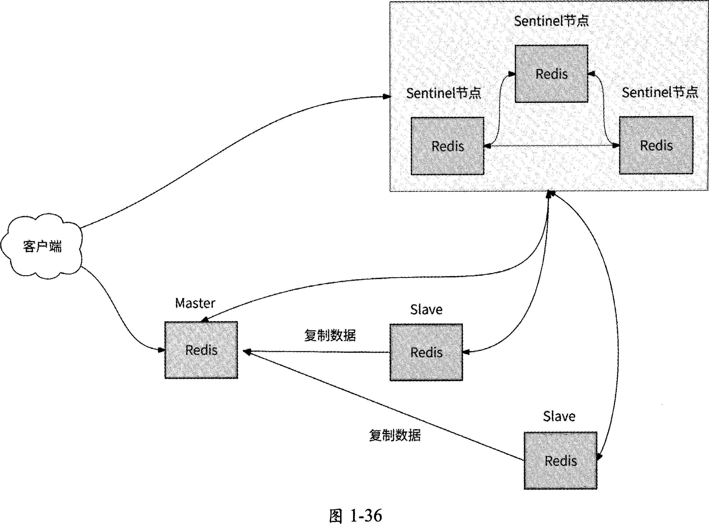

3个Sentinel节点组成Sentinel集群，负责监控每个Redis节
点的健康状况。在这种架构下，访问Redis的客户端，首先需要访问Sentinel集群获取Redis
Master地址，当Master发生故障时，客户端会从Sentinel集群中得到新的Master地址。
如此一来，研发工程师再也无须人工参与Redis主从切换的工作了，客户端也会在Master
发生故障时主动获取新的Master地址。

### 1.8.3 高可用架构3：集群模式

Redis 3.0版本提供了集群(Redis Cluster)模式，使得Redis真正拥有了分布式存储
能力。一个Redis集群由多个Redis节点组成，一个Master和若干Slave组成一个节点组，
代表一个数据分片。

如图1-37所示，Redis集群要求至少有3个Master,同时每个Master
应该至少有一个Slave用于保证一个数据分片的高可用，集群中各个Redis节点之间可以
相互通信。

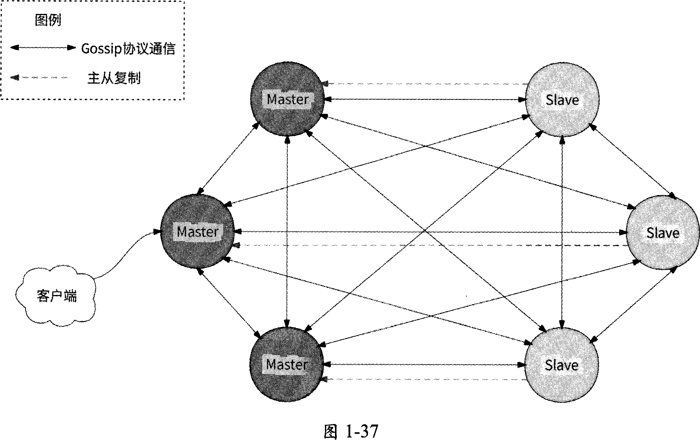

Redis集群基于哈希槽进行数据分片：整个Redis数据库被划分为16384
个哈希槽，每个Master可以管理0〜16383个槽位(Slot),这些Master把16384个槽位
都瓜分了。例如，图1-37中的3个Master可能分别管理0〜5461、5462〜10922和10923 ~
16383个槽位。

Redis集群中的每个节点都保存有各个节点的IP地址及其所负责的槽位信息，于是
Redis客户端连接任意一个节点最终都能保证数据读/写请求正确的数据分片(或者说
Master)处理。

对于亿级用户应用场景，Redis存储系统动辄需要几千个节点才能应对用户请求，这
时候使用Redis集群模式的架构就会直接将Gossip风暴问题暴露出来。解决Gossip风暴
问题最好的办法就是舍弃去中心化架构，而拥抱中心化架构：集群节点元信息不使用
Gossip协议传播，而是使用一个中间代理来维护。

### 1.8.4 高可用架构4：中心化集群架构

Redis集群中间代理(Proxy)用得最多的是推特公司开源的Twemproxy,其基本原理
是：通过中间代理的形式，Redis客户端将请求发送到Twemproxy,然后Twemproxy根据
数据路由规则将请求发送到正确的Redis节点，最后Twemproxy将请求执行结果汇总并返
回给客户端，如图1.38所示(注意：这里的Redis集群省略了主从复制功能。在实际应用
中，图中的每个Redis节点都会作为Master并与若干Slave共同组成一个Redis数据分片)。

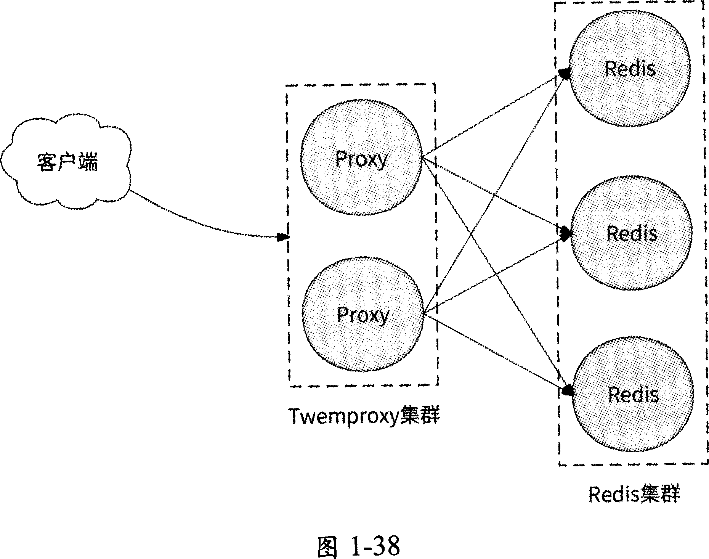

许多大型互联网公司都借鉴了 Twemproxy的思路并取长补短，纷纷推出了自研的
Redis中心化集群架构方案，业界较为知名的是豌豆荚公司开源的Codis项目。

与Redis集群模式类似，Codis将数据划分为N个槽位(默认为1024个),每个槽位
负责存储若干数据，数据与槽位之间的映射关系通过对数据Key运行CRC32算法后再与
N取模得到：slot = CRC32(Key) mod N

在Codis中包含如下四大类核心组件：

1. Codis Server：经过二次开发的Redis服务器，支持数据迁移操作。可以认为它就是Redis服务器，负责处理客户端的读/写请求。
2. Codis Proxy：接收客户端请求并转发给Codis Server,其作用与Twemproxy —样，都是中间代理。
3. ZooKeeper集群：用于保存Redis集群元信息，包括每个Redis数据分片负责管理的槽位信息、各个Redis节点的地址信息。它还保存了 Codis Proxy的地址列表，提供Redis客户端访问Redis集群的服务发现能力。
4. Codis Dashboard和Codis Fe：它们共同组成了集群运维管理工具，前者负责Redis集群扩缩容、Codis Proxy集群扩缩容、槽位迁移等，后者负责提供Dashboard的友好Web操作页面。

Codis将Redis集群中的每个数据分片都定义为Redis Server Groupo 一个Redis Server
Group包括一个Redis Master和若干Slave,用于保证每个数据分片的高可用。

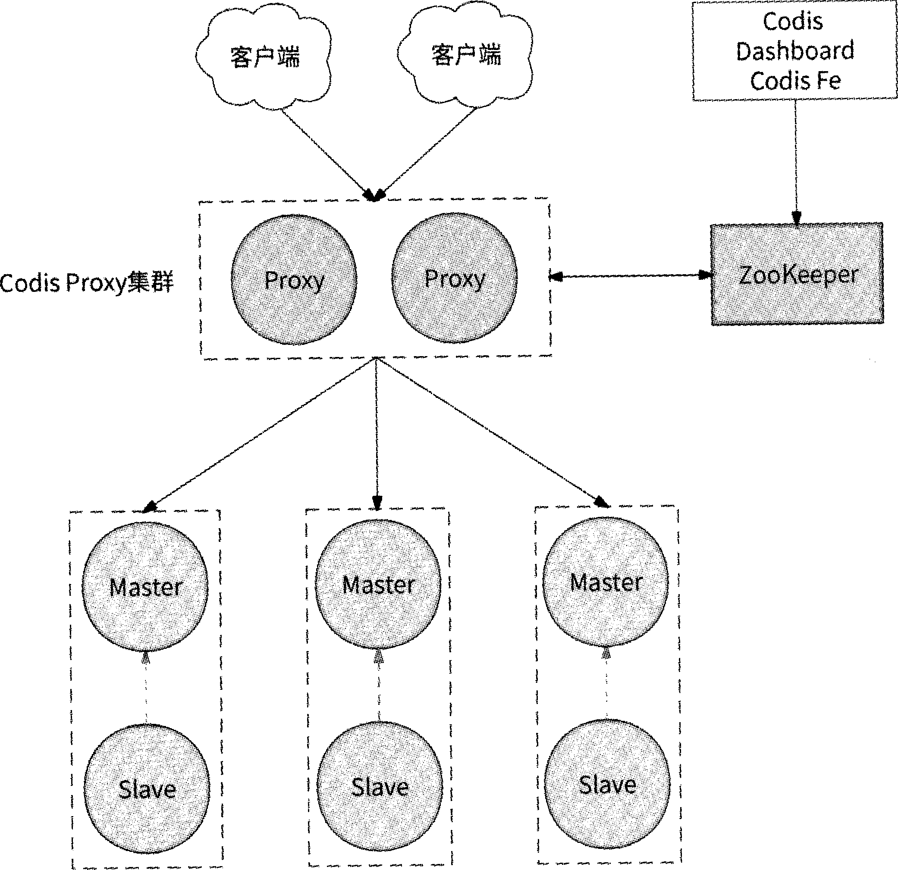

为了让Codis运行起来，我们先使用Codis Dashboard配置Redis Server Group的地址
信息、所管理的槽位信息以及Codis Proxy的地址，最终这些配置信息都会被存储到
ZooKeeper集群中。完成配置后，Codis就可以正式对外提供服务了。Redis客户端访问
Codis的流程基本如下。

1. Redis客户端从ZooKeeper集群中获取到Codis Proxy集群的地址列表，并选择一个Codis Proxy建立连接。
2. Redis客户端向Codis Proxy发送数据读/写请求。
3. Codis Proxy根据数据Key计算出对应的槽位，然后通过ZooKeeper集群得到负责此槽位的 Redis Server Group o
4. Codis Proxy将数据读/写请求转发到Redis Server Group中的某个Redis节点，其中Master可以处理数据读/写请求，Slave可以处理数据读请求。
5. Redis节点处理完数据后，将结果返回给Codis Proxy。
6. Codis Proxy将结果返回给Redis客户端，整个数据访问流程结束。

## 1.9 存储层技术：LSM Tree

LSM Tree （ Log-Structured Merge Tree ） 是一种对高并发写数据非常友好的键值存储模
型，同时兼顾了查询效率°LSMTree是我们下面将要介绍的NoSQL数据库所依赖的核心
数据结构，例如 BigTable. HBase. Cassandra. TiDB 等。

### 1.9.1 LSM Tree 的原理

LSM Tree的有效性基于一个结论：磁盘或内存的顺序读/写数据性能远高于随机读/写
数据性能。这个结论不仅对传统的机械硬盘成立，对SSD硬盘同样成立。

顺序读/写的意思是按照文件中数据的顺序有序地进行读/写操作，例如，向某磁盘文
件的尾部追加数据就是一种典型的顺序写操作；而随机读/写则相反，它不遵循文件中数
据的先后顺序进行数据的读取与写入。

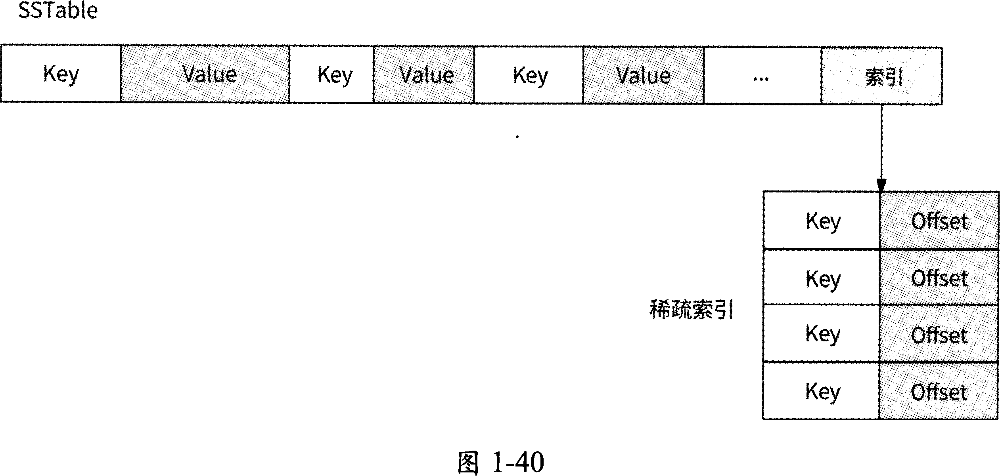

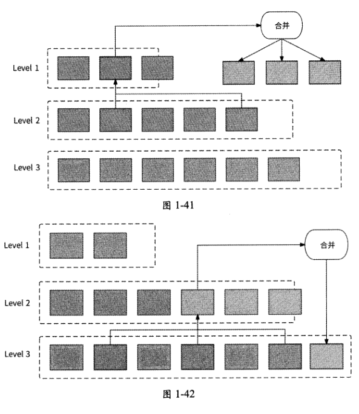

### 1.9.2 读/写数据的流程

在LSM Tree中查找数据时，按照数据值的新旧程度，查找顺序为 MemTable Immutable
MemTable、Level 0 SSTable、Level 1 SSTable，直到 Level N SSTable

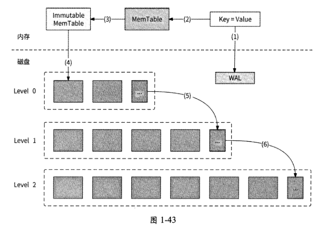

## 1.10 存储层技术：其他NoSQL数据库

### 1.文档数据库

文档数据库的典型代表是MongoDB和CouchDBo文档数据库普遍采用JSON格式来
存储数据，而不是采用僵硬的行和列结构，其好处是可以解决关系型数据库表结构
(Schema)扩展不方便的问题，以及可以存储和读/写任何格式的数据。

文档数据库适用的场景如下：

- 数据量大，且数据增长很快的业务场景。
- 数据字段定义不明确，且字段在不断变化、无法统一的场景。比如商品参数信息存储，电子设备商品参数有内存大小、电池容量等，月艮装商品参数有尺码、面料等。

文档数据库不适用的场景如下：

- 需要支持事务，文档数据库无法保证在一个事务中修改多个文档的原子性。
- 需要支持复杂查询，例如join语句。

### 2.列式数据库

列式数据库的典型代表是BigTable、HBase等。关系型数据库按照行来存储数据，所
以它也被称为“行式数据库”；而列式数据库按照列来存储数据，如图1・44所示的是一个
学生信息数据的例子。

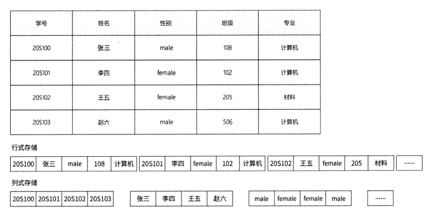

列式数据库将每一列的数据组织在一起，这样做有什么好处呢？假设现在要统计各专
业的学生人数，如果使用行式数据库，那么首先需要将所有行的数据读取到内存，然后对
“专业”列进行GroupBy操作得到结果。虽然我们只关注“专业” 一列，但是其他列也参
与了数据读取，磁盘I/O次数较多；而如果使用列式数据库，那么只需要将“专业”列数
据读取到内存，磁盘I/O次数大大减少，提高了查询效率。

列式数据库有很高的存储空间利用率，对于列数据类型是有限枚举（比如性别、专业）
的情况，列式数据库可以通过字典表将数据压缩为图1-45所示的形式。

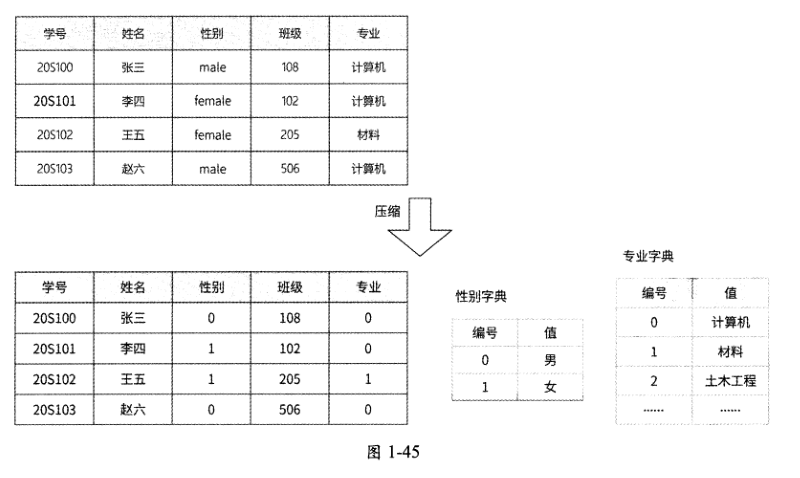

列式数据库适用的场景如下：

- 有海量数据插入，但是数据修改极少的场景，比如用户行为收集。
- 数据分析场景，比如针对少数几列做离线数据统计工作。

列式数据库不适用的场景如下：

- 数据高频删除、修改的场景，即不适合直接服务于在线用户。
- 需要支持事务的场景。

### 3.全文搜索数据库

全文搜索数据库的典型代表是Elasticsearch。关系型数据库在应对全文搜索场景时，
只能通过LIKE语句进行模糊查询，而LIKE语句会扫描全量数据，效率非常低下。全文
搜索数据库的出现就是为了解决关系型数据库不支持高效全文搜索的问题，其基本原理是
建立单词到文档的索引关系作为“倒排索引”。

倒排索引维护着每个关键词在哪些文档中出现过的文档列表。在进
行全文搜索时，根据搜索关键词就可以直接获取到相关文档信息。文档列表既可以保存文
档ID,也可以记录关键词在每个文档中出现的频率和位置。

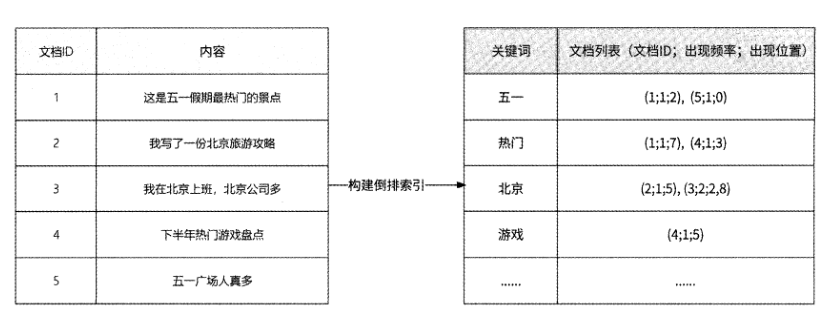

其典型的应用场景包括：

- 关键词搜索，如搜索引擎；
- 海量数据的复杂查询；
- 数据统计和数据聚合。

倒排索引不适用的场景包括：

- 高频更新数据的场景。在全文搜索数据库中，修改数据实际上是删除旧数据和创建新数据两步操作；
- 需要支持事务的场景。

### 4.图数据库

近几年图数据库较为火热，其主要的开源项目有Neo4j. Titan等。图数据库指的并不
是存储图片的数据库，而是以“图”这种数据结构存储数据的数据库。图由两个元素组成:
“节点”和“关系”。其中，节点表示一个实体（人、商品等事物），关系则表示两个节点
之间的关联关系。

上述几种NoSQL数据库，虽然分别解决了关系型数据库无法实现高效处理的一些问
题，但是也几乎丧失了关系型数据库的强一致性、事务支持等特性。因此，结合关系型数
据库及NoSQL数据库两者优点的数据库便产生了，即NewSQL数据库。目前其较为知名
的项目包括 Google SpannerTiDB、CockroachDB 等。

## 1.11 消息中间件技术

### 1.11.1 通信模式与用途

#### 1.异步化

消息中间件构建了这样的通信模式：一条消息由生产者创建，并被投递到存放消息的
队列中，消费者从队列中读取这条消息，于是生产者与消费者完成了一次通信。

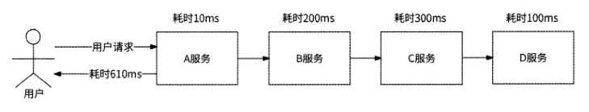

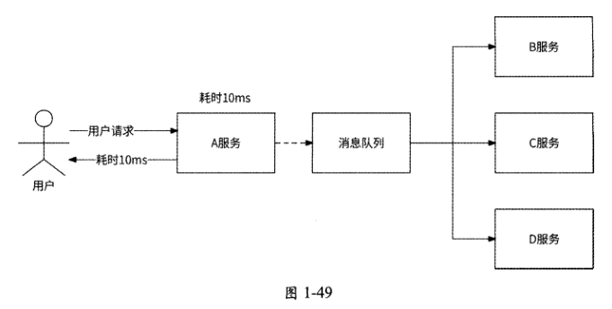

#### 2.流量削峰

假设A服务Is仅可以处理100个请求，流量高峰时10000 QPS会直
接击垮A服务，而通过消息队列的形式，A服务可以根据自己的请求处理速度来拉取消息，
在整个链路上原来的请求量10000 QPS被平滑为100 QPS,这就是流量削峰。

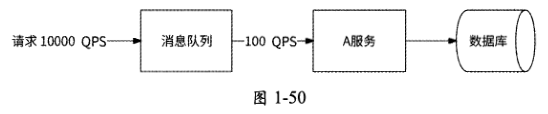

#### 3.解耦

在未使用消息队列时，服务之间的耦合性太强，如果B服务想加入A服务的请求处
理流程，则需要在A服务中实现对B服务的RPC逻辑。假设在系统中有3个服务，如下
所述。

- 点赞服务：负责处理用户对文章的点赞请求，主要业务逻辑是为用户和文章建立已点赞的关系记录。
- 热点服务：根据每篇文章的被点赞次数，给出当前最热门的文章列表。
- 策略服务：分析每个用户的点赞文章类型，以便可以将同类型的文章推荐给该用户。

热点服务和策略服务都想实时获取用户点赞行为，为此，我们只能在点赞服务对用户
点赞请求的处理逻辑中增加对这两个服务的RPCo如果将来有服务也想要收集用户点赞行
为，或者策略服务下线，则需要改造点赞服务，于是所有依赖用户点赞行为的服务都与点
赞服务形成了耦合，如图1-51所示。

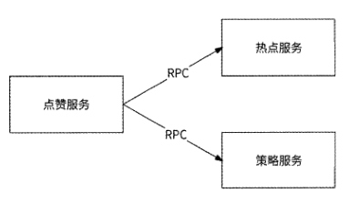

在系统中引入消息队列后，这种耦合关系得到完全解耦：点赞服务将在处理用户点赞
请求时顺便将点赞事件发送到消息队列，任何希望收集用户点赞行为的服务只需要被配置
成这个消息队列的消费者，而不会对点赞服务有任何影响。

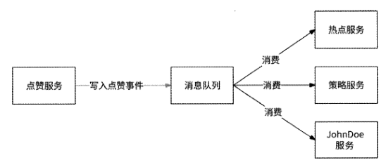

### 1.11.2 Kafka的重要概念和原理

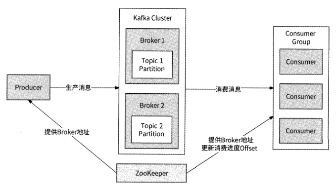

1. Producer （生产者）和Consumer （消费者）：它们很好理解，前者生产消息，后者消费消息。
2. Topic （主题）：每个发送到Kafka的消息都有自己的Topic,可以将其理解为消息的类型，比如上一节提到的用户点赞事件就是一个Topico生产者发送某Topic的消息，消费者订阅该Topic的消息。
3. Partition （分区）：一个Topic将消息数据分布式地存储在多个Partition中。这个Partition与存储系统的数据分片概念相同，都是将全量数据拆分为多个分区存储，以便实现负载均衡。每个Partition存储的消息都是基于Key有序的，不同Partition之间的消息不保证有序。Partition由Broker管理。
4. Broker： Broker是Kafka的核心，负责接收消息、将消息存储到Partition,以及处理消费者的消费消息逻辑。多个Broker组成Kafka Cluster  Kafka集群）。Kafka使用全局唯一的Broker ID为每个Broker编号。
5. Consumer Group （消费者组）：多个消费者实例组成一个Consumer Group, 一个Topic对应的消费对象是Consumer Groupo
6. ZooKeeper：负责Kafka集群元信息的管理工作，将包括Kafka的生产者、消费者和Broker在内的所有组件在无状态的情况下建立起生产者和消费者的订阅关系，并实现生产者与消费者的负载均衡。

当生产者向某Topic发送消息时，首先要决定将消息存储到哪个Partition：

- 如果消息指定了 Partition,则直接使用它；
- 如果消息未指定Partition,但是消息设置了 Key,则对Key做哈希运算后选出一个 Partition ；
- 如果消息既未指定Partition也未指定Key,则轮询选择一个Partitiono

消费者以Consumer Group方式工作’一个Consumer Group可以消费多个Topic, —
个Topic也可以被多个Consumer Group消费。当某Topic被一个Consumer Group消费时，
每个Partition消息只能被一个消费者实例消费，但是一个消费者实例可以消费多个
Partition消息，如图1-55所示。

这个限制表明，如果Topic有10个Partition,而Consumer Group有20个消费者实例,
那么就有10个实例处于空闲状态。

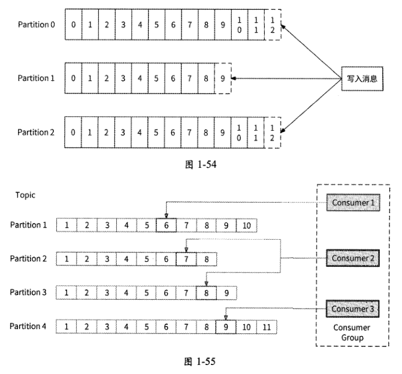

消费者采用拉取（pull） 的方式消费Partition消息，这样才能由消费者自己控制消费
消息的速度，以便实现消息队列的削峰能力。

### 1.11.3 Kafka的高可用

为了实现高可用性，Kafka允许一个Partition拥有多个消息副本（Replica）,每个
Partition的副本由1个Leader和若干Follower组成。生产者发送消息实际上写入的是
Partition的Leader,而Follower则会周期性地向Leader请求消息复制，以保证Leader与
Follower之间的数据一致性。

不只是生产者发送消息到Leader,消费者消费的也是Leader
中的消息，Follower的用途是作为Leader的数据备份，用于在Leader所在的Broker宕机
后接管Partition的读/写，尽可能保证消息不丢失。

如果一个Partition的所有副本都被存储到同一个Broker上，那么Broker
宕机后会造成这个Partition完全不可用，达不到高可用性的效果。所以，Kafka会尽可能
将一个Partition的每个副本都存储到不同的Broker ±o

将一条消息写入Partition,是写入Leader就算成功，还是所有Follower都已同
步这条消息才算成功？这要看Leader和Follower的数据复制需要哪种机制。

同步复制：所有的Follower都已复制此消息才认为消息写入成功。在这种机制下，
Leader与Follower数据一致性高，但是一旦某个Follower复制速度太慢或者宕机，
就会直接劣化消息写入的性能和可用性。

异步复制：只要Leader收到消息就认为消息写入成功，并不关心Follower是否已
复制此消息。在这种机制下，消息写入的性能高、可用性高，但是数据一致性得
不到保证。

Kafka采用的数据复制机制既不是完全的同步复制，也不是完全的异步复制，而是ISR
机制：每个Partition的Leader都会维护与其保持数据一致的Follower列表，该列表被称
为ISR (In-Sync Replica )。如果一个Follower长时间未发起数据复制，或者其数据落后于
Leader太多，那么Leader会将这个Follower从ISR中移除；在Partition写入消息时，只
有ISR中所有的Follower都已确认收到此消息，Leader才认为消息写入成功。Leader会根
据Follower状态动态地变更ISR,并将变更结果同步到ZooKeepero

ISR机制其实是同步复制和异步复制的折中，它可以很好地避免某Follower宕机对消
息队列的可用性、性能的影响，也在一定程度上保证了多副本间数据的一致性。

Kafka 0.8版本引入了 Partition Leader选举与故障恢复机制。首先，需要在Kafka集群
的所有Broker中选举一个Controller角色，用于负责Partition Leader选举和副本重分配工
作。当Leader发生故障时，Controller会将Partition的最新Leader、Follower变动通知到
相关Brokero Broker选举Controller借助了 ZooKeeper的分布式锁能力，哪个Broker先抢
到锁，它就是Controller

## 1.12 多机房：主备机房

解决机房单点问题最简单的方案是建设主备机房：在主机房所在的城市再建设一个
备机房，整个备机房的内部完全复制主机房架构，在正常情况下仅主机房工作。

在存储层，备机房数据库被部署为主机房数据库的从库，主机房与备机房通过专线做存储层数据复制。

专线是一种特殊网线，就是为某个机构拉一条独立的专用网线，也就是建立一个独立
的局域网，让用户的数据传输变得可靠、可信。专线的优点是安全性好，网络通信质量高；
不过，专线价格相对较高，而且需要专业人员管理。专线被广泛应用于军事、银行等场景。

专线是主备机房数据复制的核心通道。为了保证这条通道的可用性，我们可以在主备
机房之间铺设多条专线，这样可以规避如道路施工挖断专线等意外造成专线断连的问题。

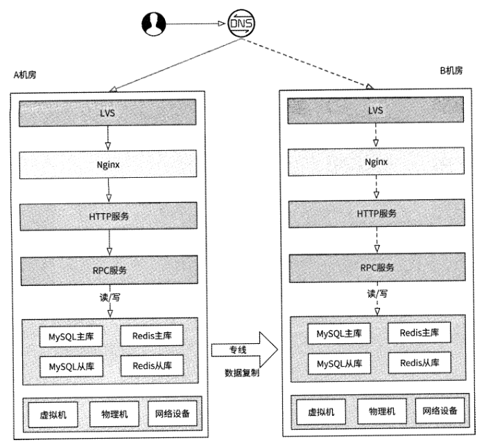

这种在同一城市部署的主备机房架构也被称为“同城灾备”，其主要优点是架构搭建
简单，备机房的搭建照搬主机房即可；缺点是实用价值不高，其主要问题如下。

备机房大部分时间处于空闲状态，造成大量资源浪费。机房的建设与运维成本极
其昂贵，常年供养一个空闲机房会让公司管理者颇有微词。

可用性存疑，这是最核心的问题。虽然理论上备机房能够在主机房出现故障时接
替其工作，但是它毕竟没有担任主机房的实战经验，我们无法确认它真的能在关
键时候起作用（根据笔者的实际经验，需要备机房挂帅的时候它总是掉链子）。这
就好比医院的一场手术，没有谁会放心让一个没有实战经验的实习生直接当主刀
医生。

## 1.13 多机房：同城双活

既然处于空闲状态的备机房既浪费资源又不确定可用，那么让备机房也与主机房一样
日常对外提供服务不就好了吗？这样一来，机房资源被利用起来，也有了承接用户流量的
实战经验，这就是“同城双活”架构。

### 1.13.1 存储层改造

“同城双活”架构与主备机房架构类似，只不过我们需要做一些改造：将两个机房的
接入层IP地址都配置到DNS。这样做的效果是两个机房都能负责一部分用户请求，形成
了 “双活”的局面。

如图1-58所示，A机房与B机房组成“双活”机房，并由DNS负责决定将用户请求
分流到哪个机房。从对外提供服务的角度来说，两者是对等的。此外，两个机房的服务可
以通过专线实现互相访问，即“跨机房调用”。

有一个核心问题还没有解决：在主备机房架构下，备机房（即B机房）存储
层的数据库是A机房的从库，从库意味着只能读数据，不可写数据，也就是B机房无法
处理写请求，这样的“双活”无法达到我们的预期。

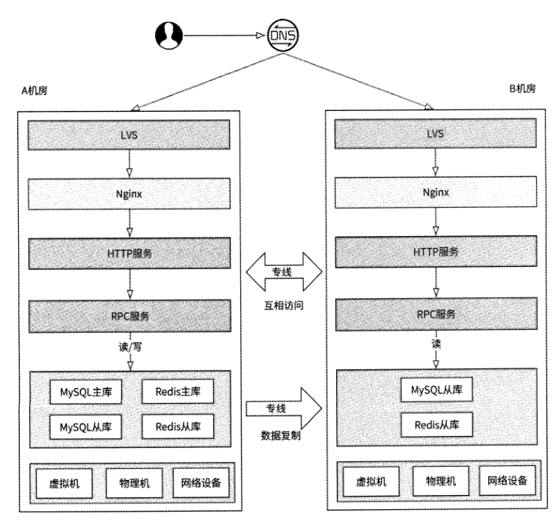

我们接着对存储层的访问做一些改造：B机房的所有写数据请求在访问存储层的数据
库时，直接跨机房访问A机房对应的主库 无论是将数据写入Redis、MySQL、MongoDB
还是写入其他存储系统。

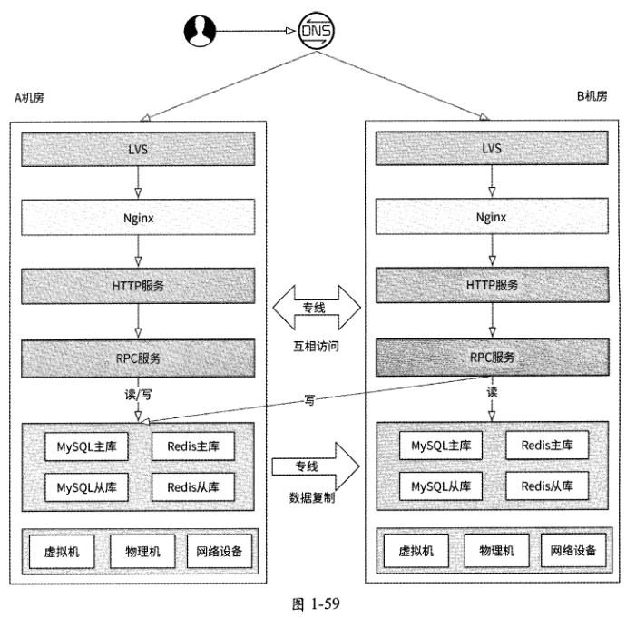

同一机房内网络通信的性能开销极小，可以忽略不计，而跨机房网络通信则会带来一
定的网络延迟，因为机房之间有一定的物理距离。因为B机房的写数据请求需要跨机房访
问A机房，所以这些写请求的延迟必然会增大。这是否是“同城双活”的潜在缺点？其实
并不是。首先，对于绝大多数互联网应用来说，写数据场景远远少于读数据场景，也就是
写请求的用户流量占比极低；其次，两个机房被部署在同一个城市，即两者的物理距离很
近，在专线通道的加持下跨机房请求的代价极低，延迟只会增加5ms左右。所以，在逻辑
上，我们可以把“同城双活”机房当作单机房来使用，不用过度在意跨机房访问的延迟问
题。

### 1.13.2 灵活实施

“同城双活”可以被灵活应用为“同城多活”，我们不一定只部署两个机房，而
是可以部署更多的机房，只要保证在存储层选出唯一的主机房就好。

### 1.13.3 分流与故障切流

用户的请求从客户端发起，这个请求应该访问哪个机房由分流策略来决定。因为可以
将“同城双活”简单地当作单机房来用，所以分流策略也没有考虑太多因素，只要控制部
分用户访问A机房、部分用户访问B机房即可。其实现方式是可以根据用户ID ( UserID )
或客户端设备ID ( DevicelD )将用户请求哈希映射到不同的机房。笔者建议使用DevicelD
来做哈希映射，这样可以使得未登录账号的设备也能被分流。

我们可以将双机房接入层IP
地址配置到DNS来实现将用户请求分流到不同的机房。但是这种分流方式相对粗糙一一
由于域名解析结果的不确定性，很有可能出现同一个用户的请求时而被分流到A机房、时
而被分流到B机房的情况，且分流策略变更的生效时间会因为DNS缓存的存在而变长。

我们还可以在客户端、HTTP DNS或其他接入层组件中实现分流。这里先介
绍客户端分流，它需要服务端与客户端配合来实现准实时分流。

当工程师修改了分流配置时，分流配置平台应该及时告知客户端分流策略有变更。一
种可行的做法是在接入层Nginx上记录最新分流配置的版本号，任何客户端请求被响应前
经过Nginx时都会在HTTP响应报文的Header中添加这个信息；客户端收到请求响应后，
一旦发现HTTP Header中恢复的分流配置版本号大于本地的，就主动向分流配置平台拉取
最新的分流配置。

我们也可以使用HTTP DNS实施分流策略：客户端向HTTP DNS发起域名解析请求
时携带DevicelD, HTTP DNS根据域名的分流配置计算出对应的机房，然后将此机房的一
个入口 IP地址返回给客户端，客户端就会接入此机房。其他接入层技术也都很容易支持
机房分流，比如CDN动态加速、公有云机房网关，甚至是使用机房内的Nginx分流，它
们的实施思路大差不差，这里不再赘述。

最后需要说明的是，当A机房发生故障时，我们需要做的不一定只有切流到B机房
这一件事情，还要看A机房的存储层属性：

如果A机房存储层的数据库是从库，那么切流到B机房就好；

如果A机房存储层的数据库是主库，B机房存储层的数据库是从库，那么切流到
B机房会造成写数据请求无法执行。所以，我们还需要将B机房的所有存储数据
库提升为主库。

### 1.13.4 两地三中心

“同城双活”架构大大提升了机房的高可用性，同时兼顾了机房资源的利用率，它有
较好的实用价值。不过，“同城”有一些潜在风险，比如水灾、龙卷风、地震等城市级自
然灾害会让距离相近的两个机房全军覆没，机房高可用性保障似乎做得还不够好。于是，
业界的一些公司提出了 “两地三中心”架构方案来优化“同城双活”。

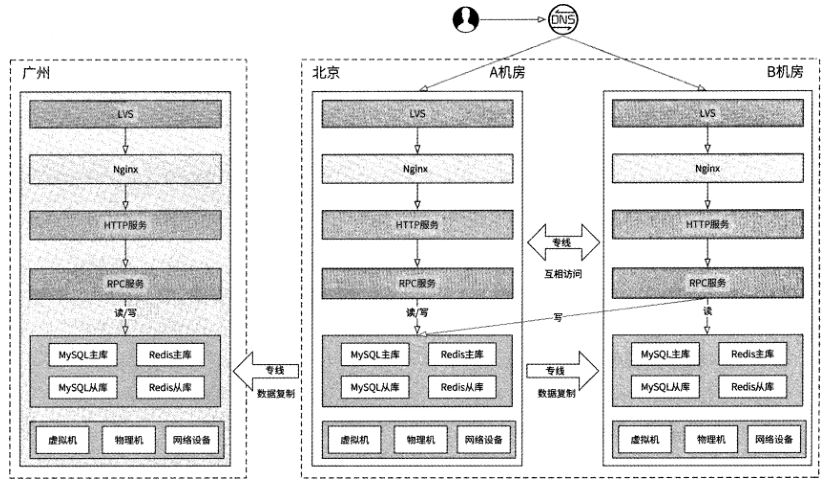

## 1.14 多机房：异地多活

大部分互联网应用使用“同城双活”架构就可以承担海量用户请求与保障后台高可用
了，但是如果你的应用不是仅面向一个国家，而是面向全球（如FacebookA Instagram等）,
那么“同城双活”架构就会带来一些问题。

用户访问延迟问题。比如我们在泰国曼谷建设了 “同城双活”机房，泰国、日本、
韩国、马来西亚等附近国家用户的访问请求能被快速响应，而欧洲用户的访问请
求只能“跨越山河大海”才能接入机房（因为欧洲距离曼谷物理位置太远），这就
会造成访问延迟大大增加，用户会明显感觉到应用卡顿。

数据合规问题。很多国家非常注重互联网用户隐私数据安全，它们通常要求应用
将本国用户的数据独立存储到本国机房。“同城双活”架构最多只能满足一个国家
的数据合规要求。

灾难问题。如果部署机房的国家发生了战争、暴乱、自然灾害等，则可能导致机
房被破坏，进而导致整个应用在全球范围内不可用。

全球级互联网应用后台一般采用多国部署机房的架构：在全球范围内筛选几个国家和
城市部署机房并负责接入附近国家用户的访问请求，各个机房之间通过数据复制保证它们
都有全球全量数据，这就是“异地多活”架构。

### 1.14.1 架构要点

在“同城双活”架构下，会选择一个机房的数据库作为存储层的主库，其他机房的写
数据请求会跨机房写入主库，而读数据请求则依赖各存储系统自带的主从复制功能，实现
机房间数据的复制。但是“异地多活”架构无法照搬这种存储层设计，其原因就是“异地”
意味着机房间物理距离太远，使得网络通信产生巨大延迟，网络访问的成功率无法得到保证。

所以，“异地多活”架构的第一个要素是应该让每个机房都在本机房内处理写数据请
求，即每个机房都独立部署各存储层的主库，各个机房的存储层之间不再有主从关系。

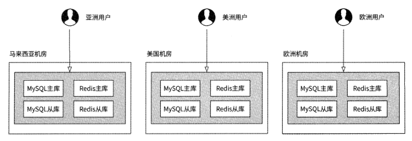

各国用户的数据读/写请求都只在相关机房的存储层内独立处
理，各机房间完全独立。每个用户的读/写请求均可以得到较快的响应。但是，这个架构
有一个明显的缺点：每个用户只能看到一个机房的数据，在应用表现层面，日本用户只能
与日本、韩国、东南亚各国的用户互动，而无法感知到美洲、欧洲等地区用户的存在，更
无法与这些用户建立关系。这对于任何一个全球互联网应用来说都是完全不符合产品预期的。

所以，“异地多活”架构的第二个要素是数据互通，即每个机房都应该将本机房写入
的数据复制到其他机房，这样才能实现任何用户都可以与任何国家的用户互动。在“异地
多活”架构下，每个机房存储层的主库都可以通过跨国专线向其他机房存储层的主库复制
数据，最终架构如图1-63所示。

无论是MySQL,Redis还是其他存储系统，官方都不支持主库与主库之间复制数据(简
称“主主复制”)，所以构建“异地多活”架构需要我们对各种存储系统进行一定的改造。
在这方面业界有较多成熟项目，比如阿里巴巴分别为MySQL,Redis.MongoDB开发的“主
主复制”中间件Otter、RedisShake、MongoShake,携程公司的Redis多数据中心复制管理
系统XPipe,它们都是在“异地多活”场景下存储层跨机房“主主复制”的优秀工具。这
种负责存储系统双向数据复制的工具一般被称为DRC ( Data Replicate Center )o

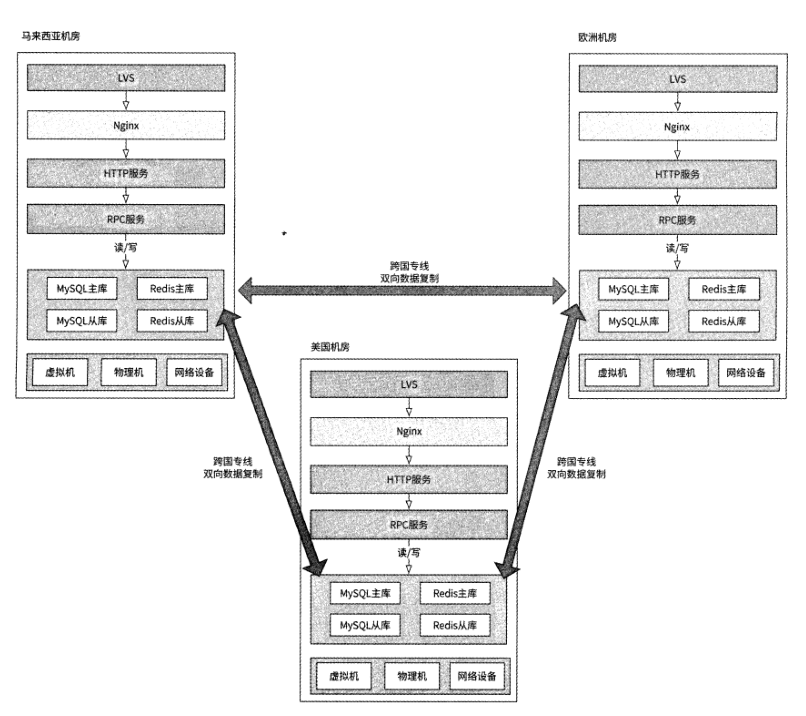

### 1.14.2 MySQL DRC 的原理

MySQL DRC I具的组成结构一般如图1-64所示。

Sync-out：负责将本机房MySQL主库的数据复制到另一个机房，扮演从库的角色,
会模拟MySQL从库与主库的交互协议，将自己伪装成一个从库来访问主库，于是
主库会将binlog数据发送给Sync-out,最后Sync-out实时得到了主库的数据变更
记录。这种实时获取主库数据的技术被称为“伪从”，相关开源项目包括阿里巴巴
的 CanalA Linkedln 公司的 Databus 等。

Sync-in：负责接收从另一个机房复制过来的数据并写入本机房的MySQL主库。

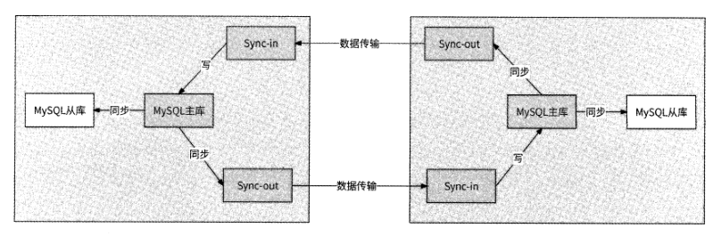

为了将数据复制到其他机房，Sync-out会与远端机房的Sync-in建立TCP长连接，
Sync-out收到主库的binlog记录后解析保存到本地磁盘，同时会不断传输数据到远端
Sync-in, Sync-in收到。Sync-out宕机、传输网络连接断开都会导致数据传输中断，DRC
工具可以借助MySQL GTID实现断点续传能力：Sync-out在数据传输过程中会记录最新的
已传输成功的数据GTID,在Sync-out宕机重启或者传输网络断线重连后，都可以根据
GTID迅速定位到binlog文件的某个位置，而后Sync-out继续传输此位置之后的数据。

GTID ( Global Transaction Identifier)是 MySQL对每个已提交事务的编号，并且是
MySQL主从集群中全局唯一的编号。GTID和事务会被记录到binlog文件中，用来标识
事务。根据GTID可以准确定位到一个事务在binlog文件中的位置。

Sync-in扮演了数据库客户端的角色。Sync-in收到远端Sync-out复制过来的数据后，
还原写数据SQL语句并在本机房的主库中执行。

断点续传可能造成数据被重复传输，我们需要避免重复数据被写入远端机房。具体的
处理方式也是应用GTID： Sync-in保存已写入数据GTID的集合用于数据防重。当Sync-in
收到远端Sync-out传输过来的数据时，先检查此GTID是否已在GTID集合中，如果在，
则说明此数据被重复传输了，Sync-in直接忽略此数据。

使用DRC工具还可以防止数据回环。数据回环指的是数据变更记录被从A机房复制
到B机房，又被从B机房复制回A机房的现象。例如，在A机房对数据D进行修改(将
其值从vO修改为vl), binlog会产生类似于“D: vO->vl”的变更记录，于是这条记录会
被Sync-out复制到B机房；B机房的Sync-in将此记录写入数据库，从而造成“D: vO->vl”
又被B机房主库的binlog文件记录，于是Sync-out又将这条记录复制到A机房，这就使
得“D:vO->vl”产生了数据回环。

数据回环根据结果具体分为两种情况。

A机房的“D:vO->vl”回环一次回到A机房。由于A机房数据D的值早已是vl,
被回环的数据变更记录并没有修改数据值，所以不会产生binlog记录，回环结束。
这种情况只会造成数据变更记录被回环一次。

在A机房，在很短的时间内对数据D进行了两次修改:“D:vO->vr^"D:vl->vO”，
这两条变更记录回环一次回到A机房。由于A机房数据D的值为vO,所以“D:
vO->vl”和“D:vl->vO”被相继执行并再次记录到binlog文件中，从而产生了新
的回环，并进入无限回环的局面。这将严重占用机房间数据传输通道的带宽。

防止数据回环的方案并不复杂：在主库中创建一个辅助表，用于记录哪些数据变更事
务来自其他机房，Sync-in在将数据写到主库时利用事务机制在辅助表中插入一条数据；
Sync-out解析主库发送的binlog数据，检查每个事务是否有写辅助表，如果有，则说明数
据变更事务来自其他机房，不传输此数据。

这里还需要考虑的一个问题是数据冲突。在A机房和B机房几乎同时修改了数据D,
A机房的数据变更记录是“D: vO->vl”，B机房的数据变更记录是“D:v0->v2”； A机房
将数据变更记录发送到B机房时，发现数据D的值为v2,产生了数据冲突。

数据冲突很难解决，我们只能使用一些策略来决定在数据冲突时选择哪一方的修改结
果。一种可能的策略是Last Write Wins ( LWW ),即最后写入者胜利策略：主库在数据变
更时自动记录每行数据的最新修改时间，当B机房的Sync-in收到“D: vO->vT'的变更记
录，却发现本机房的数据D的值为v2时，对比“D:vO->vl”的修改时间与数据D的最新
修改时间——如果前者更晚，则执行写入，否则"D:vO->vl”被忽略。LWW依赖时间戳，
其本意是让更晚发生的数据变更记录作为最终结果，但是不同机房同一时刻的时间戳并不
一定相同，这就使得数据变更的时间早晚顺序并不准确，所以这种策略并不准确。

要想真正解决数据冲突，只能尽量避免数据冲突。比如在订单系统中，如果在数据库
中创建订单时使用自增主键作为订单ID,那么不同机房创建的不同订单就有了相同的订
单ID,机房双向复制时就会产生大量数据冲突。所以，如果某服务需要异地多活，那么
这个服务的业务逻辑就不能对数据库自增主键有任何依赖，而是应该采用分布式唯一 ID
等方案(见第4章)。

在机房分流上，应该尽量保证不同的用户被分流到不同的机房，这样才能使得
与每个用户相关的数据同一时刻仅在一个机房内被修改，而避免了在不同的机房同时修改
这个用户数据的可能。

MySQL DRC工具的技术核心要点包括实现伪从、断点续传、数据
防重，以及防止数据回环和数据冲突。其实不仅仅是MySQL,其他任何存储系统的DRC
工具设计都是围绕这几个要点展开的。

### 1.14.3 Redis DRC 的原理

Redis DRC工具的设计思路与MySQL DRC工具类似，依然需要Sync-out与Sync-in
组件。不过，Redis与MySQL作为存储系统在功能上有较大的差异，实现伪从、断点续传、
数据防重，以及防止数据回环和数据冲突需要不同的手段。

对于伪从：由于Redis自带主从复制功能，所以Sync-out模拟Redis从库向Redis主
库复制数据即可，复制的数据形式是Redis写命令。Sync-out将Redis写命令暂存到本地。

对于断点续传和数据防重：Redis没有MySQL的GTID机制可以唯一标识一个事务，
所以我们只能自己开发一套Redis专用的GTID,使用递增的唯一 ID来达到此目的。
Sync-out为每个收到的Redis写命令都绑定一个单调递增的ID,并保存目前已成功传输的
写命令ID。这样一来，在网络故障恢复或Sync-out重启后，就可以继续传输了。对端机
房的Sync-in也保存最近成功写入的写命令ID,如果Sync-in收到的新的写命令ID小于或
等于这个ID,则说明收到了重复数据，丢弃即可。

对于数据回环：Redis防止数据回环可以通过如下两种思路。

1. 改造Redis的写命令格式，让其携带机房信息。
2. Redis主库识别Redis客户端的角色，如果是Sync-in发来的写命令，则不复制到Sync-out

第一种思路需要修改Redis的全部写类型命令，且每当Redis升级到新版本加入新的
写命令时，我们都要跟进修改，整体的维护成本和实现成本较高。

### 1.14.4 分流策略

将一个用户的访问请求固定在一个机房可以有效防止存储层数据冲突。虽然通过“同
城双活”架构的DevicelD分流策略可以达到这个目的，但是这种策略无视用户的地理位
置，必然导致大量用户被分流到距离很远的机房，比如韩国用户被分流到欧洲机房。这会
明显降低用户访问体验，所以它并不适合“异地多活”架构。

适合“异地多活”架构的分流策略一定要考虑用户的地理位置，DNS正好支持按地域
配置域名解析，我们可以为不同的国家用户配置不同的机房接入层IP地址，保证绝大多
数用户可以通过DNS直达目标机房。

DNS分流策略的缺点是用户网络环境会干扰域名解析结果，比如用户使用了 VPN、
非本国SIM卡以及用户出国旅行等情况都可能导致用户被分流到其他机房。

一种固定用户所在国的方案是用户注册国策略。新用户在应用内注册账号时，客户端
携带用户国家信息作为其注册国，后台创建用户初始信息时保存注册国信息；之后用户的
任何访问请求都根据注册国来选定目标机房。客户端可以将使用SIM卡国家代码或者IP
地址反查得到的国家作为其注册国。

在确定了用户注册国后，用户每次登录应用时都会先从用户信息服务中获取注册国信
息，然后根据注册国映射到预先配置好的机房。比如我们配置了日本用户访问马来西亚机
房，那么注册国是日本的用户无论是出国还是使用VPN等都将固定访问此机房。

受限于用户注册国策略，日本用户在欧洲旅行期间访问应用会出现卡顿。如果用户是
短期旅行尚可接受，但如果用户是出国长居，那么总是出现访问卡顿可能会让用户失去耐
心。我们可以对用户访问请求进行国家维度的监控，如果发现某用户访问请求时当前所在
国与注册国在连续较长的时间内都不同，则可以将用户注册国改为当前所在国，以及时改
善用户体验。

### 1.14.5 数据复制链路

网状结构表明，稍稍增加机房数量就会使得双向数据复制链路激增，这将导致机
房维护成本也骤然升高。对于这种情况，我们可以进一步优化：约定某个机房为中心机房，
其他机房的主库数据仅被复制到中心机房，再由中心机房将其复制到全部机房，形成如图
1-68所示的星状结构。

同样的6个机房，星状结构只需要5条双向数据复制链路，
机房架构的复杂度大大降低。在网状结构下，如果机房数量远大于双向数据复制链路数，
则适合改造为这样的星状结构。

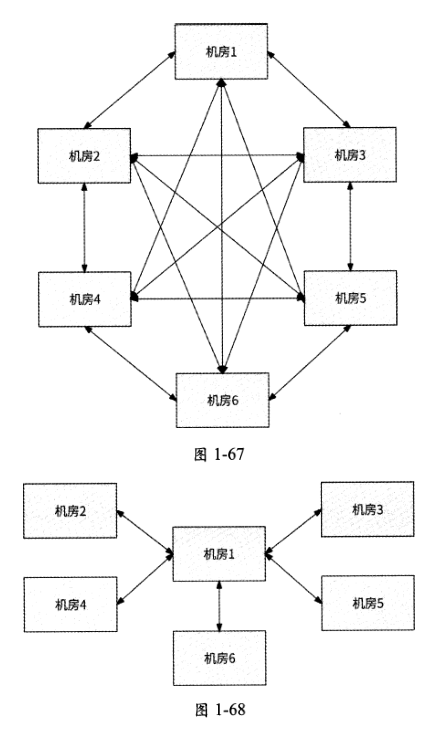

## 1.15 本章小结

在一个互联网应用内，用户在pc 端、移动端的任何点击行为几乎都会通过互联网发
出网络请求到应用后台机房，从发出请求到请求被响应的时间虽然非常短，但在这短短的
时间内却涉及很多事情。

1. 用户请求以HTTP形式发出，并通过域名指定应用所在机房的地址；DNS、HTTP DNS等技术提供了域名解析服务，使得用户请求的目的地指向应用机房的接入层IP地址。
2. 用户请求进入机房后到达四层负载均衡器LVS, LVS将用户请求进一步转发到七层负载均衡器Nginxo
3. Nginx根据用户请求的URL与已配置的URL转发规则进行匹配，将用户请求进一步转发到相关业务层的HTTP服务。
4. HTTP服务处理用户请求，并根据业务逻辑继续向相关业务层的RPC服务发起调用。
5. RPC服务处理请求，在处理逻辑中可能需要调用其他RPC服务，或者从存储层的Redis、MySQL等中获取相关业务数据。
