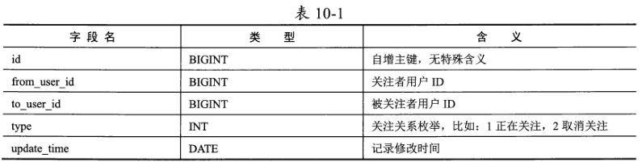
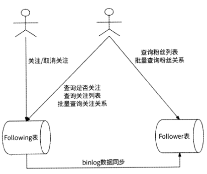
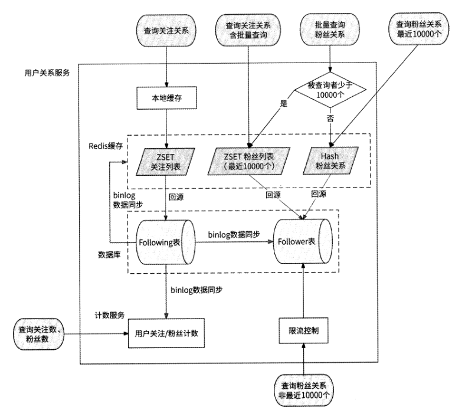
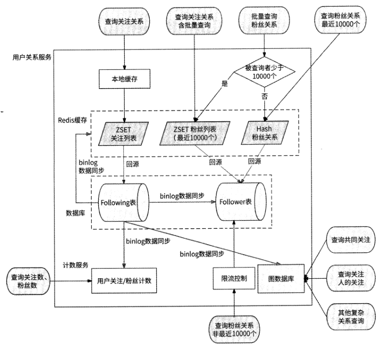

# 第 10 章 用户关系服务

任何注重用户互动的互联网应用，都会将用户之间的关注功能作为产品的重要功能之
一，因此它允许用户订阅其他用户的动态，以便及时获取用户的更新和动态。

## 10.1 用户关系服务的职责

用户关系服务负责处理用户之间的关注行为，其提供的相关接口应该包括如下几个

- 关注与取消关注的接口
- 查询用户关注列表的接口
- 查询用户粉丝列表的接口
- 查询用户的关注数与粉丝数的接口
- 查询用户关系的接口

## 10.2 基于Redis ZSET的设计

一开始我们很容易想到使用Redis的ZSET对象来实现用户关系服务,ZSET高效支持
数据的插入与查询功能，且很容易实现按照关注时间排序。

## 10.3 基于数据库的设计

### 10.3.1 最初的想法

创建一个数据表来表示用户1与用户2的关注关系，数据表名为User_relation,表结
构如表10-1所示。

from_user_id 字段的索引和to_user_id字段的索引，那么应该将哪个索引作为分库分表的依据？如果使用from_user_id字段来分库
分表，那么在查询用户的粉丝列表时要访问所有的子表；使用to_user_id字段同理。这就
是我们遇到的最核心的坑点。

### 10.3.2 应对分库分表

如果非要在这两个索引上寻求一个分库分表的依据，那么显然是没有答案的。所以，
不如使用两个数据表来描述用户的关注关系：Following表和Follower表。这两个表的结
构与User_relation表完全相同，只不过Following表使用from_user_id作为索引,Follower
表使用to_user_id作为索引。

当查询用户1是否关注了用户2、查询某用户的关注列表，以及批量查询某用户对若
干用户的关注关系时，使用Following表；而当查询某用户的粉丝列表、批量查询若干用
户与某用户的粉丝关系时，使用Follower表。这样一来，这几种场景都可以命中索引，提
高查询效率。

### 10.3.3 Following表的索引设计

### 10.3.4 Follower表的索引设计

### 10.3.5 进阶：回表问题与优化

### 10.3.6 关注数和粉丝数

虽然可以使用COUNT命令从数据库中获取用户目前的关注数与粉丝数，但是本书
8.2.2节介绍过这种方式效率非常低下，更好的方法是使用计数服务单独存储这些数据。我
们可以使用伪从技术，创建一个消费者服务作为Following表的伪从，订阅Following表的
binlog,当用户1关注或取消关注用户2时，消费者服务会收到此事件对应的binlog,然
后在计数服务中更新用户1的关注数和用户2的粉丝数；当读取某用户的关注数和粉丝数
时，直接从计数服务中获取数据即可，不需要与数据库交互。

## 10.4 缓存查询

### 10.4.1 缓存什么数据

对于一个海量用户应用来说，读取用户的关注列表和粉丝列表，以及查询用户之间的
关注关系都属于高并发读场景。

大部分互联网应用在设计用户关注功能时，都会限制每个用户的最大关注数量，这是
为了防止用户滥用关注功能进行刷粉、刷流量等，避免影响应用内的用户体验和社交环境。

新浪微博限制一个用户最多可关注2000人。这样的限制，
意味着用户关注列表的长度不会超过2000人。因此，我们可以把用户的关注列表全量缓
存到Redis中，数据模型与10.2节介绍的一致。

粉丝列表则不同，对用户拥有多少粉丝是没有限制的，这就意味着粉丝列表的长度可
能达到数百万人、上千万人甚至上亿人，Redis无法全量缓存这些数据。

不过，对于粉丝
量巨大的大V来说，大部分用户只会简单地查看粉丝列表的前几页，很少有用户会专门耗
费大量时间查看全部粉丝。所以，对于粉丝列表仍然可以使用Redis缓存，只不过仅缓存
用户最近的10000个粉丝。对于查询最近10000个粉丝的用户请求，会优先查询Redis缓
存；而对于查询10000个以外粉丝的用户请求，才会查询数据库。

如果黑客恶意发起大量请求拉取最近10000个粉丝以外的粉丝列表，那么这些
请求会统统访问数据库，可能造成数据库宕机。我们可以采用限流的方式来解决这个问题,
比如在收到读取粉丝列表的请求时，用户关系服务先检查此请求查询的数据是否在最近
10000个粉丝之外，如果是，则检查此时的请求量是否已达到限流阈值，对于超过限流阈
值的请求拒绝执行。

### 10.4.2 缓存的创建与更新策略

创建缓存很简单，当用户请求访问关注列表或粉丝列表时，用户关系服务会先查询
Redis缓存，如果查询不到数据，再进一步从数据库中获取数据，然后在Redis中创建对
应的ZSET对象。

### 10.4.3 本地缓存

大v的关注列表的曝光率要远远大于普通用户的，很多用户都会关心大v关注了哪
些人。另外，大V在关注其他用户时相对谨慎，这就意味着他们的关注列表数据比较固定。

粉丝列表的数据特点则完全不同。大V的粉丝变动非常频繁（毕竟是网红），并不适
合使用本地缓存；而普通用户的粉丝变动虽然相对较小，但是其粉丝列表的访问量也非常
小，使用本地缓存不会有很高的缓存命中率，且意义不大。所以，无论是何种用户，都不
适合使用本地缓存。

### 10.4.4 缓存与数据库结合的最终方案

经过对数据库设计、缓存设计的详细讨论，我们总结并提炼出缓存与数据库结合的最
终方案。图10-2展示了用户关系服务设计最终方案的整体架构图。

Following表为数据库的主表，Follower表、计数服务、Redis缓
存都以Following表为标准来更新数据。

## 10.5 基于图数据库的设计

使用数据库与缓存结合实现高并发的用户关系服务是一种合格的传统方案，数据库、
缓存技术都非常成熟，服务设计成本不是很高，所以在各大公司得到广泛应用。

### 10.5.1 实现用户关系

### 10.5.2 应用权衡

图数据库是一种新兴的数据库类型，它以图形结构来存储和处理数据，适合处理复杂
的关系型数据和网络数据。尽管图数据库具有许多优点，如具有高效的查询性能、灵活的
数据模型和可扩展性，但目前它还没有得到真正的广泛应用。笔者认为可能的原因是图数
据库缺乏标准化，各种图数据库产品使用了不同的数据模型、不同的设计原理、不同的查
询语言来实现图数据库，不仅研发工程师学习图数据库的成本较高，而且由于缺乏统一的
基础理论，很多数据库产品在实现图数据库时仍然在底层使用了其他NoSQL数据库。

基于图数据库设计的用户关系服务的完整架构如图10.9所示。

