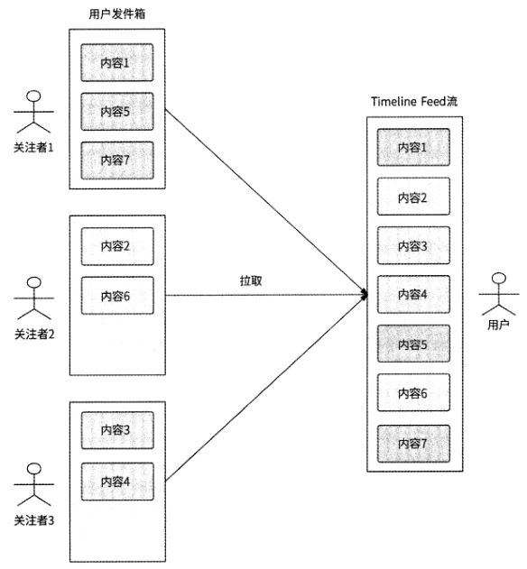
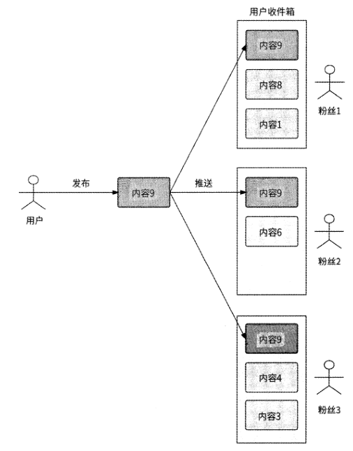
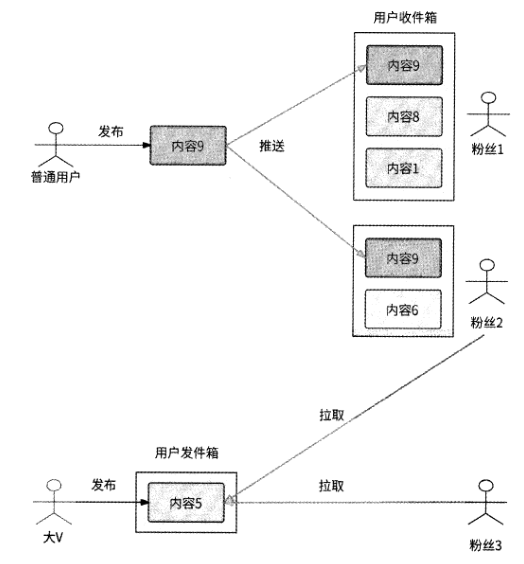
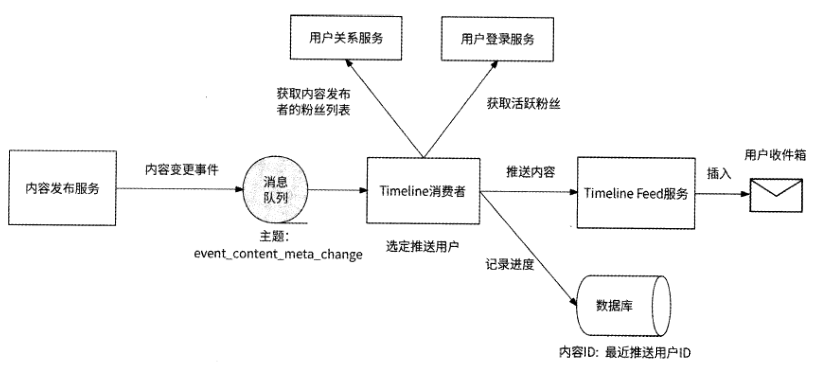
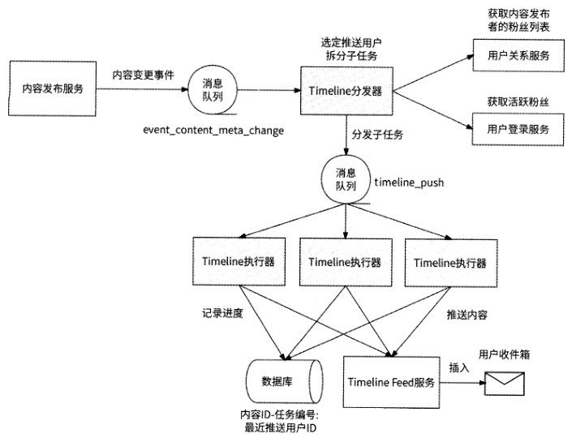
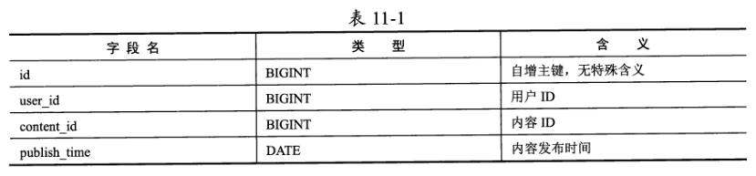
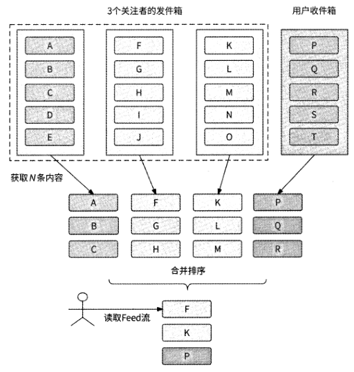

# 第 11 章 Timeline Feed 服务

## 11.1 Feed流的分类

Feed流的功能在当今的互联网应用和网络社交平台中非常重要，它是一种以时间线为
基础的信息流展示形式，把用户感兴趣的内容呈现在用户的Feed页面上。如果你使用过
一些互联网应用就会发现，很多互联网应用的主页都是Feed页面，它们把Feed流当作自
己的“门面”。Feed流在内容聚合维度上包括但不限于如下几种形式。

- 推荐Feed流
- 关注Feed流
- 附近Feed流

## 11.2 Timeline Feed流的功能特性

Timeline Feed流提供的数据应该是我们所关注的人在指定的时间段内发布的内容列
表，并且内容按照时间由近及远排序。

- 下拉操作：刷新Feed流，拉取当前时间最新的N条Feed流。
- 上滑操作：拉取更早时间的N条Feed流。

用户首次进入Timeline Feed页面时，展示的应该是当前时间最新的Feed流，
与下拉操作的效果是一样的。

虽然用户的理解是不停地上滑，就能看到很久之前的内容，但实
际上几乎没有任何应用的Timeline Feed流允许用户这么做。例如微信朋友圈，一个1年
都没有使用微信的用户重新登录微信，他是不可能在朋友圈中刷出这1年的好友动态的。

## 11.3 拉模式与用户发件箱

一种较为符合我们直觉的实现Timeline Feed服务的方式是拉模式。每个内容发布者
都有自己的“发件箱”，每当用户发布一个内容时，就把内容存放到发件箱中，由其他用户来拉取内容。

如图11-1所示，当用户获取Timeline Feed流时，系统会先拉取此用户的关注列表，
然后遍历每个关注者的发件箱，取出他们发布的全部内容，最后根据发布时间倒序排列后展示给用户。

在拉模式下不需要为Timeline Feed服务单
独设计存储系统，实现非常简单。因此，当一个互联网应用在初期阶段用户规模较小时，
很适合使用这种方式来实现Timeline Feed流的功能。

在拉模式下，用户每刷新一次Feed流，系统就需要读取N个用户的发件箱（这
里的N是指用户关注的人数），这意味着一次用户请求会放大产生N倍的读请求，故而这
种模式也被称为“读扩散”。如果用户量级较大，那么获取Feed流会是一个高并发场景，
而且用户关注的人数也会较多。所以，这种读扩散会增加用户请求延迟，并可能击垮存储
用户内容列表的数据库。

## 11.4 推模式与用户收件箱

与拉模式相反，在推模式下，每个
用户都有一个“收件箱”，当某用户成功发布了内容时，系统会将该内容推送到其每个粉
丝用户的收件箱中；粉丝用户在获取Feed流时，直接从收件箱中读取内容即可

在推模式下，用户获取Feed流的性能比在拉模式下好，系统不需要获取用户的关注
列表，也不需要遍历拉取每个关注者的内容列表。但是推模式也有如下一些核心缺点。

存储压力大：在推模式下，要求每个用户都有收件箱，这势必要为收件箱引入存
储系统，用户越多，收件箱占用的存储资源就越多。

比如某用户有100万个粉丝，
该用户发布了一条内容后，在这100万个粉丝的收件箱中都要存储这条内容，这
里消耗了大量的存储空间。

写扩散：某用户发布了一条内容后，需要将此内容推送到100万个粉丝的收件箱
中，也就是系统内部会产生100万个写请求。

## 11.5 推拉结合模式

我们可以很清楚地看到，拉模式和推模式的优缺点是互补的：前者无存储压力，但是
有读请求压力；后者无读请求压力，但是有写请求压力和存储压力。

### 11.5.1 结合思路

虽然拉模式的优势是简单、无存储压力，但是拥有海量用户的互联网公司会在意它的
优势吗？这些公司既有足够的研发投入，又有充足的存储资源，其更在意的是用户体验，
在拉模式下，用户获取Feed流的性能表现是其最无法接受的。因此，我们应该重点分析
推模式。采用推模式可以有效地提高用户获取Feed流的性能，但是用户在发布内容时，
则会带来存储压力和写请求压力，而且用户的粉丝数越多，这两方面的压力越大。

当用户发布内容时，如果此用户不是大V,则采用推模式把内容发送到粉丝的收
件箱中，这样一来，即使推模式会带来存储压力大和写扩散的问题，也会由于粉丝数较少
而使影响可控；当用户获取Timeline Feed流时，系统先检查其关注列表中有没有大V,如
果有大V,则仅采用拉模式来拉取大V的内容列表，而非大V的内容早已在用户的收件
箱中了，直接读取收件箱就好。推拉结合模式的架构如图11-3所示。

### 11.5.2 区分活跃用户

推拉结合模式的效果依赖在用户的关注列表中有多少大V。如果在某
用户的关注列表中是清一色的普通用户，那么对于此用户来说，推拉结合模式也就等于推
模式，可以发挥推模式的优势；如果在某用户的关注列表中是清一色的大V,那么推拉结
合模式会完全退化为拉模式，这就意味着只关注了大V的用户依然要接受拉模式的缺点，
即获取Feed流的响应速度可能会很慢。其实不光是这种只关注了大V的情况，如果在用
户的关注列表中有很多大V,那么也会存在一样的问题。

大V在发布内容后，我们依然可以采用推模式，但是现在仅将内容推送给粉丝列表中
的部分活跃用户，因为这些用户使用Timeline Feed流功能的频率相对较高，所以将内容
主动推送到他们的收件箱中更有可能提高获取Timeline Feed流的性能。

综上所述，对推模式和拉模式的结合方式可以总结如下。

- 如果内容的发布者是普通用户，则完全采用推模式，把内容推送到全部粉丝的收件箱中。
- 如果内容的发布者是大V,则进一步区分活跃用户和非活跃用户。对于活跃用户，采用推模式；对于非活跃用户，采用拉模式。

## 11.6 实现Timeline Feed服务的关键技术细节

### 11.6.1 内容与用户收件箱的交互

在推模式下，当用户发布了一条内容后，系统需要把此内容推送到粉丝的收件箱中，
那么如何实现呢？第7章已经介绍过，内容发布流程是由内容发布服务执行的，一种简单
粗暴的方法是在内容发布服务的内容发布流程后增加一段逻辑：首先获取内容发布者的粉
丝列表，然后从用户登录服务中获取这些粉丝的最近登录时间，从而筛选出活跃粉丝，最
后依次遍历这些粉丝并请求Timeline Feed服务，将已发布的内容插入这些粉丝的收件箱
中。

然而，这种做法并不可取，Timeline Feed逻辑被严重耦合到内容发布服务中，各个服
务的职责边界遭到了破坏。除了这个缺陷，推送的可用性也比较差：内容发布服务的遍历
推送行为毕竟发生在服务实例进程中，内容发布服务的升级、扩容或服务质量问题都可能
导致实例进程退出，这就会打断正在进行的遍历推送。比如某服务实例正在向1000个用
户的收件箱中推送内容，当它只完成100个用户的推送时实例就退出了，这等于遍历推送
被中止，有900个用户并没有收到此内容。

要将内容发布服务与Timeline Feed服务解耦，而且要尽可能提高推送的可用性，最
好的办法就是在这两个服务之间建立消息队列通道。实际上，7.5节已经介绍过，内容发
布服务通过消息队列（主题为event_content_meta_change ）将内容变更事件通知给各种内
容分发渠道，本章中的用户收件箱其实也是一种厉容分发渠道。为此，我们创建一个消费
者服务（暂时命名为Timeline消费者）负责接收内容发布服务的内容变更事件，如果发现
有新内容发布，则执行遍历推送操作。

Timeline消费者也会记录每条内容的推送进度，以便当推送过程中断时可以在失败的
地方重试。一种记录每条内容推送进度的方式是使用排序的用户ID： Timeline消费者使用
数据库记录每个内容ID的最近成功推送用户ID。在推送一条内容时，Timeline消费者先
将待推送用户按照用户ID从小到大排列，然后按照排序结果遍历推送。在内容推送过程中，每推送成功一个用户，就更新内容的最近成功推送用户ID。如果某次推送遇到失败,
则直接返回错误。如果Timeline消费者返回错误，或者消费者实例退出，那么消息队列就
可以得知事件推送失败，于是消息队列会发起重试，让Timeline消费者重新消费事件。
Timeline消费者在重新消费某内容发布的事件后，查询到对应的内容ID的消费进度，于
是继续进行被中断的推送流程。

Timeline消费者作为内容与用户收件箱交互的枢纽，需要负责的工作流程如下

1. Timeline消费者作为内容分发渠道，订阅主题为event_content_meta_change的事件，此事件是由内容发布服务产生的，表示内容变更。
2. Timeline消费者收到内容变更事件，进一步检查事件类型是否代表内容成功发布，如果是，则执行下一步，否则跳过。
3. 根据事件对应的内容ID,从数据库中获取此内容的推送进度，获取到的结果被记为latest_user_id；如果未获取到结果，则latest_user_id值为0。
4. 从用户关系服务中获取内容发布者的粉丝列表，如果粉丝数不大于推送阈值，则将这些粉丝作为待推送用户，执行第6步，否则执行下一步。
5. 从用户登录服务中获取这些粉丝的最近登录时间，将那些最近登录时间距现在小于M天的粉丝作为待推送用户。
6. 将待推送粉丝列表按照用户ID从小到大排列，从用户ID大于latest_user_id值的那条用户记录开始遍历推送。
7. 当遍历到某用户时，请求Timeline Feed服务向此用户的收件箱中插入对应的内容。如果请求成功，则继续遍历下一个用户；否则，抛出错误，消息队列保证对应的事件会被重新消费，回到第2步。
8. 当为这些粉丝推送内容都完成时，消费结束。

### 11.6.2 推送子任务

Timeline消费者遍历推送毕竟是串行操作，如果需要将一条内容推送给更多的粉丝，
那么遍历推送可能会消耗更长的时间，进而造成内容发布服务与Timeline消费者之间消息
队列中的消息积压，导致内容到用户收件箱的投递延迟。

我们可以将对大量粉丝的遍历推
送拆分为多个并行执行的子任务，每个子任务负责对一批粉丝的推送。

### 11.6.3 收件箱保存什么数据

收件箱在意的是用户的Timeline Feed流需要哪些内容，以及这些内容是否
可以按照发布时间从近到远排序。所以，在收件箱中只需要保存每条内容的内容ID和发
布时间即可,其中内容ID用于唯一标识一条内容，发布时间用于Timeline排序。

### 11.6.4 读请求参数

- 操作类型：是下拉操作还是上滑操作。
- 时间戳：目前Feed流中最后一条内容的发布时间，为上滑操作所需要。
- 内容数量：每次获取Feed流时返回多少内容。
- 最后内容ID：上滑操作需要已经展示在Feed流中的最后一条内容的内容ID。

### 11.6.5 使用数据库实现收件箱

使用数据库实现用户收件箱，创建数据表inbox

使用数据库实现用户收件箱的优势是可以充分利用廉价的磁盘空间，劣势是数据库应
对高并发的能力有限，如果Timeline Feed场景的流量巨大，那么数据库不一定有与之匹
配的处理能力，只能通过横向进一步分库分表来解决高并发问题。假设Timeline Feed场
景有10万QPS的流量，而目前按照user_id维度仅将inbox表分为10个子表,那么一个
子表平均会承受10000 QPS的流量；只有将inbox表重新扩展为100个子表，才能将每个
子表的访问压力平均降低到1000 QPS

### 11.6.6 使用Redis ZSET实现收件箱

既然用户收件箱是用于保存内容ID的，并且内容ID按照内容发布时间排序，那么
Redis ZSET对象看起来非常适合作为收件箱的存储选型。

- Key为“inbox_{用户ID}”，表示一个ZSET对象是哪个用户的收件箱。
- Member 为内容 ID。
- Score为内容发布时间。ZSET可以按照内容发布时间从小到大排列内容ID。

使用Redis实现用户收件箱的优势是可以依靠Redis的高性能应对高并发的Timeline
Feed场景，劣势是用户收件箱占用了昂贵的内存资源，公司付出的资源成本较高。

### 11.6.7 通过推拉结合模式构建Timeline Feed数据

从11.6.1节的介绍可以看出，推拉结合模式对于内容发布侧来说非常清晰，就是粉丝
少的用户采用推模式，粉丝多的用户对活跃粉丝采用推模式，对其他用户采用拉模式。那
么，对于用户读取侧呢？怎么才能体现推拉结合模式？

当用户读取Timeline Feed流时，如果拉取关注列表中所有用户的发件箱，那么就是
拉模式；如果只读取收件箱中的内容，那么就是推模式；只有选择拉取关注列表中一部分
用户的发件箱，才是推拉结合模式。那么，需要拉取哪些用户的发件箱？这就要排除收件
箱中内容的发布者了，比如用户A关注了用户B和用户C,但是收件箱中只有用户B发
布的内容，这说明用户C发布的内容并没有被推送到用户A的收件箱中，或者用户C压
根就没有发布内容，所以只对用户C采用拉模式。

最终推拉结合的边界点是：收件箱中内容的发布者在发布内容时采用了推模式，而对
在关注列表中但未向收件箱中投递内容的用户采用拉模式。所以，用户在读取Timeline

Feed流时，应该通过如下工作流程进行选择。

- 拉取用户的关注列表。
- 读取收件箱中的内容(采用推模式)，并从内容发布服务中获取内容发布者的用户ID
- 计算在用户的关注列表中，但并不属于收件箱中内容发布者的用户，拉取内容(采用拉模式)

在明确了推拉结合模式的执行条件后，我们再来分析应该如何将推送的数据和拉取得
到的内容组合起来作为用户下一刷Feed流的内容。这时就需要对发件箱和收件箱中的内
容列表进行合并操作。

1. 从收件箱中读取N条内容。
2. 从M个关注者的发件箱中分别拉取N条内容。
3. 对这M+1个内容列表进行合并操作，保证:
	1. 按照发布时间从近到远排序;
	2. 对于发布时间相同的内容，按照内容ID从大到小排列
4. 合并排序得到前N条内容，这样用户就获取到了 Timeline Feed流

### 11.6.8 收尾工作

根据此次刷新Feed流应该展示的内容ID列表，需要：

- 从内容发布服务中获取这些内容的原文，包括文本、图片、视频等；
- 从计数服务中获取这些内容的评论数、点赞数、转发数、收藏数等计数信息；
- 从用户服务中获取这些内容的发布者的头像、昵称等用户相关信息。

值得一说的是，对于大V来说，他们的关注用户众多，这就意味着有很多用户
在获取Timeline Feed流时会刷到他们发布的内容，所以Timeline Feed服务很适合对大V
发布的内容详情进行本地缓存。
