# 第 12 章 评论服务

## 12.1 评论功能

评论功能是当今强调用户的互联网应用中不可或缺的重要部分，它在多方面证明了其
不可忽视的重要性

## 12.2 评论列表模式

第一种模式是“单级模式”，在这种模式下所有的评论都处于同一层级，而不管是对内容的评论，还是对其他评论的回复。

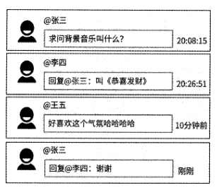

第二种模式是“二级模式”，即将某内容下的评论划分为两级，将所有对内容的评论
作为一级评论，而对某一级评论的回复统统属于这条评论的二级评论，被单独聚合到此评
论的第二级。

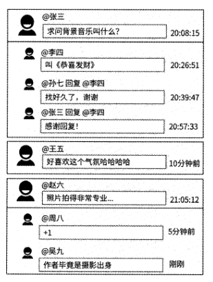

第三种模式是“盖楼模式”，假设用户1发布了某条评论，然后用户2回复了用户1,
用户3回复了用户2,用户4回复了用户3,用户5回复了用户4,那么对于用户5的回复
来说，可以完整地展示评论上下文一用户1评论了什么，用户2回复了什么，用户3回
复了什么，用户4回复了什么，以及用户5回复了什么。在盖楼模式下，用户可以像“击
鼓传花”似的发布精彩评论。

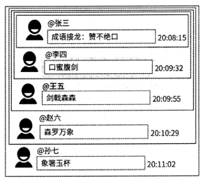

盖楼模式是由网易公司创新设计的。网易公司在2004年就已经推出了盖楼评论功能，
是国内最早推广和使用盖楼评论功能的互联网公司。盖楼模式可以让阅读评论的用户清楚
地了解其他用户在某个话题下的思维博弈，便于追踪对方的观点和回复，具有上下文的紧
密性。在盖楼模式下，用户可以快速地找到互动的最新评论并有针对性地回复，互动性非
常强。此模式是网易公司最为人所称道的明星级评论功能，它催生了很多经典的盖楼案例，
目前被很多其他公司广泛学习与应用，所以我们需要对它进行专门讨论。

## 12.3 评论服务设计的初步想法

一条评论数据至少包含评论文本、发布者、发布时间、评论对象（是对内容的评论，
还是对其他评论的回复）、回复了哪个用户、评论的点赞数和点踩数等信息。

其中，评论文本表示用户评论了什么，其他信息则属于评论元信息，这些信息可以说明评论是谁写的、
评论的目标是什么，以及评论间的互动关系。

评论数据被分为评论元信息和评论文本两部分。评
论文本作为纯粹的发言内容，很适合被存储到分布式KV存储系统中，其中Key为评论ID,
Value为评论文本数据；而评论元信息适合使用数据库存储，不过，在不同的评论列表模
式下，数据表设计不同。

## 12.4 单级模式服务设计

如果某产品的评论功能不在意用户的互动性，或者某评论区中很难有成千上万条评
论，那么可以基于单级模式来设计评论服务，比如博客的留言、商品的吐槽区等场景。

### 12.4.1 数据表的初步设计

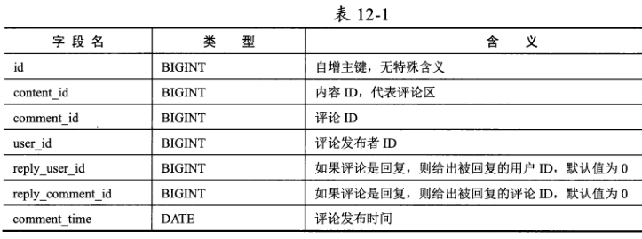

如果一条评论是对内容的评论，则其数据记录中的reply_user_id和reply_comment_id
字段的值都为0;而如果一条评论是对其他评论的回复，则这两个字段都有明确的值。

评论ID作为评论的唯一标识，需要在创建评论时使用分布式唯一 ID生成器生成并设
置到comment_id字段。

### 12.4.2 读/写接口与索引

comment数据表需要两个联合索引，即idx_comment_list和idx_user_listo
但是这两个索引的第一个字段不同，如果comment数据表需要分库分表，则无法选出合适
的字段作为路由依据。然而，大部分面向用户的互联网产品都有海量的评论数据，即
comment数据表必然要分库分表。如果选择content_id字段作为路由依据，那么查询某内
容评论列表的SQL语句自然可以被准确地路由到一个特定的子数据表，保持SQL语句的
查询效率；但是当查询某用户发布的评论列表时，由于此用户的评论数据可能散布在各个
子数据表中，所以查询用户评论列表的SQL语句只能在每个子数据表中都进行查询和聚
合汇总，查询效率大大降低。同理，如果选择user_id字段作为路由依据，那么查询用户
评论列表的SQL语句仅会在一个子数据表中高效执行；但是当查询某内容的评论列表时，
又得查询所有的子数据表。

### 12.4.3 数据库的最终设计

由于受限于分库分表的必要性，我们无法选出合适的字段作为路由依据。关于这个问
题的解决思路，我们之前在第io章中也讨论过，那就是数据表冗余设计：创建两个结构
与comment数据表的结构完全一致的数据表content_comment和user_comment,前者将
idx_comment_list(content_id, comment_time)作为索引，将 content_id 作为分库分表的路由
依据；后者将idx_user_list(user_id, comment time)作为索引，将user_id作为分库分表的路
由依据。当查询某内容的评论列表时，评论服务会查询content_comment数据表；当查询
某用户的评论列表时，评论服务则会查询user_comment数据表。

当用户发布评论、删除评论时，要同时更新content_comment和user_comment这两个
数据表。为了保证这两个数据表的数据的一致性，我们可以选择content_comment作为主
表，而user_comment数据表通过伪从技术自动同步最新的评论数据

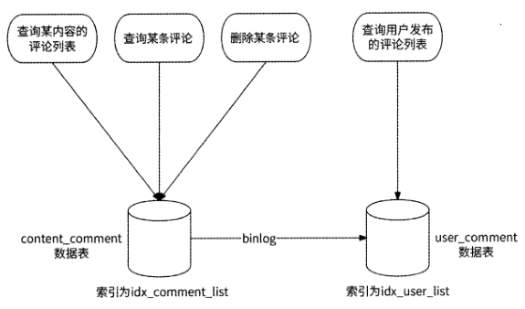

### 12.4.4 高并发问题

评论功能是一个典型的可能读多写多的场景。如果流量明星发布了内容，或者某条内
容具有极高的话题度，则会吸引大量的用户前来查阅评论和参与评论。所以，评论服务需
要应对高并发写评论和高并发读评论两种情况。

我们先来看高并发写评论的情况。用户发布评论作为典型的写类型请求会直接操作数
据库。虽然数据库可以通过分库分表提高并行处理写评论请求的能力，但是
content comment数据表将内容ID作为分库分表的依据。对于热门内容来说，有大量的写
评论请求指向同一个内容ID,也就是说，这些写评论请求将被路由到同一个子数据表中，
所以数据库依然会面临被击垮的风险。

如图12-5所示，我们可以使用本书2.7节中介绍的
异步写和写聚合解决方案来处理高并发的写评论请求。

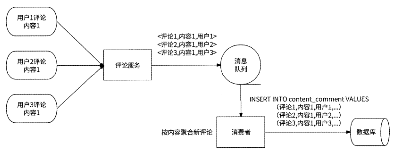

再来看高并发读评论的情况。这里的读评论特指拉取热门内容的评论列表。对于
绝大部分用户来说，其拉取的评论列表是位于评论区前几页的那些评论。所以，我们可以
为评论列表中的前N条评论构建Redis缓存。

既然评论列表是按照评论发布时间排序的，那么我们照例使用Redis ZSET结构来描
述缓存，其中Key为内容ID, Member为评论ID, Score为评论发布时间。这种将时间作
为Score的ZSET结构，我们在用户关系服务、Timeline Feed服务的实现中已经反复介绍
过，所以这里不再深入介绍读评论列表的Redis命令。

需要注意的是，产品的评论功能有按照评论发布时间由近及远和由远及近排序
的区别。如果评论列表是按照评论发布时间由远及近排序的，那么前N条评论数据是相对
固定的，缓存极少需要更新；而如果评论列表是按照评论发布时间由近及远排序的，那么
前N条评论数据会时刻发生动态变化，且内容越热门，前N条评论数据变化得越快。所
以，更好的缓存形式是将Redis作为数据库的伪从，即每当将一条评论插入数据库中时，
同时将此评论也插入Redis ZSET对象中。

考虑到高并发读取评论列表对Redis造成的请求压力，我们还可以进一步做本地缓存：
评论服务的每个服务实例都将从Redis ZSET对象中得到的评论列表缓存到本地内存中，
并设置过期时间，如5so对于按照评论发布时间由近及远排序的评论列表来说，本地缓存
会导致用户拉取到最多5s前的评论，而非此时最新的N条评论。但是好在用户并不是非
常在意一定要看到此时的最新评论，只要评论数据相对比较新即可。所以，我们可以使用
本地缓存进一步应对高并发读取评论列表的请求，只是不要将本地缓存的过期时间设置得
太大就好。

## 12.5 盖楼模式服务设计

盖楼模式的最大特点是可以展示每条评论的完整楼层，楼层由初始评论和回复组成。
假设在一条内容下，用户1发布了评论，用户2回复了用户1,用户3回复了用户2……
用户100回复了用户99,那么对于用户100的回复来说，用户1〜用户100的评论组成了
一个层数为100的楼层——不仅展示了用户100的评论，而且展示了用户1〜用户99的完
整回复链路。所以，在盖楼模式下，通过每条评论都能回溯到完整的回复链路，以组成楼
层。

### 12.5.1 数据库方案：递归查询

回顾单级模式的content_comment数据表设计，comment id字段和reply_comment_id
字段记录了一条评论与另一条评论的回复关系。如果要展示一条评论的盖楼情况，则需要
从此评论的记录开始，根据reply_comment_id字段不断递归查询上一层的评论记录，直到
遍历到此字段为0的评论记录才停止，此时表示已查询到顶层评论。在递归过程中，查询
到的每条评论自底向上组成楼层，其过程大致如图12・6所示。

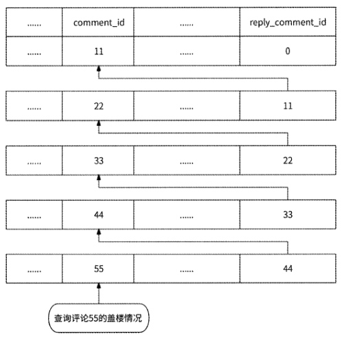

数据库一般都支持这种递归查询方式，仍以MySQL为例，我们可以通过创建自定义
函数、编写带变量的复杂SQL语句，或者使用高版本支持的WITH RECURSIVE语句来实
现递归查询。

### 12.5.2 数据库方案：保存完整楼层

为了避免递归查询评论的完整回复链路，我们还可以在content_comment数据表中增
加一个building字段，设置此字段的类型为Blob,用于存储各楼层的评论ID列表。比如
评论88的各层盖楼评论ID列表为[11,22,33,44,55,66,77],我们先把此列表序列化为字节
流，然后压缩成占用空间更小的二进制数据，最后存储到building字段中。如果评论99
是对评论88继续盖楼，则先读取评论88的building字段，解压缩、反序列化得到盖楼评
论ID列表，然后把评论88加入列表中，并将此列表作为评论99的各楼层评论ID列表，
即[11,22,33,44,55,66,77,88],最后将其序列化、压缩存储到评论99的building字段中。

Blob类型的数据被存储在MySQL数据表的一个单独的数据页中，数据记录仅存储指
向这个数据页的指针，这就使得数据库可以更快地访问到这些数据。但是相比于没有Blob
类型数据的数据表来说，Blob类型数据的存在会使得数据表的读/写效率降低，而且Blob
类型的数据越大，对数据库的数据传输、数据查询的负面影响就越大。所以，Blob类型并
不是万能的。

### 12.5.3 图数据库方案

既然关系型数据库不适合存储较长的评论回复链路，那么我们选择适合做这件事情的
图数据库，将评论间的回复关系存储到图数据库中。

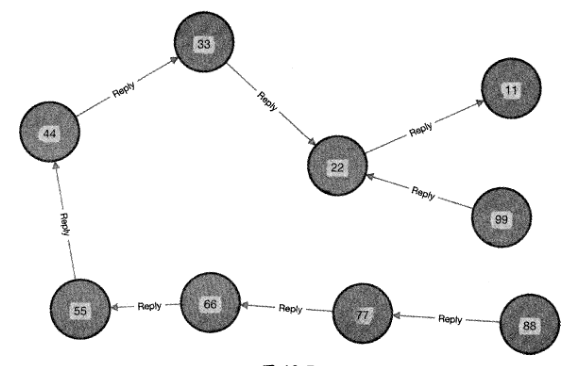

## 12.6 二级模式服务设计

对于需要评论功能引发用户之间广泛互动的产品，大多采用的是二级模式评论，例如
微博、bilibili等常见的亿级用户应用，所以本节将重点讨论二级模式评论服务的设计，同
时引入之前尚未讨论的评论审核和按照热度排序的能力。

### 12.6.1 —级评论和二级评论

在二级模式的评论功能中，所有对内容的评论都将作为一级评论，点击打开内容的评
论区，会看到若干一级评论的集合。

二级评论区默认一般是折叠状态的，只
有当用户主动点击打开某条一级评论的评论区时，其二级评论才会被展示出来。

在二级评论区中，对一级评论的回复和对回复的回复一般按照评论发布时间由远及近
排序。而一级评论由于相互之间没有互动关系，所以既可以使用传统的按照评论发布时间
对其进行排序，也可以使用更为个性化的排序方式来展示一些精彩的评论，比如微博评论
区支持按照热度排序和按照时间排序两种规则，默认按照热度排序。

二级模式评论功能的数据模型需要区分一条评论是一级评论还是二级评论，还需要区
分一条二级评论回复的是一级评论还是二级评论，这是设计二级模式评论元信息数据的核
心所在。

### 12.6.2 时间顺序：数据库方案

评论元信息的数据表结构设计可以参考表12-3

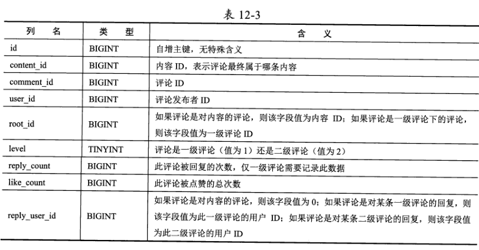

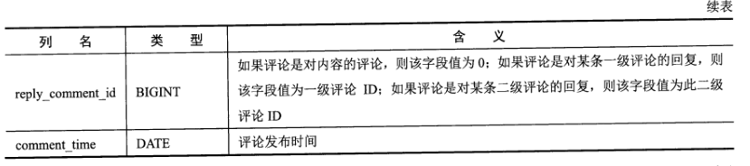

上文中提到，二级模式评论功能的数据模型需要判断一条评论是一级评论还是二级评
论，以及二级评论回复的是一级评论还是二级评论，这个数据表可以清楚地做到这一点。

- level字段值为1,即表小是一级评论。
- level字段值为2,即表示是二级评论，且此评论属于rootjd字段值指向的一级评论的二级评论区。如果reply_comment_id字段值为一级评论ID,则说明此评论回复的是一级评论；否则，说明回复的是二级评论。

### 12.6.3 时间顺序：图数据库方案

在二级模式的评论功能中，除二级评论之间有回复关系外，一级评论与内容之间、二
级评论与一级评论之间也存在回复关系，以内容和评论为点、以回复关系为边可以得到一
个有向图，所以图数据库也是一种可用的选型。

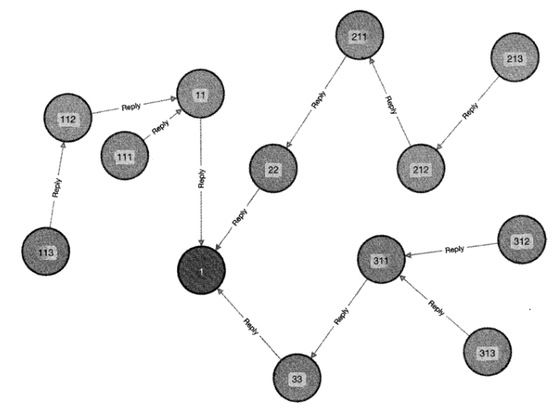

### 12.6.4 评论审核与状态

评论本质上是一种用户输出的内容，评论的意图和情感色彩注定其非常主观，所以，
评论也是一个需要审核介入的重要场景。评论审核需要对涉及血腥暴力、谩骂攻击、垃圾
广告等不合规的评论进行删除，并对评论发布者给予封号处罚。与内容发布系统章节中介
绍的内容审核类似，评论审核分为所谓的机审和人审。

### 12.6.5 按照热度排序

在讨论完基于评论发布时间对评论列表排序后，我们再来讨论如今非常流行的按照热
度排序规则。目前很多互联网应用都选择在评论区优先展示一些热度较高的一级评论，这
些评论往往被证明是具有话题性或者优质的评论，把它们优先展示出来可以使评论区变得
更有吸引力，从而增加用户黏性。

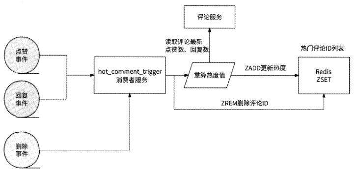

### 12.6.6 高并发处理

二级模式评论作为大部分海量用户应用的强大功能，也免不了存在高并发问题。对于
高并发的写评论来说，依然采用异步写和写聚合解决方案来处理，与在12.4.4节讨论的单
级模式评论功能的内容高度一致，这里不再赘述；而对于高并发的读评论来说，由于二级
模式的评论功能与单级模式的评论功能有不同的数据模型，所以需要单独讨论。

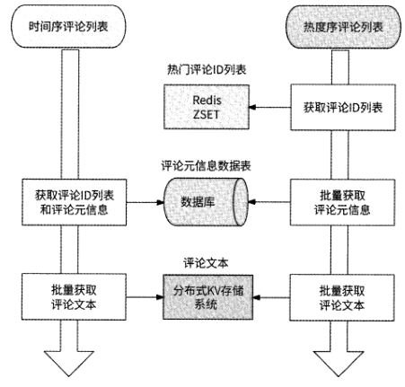

与其他列表数据类型场景类似的是，在读取评论列表的高并发请求中，大部分请求实
际上访问的都是前几页评论数据，毕竟很少有用户会花时间一直刷一个评论区。

前几页评
论数据就是前N条评论，这N条评论可能全部来自热度序评论列表、时间序评论列表或
者两者的组合，所以无论是热度序评论列表还是时间序评论列表，都可能会面临高并发请
求的问题。

存储评论元信息的数据库成为两种排序场景中读取评论列表的共同瓶颈点，所
以我们应该对数据库构建Redis缓存数据。那么，应该使用哪种Redis对象缓存数据呢？
对于热度序评论列表，希望从缓存数据中批量获取评论元信息；而对于时间序评论列表，
不仅希望批量获取评论元信息，而且希望获取按照评论发布时间由近及远排序的评论ID
列表。但无论使用的是String, Hash、List还是Set、ZSET对象，Redis都没有高效的办
法兼顾两种数据访问形式，所以我们为这两种数据访问形式使用了两种Redis对象。

对于希望访问时间序评论列表的形式，缓存可以基于ZSET对象来存储与每条内
容前N条评论的发布时间最近的一级评论ID ,其中Key为cache_time_
{content_id}, Member为评论ID, Score为评论发布时间。

对于希望批量获取评论元信息的形式，缓存选择使用String对象来存储每条一级
评论的元信息，每条一级评论的元信息都被以JSON形式存储到Value中，并将
meta_{content_id}\_{commented} 作为Key,执行MGET命令便可以批量获取评论
元信息。另外，本书中多次提到，在Redis集群中执行MGET命令获取的Key只
在访问一个Redis分片时性能最佳，所以我们为前缀 meta_{content_id} 打上hashtag
标签，这样Redis集群可以保证同一条内容下的一级评论被存储到同一个Redis分
片中。

为了减轻Redis作为中心化缓存的访问压力，我们还可以引入本地缓存。评论服务将
最近访问量较大的数据直接缓存在本地内存中：如果某内容的评论区访问量较大，则本地
缓存前N条热度序评论id 列表和前N条时间序评论ID列表；如果某条评论的最近曝光

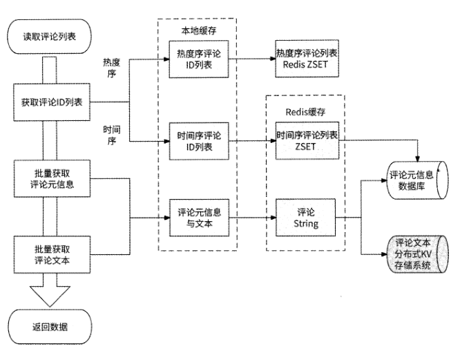

### 12.6.7 架构总览

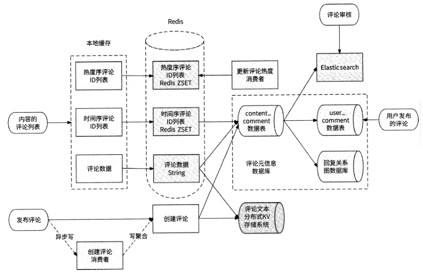
