# 第 13 章 IM服务

IM （Instant Messaging,即时通信）是一种实时的通信方式’它可以使用户通过互联
网快速、安全、低成本地相互交换即时信息。

## 13.1 IM的意义与核心能力

所谓IM就是聊天，许多互联网应用都支持在应用内用户聊天的功能，因
为聊天功能会为用户和产品提供极大的便利性。

不同互联网应用的产品侧重点不同，故而聊天功能的丰富程度也不同。由于纯粹的即
时通信软件就是以聊天功能为卖点的，所以其往往是聊天功能的集大成者，它们拥有的能
力通常如下。

- 实时投递
- 单聊模式和群聊模式
- 消息撤回
- 消息回执
- 消息勿扰

## 13.2 IM相关概念

与IM相关的概念如下：

- 消息：用户发出的任何内容。
- 用户状态：在线、离线、挂起。
- 设备/终端：用户使用IM的客户端，通常包括移动端和Web端。
- 单聊：两个用户一对一聊天的模式。
- 群聊：多个用户聊天的模式。
- 会话：描述用户通过聊天建立的关联关系。通俗地说，微信中的每个聊天框都是一个会话，比如你和一个好友聊天，你们就建立了会话；你被拉到某个群里聊天，你就和这个群建立了会话。
- 信箱：对于用户来说，每个会话都有一个抽象的信箱，作为会话中每条消息按照时间顺序由远及近排列的存储容器。

## 13.3 消息投递

合格的消息投递应该具有如下特点

- 准确性：比如用户1向用户2发送消息，消息只可能被用户2收到，不可能发生用户3收到这条消息的“串线”问题。
- 消息不可丢失：消息不可被漏发，更不可丢失，即使遇到故障（如机房断电、网络断开等），用户也应该能够在故障排除后接收到错过的消息。所有IM的用户都坚信消息是一定会被送达的，如果用户发送了重要的消息，而我们的IM服务却因为各种原因把它丢失了，那么用户会直接流失。
- 实时性：应该尽量保证一条发出的消息被实时地投递到接收方，保证用户通信的连贯性，这样才能达到即时通信所强调的“即时”。
- 有序性：消息需要按照发送时间严格排序，不能发生时空错乱。即时通信毕竟与日常交流一样有提问才有回答，也就是消息之间存在因果关系。比如用户1在群聊中问用户2 “吃烤肉还是吃火锅”，用户2回答“吃火锅”，那么群聊中的其他用户看到的消息列表不应该是用户2先回答“吃火锅”，然后用户1再提问；否则，他们会疑惑用户2是怎么做到抢答的。

### 13.3.1 存储消息：读扩散与写扩散

消息不可丢失意味着必须要把消息保存起来，而为了保证消息的准确性，又需要把消
息保存到其所属会话的信箱中。信箱主要有两种实现模式，分别是读扩散模式和写扩散模式。

在读扩散模式下，每个会话占用一个信箱，与会话相关的用户收发消息就是对这个信
箱进行读/写。

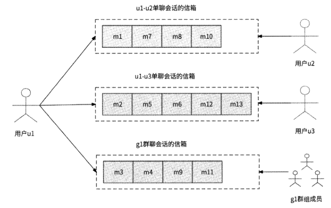

用户在自己的设备上拉取新消息时，IM服务需要从此用户的所有相关会话中拉取新
消息，即IM服务需要将拉取新消息的请求扩散为N个拉取会话消息的请求，所以这种消
息存储模式被称为“读扩散”。

读扩散的优势是发送消息的逻辑非常轻量，只需要把消息
写入信箱即可，而不管会话是属于单聊场景还是属于群聊场景。此外，每条消息仅被存储
一次，较为节省存储空间。不过，从此模式的名字上就可以看出其核心缺点，那就是用户
读取消息有严重的读放大问题，同时在线人数越多或者会话越多，读放大问题带来的流量
越大。

在写扩散模式下，会话信箱不再被与
会话相关的用户全局共享，而是每个用户都拥有一个自己关联会话的信箱列表。

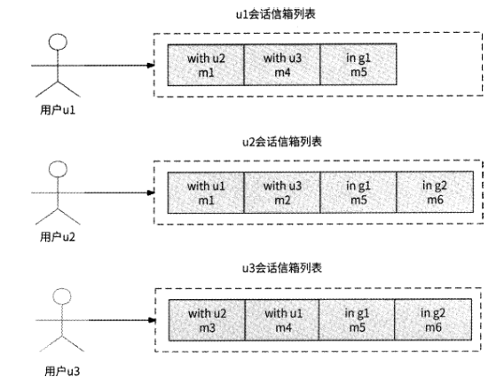

在写扩散模式下，用户发送消息，不仅需要把消息投递到自己的会话信箱中，而且需
要把消息投递到消息接收者的会话信箱中。在单聊场景下，用户ul向用户u2发送消息，
既要将消息写入自己的“withu2”信箱中，又要将消息写入用户u2的“withul”信箱中，
即发送消息的写请求被扩散为原来的2倍；在群聊场景下，用户ul向有N个成员的gl群
组发送消息，需要把消息依次写入群组内每个成员的“ingl”信箱中，即发送消息的写请
求被扩散为原来的N倍。

写扩散模式的缺点也显而易见，即发送消息的请求存在写放大问
题，对于单聊场景来说，只放大2倍尚可接受，但是对于有更多成员的群聊场景来说，写
放大问题尤为严重。写放大带来的另一个问题是消息被冗余存储多份，比较浪费存储空间。

写扩散模式对用户接收消息非常友好。无论是单聊场景还是群聊场景，用户只需
要从自己的信箱列表中拉取消息即可，即只需要一次读消息请求就能满足要求，这是写扩
散模式的优势所在。

写扩散模式无视当前的在线人数与会话数量，但是其带来的写放大问题在群聊场景中
会明显地暴露出来，且群组成员人数越多，问题越严重。所以，写扩散模式更适合单聊模
式或者小群模式（限定群组成员总人数）的场景。

- 聊天功能完全面向单聊场景，则适合采用写扩散模式，因为写请求只被固定放大2倍，没有不可控的高并发流量。
- 聊天功能虽然支持群聊场景，但是极少有群聊场景的出现（比如求职类应用、电商类应用等的聊天功能只是为了增进交流），则适合采用写扩散模式，因为群聊场景的写放大问题的影响微乎其微。
- 对于即时通信软件，单聊场景和群聊场景都广泛存在（比如交友软件、办公通信软件），那么单聊场景自然适合采用写扩散模式，群聊场景则需要根据群组成员人数进一步细化选型：当群组成员人数小于N时，采用写扩散模式；当群组成员人数大于N时，采用读扩散模式。

### 13.3.2 接收消息：拉模式与推模式

用户设备获取消息的一种方式是采用拉模式，即用户设备周期性地主动向IM服务后
台发起获取消息的请求，由服务端将所有相关会话的未读消息返回。拉模式的实现方式较
为简单，但是用户设备多久拉取一次消息并不好确定：为了实时投递消息，用户设备可以
Is拉取一次消息，但是这会给IM服务后台带来巨大的访问压力，造成大量计算资源的浪
费；如果30s拉取一次消息，那么消息的实时性表现会很差。

用户设备获取消息的另一种方式是采用推模式。推模式与拉模式相反，用户每发送一
条消息，IM服务后台都要把消息存储到会话信箱中，同时顺便把消息直接推送到用户设
备上，这里使用的是第6章介绍的海量推送系统。

如图13-3所示，用户ul向用户u2发送消息，一方面，将消息存储到ul-u2会话信
箱中；另一方面，将消息交给推送系统实时推送到用户u2的设备上。

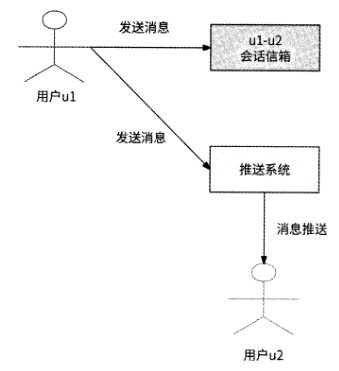

借助推送系统与用户设备维持的长连接，推模式有效地保证了消息的实时触达。然而,
长连接毕竟是脆弱的网络连接，网络中断、网络抖动等情况都会导致消息无法触达用户设
备。事实上，没有任何推送系统可以在只采用推模式的前提下做到100%的消息推送，所
以说完全依赖推模式接收消息会有丢失消息的情况发生，这是推模式的主要缺点。

但是推模式与拉模式可以优势互补，我们自然想到将两者结合起来，即形成推拉结合模式。

当用户ul发送消息时，先将消息存储到对应的会话信箱中，然后向目标用户设备
推送此消息；同时，用户设备周期性地从IM服务后台拉取消息，作为推送消息触达失败
的补偿手段，防止消息丢失。推拉结合模式的消息推送架构如图13-4所示。

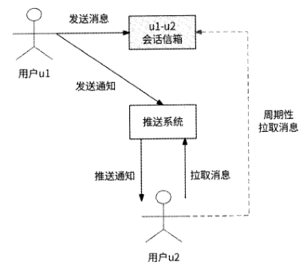

推拉结合模式还有另一种实现方式：服务端只向客户端推送通知，用于告知客户端“有
一条新消息到来”，然后由客户端来拉取对应的消息内容，如图13-5所示。

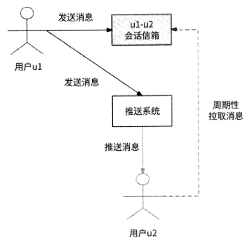

业界绝大多数应用在聊天场景中都采用了推拉结合模式来获取消息。无论是直接推送
消息，还是只推送通知，都属于推拉结合模式的表现形式。

## 13.4 存储初探

用户发送的消息显然应该被存储到消息表中，其具体属性如下

- 消息ID：全局唯一标识一条消息。
- 发送时间：接收者可以看到消息是什么时间发送的。
- 内容：记录消息文本。
- 会话ID：指向消息所属的会话。
- 发送者ID：指向消息发送者的用户ID。
- 状态：记录消息是否对接收者可见，比如消息是否被屏蔽、被撤回。

用户聊天的渠道是会话，会话也应该被保存，尤其是群聊会话

- 会话ID：全局唯一标识一个会话。
- 会话类型：会话是单聊会话还是群聊会话。
- 最新消息时间：记录会话中最新消息的发送时间。
- 会话人数：与会话相关的用户数量。单聊会话人数固定为2人，群聊会话人数为群组成员总人数。
- 其他群组信息：如群头像、群公告等。

为了支持读扩散模式，对于每个会话都应该存储此会话与其产生的消息的关联关系，
即“会话消息链”，这条链中的每条数据都应该包含如下属性。

- 会话ID：指代一个会话。
- 消息ID：指代属于此会话的一条消息。

同理，为了支持写扩散模式，对于每个用户也都应该存储此用户与其需要接收的消息
的关联关系，即“用户消息链”，这条链中的每条数据都应该包含如下属性。

- 用户ID：指代一个用户。
- 消息ID：指代此用户应该接收的消息。
- 会话ID：指代应该接收的消息所属的会话。

对于每个会话都应该知道聊天的用户有哪些，且每个用户都应该有自己针对每
个关联会话的设置，因此还需要保存会话与用户的关联关系，即“用户会话链”，这条链
中的每条数据都至少要包含如下属性。

- 会话ID：指代一个会话。
- 用户ID：指代哪个用户属于此会话。
- 会话通知：用户可以选择强提醒，或者屏蔽此会话的消息。
- 置顶：用户可以选择是否将此会话在聊天列表的顶部优先展示。

## 13.5 消息的有序性保证

### 13.5.1 消息乱序

我们先来分析哪些情况可能会造成消息乱序

客户端发送消息：如果客户端与服务端之间采用了短连接，即客户端每发送一条
消息都与服务端建立一次连接，那么受限于公网环境的不确定性，用户发送3条
消息A、B、C,最终到达服务端的消息顺序可能是C、B、A,从发送者的角度来
说，消息发生了乱序。

服务端存储消息：即使用户发送的消息A、B、C按顺序到达服务端，但是由于
这3条消息可能是由不同的IM服务实例处理的，每个服务实例处理消息的延迟不
同，且与数据库网络通信的延迟不同，最终消息也可能会被按照C、B、A的顺序
存储，于是消息接收者在拉取消息时发生了乱序。

服务端推送消息：即使按照发送者的本意消息被顺序存储起来，但是由于消息推
送环节仍然要借助推送系统与目标用户客户端的网络连接，如果网络异常造成消
息A丢失，只有消息B、C到达客户端，那么对于消息接收者来说，消息也仍然
发生了乱序。

### 13.5.2 客户端发送消息

首先，从消息发送者的视角来说，消息发送者在每个会话中连续发送消息时，都应该
保证这些消息被有序地投递到服务端。

所以，在客户端可以按照会话与服务端建立长连接,每个会话独占一个长连接，用户在某会话中发送消息时会通过此会话与服务端的长连接推
送请求，这样就可以保证发送者发送消息的请求有序到达后台机房网关。

其次，为了保证从机房网关传输消息到IM服务的有序性，机房网关应该将消息请求
发送到固定的IM服务实例上。比如负载均衡策略采用消息会话ID进行哈希计算：将发送
到同一个会话的消息请求都转发到同一个IM服务实例上，这样就可以保证消息按照发送
顺序有序到达IM服务内部。

### 13.5.3 服务端存储消息

IM服务与存储系统交互时，也要保证所接收到的用户消息被有序存储到会话消息链
中，这就意味着对于同一个会话的消息来说，必须使用单个线程来串行存储数据。能够较
为简单地实现这个目的的架构是采用消息队列（如Kafka）,并以会话ID作为消息Key,
IM服务一旦收到新消息就投递到Kafka中，使得同一个会话产生的消息都被串行存储到
同一个分区（Partition） 中；然后构建消费者，从Kafka中依次获取用户消息并写入会话
消息链中。所以，IM服务被拆分为如下两个子服务。

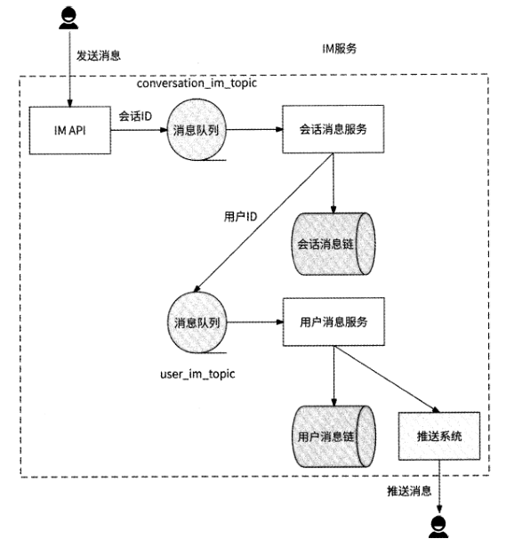

### 13.5.4 服务端推送消息与客户端补偿

在将消息推送到客户端时可能会造成消息的丢失，进而导致客户端收到乱序消息。

推拉结合模式的消息推送与消息拉取没有统一的消息排序规则，这是造成消息触达客
户端时可能发生乱序的根本原因。如果消息存储采用读扩散模式，那么消息推送和消息拉
取都会基于会话消息链；如果消息存储采用写扩散模式，那么消息推送和消息拉取都会基
于用户消息链。为了准确描述消息排序规则，需要在会话消息链和用户消息链中为每条消
息显式标记消息正确的顺序。我们在会话消息链和用户消息链的数据表中分别增加一个
Seq属性来表示消息在链中的顺序，每当有一条新消息被插入会话消息链和用户消息链中
时，都要保证新消息的Seq值一定比上一条消息的Seq值大，即Seq值要满足严格递增的
特性。这样一来，一条消息的Seq就可以表示其在对应消息链中的准确顺序。

如何保证Seq值严格递增呢？这件事情由将新消息写入会话消息链的会话消息
服务和将新消息写入用户消息链的用户消息服务来保证。

对于会话消息链来说，会话消息服务在本地内存中为每个会话ID都保存最近一条
消息的Seq（初始值为0）,每当收到一条新消息时，就将会话ID对应的Seq值加
1并作为此消息的Seq值插入会话消息链中，这样可以保证按照消息的顺序递增
Seq值。不过，如果会话消息服务有服务发版、扩缩容等导致服务实例重启的变更
行为发生，那么本地内存中的Seq值会丢失。所以，我们要设计一个兜底策略：
如果某会话ID对应的本地内存中的Seq值为0,则先从会话消息链中获取最后一
条消息的Seq值，作为本地内存中的Seq值。

用户消息链与会话消息链的原理非常相似，只不过在本地内存中换成了为每个用
户ID保存最近一条消息的Seq值。

如此一来，将消息插入会话消息链和用户消息链中的流程改进如图13.7所示。

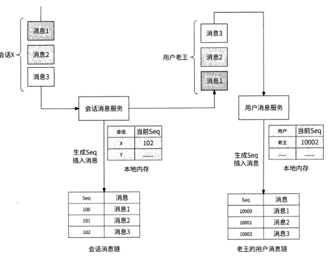

## 13.6 会话管理与命令消息

目前我们只讨论了用户消息的收发问题，一条用户消息必然属于一个会话，会话本身
也需要IM服务管理。

### 13.6.1 创建单聊会话

我们先从发送者的视角介绍创建会话的流程。例如，用户A首次与用户B聊天时，
用户A先打开与用户B的聊天框，此时对于用户A来说两者的会话就已经建立了，只不
过服务端和用户B对此并不知情。当用户A发出第一条消息时，客户端才请求服务端创
建会话，此时客户端将消息内容、接收者和值为0的会话ID传递给服务端，服务端发现
请求的会话ID为0,于是需要依次创建如下数据。

- 生成唯一的会话ID,在会话表中创建新会话。
- 在用户会话链中建立会话与用户A、用户B的关联关系。
- 将消息存储到消息表中。

### 13.6.2 创建群聊会话

创建群聊会话，发起者必须显式地请求服务端，所以创建群聊会话的流程比创建单聊
会话要简单得多。比如用户A选择向用户B、用户C、用户D发起群聊，则会直接向服务
端发起创建群聊会话的请求，IM服务只需要创建会话、设置会话与每个成员的关联关系
即可。由于群聊不要求两个用户之间只能有一个群聊会话，所以不需要考虑用户B同时向
用户A、用户C、用户D发起群聊导致两个群聊会话重复的问题，谁发起了群聊就新建一
个群聊会话。

### 13.6.3 命令消息

我们在使用微信或者其他即时通信软件时，经常会看到如下事件。

- 好友给你发了一条消息，过了一会儿，你发现消息被撤回了。
- 群聊中提示：A邀请B加入了群聊、B被A移出群聊、A将B禁言。
- 群聊中提示：B退出了群聊。

其实这些事件都是依靠IM服务实现通知到客户端的，这些事件也被当作IM服务的
消息来处理，只不过不同于用户发送的消息，这些事件被定义为命令消息，用于控制消息
的展示、群聊成员的管理等。

## 13.7 消息回执

很多产品的IM服务都支持消息回执功能，即消息发送者在单聊中可以看到对方是否
已读取某条消息，以及在群聊中可以看到一条消息已被哪些成员读取。

### 13.7.1 上报已读消息

要想知道一条消息是否已被读取，自然需要依赖消息接收者把已读事件上报给服务
端，其重点是上报时机。

当一条消息被展示给用户时，如果客户端选择立刻上报已读事件，则可能会给服务端
带来访问压力，尤其是群聊。假设一个大群有300人活跃在线，群内每下发1条消息，就
会导致300个客户端的已读上报事件反向访问服务端。

实际上，对于一条消息是否已被读取并不需要很强的实时性，客户端没有必要在已读
事件发生后就立刻上报给服务端，更好的做法是客户端周期性地（如每隔3s） 汇总每个会
话最后一条已读消息的Seq±报。从消息发送者的视角来说，也不需要实时知道对方是否
已读取消息，所以发送者的客户端也可以周期性地从服务端查询消息是否已被读取。

### 13.7.2 记录已读消息

记录已读消息最直接的方式是为每条消息和每个已读用户保存关联关系，但是这种方
式严重占用存储空间，并无实用性可言。

实际上，我们可以利用消息有序性的特点，只记录每个用户在会话中最后一条已读消息的Seq last_read_seq,判断一条消息是否已被读取
只需要看消息的Seq值是否小于或等于last_read_seq值即可。如果消息的Seq值更大，则
说明此消息未被读取，否则说明此消息已被读取。

这种记录最后一条已读消息Seq的方式既适合单聊会话，也适合群聊会话，只不过对
于群聊会话来说，有一个小细节需要注意：某时刻被拉入群聊的新成员，并不统计对于之
前的群消息此成员是否已读，只能默认新成员对其进群之前的全部群消息是已读的。

我们在用户会话链中增加last_read_seq字段，消息发送者周期性地检查自己发布的消
息是否可以被更新为已读状态：

消息接收者在读取某条消息后，客户端将已读事件上报给服务端，服务端将更新用户
会话链中对应的last_read_seq值。如图13・9所示，用户A在4人群聊会话X中发送了一
条Seq值为100的消息，用户B和用户D在读取了这条消息后，分别上报更新last_read_seq
字段值为100;用户A拉取此消息的已读状态，发现有两个用户的last_read_seq值大于或
等于100,说明这两个用户已读。

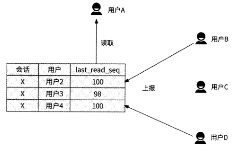

## 13.8 阶段性汇总：存储设计

存储消息本身的消息表：修改消息数据的场景极少见，更多的场景是使用消息ID获
取消息数据，所以使用分布式KV存储系统或传统数据库都是合适的选型。

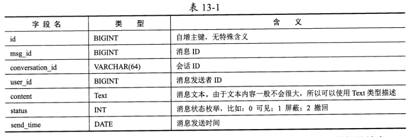

管理会话数据的会话表：其主要用途是根据会话ID获取会话信息。会话表的结构如
表13-2所示。

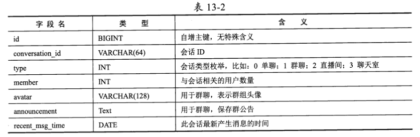

会话消息链：用于支持读扩散模式的消息存储，其重点是保证会话内消息有序。其数
据表 conversation_msg_list 的结构如表 13-3 所75。

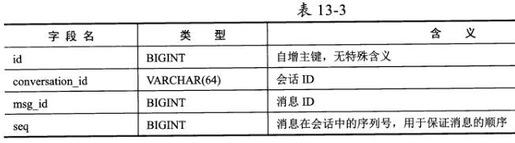

用户消息链：与会话消息链相同，服务于写扩散模式的用户消息链也应该有一个类似
结构的数据表user_msg_list,如表13.4所示。

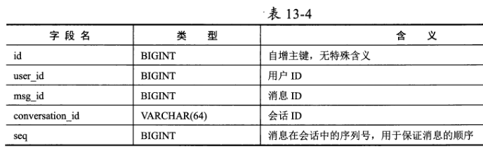

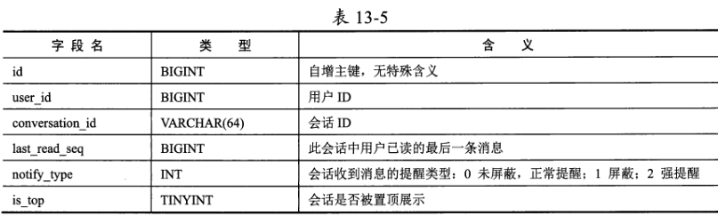

## 13.9 高并发架构

即时通信是一个典型的读多写多的场景

### 13.9.1 发送消息

拥有上亿用户的即时通信软件，很容易发生大量用户同时发送消息的情况，尤其是在
节假日期间，比如春节，可能有数百万用户同时发送拜年消息，所以我们需要设计一些策
略来防止海量的发送消息请求击垮IM服务。

在13.5.3节讨论过，为了保证会话中消息的有序性，我们为存储消息过程引入了消息
队列，在IM服务内部由IMAPI服务接收消息，然后把消息投递到消息队列中就返回给用
户了。当时的意图是保证消息基于会话ID有序和基于用户ID有序，其实使用消息队列还
有另一层含义：消息队列可以对高并发发送消息的请求做削峰处理，im服务内部可以按
照自己的处理速度来平滑处理消息的存储与推送，在发送消息的过程中其实已经实现了异
步写，可以较好地应对高并发发送消息请求的涌入。

接下来是消息的消费环节。如果消费者消费消息的速度较慢，或者消息队列的分区数
量过少，则会造成消息在消息队列中堆积，无法被及时地存储到数据库中，进而导致消息
迟迟无法触达接收者。为了尽最大可能防止消息队列中消息的堆积，我们可按如下所述进
行操作。

为消息队列的主题设置足够多的分区。受限于消息队列的机制，1个分区只能被
1个消费者实例消费，所以分区数量就是消费者实例的数量，分区越多，可以消
费消息的消费者实例就越多。

消费者采用批量消费模式从消息队列中拉取消息。同一个会话的相关消息都会被
投递到conversation im topic的同一个分区中，所以一次消费行为可以批量拉取如
500条消息，再将属于同一个会话的消息聚合为一个写数据库的请求。对于消息队
列user_im_topic来说也是一样的，批量消费一些消息并按照用户ID做聚合，再
访问数据库。这就是写聚合，也是我们之前介绍的应对高并发写场景的解决方案。

### 13.9.2 数据缓存

IM服务的主要数据包括消息表、会话表、用户会话链、会话消息链和用户消息链。
为了防止高并发读消息的请求击垮数据库，可能需要使用Redis缓存这些数据。

消息是一种时间属性很重的数据，对最近的消息数据会有更多的请求访问，所以可以将缓存的数据聚焦到最近的数据上。

消息表：最近的消息意味着有更大的可能被频繁访问，Redis可以使用String对象
存储IM服务刚刚收到的消息，并设置数据过期时间为1天，这样就可以保证Redis
中缓存的消息是来自最近1天的。

会话表：最近创建的、最近有消息通信的会话更有可能被频繁访问，可以使用与
缓存消息表同样的方式来缓存最近的会话。但是由于单聊会话只涉及两个用户，
且没有什么可变的元信息，用户在同一个设备上基本上很少访问其会话信息，所
以Redis可以只缓存群聊会话。

用户会话链：其非常容易被频繁访问，IM服务下发消息时要在这里读取目标用户
列表（基于会话ID查询），也要检查消息发送者在会话中发送消息的权限，客户
端会周期性地更新与用户相关的会话设置（基于用户ID查询）。所以，对于最近
活跃的会话来说，其用户会话链值得被缓存。Redis可以使用List存储每个会话的
用户列表，使用String对象存储每个用户在某会话中的设置。

会话消息链和用户消息链：我们将两者统称为消息链，只不过一个用于读扩散模
式，一个用于写扩散模式。由于用户查看历史消息的概率远远低于读取最近消息
的概率，所以可以存储最近收到的消息。消息链不需要把全部消息都存储起来，
而是可以使用Redis的ZSET对象存储最近的消息ID列表，其中Score用Seq表
示，以保证消息的有序性。

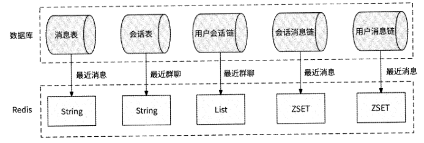

### 13.9.3 消息分级

按照参与会话的用户数量，对消息有不同的触达成功率和实时性的要求，经过大致测
算，我们把消息划分为如下优先级。

- 单聊会话：两个用户都非常在意消息的顺利互动，单聊既要保证消息顺利触达，又要保证消息的实时性，消息优先级高。
- 群聊会话，但是群成员人数少于100人：这属于小群，小群一般是好友圈子建立的群，或者是为特定话题建立的群，群成员也非常在意群消息互动，所以对小群消息有与单聊会话消息类似的触达成功率和实时性的要求，消息优先级高。
- 群聊会话，但是群成员人数大于100人且小于1000人：这属于中等群组，常见于公司部门的重要消息通知群，日常群聊参与人数不多，重要的是要求群消息触达每个成员，但对实时性要求一般，消息优先级中。
- 群聊会话，但是群成员人数大于1000人：这属于大型群组，类似于交流社区（如北京交友群）。由于人多嘴杂，很多群成员大概率会屏蔽群消息，只有主动点击打开群会话才会真正阅读消息，所以并不要求群消息触达全部在线成员，且不要求实时性，消息优先级低。

将消息划分为不同的优先级，可以有目的地为单聊、小群、中群、大群分别创建专用
的IM服务集群，集群之间不共享任何资源，如服务实例、消息队列、数据库、Redis,这
样可以隔离不同优先级的消息，防止整个IM服务系统瘫痪，并且可以合理分配资源。

### 13.9.4 直播间弹幕模式

直播间弹幕是如今热度很高的一种即时通信场景，它是指在直播间（或房间）内，观
众可以实时发送短文本消息，以在直播画面上滚动的形式呈现。弹幕可以是观众与主播之
间的聊天，也可以是观众之间的互动。弹幕可以为直播注入更多的交互和互动体验，也可
以为直播间的观众创造更多的参与感和乐趣。

直播间弹幕看起来像群聊，直播间相当于一个会话，看播用户和主播是群成员。不过，
与传统的即时通信场景相比，直播间弹幕还有如下一些明显的特殊性。

- 只有看播用户有会话，且只有一个会话，这个会话就是用户正在观看直播的直播间。不存在一个用户同时观看多个直播的情况。
- 用户可以随时进出直播间，即群成员变动会比较频繁。
- 对弹幕的实时性要求很高，因为主播可能会对弹幕进行答复，弹幕不实时下发会造成不好的用户体验。
- 每个用户只需要接收他在看播期间的消息，不需要看历史弹幕。
- 直播间极易产生大量收发弹幕的情况，即形成过热会话。
- 允许在极端情况下丢失若干弹幕，发送者对其他用户是否能看到自己的发言不是很在意。
- 弹幕数据不需要被长期持久化存储，主播在关播后整个直播间的弹幕就不需要再保留了。

弹幕的消息存
储非常适合采用读扩散模式，即弹幕只被存储到会话消息链中。因为每个用户最多只有正
在观看直播的直播间这一个会话，读扩散问题自然得到解决。

看播用户的频繁变动意味着用户会话链不仅面临高并发读的情况，而且会被频
繁修改。如果用户会话链仍然使用数据库存储和Redis缓存的组合，则会非常容易出现数
据库数据与Redis数据不一致的问题，反倒是直接使用Redis存储更加简单、直接。

所有的看播用户都会频繁地发送弹幕和读取弹幕列表。IM服务已有的消息队
列对发送消息请求做削峰处理，因此在正常情况下发送弹幕问题不大；但是在发送弹幕的
请求量超过消息队列处理能力的情况下，为了防止弹幕堆积，我们甚至可以直接按照比例
丢弃弹幕，弹幕发送者的客户端只在本地展示这条弹幕，从发送者本人的视角来看，弹幕
就像已经发送成功一样。

读取弹幕的请求量也很大。虽然会话消息链使用Redis ZSET缓存最近的消息列表，
但是这里的数据毕竟只有消息ID,想获取到完整的弹幕，还需要批量获取消息数据，因
此会话消息链缓存的ZSET对象的Member不再适合用消息ID表示，而是应该直接使用
弹幕数据。

## 13.10 本章小结：最终架构

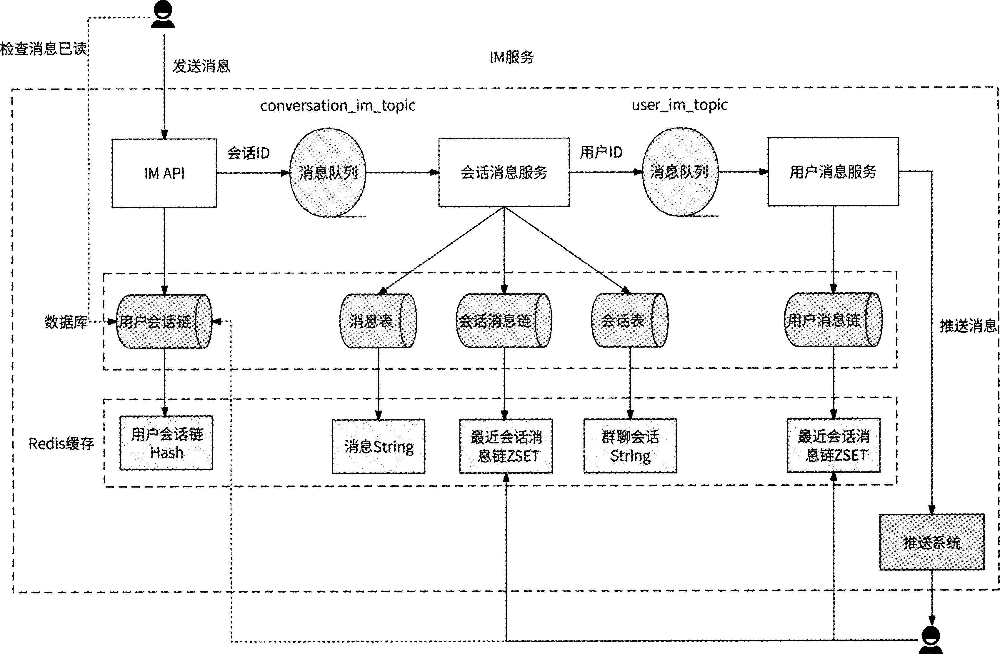
