# 第 2 章 通用的高并发架构设计

既然是亿级用户应用，那么高并发必然是其架构设计的核心要素。从本章开始，我们
将介绍高并发架构设计的一些通用设计方案。

## 2.1 高并发架构设计的要点

高并发意味着系统要应对海量请求。从笔者多年的面试经验来看，很多面试者在面对
“什么是高并发架构”的问题时，往往会粗略地认为一个系统的设计是否满足高并发架构,
就是看这个系统是否可以应对海量请求。再细问具体的细节时，回答往往显得模棱两可，
比如每秒多少个请求才是高并发请求、系统的性能表现如何、系统的可用性表现如何，等
等。为了可以清晰地评判一个系统的设计是否满足高并发架构，在正式给出通用的高并发
架构设计方案前，我们先要厘清形成高并发系统的必要条件、高并发系统的衡量指标和高
并发场景分类。

### 2.1.1 形成高并发系统的必要条件

形成高并发系统主要有三大必要条件

高性能：性能代表一个系统的并行处理能力，在同样的硬件设备条件下，性能越
高，越能节约硬件资源；同时性能关乎用户体验，如果系统响应时间过长，用户
就会产生抱怨。

高可用性：系统可以长期稳定、正常地对外提供服务，而不是经常出故障、宕机、崩溃。

可扩展性：系统可以通过水平扩容的方式，从容应对请求量的日渐递增乃至突发的请求量激增。

### 2.1.2 高并发系统的衡量指标

#### 1.高性能指标

一个很容易想到的可以体现系统性能的指标是，在一段时间内系统的平均响应时间。

平均值的主要缺点是易受极端值的影响，这
里的极端值是指偏大值或偏小值——当出现偏大值时，平均值将会增大；当出现偏小值时，
平均值将会减小。

#### 2.高可用性指标

可用性=系统正常运行时间/系统总运行时间，表示一个系统正常运行的时间占比，也
可以将其理解为一个系统对外可用的概率。

#### 3.可扩展性指标

面对到来的突发流量，我们明显来不及对系统做架构改造，而更快捷、有效的做法是
增加系统集群中的节点来水平扩展系统的服务能力。可扩展性=吞吐量提升比例/集群节点
增加比例。

### 2.1.3 高并发场景分类

我们使用计算机实现各种业务功能，最终将体现在对数据的两种操作上，即读和写，
于是高并发请求可以被归类为高并发读和高并发写。比如有的业务场景读多写少，需要重
点解决高并发读的问题；有的业务场景写多读少，需要重点解决高并发写的问题；而有的
业务场景读多写多，则需要同时解决高并发读和高并发写的问题。

## 2.2 高并发读场景方案1：数据库读/写分离

大部分互联网应用都是读多写少的，比如刷帖的请求永远比发帖的请求多，浏览商品
的请求永远比下单购买商品的请求多。数据库承受的高并发请求压力，主要来自读请求。
我们可以把数据库按照读/写请求分成专门负责处理写请求的数据库（写库）和专门负责
处理读请求的数据库（读库），让所有的写请求都落到写库，写库将写请求处理后的最新
数据同步到读库，所有的读请求都从读库中读取数据。这就是数据库读/写分离的思路。

### 2.2.3 主从延迟与解决方案

#### 1. 同步数据复制

数据库主从复制默认是异步模式，Master在写完数据后就返回成功了，而不管Slave
是否收到此数据。我们可以将主从复制配置为同步模式，Master在写完数据后，要等到全
部Slave都收到此数据后才返回成功。

#### 2. 强制读主

我们可以对业务场景按照主从延迟容忍性的高低进行划分，对于主从延迟容忍性高
的场景，执行正常的读/写分离逻辑；而对于主从延迟容忍性低的场景，强制将读请求路由到数据库Master,即强制读主。

#### 3.会话分离

比如某会话在数据库中执行了写操作，那么在接下来极短的一段时间内，此会话的读
请求暂时被强制路由到数据库Master,与“强制读主”方案中的例子很像，保证每个用户
的写操作立刻对自己可见。暂时强制读主的时间可以被设定为略高于数据库完成主从数据
复制的延迟时间，尽量使强制读主的时间段覆盖主从数据复制的实际延迟时间。

## 2.3 高并发读场景方案2：本地缓存

在计算机世界中，缓存(Cache )无处不在，如CPU缓存、DNS缓存、浏览器缓存等。
值得一提的是，Cache在我国台湾地区被译为“快取”，更直接地体现了它的用途：快速读
取。缓存的本质是通过空间换时间的思路来保证数据的快速读取。

业务服务一般需要通过网络调用向其他服务或数据库发送读数据请求。为了提高数据
的读取效率，业务服务进程可以将已经获取到的数据缓存到本地内存中，之后业务服务进
程收到相同的数据请求时就可以直接从本地内存中获取数据返回，将网络请求转化为高效
的内存存取逻辑。

### 2.3.1 基本的缓存淘汰策略

虽然缓存使用空间换时间可以提高数据的读取效率，但是内存资源的珍贵决定了本地
缓存不可无限扩张，需要在占用空间和节约时间之间进行权衡。这就要求本地缓存能自动
淘汰一些缓存的数据，淘汰策略应该尽量保证淘汰不再被使用的数据，保证有较高的缓存
命中率。

- FIFO ( First In First Out)策略：优先淘汰最早进入缓存的数据。
- LFU ( Least Frequently Used )策略：优先淘汰最不常用的数据。
- LRU ( Least Recent Used )策略：优先淘汰缓存中最近最少使用的数据。

LRU策略和LFU策略的缺点是都会导致缓存命中率大幅下降。近年来，业界出现了
一些更复杂、效果更好的缓存淘汰策略，比如W-TinyLFU策略。

### 2.3.2 W-TinyLFU 策略

W-TinyLFU策略结合了 LFU策略和LRU策略的优点，兼具高缓存命中率与低内存占
用，Redis和高性能的Java本地缓存Caffeine Cache组件都使用W-TinyLFU策略管理缓存。

W-TinyLFU将缓存的内存空间划分为两部分，如图2-3所示。

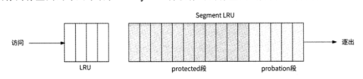

Window LRU段（对应图中的LRU） ：此内存段使用LRU策略缓存数据，其占用
的内存空间是总缓存内存空间的1%。

Segment LRU段（简称SLRU）：此内存段使用SLRU策略缓存数据，具体是将
缓存段进一步划分为protected段（保护段）和probation段（试用段）,其中probation段
负责存储最近被访问1次的缓存数据，protected段负责存储最近被访问至少2次的缓存数
据。Segment LRU段内存空间的80%被分配给protected段，剩余20%的内存空间被分配
给 probation 段。

W-TinyLFU策略的工作流程如下

1. 将首次被访问的数据X缓存到Window LRU段
2. 当Window LRU段的内存空间已满时，使用LRU策略将被淘汰的数据移入Segment LRU段中的probation段，之后数据X被访问时，再将其移入protected段。
3. 当protected段的内存空间已满时，使用LRU策略将被淘汰的数据X移入probation 段。
4. 当数据X要被移入probation段，但是其内存空间已满时，使用LRU策略将被淘汰的数据V取出，与数据X进行访问频率的对比，将访问频率高的数据留在proation段，将访问频率低的数据淘汰。

### 2.3.3 缓存击穿与 SingleFlight

Golang语言扩展包提供的同步原语SingleFlight能很好地解决缓存击穿问题。如图2-5
所示，SingleFlight可以将对同一条数据的并发请求进行合并，只允许一个请求访问数据库
中的数据，这个请求获取到的数据结果与其他请求共享。

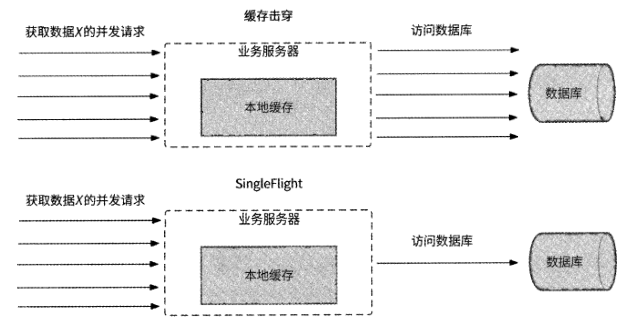

SingleFlight原语可以顺利执行的关键是使用了 WaitGroup。访问同一条数据的并发请
求中的某一个请求调用WaitGroup.Add⑴标记WaitGroup计数为1,然后执行真正的数据
访问；其他并发请求调用WaitGroup.Wait()阻塞等待WaitGroup计数变成0。数据访问完成
后，通过调用WaitGroup.Done()将WaitGroup计数归0,于是其他并发请求被唤醒，它们
可以直接读取到数据访问结果。WaitGroup的工作原理如图2-6所示。

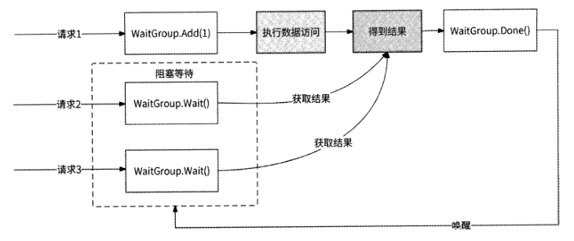

## 2.4 高并发读场景方案3：分布式缓存

由于本地缓存把数据缓存在服务进程的内存中，不需要网络开销，故而性能非常高。
但是把数据缓存到内存中也有较多限制

无法共享：多个服务进程之间无法共享本地缓存。

编程语言限制：本地缓存与程序绑定，用Golang语言开发的本地缓存组件不可以
直接为用Java语言开发的服务器所使用。

可扩展性差：由于服务进程携带了数据，因此服务是有状态的。有状态的服务不
具备较好的可扩展性。

内存易失性：服务进程重启，缓存数据全部丢失。

### 2.4.1 分布式缓存选型

主流的分布式缓存开源项目有Memcached和Redis,两者都是优秀的缓存产品，并且
都具有缓存数据共享、与编程语言无关的能力。

### 2.4.5 缓存更新

为了尽量保证Redis缓存与数据库的数据一致性，当某数据在数据库中被更新后，其
在缓存中也应该被更新。

#### 方案1：先修改缓存，再更新数据库

#### 方案2：先更新数据库，再修改缓存

#### 方案3：先删除缓存，再更新数据库

#### 方案4：先更新数据库，再删除缓存

在更新某数据时，先更新数据库，在更新数据库成功后再将对应的缓存删除。此方案
可以很好地解决上述3种方案在并发场景下数据不一致的问题。对于方案1和方案2中提
到的并发写请求的场景，无论并发执行序列如何，最后一个操作一定是删除缓存，这就保
证了接下来的读请求一定会从数据库中读取到最新值；而对于方案3中提到的并发读/写
请求的场景，由于写操作在更新完数据库后会删除缓存，所以无论并发执行序列如何，缓
存的状态要么是被写请求删除，要么是被读请求通过读取数据库更新为最新值，均可以保
证缓存和数据库的数据一致性。

## 2.5 高并发读场景总结：CQRS

CQRS （Command Query Responsibility Segregation,命令查询职责分离）是一种将数据的读取操
作与更新操作分离的模式。query指的是读取操作，而command是对会引起数据变化的操
作的总称，新增、删除、修改这些操作都是命令。

## 2.6 高并发写场景方案1：数据分片之数据库分库分表

数据分片是指将待处理的数据或者请求分成多份并行处理。在现实生活中，有很多与
数据分片思想一致的场景，例如：

为了减少患者与家属的排队时间，医院会开通多个挂号/收费窗口；

为了提高乘客进站的速度，人流量大的火车站、地铁站会设置多个闸机口，同时为乘客检票。

### 2.6.1 分库和分表

数据库的分库和分表其实是两个概念：分库指的是将数据库拆分为多个小数据库，原
来存储在单个数据库中的数据被分开存储到各个小数据库中；分表指的是将单个数据表拆
分为多个结构完全一致的表，原来存储在单个数据表中的数据被分开存储到各个表中。

分表的目的是提高一台服务器的单数据库处理能力，而分库的目的是充分利用多台服
务器资源。

### 2.6.2 垂直拆分

垂直拆分包括垂直分库与垂直分表。

垂直分库指的是按照业务归属将单个数据库中的数据表进行分类，与不同业务相关的
数据表被拆分到不同的数据库中，其核心是“专库专用”。以电商产品为例，在业务起步
时期，为了快速上线，可能使用单个数据库存储商品表、物流表、商家表、订单表；当业
务达到一定量级时，再按照电商业务维度垂直拆分出商品库、物流库、商家库、订单库。

垂直分库可以实现不同业务归属的数据解耦，将不同业务数据交给各业务研发团队独
立维护，有效保证了各团队的职责单一。在高并发场景下，由于垂直分库使用不同的服务
器维护不同业务的数据库，数据库并发量得到一定程度的提升。

垂直分表指的是将一个数据表按照字段分成多个表，每个表存储其中一部分字段。分
表的依据可以是字段被频繁访问的频率、字段值大小等。

垂直分表可以很好地隔离核心数据和非核心数据。数据库是以行为单位将数据加载到
内存中的，通过垂直分表拆分以后核心数据表的字段大多访问频率较高，且字段值也都较
小。因此可以将更多的数据加载到内存中，来提高查询的命中率，减少磁盘I/O,以此来
提升数据库性能。不过，垂直分表仅适合数据量不大但字段较多的数据存储场景。由于拆
分后各表的数据行没有变化，因此垂直分表并没有消除单表数据量过大的问题。

### 2.6.3 水平拆分

水平拆分同样包括水平分库与水平分表。

水平分库是指将同一个数据库中的数据按照某种规则拆分到多个数据库中，这些数据
库可以被部署在不同的服务器上。并且每个数据库拥有哪些表以及每个表的结构都与拆分
前的数据库完全一致。

水平分表是指在同一个数据库内，将一个数据表中的数据按照某种规则拆分到多个表
中，每个表的结构都与拆分前的表完全一致。

水平分表解决了单表数据量过大的问题。但是由于拆分后的表还在同一个数据库中，
所以依然在竞争同一台服务器的请求连接数、CPU、内存、网络带宽等资源。为了进一步
提升数据库性能，水平分表还可以结合水平分库，即“水平分库分表”，将拆分后的表分散到不同的数据库中，达到分布式效果

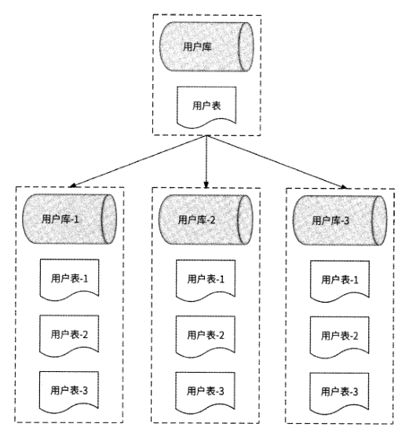

水平分库使数据库拥有分布式能力，水平分表使数据量过大的单表SQL语句的执行
效率得到提升，我们可以根据业务需要来选择是水平分库、水平分表还是水平分库分表。

- 如果在业务场景中用户并发量很大，但是数据量较小，则可以只选择水平分库，不选择水平分表。
- 如果在业务场景中用户并发量很小，但是数据量较大，则可以不选择水平分库，只选择水平分表。
- 如果在业务场景中用户并发量很大，数据量也很大，则可以选择水平分库分表。

### 2.6.4 水平拆分规则

实际上，水平拆
分规则是指数据路由算法，用于决定一条数据应该被拆分到哪个库和哪个表中。更广泛的
说法是，一条数据应该被拆分到哪个数据分区。

在最理想的情况下，数据路由算法应该保
证每个分区有均等的数据量和数据读/写请求量。如果某个数据分区存储的数据量远大于
其他数据分区，我们就称此情况为“数据偏斜”；如果某个数据分区的读/写请求量远大于
其他数据分区，我们就将这个数据分区称为“数据热点”。一种适合的数据路由算法应该
避免出现数据偏斜与数据热点。接下来介绍几种常见的数据路由算法。

#### 1.范围分区法

将数据以可排序字段值的区间为依据进行数据分区，比如数据唯一 ID、数据创建时
间等。例如，如图2・15所示，按照数据创建时间将每半年作为一个区间进行数据分区一一
将2020年7月至12月的数据存储到数据库DB1中，将2021年1月至6月的数据存储到
数据库DB2中，将2021年7月至12月的数据存储到数据库DB3中。

范围分区法可以很方便地支持分区查询，比如上面的例子，可以轻松地得到某个月所
有的数据。另外，范围分区法对分区扩容很友好，比如增加数据分区时，只需要设置更多
的数据范围，而基本上不会变更已有的分区数据范围。

范围分区法是否可以保持各数据分区的数据量均匀分布非常依赖分区字段的属
性。如果分区字段有自增属性，比如“用户表”使用用户id作为分区依据，那么由于用
户id自增，每个分区保持范围等长即可保证数据量的均匀分布；而如果“用户表”使用
用户昵称这种具有随机性质的字段作为分区依据，那么由于用户昵称的值随机，每个分区
的范围长度可能不同，即数据分区之间难以保证数据量的均匀分布，容易造成数据偏斜。
此外，如果使用带有时间属性的字段作为分区依据，数据范围是近半年的数据分区的读/
写频率更高，则容易出现数据热点。

#### 2.哈希分区法

为了防止出现数据偏斜与数据热点的问题，很多分布式存储系统都会采用哈希函数来确定数据分区。

#### 3.一致性哈希分区法

一致性哈希分区法最重要的结构是哈希环，如图2-17所示，数值0〜232.1作为232个
节点依次排列在哈希环上并首尾相连。

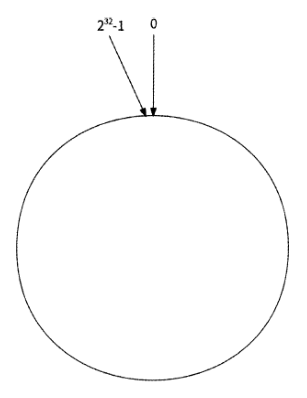

哈希环维护了每个哈希值与其数据分区的路由关系。

每条数据都以某个字段进行哈希计算，所得到的哈希值也与2^32取模后被映射到哈希
环的某个节点，然后从这个节点出发，在哈希环上顺时针查找到的第一个数据分区节点负责存储此数据。

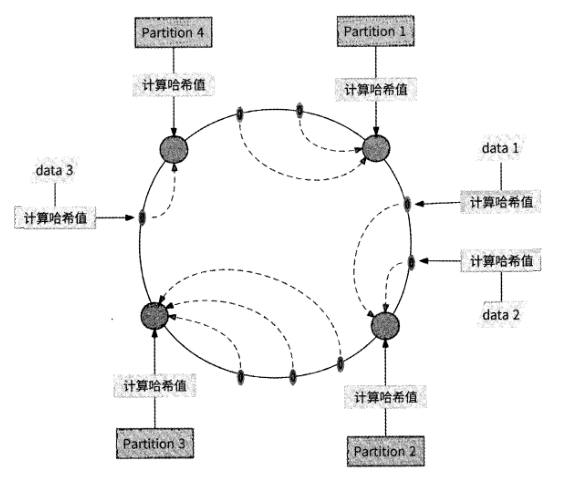

一致性哈希分区法最主要的优点是，当增加或移除一个数据分区时，只有其在哈希环
上逆时针相邻的数据需要重新分区。

比如图2-18中的数据分区Partition 4被移除后，只有
其原本存储的数据data 3需要被迁移到新的数据分区Partition 1,其他数据不会受到影响。

当数据分区较少时，有很大的可
能是它们在哈希环上的分布较为集中，进而造成数据偏斜，如图2-19所示。

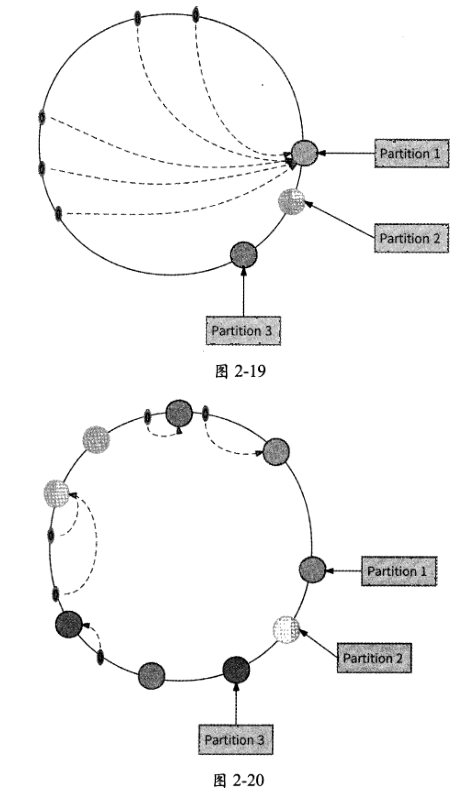

从图2・19中可以看出，由于3个数据分区的分布较为集中，所以产生了数据偏斜问
题，Partition 1存储的数据量远远大于Partition 2和Partition 3。为了避免出现这种情况，
一致性哈希分区法引入了虚拟节点机制。对于每个数据分区，计算出多个哈希值，每个计
算结果都被放置到哈希环的对应节点上，这些节点被称为“虚拟节点”。一个实际的数据
分区可以对应多个虚拟节点。通过虚拟节点机制可以将数据分区数目放大，数据分区对应
的虚拟节点越多，哈希环上的节点就越多，它们也更容易在哈希环上均匀分布，数据偏斜
的影响就会越来越小。如图2-20所示的是每个数据分区有3个虚拟节点的哈希环映射情
况。

### 2.6.5 扩容方案

当某个分库承载的数据量或请求量远高于其他分库，或者现有的分库分表架构的数据
量已经趋于饱和时，都需要进行扩容操作。这里推荐的平滑扩容方案是从库升级法。

我们先来介绍单个分库的扩容步骤。如图2-21所示，假设某数据库被拆分为3个库
和6个表，各个分库存储的数据范围分别为rO〜rl、rl〜r2、r2~r3,此时分库DB0的数
据量和资源压力过大。

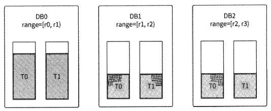

使用从库升级法对DBO分库扩容的步骤如下。

为DBO增加Slave节点（即从库）,开始主从复制操作，将DBO的数据同步到从
库。这一步不一定需要专门来做，因为在常见的数据库分库分表方案中，分库都会使用主
从复制架构来保证每个分库高可用，从库是本来就存在的。

主从复制完成后，DBO主库临时封禁写请求操作，保证不再有增量数据。

检查主从库数据，如果数据完全一致，则表示数据已经完全被同步到从库，此时
断开主从关系。

修改DBO的数据范围为r0~（r0+rl）/2,即DBO负责原来数据范围的前一半。

将DBO从库提升为主库并命名为DB3,同时设置数据范围为（r0+rl） /2 - rl,即
DB3负责原DBO数据范围的后一半。

确认上游业务均已感知到分库数据范围的变更后，解封DBO的写请求操作，此
时分库扩容已经完成，业务已经恢复正常写数据库。

启动离线任务，将DBO和DB3的数据范围外的另一半冗余数据删除，最终DBO
被扩容为图2-22所示的分库。

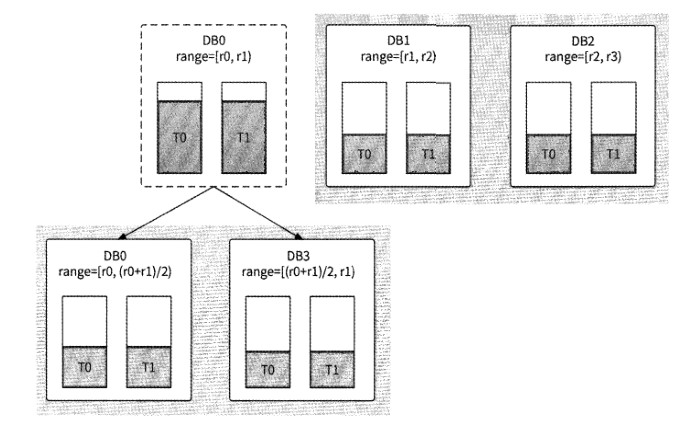

对整个数据库基于从库升级法扩容时，分库数量会翻倍，所以这种扩容方式也被称为
“翻倍扩容法”。其扩容步骤与单个分库的扩容步骤类似，只不过是对每个分库都执行从库
升级。

### 2.6.6 其他数据分片形式

#### 1. Kafka 多 Partition

在消息中间件Kafka中，以Topic区分不同的消息类型，每个Topic都可以被认为是
一个逻辑上的消息队列。在Topic内部物理组成上，消息队列被拆分为多个Partition,每
个Partition对应一个独立的日志文件被存放在不同的服务器上。Kafka在向一个Topic发
送消息时，实际上是在并行写入Partition, 一个Topic的Partition数目越多，越能增加这
个Topic的消息写入吞吐量。

#### 2. 秒杀系统分布式锁

电商秒杀系统往往通过分布式锁来保证秒杀时产品不被超卖，但如果某个产品的热度
很高，大量秒杀请求并发竞争同一个分布式锁，则会严重拖垮性能。由于分布式锁会造成
请求串行化执行，假设一次分布式锁操作耗时20ms, 1s最多可以接收50个秒杀请求，那
么这对于热门产品来说难以接受。对于这种情况，优化思路也是数据分片：将产品库存拆
分为N份，每份库存使用单独的分布式锁保护，而每个秒杀请求仅争抢其中的一份库存。

例如，现有1000台iPhone手机，我们将库存拆分为20个分段（将分段命名为seg・0 ~ seg・19,
每个分段有50个库存）,同时创建20个分布式锁（命名为iphone-lock-0 ~ iphone-lock-19 ）
分别保护这些分段；当秒杀请求到来时，将请求用户ID与20取模得到值Z,尝试竞争分
布式锁iphone-lock-z并扣减分段seg-z的库存。20个分布式锁支持20个秒杀请求并行加锁，
这样一来，即使加锁耗时20ms,秒杀系统Is也能接收50x20= 1000个秒杀请求。

#### 3. ConcurrentHashMap

ConcurrentHashMap是JDK内置的线程安全的HashMap,它并不会对整个HashMap
加锁以保证线程安全，而是将其内部数据拆分到多个槽，为每个槽独立加锁，于是对这些
槽可以并发读/写。这样的做法减少了线程间竞争，提高了 HashMap的读/写性能。

## 2.7 高并发写场景方案2：异步写与写聚合

数据分片本质上是通过提高系统的可扩展性来支撑高并发写请求的，每当写请求量达
到一个新高度时，系统就需要数据分片扩容。从产品发展的角度来讲，这本无可厚非，但
是扩容就意味着需要更多昂贵的服务器资源，经济成本较高；况且扩容不是一个实时操作，
对临时的突增流量很难及时应对。实际上，我们还可以从业务的角度和数据特点的角度来
思考高并发写场景的应对之道，本节就来介绍两种常见的方案：异步写和写聚合。

### 2.7.1 异步写

异步写是一个泛化的概念，并不局限于实现形式。异步写把写请求的交互流程从“用
户发起写请求并同步等待结果返回”转变为“用户提交写请求后，异步查询结果”的两阶
段交互。

将用户写请求先以适当的方式快速暂存到一个数据池中，然后立刻响应用户，告
知其请求提交成功，以便缩短写请求的响应时间。

真正的写操作由后台任务不断地从数据池中读取请求并真正执行。

写操作结果依靠用户主动查询，有的业务场景为了提高实时性，也会在写操作执
行完成后王动将结果通知给用户。

异步写非常适合写请求量大，但是被请求方的系统吞吐量跟不上的场景一一写请求先
排队，被请求方以正常的速度处理请求，就像火车检票口一样。

#### 1.跨公网调用

某电商类产品接入微信支付、支付宝等渠道来做支付功能，这些渠道都属于第三方平
台，即不属于本产品的后台服务，这就意味着需要跨公网调用第三方平台的支付接口。

而公网调用的网络耗时和网络抖动很严重，同时大量的用户支付请求到来会导致跨公网调用
发生阻塞。由于跨公网调用的速度无法匹配支付请求的速度，所以使用异步写方案可以很
好地解决问题。

如图2-24所示，使用消息中间件对用户支付请求进行排队操作，并通过
消息消费者不断地消费用户支付请求，逐个跨公网调用第三方平台的支付接口。

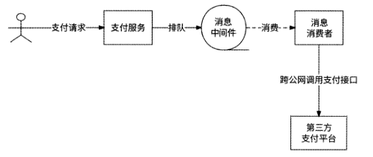

#### 2.秒杀系统异步化

在产品秒杀活动中，对于某电商产品，在同一时间会有大量的用户抢购请求涌入服务
器，如果每个请求都直接访问数据库进行扣减库存和写入订单的操作，那么数据库将会承
受巨大的压力。

我们可以通过异步写方案将抢购动作变成异步形式：用户点击“抢购”按
钮，秒杀服务将抢购请求提交到消息中间件，而后立即响应用户——“抢购中”；消息消
费者按照数据库的真实处理能力，低频甚至串行地消费抢购请求并交给数据库处理；数据
库处理请求完成后，将处理结果保存到Redis中；用户可以刷新订单页向Redis查询抢购
结果。秒杀系统的异步化架构大致如图2-25所示。

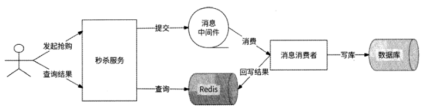

### 2.7.2 写聚合

写聚合将若干写请求聚合为一个写请求，减少了写请求量。

#### 1. Kafka Producer 批量生产

为了提升消息生产者（Producer） 的消息发送性能，消息中间件Kafka提供了
Micro-Batch概念。Micro-Batch提供了一个名为RecordAccumulator的消息收集器，它会
将Producer待发送的消息暂存在内存中，并将相同Topic、相同Partition的消息聚合为一
个批次，然后一次性发送到Kafka集群，大大提高了 Kafka发送消息的吞吐量。

#### 2. AliSQL热点数据优化

由于行锁的存在，在数据库中处理热点数据更新一直是一个难题。对某行热点数据的
多个更新请求会相互竞争同一个行锁，性能一直难以得到提升。阿里云深度定制的MySQL
分支AliSQL对热点数据更新有专门的优化：将对同一行的多个更新操作聚合为一个批次
更新操作，消除了行锁竞争，提高了热点数据的更新效率。

## 2.8 本章小结

一个系统设计是否满足高并发架构并不是简简单单地看它能承受的QPS是多少。高
并发系统有3个可量化的重点指标：高可用性（ 99.95%的时间可用）、高性能（平均响应
时间小于200ms, PCT99小于Is ）和可扩展性（可扩展性大于70% ）o

高可用性反映了系统可以提供可靠服务的时间，高性能反映了系统吞吐量，而可扩展性反映了系统的韧性。

高并发场景可以分为高并发读场景和高并发写场景。在面对这两种场景时，高并发架
构设计往往有不同的思路。
对于高并发读场景来说，可以通过数据库读/写分离、本地缓存、分布式缓存等方案
来解决问题。数据库读/写分离方案依赖数据库主从复制机制，并需要格外注意主从延迟
问题。本地缓存方案使用服务器本地内存空间来换取网络调用时间，并可以使用如LFU、
LRU. W-TinyLFU等缓存淘汰策略来防止滥用本地内存；同时可以使用类似于SingleFlight
的机制来解决缓存击穿问题。分布式缓存方案使用Redis实现，可以通过先更新数据库再
删除缓存的方式来保证数据库与缓存数据的最终一致性；同时为了防止缓存失效，需要注
意缓存穿透、缓存雪崩等问题。最后我们提出了 CQRS模式，用于总结应对高并发读场景
的核心思想：读/写分离。

而对于高并发写场景来说，可以采用数据分片（数据库分库分表）将写请求分散到多
个数据分区；也可以使用异步写方案，暂时将写请求存储到一个临时缓冲区（典型的代表
是消息中间件）；还可以按照数据特性对相关的写请求进行写聚合，减少了写请求量。
