# 第 3 章 通用的服务可用性治理手段

## 3.1 微服务架构与网络调用

当某个业务从单体服务架构转变为微服务架构后，多个服务之间会通过网络调用形式
形成错综复杂的依赖关系。


在微服务架构中，一个微服务正常工作依赖它与其他微服务之间的多
级网络调用，这是微服务架构与单体服务架构最典型的区别。

在微服务架构中，为了解决上述种种影响服务可用性的问题，笔者认为可以从如下两
个方面来考虑。

- 容错性设计。要接受网络脆弱与下游服务质量不可靠的事实，并在进行服务设计时充分考虑相应故障产生时的容错方案。
- 流量控制。既要对上游服务调用采取预防性策略，防止打垮我们的服务；也要对下游服务有感知与保护意识，当感知到下游服务的质量下滑甚至服务不可用时，及时通过自身保护下游服务。

接下来依次介绍服务可用性治理的5种通用方案：重试、熔断、隔离、限流、降级。
重试与降级是容错性设计的具体表现形式，熔断、隔离与限流则是流量控制的常见实现方式。

## 3.2 重试

### 3.2.1 幕等接口

当执行RPC请求调用下游服务接口遇到网络超时的情况时，我们并不知道RPC请求
是否已经被下游服务成功处理，因为超时可能出现在请求处理的多个阶段。

- RPC请求发送超时，此时下游服务并未收到RPC请求。
- RPC请求处理超时，下游服务已经收到RPC请求，但是处理时间过长。
- RPC响应报文超时，下游服务已经处理完RPC请求，但是响应报文超时未回复。

我们的服务无法准确判断RPC请求是否被下游服务成功处理，所以只能假定最坏的
情况：下游服务已经成功处理请求，但是我们的服务没有收到响应信息。此时，如果我们
的服务要进行重试，那么下游服务必须保证再次处理同一请求的结果与用户预期相符。

在编程世界里，籍等指的是对于某系统接口，无论同一请求被重复执行多少
次，都应该与执行一次的结果相同。满足蒂等性的接口被称为“幕等接口”，只有幕等接
口可以被安全地重试调用。

所有读性质的RPC接口（即读接口）天然都是赛等接口，因为无论读接口执行多少
次都不会改变数据；而写性质的RPC接口（即写接口）会改变数据，所以需要查看多次
改变数据的结果是否与一次改变数据的结果相同。

涉及非暴等写操作的接口可以通过蓦等性被设计成幕等接口。如果某接口涉及数据库
插入操作，则可以先对数据库的相关数据表设置唯一键。重复调用此接口时，数据库会报
出“键重复”错误，表示此数据已经被插入；此时，若接口返回成功，此接口就可以成为
蓦等接口。

如果某接口涉及数据库更新操作，则可以借鉴CAS( Compare And Swap，比较
与替换)的思想，为行数据引入数据版本号，重写SQL语句如下：

```SQL
UPDATE tablel SET coll=coll+l WHERE version=X AND col2=Y
```

重复调用此接口时，由于version字段的值已经发生变化，因此最终的SQL语句未命
中数据行，即它并未真正执行，接口满足矗等性。

以上保证幕等性的方案要求写操作必须是数据库操作，通用性较差。更直接的做法是
采用判断请求是否已处理的思路：对于每个请求，使用分布式唯一 ID (见第4章)作为
UUID,同时在接口侧保存已处理的请求记录；在请求调用接口时，由接口侧根据请求的
唯一标识查询已处理的请求记录；如果找到相应的记录，则说明它处理过此请求，直接返
回成功即可。其具体实现方式如下。

#### 1. Redis分布式锁

接口使用Redis的SET命令保存已处理请求的UUID,并结合NX参数保证：当且仅
当键不存在时才成功写入，否则不写入。

1. 接口接收请求后，先尝试在Redis中执行SET UUID NX命令写入请求的UUID。
2. 如果Redis写入成功，则说明此请求未被接口处理过，接口可以真正处理此请求。
3. 如果Redis写入失败，则说明Redis中已写入过此UUID,即此请求已被接口处理过，于是接口拦截此请求并直接返回成功。


#### 2. 数据库防重表

利用数据库唯一索引的唯一性特点，可以专门创建一个表来保存接口处理过的请求记
录，并以请求的UUID作为表的唯一索引。这个表被称为“防重表”。接口在处理请求前,
先将请求插入防重表中一如果发生索引冲突，则说明此请求在防重表中已经存在，于是
请求被拦截，接口直接返回。


以用户账户服务的扣款接口为例，数据库除了维护用户账户表，还会维护一个交易流
水表，并以用户ID与订单ID作为联合唯一索引。当扣款请求到达用户账户服务时，先将
扣款请求插入交易流水表，插入成功后再执行真正的扣款操作。如果重复处理扣款请求，
则会在插入交易流水表时发生索引冲突，不再执行扣款操作，这样就保证了扣款接口的幕
等性。

#### 3. token

token （令牌）方案也是一种通用的实现接口蓦等性的方案，它要求在正式向某服务调
用接口前，先从此服务中获取一个token,然后携带token调用所需的接口。

1. 上游服务先向目标服务申请获取token
2. 目标服务生成分布式唯一 ID作为token,先保存到Redis （也可以是其他存储系统）中，然后返回给上游服务
3. 上游服务收到响应信息后，携带token真正调用目标服务的接口
4. 目标服务通过在Redis中删除token的方式，来检查请求携带的token是否有效。
如果删除token成功，则说明Redis中存储了此token,申请token的接口请求是首次访问，
于是处理请求；如果删除token失败，则说明Redis中从未存储过此token或者token已经
被删除，申请token的接口请求可能是重试访问，于是直接返回响应信息。

需要注意的是，获取token仅执行一次，而真正调用接口可以重试。token方案的整体
流程如图3-4所示。


### 3.2.2 重试时机

重试时机包括两个维度：RPC接口调用遇到什么错误时重试请求，以及何时重试请求。

RPC接口调用遇到的错误可以分为如下几类：

- 业务逻辑错误，即下游服务认为请求不符合业务逻辑而返回的错误。比如下游服务在处理扣款请求时发现用户余额不足，或者某请求包含非法参数，这些都属于业务逻辑错误。
- 服务质量异常错误，即反映下游服务稳定性的相关错误。比如下游服务对请求限流（见3.4节）、下游服务拒绝提供服务，或者由于调用下游服务失败率过高请求被熔断（见3.3节），这些都属于服务质量异常错误。
- 网络错误，如请求超时、数据丢包、网络抖动、连接断开等。

重试的退避策略（backoff） 决定何时重试请求。

- 无退避策略：请求失败后立即重试。
- 线性退避策略：每次请求失败后都等待固定的时间重试。
- 随机退避策略：在一个时间范围内随机选取一个时间等待重试。
- 指数退避策略：对一个请求连续重试时，每次等待的时长都是上一次的2倍。
- 综合退避策略：可以是指数退避策略与随机退避策略结合的形式，各开源消息中间件在应对消息消费失败时常使用此策略。

当RPC接口调用遇到业务逻辑错误时不应该重试请求，因为此请求涉及的业务逻辑
有异常，无论重试多少次都是一样的结果；当RPC接口调用遇到服务质量异常错误时，
由于服务质量处于异常状态是有一定的持续时间的，使用无退避策略（立即重试请求）会
大概率继续请求失败，所以此时适合使用各种有退避的策略，比如指数退避策略，这样可
以在一定程度上给足下游服务质量恢复的时间；当RPC接口调用遇到网络错误时，因为
网络错误具有随机性，重试请求再次失败的概率很小，所以可以在下游服务未熔断的前提
下立即重试请求。

### 3.2.3 重试风险与重试风暴

重试虽然可以提高服务质量，但是也会给下游服务带来服务质量风险。假设在用户请
求量较大的晚高峰时间，由于下游服务容量不足导致服务负载升高，质量下降，上游服务
的请求调用就会出现网络超时或网络断开的情况。

即使对请求设置了最大重试次数，也可能会产生重试风暴现象。如图3.5所示，假设
将每个服务对下游服务的请求最大重试次数均设置为3。如果数据库出现了负载过高的情
况，Server-3服务对数据库的请求最多重试3次，而Server-3服务的上游服务Server-2由
于得不到响应，对Server-3的请求重试3次，Server-1服务对Server-2服务的请求也重试
3次，那么这时候离奇的现象就产生了：原本是来自Server-1服务的1次业务请求，由于
层层重试变成了对数据库的27次请求！数据库本来就负载过高，这样的级联重试让数据
库更加难以应对。这种现象就被称为“重试风暴”。


### 3.2.4 重试控制：不重试的请求

重试需要谨慎进行，否则它会成为洪水猛兽。重试是为了提高服务质量，如果某请求
的重试不会保障服务质量，那么就一定不要重试。

#### 1. 非关键下游服务

如果某个下游服务不是我们的服务的关键下游服务，那么我们应该坦然接受请求失
败，而不执意重试。

#### 2. 上游服务的重试请求不再重试

为了有效防止重试风暴，我们可以在收到上游服务的某请求后，检查这个请求是否是
上游服务的重试请求，如果是，则在调用下游服务遇到失败时不再重试请求，防止请求量
被级联放大。比如3.2.3节的例子，如果Server-1服务向Server-2服务发送了重试请求，
而Server-2在此链路上调用Server-3服务时遇到错误，那么Server-2最好不执行重试请求。
这种策略要求重试请求在请求头中携带一个标记，以便下游服务可以识别该请求是否为重
试请求。

#### 3.服务质量异常错误

3.2.2节中提到，如果我们的服务遇到来自下游服务的限流错误，或者服务内部的熔断
器已经将下游服务熔断，则说明下游服务的负载过高。为了不成为压垮下游服务的“最后
一根稻草”，我们的服务也不重试请求。

### 3.2.5 重试控制：重试请求比

通过设置最大重试次数可以有效控制单个请求的重试放大倍数，但是如果有较多的请
求被重试，那么下游服务依然会收到大量的重试请求，服务负载也依然会有进一步升高的
风险，所以我们应该对上游服务的整体重试量级进行相应的控制。

Google SRE建议每个上
游服务都要控制正常请求总数与重试请求总数的比例(重试请求比)。如果在一段时间内
重试请求总数低于正常请求总数的10% (即重试请求比低于10%),那么只有当某请求失
败时才允许被重试。


上游服务实时统计Is内的正常请求总数(SC)与重试请求总数(RC)并将其作为一
个桶。假设重试控制策略是最近10s内重试请求比低于10%时才重试请求，那么在某请求
被尝试重试前，取最近10s的10个桶并根据重试请求总数与正常请求总数来计算重试请
求比。如果sum(RC)/sum(SC)<0.1,则可以重试请求。通过这样的重试请求比来控制重试，
可以使重试请求达到最大请求量被放大1.1倍的效果。

## 3.3 熔断与隔离

熔断和隔离都是上游服务可以采取的流量控制策略，其中熔断可以有效防止我们的服
务被下游服务拖垮，同时可以在一定程度上保护下游服务；而隔离可以防止一个服务内各
个接口之间因质量问题而相互影响

### 3.3.1 服务雪崩

由于网络原因或服务自身设计问题，每个微服务一般都难以保证100%对外可用。

在微服务架构中，由于在服务间建立了依赖关系，所以一个服务的故障会不断向上传播，
最终导致整个服务链路发生宕机故障。这就是服务雪崩现象。

对于“熔断”，大家应该都不陌生，它并不是一个计算机术语，它在股市、电力、交
通等领域都频繁出现。服务熔断与这些熔断场景的道理相同，出发点都是为了及时控制风
险。

在电力领域，熔断器是一种特殊的电流保护器，当电流超过某个阈值时它主动通过产
生热能使熔体熔断、电路断开，这可以有效防止电气设备因短路、过电而损坏。

服务雪崩场景也可以通过服务熔断的方式阻断对下游服务的调用，使我们的服务不
被发生故障的下游服务拖垮。接下来介绍通过Hystrix组件实现的一个经典的熔断器。

### 3.3.2 Hystrix 熔断器

Hystrix熔断器将下游服务分为3种熔断状态。

1. 熔断关闭（Closed）状态：默认状态，此时下游服务正常，服务调用方可以正常进行请求调用。
2. 熔断开启（Open）状态：如果服务调用方在最近一段时间内对某下游服务的请求调用失败率达到某个阈值，则认为它不可用，为此下游服务设置熔断开启状态，并且不再对此下游服务进行请求调用。
3. 熔断半开（Half-Open）状态：如果某下游服务的熔断已经开启了一段时间，则会自动进入熔断半开状态。此时服务调用方会允许一个请求尝试调用下游服务，以检测下游服务是否已经恢复，然后根据检测结果将熔断状态设置为关闭或开启。

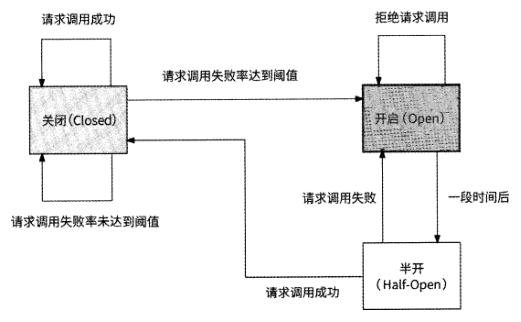

在熔断状态转化条件中，有一些地方需要人为预设阈值，在Hystrix熔断器的实现中
有一些关键变量，如表3-1所示。

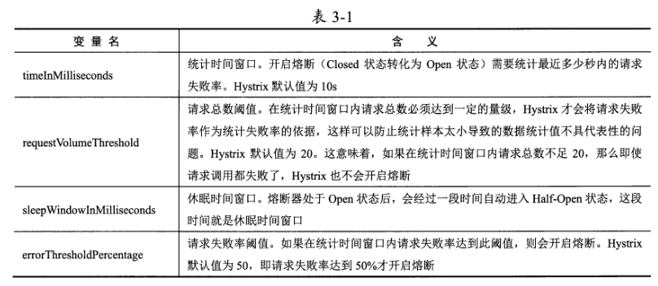

通过基于时间窗口的请求失败率开启熔断,Hystrix可以做到对下游服务故障的有效感
知，而通过在Half-Open状态允许一个请求试探执行的机制，可以使Hystrix具有对下游
服务恢复的感知能力。

Hystrix官网已经处于不再维护的状态，Hystrix官方推荐使用新一代熔断器
Resilience^作为其替代品。另外，阿里巴巴开源的Sentinel项目也是一个很好的选择。

### 3.3.3 Resilience4j 和 Sentinel 熔断器

Hystrix熔断器通过时间窗口请求失败率的策略来开启熔断，Resilience4j 除了采用此
策略，还采用了一种称为慢调用比例的策略来开启熔断，即通过统计时间窗口内慢速请求
调用在请求总数中的比例来判断是否对下游服务开启熔断。

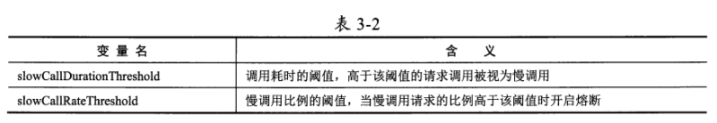

通过这两种策略的结合，Resilience4j 可以从下游服务
的质量和性能两个角度，综合评判下游服务是否应该开启熔断。相比于Hystrix熔断器，
它有更多的视角感知下游服务是否可用。

Sentinel熔断器在这方面的表现更为全面，除实现了时间窗口请求失败率策略和慢调
用比例策略外，Sentinel熔断器还支持错误计数策略：如果最近lmin的请求失败数超过阈
值，则会开启熔断。

此策略使用请求失败数而非请求失败比例判断是否开启熔断，可以有
效防止当请求量样本数太大时，需要大量的请求失败才可以达到请求失败率阈值的问题，
提高了对下游服务不可用的感知能力。

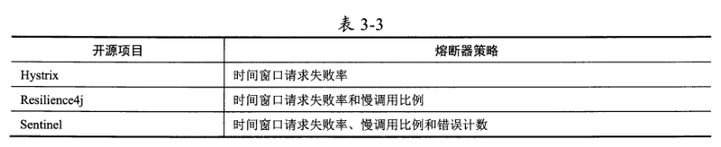

### 3.3.4 共享资源与舱壁隔离

一般的业务服务都会定义固定大小的线程池来处理对下游服务的请求调用，在下游服
务响应慢的情况下，线程池作为服务内共享资源有可能导致服务内各接口的质量相互影响。

如图3-12所示，3个接口分别从线程池中获取50个线程调用下游服务。假设服务B
在某时间接口的响应速度变得非常慢，那么正在调用服务B的线程会发生较长时间的阻
塞，于是接口 II相比于其他两个接口会更长时间地占用线程。随着时间的推移，线程池
中大部分可用线程都被接口 II所持有，接口 12和接口 13所能获取的可用线程都达不到50
个，于是这两个接口开始拒绝请求，接口质量下滑，如图3-13所示。

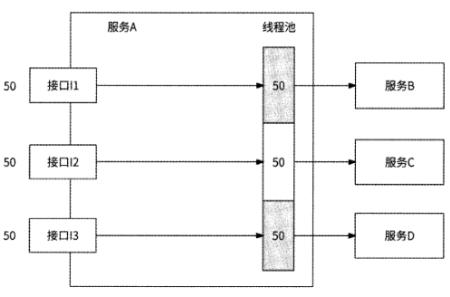

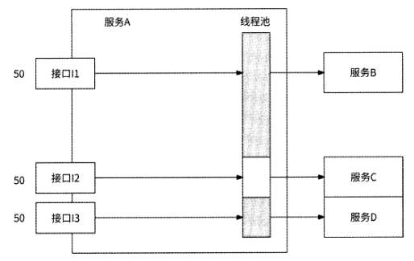

由于线程池是服务内接口间的共享资源，所以一个接口过度占用可用线程，就会对其
他接口产生挤压。这不是我们想看到的结果。最理想的情况是，各个接口间应该互不影响，
这就要求我们对共享资源进行隔离。

在船舶工业中经常会使用舱壁将船舱分隔成多个隔离的空间，当一个船舱漏水时不会
影响到其他船舱。“舱壁”的概念可以被应用在资源隔离问题上，我们需要以某种形式的
“舱壁”将共享资源分隔为多个独立资源。Hystrix、Resilience^Sentinel都实现了舱壁隔离。

### 3.3.5 舱壁隔离的实现

Hystrix提供了两种舱壁隔离的策略，分别是线程池隔离和信号量隔离。这两种策略都
是通过限制对共享资源的并发请求量来实现资源隔离的。

线程池隔离的实现思路很简单，就是为服务调用方的每个下游服务单独创建各自的专
用线程池，每个线程池仅可用于调用同一个下游服务。

信号量是一种并发控制机制，其数据结构由一个整
数值S和一个指针组成，指针指向被阻塞在信号量的下一个进程。信号量的S值一般与资
源使用情况有关。

- S>0：表示当前可使用的资源数量为S。
- S≤O：表示当前无可用资源，但有S个进程被阻塞，正在等待使用该资源。

信号量的值仅可以通过PV操作修改。PV操作由P操作和V操作组成。

- P操作：表示从信号量中获取一个资源。如果S≤O,则P操作发生阻塞等待；否则, S值减1,即S=S-1
- V操作：表示向信号量归还一个资源，S值加1,即S=S+1,并尝试唤醒队列中第一个等待信号量的进程

信号量的S值决定了并发访问量oHystrix为服务调用方依赖的每个下游服务都创建一
个信号量并赋初始值为X,于是实现了对每个下游服务的并发调用控制。服务调用方在试
图调用某个下游服务前，先对相关信号量执行P操作，操作成功后才可调用该下游服务，
再执行V操作。

## 3.4 限流

为了应对多个上游服务的请求访问，以防被上游服务打垮应做好的预防机制，这个预防机制就是老生常谈的“限流”。

限流的表现形式主要包括如下几种：

- 频控：控制用户在N秒内只可执行M次操作，比如限制用户在30s内只能下载1次文件、在lh内最多只能发布5条动态。
- 单机限流+固定阈值：某服务的每台服务器在1s内最多可处理M个请求，M值是预先设置好的。
- 全局限流+固定阈值：某服务在1s内总共可处理M个请求，与前者的主要区别在于限流范围是某服务的全部服务实例。
- 单机自适应限流：某服务的每台服务器根据自身服务状况，使用各种自动化算法动态判断是否限制请求，不再预先设置限流阈值。

### 3.4.1 频控

对于用户在N秒内只能执行1次操作的频控场景，可以使用Redis SET命令结合EX
参数实现,并设置N秒作为Key的过期时间。

对于用户在N秒内最多执行M次操作的频控场景，由于涉及具体的操作次数M，因
此只能通过维护用户操作计数并通过INCR命令更新计数来实现。这里包括两个细节：

1. 如果INCR的结果大于则表示用户操作次数已经达到阈值，应该被频控；
2. 是用户操作计数数据应该在首次设置时被设置过期时间为N秒，首次设置意味着INCR返回值为l

### 3.4.2 单机限流1：时间窗口

一种简单的限流算法是通过固定时间窗口来实现的，比如限制在1S内请求量不超过
100个，可以将时间线切分为以Is为单位的时间窗口，每个时间窗口都维护这Is内允许
通过的计数100

固定时间窗口最大的缺点是无法防止时间窗口边界附近的流量暴增

滑动时间窗口把时间线以更小的时间粒度（如50ms） 划分为一个个槽，将限流计数均摊到每个槽，一个时间窗口就是最近时间的20个槽的总和

### 3.4.3 单机限流2：漏桶算法

漏桶算法是先进先出概念的体现，可以使用队列实现漏桶。每个新来的请求都先尝试
进入漏桶，如果漏桶已满，则拒绝请求；否则，请求在漏桶中排队，服务器按照固定的时
间间隔从漏桶中获取第一个请求并对其进行处理。使用漏桶算法，请求可以以任意速率进
入服务器，而服务器永远以固定的速率处理排队的请求。

漏桶算法可以保证无论有多少个请求涌入服务器，它们都将按照固定的速率被处理，
有效保障了服务的稳定性。不过，漏桶算法的缺点也非常明显，为了按照固定的速率处理
请求，漏桶算法强行要求请求排队等待，从上游服务的视角来看，请求的响应时间会有一
定程度的增加。另外，漏桶算法应对流量不够灵活，不支持突增流量，这些突增流量对服
务来说可能完全没有处理压力，但请求却在缓慢排队，其实这是对服务性能的浪费。

### 3.4.4 单机限流3：令牌桶算法

令牌桶算法是一种高效且易于实现的限流算法，并消除了漏桶算法的缺点。令牌桶算
法的原理是系统会以一个恒定的速率向令牌桶中放入令牌

令牌桶算法可以容忍一定程度的突增流量，这个特性体现在两个方面。首先，令牌桶
的容量力保证此算法允许在1s内最多有力个并发请求访问服务；其次，令牌在不断生成,
并且只有请求访问服务时才扣减令牌的形式，对请求波动的限流更加灵活。如果我们预期
的限流阈值是Is处理100个请求，那么令牌桶算法每秒会向桶中放入100个令牌。假设
第1秒只有80个请求访问服务，还剩下20个令牌，那么第2秒可以允许120个请求通过
限流器。

### 3.4.5 全局限流

与单机限流不同，全局限流旨在对一个服务的所有实例统一限流，所有服务实例共用
一个限流配额，这个限流配额一般由专门的限流服务器下发。

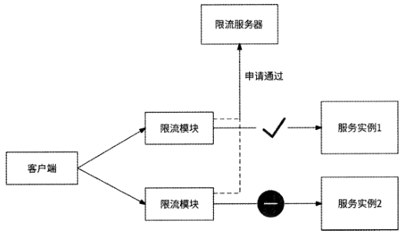

## 3.5 自适应限流

无论是时间窗口、漏桶算法、令牌桶算法，还是全局限流方案，限流阈值都是人为设
置的，这就意味着这些限流策略的实际效果很被动，依赖限流阈值的设置是否足够合理。

为了设置合理的限流阈值，在一个服务正式上线前，我们一般会事先对它进行一段时间的
全链路压测，再根据压测期间服务节点的各项性能指标，选择服务负载接近临界值前的
QPS作为限流阈值。

### 3.5.1 服务与等待队列

每个服务都有
一定的并发度(concurrency),对于一定范围内的并发请求，服务能立即处理这些请求，
而当到达服务的请求量级大于服务并发度时，请求就会排队等待。Netflix技术团队形象地
用一个等待队列(queue)来表述服务与请求之间的关系，无法立即被处理的请求在这个
等待队列中排队，如图3-22所示。

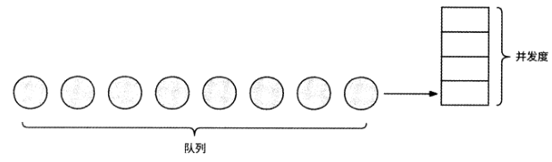

如图3-23所示，如果不对等待队列加以限制，那么随着越来越多的请求在等待队列
中排队，请求延迟逐渐增加，直到所有请求都超时未响应，服务最终也会因为内存耗尽而
崩溃。当服务有逐渐崩溃的趋向时，我们认为服务“过载”。

### 3.5.2 基于请求排队时间

Dagor是微信团队研发的微服务过载控制系统，它提供了服务过载检测、准入控制等
能力。准入控制指的是服务处于过载状态时，服务进一步细分哪些请求可以通过。Dagor
的设计思路是优先保证业务优先级或用户优先级更高的请求被允许通过，而低业务优先
级、低用户优先级的请求被丢弃。

Dagor使用等待队列中请求的平均等待时间（即排队时间）来判断服务是否过载。一
个请求的排队时间的计算公式如下：

排队时间=请求开始被处理的时间-请求到达服务的时间

微信团队设置的平均等待时间的阈值为20mso如果请求在被服务处理前平均等待时
间超过20ms,则认为服务已经过载。据说这个阈值配置已经在微信业务系统中应用了很
多年，微信业务服务的稳定性已经验证了这种过载检测方式和阈值配置的有效性。

### 3.5.3 基于延迟比率

Netflix技术团队实现了自适应限流组件concurrency-limits,它的算法借鉴了 TCP拥
塞控制的部分思想，通过检查请求最小延迟和采样延迟之间的比值动态调整限流窗口。

gradient = RTT_noload / RTT_actual

RTT noload变量表示服务无负载时的最佳请求延迟，concurrency-limits组件用最近一
段时间内最小的请求延迟作为它的值；RTT_actual变量表示当前采样请求的实际延迟。

这两个变量之间的比值被称为梯度（gradient） 。gradient的值为1,表示没有请求在等待队列
中排队，可以适当放宽限流窗口； gradient的值小于1,表示可能已有请求排队，为了防
止过多的请求排队，需要逐渐收紧限流窗口。

newjimit = current_limit x gradient + queue_size

current_limit变量表示当前限流窗口的大小，通过其与gradient相乘来上下调整限流
窗口，current limit在服务初始状态时以较小的初始值开始运行；queue_size变量表示允许
一定程度的排队，此变量的值一般是当前限流窗口大小current limit的平方根。

在没有请求排队时，这个公式可以产生限流窗口很小则增长很快、限流窗口过大则增长缓慢的效果，
与TCP拥塞控制很像。通过反复调整限流窗口，算法主键趋于稳定，不仅能让请求延迟
保持在较低的状态，而且允许一定程度的突发流量。

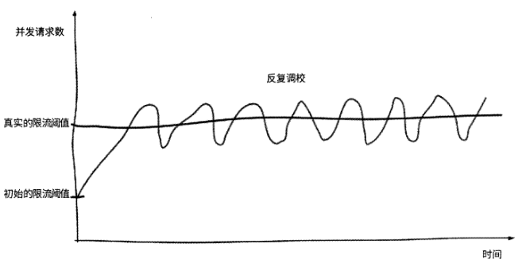

### 3.5.4 其他方案

Kratos是由bilibili公司开源的一套轻量级Go语言微服务框架，其中包含大量微服务
相关工具。值得称赞的是，Kratos实现了较多保障服务可用性的中间件，其中就包括使用
了 BBR limiter算法的自适应限流器。

BBR limiter算法使用CPU负载做启发阈值。如果CPU负载超过80%,则
获取最近5s的最大吞吐量；如果此时服务中正在处理的请求数大于最大吞吐量，则丢弃
新请求。

## 3.6 降级策略

### 3.6.1 服务依赖度降级

在判断出某服务的各下游服务的依赖度后，便可以明确地知道请求量暴增时应该优先
切断哪些下游服务调用，使得服务资源能够向更重要的下游服务倾斜，保障核心场景的可用性。

服务依赖度不仅仅可以在高并发场景中应用，前面讲述的重试、熔断、限流也都
可以基于服务依赖度做更高级的增益精细化处理。

- 重试：仅对强依赖的下游服务进行重试。
- 熔断：把弱依赖的下游服务的熔断阈值设置得比强依赖的下游服务高一些，以便较早地停止调用弱依赖的下游服务，以及在确定强依赖的下游服务不可用时熔断它。
- 限流：如果上游服务认为下游服务是强依赖的，则优先保证其请求被执行；而如果认为下游服务是弱依赖的，则及时对其限流，将限流窗口更多地留给那些认为下游服务更重要的上游服务。

### 3.6.2 读请求降级

读请求降级策略与第2章介绍的高并发读场景的方案很类似，读请求的服务降级策略
主要是缓存(Cache)和兜底数据。一个请求从客户端发起到最终数据响应一般会依次经
过客户端、接入层网关、HTTP服务、RPC服务、分布式缓存、数据库，我们可以在客户
端、接入层网关和HTTP/RPC服务中设置本地缓存，并在动态配置中心动态控制各层是否
使用缓存，以及缓存的过期时间

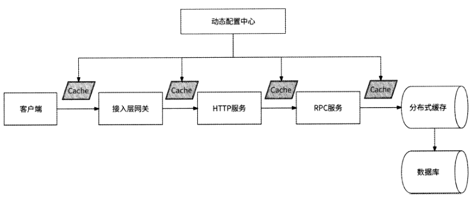

除缓存方式外，我们还可以应用兜底数据的思想：如果访问某数据失败，则降级为访
问另一份基本可用的数据，其形式可以是静态数据，也可以是来自另一个数据源的数据。

将另一个数据源的数据作为兜底数据。近年来，很多互联网应用都内置了非常流
行的内容推荐功能，由信息流推荐服务负责提供服务。信息流推荐服务有两个核心的下游
服务：推荐算法服务和内容服务。推荐算法服务先根据用户爱好计算出一批内容ID,再
由内容服务对完整的内容进行打包。不过，推荐算法服务是典型的计算密集型场景，它的
可用性和性能表现一般，如果它不可用了，那么信息流推荐服务也就不可用了。解决方法
是应用兜底数据的思想:每天零点离线计算出一批用户可能感兴趣的内容或热门内容的ID
列表，由兜底推荐服务维护，当信息流推荐服务调用推荐算法服务超时或推荐算法服务不
可用时，就转而调用兜底推荐服务获取内容ID列表，如图3-28所示。

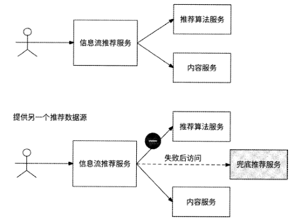

将静态数据作为兜底数据。例如，很多直播平台都提供了打赏功能，用户打开礼
物列表选择礼物送给主播，主播根据礼物的价值获得收入。如果礼物列表服务不可用，那
么用户想打赏时就会发现没有礼物可选，进而导致直播平台收入受损。解决方法是事先在
接入层网关配置几个常见礼物数据，如果在接入层网关访问礼物列表服务失败，则可以直
接返回配置的礼物数据，这样用户打开礼物列表至少可以看到几个礼物，提高了用户打赏
的可能性。

### 3.6.3 写请求降级

写请求降级策略有异步写和写聚合，这些内容在第2章中有详细介绍，这里不再赘述。
在某些业务场景下，我们还可以直接丢弃写请求，一个值得介绍的例子就是直播间弹幕自见。

用户可以在直播间内发送弹幕与主播进行文字互动。在正常流程下，用户发送弹幕到
对应的弹幕服务，然后弹幕服务将用户的弹幕消息广播到直播间的所有用户。如果直播间
热度较高，则会有海量用户参与发送弹幕。假设某直播间有100万个在线用户，每秒有100
个用户发送弹幕，为了让100万个用户都能看到这100条弹幕消息，弹幕服务每秒需要下
发1亿条消息，服务器网络带宽被占满。

一种可能的降级方案是直播间弹幕自见。

- 用户A发送弹幕，客户端直接在直播间展示这条弹幕消息，用户A认为弹幕发送成功。
- 在动态配置中心配置客户端消息丢弃比例，客户端按比例决定是否把这条弹幕消息发送到服务端。
- 弹幕服务不再直接把弹幕消息广播到直播间的全部用户，而是根据动态配置中心配置的消息广播比例，将弹幕消息随机广播到一部分直播间用户。
- 研发工程师根据弹幕服务的性能，实时调整客户端消息丢弃比例和消息广播比例。

这种降级方案的可行性在于：热门直播间弹幕量大，一个用户发送的弹幕本来就会被
淹没在不断刷屏的新弹幕中，用户也并没有执念一定要让直播间的其他用户看到自己发送
的弹幕，所以这个场景的写请求很适合做请求丢弃和广播控制。

## 3.7 本章小结

微服务架构最大的特点就是通过错综复杂的网络调用串联起各司其职的微服务，网络
的健壮性和请求流量的变化都会影响每个服务的质量。

如图3-29所示，通过在网络调用
链路上引入重试、熔断、隔离、限流、降级，可以有效控制流量和保证各服务的可用性。

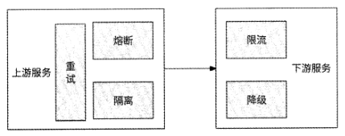
