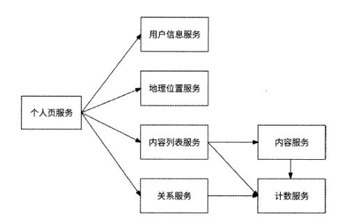
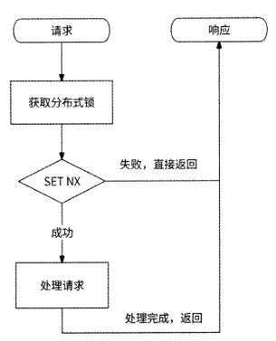
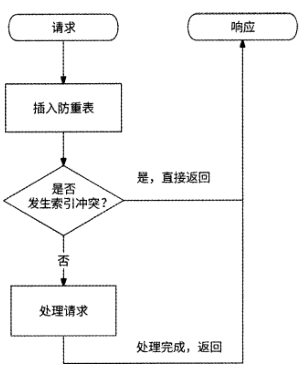
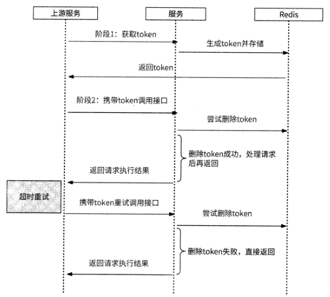
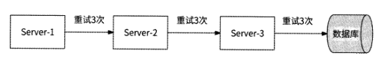
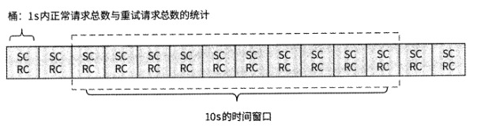

# 第 3 章 通用的服务可用性治理手段

## 3.1 微服务架构与网络调用

当某个业务从单体服务架构转变为微服务架构后，多个服务之间会通过网络调用形式
形成错综复杂的依赖关系。



在微服务架构中，一个微服务正常工作依赖它与其他微服务之间的多
级网络调用，这是微服务架构与单体服务架构最典型的区别。

在微服务架构中，为了解决上述种种影响服务可用性的问题，笔者认为可以从如下两
个方面来考虑。

- 容错性设计。要接受网络脆弱与下游服务质量不可靠的事实，并在进行服务设计时充分考虑相应故障产生时的容错方案。
- 流量控制。既要对上游服务调用采取预防性策略，防止打垮我们的服务；也要对下游服务有感知与保护意识，当感知到下游服务的质量下滑甚至服务不可用时，及时通过自身保护下游服务。

接下来依次介绍服务可用性治理的5种通用方案：重试、熔断、隔离、限流、降级。
重试与降级是容错性设计的具体表现形式，熔断、隔离与限流则是流量控制的常见实现方式。

## 3.2 重试

### 3.2.1 幕等接口

当执行RPC请求调用下游服务接口遇到网络超时的情况时，我们并不知道RPC请求
是否已经被下游服务成功处理，因为超时可能出现在请求处理的多个阶段。

- RPC请求发送超时，此时下游服务并未收到RPC请求。
- RPC请求处理超时，下游服务已经收到RPC请求，但是处理时间过长。
- RPC响应报文超时，下游服务已经处理完RPC请求，但是响应报文超时未回复。

我们的服务无法准确判断RPC请求是否被下游服务成功处理，所以只能假定最坏的
情况：下游服务已经成功处理请求，但是我们的服务没有收到响应信息。此时，如果我们
的服务要进行重试，那么下游服务必须保证再次处理同一请求的结果与用户预期相符。

在编程世界里，籍等指的是对于某系统接口，无论同一请求被重复执行多少
次，都应该与执行一次的结果相同。满足蒂等性的接口被称为“幕等接口”，只有幕等接
口可以被安全地重试调用。

所有读性质的RPC接口（即读接口）天然都是赛等接口，因为无论读接口执行多少
次都不会改变数据；而写性质的RPC接口（即写接口）会改变数据，所以需要查看多次
改变数据的结果是否与一次改变数据的结果相同。

涉及非暴等写操作的接口可以通过蓦等性被设计成幕等接口。如果某接口涉及数据库
插入操作，则可以先对数据库的相关数据表设置唯一键。重复调用此接口时，数据库会报
出“键重复”错误，表示此数据已经被插入；此时，若接口返回成功，此接口就可以成为
蓦等接口。

如果某接口涉及数据库更新操作，则可以借鉴CAS( Compare And Swap，比较
与替换)的思想，为行数据引入数据版本号，重写SQL语句如下：

```SQL
UPDATE tablel SET coll=coll+l WHERE version=X AND col2=Y
```

重复调用此接口时，由于version字段的值已经发生变化，因此最终的SQL语句未命
中数据行，即它并未真正执行，接口满足矗等性。

以上保证幕等性的方案要求写操作必须是数据库操作，通用性较差。更直接的做法是
采用判断请求是否已处理的思路：对于每个请求，使用分布式唯一 ID (见第4章)作为
UUID,同时在接口侧保存已处理的请求记录；在请求调用接口时，由接口侧根据请求的
唯一标识查询已处理的请求记录；如果找到相应的记录，则说明它处理过此请求，直接返
回成功即可。其具体实现方式如下。

#### 1. Redis分布式锁

接口使用Redis的SET命令保存已处理请求的UUID,并结合NX参数保证：当且仅
当键不存在时才成功写入，否则不写入。

1. 接口接收请求后，先尝试在Redis中执行SET UUID NX命令写入请求的UUID。
2. 如果Redis写入成功，则说明此请求未被接口处理过，接口可以真正处理此请求。
3. 如果Redis写入失败，则说明Redis中已写入过此UUID,即此请求已被接口处理过，于是接口拦截此请求并直接返回成功。



#### 2. 数据库防重表

利用数据库唯一索引的唯一性特点，可以专门创建一个表来保存接口处理过的请求记
录，并以请求的UUID作为表的唯一索引。这个表被称为“防重表”。接口在处理请求前,
先将请求插入防重表中一如果发生索引冲突，则说明此请求在防重表中已经存在，于是
请求被拦截，接口直接返回。



以用户账户服务的扣款接口为例，数据库除了维护用户账户表，还会维护一个交易流
水表，并以用户ID与订单ID作为联合唯一索引。当扣款请求到达用户账户服务时，先将
扣款请求插入交易流水表，插入成功后再执行真正的扣款操作。如果重复处理扣款请求，
则会在插入交易流水表时发生索引冲突，不再执行扣款操作，这样就保证了扣款接口的幕
等性。

#### 3. token

token （令牌）方案也是一种通用的实现接口蓦等性的方案，它要求在正式向某服务调
用接口前，先从此服务中获取一个token,然后携带token调用所需的接口。

1. 上游服务先向目标服务申请获取token
2. 目标服务生成分布式唯一 ID作为token,先保存到Redis （也可以是其他存储系统）中，然后返回给上游服务
3. 上游服务收到响应信息后，携带token真正调用目标服务的接口
4. 目标服务通过在Redis中删除token的方式，来检查请求携带的token是否有效。
如果删除token成功，则说明Redis中存储了此token,申请token的接口请求是首次访问，
于是处理请求；如果删除token失败，则说明Redis中从未存储过此token或者token已经
被删除，申请token的接口请求可能是重试访问，于是直接返回响应信息。

需要注意的是，获取token仅执行一次，而真正调用接口可以重试。token方案的整体
流程如图3-4所示。



### 3.2.2 重试时机

重试时机包括两个维度：RPC接口调用遇到什么错误时重试请求，以及何时重试请求。

RPC接口调用遇到的错误可以分为如下几类：

- 业务逻辑错误，即下游服务认为请求不符合业务逻辑而返回的错误。比如下游服务在处理扣款请求时发现用户余额不足，或者某请求包含非法参数，这些都属于业务逻辑错误。
- 服务质量异常错误，即反映下游服务稳定性的相关错误。比如下游服务对请求限流（见3.4节）、下游服务拒绝提供服务，或者由于调用下游服务失败率过高请求被熔断（见3.3节），这些都属于服务质量异常错误。
- 网络错误，如请求超时、数据丢包、网络抖动、连接断开等。

重试的退避策略（backoff） 决定何时重试请求。

- 无退避策略：请求失败后立即重试。
- 线性退避策略：每次请求失败后都等待固定的时间重试。
- 随机退避策略：在一个时间范围内随机选取一个时间等待重试。
- 指数退避策略：对一个请求连续重试时，每次等待的时长都是上一次的2倍。
- 综合退避策略：可以是指数退避策略与随机退避策略结合的形式，各开源消息中间件在应对消息消费失败时常使用此策略。

当RPC接口调用遇到业务逻辑错误时不应该重试请求，因为此请求涉及的业务逻辑
有异常，无论重试多少次都是一样的结果；当RPC接口调用遇到服务质量异常错误时，
由于服务质量处于异常状态是有一定的持续时间的，使用无退避策略（立即重试请求）会
大概率继续请求失败，所以此时适合使用各种有退避的策略，比如指数退避策略，这样可
以在一定程度上给足下游服务质量恢复的时间；当RPC接口调用遇到网络错误时，因为
网络错误具有随机性，重试请求再次失败的概率很小，所以可以在下游服务未熔断的前提
下立即重试请求。

### 3.2.3 重试风险与重试风暴

重试虽然可以提高服务质量，但是也会给下游服务带来服务质量风险。假设在用户请
求量较大的晚高峰时间，由于下游服务容量不足导致服务负载升高，质量下降，上游服务
的请求调用就会出现网络超时或网络断开的情况。

即使对请求设置了最大重试次数，也可能会产生重试风暴现象。如图3.5所示，假设
将每个服务对下游服务的请求最大重试次数均设置为3。如果数据库出现了负载过高的情
况，Server-3服务对数据库的请求最多重试3次，而Server-3服务的上游服务Server-2由
于得不到响应，对Server-3的请求重试3次，Server-1服务对Server-2服务的请求也重试
3次，那么这时候离奇的现象就产生了：原本是来自Server-1服务的1次业务请求，由于
层层重试变成了对数据库的27次请求！数据库本来就负载过高，这样的级联重试让数据
库更加难以应对。这种现象就被称为“重试风暴”。



### 3.2.4 重试控制：不重试的请求

重试需要谨慎进行，否则它会成为洪水猛兽。重试是为了提高服务质量，如果某请求
的重试不会保障服务质量，那么就一定不要重试。

#### 1. 非关键下游服务

如果某个下游服务不是我们的服务的关键下游服务，那么我们应该坦然接受请求失
败，而不执意重试。

#### 2. 上游服务的重试请求不再重试

为了有效防止重试风暴，我们可以在收到上游服务的某请求后，检查这个请求是否是
上游服务的重试请求，如果是，则在调用下游服务遇到失败时不再重试请求，防止请求量
被级联放大。比如3.2.3节的例子，如果Server-1服务向Server-2服务发送了重试请求，
而Server-2在此链路上调用Server-3服务时遇到错误，那么Server-2最好不执行重试请求。
这种策略要求重试请求在请求头中携带一个标记，以便下游服务可以识别该请求是否为重
试请求。

#### 3.服务质量异常错误

3.2.2节中提到，如果我们的服务遇到来自下游服务的限流错误，或者服务内部的熔断
器已经将下游服务熔断，则说明下游服务的负载过高。为了不成为压垮下游服务的“最后
一根稻草”，我们的服务也不重试请求。

### 3.2.5 重试控制：重试请求比

通过设置最大重试次数可以有效控制单个请求的重试放大倍数，但是如果有较多的请
求被重试，那么下游服务依然会收到大量的重试请求，服务负载也依然会有进一步升高的
风险，所以我们应该对上游服务的整体重试量级进行相应的控制。

Google SRE建议每个上
游服务都要控制正常请求总数与重试请求总数的比例(重试请求比)。如果在一段时间内
重试请求总数低于正常请求总数的10% (即重试请求比低于10%),那么只有当某请求失
败时才允许被重试。



上游服务实时统计Is内的正常请求总数(SC)与重试请求总数(RC)并将其作为一
个桶。假设重试控制策略是最近10s内重试请求比低于10%时才重试请求，那么在某请求
被尝试重试前，取最近10s的10个桶并根据重试请求总数与正常请求总数来计算重试请
求比。如果sum(RC)/sum(SC)<0.1,则可以重试请求。通过这样的重试请求比来控制重试，
可以使重试请求达到最大请求量被放大1.1倍的效果。

## 3.3 熔断与隔离
