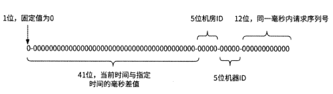
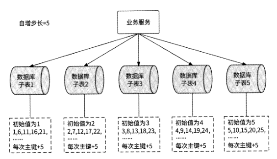

# 第 4 章 唯一ID生成器

## 4.1 分布式唯一 ID

在复杂的系统中，每个业务实体都需要使用ID做唯一标识，以方便进行数据操作。

### 4.1.1 全局唯一与UUID

在互联网还未普及的年代，由于用户量少、网络交互形式单调，互联网产品后台数据
库使用单体架构就可以满足日常服务的需求。当时每个业务实体都对应数据库中的一个数
据表，每条数据都简单地使用数据库的自增主键作为唯一 ID

近年来，随着互联网用户的爆发式增长，数据库从单体架构演进到分库分表的分布式
架构，同一个业务实体的数据被分散到多个数据库中。

由于数据表之间相互独立，在插入数据时会生成相同的自增主键，此时，如果还使用自增主键作为唯一 ID,就会导致大量数据的标识相同，造成严重事故。

RFC 4122 规范中定义了通用唯一识别码(Universally Unique Identifier, UUID ),它
是计算机体系中用于识别信息的一个128位标识符。UUID按照标准方法生成时，在实际
应用中具有唯一性，UUID重复的概率可以忽略不计。

UUID的标准格式由32个十六进制数字组成，并通过连字符“-”分隔成“8-4-4-4-12”
共 36 个字符的形式。
UUID字符串需要占用36字节的存储空间，如果每条数据都携带UUID,那么
在海量数据场景下存储空间消耗较大。此外，UUID是无数据规律的长字符串，如果将其
用作数据库主键，则会导致数据在磁盘中的位置频繁变动，严重影响数据库的写操作性能。

### 4.1.2 唯一 ID生成器的特点

真正可用于海量数据场景的唯一 ID生成器，除保证ID不可重复外，还应该具有如下特点

- 空间占用小：作为每条数据都携带的字段，唯一 ID不应该占用过多的存储空间
- 高并发与高可用性：唯一 ID生成器是大部分业务服务的重要依赖方，唯一 ID的生成操作需要做到高并发无压力，维持长期高可用性
- 唯一 ID可用作数据库主键：为了不对数据库的写操作造成负面影响，需要保证唯一 ID对数据库主键友好

占用8字节（64位）的long类型整数适合用作唯一 ID,因为：一是long类型虽然占
用的空间较小，但是可表示的ID范围却非常大；二是long类型整数很容易实现递增的效
果。至此，本章的议题已经明确：设计一个可以生成递增的long类型唯一 ID的生成器。

### 4.1.3 单调递增与趋势递增

虽然我们在4.1.2节中已经讨论了唯一 ID应该是递增的，但无奈受限于全局时钟、延
迟等分布式系统问题，单调递增的唯一 ID生成器的设计方案往往会有较大的局限性，与
此相比，趋势递增的唯一 ID生成器更受业界欢迎。接下来具体介绍这两种递增类型的唯
一 ID生成器设计方案的差别。

## 4.2 单调递增的唯一 ID

唯一 ID生成器本身也是一个服务，为了生成单调递增的唯一 ID,这个服务需要使用
某种存储系统记录可分配的唯一 ID。Redis和其他数据库都可以达到这个目的。

### 4.2.1 Redis INCRBY 命令

Redis提供的INCRBY命令可以为键(Key)的数字值加上指定的增量(increment)。
如果键不存在，则其数字值被初始化为0,然后执行增量操作。使用INCRBY命令限制的
值类型为64位有符号整数，此命令的特性与单调递增的唯一 ID的诉求非常契合。

### 4.2.2 基于数据库的自增主键

生成单调递增的唯一ID的另一种方式是基于数据库的自增主键

基于数据库的自增主键插入数据生成唯一 ID的性能不高，我们同样可以将其改进为
采用4.2.1节介绍的批量生成ID的方式。

### 4.2.3 高可用架构

如果批量生成唯一 ID的生成器服务有多个实例对外提供服务，则无
法生成单调递增的唯一ID。

## 4.3 趋势递增的唯一 ID：基于时间戳

时间戳是指计算机维护的从1970年1月1日开始到当前时间经过的秒数，并且随着
时间的流逝而逐步递增。

### 4.3.1 正确使用时间戳

时下最为普及的计算机普遍采用64位操作系统，对应的时间戳也是用64位表示的。
在4.1.2节中已经明确了唯一 ID也是64位的，这样不就意味着唯一 ID正好可以用时间戳
表示吗？这种做法是不可取的，原因很简单，在高并发场景下，同一时间有很多业务请求
到达唯一 ID生成器，如果用时间戳表示唯一 ID,就会生成重复的ID。

假设我们设计的唯一 ID生成器在2023年1月1日上线，那么根本不需要关心在上线时间之前时间
戳的数值。所以，我们可以将时间戳的起始时间改为上线时间，仅记录唯一 ID生成器从
上线时间到当前时间经过的秒数就行。对于毫秒精度也是同样的道理。

假设我们期望唯一 ID生成器可以正常提供服务50年（已经很久了），总计
1,576,800,000s,那么实际上使用31位整数即可表示时间戳。即使采用毫秒精度的时间戳，
41位整数也已经足够使用。所以，我们只记录唯一 ID生成器从上线时间到当前时间的相
对时间戳即可。

一个整数的大小优先由数字的高位决定。所以，时间戳应该被
设置到唯一 ID的高位，这样才能保证随着时间的推移唯一 ID趋势递增。

### 4.3.2 Snowflake算法的原理

Snowflake的中文意思是雪花，所以Snowflake算法也被称为雪花算法。它最早是
Twitter公司内部后台使用的分布式环境下的唯一 ID生成算法，2014年开源了 Scala语言
版本。

Snowflake算法的原理是将分布式环境下的各变量按数位组合成64位的long类型数
字生成唯一 ID。如图4.8所示，唯一 ID是由多个数位分段组成的，这些分段从高位到低
位依次如下。

最终效果是，Snowflake算法给出的唯一 ID生成器是一个支持多机房共1024个服务
实例规模、单个服务实例每秒可生成410万个long类型唯一 ID的分布式系统，且此系统
可以正常工作69年。

### 4.3.3 Snowflake算法的灵活应用

Snowflake算法是想告诉我们：需要将所考虑的高并发与分布式环境下的变量都体现
在唯一 ID上，不是必须使用41位表示毫秒级时间戳、5位表示机房、5位表示服务实例、
12位表示同一毫秒内的并发请求，而是应该按照实际的业务情况进行灵活调整。

### 4.3.4 分配服务实例ID

为了保证生成的ID的唯一性，应该为ID生成器服务的不同实例分配不同的服务实例 ID (worker ID)

4.2.2节介绍的数据库自增主键方案就是一种合适的选型。

当一个ID生成器服务实例启动时，将携带本地IP地址查询worker_id表，如果找到
对应的数据，则使用该数据行的主键作为其worker ID；否则，服务实例向worker_id表中
插入IP地址，并将插入数据后得到的主键作为worker ID。如果某服务实例获得的worker
ID数值超过所允许的范围，则启动失败。

分布式协调技术的相关开源项目如ZooKeeper或etcd,也可以实现服务实例ID分配
的功能，这里以etcd为例介绍实现方案。

etcd是一个高可用的键值存储系统，通常用于服务发现、分布式锁、Leader选举、消
息订阅和发布等场景中。etcd提供了 Revision机制：一个etcd集群有一个全局数据版本号Revision,当集群内任何数据发生变更(创建、删除、修改)时，Revision值都会加1。etcd
保证Revision全局单调递增，任何一次数据变更都对应唯一的Revision值。etcd中存储的
每个键值数据都会维护两个与Revision相关的版本。

- create revision:键值数据被首次创建时，记录此时的Revision值
- mod_revision：键值数据被修改时，记录此时的Revision值

使用etcd为服务实例分配worker ID的方案就依赖create revision字段：每个服务实
例都向etcd中写入一个代表自己的键值，然后与其他服务实例比较create_revision的大小。
如果有M个服务实例的create_revision小于此服务实例的create_revision,则说明在此服
务实例启动前已经有M个服务实例相继启动过,于是将此服务实例的worker ID设置为M。

### 4.3.5 时钟回拨问题与解决方案

时间戳的数据通过计算机的时钟获得，而计算机的时钟用专门的硬件来模拟：计算机
主板上有一个石英晶体振荡器和一个纽扣电池，其中石英晶体振荡器的频率为32,768Hzo
在通电状态下，石英晶体振荡器每振动32,768次，电路就会传出一次信息，表示Is到了，
计算机就是通过这种方式来记录时间的。不过，用石英晶体模拟时钟会有误差，在正常情
况下，每天的计时误差在土 Is内，而在极端条件下（如低温）误差会变大。这种现象被称
为“时钟漂移”。

由于时钟漂移的存在，一组工作的计算机之间可能会存在时间戳误差。1985年，David
L. Mills设计了网络时间协议（Network Time Protocol, NTP ）来同步计算机之间的时钟，
它可以将所有计算机之间的时钟误差调整到几毫秒以内，一个局域网内的计算机时钟误差
甚至可以在1ms内。NTP有效地解决了时钟漂移的问题。

但是NTP时钟同步又带来了另一个问题：时钟回拨。如果某计算机的时钟时间远快
于NTP标准时间，那么经过NTP时间校准后，此计算机的时钟时间需要回退到NTP标准
时间，即发生了时钟回拨，这个问题会导致基于Snowflake算法的唯一 ID生成器服务生
成重复的ID

当唯一 ID生成器服务的某个实例收到请求时，首先计算出此时的毫秒时间戳millis,
然后与上一次请求的毫秒时间戳svr.millisPassed进行比较，如果 millis小于
svr.millisPasseds,则说明发生了时钟回拨。当发生时钟回拨时，可以采取如下措施防止生成重复的ID

- 如果回拨的时间较短（如10ms）,则阻塞请求一段时间后再重新执行
- 如果回拨的时间较长，则阻塞请求不可取，此时服务实例可以直接拒绝请求

还有一种建议的做法是对唯一 ID生成器服务的全部实例直接关闭NTP时钟同
步功能，防止发生时钟回拨。关闭NTP时钟同步功能，虽然可能会导致一些服务实例发
生大幅度的时钟漂移，但是我们可以选择从服务集群中摘除这些服务实例。

## 4.4 趋势递增的唯一 ID：基于数据库的自增主键

基于数据库的自增主键也可以生成趋势递增的唯一 ID,且由于唯一 ID不与时间戳关
联，所以不会受到时钟回拨问题的影响。

### 4.4.1 分库分表架构

数据库一般都支持设置自增主键的初始值和自增步长，以MySQL为例，自增主键的
自增步长由auto_increment_increment变量表示，其默认值为1。MySQL可以使用SET命
令设置这个变量值，比如SET @@auto_increment_increment=3会将自增步长设置为3。

如图4-12所示，假设数据库被水平
拆分为5个子表：依次创建5个子表并分别设置自增主键的初始值为1~5,然后设置每个
子表的自增主键的自增步长也为5。最终，子表1生成的自增主键是1,6,11,16,21,…，
子表2生成的自增主键是2,7,12,17,22,…，其他子表以此类推。将基于这个思路实现的
分库分表架构应用到唯一 ID生成器服务，就会生成趋势递增的唯一 ID,有效地解决了数
据库单点问题，并在一定程度上提高了数据库并发吞吐量。

不过，分库分表架构将自增主键的自增步长与分表个数强行绑定，所以系统整体的可
扩展性较差，无法对数据库进行任何扩容操作。也就是说，这个方案只适合不需要扩容的
场景。
