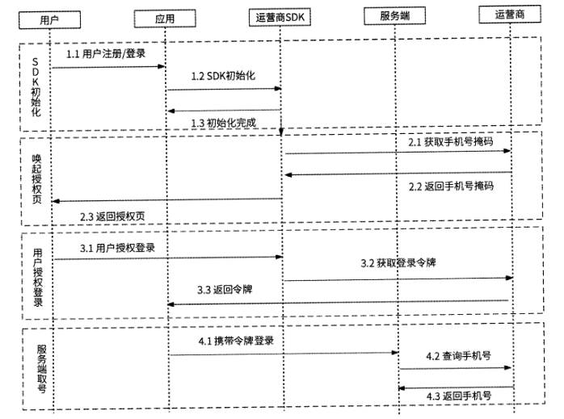
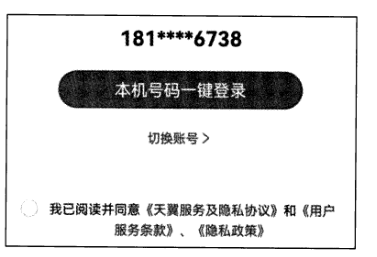
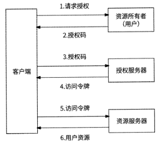
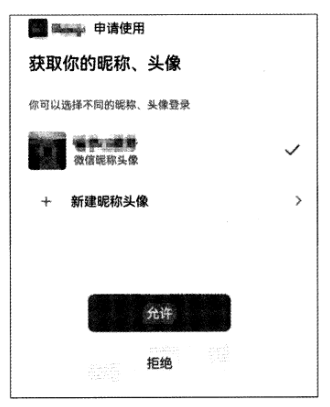
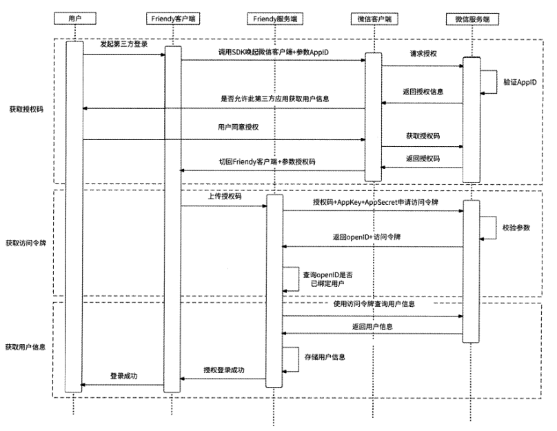
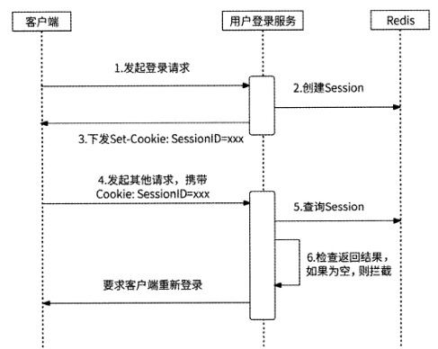
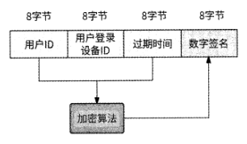
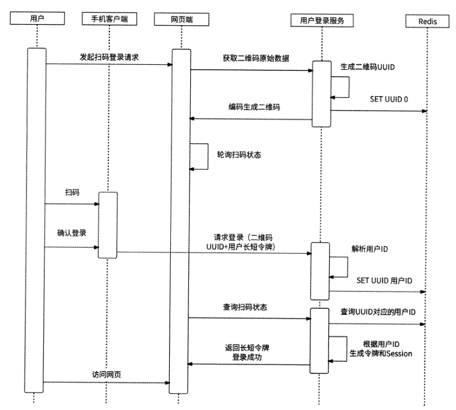

# 第 5 章 用户登录服务

## 5.1 用户账号

在早期互联网时代，大部分互联网产品是不需要用户注册与登录的。因为早期互联网
产品主要是信息发布与浏览的平台，比如门户网站、搜索引擎，当时的用户行为非常简单
（几乎就是浏览），不需要为用户提供个性化服务，所以不需要识别用户，更不需要用户注
册与登录。

用户账号是一种身份认证和授权机制，它对互联网产品具有如下意义。

- 身份认证
- 个性化服务
- 数据积累和分析
- 运营与推广

## 5.4 手机号登录和邮箱登录

### 5.4.4 手机号一键登录

当用户在移动端发起登录时，应用可以获取到此时移动端设备插入的SIM卡对应的手
机号，如果此号码与用户登录时填写的手机号相同，则说明此登录手机号就是用户正在使
用的号码。不过，出于安全的考虑，无论是Android、iOS还是其他移动端平台，均不允
许应用直接获取手机号。

幸运的是，目前主流的移动运营商都已经开放了相关能力，我们可以调用运营商提供
的接口判断用户输入的手机号是否与本机号码相同，这样用户就免去了接收验证码的步
骤。甚至更进一步，用户连登录手机号都不需要填写，这就是本节的主角：一键登录。

手机号一键登录的完整流程如下所述，如图5-3所示。

为了减少用户登录等待时间，通常第1步和第2步会在应用启动时就提前执行了，当
用户准备登录时可以直接进入授权页。其实授权页大家都非常熟悉，它一般如图5-4所示。

## 5.5 第三方登录

### 5.5.1 OAuth2 标准

目前市面上主流的第三方登录协议是OAuth 2,它是一个开放的授权标准，允许用户
授权乙方应用访问他们存储在第三方平台的信息，而不需要将第三方平台的用户名和密码
提供给乙方应用。微信、微博、QQ等提供第三方登录的开放平台都遵循。Auth 2标准。

乙方应用必须先得到用户的授权，才能访问用户在第三方平台的信息。°Auth2提供
了多种用户授权模式，这里需要重点介绍的是授权码模式，它是功能最为完整、流程最为
严格的授权模式。在此授权模式下，OAuth2标准定义了 4种角色。

- 资源所有者：代表希望第三方登录的终端用户
- 资源服务器：第三方登录服务提供商用于存放受保护的用户资源的服务器，访问这些用户资源需要获取访问令牌(Access Token )。典型的用户资源包括头像、昵称、联系人列表等。
- 授权服务器：负责验证资源所有者，下发访问令牌
- 客户端：乙方应用

使用授权码模式完成微信账号授权的流程如下所述，如图5-5所示。

### 5.5.2 客户端接入第三方登录

与手机号一键登录类似，比如我们的应用Friendy想接入微信第三方登录，首先要做
的事情就是去微信开放平台以开发者身份申请接入，这是几乎所有应用使用第三方服务所
必需的步骤。在微信开放平台填写应用相关信息并提交申请，微信相关工作人员审核通过
后，我们就可以获得AppID和AppSecret,这是应用Friendy可以调用微信第三方登录的
官方认证。接下来，我们就可以开始在客户端接入第三方登录流程了。

### 5.5.4 第三方登录的完整流程总结

## 5.6 登录态管理

客户端与服务端之间的通信是基于HTTP的，而HTTP是无状态的，即客户端每次发
出请求时都永远无法得知上一次请求的状态数据，任何请求之间都是相互隔离的。

### 5.6.1 存储型方案：Session

Session-般被称为会话，我们把客户端与服务端之间一系列的交互动作称为Sessiono
Session技术是HTTP状态保持的解决方案，它通过在服务端保存用户会话上下文信息，
使得无状态的HTTP请求之间可以共享信息。Session技术的典型应用场景就是登录态。

使用Session技术实现用户登录态时，需要考虑的主要问题有两个：一是Session如何
存储，二是用户请求如何查询到对应的Sessiono在解决这两个问题前，我们需要先介绍
一下SessionlDo SessionlD是一个Session的唯一标识，是对分布式唯一 ID的应用，并且
是在Session创建时生成的。

对于请求查询Session,服务端与客户端之间通过Cookie来传递SessionlD,用户登录
时服务端会创建Session,并将对应的SessionID通过Set-Cookie字段响应给客户端；客户
端收到响应数据后，之后的请求会在Cookie中携带服务端下发的SessionlD,服务端收到
请求后，根据Cookie中保存的SessionlD查询用户对应的Session数据。

Cookie是存储在客户端的，且用户可以对其随意修改。如果用户故意修改了 Cookie
中的SessionlD值，则接下来的用户请求会携带不属于自己的SessionlD访问数据，于是用
户登录服务将请求发起者识别为其他用户，导致其他用户数据被意外暴露，且数据有被恶
意篡改的风险。为了识别SessionlD是否被篡改，可以为SessionlD绑定一个数字签名。

Session方案的优势是简单清晰、易于实现，服务端可以完全决策用户是否登录，甚
至可以主动踢用户下线，统计某时刻登录人数；但是该方案要求Session数据使用Redis
存储，即Redis是该方案的强依赖，只要Redis响应变慢或者发生网络抖动，就会导致出
现用户登录判断不可用的情况。另外，几乎所有的用户请求都要从Redis中查询Session,
对于拥有海量用户的应用来说，查询Redis的请求量会极其庞大，虽然硬件资源足够支撑
这么大的请求量，但是会非常浪费存储资源。

### 5.6.2 计算型方案：令牌

在互联网后台服务架构设计中，会将业务场景划分为两种主要类型

I/O密集型：是指需要大量输入/输出操作的场景，例如读/写文件、网络通信、数
据库操作等。这类场景的特点是需要等待I/O操作完成后才能继续执行，因此CPU
的利用率比较低，且比较依赖存储系统

计算密集型：是指需要大量计算操作的场景，例如图像处理、视频编码、科学计
算等。这类场景的特点是需要大量的CPU计算资源，而不需要存储系统

Session技术就是将用户登录态设计为一种I/O密集型业务，所以Redis成为这类场景
的核心依赖。而如果通过某种技术方案把用户登录态设计为计算密集型业务，那么就可以
完全不依赖存储系统，进而大幅度提高用户登录态判断的可用性与性能，同时可以大量节
约存储资源，这就是令牌方案。

令牌是用户登录的凭证，用户在完成登录后，服务端会基于用户身份信息加密生成一
个安全令牌返回给客户端，客户端的后续用户请求在请求头中携带此令牌给服务端，服务
端通过验证令牌的合法性来验证用户是否已登录，对合法的令牌解密后，即可获取到用户
信息。

令牌方案不依赖任何存储系统，服务端通过本地计算就可以判断用户是否已登录，以
及识别用户ID,所以它的性能很好，延时开销极低。不过，由于用户状态完全由分散的
令牌管理，服务端很难管理登录用户，比如无法主动踢用户下线，无法统计某时刻处于登
录状态的用户信息。

### 5.6.3 长短令牌方案

考虑到Session方案和令牌方案各自的优劣，我们可以将这两种方案结合起来：用户
登录依然在Redis中创建Session,也依然生成令牌，只不过Session被设置了较长的过期
时间，而令牌被设置了较短的过期时间，然后服务端把SessionlD和令牌都下发到客户端；
客户端发起后续用户请求时会携带这两个信息，服务端优先认证令牌，如果发现令牌过期，
那么再使用SessionlD从Redis中查询用户Session。

在这种结合方案中，令牌相当于Session数据的“缓存”，既保持了令牌方案的高性能优势，又兼顾了 Session方案的服务端对用户
登录可控的能力。此方案名为“长短令牌方案”，其短令牌指的是5.6.2节介绍的令牌，而
长令牌就是SessionlD

- 长令牌：long_token=SessioriID+数字签名。
- 短令牌：short_token=用户ID+用户登录设备ID+过期时间+数字签名。

当服务端需要强制某用户下线时，直接删除用户Session数据即可一当用户请求中
携带的短令牌过期时，由于查询不到Session数据，因此可以产生用户下线的效果。短令
牌的过期时间影响强制用户下线的生效时间，短令牌的过期时间越短，强制用户下线越及
时。但是短令牌还承担了 Session数据缓存的角色，如果其过期时间太短，那么用户登录
服务和Redis的访问压力就会增加，所以短令牌的过期时间需要根据业务的实际情况和资
源压力综合权衡。

## 5.7 扫码登录

### 5.7.1 二维码

二维码是一种可以存储大量信息的矩阵条形码，最早是在1994年由一家日本公司发
明的。随着移动互联网的发展，二维码得到了非常广泛的发展和应用。

### 5.7.3 扫码登录的技术实现

