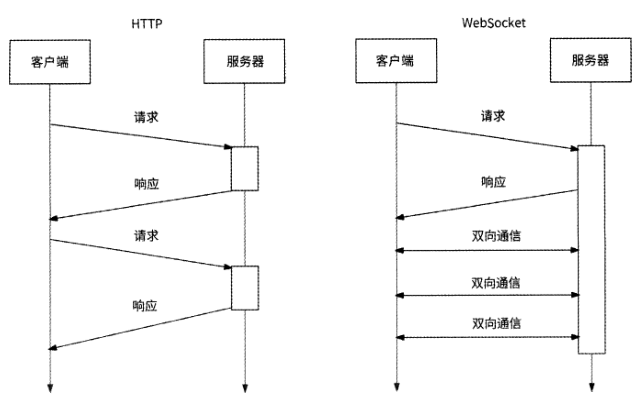
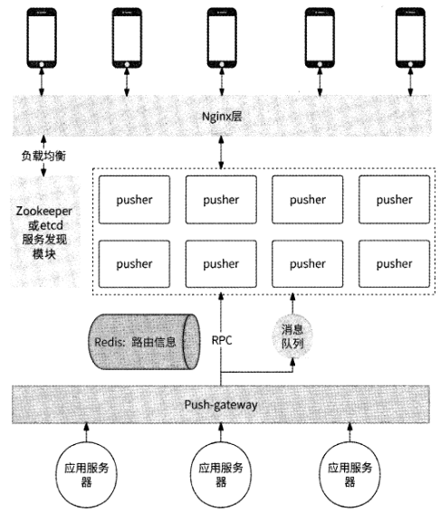
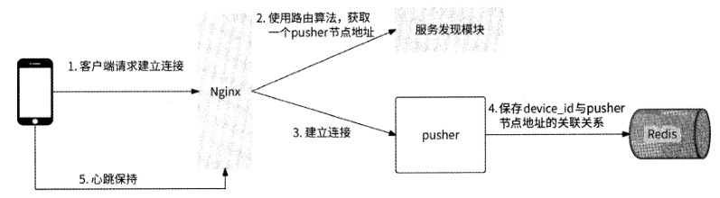
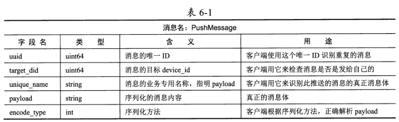
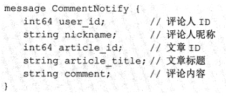
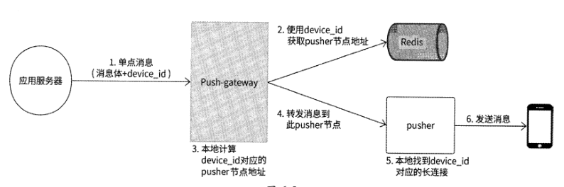
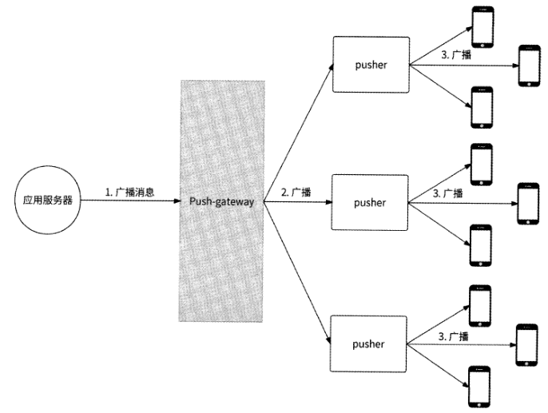
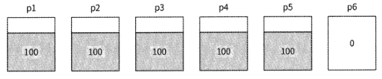
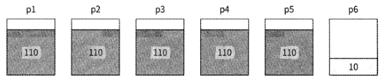

# 第 6 章 海量推送系统

“推送”指的是把消息主动地实时推到客户端的行为。在互联网早期发展阶段，推送
更多地属于即时通信（IM） 领域范畴，但是随着移动互联网的普及，大量用户会维持很长
时间的在线状态，于是对消息的实时触达能力有了广泛的需求。

不仅仅在即时通信领域，
几乎所有当代的互联网应用都对推送有大量的场景需求。例如，社交互动类应用会实时通
知与你相关的新互动（关注/私聊/回复/点赞）、你关注的人发布了新内容、在直播间内谁
给主播赠送了礼物；电商类应用会告诉你所收藏的商品刚刚降价了、你的订单已完成退款、
你的物流已到达目的地、你观看的带货直播间有新商品“上车”；新闻类应用会推送你感
兴趣的新闻和实时热点新闻；更为普遍的是，大量应用都有系统版本升级主动提醒、重要
全服公告能力等。

## 6.1 分布式长连接服务的技术要素分析

客户端与服务器的交互都是客户端主动发起请求，服务器进行应答的方式。
而消息推送场景则不一样，服务器需要主动向客户端发起请求，那么推送系统必然需要客
户端与服务器保持长连接，即推送系统需要构建长连接服务。

### 6.1.1 WebSocket 协议简介

客户端一般通过HTTP与远程服务器进行网络通信。HTTP采用了请求/响应模型，它
是一种无状态、无连接、单向的应用层协议。网络请求只能由客户端主动发起，服务器被
动接收请求进行应答，原生HTTP无法实现服务器主动向客户端发送数据。

采用请求/响应模型注定：如果服务器有信息变更想告知客户端，则交互会变得非常
麻烦。比如客户端每隔几秒就要对服务器进行一次请求轮询，检查是否有新消息待接收。
这种方式看起来简单粗暴，但是在使用轮询时需要格外谨慎，因为轮询本身效率低下，实
时性不佳，不仅浪费了大量网络带宽，而且会让服务器增加无谓的访问压力。

HTML 5定义了一种全新的通信协议:WebSocket,并于2011年被IETF
定义为标准RFC 6455。WebSocket是一种基于TCP的全双工通信协议，允许在客户端与
服务器之间建立全双工通信连接，这样客户端和服务器都可以主动将数据推送到另一端。

由于WebSocket协议很适合消息推送场景，所以我们可以在客户端开发一个基于
WebSocket协议的长连接通信SDK,客户端通过调用这个SDK来创建专门用于接收服务
器推送消息的通道。对于各种推送类型的业务场景，客户端都从这个专用通道接收推送的
消息。

### 6.1.2 长连接服务器

客户端通过WebSocket协议与服务器建立长连接，从服务器的视角来说，其本身应该
是一台可支持高并发、对长连接进行维护和管理的服务器。

常见的高并发服务器模型：

accept+fork多进程模型：当一个客户端连接到来时，分配一个子进程负责处理这
个连接的读/写请求，即一个连接对应一个进程。这种模型虽然简单、直观，但是
缺点明显，大量连接会生成等量的进程，服务器资源消耗较大。

accept+thread多线程模型：它是对多进程模型的优化。当一个客户端连接到来时，
分配一个线程负责处理这个连接的读/写请求，即一个连接对应一个线程。虽然线
程相比进程节约了一些资源，但是治标不治本，当连接量太大时，依然会有较大
的服务器资源消耗。早期Tomcat曾使用过这种设计。

单线程多路复用模型：在单线程中使用epoll对所有的连接进行监听管理，当没有
事件到来时，线程被epoll_wait阻塞；而当有连接读/写事件到来时，线程从阻塞
中返回并回调handlero这种方式也被称为Reactor模式，其很适合有大量连接的
I/O密集型场景。由于只能使用单核CPU,如果handler耗时过长，则会影响服务器整体响应时间。此模型的典型代表是Redis

多进程多路复用模型：它是对单进程多路复用模型的优化。其充分利用了多核能
力，且对handler的耗时有一定的容忍性。此模型的典型代表是Nginxo

多线程多路复用模型：与多进程多路复用模型类似，只不过它用多线程代替了多
进程。此模型的典型代表是缓存服务器Memcached

推送服务器的主要职责是与客户端建立长连接，并将上游消息转发到客户端，是一台
相对纯粹的消息转发服务器，属于典型的I/O密集型应用。所以，根据对上述常见的高并
发服务器模型的简单分析，只要是多路复用类型的模型，就是比较合适的选型。使用单线
程多路复用模型，无须考虑并发安全，开发较为简单，但是仅局限于单核CPU；而使用多
进程/多线程多路复用模型，可以充分利用多核CPU,不过出于并发安全的考虑，有一定
的开发成本。由于推送服务器的逻辑较为轻量级，这些服务器模型均可以较为优秀地支持
数十万个长连接并发访问。

### 6.1.3 分布式推送服务器

单体服务器天然不具备高可用性和可扩展性，所以势必需要将若干pusher节点组成一个分布式pusher集群对外提供服务。

将若干pusher节点组成一个分布式pusher集群，我们需要考虑如下主要问题。

问题1:集群中有哪些pusher节点，以及每个pusher节点的地址信息、每个pusher
节点的活跃状态等，在哪里维护？

问题2：当一个客户端设备连接到来时，我们选择哪一个pusher节点与其建立连
接？

问题3：当一条消息需要被推送给某个或某些设备时，我们如何找到这个或这些设
备对应的长连接，它们在哪个或哪些pusher节点上？

问题4：当pusher集群需要扩容时，对存留的长连接如何处理？是否需要或者说
是否能做到连接迁移？

问题1很好回答，无非就是服务发现问题。我们可以使用ZooKeeper或etcd等分布式
一致性中间件来维护pusher节点列表：每当集群中新增pusher节点时，就向ZooKeeper
进行地址注册，同时针对pusher节点的日常运行也向ZooKeeper ±报心跳信息。

问题2和问题3的本质其实是一样的，即我们需要提供一套什么样的设备连接与
pusher节点的关联规则。利用这套关联规则，我们可以为设备连接选择具体的pusher节点，
并可以知道哪些设备与哪些pusher节点连接。设备连接与pusher节点的关联规则，其实
就是路由问题，更通俗的叫法是负载均衡。

对于问题4,不同于分布式存储系统扩容时的数据迁移，推送系统的长连接本身不是
实体数据，无法做到跨机器迁移，只能断开与旧服务器的连接，再连接新服务器。为了不
让用户感知到重连，客户端应充分权衡影响面后再做决定。

### 6.1.4 路由算法

推送系统有两处需要利用路由算法

- 用户设备发起连接请求，pusher集群需要通过路由算法，选择一个合适的pusher节点与这个用户设备建立连接
- 当向某个device id进行消息推送时，pusher集群需要通过路由算法，找到这个device id与哪个pusher节点建立了长连接

对路由算法的选型，要尽量保证各个用户设备的连接可以被均匀地分配到集群中的每
个pusher节点上，不能出现有的pusher节点连接过多且趋于饱和，而有的pusher节点长
期空闲的情况。

常见的路由算法如Random （随机调度）算法、Round-Robin （轮询调度）算法、一致
性Hash算法，都可以较好地保证连接均匀地分布在pusher集群的每个节点上。不过，不
同的算法在推送消息时获取device id与pusher节点地址的关联关系的方式有较大差异。

## 6.2 海量推送系统设计

### 6.2.1 整体架构设计

Nginx作为客户端设备与推送系统交互的代理,负责客户端建立连接的负载均衡与
消息的最终下发；

每个pusher节点都负责与不同的客户端建立长连接，是消息的核心推送者；

ZooKeeper/etcd负责Nginx请求pusher集群时的服务发现，为Nginx转发连接请
求时给出当前可用的pusher节点列表，进而帮助客户端连接到合适的pusher节点；

Redis集群负责保存用户设备与pusher节点的关联关系（如果采用Round-Robin
等无数据规则的路由算法）；

Push-gateway作为下行消息到pusher集群的代理网关，负责后端应用服务与推送
系统之间的交互，包括按照单点消息、多点消息以及全局消息的方式进行消息的
路由转发，是后端应用服务与推送系统之间的唯一代理;

消息队列负责消息的异步发送。

### 6.2.2 长连接的建立过程

在客户端与推送系统之间建立长连接的过程如下所述

当客户端进行登录/启动时，客户端长连接通信SDK使用WebSocket与后端尝试
建立连接，在建立连接时可以携带若干客户端基本信息，如用户ID、设备device_id,设
备版本号等。

Nginx收到客户端的建立连接请求，使用所设定的路由算法，选择一个pusher节
点与其建立长连接。

如果推送系统采用了 Round-Robin等无数据规则的路由算法，则需要同时将
device id与pusher节点地址的关联关系以Key-Value的形式保存到Redis集群中。

pusher节点与客户端建立长连接后，将device_id与连接Socket文件描述符fd的
关联关系保存到本地内存中。

客户端周期性地与pusher节点在长连接上确认心跳，如果pusher节点在所设定
的时间内没有收到心跳，则认为客户端长连接已断开，关闭其连接。

### 6.2.3 消息格式设计

pusher节点发送到客户端的消息格式设计如表6-1所示

假设某个用户对你的文章发
表了评论，产品经理希望系统可以在客户端的屏幕顶部弹出通知告诉你：“A对你的文章B
发表了评论：xxx”，那么负责文章评论模块的服务端开发人员和客户端人员共同约定
了如下通知格式

在服务端，会使用protobuf将这个通知序列化保存到推送系统的消息结构PushMessage
的payload字段，可以将unique_name字段设置为CommentNotify,将encode_type字段设
置为 PROTO_BUF

当客户端收到这条推送的消息时，首先根据unique name识别出这是评论通知，准备
好CommentNotify结构处理解析结果；然后根据encode_type得知消息体是protobuf格式
的，于是使用protobuf格式将payload内容解析到CommentNotify结构；最后客户端完整
地获取到服务端下发的通知。

### 6.2.5 单点消息推送的细节

将一条单点消息从服务端推送到客户端的完整过程如下所述

### 6.2.6 全局消息推送的细节

对于要发送给全部在线用户的推送的消息，我们可以让Push-gateway将推送的消息广
播到所有pusher节点，由每个pusher节点将消息数据写入本地每个连接中。

这里涉及两个“写放大”

1. Push-gateway需要轮询所有M个pusher节点并进行消息的转发，写放大M倍;
2. 假设一个pusher节点本地维护N个长连接，当它收到一条全局的推送的消息时，需要把消息发送到所有长连接的发送缓冲区，网络带宽会瞬间增大，写放大N倍。

通常而言，一个被部署在商业级服务器上的长连接推送服务节点经过高性能设计，可
以同时承载十多万个乃至数十万个长连接。也就是说，仅1000个pusher节点就可以管理
承载上亿个在线用户的长连接。

如果有条件，部署pusher节点的服务器性能较高、网卡读/写快，那么由于pusher节
点的单机长连接数量可以很大，pusher节点不会很多，所以MxN倍的写放大压力很容易
被接受。

但是如果条件有限，网卡的性能一般，甚至云服务器的性能较差，该怎么办？

全局消息一般是系统推送的消息，这种消息对
于同时到达全部用户的诉求不高，所以可以让一部分用户先收到消息，另一部分用户稍后
收到消息。于是，我们可以尝试依次分批发送的思路。

### 6.2.7 多点消息推送的细节

为了支持多点消息推送，一条推送的消息的目标可以是多个device_ido推送系统在接
收到多点消息后，需要找到每个目标device_id对应的pusher节点地址，然后向这些pusher
节点转发消息。这里的重点是如何高效地找到所有device_id对应的pusher节点列表。

如果pusher节点与客户端建立连接时使用的是如一致性Hash等有数据规则的路由算
法，则Push-gateway在处理多点消息时，无论有多少个目标device_id,都可以在本地内
存中很快计算出相关的pusher节点地址，然后进行消息的转发。

而如果pusher节点与客户端建立连接时使用的是如Round-Robin等无数据规则的路由
算法，此时device_id与pusher节点地址的对应关系被存放在Redis中，那么Redis的MGET
命令可以支持我们一次性获取所有device id对应的pusher节点地址。

Redis MGET是一个危险的命令。如果目标device id较少，比如少于50个，
那么使用MGET没有太大问题；但是当目标device_id较多时，MGET会为Redis存储系
统带来较大的风险：

- 一次性获取过多的Key, Redis服务器需要较大的内存来存放响应数据，有较大的内存溢出风险；
- 如今大部分互联网公司的Redis架构都是类似于Codis的方式，由Proxy对Redis进行集群分片管理。为了满足MGET的需要，Proxy不得不启动多个线程向各个相关的Redis分片分发MGET请求。一次性获取过多的Key,可能造成Proxy启动大量线程，占用较多的系统资源，最终影响Redis存储服务的质量。

所以说，如果多点消息涉及的目标device_id较多，则不宜直接从Redis中获取pusher
节点地址。让我们换一个思路：既然目标device_id较多，那么涉及的pusher节点大概率
也较多，我们不如像全局消息那样将多点消息直接广播到各个pusher节点。如果pusher
节点有相关的device_id长连接，则进行消息的推送，否则丢弃消息即可。

总的来说，多点消息的处理逻辑取决于长连接的路由算法。

1. Hash类路由算法：无论目标device_id有多少，Push-gateway都可以直接计算出pusher节点地址，然后进行消息的转发。
2. Round-Robin 类路由算法:进一步检查目标device_id 的数量是否达到阈值
	- 如果未达到值，则 Push-gateway通过 Redis MGET获取相关的 pusher 节点地址列表，然后进行消息的转发。
	- 如果超过阈值，则Push-gateway向全部pusher节点广播此消息，由pusher节点自己判断是推送消息还是丢弃消息。

### 6.2.8 pusher平滑升级的问题

pusher服务器本身也是一个服务，也有系统开发、迭代升级或Bug修复，这就避免不
了让原pusher进程退出和启动新的pusher进程。但是由于pusher服务器是一台长连接服
务器,pusher进程退出会导致所有长连接被关闭。

假设一个pusher节点保持了 10万个客
户端连接，在对pusher节点进行服务更新时，这10万个长连接就都断掉了，此时对应的
5万个客户端设备感知到长连接被重置，于是几乎在同一时间开始重新建立连接，推送系
统会收到10万QPS的瞬时激增流量。

瞬时激增的10万个连接请求可能会直接击垮推送系统，导致整个系统无法创建长连
接，这是一个极大的风险。针对这种情况，我们可以为建立连接的入□ Nginx增加限流来
保护推送系统。那么，我们是否有更好的方式，比如提供一种更加优雅的Pusher节点升级
方式，使得已建立的长连接得到保持？

其实，这是一个老生常谈的话题，它有成熟的解决方案：长连接服务平滑重启，业界
高性能服务器如Nginx、Service Mesh的MOSN Sidecar都有平滑升级功能。根据笔者的研
究，这些支持平滑升级的TCP服务器普遍采用了如下关键技术。

- 信号技术：使用自定义信号如SIGUSR2作为进程升级事件，而非直接杀死进程。
- fork+exec技术：父进程调用fork()创建子进程，子进程调用exec()载入最新程序二进制文件，原父进程的文件打开信息会被自动继承下来。
- UnixSocket协议：支持在进程间传输文件描述符

平滑升级的原理可以被描述为：原服务进程以收到的SIGUSR2信号作为进程升级事
件并监听此信号；当系统发起升级操作时，系统向父进程发送SIGUSR2信号。父进程收
到此信号，开始调用fork()创建子进程，子进程调用exec()载入最新程序一进制文件。而
后父进程将本进程内全部连接的Socket文件描述符都通过UnixSocket协议调用sendmsg()
发送到子进程，同时停止本进程内一切最新数据的处理操作；子进程收到Socket文件描述
符并接管此Socket后续数据的读/写处理，并通知父进程终止。

### 6.2.9 pusher扩容的问题

pusher服务不仅与正常的业务服务一样涉及服务升级，而且为了应对请求量的逐渐增
长，同样会有服务扩容的需求，以避免服务性能下滑。但是，由于长连接服务是一个典型
的有状态服务，且长连接不是实体数据，无法直接迁移，所以其扩容行为会有各种各样的
问题需要解决。

如果我们采用的路由算法是Random算法、Round-Robin算法等，那么在将一
个新的pusher节点加入集群后，这个pusher节点并不能很有效地分担在工作的pusher节
点的连接压力。

假设有5个pusher节点pl〜p5,每个节点都承载了 100个长连接，现在系统压力很
大，于是我们对推送系统进行扩容，新增pusher节点p6o此时这6个pusher节点的长连
接数量分别为100、100、100、100、100、0,如图6-7所示。

接下来有60个新客户端连接到来，pusher节点的长连接数量分别为110、110、110、
110、110、10,如图6-8所示。

我们可以发现，虽然已建立的连接可以继续保持，但是原来的5个pusher节点的压力
还在以近似于扩容前的速率逐渐增长。这个例子说明在集群扩容时，Round-Robin算法并
不能满足我们想要尽快均摊新连接的要求。

解决方法很简单，我们可以采用加权式Round-Robin算法：为每个pusher节点都引入
权重，权重高的pusher节点优先对外建立连接。同时，对于新加入的pusher节点，在其
开始工作的最初一段时间内为其设置较高的权重，当新的pusher节点达到与其他pusher
节点相似的容量时，再将其权重下调到平均水平。这样一来，新的pusher节点在加入集群
后，就能快速分担接下来的新连接压力，并能较快地与集群中的其他节点在长连接数量上
持平。

而如果采用一致性Hash算法，则会遇到另一个问题：连接失效。当将新的pusher节
点加入一致性哈希环中时，会使得环上相邻pusher节点的大量（约一半）长连接重新指向
新的pusher节点，这些连接在原pusher节点上会全部失效，需要全部断开重新连接。

通过6.2.8节的介绍，我们知道此时会有大量的客户端同时重新连接。为了防止出现这种情
况，我们可以使用限流的方式来保护推送系统。另一种可行的做法是当新的pusher节点加
入时，相邻pusher节点的受影响的长连接并不全部同时断开重新连接，而是逐步断开重新
连接，拉长重新连接的时间线，减少瞬时请求量。
