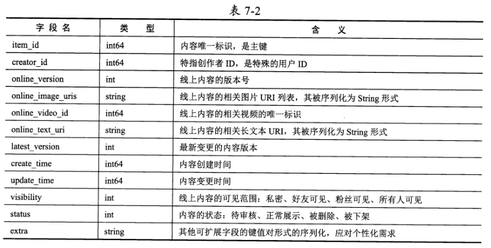
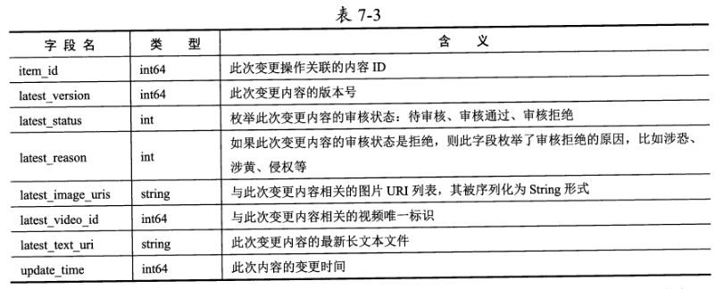
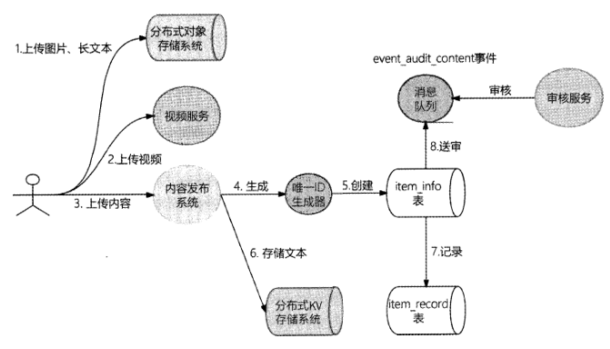
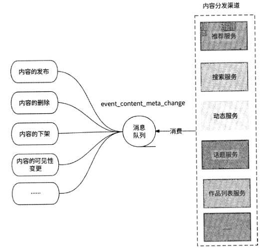
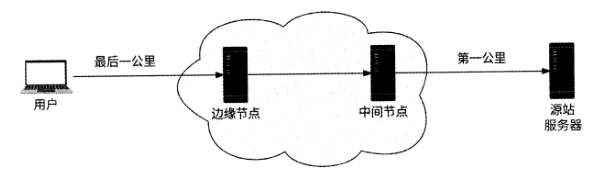
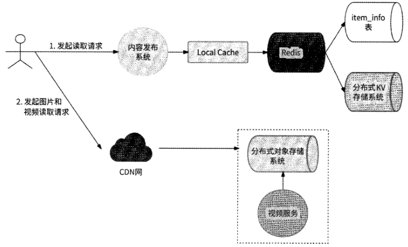
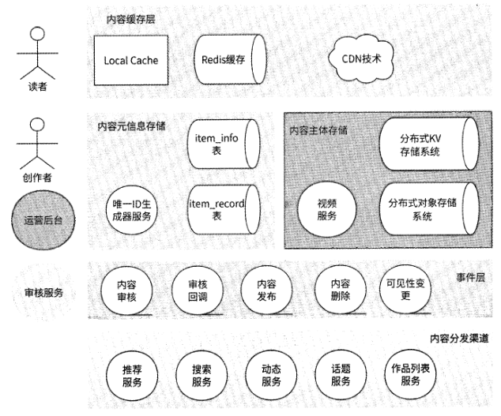

# 第 7 章 内容发布系统

## 7.1 内容发布系统的设计背景

以用户活跃度为出发点的互联网产品都有一个共性：任何用户都可以自由地以各种形
式创作一段内容来表达自己的观点，并将该内容曝光到各种频道，与其他用户进行内容互
动和讨论。

内容是创作者与其好友及陌生人进行社交互动的主要媒介，可以帮助优秀的内容创作
者成为有大量粉丝关注的内容达人。

内容发布系统旨在管理从用户发布内容到内容为大众所见的全生命周期流程，包括新
建内容、修改内容、内容审核、内容分发、内容下架等。可以说，内容发布系统是面向用
户的应用的核心功能性系统之一。

## 7.2 内容存储设计

### 7.2.1 内容数据的存储

内容的表现形式可能是短文字、长文字、图片、音频、视频等，也可能是这些表现形式的组合，我们应该怎样合理地存储内容？

以MySQL
的InnoDB存储引擎为例，InnoDB存储引擎的数据表是基于磁盘式B+树来实现的，在正
常情况下，数据表的一行数据会被存储到B+树的叶节点；而如果某列文本类型的数据过
长，则会占用较大的存储空间，进而严重影响B+树的查询效率。

于是，InnoDB存储引擎
选择将长文本数据单独存储到计算机磁盘的另一个区域，而非真正插入数据表B+树的磁
盘区域，在数据表中仅保留对该磁盘区域的引用，以便在读取数据时根据引用找到数据真
正的磁盘存储区域。

这样一来，每当读取一行完整的数据时，必然至少涉及B+树的磁盘
I/O和另一个文本数据的磁盘I/O,这将导致MySQL读取数据的效率明显下降，且不符合
关系型数据库的真正用途。

### 7.2.2 内容元信息的存储

内容元信息相对格式化，很适合被存储到关系型数据库中进行维护；而内容主体数据
可能是文本、图片、音频、视频等各种形式或者它们的组合，这时使用关系型数据库就显
得非常低效了，我们只能借助具有不同存储优势、不同存储原理模型的存储系统来存储这
些数据

对内容元信息进行存储需要如下两张数据表相互配合

- 信息表item info:存储真正决定对外发布的内容元信息，包括创作者ID、内容主体的存储地址、版本控制和审核管理
- 内容修改历史记录表item record：用于应对内容的修改操作，每次修改后的内容数据都先被暂存到这里，以便提供内容修改历史记录的查询途径。更重要的是，等待此内容修改被审核通过后再将其回写到信息表

为什么对内容元信息使用了两张数据表？这是因为每次变更内容后，都不一定能立刻
将内容发布上线。item_info表的主要作用是存储此内容的基本信息，直接对接每个用户读
取的内容元信息；而item_record表的主要作用是存储内容变更记录，待内容审核通过后
再将变更记录替换到item_info表中，相当于暂存待生效的内容元信息。

### 7.2.3 内容主体的存储选型

各种常见的非关系型数据库的特点如下：

- 内存型KV数据库：典型的代表是Rediso由于内存资源较为珍贵，所以它仅适合用来存储较短的文本，且考虑到内存数据的易失性，数据的可持久化表现一般
- 分布式KV存储系统：比如基于RocksDB存储引擎的上层应用存储系统Cassandra，TiDB等，有较好的可扩展性和数据可持久性，且由于依赖较为廉价的磁盘资源，所以它很适合用来存储各种短文本数据
- 分布式文件存储系统：比如Google的GFS、开源项目HDFS等，可被视为操作系统内文件系统的分布式上层应用，以文件目录结构形式管理文件数据，天然支持文件存储。
- 分布式文档数据库：文档数据库指可以存放XML、JSON、BSON类数据段的数据库，典型的代表是MongoDB0 MongoDB以文档形式存储XML、JSON、BSON数据，文档相当于数据表中的一行数据，而文档的集合(Collection )相当于数据表。MongoDB底层基于分布式文件系统管理文档，提供了较为易用的类SQL查询功能。
- 分布式对象存储系统：比如Amazon公司的S3、开源项目Swift等。根据笔者的理解，分布式对象存储其实更像对分布式文件系统的优化，不再以目录形式访问文件，而是以更高效的Key-Value形式访问文件，天然支持文件存储。

### 7.2.4 音视频转码

- 提高设备播放兼容性
- 提供多种画质
- 版权保护与内容分析

## 7.4 内容的全生命周期管理设计

## 7.5 内容分发设计

### 7.5.1 内容分发渠道

根据刷社交软件的经验，我们知道一个用户的作品可以通过多种渠道呈现给其他用
户。比如推荐Feed流可以把我们可能感兴趣的内容推送给我们，Timeline Feed （或称为关
注人动态）可以让我们刷到所关注的人最近发布的内容，我们还可以主动按照自己的兴趣
去搜索与某关键词相关的作品，去某热门话题下查看相关的用户讨论，去我们喜爱的创作
者主页查看最新作品 这些能看到内容的场景就是内容分发渠道。

### 7.5.3 将内容投递到分发渠道

## 7.6 内容展示设计

### 7.6.1 内容数据的特点

内容生产是一个天然的读多写少且读远多于写的场景，创作者修改内容的请求量极
少，用户读取内容的可能性极大。

对于一般的互联网应用的内容，由于用户创建和修改内容有一定的操作成本，所以注
定了内容的创建和修改场景的请求量级不会太高。它的QPS 一般是百级别的，如果QPS
上千，那么几乎可以称得上国民级应用了。

### 7.6.2 使用CDN加速静态资源访问

对于静态数据，比如长文本、图片、视频，非常适合采用CDN （ Content Delivery
Network,内容分发网络）技术来应对其高并发的读请求。

简单来说，CDN就是把静态资源缓存到位于多个地理位置的边缘服务器上，当用户
请求静态资源时，把用户的请求转发到附近的边缘服务器上实现就近访问。CDN技术一
方面能很好地解决数据就近访问问题，另一方面能很好地缓存静态资源。

当某个静态资源被首次访问时，由于CDN边缘节点并未对它进行缓存，所以此时CDN
中间节点会向源站服务器回源：获取静态资源，并将其缓存到边缘节点。在此之后，任何
用户请求同样的静态资源时，都会在CDN边缘节点发现数据并响应，用户请求不再对源
站服务器进行访问，这极大地缓解了源站服务器的带宽压力，且大大提高了静态资源在用
户侧的加载速度。

### 7.6.3 使用缓存和多副本支撑高并发读取

内容元信息属于非静态数据，发布者和产品后台可能都会对内容元信息进行修改，并
要求近实时生效。比如发布者因“手滑”发布了一条本不想对外展示的内容，于是］艮急迫
地删除内容，希望这条内容立刻消失。又比如产品后台希望对某条不健康的内容进行封杀，
为了尽快止损与消除舆论风波，相关处理人员要求实时删除内容。

内容元信息被存储在关系型数据库中，为了应对高并发的读取请求，可以使用Redis
对元信息数据进行中心化缓存，防止读请求直接访问数据库。

将Local Cache和Redis作为多级缓存策略，将Redis主从架构作为多副本策略，两者
相互配合可以兜住大多数情况下的高并发读请求。

### 7.6.4 内容展示流程设计

7.6.2节和7.6.3节分别告诉我们：内容元信息通过Local Cache和Redis缓存；内容图
片或视频通过CDN缓存。当向用户展示一条内容时，将优先读取这些数据缓存。

## 7.7 完整架构总览

