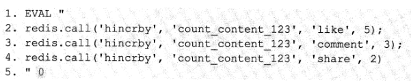
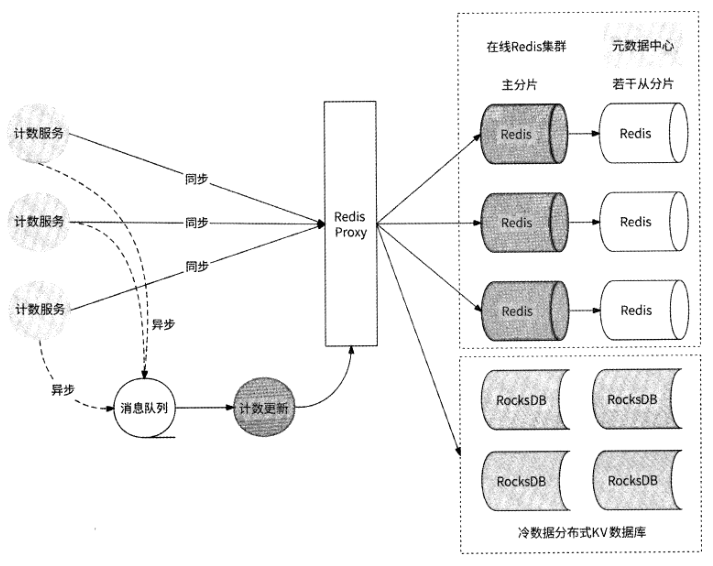

# 第 8 章 通用计数系统

## 8.1 计数的常见用途

具有累计性质的计数数据广泛存在于各种用户应用中

1. 用户发布的每个作品，有点赞数、分享数、评论数、转发数、收藏数
2. 用户主页，有关注数、粉丝数、作品数、热度等
3. 评论列表中的每条评论，有点赞数、点踩数

## 8.2 如何存储计数数据

### 8.2.1 计数数据的特点

读请求量巨大：无论是作品维度的计数，还是用户维度的计数，都有较大的访问
量，所以计数的展示需要支持高并发读取。

写请求量巨大：对于点赞、点踩、评论、转发、收藏等这些场景，由于用户触发
动作的成本很低，计数会以较高的并发量增加，所以计数的增加需要支持高并发
写入。

非产品的绝对强依赖：与用户钱包账户余额数据不同，具有累计性质的计数数据
是否能正常展示通常不会影响用户使用产品的功能。在极端情况下，如发生网络
抖动、服务Bug、请求击垮机房、机房故障等，计数作为一种纯粹的加成效果，
在无法展示时不会过于影响用户的心情。

对数据的精确性要求与数值的增加成反比：例如，当点赞数少于一定的数量时，
用户会非常在意点赞数量并查看有哪些人为他点赞了 ；但是当点赞数已经达到千
或万级别时，用户对点赞总数的关注会变得更加粗糙，不会再关注点赞数个位数
的增加情况，而是更关注点赞数的级别跃迁

### 8.2.2 关系型数据库的困境

MylSAM引擎把一个表的总行数存储在磁盘上，因此在执行count⑴时会直接返回这
个数，效率很高。

而InnoDB引擎在执行count(l)时，需要把数据一行行地从引擎中读出来，然后进行
累计计数。

### 8.2.3 是否要使用关系型数据库

通常来说，如果关系型数据库无法应对写压力，则可以使用异步方式对数据进行更新:
先更新缓存数据，再使用消息队列异步通知关系型数据库进行数据更新；而如果关系型数
据库无法应对读压力，则可以使用缓存对外提供服务。

计数的读/写请求量巨
大，几乎任何时间都在与缓存系统直接交互，在缓存系统的下一层再维护一份关系型数据
库有点儿多此一举；而且，计数数据一般不是绝对不可丢失的数据，它可以由数据记录流
水总数反向推出。以笔者的观点，对于计数数据，我们干脆将内存型数据库如Redis直接
作为数据存储系统，不再使用关系型数据库。

### 8.2.4 使用Redis存储计数数据

熟悉Redis的读者都知道，Redis本身提供了 INCRBY、DECRBY. HINCRBY等增量
操作命令来进行数字的增减，我们可以很方便地使用Redis来维护计数值，Redis在计数
场景中有天然的易用性。

## 8.3 海量计数服务设计

### 8.3.5 冷热数据分离

好在几乎所有的互联网应用都有一个特性：热门数据往往有海量的访问，而冷门数据
只有零零星星的访问。我们可以对计数数据准实时地进行LRU （最近最少访问）和LFU
（最近最频繁访问）计算，将最近被较多地使用、最近被高频访问的计数数据持续存储在
Redis内存中，而将最近被较少地使用、最近被低频访问的计数数据迁移到相对廉价的磁
盘上。

RocksDB
是一个基于LSM树的磁盘KV存储引擎，支持单个和批量Key-Value的读/写，在分布式
数据库、大数据存储引擎、图数据库等应用级数据库的底层都或多或少地使用了 RocksDB
存储引擎。

目前业界有大量兼容Redis协议的分布式磁盘KV数据库。比如360公司的开源项目
Pika,它基于RocksDB存储引擎构建，是一种基于磁盘存储且完全兼容Redis协议的分布
式KV存储系统，用于解决Redis因存储量巨大而导致内存不够的问题。

### 8.3.6 应对过热数据

异步写和写聚合

在进行与热点Key相关的计数更新操作时，计数系统并不实际执行计数更新，而是先把请求放入消息队列中后就成功返回了，这就是“异步写”。

这10个计数更新请求均指向同一个Redis Key“count_content_123”，其中有5个点赞、3次评论、2次分享。我们可以把这些请求改写为一个Lua脚本形式的计数更新请求：

此Lua脚本有3个Redis命令，分别用于为点赞数加5、为评论数加3、为分享数加2,
与上述10个计数更新请求的最终效果相同o Redis服务器最终会将Lua脚本作为一个写请
求来处理。

将对同一份数据的多个写请求聚合为一个写请求，降低了写请求量级，这就是“写聚
合”。

写聚合机制直接依赖批量数据是否可被聚合：在无热点数据的时候，在从消息队列
批量获取的写请求中，目标数据的差异性较大，写请求聚合的可能性不大，不会有明显的
减少请求的效果；

但是在有明显热点数据的时候，在从消息队列批量获取的写请求中，有
较多的请求可能指向相同的目标数据，写请求聚合的可能性较大，能较为明显地起到减少
写请求的作用。

### 8.3.7 计数服务架构图

