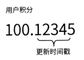
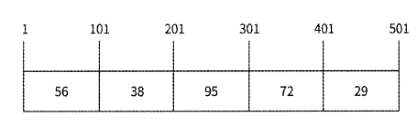
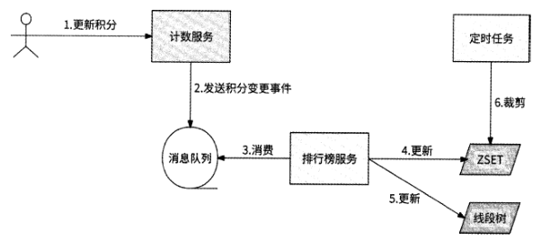

# 第 9 章 排行榜服务

## 9.1 排行榜的应用场景

- 游戏排行榜
- 商品排行榜
- 视频排行榜
- 社交排行榜

## 9.2 排行榜技术的特点

- 曝光量大
- 竞争激烈
- 实时变化
- 周期滚动

所以，在排行榜的技术实现方面，要重点考虑高并发读/写、实时展示最新排名，以
及可以轻松支持周期滚动的能力。在设计排行榜服务时，首先要考虑的问题是使用什么存储系统来维护排行榜。

## 9.3 使用Redis实现排行榜

### 9.3.1 使用 Redis ZSET

### 9.3.3 同积分排名处理

ZSET中的Score是浮点数类型的，
我们可以让Score的整数部分存储积分，让小数部分存储积分更新时间戳。这样一来，积
分更高的用户依然排名更高，而积分相同的用户可以进一步按照更新时间排序。为了实现
当积分相同时按照时间先后排序，Score的小数部分存储的值应该保证先到者大于后到者，
所以这里存储的时间戳不能是更新排行榜时的系统当前时间戳，因为系统时间戳的值随着
时间在不断增加，与我们的要求是相反的。

我们可以预设一个未来时间作为基准值(比方
2050年1月1日0点整，时间戳为2524579200 ),将基准值减去更新排行榜时的系统当前
时间戳的值作为小数部分的更新时间戳

由于每次更新排行榜时都要在Score的小数部分记录更新时间戳，所以就不能再使用
ZINCRBY 了。因为ZINCRBY只会对积分累加，而无法重写小数部分。

### 9.3.5 关于大Key的问题

Redis的每种数据结构对大Key的定义都不同

- String类型数据，长度超过10KB则被认为是大Key
- ZSET、Hash. List、Set等集合类型数据，成员数量超过10000个即被认为是大Key

对大Key的定义也不是绝对的，主要根据Value的成员数量和所占用的字节总数来确
定。每个公司都有不同的大Key标准。之所以要定义大Key,因为Redis是单线程工作模
型，只有在一个命令处理完后才会串行处理下一个命令，而大Key可能会造成Redis的性
能损耗

## 9.4 粗估排行榜的实现

由于担心大Key会对Redis的性能产生影响，所以你所在公司的Redis维护团队可能
会强行限制在使用Redis时，单个ZSET的大小不能超过10000或其他阈值。这时确实没
有办法使用一个ZSET实现百万人、千万人的排行榜，只能另辟蹊径。

我们先分析排行榜产品的特点。一个几千万人参与的排行榜，前几百名之后的用户会
在乎他是第80001名还是第80002名吗？实际上，这些尾部用户最多会关心其大致排名是
怎样的，当他有朝一日跻身彰显名次的头部位置时,才会对名次和与上一名的差距精打细算 。

于是，我们就有了一个初步的想法：前N名用户使用ZSET精确排名，其他用户粗估
排名。

### 9.4.1 线段树

如果放宽对排名精度的要求，那么可以通过分段思想来释放排行榜所需的大量存储空
间：把积分按固定范围分成多个等长的分段，每个分段都保存当前积分处于此分段的用户
数量，如图9-3所示。

## 9.5 精确排名与粗估排名结合

