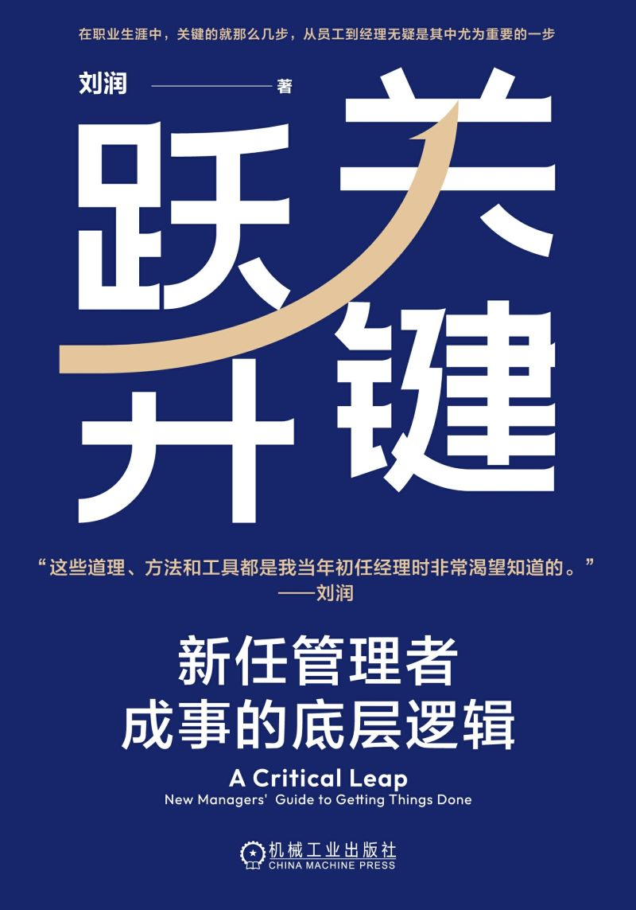
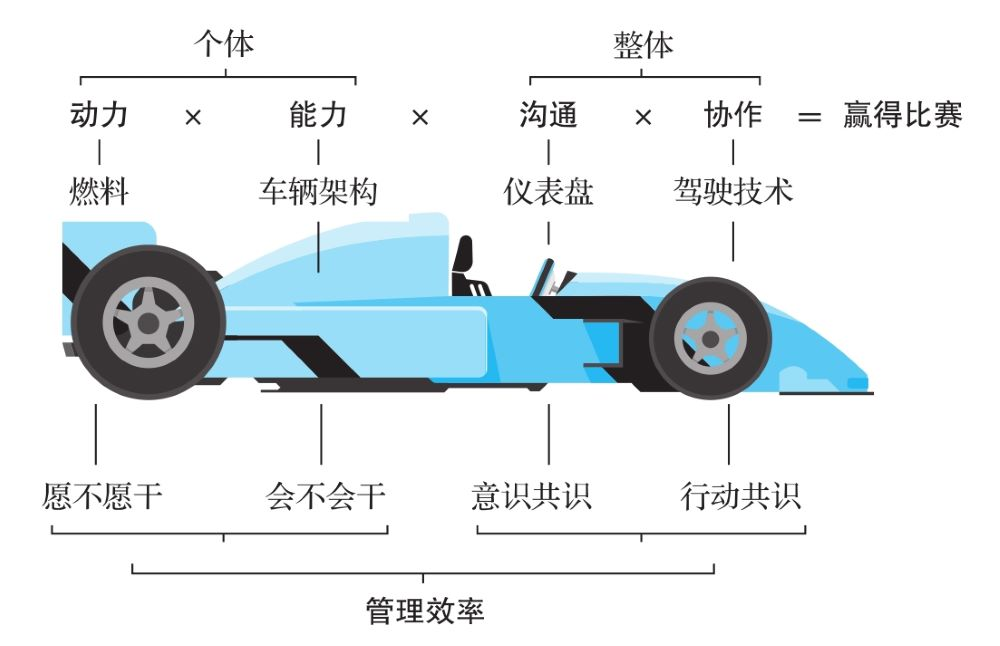

# 关键跃升

- 作者：刘润
- 出版社：机械工业出版社
- 出版时间：2024-07
- ISBN：978-7-111-75699-6
- 豆瓣：https://book.douban.com/subject/36946907
- 封面：

# 序⾔

从个⼈贡献者（Individual Contributor）到团队管理者（People Manager），是⼀次“关键跃升”。以前你⾯对的是事，现在你⾯对的是⼈。这次“关键跃升”，在你的整个⼈⽣中都⾮常重要。它带给⼀个⼈的不只是升职加薪，还伴随着⼼智的成熟。

不少⼈升到总监或者更⾼职位时，依然没有完成“关键跃升”。⽐如，有不少管理者并不清楚公司设⽴管理岗的意义何在，进⽽影响到⾃⼰履职尽责；也有不少⼈不清楚⼀个优秀的管理者应该具备哪些素质和技能，进⽽⽆法明晰⾃⼰弥补短板的⽅向……很多公司⾯临着“中层塌陷”，⼀个重要根源就是“关键跃升”的缺失。

什么是底层逻辑？就是不同之中的相同之处、变化背后不变的东⻄。底层逻辑是有⽣命⼒的。因为在我们⾯临环境变化时，只有底层逻辑才能被应⽤到新的变化中，从⽽产⽣适应新环境的⽅法论。

这套体系包括⼼法和剑法。

⼼法包括四个跃升：

- 责任跃升
- 沟通跃升
- 关系跃升
- ⾃我跃升

具体来说，经理以前对任务负责，现在对⽬标负责；以前⽤⾃⼰的⼿，现在⽤别⼈的脑；以前⼤家是左右的伙伴，现在⼤家是上下的战友；以前追求⼩我的满⾜，现在追求⼤我的成就。

剑法则讲了经理的四个重要⻆⾊：

- ⿎⼿
- 教练
- 政委
- 指挥

# 导论

## 为什么越“不⼲活”的⼈收⼊越⾼

在数量上，这些“不⼲活”的经理和⼲活的⼈相⽐，是什么关系呢？⼤约是1:5的关系。也就是说，⼤概每5个“⼲活的⼈”，就有1个“不⼲活的⼈”管着。

这个“不⼲活的⼈”可以专注在与“⾃然效率”作战上。

## ⾃然效率

什么叫“⾃然效率”？

举个例⼦，10个⼈被安排去种树，组织者提供⼯具和树苗，要求他们多种树、种整⻬。怎么⼲？先分⼯：挖洞、种树、填⼟、浇⽔。然后，这10个⼈就开⼲了。

可是，他们⼲活的效率⽐较低：因为挖洞慢，其他⼈都要等洞挖好了才能开⼯；种树的⼈种完树，发现没⼈填⼟，眼看着那棵树要倒掉，只好先扶着；浇⽔的⼈打好了⽔，但发现前三道⼯序还没完成，那就歇着吧，等⼟填完了再浇⽔。

这种在“⾃发分⼯，随机协作”机制下的⼯作效率，就是“⾃然效率”。

考虑到种树这件事，挖洞花的时间⻓，种树费的⼒⽓⼤，这两项⼯作最艰巨，因此你决定抽调6⼈，分成A、B两组，每组3⼈。A组负责挖洞，B组负责种树。累了之后，两组交换分⼯。由于填⼟快，所以只需要安排1⼈，作为C组，他还能给其他三组做后援。剩下的3⼈组成D组，专⻔负责浇⽔。

按照⾃然效率，10个⼈⼀天只能种20棵树，但是因为你带来了管理效率，10个⼈⼀天种了80棵树。

假如种⼀棵树收⼊100元，在⾃然效率下，10个⼈种20棵，平均每⼈种2棵，那么每个⼈的收⼊是200元。现在因为你⽽多种了60棵，创造了6000元的额外价值。所以，你的收⼊理论上就是6000元，是普通员⼯平均收⼊的30倍。

你的价值，是⽤管理效率打败⾃然效率。你的价值，就体现为在有你和没你两种情况下团队所创造的价值的差额。

**你的价值=团队价值×（管理效率-⾃然效率）**

要体现出你的这⼀价值，你需要⼀次“关键跃升”，⼀次从“个⼈贡献者”到“团队管理者”的跃升，⼀次从⾃⼰拼命⼲活到⾃⼰“不⼲活”但团队产出反⽽更⾼的跃升。

假设你亲⾃下场种树，⽽你并不⽐任何团队成员更有优势，那么你和团队加在⼀起共11个⼈，只能种22棵树，⽐⽤更有效的“分⼯协作法”所种的80棵少了58棵。

这就相当于，你拿着经理的⼯资，却没有做好作为经理的本职⼯作，⽽是去抢员⼯的⼯作⼲，最后让公司“亏”了58棵树，价值是5800元。

什么是“关键跃升”？关键跃升，就是从“个⼈贡献者”到“团队管理者”的跃升。这个跃升的核⼼，不是拥有更⾼的收⼊、更⼤的办公室、更受尊敬的头衔，⽽是从⾃⼰独⽴作战到带领团队“突破⾃然效率”。

那么，经理如何带领团队“突破⾃然效率”呢？——创造管理效率。

## 管理效率

**管理效率=动⼒×能⼒×沟通×协作**

突破⾃然效率的公式

- 动⼒

如果你想让⾃⼰的赛⻋跑得特别快，就得让它有⾜够⼤的动⼒

- 能⼒

这辆⻋的刹⻋系统⽤什么技术，避震系统⽤什么技术，轴距是多少……这些因素决定了⼀辆⻋的架构。⻢⻋怎么都跑不过汽⻋，汽⻋怎么都跑不过⻜机，其能⼒源于其架构，这个架构决定了它能做多⼤的事。对应到⼈身上也是如此，每个⼈的能⼒是不⼀样的。只靠激励不能获得能⼒，能⼒只能通过学习获得。

动⼒是“愿不愿⼲”，能⼒是“会不会⼲”，两者缺⼀不可。动⼒不能解
决能⼒的问题，能⼒也不能解决动⼒的问题。

- 沟通

赛⻋⼿坐进赛⻋之后，⾯前的仪表盘会告诉他这辆⻋的汽油有多少、
速度是多少、⽔箱的温度是多少、现在是什么挡位，这些都是数据。
数据是⽤来沟通的，赛⻋⼿可以根据数据快速做出反馈，通过沟通系
统，快速掌控这辆赛⻋。

- 协作

协作就相当于赛⻋⼿的驾驶技术。赛⻋⼿看到仪表盘上的数据之后，可以打⽅向盘，可以⼿动换挡，打⽅向盘和⼿动换挡都属于驾驶（协作）技术。

员⼯就相当于组成赛⻋的各种零部件，如有的⼈是轮胎，有的⼈是发动机，有的⼈是⽅向盘，有的⼈是联动杆，需要经理来协同。经理不仅需要设计管理的流程，来避免员⼯⼲重复的甚⾄相互冲突的事，还需要设计根据结果持续改进的机制……这些都是团队正常运⾏所必需的协作技术。

以上四个要素，其中动⼒和能⼒是针对个体的，沟通和协作是针对整体的。四个要素彼此相乘，才能得到预期的效率。之所以⽤乘法，是因为其中任何⼀个要素为0，都会导致团队满盘皆输。

## ⼩结

经理突破⾃然效率的底层逻辑，是通过优化流程，⾼效地连接更有动⼒、更有能⼒的⼈，以此创造最⼤的价值。经理创造价值的公式，是“管理效率=动⼒×能⼒×沟通×协作”。

从个⼈贡献者到团队管理者，是⼀次关键跃升。

