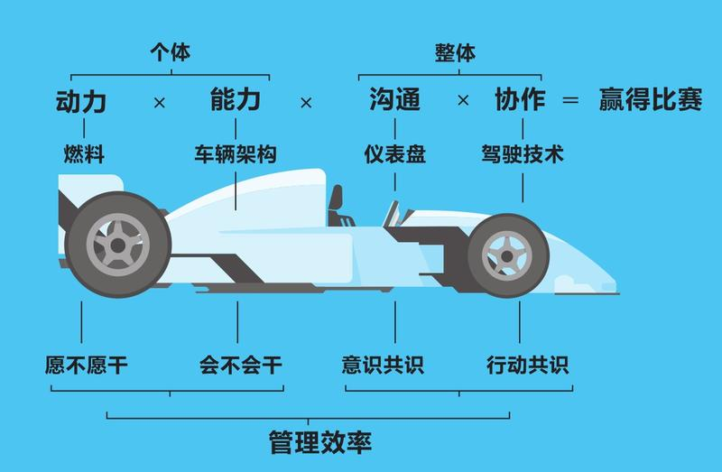
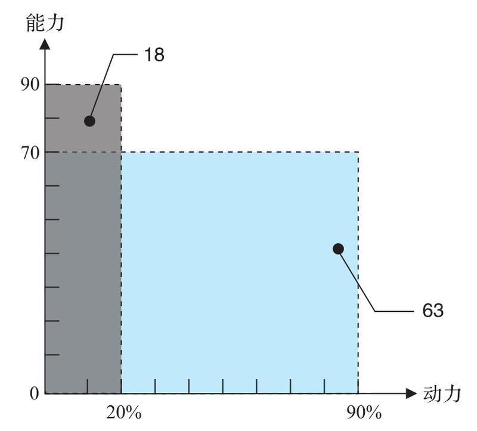
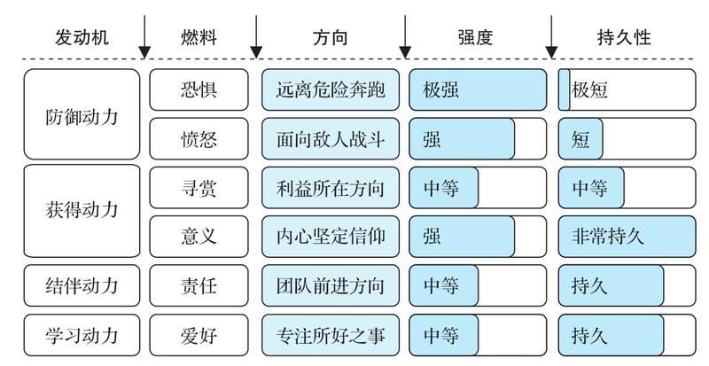
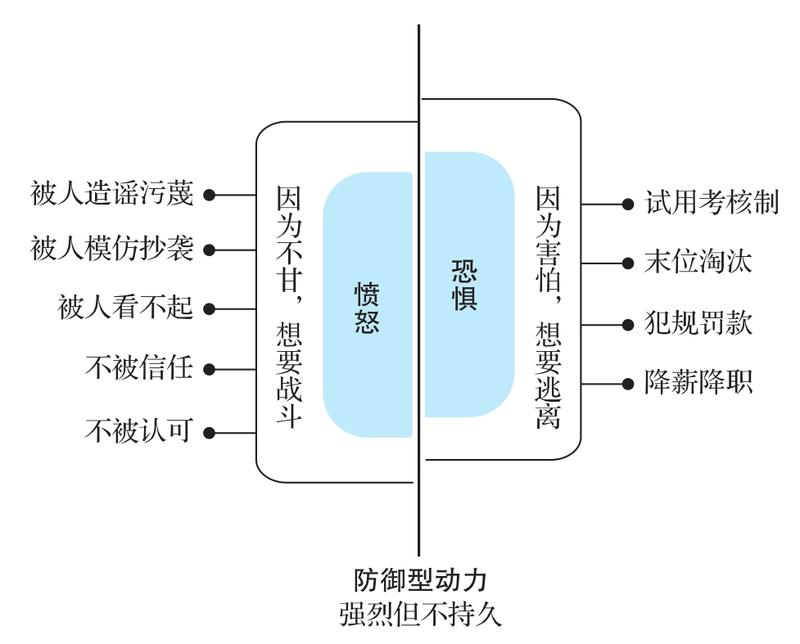
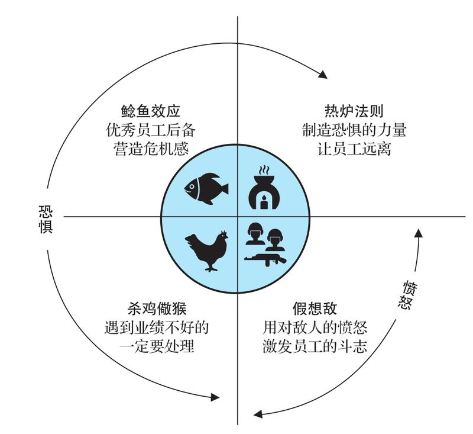
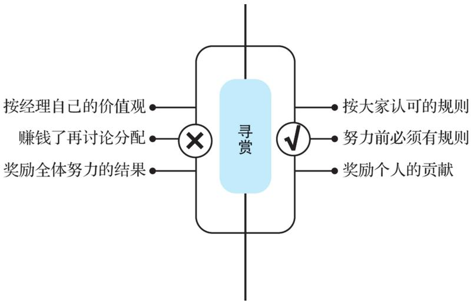
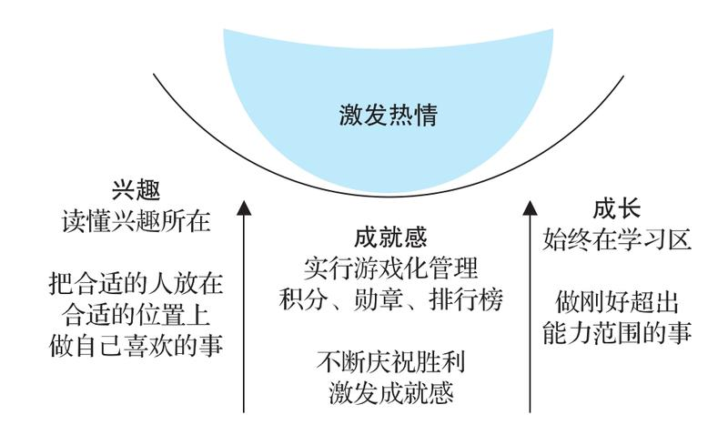
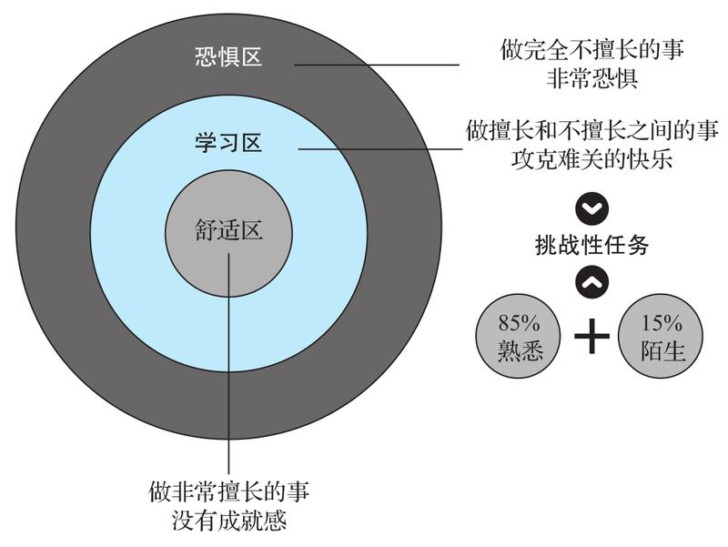
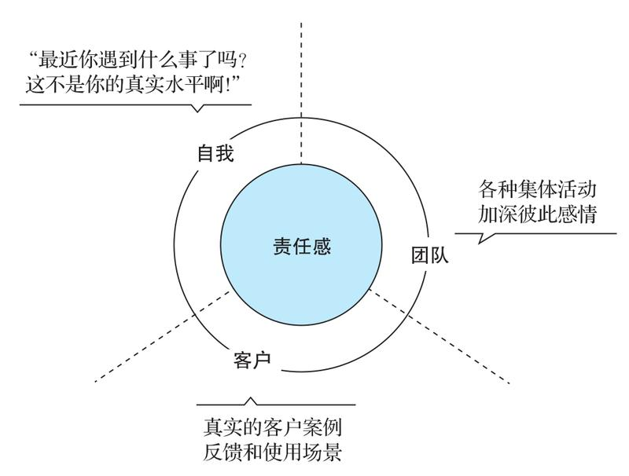
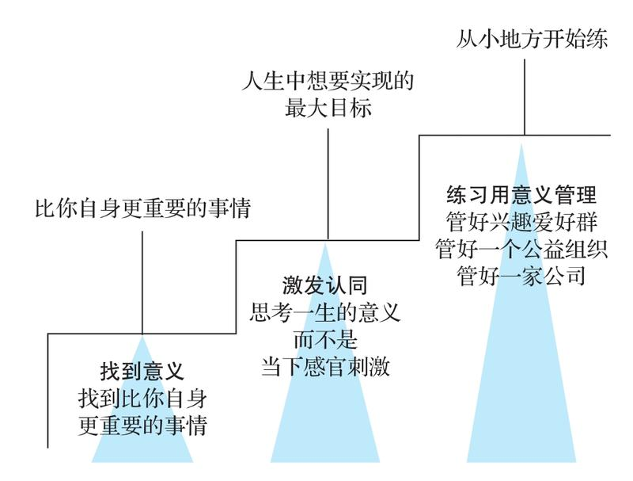

# 关键跃升：新任管理者成事的底层逻辑

- 作者：刘润
- 出版社：机械工业出版社
- 出版时间：2024-07
- ISBN：978-7-111-75699-6
- 豆瓣：https://book.douban.com/subject/36946907
- 封面：

# 序⾔

从个⼈贡献者（Individual Contributor）到团队管理者（People Manager），是⼀次“关键跃升”。以前你⾯对的是事，现在你⾯对的是⼈。这次“关键跃升”，在你的整个⼈⽣中都⾮常重要。它带给⼀个⼈的不只是升职加薪，还伴随着⼼智的成熟。

不少⼈升到总监或者更⾼职位时，依然没有完成“关键跃升”。⽐如，有不少管理者并不清楚公司设⽴管理岗的意义何在，进⽽影响到⾃⼰履职尽责；也有不少⼈不清楚⼀个优秀的管理者应该具备哪些素质和技能，进⽽⽆法明晰⾃⼰弥补短板的⽅向……很多公司⾯临着“中层塌陷”，⼀个重要根源就是“关键跃升”的缺失。

什么是底层逻辑？就是不同之中的相同之处、变化背后不变的东⻄。底层逻辑是有⽣命⼒的。因为在我们⾯临环境变化时，只有底层逻辑才能被应⽤到新的变化中，从⽽产⽣适应新环境的⽅法论。

这套体系包括⼼法和剑法。

⼼法包括四个跃升：

- 责任跃升
- 沟通跃升
- 关系跃升
- ⾃我跃升

具体来说，经理以前对任务负责，现在对⽬标负责；以前⽤⾃⼰的⼿，现在⽤别⼈的脑；以前⼤家是左右的伙伴，现在⼤家是上下的战友；以前追求⼩我的满⾜，现在追求⼤我的成就。

剑法则讲了经理的四个重要⻆⾊：

- ⿎⼿
- 教练
- 政委
- 指挥

# 导论

## 为什么越“不⼲活”的⼈收⼊越⾼

在数量上，这些“不⼲活”的经理和⼲活的⼈相⽐，是什么关系呢？⼤约是1:5的关系。也就是说，⼤概每5个“⼲活的⼈”，就有1个“不⼲活的⼈”管着。

这个“不⼲活的⼈”可以专注在与“⾃然效率”作战上。

## ⾃然效率

什么叫“⾃然效率”？

举个例⼦，10个⼈被安排去种树，组织者提供⼯具和树苗，要求他们多种树、种整⻬。怎么⼲？先分⼯：挖洞、种树、填⼟、浇⽔。然后，这10个⼈就开⼲了。

可是，他们⼲活的效率⽐较低：因为挖洞慢，其他⼈都要等洞挖好了才能开⼯；种树的⼈种完树，发现没⼈填⼟，眼看着那棵树要倒掉，只好先扶着；浇⽔的⼈打好了⽔，但发现前三道⼯序还没完成，那就歇着吧，等⼟填完了再浇⽔。

这种在“⾃发分⼯，随机协作”机制下的⼯作效率，就是“⾃然效率”。

考虑到种树这件事，挖洞花的时间⻓，种树费的⼒⽓⼤，这两项⼯作最艰巨，因此你决定抽调6⼈，分成A、B两组，每组3⼈。A组负责挖洞，B组负责种树。累了之后，两组交换分⼯。由于填⼟快，所以只需要安排1⼈，作为C组，他还能给其他三组做后援。剩下的3⼈组成D组，专⻔负责浇⽔。

按照⾃然效率，10个⼈⼀天只能种20棵树，但是因为你带来了管理效率，10个⼈⼀天种了80棵树。

假如种⼀棵树收⼊100元，在⾃然效率下，10个⼈种20棵，平均每⼈种2棵，那么每个⼈的收⼊是200元。现在因为你⽽多种了60棵，创造了6000元的额外价值。所以，你的收⼊理论上就是6000元，是普通员⼯平均收⼊的30倍。

你的价值，是⽤管理效率打败⾃然效率。你的价值，就体现为在有你和没你两种情况下团队所创造的价值的差额。

**你的价值=团队价值×（管理效率-⾃然效率）**

要体现出你的这⼀价值，你需要⼀次“关键跃升”，⼀次从“个⼈贡献者”到“团队管理者”的跃升，⼀次从⾃⼰拼命⼲活到⾃⼰“不⼲活”但团队产出反⽽更⾼的跃升。

假设你亲⾃下场种树，⽽你并不⽐任何团队成员更有优势，那么你和团队加在⼀起共11个⼈，只能种22棵树，⽐⽤更有效的“分⼯协作法”所种的80棵少了58棵。

这就相当于，你拿着经理的⼯资，却没有做好作为经理的本职⼯作，⽽是去抢员⼯的⼯作⼲，最后让公司“亏”了58棵树，价值是5800元。

什么是“关键跃升”？关键跃升，就是从“个⼈贡献者”到“团队管理者”的跃升。这个跃升的核⼼，不是拥有更⾼的收⼊、更⼤的办公室、更受尊敬的头衔，⽽是从⾃⼰独⽴作战到带领团队“突破⾃然效率”。

那么，经理如何带领团队“突破⾃然效率”呢？——创造管理效率。

## 管理效率

**管理效率=动⼒×能⼒×沟通×协作**

突破⾃然效率的公式

- 动⼒

如果你想让⾃⼰的赛⻋跑得特别快，就得让它有⾜够⼤的动⼒

- 能⼒

这辆⻋的刹⻋系统⽤什么技术，避震系统⽤什么技术，轴距是多少……这些因素决定了⼀辆⻋的架构。⻢⻋怎么都跑不过汽⻋，汽⻋怎么都跑不过⻜机，其能⼒源于其架构，这个架构决定了它能做多⼤的事。对应到⼈身上也是如此，每个⼈的能⼒是不⼀样的。只靠激励不能获得能⼒，能⼒只能通过学习获得。

动⼒是“愿不愿⼲”，能⼒是“会不会⼲”，两者缺⼀不可。动⼒不能解
决能⼒的问题，能⼒也不能解决动⼒的问题。

- 沟通

赛⻋⼿坐进赛⻋之后，⾯前的仪表盘会告诉他这辆⻋的汽油有多少、
速度是多少、⽔箱的温度是多少、现在是什么挡位，这些都是数据。
数据是⽤来沟通的，赛⻋⼿可以根据数据快速做出反馈，通过沟通系
统，快速掌控这辆赛⻋。

- 协作

协作就相当于赛⻋⼿的驾驶技术。赛⻋⼿看到仪表盘上的数据之后，可以打⽅向盘，可以⼿动换挡，打⽅向盘和⼿动换挡都属于驾驶（协作）技术。

员⼯就相当于组成赛⻋的各种零部件，如有的⼈是轮胎，有的⼈是发动机，有的⼈是⽅向盘，有的⼈是联动杆，需要经理来协同。经理不仅需要设计管理的流程，来避免员⼯⼲重复的甚⾄相互冲突的事，还需要设计根据结果持续改进的机制……这些都是团队正常运⾏所必需的协作技术。

以上四个要素，其中动⼒和能⼒是针对个体的，沟通和协作是针对整体的。四个要素彼此相乘，才能得到预期的效率。之所以⽤乘法，是因为其中任何⼀个要素为0，都会导致团队满盘皆输。

## ⼩结

经理突破⾃然效率的底层逻辑，是通过优化流程，⾼效地连接更有动⼒、更有能⼒的⼈，以此创造最⼤的价值。经理创造价值的公式，是“管理效率=动⼒×能⼒×沟通×协作”。

从个⼈贡献者到团队管理者，是⼀次关键跃升。

# 第1章 ⼼法

经理的“⼼法”修炼

责任跃升：从对任务负责到对⽬标负责

- 四种责任感
- 把⽬标拆解成任务

沟通跃升：从⽤⾃⼰的⼿到⽤别⼈的脑

- 有损沟通
- ⾼⼿从不否定对⽅

关系跃升：从左右的伙伴到上下的战友

- 对事不对⼈
- 公司不是家

⾃我跃升：从⼩我的满⾜到⼤我的成就

- 把⾃我的边界扩⼤
- 抵触情绪的源头
- 关注全局效率

这个公式是实现关键跃升的“剑法”。但是，在练习“剑法”之前，我想先讲讲“⼼法”。因为只有⼼法改变了，认知改变了，⾏为才会⾃然地发⽣改变。

**管理效率=动⼒×能⼒×沟通×协作**

这个“⼼法”，就是成为经理之后，接受从“⾃⼰做事”到“通过别⼈来做事”需要的四个⼼理上的跃升：责任跃升、沟通跃升、关系跃升和⾃我跃升。

## 责任跃升：从对任务负责到对⽬标负责

每⼀级管理者都要能扛住上⼀级的所有问责，因为责任是不可以穿透的。美国前总统杜鲁⻔有⼀句名⾔：“问题到此为⽌。”能扛事⼉的才是⼤哥。

团队管理者⼀定要明⽩⼀件事，从员⼯晋升到经理，你⾸先需要经历⼀个重⼤的跃升。这个跃升，叫作责任跃升。你的责任从对任务负责变成了对⽬标负责，这是⼀次质变。

### 四种责任感

“⼯作的核⼼是责任。”组织⾥的不同层级承担着不同的责任。具体到个⼈，⼈们有四种不同的责任感。

#### 对时间负责

概括为8个字：拿多少钱，⼲多少活。

#### 对任务负责

概括为8个字：指哪打哪，说啥做啥。

#### 对⽬标负责

概括为8个字：创造条件，拿下⼭头。

拿下⼭头是⽼板定的⽬标，⾄于怎么拿下，那得靠员⼯⾃⼰创造条件。对⽬标负责的时候，执⾏⼒虽然也重要，但主要⽤的是思考⼒，这是从动⼿到动脑的⼀次跃升。

对⽬标负责，本质上是企业把千头万绪的执⾏问题封装成⼀个⽬标，然后配置相应的资源，交到经理⼿上，经理要拿着资源，对⽬标负全责。

#### 对使命负责

概括为8个字：⾃带“鸡⾎”，携⼿同⾏。

如果⼀个⼈是真的发⾃内⼼地相信公司的使命，他就会有强⼤的内在驱动⼒，也就是“⾃带‘鸡⾎’”。从完成⽬标到达成使命，是职业⽣涯的⼜⼀次跃升，这⼀次是从动脑到动⼼的跃升。

企业⾥不同层级的⼈要有不同的责任感。对时间负责的⼈，基本上是不合格的员⼯。企业对员⼯的基本要求是对任务负责，他们要知道How（怎么做）；企业对经理的基本要求是对⽬标负责，他们要知道What（做什么，即部⻔要达成什么样的⽬标）；企业对创始⼈或合伙⼈的基本要求是对使命负责，他们必须理解Why（为什么做，即公司要达成什么样的使命）。

### 把⽬标拆解成任务

#### 要懂得拆解⽬标

⽬标只能“⾯对”，没法“执⾏”。我们只听说过执⾏任务，没听说过执⾏⽬标，你必须先把⽬标拆解为任务。拆解不同于拆分，拆解是做乘除法，拆分是做加减法。做加减法很容易，但成为经理之后，我们要学会做乘除法。

> 有⼀次我辅导⼀个电商团队。⽼板给经理定了⼀个⽬标，今年要完成5000万元的服装销售额。经理⽴⻢跟我聊：“我的团队⾥有5个⼩伙伴，每⼈完成1000万元⾏不⾏？”我说：“这是不⾏的，这是做加减法，是拆分，不是拆解。”
>
> 拆解是做乘除法。基于对业务的深度理解，可这样拆解销售⽬标。
>
> **销售⽬标=店铺粉丝数×转化率×客单价**
>
> ⾸先得知道店铺的粉丝数，就是有多少⼈关注你的店铺；再看平均每天有多少⼈会下单购买，得出⽇订单量的转化率；最后是看客单价，⽤户平均买了500元的东⻄，还是1000元的东⻄。这个经理最后把5000万元的年度销售⽬标（假设⼀年⼯作300天），拆解为“17.5万粉丝×2.4‰转化率×400元客单价×300天”。其中，最⼤的难点在于第⼀个要素，店铺粉丝数要达到17.5万⼈。这就是我们所说的拆解⽬标。

#### 拆解完⽬标之后，再进⾏拆分

我们以粉丝数的拆分为例，将达成17.5万粉丝的⽬标拆分为季度⽬标：第⼀、第⼆季度的任务要更重些，这样上半年的业绩数据才不⾄于难看。然后怎么做？⼤家纷纷出主意：第⼀，通过优质短视频加粉；第⼆，通过裂变加粉，以打折等优惠活动推动⽤户分享店铺给朋友，朋友加粉后再分享给各⾃的朋友；第三，通过平台做推⼴活动，⽤便宜商品引导加粉。这三个任务分别由不同的员⼯负责。

经理把⽬标拆解为任务之后，每个员⼯就可以专⼼去忙⾃⼰的任务。如果之后还是没达成⽬标呢？这时候经理要记住⼀句话，“降妖除魔你去，背⿊锅我来”。经理要扛住这个责任，因为团队管理者要承担⽬标层⾯的后果，⽽员⼯只承担任务层⾯的后果。

## 沟通跃升：从⽤⾃⼰的⼿到⽤别⼈的脑

升任经理之后，沟通之所以重要，从“⼼法”的层⾯来看，其实是因为过去你⾃⼰能完成的任务，现在要通过员⼯来完成，沟通机制发⽣了变化，你正在从“⽆损沟通”⾛向“有损沟通”，这是⼀次重⼤的跃升。

### 有损沟通

当我们还是员⼯的时候，我们是⾃⼰跟⾃⼰沟通，⾃⼰的⼤脑和⾃⼰的双⼿进⾏沟通，⼼到、眼到、⼿到，⼀⽓呵成，想到就能做到。我们把这叫作“⽆损沟通”。

从⾃⼰的⼤脑指挥⾃⼰的双⼿，变成⾃⼰的⼤脑指挥别⼈的双⼿，沟通过程中多了两个中介。第⼀个中介是⾃⼰的嘴，你⼤脑⾥的信息要通过⾃⼰的嘴传递出去。第⼆个中介是员⼯的⼤脑，它要接受信息，再把信息传递给双⼿。

这两个中介造成了两个问题。第⼀个问题是，⾃⼰的嘴传递信息的时候，造成了信息的损耗，完整度不是百分之百。第⼆个问题是，员⼯的⼤脑接收信息之后，是否真正认同你的指令，现实中往往接受度也不是百分之百，会有信息的损耗。这就叫“有损沟通”。

从员⼯晋升到经理，你需要经历的第⼆个跃升就是：从“⽆损沟通”的⽆须技巧，到具备应对“有损沟通”的⾼超技巧。那怎么做呢？

### ⾼⼿从不否定对⽅

从员⼯晋升到经理，就是从管⾃⼰变成管团队；就是从修身转变为⻬家；就是从继承⼀个进化了百万年的成熟沟通系统，到新开创⼀个系统去管理运⾏。

四种沟通话术:

#### 不要说“这不⾏”，⽽要说“如果……就……”

你缺块砖，就给你加块砖，你缺根⽊头，就给你加根⽊头。“如果……就……”，“如果”的后⾯就是他加上去的建议。

#### 不要说“but”（但是），⽽要说“yes...and...”（是的……同时……）

不说“但是”，⽽是说“是的……同时……”，和说“如果……就……”⼀样，你在不否定员⼯的同时，还提供了更好的建议，接受度会更⾼。

为什么不能说“但是”，因为⼀说“但是”，你就和对⽅站在了对⽴⾯。⽽只有你和对⽅站在同⼀边的时候，才更加有助于达成共识。

#### “你是不是这么觉得的？”

这种话术是罗振宇⽼师教我的。他曾在央视⼯作，经常要采访很多⼈，被采访的⼈⼤多没有接受过表达⽅⾯的训练，往往会⼀⼝⽓说很多。他不能说⼈家啰唆，他会在听完之后说，我帮你总结⼀下，你是不是这么觉得的？然后他说出第⼀点、第⼆点、第三点……他的总结通常会更加清晰，对⽅听完后觉得这确实是⾃⼰的意思，就会表示认可。这样，他就可以按照⾃⼰总结的⼏点来整理⽂字了。

当你说“你是不是这么觉得的？”的时候，对⽅就会把接下来你整理过的内容当成他的观点，你的观点的接受度就会得到极⼤提升。

#### “我知道你是出于善意”

我们不能攻击对⽅的“动机”。我们可以这么沟通：我注意到你最近做了件什么事（描述⾏为），我知道你是出于善意（肯定动机），我看出来了，你还瞒着我，我⾮常感激，谢谢。

### 学员感悟与案例

> ⼩光：权⼒分为三种，即法定权⼒、专业权⼒和魅⼒权⼒。想让⾃⼰的脑指挥别⼈的⼿，要充分理解并运⽤权⼒的作⽤机制。如果你只有法定权⼒，现在年轻的员⼯根本就不听你的，因为“90后”“95后”年轻⼈的成长环境更多元，家境相对优越，个体意识很强，对权威不盲从。所以，团队管理者应将其他两种权⼒发挥到极致。也就是说，要想指挥优秀年轻⼈的⼿，你有两条路：⼀是让他们佩服你，⼆是让他们喜欢你，当然，最好是兼⽽有之。

## 关系跃升：从左右的伙伴到上下的战友

你当上部⻔经理，通常有两种可能：⼀种可能，你是空降的，你从公司内部的⼀个部⻔调到另⼀个部⻔当经理，或者你从公司外部调过来，下⾯的员⼯以前并不认识你；另⼀种可能，你所在部⻔的经理⾛了，你因为业绩突出，被提拔为经理。

### 对事不对⼈

同级的员⼯，是左右的伙伴。左右的伙伴的本质，是我不⽤对你的“事”（也就是业绩）负责。作为同级的员⼯，你我是左右相交的两个圆。在⼤部分情况下，我做我的，你做你的。我们之间偶尔会有合作，基本上是没有直接竞争的。

经理与员⼯，是上下的战友。上下的战友的本质，是⾥外嵌套的两个圆，经理是⼤圆，员⼯是⼩圆，⼤圆包含⼩圆。员⼯的责任是经理的责任的⼀部分，经理要对员⼯的责任负责。你做得不好的部分，过去跟我没关系，现在跟我有关系了。你开始对他有权⼒，他开始对你有责任。

从员⼯晋升到经理，从左右的伙伴到上下的战友，本质上是从对⼈不对事⾛向对事不对⼈。

### 公司不是家

关系跃升⾸先是⼀种认知上的重⼤跃升，也是⼀个⼼理建设的过程，还是⼀个先打碎再重建的过程。

#### 在认识上，清醒地剖析双⽅关系的本质

经理和员⼯的关系既不是家⼈关系，也不是朋友关系，⽽是战⽃友谊

经理跟员⼯，第⼀不是家⼈，第⼆不是朋友

公司或团队是⼀个战⽃单元。是战⽃，就有战⽃⽬标。⼤家是为了达成⽬标⽽集结的，⼀旦⽬标达成，可能就会解散。这个战⽃单元会⻓期存在，但是战⽃单元中的⼈会时常更换，有⼈会加⼊，有⼈会离开。在战⽃中，⼤家会结下深厚的情谊，但这种情谊依然是战⽃情谊。我们在这⾥际会，但我们不是家⼈关系，也不是对⼈不对事的朋友关系。

#### 在⾏动上，经理要和员⼯保持亲⽽不密的关系

经理对员⼯⼀定要认真地关⼼，⽐如关⼼他们的身⼼健康，关⼼他们的持续成⻓，但是不要保持那么亲密的关系，因为越亲密的关系，越容易导致对⼈不对事。

如何做到“亲⽽不密”呢？

⾸先，千万不要拿员⼯的⼀针⼀线。

其次，⽇常交际时不要显得关系过于亲密。

## ⾃我跃升：从⼩我的满⾜到⼤我的成就

你和⽼板讨论⼀个问题。本来聊得好好的，但当你提出了⼀个不同观点时，⽼板突然间脸⾊变得很难看。他本来是⾮常友善的⼈，有时还会跟下属开点⼩玩笑，这时却想尽⼀切办法来压制你，说你不知道全局，同时想⽅设法来证明⾃⼰是对的。

你觉得很奇怪：⽼板怎么变得这么固执，是你的观点错得离谱吗？不是，你的观点可能是有道理的，甚⾄⽼板可能也是同意的。但他不会表现出⾃⼰是同意的，因为他没有办法在下属⾯前承认⾃⼰是错的。

我把这种现象称为 **“瞬间顽固症”** 。 **证明他是对的，⽐证明这件事本身是对还是错更重要。**

有的时候我们不是为了赢得胜利，⽽是为了赢得辩论。为什么会这样？因为他⼼中的⾃我（ego）边界太⼩，能量太强。其实，这个问题你身上也有。

### 把⾃我的边界扩⼤

猎豹移动（原⾦⼭⽹络）CEO傅盛对“⾃我”的看法我⽐较认同，他认为，“⾃我”是⾮常感情化的东⻄，它会在⼈的内⼼建⽴起⼀种⼼理防御机制。因为你不喜欢犯错误的感觉，你的本能就总想强⾏辩驳，别⼈⼀批评，你就怒了；因为你害怕⾯对复杂的东⻄，你就本能地希望把问题简单化。你的出发点不是为了⾯对现实，⽽是充满了“我我我”——这就是⾃我的障碍。

你的同事做得⽐你好，你会有点嫉妒，因为同事在你的⾃我边界之外。但是你的孩⼦做得⽐你好，你会嫉妒吗？不会的。你甚⾄会因为孩⼦做得⽐⾃⼰好⽽更加⾼兴，因为孩⼦进⼊了你的⾃我边界内。他做得好，就是你的更⼤的⾃我做得好。

⼀个⼈的成⻓，就是从没有⾃我边界到形成⾃我边界，再到延展⾃我边界的过程。⾃我边界越⼤的⼈，越能做⼤事。

⾃我的边界很⼩，能量却很强⼤，为什么？因为⼀个⼈⼀旦⾃我认知不协调，就容易产⽣⼼理创伤，所以他必须有能量很强⼤的⾃我，来保护⾃⼰不受伤。

当你是员⼯的时候，有较⼩的⾃我是可以的。但是从员⼯晋升到经理后，这就有问题了，你会不断⾯临关于⾃我的挑战，可能会产⽣三种重要的害怕：

- 怕⾃⼰被证明是错的
- 怕下属的能⼒超过⾃⼰
- 怕下属的影响⼒超过⾃⼰

如果从员⼯晋升成为经理后，你的⾃我还局限在⾃⼰⼀个⼈的范围内，我们称之为“⼩我”，你就很难⾯对和处理好与员⼯的关系。这个时候，你必须经历⼀次重⼤的跃升。你要把⾃我的边界扩⼤，扩⼤到可以将整个团队包含进来。你必须超越“个⼈主义”，具备“集体主义”精神。这是⼀次⾮常难的，但是极其重要的跃升。

### 抵触情绪的源头

这种“不住在⾃⼰⼼⾥”，我不是“我”⽽是“他”，⼼中没有⾃⼰、只有⽬标的状态，是很难修炼的。这也是为什么古⼈说“60⽽⽿顺”。为什么到60岁才能⽿顺？因为你需要先花20年建⽴“⾃我”，再花40年战胜“⾃我”。

### 关注全局效率

怎么扩⼤⾃我的边界，完成这个最难的跃升呢？

经理要懂得关注全局效率，把关注点放在更⼤的格局上：

#### 从个⼈级别的⾃我，⾛向⽗⺟级别的⾃我

你把那些员⼯当成⾃⼰的孩⼦，你看着他们成⻓，希望他们超过⾃⼰

#### 从⽗⺟级别的⾃我，⾛向君王级别的⾃我

君王⼼态是⺠富所以国强，安邦才能富国。有⼀天，当你从⼀个职业经理⼈、⼀个团队管理者变成⼀个真正的企业家的时候，就需要这种君王⼼态。

我们常说“家国天下”，从“个⼈”⾛向“⽗⺟”，就变成了⻬家的胸怀；从“⽗⺟”⾛向“君王”，就变成了治国平天下的胸怀。⼀个⼈的格局、胸怀、⽓度，指的就是这个⼈的⾃我包含了多少东⻄。如果⼀个⼈的⾃我能将整个国家、整个地球甚⾄整个宇宙都包含进去，那么他的格局、胸怀、⽓度就都会达到⼀个全新的⾼度。

### 学员感悟与案例

> 陈长安：关于君王⼼态，君王⼀⽅⾯期待民富国强，另⼀⽅⾯很注意防范功⾼震主。我很担⼼下属的影响⼒超过我，主要体现在两个⽅⾯：⼀⽅⾯，担⼼上层领导认为我是容易被替代的；另⼀⽅⾯，担⼼出现拉帮结派集体造反的情况。我的解决措施是：①持续努⼒提⾼⾃⼰的专业性，以便更加服众；②注重信息通道的管理，严控越级汇报⾏为；③扶持其他成员，稀释个别⼈的影响⼒。

# 第2章 动⼒

突破⾃然效率

员⼯不努⼒，是因为他的发动机没被点燃

- 员⼯往往不能⾃燃
- ⼈⼼动⼒系统

愤怒与恐惧：不要死于听天由命和漫不经⼼

- 制造危机感，利⽤愤怒感
- 四种办法

寻赏：把胡萝⼘挂在结果上，⽽不是你⼿上

- 成为“明君”是妄想
- ⼲活之前共同定规则

爱好：合格的经理可以管“80后”，优秀的经理可以管“90后”

- 爱好是⾃⼰给的精神奖励
- 爱好的三个源头活⽔

责任：这是我⾃⼰的事，不是别⼈的事

- 把任务当成⾃⼰的事
- ⾃我责任感、团队责任感和客户责任感

意义：理解意义的意义

- 意义能超越⽣存、繁衍和死亡
- 意义管理三部曲

第1章，讲了带领团队突破⾃然效率的四个“⼼法”：责任跃升、沟通跃升、关系跃升和⾃我跃升。

第2章，讲突破⾃然效率的四个“剑法”：动⼒、能⼒、沟通和协作。

动⼒和能⼒是提升团队个⼈效率的关键，沟通和协作是提⾼团队整体效率的关键。

**⼼法，是要不断“修”的；剑法，是要不断“练”的。**

如果你的员⼯没有动⼒，只有你可以“⾃我驱动”，那就相当于⼀个⻋头要带动所有⻋厢。⻋厢数量越多，你就带得越吃⼒。身处“⾼铁”时代的你必须与时俱进，把整个列⻋变成动⻋组，也就是使每⼀个⻋厢都⾃带动⼒。这样，你的团队才有战⽃⼒。

## 员⼯不努⼒，是因为他的发动机没被点燃

### 员⼯往往不能⾃燃

“⻰⽣九⼦，各不相同”，每个⼈⼼中都有⾃⼰的发动机。有的是柴油发动机，有的是汽油发动机。但不管是什么发动机，都需要往⾥⾯注⼊充⾜的燃料，⼯作时才会有澎湃的动⼒。

威廉·詹姆斯研究发现，被激发了动⼒的⼈可以发挥出他能⼒的80%～90%。假设⼀个⼈的能⼒是90分，如果没有动⼒就只能发挥出20%的才能，只能贡献18分的⼒量。

激发动⼒：**动⼒（20%）×能⼒（90分）=贡献（18分）**

另⼀个⼈的能⼒差⼀些，只有70分，但如果你激励他发挥出90%的才能，那么他就能贡献63分的⼒量。

彼得·德鲁克说，管理的本质是激发善意。你唯⼀的办法，就是去激发员⼯，赢得他的全身⼼投⼊。学会激发员⼯的动⼒，是跃升为管理者的必修课。

### ⼈⼼动⼒系统

⼈⼼动⼒系统，包括四台发动机，即防御动⼒、获得动⼒、结伴动⼒和学习动⼒。

动⼒的⽅向，就是你⽤⼒的⽅向。⽐如说劈柴，这斧⼦是砍向了⽊头，还是下边的桩⼦，或是直接甩出去了。强度，就是你所花⼒⽓的⼤⼩，是轻轻地砍下去，还是拼尽全⼒地砍下去。持久性，就是砍⼀斧⼦就⾛，还是接着砍第⼆斧⼦、第三斧⼦、第四斧⼦……⼀直不停。

**当理想与现实、⽬标与结果之间存在差距时，⼈类就会产⽣各种情绪，以弥补差距。想弥补差距的情绪会产⽣张⼒，让⼈由内⽽外地想去做⼀些事。这种由情绪引发的张⼒，就叫作“情绪张⼒”。情绪张⼒，是所有动⼒的最终来源。**

#### “防御动⼒”发动机

⼈作为⼀种动物，⾯对危险时有快速反应的本能。不能快速反应的物种，都已经被危险消灭了。作为幸存的物种，⼈有两种情绪张⼒来⾯对危险：恐惧和愤怒。

沃尔特·坎农提出的著名的⼼理学概念“战⽃或逃跑反应”。恐惧驱动逃跑，愤怒驱动战⽃。恐惧和愤怒，都能激发⼈类的“防御动⼒”。防御动⼒特别强⼤，因为它和⽣死有关。

很多管理⼿段的本质，都是在借助恐惧和愤怒的情绪张⼒来激发员⼯的防御动⼒，从⽽使员⼯全身⼼投⼊到⼀件事中。

1、恐惧

转正考核、末位淘汰等，本质上都是在制造“危险”环境，从⽽激发员⼯全⼼投⼊。

恐惧带来的防御动⼒，强度极⼤。恐惧之下，所有的潜⼒都能被发挥出来。⾯对死亡威胁，只有拼命奔跑。向哪⾥跑？向远离危险的⽅向奔跑。恐惧带来的防御动⼒要慎⽤，因为“拼命”的状态，消耗太⼤了，不持久。⼀旦远离危险，动⼒就会瞬间消失。

> 你会看到⼀个员⼯处在试⽤期时不要命地⼯作，可⼀旦签了转正合同，危险消失，就会⽴刻放松下来，甚⾄可能会变成⼀根“新油条”。

2、愤怒

愤怒所带来的防御动⼒，从强度看，它是强⼤的，“匹夫⼀怒，⾎溅五步；帝王⼀怒，伏⼫百万”；从⽅向看，它是⾯向敌⼈战⽃的；从持久性来看，它的持久性⽐较短，战⽃结束后就基本消退了。

#### “获得动⼒”发动机

获得动⼒，就是去获取，去控制，从⽽拥有更多的资源和尊重。获得动⼒也包括两种情绪张⼒：寻赏和意义。

1、寻赏

“重赏之下，必有勇夫”。他本来不想⼲的，奈何你给得太多了，虽然难⼀点，但他还是⼲了。你要是给我我想要的东⻄，我就给你你想要的东⻄。

寻赏，是管理者最喜欢⽤的情绪张⼒。因为它简单好⽤。⼤部分员⼯看在升职、加薪或表彰等奖赏的份上，都会完成⾃⼰的⼯作。但是，寻赏能让⼈服从，却未必能让⼈⼼⽢情愿。所以，寻赏带来的动⼒强度，属于中等⽔平。

寻赏带来的获得动⼒，其持久性虽然⽐愤怒和恐惧要⻓⼀些，但依然不是很⻓。⼀旦获得了想获得的东⻄，满⾜了需求，这种动⼒就会消失，就会出现躺平甚⾄摆烂。

2、意义

意义就是从关注⾃我中跳出来，去做有利于更多⼈的事情。意义感能激发员⼯的热忱，促使其超越⾃我。意义感这种情绪张⼒，能带来更强、更持久的获得动⼒。

#### “结伴动⼒”发动机

员⼯基于对领导或团队的认同感、归属感，⽽产⽣的对团队的责任感。结伴动⼒能够激发员⼯做出衷⼼的承诺。

结伴动⼒的背后是责任

#### “学习动⼒”发动机

⼈天⽣是富有好奇⼼的。满⾜⾃我的好奇⼼，不断做新鲜的事、更有挑战的事的这个过程，就叫作学习。

爱好⼀件事，就是因为做这件事有意思，能让你从中得到乐趣，所以你就特别愿意不断地去做。

激励员⼯的⼀个重要⽅法，就是让他做⾃⼰爱好的事。

### 学员感悟与案例

> 陈长安
>
> 我现在每天早上6点起床，提前2个⼩时到达公司，是什么在激励我？
>
> 1.恐惧：软件⾏业技术⽇新⽉异，我担⼼⾃⼰被淘汰。
>
> 2.愤怒：竞争对⼿抢我的项⽬，挖我的⼈，我要更努⼒，让团队成员认可，让对⼿服⽓。
>
> 3.寻赏：作为经理，⽐团队中年龄相近的⼀般⼯程师每⽉多好⼏千元的薪⽔，我得对得起这份多出来的钱。
>
> 4.爱好：看着团队成员在我的有效管理下有章法、有节奏地⼯作，感觉⾮常快乐。
>
> 5.责任：我是团队负责⼈，“兵熊熊⼀个，将熊熊⼀窝”，我要做个称职的“将军”。
>
> 6.意义：我们团队做的项⽬动辄影响⼏千万⼈的⽇常⽣活，我深感如临深渊、如履薄冰。

## 愤怒与恐惧：不要死于听天由命和漫不经⼼

### 制造危机感，利⽤愤怒感

1、伟⼤的领导者，都懂得制造危机感（恐惧），利⽤愤怒感。

让员⼯意识到，我们团队所在的部⻔并不是公司所有部⻔中最关键、最核⼼的部⻔，我们必须创造⼀种不可替代的价值，部⻔才不会被裁撤。如果部⻔被裁撤，我们所有⼈就会瞬间失业。这就是给团队制造危机感。

这些办法你可以不常⽤，但必须会⽤。

2、除了恐惧，另⼀种会产⽣防御动⼒的情绪张⼒，是愤怒。

⽹上有个流⾏的“傻帽指数”。就是说，如果你觉得⼀年前的⾃⼰是傻帽，就说明你进步了。这也是把过去“不够好的⾃⼰”当作假想敌。所以，在员⼯和⾃⼰的⼼⾥树⽴⼀个假想敌，⾮常重要。

### 四种办法

激发员⼯的恐惧和愤怒，有四种⽐较形象的办法：⼀只鸡、⼀条⻥、⼀个炉⼦和⼀个假想敌

“热炉法则”由以下四个原则组成：

- 警告性原则：⽕红⾊让员⼯不⽤碰也知道炉⼦是热的。经理要经常对下属进⾏规章制度教育，提前警告。
- ⼀致性原则：每次碰到，都⼀定会被烫伤。经理说到做到，只要员⼯触犯规章制度，就⼀定会受到规定的惩处。
- 即时性原则：⼀旦碰到，⽴即会被烫伤。惩处必须在错误⾏为发⽣后⽴即进⾏，不拖泥带⽔，这样才能让员⼯及时改正错误⾏为，也可以避免同事有样学样。
- 公平性原则：不管是谁，碰到它都会被烫伤。执⾏制度要⼀视同仁，倘若有⼀个员⼯没有按照规定进⾏惩罚，以后经理在管理的时候就会留下话柄。

## 寻赏：把胡萝⼘挂在结果上，⽽不是你⼿上

### 成为“明君”是妄想

员⼯晋升为经理后，要学的第⼀件事，就是打消⾃⼰能做“明君”，⾜以圣⼼独断的想法，请务必“把权⼒关在笼⼦⾥”。

⾸先，这是因为⼈们的决策能⼒是有限的。其次，我们掌握的信息也不全。

赏罚的关键，是分明。如果把奖赏的权⼒，集中到⼀个决策能⼒有限、信息掌握得不全的经理身上，就很容易出现不分明不公平的现象。这反⽽会带来“不患寡⽽患不均”的更多的管理问题。

经理有了奖赏权⼒后，要遵循三个奖赏原则。

#### ⼲活之前共同定规则

奖赏的规则应该是论功⾏赏，但不能⼈⼈有份，更不能⼈⼈均等，要做到⼤功⼤奖，⼩功⼩奖，⽆功
不奖。

公司⾥每个⼈都在为整体的贡献做努⼒，不管所从事的是⾏政、销售、财务、法务⼯作，还是技术、⼈事⼯作。所有⼈的努⼒加在⼀起，才能带来公司整体的成功。但是，有些⼈的努⼒是直接影响结果的，⽽有些⼈的努⼒是间接影响结果的。千万不要让间接影响结果的⼈，去承担直接的⽬标。

每个⼈都只能对⾃⼰直接能改变的结果负全责。所以，钱只能分给那些通过⾃⼰努⼒能够改变结果的⼈。

## 爱好：合格的经理可以管“80后”，优秀的经理可以管“90后”

学管理第⼀件要做的事情就是趴在地上学⼈性，⽽不是浮到空中指挥交通。学⼈性是学管理的基础。⼈⼼动⼒系统的四台发动机分别是防御动⼒、获得动⼒、结伴动⼒、学习动⼒，背后⼜有六种情绪张⼒，分别是恐惧、愤怒、寻赏、意义、责任与爱好。

### 爱好是⾃⼰给的精神奖励

爱好是⼀种强⼤的张⼒，别⼈不感兴趣的事，你给钱他也未必想⼲。寻赏和爱好的差别是：寻赏是别⼈给的物质奖励；爱好是⾃⼰给的精神奖励，这种奖励对冲了遇到的种种困难。

爱好本身不产⽣动⼒，做爱好的事情，由此产⽣乐趣，进⽽分泌多巴胺、内啡肽，产⽣愉悦感，这才有了源源不断的动⼒。

### 爱好的三个源头活⽔

寻赏是群体的基本诉求，但爱好是个性化的诉求，经理要明⽩每个员⼯爱好的是什么。

1、兴趣

> 当⼀个⼈做⾃⼰感兴趣的事情时，他那种废寝忘⻝地把事情做到极致的热爱，真的会让你感叹，每个⼈都应该待在⾃⼰该待的地⽅。

那怎么才能做到呢？

1. 经理多观察员⼯，多和员⼯沟通。经理平时应该多观察员⼯的兴趣点在什么地⽅，并经常跟员⼯聊⼀聊他喜欢做的事。
2. 赋予员⼯根据⾃身兴趣选择⼯作的权利。如果你启动了⼀个新项⽬，需要在公司内部调配⼈⼿，你可以宣布，新项⽬欢迎⼤家报名。

“千⾦难买我乐意”，经理对员⼯要有真正发⾃内⼼的关怀和了解，读懂每个员⼯的爱好，把合适的⼈放在合适的位置上，让他们去⼲⾃⼰喜欢的事。

2、成就感

⼯作发展到最后是分⼯，分⼯，再分⼯，很难让每个⼈都正好做⾃⼰最感兴趣的事情，“你有多⼤脚，我就有多⼤鞋”，这往往很难实现。如果真的要做到，成本实在是太⾼了。

当⼯作和兴趣不匹配时，⼈们还可以爱好成就感。不管⼀个⼈喜不喜欢正在做的事，如果这件事做成了，他也会充满乐趣。这是⼈类进化出来的⼀种底层⼼理机制。⼀个⼈的成就感来⾃对⾃⼰的赞许和认可。

经理怎样借助成就感来激励⼤家呢？

1. 实⾏游戏化管理。有三个具体⽅法：积分、勋章和排⾏榜。积分会激励⼤家做出点滴的成就；勋章是表彰员⼯在某⼀⽅⾯的成绩，让他产⽣荣誉感；排⾏榜是激发⼤家的竞争⼼理——我凭什么做得不如他好，我要做得更好⼀点。
2. 不断地庆祝胜利。庆祝胜利本质上是激发⼤家的成就感，成就感会带来乐趣，⽽为了获得更多的成就感，我们还要做得更好。

3、成长

当⼀个⼈做的是⾃⼰⾮常擅⻓的事情时，他处于“舒适区”，这时他是没有成就感的。当他做的是⾃⼰完全不擅⻓的事情时，他处于“恐惧区”，⼼理上的严重不适可能会让他崩溃。当他做的事在他擅⻓和不擅⻓之间时，他处在舒适区和恐惧区之间，也就是处在学习区，他会有⼀种攻克难关之后的成⻓的快乐。

⼀个优秀的经理，不仅要懂得让员⼯做⾃⼰爱好的事，更要懂得安排刚好超出他能⼒的事。这件事有点挑战性，他会觉得有压⼒，但努⼒⼀下，也能做得到。始终处于学习区，会给员⼯持续带来成⻓的快乐。

**万维钢⽼师介绍了来⾃学术界的研究成果，做超出能⼒范围15.87%的事，能够产⽣最⾼的效率。**

## 责任：这是我⾃⼰的事，不是别⼈的事

⼀个下属把⽅案做砸了，你⾮常恼⽕。这时候你该怎么办？

是对他说“这次做得不够好，说明你还有很⼤的提升空间”，还是说“你这个猪脑⼦，这种错你也能犯”？

建议都不要说。前者是压抑着怒⽕的⿎励，后者是情绪失控的批评，⼆者都不能解决问题，都不太好。

也许你可以对他说：最近你遇到什么事了吗？你⼀直是⼀个特别积极、特别为集体着想的⼈，但是在这件事上没有表现出来，到底是哪⾥出了问题呢？

这两句话是很有魔⼒的。为什么？因为⼈有⼀种⼼理机制，叫作“认知协调”。

### 把任务当成⾃⼰的事

它是⼈的⼀种⼼理机制，让你的⾏为和你的认知始终保持⼀致。如果⼆者不⼀致，你就会难受。这种难受会促使你调整⾏为或者调整认知，最终实现协调。

> ⽐如，⼀个认为⾃⼰是好⼈的⼈，杀⼈了。好⼈，是他对⾃⼰的认知。杀⼈，是他的实际⾏为。好⼈怎么会杀⼈呢？这就不协调了。所以，他的⼼理就会难受。⼀个⼈必须认识协调，不然会痛苦，甚⾄会崩溃。
> 
> 他会找很多理由，来证明为什么被害者该死。终于找到⼀点——他偷过东⻄，所以，杀他是为⺠除害。这下⼦，认知就协调了，浑身舒坦了。所以，你以为杀⼈犯会有罪恶感，每天晚上都⾃责得睡不好觉。其实未必，他可能早就已经认知协调了。

经理的⼯作是把“我是⼀个负责的⼈”这个认知，牢牢地刻在员⼯的脑海中。这样，员⼯才会⽤这个认知来指导⾏为。

那怎么激发员⼯的责任感，把任务变成员⼯⾃⼰的事呢？

### ⾃我责任感、团队责任感和客户责任感

在职场中，员⼯要处理好与⾃我的关系、与团队的关系、与客户的关系，相应地，就会产⽣三种责任感

1、帮助员⼯建⽴⾃我责任感

⾃尊⾃爱是⼈类的基本情感需求之⼀，⼈们对捍卫⾃⼰的尊严、荣誉和声望是有责任⼼的。所以，经理的⼀个基本原则是，永远不要去破坏员⼯的⾃尊。

⼀个⼈的⾃尊越强，⾃我责任感就越强，因为⾼⾃尊的⼈都很爱惜⾃⼰的⽻⽑。

> ⽹上有⼀个流⾏词，叫“PUA”（Pick-UpArtist，搭讪艺术家），本来是讲，在恋爱场景⾥，男⽣是如何“控制”⼥⽣的，后来被⽤于职场。它的核⼼意思是，先要摧毁对⽅的⾃尊，把对⽅贬得⼀⽆是处。⾃尊被摧毁了，⼈的信念就失去了“锚”，四处飘荡。这时，再表现出“只有我能救你”的姿态，对⽅就会依附过来，对你唯命是从。

职场中你也会经常听说“PUA”这个词，其本质就是通过侮辱的⽅式，获得控制权。但是，你真的需要对员⼯的控制权吗？

假如⼀个⼈⼀天要做100件事。你真的打算这100件事，都由你来控制员⼯去执⾏吗？真这样的话，如果你有10名员⼯，你⼀天就要处理1000件事情了，能处理得过来吗？

所以，千万不要“PUA”，不要摧毁员⼯的⾃尊。相反，你要帮助他们树⽴⾃尊，这样，他才能真正承担起他应该“负责”的⼯作。你才会轻松。

就算员⼯做错了⼀件事，经理也应该说：这事不像是你做的啊，这不像是对⾃⼰要求这么⾼的⼈做的事啊？

除了⾃尊⾃爱的⼼理，经理捍卫员⼯⾃尊的背后，还有另⼀个原理：⼈，或多或少都活在权威的期待⾥。这就是所谓的⽪格⻢利翁效应。所以，交代完任务之后，经理可以表达⾃⼰对员⼯的期待：“我认为你完全具备这个能⼒，好好做，别让我失望。”

2、帮助员⼯建⽴团队责任感

捍卫集体荣誉，是很典型的具有团队责任感的表现

建⽴团队责任感的本质是：通过各种各样的活动，建⽴彼此间多如发丝的恩情和亏⽋联结，⼤家再也说不清楚谁帮过谁、谁对谁有恩、谁亏⽋过谁，永远说不清楚了。

3、帮助员⼯建⽴客户责任感

与⽤户共情，是责任感的基础。

## 意义：理解意义的意义

### 意义能超越⽣存、繁衍和死亡

我们之前介绍的动⼒，如果究其根本，都来⾃基因的控制。⽐如，为什么我们吃甜⻝的时候会特别开⼼？因为基因想吃甜的，糖是维持⼈类⽣存所需能量的重要来源，你吃到甜⻝之后，⼤脑就会释放出⼀些化学物质，让你觉得开⼼。再如，为什么我们遇到危险时会觉得恐惧和害怕？因为基因让我们恐惧和害怕，促使我们⻢上做出保命措施。

很多我们认为⾃主的⾏为，其实都来⾃基因的控制。基因通过调节各种化学物质的分泌，如多巴胺、内啡肽、催产素等，给⼈强⼤的动⼒，让⼈趋利避害，实现⽣存和繁衍，从⽽使基因⾃身能够保存和复制。 **但是基因带来的种种动⼒，最终有⼀个边界，就是⽣死。**

想赚钱是为了⽣存和繁衍，想变漂亮也是为了⽣存和繁衍，让⾃⼰更有竞争⼒还是为了⽣存和繁衍。那什么东⻄不是为了⽣存和繁衍呢？就是意义。

意义，就是使命，就是怎么使⾃⼰这条命。意义的意义，就是超越⼀切的动⼒。结伴动⼒的责任张⼒有时候可以超越⽣死，其他张⼒都⽌于⽣死；古往今来，因为意义⽽超越⽣死的例⼦是最多的。

### 意义管理三部曲

1、找到意义

你要先找到这个意义，找到⽐你⾃身更重要的事情（something bigger than yourself）。找到这个动⼒之后，所有关于⾃身的动⼒就显得渺⼩了。

经理要想对员⼯做好意义管理，需要深刻理解到底什么是使命（mission）。

有⼈说，使命就是“做什么”，愿景是“做成什么样”。这没错，但是这样的表述会让⼈觉得使命和主营业务是差不多的意思，并没有真正讲清楚使命的“灵魂”。

⼀个公司的使命，也可以说是召唤（calling）。就像上帝突然拍了拍你的脑袋，告诉你，你这辈⼦创业就是为了做这件事。当你收到了使命的召唤，就会⼼⽆旁骛，能拒绝其他任何诱惑，也能克服困难。因为这是你的“使命”，如果你想清楚了，就知道怎么使⾃⼰这条命了。

理解了使命的灵魂所在，你就会明⽩，其实⼤部分公司是没有使命的。使命不是公司的必备品，⽽是公司的奢侈品。⼀个⼈有梦想，有⼤任，是令⼈羡慕的；⼀个公司有愿景，有使命，是令⼈嫉妒的。因为使命的背后是意义，意义的⼒量强过任何激励。

真正的企业家是⼀群具备强烈“使命感”的群体。他们有⻓久的决⼼，有守拙实⼲的精神。

> 聪是听⼒好，明是视⼒好，太聪明的⼈，每天都能听到或看到各种机遇，想到各种激动⼈⼼的模式。因此，太聪明的⼈⾮常容易失焦，⾮常容易患得患失。
>
> 可以听到或看到全世界，有时是⼀种惩罚，太聪明的⼈需要对抗全世界的诱惑。守拙实⼲，就是愿下笨功夫，在⼀个⾏业⾥持续深耕，数⼗年如⼀⽇。

2、激发认同

找到意义之后，你要激发⼤家对这个意义的认同。⾸先，要把理性逻辑讲清楚，让员⼯的⼤脑能接受。接下来，还要⽤感性画⾯和案例，让员⼯的⼼灵能认同。

关于激发认同，我介绍⼀下古典⽼师的⼀个办法。管理者可以请员⼯想象⼀个场景：你已经80岁了，鉴于你对⼈类所做出的贡献，联合国决定给你颁发⼀个“最佳⼈类奖”，你希望这个奖牌上写什么？这时员⼯通常会有兴趣展开思考：我希望别⼈在奖牌上写什么呢？写我是⼀个对社会有贡献的⼈，还是写我是⼀个特别优秀的管理专家，或是写我改变了1亿⼈的⽣活？认真思考之后的答案就是他的⼈⽣意义所在，就是真正能激励他的、他想要实现的那个最⼤的⽬标。

3、练习⽤意义管理

⽤意义管理团队是⾼级管理者的⼀项重要能⼒

成为⼀个公益组织的负责⼈，让⼀群⼈共同完成⼀个⽬标，并且有序地管理好这个事，能够真正锻炼⼀个⼈的管理能⼒。能管好公益组织，就能管好商业组织，因为商业组织使⽤最多的动⼒⼯具就是寻赏，这其实是相对⽐较容易的，⽤意义管理才⽐较难。

如果你不给⼤家发⼯资，还能把它运营好，那么背后⼀定有超越⾦钱的东⻄，那就是意义。

### 小结

意义，就是⽐⾃⾝更重要的事情。意义是利他的，超越了基因所控制的⽣存、繁衍等⼈⽣⽬的，我们可以从中获得真正的⾃由。意义，是脱离了基本需求的、真正⾼级的⼈想要创造的⼈⽣价值。

⼀定是对社会有巨⼤价值、对他⼈有巨⼤帮助的事，才能被称为意义。意义的意义，就是超越⼀切的动⼒。管理学⼤师德鲁克认为，管理的本质是激发⼈的善意。让员⼯知道⼯作的意义和重要性，是激发善意的⼀个关键⽅法。

意义对组织很有价值，我们甚⾄可以想到为意义牺牲的董存瑞、黄继光、邱少云。但是要注意：如果意义连你⾃⼰都不信，你却要员⼯信，这就不叫意义了，⽽叫画饼，甚⾄是欺骗。

