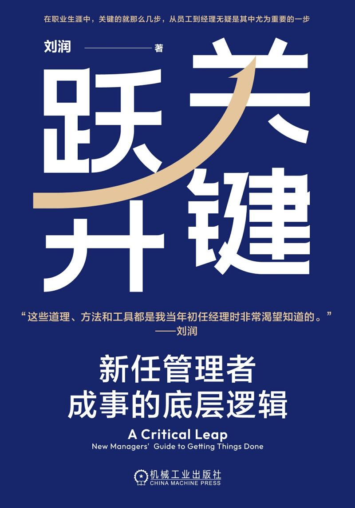
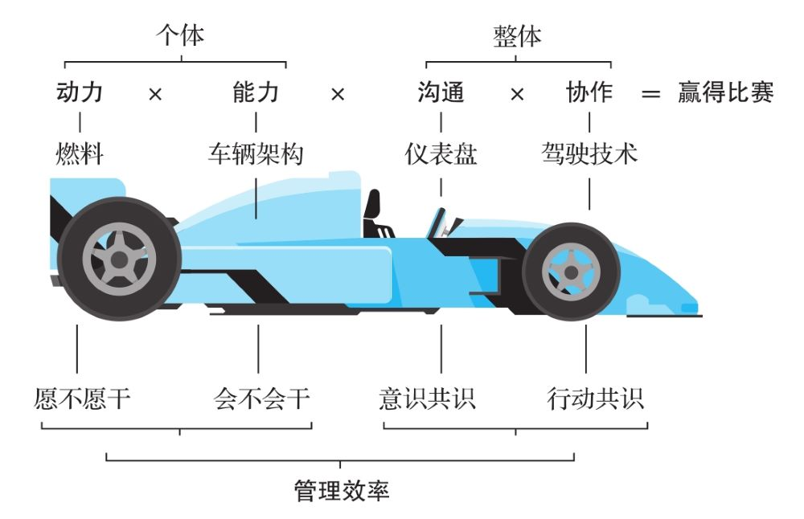
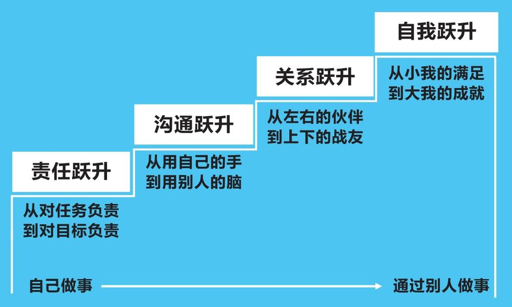
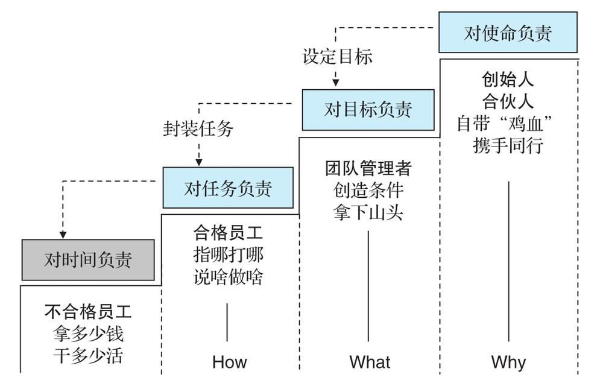
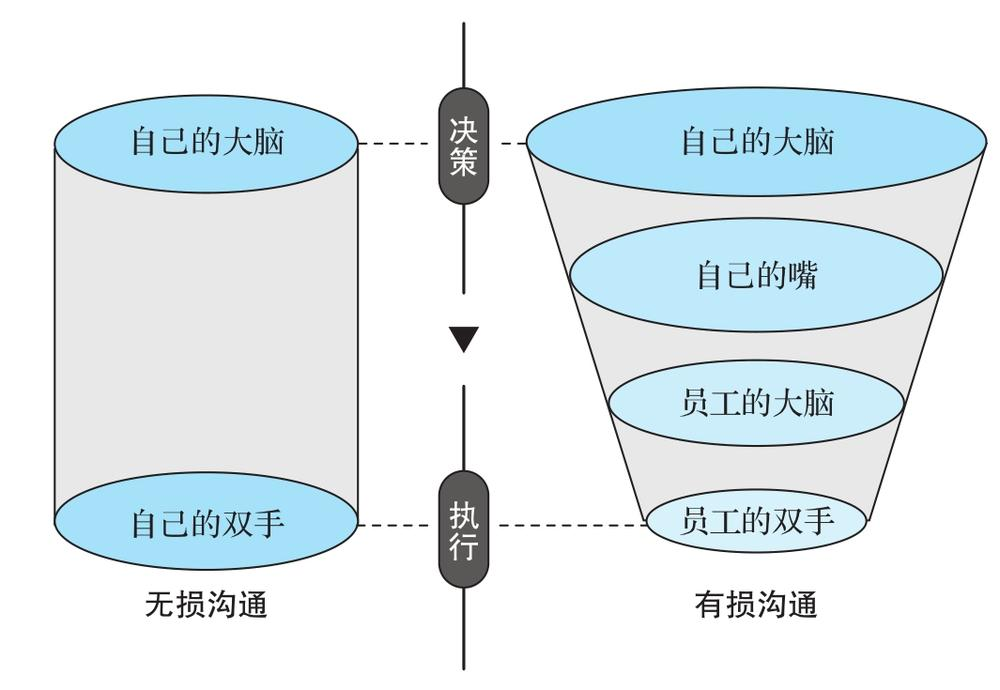
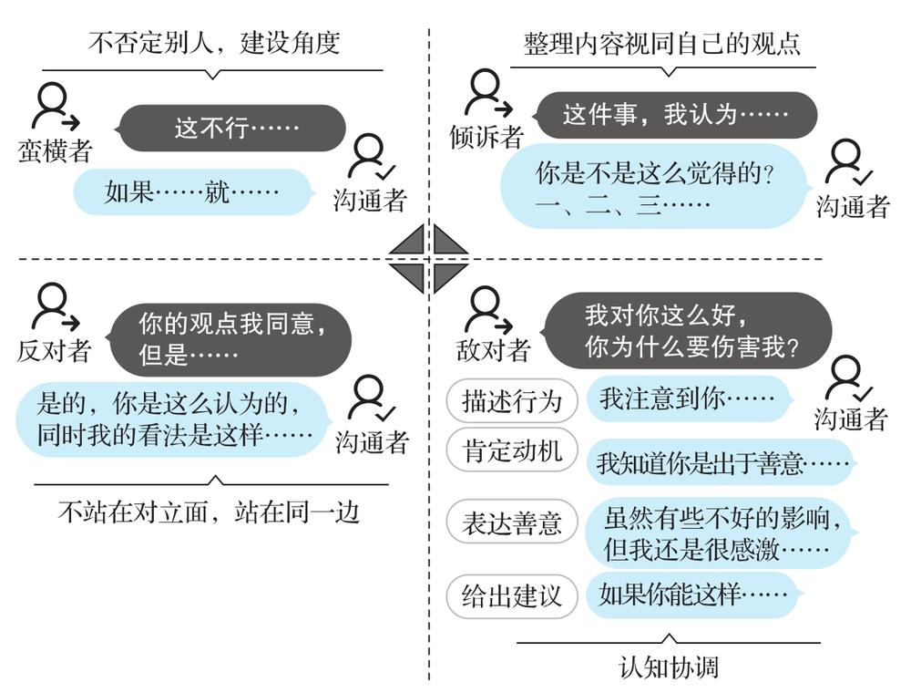
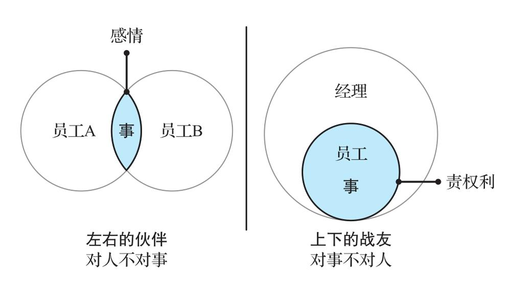
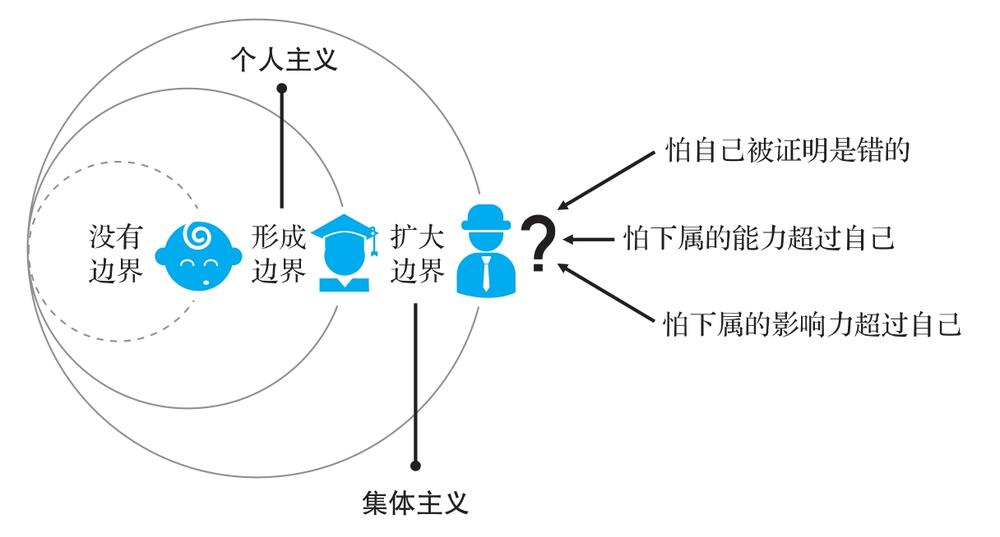
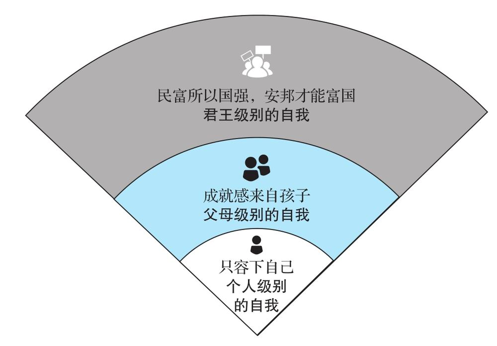

# 关键跃升

- 作者：刘润
- 出版社：机械工业出版社
- 出版时间：2024-07
- ISBN：978-7-111-75699-6
- 豆瓣：https://book.douban.com/subject/36946907
- 封面：

# 序⾔

从个⼈贡献者（Individual Contributor）到团队管理者（People Manager），是⼀次“关键跃升”。以前你⾯对的是事，现在你⾯对的是⼈。这次“关键跃升”，在你的整个⼈⽣中都⾮常重要。它带给⼀个⼈的不只是升职加薪，还伴随着⼼智的成熟。

不少⼈升到总监或者更⾼职位时，依然没有完成“关键跃升”。⽐如，有不少管理者并不清楚公司设⽴管理岗的意义何在，进⽽影响到⾃⼰履职尽责；也有不少⼈不清楚⼀个优秀的管理者应该具备哪些素质和技能，进⽽⽆法明晰⾃⼰弥补短板的⽅向……很多公司⾯临着“中层塌陷”，⼀个重要根源就是“关键跃升”的缺失。

什么是底层逻辑？就是不同之中的相同之处、变化背后不变的东⻄。底层逻辑是有⽣命⼒的。因为在我们⾯临环境变化时，只有底层逻辑才能被应⽤到新的变化中，从⽽产⽣适应新环境的⽅法论。

这套体系包括⼼法和剑法。

⼼法包括四个跃升：

- 责任跃升
- 沟通跃升
- 关系跃升
- ⾃我跃升

具体来说，经理以前对任务负责，现在对⽬标负责；以前⽤⾃⼰的⼿，现在⽤别⼈的脑；以前⼤家是左右的伙伴，现在⼤家是上下的战友；以前追求⼩我的满⾜，现在追求⼤我的成就。

剑法则讲了经理的四个重要⻆⾊：

- ⿎⼿
- 教练
- 政委
- 指挥

# 导论

## 为什么越“不⼲活”的⼈收⼊越⾼

在数量上，这些“不⼲活”的经理和⼲活的⼈相⽐，是什么关系呢？⼤约是1:5的关系。也就是说，⼤概每5个“⼲活的⼈”，就有1个“不⼲活的⼈”管着。

这个“不⼲活的⼈”可以专注在与“⾃然效率”作战上。

## ⾃然效率

什么叫“⾃然效率”？

举个例⼦，10个⼈被安排去种树，组织者提供⼯具和树苗，要求他们多种树、种整⻬。怎么⼲？先分⼯：挖洞、种树、填⼟、浇⽔。然后，这10个⼈就开⼲了。

可是，他们⼲活的效率⽐较低：因为挖洞慢，其他⼈都要等洞挖好了才能开⼯；种树的⼈种完树，发现没⼈填⼟，眼看着那棵树要倒掉，只好先扶着；浇⽔的⼈打好了⽔，但发现前三道⼯序还没完成，那就歇着吧，等⼟填完了再浇⽔。

这种在“⾃发分⼯，随机协作”机制下的⼯作效率，就是“⾃然效率”。

考虑到种树这件事，挖洞花的时间⻓，种树费的⼒⽓⼤，这两项⼯作最艰巨，因此你决定抽调6⼈，分成A、B两组，每组3⼈。A组负责挖洞，B组负责种树。累了之后，两组交换分⼯。由于填⼟快，所以只需要安排1⼈，作为C组，他还能给其他三组做后援。剩下的3⼈组成D组，专⻔负责浇⽔。

按照⾃然效率，10个⼈⼀天只能种20棵树，但是因为你带来了管理效率，10个⼈⼀天种了80棵树。

假如种⼀棵树收⼊100元，在⾃然效率下，10个⼈种20棵，平均每⼈种2棵，那么每个⼈的收⼊是200元。现在因为你⽽多种了60棵，创造了6000元的额外价值。所以，你的收⼊理论上就是6000元，是普通员⼯平均收⼊的30倍。

你的价值，是⽤管理效率打败⾃然效率。你的价值，就体现为在有你和没你两种情况下团队所创造的价值的差额。

**你的价值=团队价值×（管理效率-⾃然效率）**

要体现出你的这⼀价值，你需要⼀次“关键跃升”，⼀次从“个⼈贡献者”到“团队管理者”的跃升，⼀次从⾃⼰拼命⼲活到⾃⼰“不⼲活”但团队产出反⽽更⾼的跃升。

假设你亲⾃下场种树，⽽你并不⽐任何团队成员更有优势，那么你和团队加在⼀起共11个⼈，只能种22棵树，⽐⽤更有效的“分⼯协作法”所种的80棵少了58棵。

这就相当于，你拿着经理的⼯资，却没有做好作为经理的本职⼯作，⽽是去抢员⼯的⼯作⼲，最后让公司“亏”了58棵树，价值是5800元。

什么是“关键跃升”？关键跃升，就是从“个⼈贡献者”到“团队管理者”的跃升。这个跃升的核⼼，不是拥有更⾼的收⼊、更⼤的办公室、更受尊敬的头衔，⽽是从⾃⼰独⽴作战到带领团队“突破⾃然效率”。

那么，经理如何带领团队“突破⾃然效率”呢？——创造管理效率。

## 管理效率

**管理效率=动⼒×能⼒×沟通×协作**

突破⾃然效率的公式

- 动⼒

如果你想让⾃⼰的赛⻋跑得特别快，就得让它有⾜够⼤的动⼒

- 能⼒

这辆⻋的刹⻋系统⽤什么技术，避震系统⽤什么技术，轴距是多少……这些因素决定了⼀辆⻋的架构。⻢⻋怎么都跑不过汽⻋，汽⻋怎么都跑不过⻜机，其能⼒源于其架构，这个架构决定了它能做多⼤的事。对应到⼈身上也是如此，每个⼈的能⼒是不⼀样的。只靠激励不能获得能⼒，能⼒只能通过学习获得。

动⼒是“愿不愿⼲”，能⼒是“会不会⼲”，两者缺⼀不可。动⼒不能解
决能⼒的问题，能⼒也不能解决动⼒的问题。

- 沟通

赛⻋⼿坐进赛⻋之后，⾯前的仪表盘会告诉他这辆⻋的汽油有多少、
速度是多少、⽔箱的温度是多少、现在是什么挡位，这些都是数据。
数据是⽤来沟通的，赛⻋⼿可以根据数据快速做出反馈，通过沟通系
统，快速掌控这辆赛⻋。

- 协作

协作就相当于赛⻋⼿的驾驶技术。赛⻋⼿看到仪表盘上的数据之后，可以打⽅向盘，可以⼿动换挡，打⽅向盘和⼿动换挡都属于驾驶（协作）技术。

员⼯就相当于组成赛⻋的各种零部件，如有的⼈是轮胎，有的⼈是发动机，有的⼈是⽅向盘，有的⼈是联动杆，需要经理来协同。经理不仅需要设计管理的流程，来避免员⼯⼲重复的甚⾄相互冲突的事，还需要设计根据结果持续改进的机制……这些都是团队正常运⾏所必需的协作技术。

以上四个要素，其中动⼒和能⼒是针对个体的，沟通和协作是针对整体的。四个要素彼此相乘，才能得到预期的效率。之所以⽤乘法，是因为其中任何⼀个要素为0，都会导致团队满盘皆输。

## ⼩结

经理突破⾃然效率的底层逻辑，是通过优化流程，⾼效地连接更有动⼒、更有能⼒的⼈，以此创造最⼤的价值。经理创造价值的公式，是“管理效率=动⼒×能⼒×沟通×协作”。

从个⼈贡献者到团队管理者，是⼀次关键跃升。

# 第1章 ⼼法

经理的“⼼法”修炼

责任跃升：从对任务负责到对⽬标负责

- 四种责任感
- 把⽬标拆解成任务

沟通跃升：从⽤⾃⼰的⼿到⽤别⼈的脑

- 有损沟通
- ⾼⼿从不否定对⽅

关系跃升：从左右的伙伴到上下的战友

- 对事不对⼈
- 公司不是家

⾃我跃升：从⼩我的满⾜到⼤我的成就

- 把⾃我的边界扩⼤
- 抵触情绪的源头
- 关注全局效率

这个公式是实现关键跃升的“剑法”。但是，在练习“剑法”之前，我想先讲讲“⼼法”。因为只有⼼法改变了，认知改变了，⾏为才会⾃然地发⽣改变。

**管理效率=动⼒×能⼒×沟通×协作**

这个“⼼法”，就是成为经理之后，接受从“⾃⼰做事”到“通过别⼈来做事”需要的四个⼼理上的跃升：责任跃升、沟通跃升、关系跃升和⾃我跃升。

## 责任跃升：从对任务负责到对⽬标负责

每⼀级管理者都要能扛住上⼀级的所有问责，因为责任是不可以穿透的。美国前总统杜鲁⻔有⼀句名⾔：“问题到此为⽌。”能扛事⼉的才是⼤哥。

团队管理者⼀定要明⽩⼀件事，从员⼯晋升到经理，你⾸先需要经历⼀个重⼤的跃升。这个跃升，叫作责任跃升。你的责任从对任务负责变成了对⽬标负责，这是⼀次质变。

### 四种责任感

“⼯作的核⼼是责任。”组织⾥的不同层级承担着不同的责任。具体到个⼈，⼈们有四种不同的责任感。

#### 对时间负责

概括为8个字：拿多少钱，⼲多少活。

#### 对任务负责

概括为8个字：指哪打哪，说啥做啥。

#### 对⽬标负责

概括为8个字：创造条件，拿下⼭头。

拿下⼭头是⽼板定的⽬标，⾄于怎么拿下，那得靠员⼯⾃⼰创造条件。对⽬标负责的时候，执⾏⼒虽然也重要，但主要⽤的是思考⼒，这是从动⼿到动脑的⼀次跃升。

对⽬标负责，本质上是企业把千头万绪的执⾏问题封装成⼀个⽬标，然后配置相应的资源，交到经理⼿上，经理要拿着资源，对⽬标负全责。

#### 对使命负责

概括为8个字：⾃带“鸡⾎”，携⼿同⾏。

如果⼀个⼈是真的发⾃内⼼地相信公司的使命，他就会有强⼤的内在驱动⼒，也就是“⾃带‘鸡⾎’”。从完成⽬标到达成使命，是职业⽣涯的⼜⼀次跃升，这⼀次是从动脑到动⼼的跃升。

企业⾥不同层级的⼈要有不同的责任感。对时间负责的⼈，基本上是不合格的员⼯。企业对员⼯的基本要求是对任务负责，他们要知道How（怎么做）；企业对经理的基本要求是对⽬标负责，他们要知道What（做什么，即部⻔要达成什么样的⽬标）；企业对创始⼈或合伙⼈的基本要求是对使命负责，他们必须理解Why（为什么做，即公司要达成什么样的使命）。

### 把⽬标拆解成任务

#### 要懂得拆解⽬标

⽬标只能“⾯对”，没法“执⾏”。我们只听说过执⾏任务，没听说过执⾏⽬标，你必须先把⽬标拆解为任务。拆解不同于拆分，拆解是做乘除法，拆分是做加减法。做加减法很容易，但成为经理之后，我们要学会做乘除法。

> 有⼀次我辅导⼀个电商团队。⽼板给经理定了⼀个⽬标，今年要完成5000万元的服装销售额。经理⽴⻢跟我聊：“我的团队⾥有5个⼩伙伴，每⼈完成1000万元⾏不⾏？”我说：“这是不⾏的，这是做加减法，是拆分，不是拆解。”
>
> 拆解是做乘除法。基于对业务的深度理解，可这样拆解销售⽬标。
>
> **销售⽬标=店铺粉丝数×转化率×客单价**
>
> ⾸先得知道店铺的粉丝数，就是有多少⼈关注你的店铺；再看平均每天有多少⼈会下单购买，得出⽇订单量的转化率；最后是看客单价，⽤户平均买了500元的东⻄，还是1000元的东⻄。这个经理最后把5000万元的年度销售⽬标（假设⼀年⼯作300天），拆解为“17.5万粉丝×2.4‰转化率×400元客单价×300天”。其中，最⼤的难点在于第⼀个要素，店铺粉丝数要达到17.5万⼈。这就是我们所说的拆解⽬标。

#### 拆解完⽬标之后，再进⾏拆分

我们以粉丝数的拆分为例，将达成17.5万粉丝的⽬标拆分为季度⽬标：第⼀、第⼆季度的任务要更重些，这样上半年的业绩数据才不⾄于难看。然后怎么做？⼤家纷纷出主意：第⼀，通过优质短视频加粉；第⼆，通过裂变加粉，以打折等优惠活动推动⽤户分享店铺给朋友，朋友加粉后再分享给各⾃的朋友；第三，通过平台做推⼴活动，⽤便宜商品引导加粉。这三个任务分别由不同的员⼯负责。

经理把⽬标拆解为任务之后，每个员⼯就可以专⼼去忙⾃⼰的任务。如果之后还是没达成⽬标呢？这时候经理要记住⼀句话，“降妖除魔你去，背⿊锅我来”。经理要扛住这个责任，因为团队管理者要承担⽬标层⾯的后果，⽽员⼯只承担任务层⾯的后果。

## 沟通跃升：从⽤⾃⼰的⼿到⽤别⼈的脑

升任经理之后，沟通之所以重要，从“⼼法”的层⾯来看，其实是因为过去你⾃⼰能完成的任务，现在要通过员⼯来完成，沟通机制发⽣了变化，你正在从“⽆损沟通”⾛向“有损沟通”，这是⼀次重⼤的跃升。

### 有损沟通

当我们还是员⼯的时候，我们是⾃⼰跟⾃⼰沟通，⾃⼰的⼤脑和⾃⼰的双⼿进⾏沟通，⼼到、眼到、⼿到，⼀⽓呵成，想到就能做到。我们把这叫作“⽆损沟通”。

从⾃⼰的⼤脑指挥⾃⼰的双⼿，变成⾃⼰的⼤脑指挥别⼈的双⼿，沟通过程中多了两个中介。第⼀个中介是⾃⼰的嘴，你⼤脑⾥的信息要通过⾃⼰的嘴传递出去。第⼆个中介是员⼯的⼤脑，它要接受信息，再把信息传递给双⼿。

这两个中介造成了两个问题。第⼀个问题是，⾃⼰的嘴传递信息的时候，造成了信息的损耗，完整度不是百分之百。第⼆个问题是，员⼯的⼤脑接收信息之后，是否真正认同你的指令，现实中往往接受度也不是百分之百，会有信息的损耗。这就叫“有损沟通”。

从员⼯晋升到经理，你需要经历的第⼆个跃升就是：从“⽆损沟通”的⽆须技巧，到具备应对“有损沟通”的⾼超技巧。那怎么做呢？

### ⾼⼿从不否定对⽅

从员⼯晋升到经理，就是从管⾃⼰变成管团队；就是从修身转变为⻬家；就是从继承⼀个进化了百万年的成熟沟通系统，到新开创⼀个系统去管理运⾏。

四种沟通话术:

#### 不要说“这不⾏”，⽽要说“如果……就……”

你缺块砖，就给你加块砖，你缺根⽊头，就给你加根⽊头。“如果……就……”，“如果”的后⾯就是他加上去的建议。

#### 不要说“but”（但是），⽽要说“yes...and...”（是的……同时……）

不说“但是”，⽽是说“是的……同时……”，和说“如果……就……”⼀样，你在不否定员⼯的同时，还提供了更好的建议，接受度会更⾼。

为什么不能说“但是”，因为⼀说“但是”，你就和对⽅站在了对⽴⾯。⽽只有你和对⽅站在同⼀边的时候，才更加有助于达成共识。

#### “你是不是这么觉得的？”

这种话术是罗振宇⽼师教我的。他曾在央视⼯作，经常要采访很多⼈，被采访的⼈⼤多没有接受过表达⽅⾯的训练，往往会⼀⼝⽓说很多。他不能说⼈家啰唆，他会在听完之后说，我帮你总结⼀下，你是不是这么觉得的？然后他说出第⼀点、第⼆点、第三点……他的总结通常会更加清晰，对⽅听完后觉得这确实是⾃⼰的意思，就会表示认可。这样，他就可以按照⾃⼰总结的⼏点来整理⽂字了。

当你说“你是不是这么觉得的？”的时候，对⽅就会把接下来你整理过的内容当成他的观点，你的观点的接受度就会得到极⼤提升。

#### “我知道你是出于善意”

我们不能攻击对⽅的“动机”。我们可以这么沟通：我注意到你最近做了件什么事（描述⾏为），我知道你是出于善意（肯定动机），我看出来了，你还瞒着我，我⾮常感激，谢谢。

### 学员感悟与案例

> ⼩光：权⼒分为三种，即法定权⼒、专业权⼒和魅⼒权⼒。想让⾃⼰的脑指挥别⼈的⼿，要充分理解并运⽤权⼒的作⽤机制。如果你只有法定权⼒，现在年轻的员⼯根本就不听你的，因为“90后”“95后”年轻⼈的成长环境更多元，家境相对优越，个体意识很强，对权威不盲从。所以，团队管理者应将其他两种权⼒发挥到极致。也就是说，要想指挥优秀年轻⼈的⼿，你有两条路：⼀是让他们佩服你，⼆是让他们喜欢你，当然，最好是兼⽽有之。

## 关系跃升：从左右的伙伴到上下的战友

你当上部⻔经理，通常有两种可能：⼀种可能，你是空降的，你从公司内部的⼀个部⻔调到另⼀个部⻔当经理，或者你从公司外部调过来，下⾯的员⼯以前并不认识你；另⼀种可能，你所在部⻔的经理⾛了，你因为业绩突出，被提拔为经理。

### 对事不对⼈

同级的员⼯，是左右的伙伴。左右的伙伴的本质，是我不⽤对你的“事”（也就是业绩）负责。作为同级的员⼯，你我是左右相交的两个圆。在⼤部分情况下，我做我的，你做你的。我们之间偶尔会有合作，基本上是没有直接竞争的。

经理与员⼯，是上下的战友。上下的战友的本质，是⾥外嵌套的两个圆，经理是⼤圆，员⼯是⼩圆，⼤圆包含⼩圆。员⼯的责任是经理的责任的⼀部分，经理要对员⼯的责任负责。你做得不好的部分，过去跟我没关系，现在跟我有关系了。你开始对他有权⼒，他开始对你有责任。

从员⼯晋升到经理，从左右的伙伴到上下的战友，本质上是从对⼈不对事⾛向对事不对⼈。

### 公司不是家

关系跃升⾸先是⼀种认知上的重⼤跃升，也是⼀个⼼理建设的过程，还是⼀个先打碎再重建的过程。

#### 在认识上，清醒地剖析双⽅关系的本质

经理和员⼯的关系既不是家⼈关系，也不是朋友关系，⽽是战⽃友谊

经理跟员⼯，第⼀不是家⼈，第⼆不是朋友

公司或团队是⼀个战⽃单元。是战⽃，就有战⽃⽬标。⼤家是为了达成⽬标⽽集结的，⼀旦⽬标达成，可能就会解散。这个战⽃单元会⻓期存在，但是战⽃单元中的⼈会时常更换，有⼈会加⼊，有⼈会离开。在战⽃中，⼤家会结下深厚的情谊，但这种情谊依然是战⽃情谊。我们在这⾥际会，但我们不是家⼈关系，也不是对⼈不对事的朋友关系。

#### 在⾏动上，经理要和员⼯保持亲⽽不密的关系

经理对员⼯⼀定要认真地关⼼，⽐如关⼼他们的身⼼健康，关⼼他们的持续成⻓，但是不要保持那么亲密的关系，因为越亲密的关系，越容易导致对⼈不对事。

如何做到“亲⽽不密”呢？

⾸先，千万不要拿员⼯的⼀针⼀线。

其次，⽇常交际时不要显得关系过于亲密。

## ⾃我跃升：从⼩我的满⾜到⼤我的成就

你和⽼板讨论⼀个问题。本来聊得好好的，但当你提出了⼀个不同观点时，⽼板突然间脸⾊变得很难看。他本来是⾮常友善的⼈，有时还会跟下属开点⼩玩笑，这时却想尽⼀切办法来压制你，说你不知道全局，同时想⽅设法来证明⾃⼰是对的。

你觉得很奇怪：⽼板怎么变得这么固执，是你的观点错得离谱吗？不是，你的观点可能是有道理的，甚⾄⽼板可能也是同意的。但他不会表现出⾃⼰是同意的，因为他没有办法在下属⾯前承认⾃⼰是错的。

我把这种现象称为 **“瞬间顽固症”** 。 **证明他是对的，⽐证明这件事本身是对还是错更重要。**

有的时候我们不是为了赢得胜利，⽽是为了赢得辩论。为什么会这样？因为他⼼中的⾃我（ego）边界太⼩，能量太强。其实，这个问题你身上也有。

### 把⾃我的边界扩⼤

猎豹移动（原⾦⼭⽹络）CEO傅盛对“⾃我”的看法我⽐较认同，他认为，“⾃我”是⾮常感情化的东⻄，它会在⼈的内⼼建⽴起⼀种⼼理防御机制。因为你不喜欢犯错误的感觉，你的本能就总想强⾏辩驳，别⼈⼀批评，你就怒了；因为你害怕⾯对复杂的东⻄，你就本能地希望把问题简单化。你的出发点不是为了⾯对现实，⽽是充满了“我我我”——这就是⾃我的障碍。

你的同事做得⽐你好，你会有点嫉妒，因为同事在你的⾃我边界之外。但是你的孩⼦做得⽐你好，你会嫉妒吗？不会的。你甚⾄会因为孩⼦做得⽐⾃⼰好⽽更加⾼兴，因为孩⼦进⼊了你的⾃我边界内。他做得好，就是你的更⼤的⾃我做得好。

⼀个⼈的成⻓，就是从没有⾃我边界到形成⾃我边界，再到延展⾃我边界的过程。⾃我边界越⼤的⼈，越能做⼤事。

⾃我的边界很⼩，能量却很强⼤，为什么？因为⼀个⼈⼀旦⾃我认知不协调，就容易产⽣⼼理创伤，所以他必须有能量很强⼤的⾃我，来保护⾃⼰不受伤。

当你是员⼯的时候，有较⼩的⾃我是可以的。但是从员⼯晋升到经理后，这就有问题了，你会不断⾯临关于⾃我的挑战，可能会产⽣三种重要的害怕：

- 怕⾃⼰被证明是错的
- 怕下属的能⼒超过⾃⼰
- 怕下属的影响⼒超过⾃⼰

如果从员⼯晋升成为经理后，你的⾃我还局限在⾃⼰⼀个⼈的范围内，我们称之为“⼩我”，你就很难⾯对和处理好与员⼯的关系。这个时候，你必须经历⼀次重⼤的跃升。你要把⾃我的边界扩⼤，扩⼤到可以将整个团队包含进来。你必须超越“个⼈主义”，具备“集体主义”精神。这是⼀次⾮常难的，但是极其重要的跃升。

### 抵触情绪的源头

这种“不住在⾃⼰⼼⾥”，我不是“我”⽽是“他”，⼼中没有⾃⼰、只有⽬标的状态，是很难修炼的。这也是为什么古⼈说“60⽽⽿顺”。为什么到60岁才能⽿顺？因为你需要先花20年建⽴“⾃我”，再花40年战胜“⾃我”。

### 关注全局效率

怎么扩⼤⾃我的边界，完成这个最难的跃升呢？

经理要懂得关注全局效率，把关注点放在更⼤的格局上：

#### 从个⼈级别的⾃我，⾛向⽗⺟级别的⾃我

你把那些员⼯当成⾃⼰的孩⼦，你看着他们成⻓，希望他们超过⾃⼰

#### 从⽗⺟级别的⾃我，⾛向君王级别的⾃我

君王⼼态是⺠富所以国强，安邦才能富国。有⼀天，当你从⼀个职业经理⼈、⼀个团队管理者变成⼀个真正的企业家的时候，就需要这种君王⼼态。

我们常说“家国天下”，从“个⼈”⾛向“⽗⺟”，就变成了⻬家的胸怀；从“⽗⺟”⾛向“君王”，就变成了治国平天下的胸怀。⼀个⼈的格局、胸怀、⽓度，指的就是这个⼈的⾃我包含了多少东⻄。如果⼀个⼈的⾃我能将整个国家、整个地球甚⾄整个宇宙都包含进去，那么他的格局、胸怀、⽓度就都会达到⼀个全新的⾼度。

### 学员感悟与案例

> 陈长安：关于君王⼼态，君王⼀⽅⾯期待民富国强，另⼀⽅⾯很注意防范功⾼震主。我很担⼼下属的影响⼒超过我，主要体现在两个⽅⾯：⼀⽅⾯，担⼼上层领导认为我是容易被替代的；另⼀⽅⾯，担⼼出现拉帮结派集体造反的情况。我的解决措施是：①持续努⼒提⾼⾃⼰的专业性，以便更加服众；②注重信息通道的管理，严控越级汇报⾏为；③扶持其他成员，稀释个别⼈的影响⼒。

