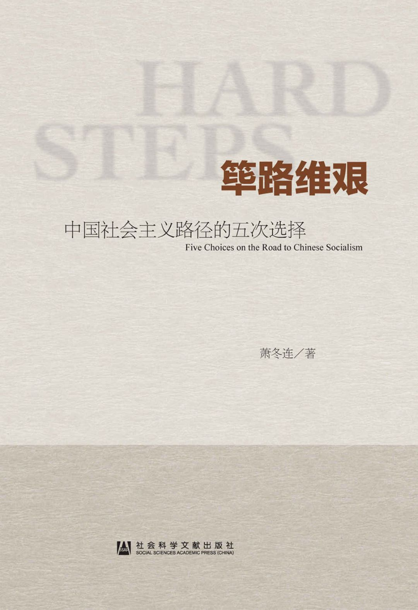

# 筚路维艰：中国社会主义路径的五次选择

- 作者：萧冬连
- 出版社：社会科学文献出版社
- 出版时间：2014-10
- ISBN：978-7-5097-6324-7
- 豆瓣：https://book.douban.com/subject/26171466
- 封面：

## 实行新民主主义

### 一 “新民主主义”的源流

依据人类历史发展五阶段学说，社会主义不可能越过资本主义的发展阶段，在半殖民地、半封建的废墟上直接建立起来。

毛泽东说：“拿资本主义的某种发展来代替外国帝国主义和本国封建主义，不但是一个进步，而且是一个不可避免的过程”。现在的中国“不是多了一个资本主义，相反地，我们的资本主义是太少了”。[12](#f1-12)毛泽东在七大口头政治报告中，还以俄国民粹派来指称中共党内存在的急于搞社会主义的思潮。他说：“所谓民粹主义，就是要直接由封建经济发展到社会主义经济，中间不经过发展资本主义的阶段。”[13](#f1-13)这些论证的思想资源来自列宁。

毛泽东在《论联合政府》的报告中，对蒋介石虽然“批评九分”，但也还“留有余地”，有些话没有说透。当时，毛泽东估计，联合政府有三种前途，一是国民党要共产党“交出军队去做官”；二是形式上民主，承认解放区，实质仍是蒋介石的独裁；第三种前途是以共产党为中心。前两种前途都是以蒋介石为首，第三种前途才是毛泽东心目中的“联合政府”。毛泽东对出现前两种前途是有所准备的，他甚至没有完全拒绝到国民政府做官的可能，认为这至少可以“做宣传工作”。当然，军队和解放区是绝对不交出的。[15](#f1-15)

### 二 中共七届二中全会的建国构想

中共七届二中全会确定的建国构想，承续了《新民主主义论》和《论联合政府》的基本原则，但在提法上有所变化。在政治上，毛泽东提出“人民民主专政”的概念，以代指“各革命阶级联合专政”，放弃了中共六大“工农联合专政”的提法。所谓“人民”，除了原来所列工人阶级、农民阶级、城市小资产阶级外，加入了民族资产阶级，即所谓“四个朋友”。当然，“四个朋友”在人民民主专政中地位不同，民族资产阶级不占“主要的地位”，主体是工农，领导是工人阶级，故称为“工人阶级领导的以工农联盟为基础的人民民主专政”。毛泽东一开始就排除了采用西方议会制和三权鼎立制度的可能，强调在中国采取民主集中制的人民代表大会制度是“很合适的”。[16](#f1-16)

在经济上，七届二中全会提出三大经济纲领，即“没收封建阶级的土地归农民所有；没收蒋介石、宋子文、孔祥熙、陈立夫为首的垄断资本，归新民主主义国家所有；保护民族工商业”。与中共七大相比，区别在第二条，即没收以蒋、宋、孔、陈为首的官僚垄断资本，这在七大时是没有明确的。在土地改革和没收官僚资本以后，新民主主义社会将存在五种经济成分，即国营经济、合作社经济、私人资本主义经济、个体经济以及国家和私人合作的国家资本主义经济，这五种主要经济成分“构成新民主主义的经济形态”。

对这种经济形态不是放任自流。其指导原则和发展方向是：必须以发展国营经济为主体，普遍建立合作社经济，使合作社经济与国营经济密切结合起来。扶助独立的小生产者并使之逐渐地向合作社方向发展。组织国家资本主义经济，在有利于新民主主义的国计民生的范围内，容许私人资本主义的发展，而对于带有垄断性质的经济，则逐步收归国家经营，或在国家监督之下采用国家资本主义的方式经营。对于一切投机操纵及有害国计民生的经营，则用法律禁止之。这就是说，在可能的条件下，逐步增加国民经济中的社会主义成分，加强国民经济的计划性，以便逐步地稳当地过渡到社会主义。[17](#f1-17)

此时，毛泽东的政策基点是两方面：一是“不要急于追求社会主义化”；一是要“好好掌握”，引导整个经济“向社会主义经济发展”。[20](#f1-20)

这种新民主主义经济形态到底需要存在多久呢？在1948年九月会议上，刘少奇说：“过早地消灭资本主义的办法，则要犯‘左’倾的错误”。毛泽东插话说：“到底何时开始全线进攻？也许全国胜利后还要15年。”在做总结讲话时，他又说，要用一二十年时间“努力发展经济，由发展新民主主义经济过渡到社会主义”。[21](#f1-21)在1949年1月召开的中共中央政治局会议上，毛泽东说，完成全国革命任务，这是铲地基，花了三十年。但是起房子，这个任务要几十年工夫。[22](#f1-22)这是毛泽东较早谈及向社会主义过渡的具体时间问题。在这一时间，高层有一个共识，过渡到社会主义需要两到三个五年计划的时间，这比抗日战争时期的设想已经缩短了许多。[23](#f1-23)究竟具备什么条件才能过渡到社会主义呢？任弼时在七届二中全会有个发言，说俄国1913年工业占比重是43.1%，而我们现在还只有10%。虽然我们有苏联的帮助，转入社会主义时，工业的比重总不能少于30%。所以，全国革命胜利后，我们仍需要有两个到三个五年计划才可转到社会主义。[24](#f1-24)毛泽东的论证角度相同，他在七届二中全会报告中说，中国“现代性的工业占百分之十左右，农业和手工业占百分之九十左右”，这90%左右的经济生活还“停留在古代”，这是“革命胜利以后一个相当长的时期内一切问题的基本出发点”。[25](#f1-25)刘少奇在1949年2月8日写的《新中国经济建设的方针与问题》中说，东欧国家过渡了3年，中国可能是10年到15年。[26](#f1-26)

中共领导人是从两个方面考虑过渡条件的：一是生产力的性质，即工业化发展阶段；一是人民是否准备好接受社会主义前途。

关于基本矛盾和主要矛盾的提法，最早是刘少奇在1948年九月会议上提出来的。刘少奇说：“在新民主主义经济中，基本矛盾就是资本主义（资本家和富农）与社会主义的矛盾。在反帝反封建的革命胜利以后，这就是新社会的主要矛盾。”[28](#f1-28)...在1949年3月中共七届二中全会上，毛泽东再次申明新中国社会的基本矛盾是资产阶级和无产阶级的矛盾，并将这一观点写进了全会决议，成为全会的共同观点。毛泽东明确告示：新民主主义社会具有过渡性质，五种经济成分并存是其经济形态，但由于社会主义性质的国营经济起决定作用，其前途必然是社会主义的。[30](#f1-30)是这时，中央还不想突出与资产阶级的矛盾，以“免于过早地警觉资产阶级”。[31](#f1-31)因为当时还有更主要的敌人和更迫切的任务。

### 三 新民主主义纲领的实行

1948年9月至1949年3月，上海、北平、天津、香港等地的民主人士陆续经秘密交通被接到西柏坡或哈尔滨。1949年6月，民主人士陆续随中共领导机关移至北平。在讨论制定《共同纲领》和协商人事等议程中，中共领导人表现出相当开放的态度，对一些资望很高的民主人士礼遇有加，给一些亲历者留下了很深印象。

会议通过的《中国人民政治协商会议共同纲领》，将新民主主义的政治、经济纲领以法律形式确定下来，规定人民民主专政的共和国是“以工农联盟为基础，以工人阶级为领导”的“统一战线的政权”，规定“人民有思想、言论、出版、集会、结社、通讯、人身、居住、迁徙、宗教信仰及示威游行的自由权”。受邀参会的民主党派之齐全，党外人士任职之多，使第一届政府有了“联合政府”的色彩。

延揽如此多的党外人士进入政府，曾引起中共党内许多人的不满。毛泽东解释说：这样“好处很多”，“第一，可以‘赚’人，各方面的非党人物都有当副主席、部长、司令员的，‘朝里有人’，国民党不打自垮...第二，可以‘赚’来四万万人民，‘赚’来土地改革。第三，可以‘赚’一个社会主义。这叫做和平过渡到社会主义”。[33](#f1-33)吸引很大一部分具有管理经验、专业知识和社会名望的精英进入政府，集聚到共产党周围，对于瓦解旧势力、收拢人心、治理和建设国家都有帮助。更
重要的是，把民主党派精英吸纳到政府，也就使他们与共产党同在一条船上，这条船确定无疑是驶向社会主义的。

然而，这并不意味着允许反对党的存在。早些时候，有些民主人士提出，要整合出一个强大政党与中共“发生平衡作用”，意在建立“反对派”。这种主张遭到毛泽东的明确反对。毛泽东告诫民主党派：“这里是要一致，要合作，而不是建立什么‘反对派’，也不是走什么‘中间路线’。”[34](#f1-34)从领导权看，所谓人民民主专政，与无产阶级专政并没有多大区别。1949年1月，毛泽东就向秘密来华的米高扬交了底，他说：“虽然政府的组织形式和苏联、东欧国家有所不同，但其性质与宗旨仍然是在共产党领导下的，将来的目标是实现社会主义和共产主义。”[35](#f1-35)

新民主主义经济既不是传统的资本主义，也不是传统的社会主义，而是一种“混合型”经济模式。它与资本主义的区别在于：（1）发展国营经济作为领导力量；（2）限制不利于国计民生的资本主义的发展；（3）帮助农民发展互助合作，避免大批农民破产和两极分化。

1948年7月27日，新华社信箱“农业社会主义问答”，批评要求平分一切土地财产、平分工商业的思想是一种“农业社会主义思想”，这种思想“是反动的，落后的，倒退的”。“问答”强调，我们要达到社会主义，“必须经过新民主主义经济一个时期的发展，在新民主主义社会中大量地发展公私近代化工业”。[36](#f1-36)

1949年4～5月，刘少奇的天津之行，就是受毛泽东之托去“稳住工商界”，让私人企业尽快复工。刘到天津后，做了两方面的工作：一方面，打消资本家的顾虑，帮助他们解决困难；另一方面，克服干部和工人中的“左”倾情绪，说服工人不要提出过高要求。刘少奇认为，除了要解决公私矛盾和劳资矛盾以外，还要恢复对外贸易和城乡沟通，也就是要解决市场问题。毛泽东赞同刘少奇的观点，把它概括为“公私兼顾、劳资两利、内外交流、城乡互助”四句话，后称为“四面八方”政策。

刘少奇在天津做了许多讲话，后来引起争议的是关于“剥削有功”的说法。针对资本家怕称自己是“资本家”、怕听“剥削”二字的情况，刘少奇说，剥削是由社会制度决定的，资本主义的剥削方式代替封建主义剥削方式是一个巨大进步。马克思说过，资本主义一百年间将生产力空前提高，比有史以来几千年生产的总和还多。从发展生产力看，资本家阶级剥削是有其历史功绩的。今天中国资本主义还在青年时代，正是建功立业的时候。今天，资本主义的剥削不但没有罪恶，而且有功劳。不是工厂开得太多，工人受剥削太多，而是太少。你们有本事多剥削，对国家人民都有利。[40](#f1-40)

邓小平后来说：“我们刚进城，最怕的是‘左’”，刘的讲话“起了很好的作用”。[41](#f1-41)

然而，刘少奇有关“剥削有功”“剥削越多越有利”的说法，对于以消灭剥削、消灭阶级为最高理想的中国共产党人来说，听起来很刺耳，先是受到东北局书记高岗的非议，有资料说，毛泽东看到刘天津讲话的记录时，不满“形于颜色”。[42](#f1-42)毛泽东本人也许认同刘在天津的工作及他提出的政策，[43](#f1-43)但对刘的一些说法很不以为然。5月，毛泽东与天津市委书记黄克诚私下谈话时明确讲，今后“主要任务还是阶级斗争，要解决资产阶级的问题”。[44](#f1-44)这与刘少奇的说法分歧显见。在利用与限制之间，刘少奇倾向于利用资本主义来发展经济，毛泽东更重视阶级力量的消长和对资产阶级的控制。虽然毛泽东要求，从接管城市的第一天起，“中心任务”就是“生产事业的恢复和发展”，但他始终没有忘记同资产阶级的斗争。[45](#f1-45)他的意思是，发展生产不能放松阶级斗争这根弦。

据说，有党外人士询问毛泽东：中国什么时候搞社会主义？毛泽东回答：过渡到社会主义“大概二三十年吧！”[48](#f1-48)中共领导人不将“社会主义前途”写入《共同纲领》，其目的在稳定人心，避免“强迫于人”；同时，也为避免在执行当前政策时出现混乱。然而，由于没有一个明确的过渡时间表，反而使随时结束新民主主义少了法律上的制约。 

### 四 理想与政策之间的张力

在新民主主义制度存废的问题上，毛泽东的意向起着决定性的作用。然而，我们也看到，在各级领导层，急于搞社会主义的想法有相当的基础。根源就在于，社会主义理想与新民主主义政策之间存在紧张关系。尽管领导人对新民主主义的必要性讲了不少，并见诸重要文献，许多共产党干部仍然难以理解新民主主义何以必须。正如周恩来所说，一些同志“不相信按照共同纲领不折不扣地做下去，社会主义的条件就会逐步具备和成熟”，总是“急于转变到社会主义”。[49](#f1-49)

1950年3月，在第一次全国统战工作会议上，不少人在发言中提出“今天斗争对象，主要是资产阶级”。更有人认为，革命既已胜利，民主党派任务已了，已无存在的必要性。[53](#f1-53)毛泽东、刘少奇、周恩来等人不得不针对党内急躁情绪做说服工作。同年6月，中共七届三中全会决定调整工商业，通过为私商让出一定市场份额、扩大国家收购和加工订货、调整税负等措施，帮助私人工商企业渡过难关。在会上，毛泽东提出“不要四面出击”的方针。他说：“有些人认为可以提早消灭资本主义实行社会主义，这种思想是错误的，是不适合我们国家的情况的。”[54](#f1-54)不过，毛泽东是从策略上提出问题的。当时，大陆战事基本结束，但西藏、台湾尚待解放，外部威胁仍然严峻；3.1亿人口的土改尚未开展，尤其是被战争破坏得千疮百孔的经济恢复起来尚待时日。

当月，毛泽东在全国政协会上说，中国实行私营工业国有化和农业社会化“还在很远的将来”。他安抚党外人士说，只要战争关、土改关都过去了，剩下社会主义一关就将容易过去。[55](#f1-55)1951年5月7日，刘少奇说：“现在有人就讲社会主义，我说：这是讲早了，至少早讲了十多年。”[56](#f1-56)13日，刘又说：现在工业只占10%，要发展到占40%～50%，哪怕你跑得再快，总还要10年、20年。[57](#f1-57)到1951年，在新民主主义存在的时间估计上，毛、刘、周仍是一致的，至少从言论上看是这样。

<b id="f1-12">[[12]](#a1-12)</b> 《毛泽东选集》第3卷，第1060页。

<b id="f1-13">[[13]](#a1-13)</b> 《毛泽东文集》第3卷，第323页。
  
<b id="f1-15">[[15]](#a1-15)</b> 《毛泽东文集》第3卷，第277页。

<b id="f1-16">[[16]](#a1-16)</b> 毛泽东在1948年9月会议上的讲话，中共中央文献研究室编《毛泽东年谱（1893～
1949）》下卷，中央文献出版社，2013，第344页。

<b id="f1-17">[[17]](#a1-17)</b> 《刘少奇选集》上卷，人民出版社，1981，第428页。

<b id="f1-20">[[20]](#a1-20)</b> 《毛泽东文集》第5卷，第236页。

<b id="f1-21">[[21]](#a1-21)</b> 参见薄一波《若干重大决策与事件的回顾》，第47页。

<b id="f1-22">[[22]](#a1-22)</b> 《毛泽东文集》第5卷，第236页。

<b id="f1-23">[[23]](#a1-23)</b> 1944年8月，博古在同约翰·谢伟斯谈话中说：“我们至少比世界其余大多数国家落后200年。我们要在世界上大多数国家都到达那个状态（指社会主义）以后，才可能有希望到达社会主义。”“我们可以确信，它将多于30年或40年，而且可能要100多年。”如果这份记录准确，这是中共领袖层对新民主主义社会存续时间最长的一种估计。1945年3月13日，毛泽东在同谢伟斯谈话中说：“不管是农民还是全体中国人民，都没有为实现社会主义而作好准备。在未来的很长时间内，他们不会准备好的。必须经历漫长的、民主管理的私人企业时期。侈谈立即进入社会主义是‘反革命的思想’，因为它不现实，而想实行它总会自招失败”。毛没有给出具体时间表，但也认为将是长期的。见〔美〕约瑟夫·W.埃谢里克编《在中国失掉的机会》，罗清等译，国际文化出版公司，1989，第267、264～265、328页。

<b id="f1-24">[[24]](#a1-24)</b> 《任弼时选集》，人民出版社，1987，第465页。

<b id="f1-25">[[25]](#a1-25)</b> 《毛泽东选集》第4卷，第1430页。

<b id="f1-26">[[26]](#a1-26)</b> 《中国赫鲁晓夫刘少奇反革命修正主义言论集（1945年8月～1957年12月）》，人民日报社资料室编印，1967，第188页。

<b id="f1-28">[[28]](#a1-28)</b> 《刘少奇论新中国经济建设》，第29～30页。

<b id="f1-30">[[30]](#a1-30)</b> 薄一波：《若干重大决策与事件的回顾》（上），第26页。

<b id="f1-31">[[31]](#a1-31)</b> 《刘少奇论新中国经济建设》，中央文献出版社，1993，第29页。

<b id="f1-33">[[33]](#a1-33)</b> 转见薄一波《若干重大决策与事件的回顾》，第34页。

<b id="f1-34">[[34]](#a1-34)</b> 见毛泽东在1949年元旦发表的《将革命进行到底》，《毛泽东选集》第4卷，第1375页。

<b id="f1-35">[[35]](#a1-35)</b> 《毛泽东年谱（1893～1949）》下卷，第450页。

<b id="f1-36">[[36]](#a1-36)</b> 《目前形势和我们的任务》标准本，解放社编印，1949年第4版，第138～144页

<b id="f1-40">[[40]](#a1-40)</b> 人民日报社资料室编《中国赫鲁晓夫刘少奇反革命修正主义言论集（1945.8～1957.12）》，第234～238页。

<b id="f1-41">[[41]](#a1-41)</b> 《邓小平文选》第1卷，人民出版社，1994，第205～206页

<b id="f1-42">[[42]](#a1-42)</b> 薄一波：《若干重大决策与事件的回顾》，第198页。

<b id="f1-43">[[43]](#a1-43)</b> 1949年5月31日，毛泽东将刘少奇关于对待民族资产阶级的政策问题给东北局电转发各中央局，亲撰按语要求各地“认真克服对待民族资产阶级的'左'倾机会主义错误”。见《毛泽东年谱（1893～1949）》下卷，第514页。

<b id="f1-44">[[44]](#a1-44)</b> 《黄克诚自述》，人民出版社，1994，第217页。

<b id="f1-45">[[45]](#a1-45)</b> 1948年10月26日，毛泽东致信刘少奇，对张闻天起草的《关于东北经济构成及经济建设基本方针的提纲》修改稿提出意见，明确我们的整个经济政策是限制私人资本的，“有益于国计民生”就是一条极大的限制，达到这一点，必须经常和企图脱出“国计民生”轨道的私人资本做斗争。见《毛泽东年谱（1893～1949）》下卷，第373页。

<b id="f1-48">[[48]](#a1-48)</b> 参见石仲泉《毛泽东的艰辛开拓》，中共党史出版社，1992，第148页。

<b id="f1-49">[[49]](#a1-49)</b> 周恩来：《发挥人民民主统一战线积极作用的几个问题》（1950年4月13日），《周恩来统一战线文选》，人民出版社，1984，第169页。

<b id="f1-53">[[53]](#a1-53)</b> 《建国以来毛泽东文稿》第1册，中央文献出版社，1987，第292～294页。

<b id="f1-54">[[54]](#a1-54)</b> 《毛泽东文集》第6卷，人民出版社，1999，第71页。

<b id="f1-55">[[55]](#a1-55)</b> 《毛泽东文集》第6卷，第80页。

<b id="f1-56">[[56]](#a1-56)</b> 农业部办公厅编《农业集体化重要文件汇编（1949～1957）》（上），中共中央党校出版社，1981，第31页。

<b id="f1-57">[[57]](#a1-57)</b> 转见张静如主编《中国共产党思想史》，青岛出版社，1991，第321页。
