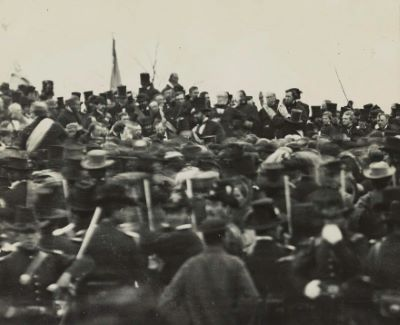
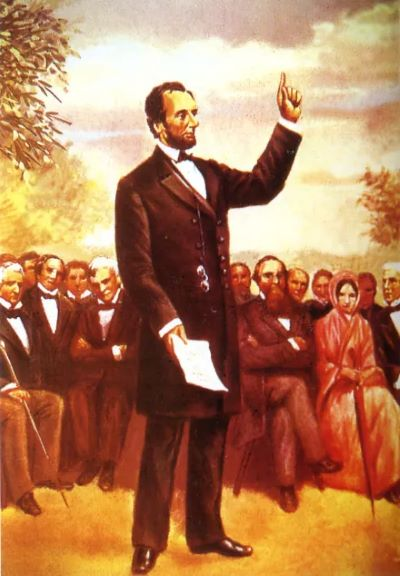

# 葛底斯堡演说

林肯

> 葛底斯堡演说发表于美国南北战争期间。是美国前总统林肯最著名的演说，也是美国历史上为人引用最多之演说。1863年11月19日，林肯在宾夕法尼亚州的葛底斯堡的葛底斯堡国家公墓揭幕式中发表此次演说，哀悼在葛底斯堡之役中阵亡的将士。尽管这场演说名垂青史，声震寰宇，其确切之措辞却颇受争议。五份已知的演说稿，与当时新闻报道中的誊抄本，于若干细节上彼此互异。

# 原文

Four score and seven years ago our fathers brought forth ,on this continent, a new nation, conceived in Liberty, and dedicated to the proposition that all men are created equal.

Now we are engaged in a great civil war, testing whether that nation, or any nation so conceived and so dedicated, can long endure. We are met on a great battle-field of that war. We have come to dedicate a portion of that field, as a final resting place for those who here gave their lives that nation might live. It is altogether fitting and proper that we should do this.

But, in a larger sense, we can not dedicate -- we can not consecrate -- we can not hallow -- this ground. The brave men, living and dead, who struggled here, have consecrated it, far above our poor power to add or detract. The world will little note, nor long remember what we say here, but it can never forget what they did here. It is for us the living, rather, to be dedicated here to the unfinished work which they who fought here have thus far so nobly advanced. It is rather for us to be here dedicated to the great task remaining before us -- that from these honored dead we take increased devotion to that cause for which they gave the last full measure of devotion -- that we here highly resolve that these dead shall not have died in vain -- that this nation, under God, shall have a new birth of freedom -- and that government of the people, by the people, for the people, shall not perish from the earth.

# 翻译

八十七年前，我们的先辈们在这个大陆上建立了一个全新的国家，它受孕于自由的理念，并献身于人人生而平等的理想。

如今我们正在从事一场伟大的内战，以考验我们或任何一个受孕于自由并献身于上述理想的国家是否能够长久生存下去。现在，我们聚集在战争中的一个重要的战场上，我们来到这里，是要把这个战场土地的一部分奉献给那些为使这个国家能够生存下去而献出了自己宝贵生命的烈士们作为最后安息之所。我们这样做是完全应该而且是非常恰当的

但是，从更广泛的意义上来说，不是我们奉献、圣化或神化了这块土地，而是那些活着的或者已经死去的、曾经在这里战斗过的英雄们使得这块土地成为神圣之土，其神圣远非我们的渺小之力可增减。世人不会注意，也不会记住我们在这里说过什么，但是他们永远无法忘记那些英雄们的行为。这更要求我们这些活着的人去继续那些英雄们所为之战斗的未尽事业。我们应该在这里把自己奉献于仍然留在我们面前的伟大任务——要从这些光荣的死者身上汲取更多的献身精神，来完成他们已经完全彻底为之献身的事业；我们要在这里下定最大的决心，不让这些死者白白牺牲——要使这个国家在上帝保佑下得到新生——要使这个民有、民治、民享的政府永世长存。
