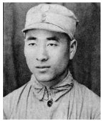

# 怎样当好一名师长

林彪

一九三六年十二月

> 一九三六年十二月，我在抗大学习以后回到前方工作的时候，林军团长告诉我：中央、军委决定我由师政治委员改做师长工作，当时我问军团长说，我当不好师长。在我的要求下，林军团长专门同我讲了一次怎样当师长的问题，讲的很深刻很精辟，几十年来，林军团长的这个指示始终鲜明的烙印在我的脑海里。我一直运用它来鞭策自己，检查自己，做为我学习奋斗的准则。林军团长一共讲了九条。这里是根据当时谈话笔记整理的。
>
> ——杨成武

## 一、要勤快

要勤快，不勤快的人办不好事情，不能当好军事指挥员。应该自己干的事情一定要亲自过问，亲自动手。

比如，应该上去看的山头就要爬上去，应该自己了解的事情就要及时了解，应该检查的问题就要严格检查，不能懒，军事指挥员切记懒，因为懒会带来危险，带来失败。

又比方说，一个军事指挥员，到了宿营地就进房子，搞水洗脚洗脸，搞鸡蛋煮面吃，吃饱了就睡大觉。他对住的村子有多大，再什么位置，附近有几个山头，周围有几条路，敌情怎么样，群众条件怎么样，可能发生什么情况，部队到齐了没有，哨位在什么地方都不知道，发生紧急情况的处理方案如何都不过问，都不知道，这样，如果三更半夜发生了情况，敌人来个突然袭击，就没有办法了。到那时候，即使平时很勇敢的指挥员，也会束手无策，只好三十六计，走为上策。结果变成一个机会主义者。

机会主义者打败仗，常常是因为没有思想准备，没有组织准备，工作没做到家，懒的结果。

因此，不论大小指挥员都要勤快，要不惜走路，不怕劳累，要多用脑子，要做到心到、口到、脚到、手到，事情没有做好之前，不能贪闲，贪闲就隐伏着犯错误的根子，什么事情都要心中有底，“凡事予则立，不予则废。”

“雷打不动”的干部，牛皮糖式的干部，不管有多大本事，都不是好干部，我最喜欢勤快的干部，提倡勤快。

## 二、要摸清上级的意图

对上级的意图要真正理解，真正融会贯通，真正认识自己所领受的任务在战役、战斗全局中的地位和作用。

这样，才能充分发挥自己的主观能动性，才能打破框框，有敢于和善于在新情况中找到新办法的创造性，才能有大勇，才能决心强、决心狠，敢于彻底胜利，有强烈的吃掉敌人的企图和雄心。

指挥员的勇敢表现在歼敌决心的坚定顽强上面；指挥员的大勇建立在革命的最高自觉性和正确理解上级意图的基础上面。

## 三、要调查研究

没有调查研究就没有发言权，这是毛主席早就讲了的。

对于敌情、地形、部队的情况和社会的情况要做到心中有数，要天天摸，天天琢磨，不能间断，这样做不能看作是重复，而是不断深化不断提高的过程，是取得正确认识的比不可少的手段。

平时积累的掌握的情况越多，越系统，在战时，特别是在紧张复杂的情况下，就越沉着，越有办法，急中生智的“智”才有基础。

因此，调查研究工作要贯穿在各项工作之中，要贯穿在每一次战役、战斗的整个过程，反对打莽种仗、反对急性病、反对不亲自动手做调查研究的懒汉作风。

特别是敌情必须切实摸透，因为敌情是活的。

敌人必然会极力隐蔽，伪装他们的真实企图和决心。要尽一切可能不间断的侦察，查清敌人的部署和动向，看他扮演的是什么角色？是主角还是配角？是主力还是非主力？是骄兵还是败兵？能集中多大兵力向我进攻和阻挡我们的进攻？查明敌军官的特性，看他惯用和擅长用什么战法，根据他当前的企图判断他可能采用什么战法等等。

只要摸清了敌情、我情、地势的底，决心就快、就硬、就坚决，就不会被任何困难吓倒。

如果情况不清，就回犹豫不定，举棋不定，坐失良机，或者勉强下了决心，一遇风吹草动，听到艰难叫苦或不正确的建议，就容易动摇，可能一分之差，前功尽弃。

调查研究也包括多读一些书，首先就要研究和读好毛主席的“中国革命的战争战略问题”和毛主席的各项指示。不仅要读革命的书，还应读敌人的书，研究敌人，经常总结经验教训，这样自己才有锐利的思想武器，才能针对敌情克敌制胜的好办法，把力量用到刀刃上。

## 四、要有活地图

指挥员和参谋必须熟悉地图，要经常读地图，熟识地图可以产生见解、产生智慧、产生办法、产生信心。

读的办法要把地图挂起来，搬个凳子坐下来对着地图看，看要从大的方向到活动地区，从地区全貌到每一块地形的地形特点，从粗读到细读，逐地逐块的读，用红蓝铅笔把主要的山脉、河流、城镇、村庄和道路标划出来，边划边读，等到地图差不多划烂了也差不多把地图背熟了，背出来了。

在熟读地图的基础上，要亲自组织有关指挥员和参谋对作战地区和战场进行实地勘察，校正地图，把战场的地形情况和敌我双方兵力部署都装到脑子里去，做到闭上眼睛面前就有一幅鲜明的战场图景，离开地图也能指挥作战。

这样，在你死我活，瞬息万变的战斗情况下可以比敌人来得快，争取先机，先敌一着，掌握主动，稳操胜卷。

你们强渡乌江的战斗所以能够很快突过去，就是因为在战前熟悉地图，细致地进行了战场勘测，正确的选择了渡河点。

## 五、要把各方面的问题想够想透

每一次战役战斗的组织，要让大家提出各种可能发现的问题，要让大家来找答案，把所有提出的问题都回答了，再没有问题可回答了，这样打起仗来才不会犯大错误，万一犯了错误，也比较容易纠正。

没有得到答案的问题，不能因为想了很久想不出来就把它丢开，留一个疙瘩。如果这样是很危险的。在紧要关头这个疙瘩很可能冒出来，就会使你心中无数，措手不及。

当然在战争环境中，要考虑的问题很多，不可能一次都提完，也不可能一次都回答完。整个战役战斗的过程，就是不断的提出问题和不断的回答问题的过程。

有时脑子里很疲劳，有的问题可能立即回答不了，这是除了好好的和别人商量之外，就好好的睡觉，睡好了睡醒了，头脑就清醒了，再躺在床上好好想一想，就可能开窍，可能想通了，回答了，解决了。

总之，对每一个问题都不能含糊了事，问题回答完了，战役、战斗的组织才算完成。

## 六、要及时下达决心

在什么样的情况下可以下决心打呢？

指挥员必须以最大的努力去组织战役，战斗的准备工作，力求确有把握才动手，不打无把握无准备之仗。但是任何一次战斗都不可能完全具备各种条件，不可能有百分之百的把握。

一般说有百分之八十左右的把握就很不错了。就要坚决的打，放手地打。

不足的条件要通过充分发挥人的因素作用，依靠人民群众的力量，充分发挥人民军队特有的政治上的优势，充分发挥指挥员的智慧和英勇顽强的战斗作风来弥补，以主观努力来创造条件，化冒险性为创造性取得胜利。

敌人的士兵多是穷人出身，同革命军队打仗，它的战斗力不会强，不能同我们比。你看，泸定桥不是冒过去了？直罗镇那个晚上的战斗，不是以一个连打垮了敌人的一个团的进攻？一点险都不敢冒就打胜仗，世界上还没有这样的战例。

我这样讲不是提倡了冒险主义，不是无根据的冒险，这样冒险是有根据的。

其实这样并非冒险，根据就是我们的部队是党领导的，是毛主席教养出来的部队，不怕苦、不怕死，最勇敢，最聪明，最有纪律，最坚决执行命令，有很高的政治觉悟，我们是革命的军队，打仗有人民群众积极支持，人民群众是站在我们这一边，是帮助我们的，我们依靠人民群众，就可能把敌人封锁起来，就可以把敌人变成聋子、瞎子、傻子。

这种政治上的优势就是我们所独有，在战争中可以转化为一种巨大的物质力量，有了这一条，有百分之七八十的把握，就可以下决心打。对于比较弱的敌人，对没有或缺乏准备的敌人，有百分之六十的把握也可以打，可以把它消灭。

## 七、要有一个很好的很团结的班子

领导班子的思想认识一致，行动要协调、合拍，要雷厉风行，要有革命英雄主义的气概。

都要勤快，都要千方百计的办好事请，完成任务，不相互扯皮，不相互干扰，抱旁观者的态度。

如果领导班子不好，人多不但无用，反而有害，所以，班子问题，从领导角度来讲，是一个重要的问题，是做好工作，带好部队打好仗的关键。

## 八、要有一个好的战斗作风

有好的战斗作风的部队才能打好仗，打胜仗。

好的战斗作风首先是不怕苦，抢着去担负最艰巨的任务，英勇顽强，不怕牺牲，猛打猛冲猛追。特别要勇于穷追。因为把敌人打跨以后，追击是解决战斗，扩大战果，彻底消灭敌人的最关键的一着，在追击的时候，要跑步追，快步追，走不动的扶着拐棍追，就是爬、滚也要往前追，只有抓住敌人，才能消灭敌人。好的战斗作风要平时养成，要靠实际锻炼，要在紧张的残酷的战斗中才能锻炼出来。

不敢打硬仗、恶仗的部队让他打几仗就打出来了，因为已经见过恶仗、硬仗的场面，有了体会，有了经验，知道怎么打了，百炼成钢就是这个道理。

做工作也要有好的作风，说了就要做，说到哪里就做到哪里，要做到干净利索，要一竿子插到底，一点不含糊，不做好不撒手。

好的作风养成关键在于干部。

强将手下无弱兵，干部的作风怎么样，部队的作风就会怎样。

因此，首先，要抓好干部，要干部做好样子，影响带动部队，或者原来基础较弱的部队，也会很快打出好的作风来，想铁锤子一样，砸到哪里，哪里就碎。

## 九、要重视政治，亲自做政治工作

（笔记：同第八条一致，都是除业务能力之外的政治工作，抓员工的思想工作，鼓足员工的干劲，同样重要。）

部队战斗力的提高，要靠平时加强党的领导，坚强的政治工作连队的支部一定要建设好。

支部工作要作活，就是要把所有的党团员的革命干劲鼓得足足的，充分发挥他们模范带头作用，通过他们把全连带动起来，通过他们去做政治思想工作，提高全体指挥员的阶级觉悟，有了坚强的党支部的领导，有了坚强的政治工作，就可以做到一呼百应，争前恐后，不怕牺牲、前扑后续。

战术、技术也要练好，特别是技术，如果枪打不准，战场上就不能消灭敌人，不能解决战斗，因此，军事训练不能马虎。

党政工作要领导好训练。艺高人胆大，部队有了高度的无产阶级觉悟，有了好的战斗作风，再加上过硬的作战本领，就如虎添翼，就可以无敌于天下。

军事指导员任何时候都不能忘记政治，要亲自做政治工作，调一批政治干部去做军事干部，不仅不会削弱政治工作，实际上是加强了部队的政治工作。
