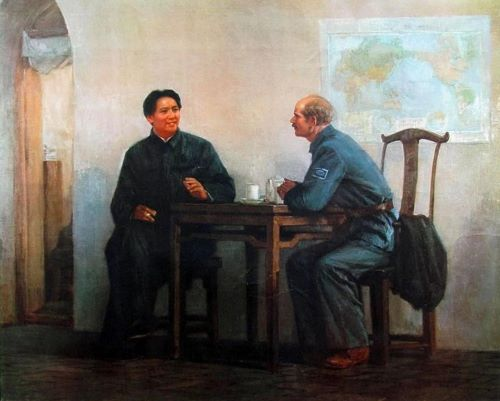

# 纪念白求恩

毛泽东

> 《纪念白求恩》是毛泽东在1939年12月21日为纪念白求恩写的悼念文章。文章概述了白求恩同志来华帮助中国人民进行抗日战争的经历，表达了对白求恩逝世的深切悼念，高度赞扬了他的国际主义精神、毫不利己专门利人的精神和对技术精益求精的精神，并号召全党向白求恩同志学习。

白求恩[[1]](#f1-1)同志是加拿大共产党员，五十多岁了，为了帮助中国的抗日战争，受加拿大共产党和美国共产党的派遣，不远万里[[2]](#f1-2)，来到中国。去年春上到延安，后来到五台山[[3]](#f1-3)工作，不幸以身殉职[[4]](#f1-4)。一个外国人，毫无利己的动机，把中国人民的解放事业当作他自己的事业，这是什么精神？这是国际主义的精神，这是共产主义的精神，每一个中国共产党员都要学习这种精神。列宁主义认为：资本主义国家的无产阶级要拥护殖民地半殖民地人民的解放斗争，殖民地半殖民地的无产阶级要拥护资本主义国家的无产阶级的解放斗争，世界革命才能胜利[[5]](#f1-5)。白求恩同志是实践了这一条列宁主义路线的。我们中国共产党员也要实践这一条路线。我们要和一切资本主义国家的无产阶级联合起来，要和日本的、英国的、美国的、德国的、意大利的以及一切资本主义国家的无产阶级联合起来，才能打倒帝国主义，解放我们的民族和人民，解放世界的民族和人民。这就是我们的国际主义，这就是我们用以反对狭隘民族主义和狭隘爱国主义的国际主义。

白求恩同志毫不利己专门利人的精神，表现在他对工作的极端的负责任，对同志对人民的极端的热忱。每个共产党员都要学习他。不少的人对工作不负责任，拈轻怕重[[6]](#f1-6)，把重担子推给人家，自己挑轻的。一事当前，先替自己打算，然后再替别人打算。出了一点力就觉得了不起，喜欢自吹，生怕人家不知道。对同志对人民不是满腔热忱，而是冷冷清清，漠不关心，麻木不仁[[13]](#f1-13)。这种人其实不是共产党员，至少不能算一个纯粹的共产党员。从前线回来的人说到白求恩，没有一个不佩服，没有一个不为他的精神所感动。晋察冀边区[[7]](#f1-7)的军民，凡亲身受过白求恩医生的治疗和亲眼看过白求恩医生的工作的，无不为之感动。每一个共产党员，一定要学习白求恩同志的这种真正共产主义者的精神。

白求恩同志是个医生，他以医疗为职业，对技术精益求精[[8]](#f1-8)；在整个八路军医务系统中，他的医术是很高明的。这对于一班[[9]](#f1-9)见异思迁[[10]](#f1-10)的人，对于一班鄙薄[[11]](#f1-11)技术工作以为不足道、以为无出路的人，也是一个极好的教训。

我和白求恩同志只见过一面。后来他给我来过许多信。可是因为忙，仅回过他一封信，还不知他收到没有。对于他的死，我是很悲痛的。现在大家纪念他，可见他的精神感人之深。我们大家要学习他毫无自私自利之心的精神。从这点出发，就可以变为大有利于人民的人。 **一个人能力有大小，但只要有这点精神，就是一个高尚的人，一个纯粹的人，一个有道德的人，一个脱离了低级趣味的人，一个有益于人民的人。**

<b id="f1-1">[[1]](#a1-1)</b> 诺尔曼·白求恩（1890—1939），国际主义战士，加拿大共产党党员，胸外科医生。1936年德意志法西斯侵犯西班牙时，他曾经亲赴前线为反法西斯的西班牙人民服务。1937年中国抗日战争爆发，他率领由加拿大人和美国人组成的医疗队，于1938年初来中国，3月底到达延安，不久赴晋察冀边区，在那里工作了一年多。有一次为伤员施行急救手术时受感染，1939年11月12日在河北唐县逝世。  

<b id="f1-2">[[2]](#a1-2)</b> 不远万里：不以万里为远，不顾万里长途的遥远。远，以……为远。  

<b id="f1-3">[[3]](#a1-3)</b> 五台山：在山西省东北部。1937年10月开始，中国共产党领导下的八路军，以五台山区为中心，建立晋察冀抗日根据地。  

<b id="f1-4">[[4]](#a1-4)</b> 以身殉（xùn）职：为忠于本职工作而贡献出生命。  

<b id="f1-5">[[5]](#a1-5)</b> 列宁主义认为……世界革命才能胜利：参见列宁《民族和殖民地问题提纲初稿》和《民族和殖民地问题委员会的报告》（《列宁全集》第39卷，人民出版社1986年版，第159—166、229—234页）。  

<b id="f1-6">[[6]](#a1-6)</b> 拈（niān）轻怕重：接受工作时挑拣轻松的，害怕繁重的。拈，抓，捏。  

<b id="f1-7">[[7]](#a1-7)</b> 晋察冀边区：抗日战争时期中国共产党领导的敌后抗日根据地之一。位于山西（晋）、察哈尔（察，原来是一个省，1952年撤销）、河北（冀）、热河（原来是一个省，1955年撤销）、辽宁五个省部分地区。  

<b id="f1-8">[[8]](#a1-8)</b> 精益求精：好了还求更好。益，更。  

<b id="f1-9">[[9]](#a1-9)</b> 一班：表数量，用于人群，常含贬义。  

<b id="f1-10">[[10]](#a1-10)</b> 见异思迁：看见不同的事物，就改变原来的主意。指意志不坚定，喜爱不专一。这里指不安心工作，事业心不强。  

<b id="f1-11">[[11]](#a1-11)</b> 鄙薄：轻视，看不起。  

<b id="f1-12">[[12]](#a1-12)</b> 狭隘：心胸、气量、见识等不宽广。  

<b id="f1-13">[[13]](#a1-13)</b> 麻木不仁：本意是肢体麻木，没有感觉。这里指缺乏热情，对集体和人民的利益不关心。
