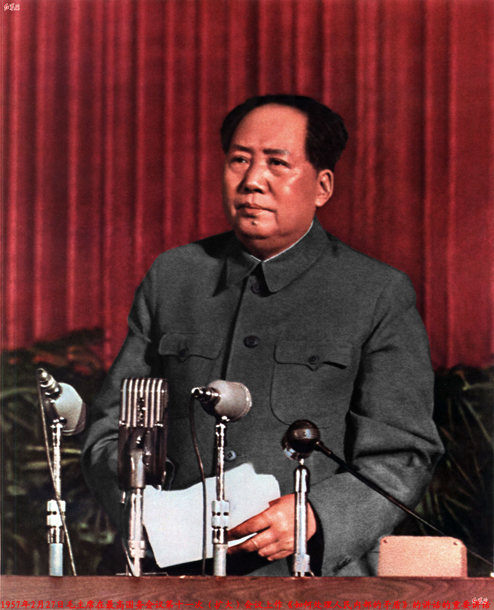

# 关于正确处理人民内部矛盾的问题

一九五七年二月二十七日

> 这是毛泽东同志在最高国务会议第十一次（扩大）会议上的讲话。后来毛泽东根据原始记录加以整理，作了若干补充，一九五七年六月十九日在《人民日报》发表。

关于正确处理人民内部矛盾的问题，这是一个总题目。为了叙述的方便，分为十二个小题目。在这里，也要说到敌我矛盾的问题，但是重点是讨论人民内部的矛盾问题。

# 一 两类不同性质的矛盾

我们的国家现在是空前统一的。资产阶级民主革命和社会主义革命的胜利，以及社会主义建设的成就，迅速地改变了旧中国的面貌。祖国的更加美好的将来，正摆在我们的面前。人民所厌恶的国家分裂和混乱的局面，已经一去不复返了。我国的六亿人民正在工人阶级和共产党的领导下，团结一致地进行着伟大的社会主义建设。国家的统一，人民的团结，国内各民族的团结，这是我们的事业必定要胜利的基本保证。但是，这并不是说在我们的社会里已经没有任何的矛盾了。没有矛盾的想法是不符合客观实际的天真的想法。在我们的面前有两类社会矛盾，这就是敌我之间的矛盾和人民内部的矛盾。这是性质完全不同的两类矛盾。

为了正确地认识敌我之间和人民内部这两类不同的矛盾应该首先弄清楚什么是人民，什么是敌人。人民这个概念在不同的国家和各个国家的不同的历史时期，有着不同的内容。拿我国的情况来说，在抗日战争时期，一切抗日的阶级、阶层和社会集团都属于人民的范围，日本帝国主义、汉奸、亲日派都是人民的敌人。在解放战争时期，美帝国主义和它的走狗即官僚资产阶级、地主阶级以及代表这些阶级的国民党反动派，都是人民的敌人；一切反对这些敌人的阶级、阶层和社会集团，都属于人民的范围。在现阶段，在建设社会主义的时期，一切赞成、拥护和参加社会主义建设事业的阶级、阶层和社会集团，都属于人民的范围；一切反抗社会主义革命和敌视、破坏社会主义建设的社会势力和社会集团，都是人民的敌人。

敌我之间的矛盾是对抗性的矛盾。人民内部的矛盾，在劳动人民之间说来，是非对抗性的；在被剥削阶级和剥削阶级之间说来，除了对抗性的一面以外，还有非对抗性的一面。人民内部的矛盾不是现在才有的，但是在各个革命时期和社会主义建设时期有着不同的内容。在我国现在的条件下，所谓人民内部的矛盾，包括工人阶级内部的矛盾，农民阶级内部的矛盾，知识分子内部的矛盾，工农两个阶级之间的矛盾，工人、农民同知识分子之间的矛盾，工人阶级和其他劳动人民同民族资产阶级之间的矛盾，民族资产阶级内部的矛盾，等等。我们的人民政府是真正代表人民利益的政府，是为人民服务的政府，但是它同人民群众之间也有一定的矛盾。这种矛盾包括国家利益、集体利益同个人利益之间的矛盾，民主同集中的矛盾，领导同被领导之间的矛盾，国家机关某些工作人员的官僚主义作风同群众之间的矛盾。这种矛盾也是人民内部的一个矛盾。一般说来，人民内部的矛盾，是在人民利益根本一致的基础上的矛盾。

在我们国家里，工人阶级同民族资产阶级的矛盾属于人民内部的矛盾。工人阶级和民族资产阶级的阶级斗争一般地属于人民内部的阶级斗争，这是因为我国的民族资产阶级有两面性。在资产阶级民主革命时期，它有革命性的一面，又有妥协性的一面。在社会主义革命时期，它有剥削工人阶级取得利润的一面，又有拥护宪法、愿意接受社会主义改造的一面。民族资产阶级和帝国主义、地主阶级、官僚资产阶级不同。工人阶级和民族资产阶级之间存在着剥削和被剥削的矛盾，这本来是对抗性的矛盾。但是在我国的具体条件下，这两个阶级的对抗性的矛盾如果处理得当，可以转变为非对抗性的矛盾，可以用和平的方法解决这个矛盾。如果我们处理不当，不是对民族资产阶级采取团结、批评、教育的政策，或者民族资产阶级不接受我们的这个政策，那末工人阶级同民族资产阶级之间的矛盾就会变成敌我之间的矛盾。

敌我之间和人民内部这两类矛盾的性质不同，解决的方法也不同。简单地说起来，前者是分清敌我的问题，后者是分清是非的问题。当然，敌我问题也是一种是非问题。比如我们同帝国主义、封建主义、官僚资本主义这些内外反动派，究竟谁是谁非，也是是非问题，但是这是和人民内部问题性质不同的另一类是非问题。

我们的国家是工人阶级领导的以工农联盟为基础的人民民主专政的国家。这个专政是干什么的呢？专政的第一个作用，就是压迫国家内部的反动阶级、反动派和反抗社会主义革命的剥削者，压迫那些对于社会主义建设的破坏者，就是为了解决国内敌我之间的矛盾。例如逮捕某些反革命分子并且将他们判罪，在一个时期内不给地主阶级分子和官僚资产阶级分子以选举权，不给他们发表言论的自由权利，都是属于专政的范围。为了维护社会秩序和广大人民的利益，对于那些盗窃犯、诈骗犯、杀人放火犯、流氓集团和各种严重破坏社会秩序的坏分子，也必须实行专政。专政还有第二个作用，就是防御国家外部敌人的颠覆活动和可能的侵略。在这种情况出现的时候，专政就担负着对外解决敌我之间的矛盾的任务。专政的目的是为了保卫全体人民进行和平劳动，将我国建设成为一个具有现代工业、现代农业和现代科学文化的社会主义国家。谁来行使专政呢？当然是工人阶级和在它领导下的人民。专政的制度不适用于人民内部。人民自己不能向自己专政，不能由一部分人民去压迫另一部分人民。人民中间的犯法分子也要受到法律的制裁，但是，这和压迫人民的敌人的专政是有原则区别的。在人民内部是实行民主集中制。我们的宪法规定：中华人民共和国公民有言论、出版、集会、结社、游行、示威、宗教信仰等等自由。我们的宪法又规定：国家机关实行民主集中制，国家机关必须依靠人民群众，国家机关工作人员必须为人民服务。我们的这个社会主义的民主是任何资产阶级国家所不可能有的最广大的民主。我们的专政，叫做工人阶级领导的以工农联盟为基础的人民民主专政。这就表明，在人民内部实行民主制度，而由工人阶级团结全体有公民权的人民，首先是农民，向着反动阶级、反动派和反抗社会主义改造和社会主义建设的分子实行专政。所谓有公民权，在政治方面，就是说有自由和民主的权利。

但是这个自由是有领导的自由，这个民主是集中指导下的民主，不是无政府状态。无政府状态不符合人民的利益和愿望。

匈牙利事件[1](#f1)发生以后，我国有些人感到高兴。他们希望在中国也出现一个那样的事件，有成千上万的人上街，去反对人民政府。他们的这种希望是同人民群众的利益相违反的，是不可能得到人民群众支持的。匈牙利的一部分群众受了国内外反革命力量的欺骗，错误地用暴力行为来对付人民政府，结果使得国家和人民都吃了亏。几个星期的骚乱，给予经济方面的损失，需要长时间才能恢复。我国另有一些人在匈牙利问题上表现动摇，是因为他们不懂得世界上的具体情况。他们以为在我们的人民民主制度下自由太少了，不如西方的议会民主制度自由多。他们要求实行西方的两党制，这一党在台上，那一党在台下。但是这种所谓两党制不过是维护资产阶级专政的一种方法，它绝不能保障劳动人民的自由权利。实际上，世界上只有具体的自由，具体的民主，没有抽象的自由，抽象的民主。在阶级斗争的社会里，有了剥削阶级剥削劳动人民的自由，就没有劳动人民不受剥削的自由。有了资产阶级的民主，就没有无产阶级和劳动人民的民主。有些资本主义国家也容许共产党合法存在，但是以不危害资产阶级的根本利益为限度，超过这个限度就不容许了。要求抽象的自由、抽象的民主的人们认为民主是目的，而不承认民主是手段。民主这个东西，有时看来似乎是目的，实际上，只是一种手段。马克思主义告诉我们，民主属于上层建筑，属于政治这个范畴。这就是说，归根结蒂，它是为经济基础服务的。自由也是这样。民主自由都是相对的，不是绝对的，都是在历史上发生和发展的。在人民内部，民主是对集中而言，自由是对纪律而言。这些都是一个统一体的两个矛盾着的侧面，它们是矛盾的，又是统一的，我们不应当片面地强调某一个侧面而否定另一个侧面。在人民内部，不可以没有自由，也不可以没有纪律；不可以没有民主，也不可以没有集中。这种民主和集中的统一，自由和纪律的统一，就是我们的民主集中制。在这个制度下，人民享受着广泛的民主和自由；同时又必须用社会主义的纪律约束自己。这些道理，广大人民群众是懂得的。

我们主张有领导的自由，主张集中指导下的民主，这在任何意义上都不是说，人民内部的思想问题、是非的辨别问题，可以用强制的方法去解决。企图用行政命令的方法，用强制的方法解决思想问题，是非问题，不但没有效力，而且是有害的。我们不能用行政命令去消灭宗教，不能强制人们不信教。不能强制人们放弃唯心主义，也不能强制人们相信马克思主义。凡属于思想性质的问题，凡属于人民内部的争论问题，只能用民主的方法去解决，只能用讨论的方法、批评的方法、说服教育的方法去解决，而不能用强制的、压服的方法去解决。人民为了有效地进行生产、进行学习和有秩序地过生活，要求自己的政府、生产的领导者、文化教育机关的领导者发布各种适当的带强制性的行政命令。没有这种行政命令，社会秩序就无法维持，这是人们的常识所了解的。这同用说服教育的方法去解决人民内部的矛盾，是相辅相成的两个方面。为着维持社会秩序的目的而发布的行政命令，也要伴之以说服教育，单靠行政命令，在许多情况下就行不通。

在一九四二年，我们曾经把解决人民内部矛盾的这种民主的方法，具体化为一个公式，叫做“团结——批评——团结”。讲详细一点，就是从团结的愿望出发，经过批评或者斗争使矛盾得到解决，从而在新的基础上达到新的团结。按照我们的经验，这是解决人民内部矛盾的一个正确的方法。一九四二年，我们采用了这个方法解决共产党内部的矛盾，就是教条主义者和广大党员群众之间的矛盾，教条主义思想和马克思主义思想之间的矛盾。“左”倾教条主义者从前采用的党内斗争方法叫做“残酷斗争，无情打击”。这是一个错误的方法。我们在批评“左”倾教条主义的时候，就没有采取这个老方法，而采取了一个新方法，就是从团结的愿望出发，经过批评或者斗争，分清是非，在新的基础上达到新的团结。这个方法是在一九四二年整风的时候采用的。经过几年之后，到一九四五年中国共产党召开第七次全国代表大会的时候，果然达到了全党团结的目的，因此就取得了人民革命的伟大胜利。在这里，首先需要从团结的愿望出发。因为如果在主观上没有团结的愿望，一斗势必把事情斗乱，不可收拾，那还不是“残酷斗争，无情打击”？那还有什么党的团结？从这个经验里，我们找到了一个公式：团结一一批评一一团结。或者说，惩前宓后，治病救人。我们把这个方法推广到了党外。在各抗日根据地里，我们处理领导和群众的关系，处理军民关系、官兵关系、几部分军队之间的关系、几部分干部之间的关系，都采用了这个方法，并且得到了伟大的成功。这个问题，在我们党的历史上，还可以追溯到更远。自从一九二七年我们在南方建立革命军队和革命根据地开始，关于处理党群关系、军民关系、官兵关系以及其他人民内部关系，就是采用这个方法的。不过到了抗日时期，我们就把这个方法建立在更加自觉的基础之上了。全国解放以后，我们对民主党派和工商界也采取了“团结——批评——团结”这个方法。我们现在的任务，就是要在整个人民内部继续推广和更好地运用这个方法，要求所有的工厂、合作社、商店、学校、机关、团体，总之，六亿人口，都采用这个方法去解决他们内部的矛盾。

在一般情况下，人民内部的矛盾不是对抗性的。但是如果处理得不适当，或者失去警觉，麻痹大意，也可能发生对抗。这种情况，在社会主义国家通常只是局部的暂时的现象。这是因为社会主义国家消灭了人剥削人的制度，人民的利益在根本上是一致的。匈牙利事件所表现的那种范围相当宽广的对抗行动，是因为有内外反革命因素在起作用的缘故。这是一种特殊的也是暂时的现象。社会主义国家内部的反动派同帝国主义者互相勾结，利用人民内部的矛盾，挑拨离间，兴风作浪，企图实现他们的阴谋。匈牙利事件的这种教训，值得大家注意。

许多人觉得，提出采用民主方法解决人民内部矛盾的问题，是一个新的问题。事实并不是这样。马克思主义者从来就认为无产阶级的事业只能依靠人民群众，共产党人在劳动人民中间进行工作的时候必须采取民主的说服教育的方法，决不允许采取命令主义态度和强制手段。中国共产党忠实地遵守马克思列宁主义的这个原则。我们历来就主张，在人民民主专政下面，解决敌我之间的和人民内部的这两类不同性质的矛盾，采用专政和民主这样两种不同的方法。这个意思，在我们党的过去的许多文件里和党的许多负责人的言论里，曾经说得很多。我在一九四九年所写的《论人民民主专政》里曾经说过：“对人民内部的民主方面和对反动派的专政方面，互相结合起来，就是人民民主专政”，解决人民内部的问题，“使用的方法，是民主的即说服的方法，而不是强迫的方法”。我在一九五〇年六月第二次政治协商会议上的讲话里，又说过：“人民民主专政有两个方法。对敌人说来是用专政的方法，就是说在必要的时期内，不让他们参与政治活动，强迫他们服从人民政府的法律，强迫他们从事劳动并在劳动中改造他们成为新人。对人民说来则与此相反，不是用强迫的方法，而是用民主的方法，就是说必须让他们参与政治活动，不是强迫他们做这样做那样，而是用民主的方法向他们进行教育和说服的工作。这种教育工作是人民内部的自我教育工作，批评和自我批评的方法就是自我教育的基本方法。”过去我们已经多次讲过用民主方法解决人民内部矛盾这个问题，并且在工作中基本上就是这样做的，很多干部和人民都在实际上懂得这个问题。为什么现在又有人觉得这是一个新问题呢？这是因为过去国内外的敌我斗争很尖锐，人民内部矛盾还不像现在这样被人们注意的缘故。

许多人对于敌我之间的和人民内部的这两类性质不同的矛盾分辨不清，容易混淆在一起。应该承认，这两类矛盾有时是容易混淆的。我们在过去工作中也曾经混淆过。在肃清反革命分子的工作中，错误地把好人当坏人，这种情形，从前有过，现在也还有。我们的错误没有扩大化，是由于我们在政策中规定了必须分清敌我，错了就要平反。

马克思主义的哲学认为，对立统一规律是宇宙的根本规律。这个规律，不论在自然界、人类社会和人们的思想中，都是普遍存在的。矛盾着的对立面又统一，又斗争，由此推动事物的运动和变化。矛盾是普遍存在的，不过按事物的性质不同，矛盾的性质也就不同。对于任何一个具体的事物说来，对立的统一是有条件的、暂时的、过渡的，因而是相对的，对立的斗争则是绝对的。这个规律，列宁讲得很清楚。这个规律，在我国，懂得的人逐渐多起来了。但是，对于许多人说来，承认这个规律是一回事，应用这个规律去观察问题和处理问题又是一回事。许多人不敢公开承认我国人民内部还存在着矛盾，正是这些矛盾推动着我们的社会向前发展。许多人不承认社会主义社会还有矛盾，因而使得他们在社会矛盾面前缩手缩脚，处于被动地位；不懂得在不断地正确处理和解决矛盾的过程中，将会使社会主义社会内部的统一和团结日益巩固。这样，就有必要在我国人民中，首先是在干部中，进行解释，引导人们认识社会主义社会中的矛盾，并且懂得采取正确的方法处理这种矛盾。

社会主义社会的矛盾同旧社会的矛盾，例如同资本主义社会的矛盾，是根本不相同的。资本主义社会的矛盾表现为剧烈的对抗和冲突，表现为剧烈的阶级斗争，那种矛盾不可能由资本主义制度本身来解决，而只有社会主义革命才能够加以解决。社会主义社会的矛盾是另一回事，恰恰相反，它不是对性的矛盾，它可以经过社会主义制度本身，不断地得到解决。

在社会主义社会中，基本的矛盾仍然是生产关系和生产力之间的矛盾，上层建筑和经济基础之间的矛盾。不过社会主义社会的这些矛盾，同旧社会的生产关系和生产力的矛盾、上层建筑和经济基础的矛盾，具有根本不同的性质和情况罢了。我国现在的社会制度比较旧时代的社会制度要优胜得多。如果不优胜，旧制度就不会被推翻，新制度就不可能建立。所谓社会主义生产关系比较旧时代生产关系更能够适合生产力发展的性质，就是指能够容许生产力以旧社会所没有的速度迅速发展，因而生产不断扩大，因而使人民不断增长的需要能够逐步得到满足的这样一种情况。旧中国在帝国主义、封建主义和官僚资本主义的统治下，生产力的发展一直是非常缓慢的。解放前五十多年间，全国除东北外，钢的生产一直只有几万吨；加上东北，全国的最高年产量也不过是九十多万吨。在一九四九年，全国钢产量只有十几万吨。但是全国解放不过七年，钢的生产便已达到四百几十万吨。旧中国几乎没有机器制造业，更没有汽车制造业和飞机制造业，而这些现在都建立起来了。当人民推翻了帝国主义、封建主义和官僚资本主义的统治之后，中国要向哪里去？向资本主义，还是向社会主义？有许多人在这个问题上的思想是不清楚的。事实已经回答了这个问题：只有社会主义能够救中国。社会主义制度促进了我国生产力的突飞猛进的发展，这一点，甚至连国外的敌人也不能不承认了。

但是，我国的社会主义制度还刚刚建立，还没有完全建成，还不完全巩固。在工商业的公私合营企业中，资本家还拿取定息[2](#f2)，也就是还有剥削；就所有制这点上说，这类企业还不是完全的社会主义性质的。农业生产合作社和手工业生产合作社有一部分也还是半社会主义性质的；完全社会主义化的合作社在所有制的某些个别问题上，还需要继续解决。在各经济部门中的生产和交换的相互关系，还在按照社会主义的原则逐步建立，逐步找寻比较适当的形式。在全民所有制经济和集体所有制经济里面，在这两种社会主义经济形式之间，积累和消费的分配问题是一个复杂的问题，也不容易一下子解决得完全合理。总之，社会主义生产关系已经建立起来，它是和生产力的发展相适应的；但是，它又还很不完善，这些不完善的方面和生产力的发展又是相矛盾的。除了生产关系和生产力发展的这种又相适应又相矛盾的情况以外，还有上层建筑和经济基础的又相适应又相矛盾的情况。人民民主专政的国家制度和法律，以马克思列宁主义为指导的社会主义意识形态，这些上层建筑对于我国社会主义改造的胜利和社会主义劳动组织的建立起了积极的推动作用，它是和社会主义的经济基础即社会主义的生产关系相适应的；但是，资产阶级意识形态的存在，国家机构中某些官僚主义作风的存在，国家制度中某些环节上缺陷的存在，又是和社会主义的经济基础相矛盾的。我们今后必须按照具体的情况，继续解决上述的各种矛盾。当然，在解决这些矛盾以后，又会出现新的问题。新的矛盾，又需要人们去解决。例如，在客观上将会长期存在的社会生产和社会需要之间的矛盾，就需要人们时常经过国家计划去调节。我国每年作一次经济计划，安排积累和消费的适当比例，求得生产和需要之间的平衡。所谓平衡，就是矛盾的暂时的相对的统一。过了一年，就整个说来，这种平衡就被矛盾的斗争所打破了，这种统一就变化了，平衡成为不平衡，统一成为不统一，又需要作第二年的平衡和统一。这就是我们计划经济的优越性。事实上，每月每季都在局部地打破这种平衡和统一，需要作出局部的调整。有时因为主观安排不符合客观情况，发生矛盾，破坏平衡，这就叫做犯错误。矛盾不断出现，又不断解决，就是事物发展的辩证规律。

现在的情况是：革命时期的大规模的急风暴雨式的群众阶级斗争基本结束，但是阶级斗争还没有完全结束；广大群众一面欢迎新制度，一面又还感到还不大习惯；政府工作人员经验也还不够丰富，对一些具体政策的问题，应当继续考察和探索。这就是说，我们的社会主义制度还需要有一个继续建立和巩固的过程，人民群众对于这个新制度还需要有一个习惯的过程，国家工作人员也需要一个学习和取得经验的过程。在这个时候，我们提出划分敌我和人民内部两类矛盾的界限，提出正确处理人民内部矛盾的问题，以便团结全国各族人民进行一场新的战争一一向自然界开战，发展我们的经济，发展我们的文化，使全体人民比较顺利地走过目前的过渡时期，巩固我们的新制度，建设我们的新国家，就是十分必要的了。

# 二 肃反问题

肃清反革命分子的问题是敌我矛盾的斗争问题。在人民内部，有些人对于肃反问题的看法，也有一些不同。有两种人的意见，和我们的意见不相同。有右倾思想的人不分敌我，认敌为我。广大群众认为是敌人的人，他们却认为是朋友。有“左”倾思想的人则把敌我矛盾扩大化，以至把某些人民内部的矛盾也看作敌我矛盾，把某些本来不是反革命的人也看作反革命。这两种看法都是错误的，都不能正确地处理肃反问题，也不能正确地估计我们的肃反工作。

为了正确地估计我国的肃反工作，我们不妨看一看匈牙利事件对于我们国家的影响。匈牙利事件发生以后，在我国一部分知识分子中有些动荡，但是没有引起什么风浪。这是什么原因呢？应该说，原因之一，就是我们相当彻底地肃清了反革命。

当然，我们国家的巩固，首先不是由于肃反。我们国家的巩固，首先是由于我们有经过几十年革命斗争锻炼的共产党和解放军，有经过几十年革命斗争锻炼的劳动人民。我们的党和军队是在群众中生了根的，是在长期革命火焰中锻炼出来的是有战斗力的。我们的人民共和国是经过革命根据地逐步发展起来的，不是突然建立起来的。有些民主人士也受过不同程度的锻炼，同我们共过患难。有些知识分子经历过反对帝国主义和反动势力的斗争的锻炼，许多人经历过解放以后的以分清敌我界限为目标的思想改造。此外，我们国家的巩固，还由于我们的经济措施根本上是正确的；人民生活是稳定的，并且逐步有所改善；我们对于民族资产阶级和其他阶级的政策，也是正确的，等等。但是，我们在肃清反革命方面的成功，无疑是我们国家巩固的重要原因之一。由于这一切，我们的大学生虽然还有许多人是非劳动人民家庭出身的子女，但是除了少数例外，都是爱国的，都是拥护社会主义的，他们在匈牙利事件时期没有发生波动。民族资产阶级也是这样。更不要说工农基本群众了。

解放以后，我们肃清了一批反革命分子。一些有严重罪行的反革命分子被处了死刑。这是完全必要的，这是广大群众的要求，这是为了解放长期被反革命分子和各种恶霸分子压迫的广大群众，也就是为了解放生产力。我们如果不这样做，人民群众就会抬不起头来。从一九五六年以来，情况就根本改变了。就全国说来，反革命分子的主要力量已经肃清。我们的根本任务已经由解放生产力变为在新的生产关系下面保护和发展生产力。有些人不了解我们今天的政策适合于今天的情况，过去的政策适合于过去的情况，想利用今天的政策去翻过去的案，想否定过去肃反工作的巨大成绩，这是完全错误的，这是人民群众所不允许的。

我们的肃反工作，成绩是主要的，但是也有错误。过火的，漏掉的，都有。我们的方针是：“有反必肃，有错必纠”。我们在肃反工作中的路线是群众肃反的路线。采取了群众路线，工作中当然也会发生毛病，但是毛病会比较少一些，错误会比较容易纠正些。群众在斗争中得到了经验。做得正确，得了做得正确的经验。犯了错误，也得了犯错误的经验。

在肃反工作中，凡是已经发现了的错误，我们都已经采取了或者正在采取纠正的步骤。没有发现的，一经发现，我们就准备纠正。原来在什么范围内弄错的，也应该在什么范围内宣布平反。我提议今年或者明年对于肃反工作全面检查一次，总结经验，发扬正气，打击歪风[3](#f3)。中央由人大常委会和政协常委会主持，地方由省市人民委员会和政协委员会主持。在检查工作的时候，我们对广大干部和积极分子不要泼冷水，而要帮助他们。向广大干部和积极分子泼冷水是不对的。但是发现了错误，一定要改正。无论公安部门、检察部门、司法部门、监狱、劳动改造的管理机关，都应该采取这个态度。我们希望人大常务委员、政协委员、人民代表，凡是有可能的，都参加这样的检查。这对于健全我们的法制，对于正确处理反革命分子和其他犯罪分子，会有帮助的。

目前关于反革命分子的情况，可以用这样两句话来说明：还有反革命，但是不多了。首先是还有反革命。有人说，已经没有了，天下太平了，可以把枕头塞得高高地睡觉了。这是不合事实的。事实是还有（当然不是说每一个地方每一个单位都有），还必须继续和他们作斗争。必须懂得，没有肃清的暗藏的反革命分子是不会死心的，他们必定要乘机捣乱。美帝国主义者和蒋介石集团经常还在派遣特务到我们这里来进行破坏活动。原有的反革命分子肃清了，还可能出现一些新的反革命分子。如果我们丧失警惕性，那就会上大当，吃大亏。不管什么地方出现反革命分子捣乱，就应当坚决消灭他。但是就全国来说，反革命分子确实不多了。如果说现在全国还有很多反革命分子，这个意见也是错误的。如果接受这种估计，结果也会搞乱。

# 三 农业合作化问题

我国有五亿多农业人口，农民的情况如何，对于我国经济的发展和政权的巩固，关系极大。我认为，情况根本上是好的。合作化完成了，这就解决了我国社会主义工业化同个体农业经济之间的大矛盾。合作化迅速完成，有些人担心会不会出毛病。幸好，毛病有一些，不大，基本上是健全的。农民生产很起劲，虽然去年的水旱风灾比过去几年中哪一年都大，但是全国的粮食仍然增产。现在有一些人却在说合作化不行，合作化没有优越性，吹来了一股小台风。合作化究竟有没有优越性呢？今天会场上发的文件里面，有一个关于河北省遵化县王国藩合作社[4](#f4)的材料，大家可以看一看。这个合作社所在的地方是一个山地，历来很穷，年年靠人民政府运粮去救济。一九五三年开始办社的时候，人们把它叫做“穷棒子社”。经过了四年艰苦奋斗，一年一年好起来，绝大多数的社员成了余粮户。王国藩合作社能做到的，别的合作社，在正常情况下也应该能做到，或者时间长一点也应该能做到。由此可见，那些说合作化不好了的议论是没有根据的。

由此也可看出，合作社一定要在艰苦奋斗中建立起来。任何新生事物的成长都是要经过艰难曲折的。在社会主义事业中，要想不经过艰难曲折，不付出极大努力，总是一帆风顺，容易得到成功，这种想法，只是幻想。

积极拥护合作社的是些什么人呢？是绝大多数贫农和下中农，他们占农村人口百分之七十以上。其余的人，大多数也对合作社寄予希望。真正不满意的只占极少数。许多人没有分析这种情况，没有对合作社的成绩和缺点以及缺点产生的根源作全面的考察，把局部和片面当成了全体，这就在一些人中间刮起了一阵所谓合作社没有优越性的小台风。

要多少时间合作社才能巩固，认为合作社没有优越性的议论才会收场呢？根据许多合作社发展的经验来看，大概需要五年，或者还要多一点时间。现在，全国大多数的合作社还只有一年多的历史，我们就要求它们那么好，这是不合理的。依我看，第一个五年计划期内建成合作社，第二个五年计划期内合作社能得到巩固，那就很好了。

合作社正在经历一个逐步巩固的过程。它还存在着一些需要解决的矛盾。例如，在国家同合作社之间，在合作社内部，在合作社同合作社相互之间，都有一些矛盾需要解决。

我们必须经常注意从生产问题和分配问题上处理上述矛盾。在生产问题上，一方面，合作社经济要服从国家统一经济计划的领导，同时在不违背国家的统一计划和政策法令下保持自己一定的灵活性和独立性；另一方面，参加合作社的各个家庭，除了自留地和其他一部分个体经营的经济可以由自己作出适当的计划以外，都要服从合作社或者生产队的总计划。在分配问题上，我们必须兼顾国家利益、集体利益和个人利益。对于国家的税收、合作社的积累、农民的个人收入这三方面的关系，必须处理适当，经常注意调节其中的矛盾。国家要积累，合作社也要积累，但是都不能过多。我们要尽可能使农民能够在正常年景下，从增加生产中逐年增加个人收入。

许多人说农民苦，这种意见对不对呢？就一方面说来是对的。这就是说，由于我国被帝国主义者和他们的代理人压迫剥削了一百多年，变成一个很穷的国家，不但农民的生活水平低，工人和知识分子的生活水平也都还低。要有几十年时间，经过艰苦的努力，才能将全体人民的生活水平逐步提高起来。这样说“苦”就恰当了。就另一方面说来是不对的。这就是说，解放七年以来，农民生活没有改善，单单改善了工人的生活。其实，工人农民的生活，除极少数人以外，都已经有了一些改善。解放以来，农民免除了地主的剥削，生产逐年发展。以粮食为例，一九四九年全国产粮只有二千一百几十亿斤，到一九五六年产粮达到三千六百几十亿斤，增加了将近一千五百亿斤。国家征收的农业税并不算重，每年只有三百多亿斤。每年以正常价格从农民那里购粮也只有五百多亿斤。两项共八百几十亿斤。这些粮食销售在农村和农村附近的集镇的，占了一半以上。由此看来，不能说农民生活没有改善。我们准备在几年内，把征粮和购粮的数量大体上稳定在八百几十亿斤的水平上，使农业得到发展，使合作社得到巩固，使现在还存在的农村中一小部分缺粮户不再缺粮，除了专门经营经济作物的某些农户以外，统统变为余粮户或者自给户，使农村中没有了贫农，使全体农民达到中农和中农以上的生活水平。至于简单地拿农民每人每年平均所得和工人每人每年平均所得相比较，说一个低了，一个高了，这是不适当的。工人的劳动生产率比农民高得多，而农民的生活费用比城市工人又省得多，所以不能说工人特别得到国家的优待。有少部分工人的工资以及有些国家机关工作人员的工资是高了一些，农民看了不满意是有理由的，斟酌情况作一些适当的调整，是必要的。

# 四 工商业者问题

我国社会制度的改革，除了农业合作化和手工业合作化以外，私营工商业改变为公私合营企业，也在一九五六年完成了。这件事所以做得这样迅速和顺利，是跟我们把工人阶级同民族资产阶级之间的矛盾当做人民内部矛盾来处理，密切相关的。这个阶级矛盾是否完全解决了呢？还没有。还要经过相当的时间才能够完全解决。但是现在有些人说：资本家已经改造得和工人差不多了，用不着再改造了。甚至有人说，资本家比工人还要高明一点。也有人说，如果要改造，为什么工人阶级不改造？这些议论对不对呢？当然不对。

在建设社会主义社会的过程中，人人需要改造，剥削者要改造，劳动者也要改造，谁说工人阶级不要改造？当然，剥削者的改造和劳动者的改造是两种不同性质的改造，不能混为一谈。工人阶级要在阶级斗争中和向自然界的斗争中改造整个社会，同时也就改造自己。工人阶级必须在工作中不断学习，逐步克服自己的缺点，永远也不能停止。拿我们这些人来说，很多人每年都有一些进步，也就是说，每年都在改造。我这个人从前就有过各种非马克思主义的思想，马克思主义是后来才接受的。我在书本上学了一点马克思主义，初步地改造了自己的思想，但是主要的还是在长期阶级斗争中改造过来的。而且今后还要继续学习，才能再有一些进步，否则就要落后了。难道资本家就那么高明，反而再不需要改造了吗？

有人说，中国资产阶级现在已经没有两面性了，只有一面性。这是不是事实呢？不是事实。一方面，资产阶级分子已经成为公私合营企业中的管理人员，正处在由剥削者变为自食其力的劳动者的转变过程中；另一方面，他们现在还在公私合营的企业中拿定息，这就是说，他们的剥削根子还没有脱离。他们同工人阶级的思想感情、生活习惯还有一个不小的距离。怎么能说已经没有了两面性呢？就是不拿定息，摘掉了资产阶级的帽子，也还需要一个相当的时间继续进行思想改造。如果认为资产阶级已经没有了两面性，那末资本家的改造和学习的任务也就没有了。

应该说，这种意见不仅不符合工商业者的实际情况，也不符合工商业者大多数人的愿望。在过去几年中，大多数工商业者都是愿意学习的，并且有了显著的进步。工商业者的彻底改造必须是在工作中间，他们应当在企业内同职工一起劳动，把企业作为自我改造的基地。但是经过学习改变自己的某些旧观点，也是重要的。工商业者的学习，应当以自愿为基础。许多工商业者在讲习班里学习了几十天，回到工厂，同工人群众和公方代表有了更多的共同的语言，改善了共同工作的条件。他们从亲身的经验懂得，继续学习，继续改造自己，对于他们是有益的。刚才所说的那种认为不需要学习，不需要改造的意见，并不能代表工商业者中大多数人的意见，只是少数人的意见。

# 五 知识分子问题

我国人民内部的矛盾，在知识分子中间也表现出来了。过去为旧社会服务的几百万知识分子，现在转到为新社会服务，这里就存在着他们如何适应新社会需要和我们如何帮助他们适应新社会需要的问题。这也是人民内部的一个矛盾。

我国知识分子的大多数，在过去七年中已经有了显著的进步。他们表示赞成社会主义制度。他们中间有许多人正在用功学习马克思主义，有一部分人已经成为共产主义者。这部分人目前虽然还是少数，但是正在逐渐增多。当然，知识分子中间有一些人现在仍然怀疑或者不同意社会主义，这部分人只占少数。

我国的艰巨的社会主义建设事业，需要尽可能多的知识分子为它服务。凡是真正愿意为社会主义事业服务的知识分子，我们都应当给予信任，从根本上改善同他们的关系，帮助他们解决各种必须解决的问题，使他们得以积极地发挥他们的才能。我们有许多同志不善于团结知识分子，用生硬的态度对待他们，不尊重他们的劳动，在科学文化工作中不适当地干预那些不应当干预的事务。所有这些缺点必须加以克服。

广大的知识分子虽然已经有了进步，但是不应当因此自满。为了充分适应新社会的需要，为了同工人农民团结一致，知识分子必须继续改造自己，逐步地抛弃资产阶级的世界观而树立无产阶级的、共产主义的世界观。世界观的转变是一个根本的转变，现在多数知识分子还不能说已经完成了这个转变。我们希望我国的知识分子继续前进，在自己的工作和学习的过程中，逐步地树立共产主义的世界观，逐步地学好马克思列宁主义，逐步地同工人农民打成一片，而不要中途停顿，更不要向后倒退，倒退是没有出路的。由于我国的社会制度已经起了变化，资产阶级思想的经济基础已经基本上消灭了，这就使大量知识分子的世界观不但有了改变的必要，而且有了改变的可能。但是世界观的彻底改变需要一个很长的时间，我们应当耐心地做工作，不能急躁。事实上必定会有一些人在思想上始终不愿意接受马克思列宁主义，不愿意接受共产主义，对于这一部分人不要苛求；只要他们服从国家的要求，从事正常的劳动，我们就应当给他们以适当工作的机会。

在知识分子和青年学生中间，最近一个时期，思想政治工作减弱了，出现了一些偏向。在一些人的眼中，好像什么政治，什么祖国的前途、人类的理想，都没有关心的必要。好像马克思主义行时了一阵，现在就不那么行时了。针对着这种情况，现在需要加强思想政治工作。不论是知识分子，还是青年学生，都应该努力学习。除了学习专业之外，在思想上要有所进步，政治上也要有所进步，这就需要学习马克思主义，学习时事政治。没有正确的政治观点，就等于没有灵魂。过去的思想改造是必要的，收到了积极的效果。但是在做法上有些粗糙，伤了一些人，这是不好的。这个缺点，今后必须避免。思想政治工作，各个部门都要负责任。共产党应该管，青年团应该管，政府主管部门应该管，学校的校长教师更应该管。我们的教育方针，应该使受教育者在德育、智育、体育几方面都得到发展，成为有社会主义觉悟的有文化的劳动者。要提倡勤俭建国。要使全体青年们懂得，我们的国家现在还是一个很穷的国家，并且不可能在短时间内根本改变这种状态，全靠青年和全体人民在几十年时间内，团结奋斗，用自己的双手创造出一个富强的国家。社会主义制度的建立给我们开辟了一条到达理想境界的道路，而理想境界的实现还要靠我们的辛勤劳动。有些青年人以为到了社会主义社会就应当什么都好了，就可以不费气力享受现成的幸福生活了，这是一种不实际的想法。

# 六 少数民族问题

我国少数民族有三千多万人，虽然只占全国总人口的百分之六，但是居住地区广大，约占全国总面积的百分之五十至六十。所以汉族和少数民族的关系一定要搞好。这个问题的关键是克服大汉族主义。在存在有地方民族主义的少数民族中间，则应当同时克服地方民族主义。无论是大汉族主义或者地方民族主义，都不利于各族人民的团结，这是应当克服的一种人民内部的矛盾。在这一方面，我们已经做了一些工作，在大多数少数民族地区民族关系比较从前大有改进，但是仍然存在着一些尚待解决的问题。在一部分地区，大汉族主义和地方民族主义都还严重地存在，必须给以足够的注意。经过各族人民几年来的努力，我国少数民族地区绝大部分都已经基本上完成了民主改革和社会主义改造。西藏由于条件还不成熟，还没有进行民主改革。按照中央和西藏地方政府的十七条协议，社会制度的改革必须实行，但是何时实行，要待西藏大多数人民群众和领袖人物认为可行的时候，才能作出决定，不能性急。现在已决定在第二个五年计划期间不进行改革。在第三个五年计划期内是否进行改革，要到那时看情况才能决定[5](#f5)。

# 七 统筹兼顾、适当安排

这里所说的统筹兼顾，是指对于六亿人口的统筹兼顾。我们作计划、办事、想问题，都要从我国有六亿人口这一点出发，千万不要忘记这一点。为什么要提出这样一个问题，难道还有人不知道我国有六亿人口吗？知道是知道的，不过办起事来有些人就忘记了，似乎人越少越好，圈子紧缩得越小越好。抱有这种小圈子主义的人们，对于这样一种思想是抵触的：调动一切积极因素，团结一切可能团结的人，并且尽可能地将消极因素转变为积极因素，为建设社会主义社会这个伟大的事业服务。我希望这些人扩大眼界，真正承认我国有六亿人口，承认这是一个客观存在，这是我们的本钱。我国人多，是好事，当然也有困难。我们各方面的建设事业都在蓬勃地发展着，成绩很大，但是，在目前社会大变动的过渡时期，困难问题还是很多的。又发展又困难，这就是矛盾。任何矛盾不但应当解决，也是完全可以解决的。我们的方针是统筹兼顾、适当安排。无论粮食问题，灾荒问题，就业问题，教育问题，知识分子问题，各种爱国力量的统一战线问题，少数民族问题，以及其他各项问题，都要从对全体人民的统筹兼顾这个观点出发，就当时当地的实际可能条件，同各方面的人协商，作出各种适当的安排。决不可以嫌人多，嫌人落后，嫌事情麻烦难办，推出门外了事。我这样说，是不是要把一切人一切事都由政府包下来呢？当然不是。许多人，许多事，可以由社会团体想办法，可以由群众直接想办法，他们是能够想出很多好的办法来的。而这也就包括在统筹兼顾、适当安排的方针之内，我们应当指导社会团体和各地群众这样做。

# 八 关于百花齐放、百家争鸣、长期共存、互相监督

百花齐放，百家争鸣，长期共存，互相监督，这几个口号是怎样提出来的呢？它是根据中国的具体情况提出来的，是在承认社会主义社会仍然存在着各种矛盾的基础上提出来的，是在国家需要迅速发展经济和文化的迫切要求上提出来的。百花齐放、百家争鸣的方针，是促进艺术发展和科学进步的方针，是促进我国的社会主义文化繁荣的方针。艺术上不同的形式和风格可以自由发展，科学上不同的学派可以自由争论。利用行政力量，强制推行一种风格，一种学派，禁止另一种风格，另一种学派，我们认为会有害于艺术和科学的发展。艺术和科学中的是非问题，应当通过艺术界科学界的自由讨论去解决，通过艺术和科学的实践去解决，而不应当采取简单的方法去解决。为了判断正确的东西和错误的东西，常常需要有考验的时间。历史上新的正确的东西，在开始的时候常常得不到多数人承认，只能在斗争中曲折地发展。正确的东西，好的东西，人们一开始常常不承认它们是香花，反而把它们看作毒草。哥白尼关于太阳系的学说[6](#f6)，达尔文的进化论[7](#f7)，都曾经被看作是错误的东西，都曾经经历艰苦的斗争。我国历史上也有许多这样的事例。同旧社会比较起来，在社会主义社会中，新生事物的成长条件，和过去根本不同了，好得多了。但是压抑新生力量，压抑合理的意见，仍然是常有的事。不是由于有意压抑，只是由于鉴别不清，也会妨碍新生事物的成长。因此，对于科学上、艺术上的是非，应当保持慎重的态度，提倡自由讨论，不要轻率地作结论。我们认为，采取这种态度可以帮助科学和艺术得到比较顺利的发展。

马克思主义也是在斗争中发展起来的。马克思主义在开始的时候受过种种打击，被认为是毒草。现在它在世界上的许多地方还在继续受打击，还被认为是毒草。在社会主义国家里，马克思主义的地位不同了。但是就是在社会主义国家，还是有非马克思主义的思想存在，也有反马克思主义的思想存在。在我国，虽然社会主义改造，在所有制方面说来，已经基本完成，革命时期的大规模的急风暴雨式的群众阶级斗争已经基本结束，但是，被推翻的地主买办阶级的残余还是存在，资产阶级还是存在，小资产阶级刚刚在改造。阶级斗争并没有结束。无产阶级和资产阶级之间的阶级斗争，各派政治力量之间的阶级斗争，无产阶级和资产阶级之间在意识形态方面的阶级斗争，还是长时期的，曲折的，有时甚至是很激烈的。无产阶级要按照自己的世界观改造世界，资产阶级也要按照自己的世界观改造世界。在这一方面，社会主义和资本主义之间谁胜谁负的问题还没有真正解决。无论在全人口中间，或者在知识分子中间，马克思主义者仍然是少数。因此，马克思主义仍然必须在斗争中发展。马克思主义必须在斗争中才能发展，不但过去是这样，现在是这样，将来也必然还是这样。正确的东西总是在同错误的东西作斗争的过程中发展起来的。真的、善的、美的东西总是在同假的、恶的、丑的东西相比较而存在，相斗争而发展的。当着某一种错误的东西被人类普遍地抛弃，某一种真理被人类普遍地接受的时候，更加新的真理又在同新的错误意见作斗争。这种斗争永远不会完结。这是真理发展的规律，当然也是马克思主义发展的规律。

我国社会主义和资本主义之间在意识形态方面的谁胜谁负的斗争，还需要一个相当长的时间才能解决。这是因为资产阶级和从旧社会来的知识分子的影响还要在我国长期存在，作为阶级的意识形态，还要在我国长期存在。如果对于这种形势认识不足，或者根本不认识，那就要犯绝大的错误，就会忽视必要的思想斗争。思想斗争同其他的斗争不同，它不能采取粗暴的强制的方法，只能用细致的讲理的方法。现在社会主义在意识形态的斗争中，具有优胜的条件。政权的基本力量是在无产阶级领导下的劳动人民手里。共产党有强大的力量和很高的威信。在我们的工作中尽管有缺点，有错误，但是每一个公正的人都可以看到，我们对人民是忠诚的，我们有决心有能力同人民在一起把祖国建设好，我们已经得到巨大的成就，并且将继续得到更巨大的成就。资产阶级分子和从旧社会来的知识分子的绝大多数都是爱国的，他们愿意为蒸蒸日上的社会主义祖国服务，并且懂得如果离开社会主义事业，离开共产党所领导的劳动人民，他们就会无所依靠，而不可能有任何光明的前途。

人们问：在我们国家里，马克思主义已经被大多数人承认为指导思想，那末，能不能对它加以批评呢？当然可以批评。马克思主义是一种科学真理，它是不怕批评的。如果马克思主义害怕批评，如果可以批评倒，那末马克思主义就没有用了。事实上，唯心主义者不是每天都在用各种形式批评马克思主义吗？抱着资产阶级思想、小资产阶级思想而不愿意改变的人们，不是也在用各种形式批评马克思主义吗？马克思主义者不应该害怕任何人批评。相反，马克思主义者就是要在人们的批评中间，就是要在斗争的风雨中间，锻炼自己，发展自己，扩大自己的阵地。同错误思想作斗争，好比种牛痘，经过了牛痘疫苗的作用，人身上就增强免疫力。在温室里培养出来的东西，不会有强大的生命力。实行百花齐放、百家争鸣的方针，并不会削弱马克思主义在思想界的领导地位，相反地正是会加强它的这种地位。

对于非马克思主义的思想，应该采取什么方针呢？对于明显的反革命分子，破坏社会主义事业的分子，事情好办，剥夺他们的言论自由就行了。对于人民内部的错误思想，情形就不相同。禁止这些思想，不允许这些思想有任何发表的机会，行不行呢？当然不行。对待人民内部的思想问题，对待精神世界的问题，用简单的方法去处理，不但不会收效，而且非常有害。不让发表错误意见，结果错误意见还是存在着。而正确的意见如果是在温室里培养出来的，如果没有见过风雨，没有取得免疫力，遇到错误意见就不能打胜仗。因此，只有采取讨论的方法，批评的方法，说理的方法，才能真正发展正确的意见，克服错误的意见，才能真正解决问题。

资产阶级、小资产阶级，他们的思想意识是一定要反映出来的。一定要在政治问题和思想问题上，用各种办法顽强地表现他们自己。要他们不反映不表现，是不可能的。我们不应当用压制的办法不让他们表现，而应当让他们表现，同时在他们表现的时候，和他们辩论，进行适当的批评。毫无疑问，我们应当批评各种各样的错误思想。不加批评，看着错误思想到处泛滥，任凭它们去占领市场，当然不行。有错误就得批判，有毒草就得进行斗争。但是这种批评不应当是教条主义的，不应当用形而上学方法，应当力求用辩证方法。要有科学的分析，要有充分的说服力。教条主义的批评不能解决问题。我们是反对一切毒草的，但是我们必须谨慎地辨别什么是真的毒草，什么是真的香花。我们要同群众一起来学会谨慎地辨别香花和毒草，并且一起来用正确的方法同毒草作斗争。

我们在批判教条主义的时候，必须同时注意对修正主义的批判。修正主义，或者右倾机会主义，是一种资产阶级思潮，它比教条主义有更大的危险性。修正主义者，右倾机会主义者，口头上也挂着马克思主义他们也在那里攻击“教条主义”。但是他们所攻击的正是马克思主义的最根本的东西。他们反对或者歪曲唯物论和辩证法，反对或者企图削弱人民民主专政和共产党的领导，反对或者企图削弱社会主义改造和社会主义建设。在我国社会主义革命取得基本胜利以后，社会上还有一部分人梦想恢复资本主义制度，他们要从各个方面向工人阶级进行斗争，包括思想方面的斗争。而在这个斗争中，修正主义者就是他们最好的助手。

百花齐放、百家争鸣这两个口号，就字面看，是没有阶级性的，无产阶级可以利用它们，资产阶级也可以利用它们，其他的人们也可以利用它们。所谓香花和毒草，各个阶级、阶层和社会集团也有各自的看法。那末，从广大人民群众的观点看来，究竟什么是我们今天辨别香花和毒草的标准呢？在我国人民的政治生活中，应当怎样来判断我们的言论和行动的是非呢？我们以为，根据我国的宪法的原则，根据我国最大多数人民的意志和我国各党派历次宣布的共同的政治主张，这种标准可以大致规定如下：（一）有利于团结全国各族人民，而不是分裂人民；（二）有利于社会主义改造和社会主义建设，而不是不利于社会主义改造和社会主义建设；（三）有利于巩固人民民主专政，而不是破坏或者削弱这个专政；（四）有利于巩固民主集中制，而不是破坏或者削弱这个制度；（五）有利于巩固共产党的领导，而不是摆脱或者削弱这种领导；（六）有利于社会主义的国际团结和全世界爱好和平人民的国际团结，而不是有损于这些团结。这六条标准中，最重要的是社会主义道路和党的领导两条。提出这些标准，是为了帮助人民发展对于各种问题的自由讨论，而不是为了妨碍这种讨论。不赞成这些标准的人们仍然可以提出自己的意见来辩论。但是大多数人有了明确的标准，就可以使批评和自我批评沿着正确的轨道前进，就可以用这些标准去鉴别人们的言论行动是否正确，究竟是香花还是毒草。这是一些政治标准。为了鉴别科学论点的正确或者错误，艺术作品的艺术水准如何，当然还需要一些各自的标准。但是这六条政治标准对于任何科学艺术的活动也都是适用的。在我国这样的社会主义国家里，难道有什么有益的科学艺术活动会违反这几条政治标准的吗？

以上所说的观点，都是从我国的具体的历史条件出发的。各个社会主义国家和各国共产党的情况各不相同。因此，我们并不认为，它们必须或者应当采取中国的做法。

“长期共存、互相监督”这个口号，也是我国具体的历史条件的产物。这个口号并不是突然提出来的，它已经经过了好几年的酝酿。长期共存的思想已经存在很久了。到去年，社会主义制度已基本建立，这些口号就明确地提出来了。为什么要让资产阶级和小资产阶级的民主党派同工人阶级政党长期共存呢？这是因为凡属一切确实致力于团结人民从事社会主义事业的、得到人民信任的党派，我们没有理由不对它们采取长期共存的方针。我在一九五〇年六月第二次政治协商会议上，就已经这样说过：“只要谁肯真正为人民效力，在人民还有困难的时期内确实帮了忙，做了好事，并且是一贯地做下去，并不半途而废，那末，人民和人民的政府是没有理由不要他的，是没有理由不给他以生活的机会和效力的机会的。”这里所说的，也就是各党派可以长期共存的政治基础。共产党同各民主党派长期共存，这是我们的愿望，也是我们的方针。至于各民主党派是否能够长期存在下去，不是单由共产党一方面的愿望作决定，还要看各民主党派自己的表现，要看它们是否取得人民的信任。各党派互相监督的事实，也早已存在，就是各党派互相提意见，作批评。所谓互相监督，当然不是单方面的，共产党可以监督民主党派，民主党派也可以监督共产党。为什么要让民主党派监督共产党呢？这是因为一个党同一个人一样，耳边很需要听到不同的声音。大家知道，主要监督共产党的是劳动人民和党员群众。但是有了民主党派，对我们更为有益。当然，各民主党派和共产党相互之间所提的意见，所作的批评，也只有在合乎我们在前面所说的六条政治标准的情况下，才能够发挥互相监督的积极作用。因此，我们希望各民主党派都能注意思想改造，争取和共产党一道长期共存，互相监督，以适应新社会的需要。

# 九 关于少数人闹事问题

一九五六年，在个别地方发生了少数工人学生罢工罢课的事件。这些人闹事的直接的原因，是有一些物质上的要求没有得到满足；而这些要求，有些是应当和可能解决的，有些是不适当的和要求过高、一时还不能解决的。但是发生闹事的更重要的因素，还是领导上的官僚主义。这种官僚主义的错误，有一些是要由上级机关负责，不能全怪下面。闹事的另一个原因是对于工人、学生缺乏思想政治教育。一九五六年，还有少数合作社社员闹社的事件，主要原因也是领导上的官僚主义和对于群众缺乏教育。

应该承认：有些群众往往容易注意当前的、局部的、个人的利益，而不了解或者不很了解长远的、全国性的、集体的利益。不少青年人由于缺少政治经验和社会生活经验，不善于把旧中国和新中国加以比较，不容易深切了解我国人民曾经怎样经历千辛万苦的斗争才摆脱了帝国主义和国民党反动派的压迫，而建立一个美好的社会主义社会要经过怎样的长时间的艰苦劳动。因此，需要在群众中间经常进行生动的、切实的政治教育，并且应当经常把发生的困难向他们作真实的说明，和他们一起研究如何解决困难的办法。

我们是不赞成闹事的，因为人民内部的矛盾可以用“团结——批评——团结”的方法去解决，而闹事总会要造成一些损失，不利于社会主义事业的发展。我们相信，我国广大的人民群众是拥护社会主义的，他们很守纪律，很讲道理，决不无故闹事。但是这并不是说，在我国已经没有了发生群众闹事的可能性。在这个问题上，我们应当注意的是：（一）为了从根本上消灭发生闹事的原因，必须坚决地克服官僚主义，很好地加强思想政治教育，恰当地处理各种矛盾。只要做到这一条，一般地就不会发生闹事的问题。（二）如果由于我们的工作做得不好，闹了事，那就应当把闹事的群众引向正确的道路，利用闹事来作为改善工作、教育干部和群众的一种特殊手段，解决平日所没有解决的问题。应当在处理闹事的过程中，进行细致的工作，不要用简单的方法去处理，不要“草率收兵”。对于闹事的带头人物，除了那些违犯刑法的分子和现行反革命分子应当法办以外，不应当轻易开除。在我们这样大的国家里，有少数人闹事，并不值得大惊小怪，倒是足以帮助我们克服官僚主义。

在我们社会里，也有少数不顾公共利益、蛮不讲理、行凶犯法的人。他们可能利用和歪曲我们的方针，故意提出无理的要求来煽动群众，或者故意造谣生事，破坏社会的正常秩序。对于这种人，我们并不赞成放纵他们。相反，必须给予必要的法律的制裁。惩治这种人是社会广大群众的要求，不予惩治则是违反群众意愿的。

# 十 坏事能否变成好事？

如像我在上面讲过的，在我们的社会中，群众闹事是坏事，是我们所不赞成的。但是这种事件发生以后，又可以促使我们接受教训，克服官僚主义，教育干部和群众。从这一点上说来，坏事也可以转变成为好事。乱子有二重性。我们可以用这个观点去看待一切乱子。

匈牙利事件不是好事，这是大家清楚的。但是它也有二重性。由于匈牙利的同志们在事件的发展过程中间处理得正确，结果匈牙利事件由坏事转变成了一件好事。匈牙利现在比过去巩固了，社会主义阵营各国也都得了教训。

同样，一九五六年下半年发生的反共反人民的世界性的风潮，当然是坏事。但是它教育了和锻炼了各国共产党和工人阶级，这就变成好事。在许多国家里，有一批人在这个风潮里退出了党。一部分党员退党，党的人数减少了，当然是坏事。但是也有一方面的好处。那些动摇分子不愿意继续干下去了，退走了，大多数坚定的党员更好团结奋斗，为什么不好呢？

总之，我们必须学会全面地看问题，不但要看到事物的正面，也要看到它的反面。在一定的条件下，坏的东西可以引出好的结果，好的东西也可以引出坏的结果。老子在二千多年以前就说过："祸兮福所倚，福兮祸所伏。”[8](#f8)日本打到中国，日本人叫胜利。中国大片土地被侵占，中国人叫失败。但是在中国的失败里面包含着胜利，在日本的胜利里面包含着失败。历史难道不是这样证明了吗？

现在世界各国的人们都在谈论着会不会打第三次世界大战。对于这个问题，我们也要有精神准备，也要有分析。我们是坚持和平反对战争的。但是，如果帝国主义一定要发动战争，我们也不要害怕。我们对待这个问题的态度，同对待一切“乱子”的态度一样，第一条，反对；第二条，不怕。第一次世界大战以后，出了一个苏联，两亿人口。第二次世界大战以后，出了一个社会主义阵营，一共九亿人口。如果帝国主义者一定要发动第三次世界大战，可以断定，其结果必定又要有多少亿人口转到社会主义方面，帝国主义剩下的地盘就不多了，也有可能整个帝国主义制度全部崩溃。

矛盾着的对立的双方互相斗争的结果，无不在一定条件下互相转化。在这里，条件是重要的。没有一定的条件，斗争着的双方都不会转化。世界上最愿意改变自己地位的是无产阶级，其次是半无产阶级，因为一则全无所有，一则有也不多。现在美国操纵联合国的多数票和控制世界很多地方的局面只是暂时的，这个局面总有一天要起变化。中国的穷国地位和在国际上无权的地位也会起变化，穷国将变为富国，无权将变为有权——向相反的方向转化。在这里，决定的条件就是社会主义制度和人民团结一致的奋斗。

# 十一 关于节约

我想在这里谈一下节约的问题。我们要进行大规模的建设，但是我国还是一个很穷的国家，这是一个矛盾。全面地持久地厉行节约，就是解决这个矛盾的一个方法。

在一九五二年“三反”运动中，我们反对过贪污、浪费和官僚主义，而着重在反对贪污。一九五五年提倡过节约，重点是在非生产性的基本建设中反对了过高的标准，在工业生产中节约原料，成绩很大。那时，节约的方针还没有在国民经济各部门中认真地推行，也没有在一般机关、部队、学校、人民团体中认真地推行。今年要求在全国各方面提倡节约，反对浪费。我们对建设工作还缺乏经验。在过去几年有很大的成绩，同时也有浪费。我们必须逐步地建设一批规模大的现代化的企业以为骨干，没有这个骨干就不能使我国在几十年内变为现代化的工业强国。但是多数企业不应当这样做，应当更多地建立中小型企业，并且应当充分利用旧社会遗留下来的工业基础，力求节省，用较少的钱办较多的事。在去年十一月中共二中全会更着重地提出了厉行节约反对浪费的方针[9](#f9)以后，几个月来已经开始发生效果。这一次节约运动必须彻底地持久地进行。反对浪费，同批判其他缺点错误一样，好比洗脸。人不是每天都要洗脸吗？中国共产党、民主党派、无党派民主人士、知识分子、工商业者、工人、农民、手工业者，总之，我们六亿人口都要实行增产节约，反对铺张浪费。这不但在经济上有重大意义，在政治上也有重大意义。在我们的许多工作人员中间，现在滋长着一种不愿意和群众同甘苦，喜欢计较个人名利的危险倾向，这是很不好的。我们在增产节约运动中要求精简机关，下放干部，使相当大的一批干部回到生产中去，就是克服这种危险倾向的一个方法。要使全体干部和全体人民经常想到我国是一个社会主义的大国，但又是一个经济落后的穷国，这是一个很大的矛盾。要使我国富强起来，需要几十年艰苦奋斗的时间，其中包括执行厉行节约、反对浪费这样一个勤俭建国的方针。

# 十二 中国工业化的道路

这里所讲的工业化道路的问题，主要是指重工业、轻工业和农业的发展关系问题。我国的经济建设是以重工业为中心，这一点必须肯定。但是同时必须充分注意发展农业和轻工业。

我国是一个大农业国，农村人口占全国人口的百分之八十以上，发展工业必须和发展农业同时并举，工业才有原料和市场，才有可能为建立强大的重工业积累较多的资金。大家知道，轻工业和农业有极密切的关系。没有农业，就没有轻工业。重工业要以农业为重要市场这一点，目前还没有使人们看得很清楚。但是随着农业的技术改革逐步发展，农业的日益现代化，为农业服务的机械、肥料、水利建设、电力建设、运输建设、民用燃料、民用建筑材料等等将日益增多，重工业以农业为重要市场的情况，将会易于为人们所理解。在第二个五年计划和第三个五年计划期间，如果我们的农业能够有更大的发展，使轻工业相应地有更多的发展，这对于整个国民经济会有好处。农业和轻工业发展了，重工业有了市场，有了资金，它就会更快地发展。这样，看起来工业化的速度似乎慢一些，但是实际上不会慢，或者反而可能快一些。经过三个五年计划，或者再多一些时间，我国的钢产量仍然可能由解放前最高年产量，即一九四三年的九十多万吨，发展到二千万吨，或者更多一点。这样，城乡人民都会感到高兴。

关于经济问题今天不准备多讲。经济建设我们还缺乏经验，因为才进行七年，还需要积累经验。对于革命我们开始也没有经验，翻过斤斗，取得了经验，然后才有全国的胜利。我们要求在取得经济建设方面的经验，比较取得革命经验的时间要缩短一些，同时不要花费那么高的代价。代价总是需要的，就是希望不要有革命时期所付的代价那么高。必须懂得，在这个问题上是存在着矛盾的，即社会主义社会经济发展的客观规律和我们主观认识之间的矛盾，这需要在实践中去解决。这个矛盾，也将表现为人同人之间的矛盾，即比较正确地反映客观规律的一些人同比较不正确地反映客观规律的一些人之间的矛盾，因此也是人民内部的矛盾。一切矛盾都是客观存在的，我们的任务在于尽可能正确地反映它和解决它。

为了使我国变为工业国，我们必须认真学习苏联的先进经验。苏联建设社会主义已经有四十年了，它的经验对于我们是十分宝贵的。大家看吧，谁给我们设计和装备了这么多的重要工厂呢？美国给我们没有？英国给我们没有？他们都不给。只有苏联肯这样做，因为它是社会主义国家，是我们的同盟国家。除了苏联以外，东欧一些兄弟国家也给了我们一些帮助。完全不错，一切国家的好经验我们都要学，不管是社会主义国家的，还是资本主义国家的，这一点是肯定的。但是主要的还是要学苏联。学习有两种态度。一种是教条主义的态度，不管我国情况，适用的和不适用的，一起搬来。这种态度不好。另一种态度，学习的时候用脑筋想一下，学那些和我国情况相适合的东西，即吸取对我们有益的经验，我们需要的是这样一种态度。

巩固同苏联的团结，巩固同一切社会主义国家的团结，这是我们的基本方针，基本利益所在。再就是亚非国家以及一切爱好和平的国家和人民，我们应当巩固和发展同他们的团结。有了这两种力量的团结，我们就不孤立了。至于帝国主义国家，我们也要团结那里的人民，并且争取同那些国家和平共处，做些生意，制止可能发生的战争，但是决不可以对他们怀抱一些不切实际的想法。

# 附录

<b id="f1">[[1]](#a1)</b> 指一九五六年十月发生在匈牙利的反革命叛乱事件。一九五六年十月下旬，帝国主义在东欧的一个社会主义国家匈牙利策动了反革命暴动，大肆屠杀革命人民和共产党员，一度占领了匈牙利首都布达佩斯。帝国主义妄想从匈牙利打开社会主义阵营的一个缺口，从而各个击破社会主义国家。十一月四日，匈牙利人民成立了工农革命政府，得到苏联红军的援助，在社会主义阵营各国和全世界进步力量的同情和支持下，粉碎了反革命复辟的阴谋。

<b id="f2">[[2]](#a2)</b> 定息是我国在社会主义改造过程中，国家对民族资产阶级的生产资料实行赎买政策的一种形式。一九五六年资本主义工商业全行业公私合营以后，国家按照资本家的资产，在一定时期内，每年付给他们固定息率的股息，叫做定息。定息仍然属于剥削的性质。

<b id="f3">[[3]](#a3)</b> 一九五七年，中央和地方各级政府根据毛泽东同志的这个提议，对于肃反工作做了一次全面检查。检查的结果证明，我国的肃反斗争取得了伟大的成就，肃反斗争中处理的案件绝大部分都是正确的，只有极其个别的错误，而且一经发现即已纠正。一九五七年夏季，资产阶级右派分子利用检查肃反工作的机会兴风作浪，企图否定肃反成绩和攻击党的肃反政策。他们的这一阴谋，在全国人民的反对下，未能得逞。

<b id="f4">[[4]](#a4)</b> 王国藩合作社，即河北省遵化县西四十里铺村建明农林牧生产合作社。这个社在社长王国藩领导下，以“勤俭办社”闻名全国。一九五八年九月，王国藩合作社发展成为建明人民公社，王国藩担任公社社长。

<b id="f5">[[5]](#a5)</b> 西藏的民主改革，后来提前实行。西藏地方政府和西藏上层反动分子同帝国主义者和外国干涉者勾结，经过长时间的策划和准备，在一九五九年三月十九日发动了全面的武装叛乱。人民解放军在藏族广大爱国僧俗人民的积极协助下，迅速平定了西藏叛乱。随着，西藏广大地区实行了民主改革，西藏人民即从最黑暗、最野蛮的农奴制度中解放出来。

<b id="f6">[[6]](#a6)</b> 哥白尼(一四七三年-五四三年)，波兰天文学家。哥白尼在《天体运行论》一书中，证明地球绕自己的轴旋转，并和其他行星一起，围绕着太阳旋转，推翻了数千年来地球不动的学说。

<b id="f7">[[7]](#a7)</b> 达尔文(一八。九年-八八二年)，著名的英国生物学家。达尔文在他的《通过自然选择的物种起源》等著作中，提出了进化论的学说，揭示了生物的起源、变异和发展的规律。

<b id="f8">[[8]](#a8)</b> 见《老子・五十八章》。

<b id="f9">[[9]](#a9)</b> 指一九五五年七月四日，中共中央《关于厉行节约的决定》。决定中说：“根据检查，目前在基本建设中，企业经营管理中，各机关、学校、企业部队的办公开支和生活设施中，均存在着严重的浪费现象，这是违背社会主义工业化和社会主义改造的要求的，这同中央历来强调的厉行节约的方针和我党一贯的艰苦奋斗的作风是不相容的，这是社会主义建设中的最危险的事件之一，必须坚决地加以纠正。”